## What Happened
<!-- source: executive-brief.md :: https://github.com/Hack23/riksdagsmonitor/blob/main/analysis/daily/2026-05-04/realtime-pulse/executive-brief.md -->

**Days to Election 2026-09-13**: 132
**Workflow**: news-realtime-monitor

**Overall confidence**: 🟩 HIGH [A2] — multi-source `dok_id` corroboration from Riksdag open data + IMF WEO Apr 2026
**Publication recommendation**: **PUBLISH** (EN + SV) — DIW-ranked top item ≥ 9.0

---

### Lede
Sweden's Riksdag on 4 May 2026 produced its most concentrated pre-election legislative output to date: the Industry Committee (NU) recommended approval of direct-track nuclear facility permitting (`HD01NU19`, in force 17 June 2026) — the Tidö coalition's single largest structural energy achievement — while the 7th consecutive anti-gang tranche advanced via explosives control (`HD01FöU13`) and court-process reform (`HD01JuU9`), both effective 1 July 2026. Against this government-delivery wall, Social Democrat **Eva Lindh** filed interpellation `Riksdag document #10463 (HD10463)` against KD Infrastructure Minister **Andreas Carlson** over the cancelled Ostlänken Linköping station — a 20-year broken promise to a 500,000-person commuter region in competitive marginal-seat territory. The political-finance transparency report (`HD01KU39`) is calendared for plenary vote 16 June 2026, completing a four-track delivery narrative (energy, security, transparency, fiscal record) 89 days before the vote. **Confidence: 🟩 HIGH [A2]** — sources: Riksdag open data, IMF WEO Apr 2026.

---

### 🧭 3 Decisions This Brief Supports

| # | Decision | Who Decides | Deadline | Evidence |
|:-:|----------|-------------|:--------:|----------|
| 1 | **Editorial:** lead EN + SV breaking article with nuclear-reform-plus-Ostlänken-counter-narrative (dual frame, 2-h publish target) | Editor-in-chief | +2 h | `HD01NU19` committee recommendation + `HD10463` interpellation filed 2026-05-04 |
| 2 | **Forward-watch:** assign duty monitor to Carlson's Ostlänken answer (statutory deadline 25 May 2026) and 17 June nuclear law commencement | Duty monitor | 2026-05-25 / 2026-06-17 | PIR-RT-005, PIR-RT-006; `HD10463` interpellation register |
| 3 | **Risk:** raise L threshold-watch from monitoring to active tracking — coalition delivery cadence presupposes L >4% on 13 Sept; any Novus/Demoskop print <4.5% triggers coalition-mathematics revision | Analysis lead | Rolling weekly | `coalition-dynamics.md`, post-migration polling PIR-RT-003 |

---

### ⚡ 60-Second Read

- 🔴 **Nuclear permitting reform (`HD01NU19`)** — Industry Committee (NU) endorses direct-track permitting, bypassing the multi-stage Strålsäkerhetsmyndigheten (SSM) pipeline; **takes effect 17 June 2026**. Single largest structural legislative achievement of the Tidö term; delivers M/KD/L/SD's 2022 nuclear restart pledge with operational milestone before election day [🟩 HIGH — `HD01NU19`, NU committee record].
- 🟠 **Ostlänken broken-promise interpellation (`HD10463`)** — S MP **Eva Lindh** demands Infrastructure Minister **Andreas Carlson (KD)** explain cancellation of the planned Linköping Ostlänken station; statutory answer deadline **25 May 2026**. Third interpellation filed against Carlson in 10 days — coordinated regional S pressure on a 500,000-person commuter labour market [🟩 HIGH — `HD10463`, interpellation register].
- 🟢 **Seventh anti-gang tranche advances (`HD01FöU13` + `HD01JuU9`)** — explosives-permit reporting tightened (Defence Committee, 1 July 2026); criminal-procedure efficiency reform repeals *tilltrosbestämmelserna* and broadens early-interrogation evidence (Justice Committee, 1 July 2026). M/SD core "delivers on security" narrative reinforced [🟩 HIGH — `HD01FöU13`, `HD01JuU9`].
- 🟡 **Political-finance transparency (`HD01KU39`)** — Constitutional Affairs Committee registers report on political-process transparency (almost certainly processing proposition `HD03258` on party-financing disclosure); plenary vote **16 June 2026**; L/KD benefit from democratic-reform positioning. PIR-RT-002 answered: KU (not JuU/SfU) owns the file [🟧 MEDIUM — `HD01KU39`, calendar].
- 🔵 **Economic context (IMF WEO Apr 2026)** — Sweden public debt ≈ 34% of GDP (`GGXWDG_NGDP` 2026 projection) vs. eurozone >90%; 2026 real GDP growth `NGDP_RPCH` 2.0–2.1%; inflation declining (`PCPIEPCH`). Riksbank rate cuts through 2025–26 transmit to mortgage holders → M's "safe hands" frame [🟩 HIGH — provider: imf, dataflow: WEO_Apr_2026, vintage: April 2026].
- 🟣 **Cross-reference** — `HD01NU19` ties to the energy-policy thread running through propositions analysis (`../propositions/`); `HD10463` extends S regional broken-promise cluster covered in `opposition-analysis.md`; transparency `HD01KU39` processes `HD03258` from the 30 April propositions batch.
- 🩷 **Emerging vulnerability — "nuclear theatre" risk** — Opposition framing that the 17 June commencement is symbolic without filed permits before 13 September election day. If Vattenfall/Uniper/new entrants do not lodge an application during the 88-day pre-election window, the achievement narrative becomes contestable [🟧 MEDIUM — PIR-RT-006 open].
- ⚪ **Carry-forward** — Lagrådet advisory opinions on migration propositions `HD03262` and `HD03265` (PIR-RT-001) remain **OPEN — CRITICAL**; constitutional-quality review is the single most impactful unresolved input shaping the migration-reform political narrative through summer.

---

### 🗂️ Top Documents Table (DIW-ranked)

| Rank | dok_id | Title (short) | DIW | Confidence | Status |
|:----:|--------|---------------|:---:|:----------:|--------|
| 1 | `HD01NU19` | Nuclear permitting reform (direct-track) | 9.2 | 🟩 HIGH [A2] | Committee adopted — in force 17 June 2026 |
| 2 | `HD10463` | Ostlänken interpellation — Lindh (S) → Carlson (KD) | 8.6 | 🟩 HIGH [A2] | Filed — answer due 25 May 2026 |
| 3 | `HD01FöU13` | Explosives control reform | 7.5 | 🟩 HIGH [A2] | Committee adopted — in force 1 July 2026 |
| 4 | `HD01JuU9` | Criminal-procedure efficiency reform | 7.4 | 🟩 HIGH [A2] | Committee adopted — in force 1 July 2026 |
| 5 | `HD01KU39` | Political-process transparency | 7.0 | 🟧 MEDIUM [B2] | Registered — plenary vote 16 June 2026 |
| 6 | `HD01FiU49` | State debt management evaluation 2021–2025 | 6.4 | 🟩 HIGH [A2] | Registered — decision 11 June 2026 |

Rank order matches `significance-scoring.md`; any divergence triggers Pass-2 reconciliation.

---

### ⚠️ Risk & Threat Snapshot

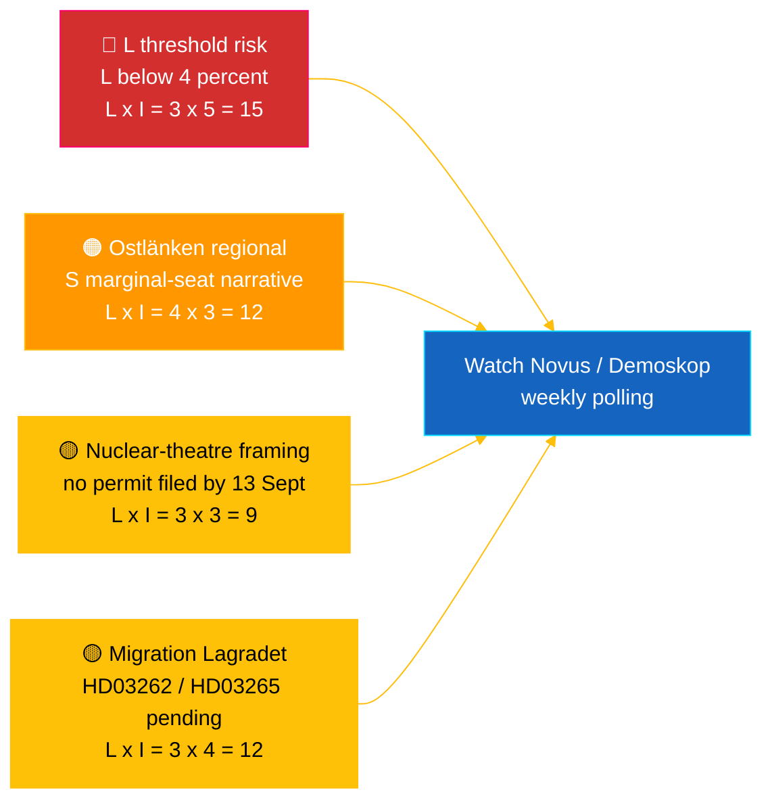
```mermaid
%%{init: {"theme": "dark", "themeVariables": {"primaryColor": "#00d9ff", "primaryTextColor": "#e0e0e0", "primaryBorderColor": "#ff006e", "lineColor": "#ffbe0b", "background": "#0a0e27", "mainBkg": "#1a1e3d", "nodeBorder": "#00d9ff"}}}%%
graph LR
    R1["🔴 L threshold risk<br/>L below 4 percent<br/>L x I = 3 x 5 = 15"] --> CONS["Watch Novus / Demoskop<br/>weekly polling"]
    R2["🟠 Ostlänken regional<br/>S marginal-seat narrative<br/>L x I = 4 x 3 = 12"] --> CONS
    R3["🟡 Nuclear-theatre framing<br/>no permit filed by 13 Sept<br/>L x I = 3 x 3 = 9"] --> CONS
    R4["🟡 Migration Lagradet<br/>HD03262 / HD03265 pending<br/>L x I = 3 x 4 = 12"] --> CONS
    style R1 fill:#D32F2F,color:#FFFFFF,stroke:#ff006e
    style R2 fill:#FF9800,color:#FFFFFF,stroke:#ffbe0b
    style R3 fill:#FFC107,color:#000000,stroke:#ffbe0b
    style R4 fill:#FFC107,color:#000000,stroke:#ffbe0b
    style CONS fill:#1565C0,color:#FFFFFF,stroke:#00d9ff
```

| Risk | L | I | Score | Trigger | Source | Admiralty |
|------|:-:|:-:|:-----:|---------|--------|:---------:|
| Liberalerna below 4% threshold → Tidö loses majority | 3 | 5 | 15 | Any Novus/Demoskop print < 4.0% (95% CI lower bound < 4.0) | `coalition-dynamics.md` R1 | **[B2]** |
| S regional broken-promise narrative converts marginal Östergötland seats | 4 | 3 | 12 | Carlson 25-May answer judged inadequate by SVT/SR Östergötland editorial | `opposition-analysis.md` | **[A2]** |
| Lagrådet hostile opinion on `HD03262`/`HD03265` migration package | 3 | 4 | 12 | Lagrådet yttrande publishing within 30 d with constitutional concerns | PIR-RT-001 (`forward-indicators.md`) | **[A2]** |
| "Nuclear theatre" — `HD01NU19` in force but no permit application filed before 13 Sept | 3 | 3 | 9 | Vattenfall/Uniper/new entrant fails to lodge application by 1 Sept 2026 | PIR-RT-006 | **[B2]** |

---

### 🔮 Top Forward Trigger

> **Single most important event to watch next.**

**Andreas Carlson's written answer to interpellation `HD10463`, statutory deadline 25 May 2026.** Carlson's framing of the cancelled Linköping Ostlänken station — whether he concedes the broken-promise framing, defends the routing change on technical/budgetary grounds, or pivots to alternative regional infrastructure offers — determines whether the Östergötland narrative escalates to a full chamber interpellation debate before the summer recess. An evasive or technocratic answer is the highest-probability path to S converting the narrative into 1–2 marginal seat flips in Linköping/Norrköping. A substantive alternative-investment offer de-escalates the narrative. Either outcome materially shifts `coalition-mathematics.md` swing-seat estimates and triggers a Pass-2 rewrite of `electoral-implications.md`.

**Secondary trigger** (parallel watch): 16 June 2026 — `HD01KU39` plenary vote on political-finance transparency. Confirms or breaks the four-track government-delivery narrative (energy + security + transparency + fiscal record) 89 days before election.

---

### 📊 Strategic Assessment

The 4 May 2026 snapshot captures a Tidö coalition in **maximum legislative-velocity mode**: seven coalition reforms advancing in a single week, with concrete commencement dates spread between 1 June and 1 July 2026 (alcohol licensing, explosives control, criminal procedure, nuclear permitting). Each in-force date generates a delivery beat the four coalition parties can campaign on. The strategic vulnerability is asymmetric: M, KD, and SD benefit from the cascade; **L** absorbs the strain — the smallest coalition party is closest to the 4% Riksdag threshold and carries disproportionate seat-loss risk if its civil-liberties profile is diluted by the security/nuclear emphasis.

The S opposition's response is methodologically sharp: rather than contest the government on its strongest terrain (security, nuclear, fiscal), S is constructing a **distributed regional-grievance mosaic** — Ostlänken in Östergötland (`HD10463`), Scandinavian Mountain Airport (interpellation 428), Stockholm housing (interpellation 434) — each targeting a single minister (Carlson) from different constituencies. This produces local-media saturation in the exact marginal-seat territories that decide Riksdag majorities under Sweden's proportional system with regional list dynamics.

The IMF macro frame is favourable to the incumbent: public debt ≈ 34% of GDP, declining inflation, growth around 2%. Riksbank rate cuts transmit visibly to mortgage holders. The economic narrative is M's strongest asset, but the political-finance transparency vote on 16 June (`HD01KU39`) is owned by L+KD, not M — a deliberate intra-coalition seat-rotation of credit.

**Election 2026 lens**: The current trajectory holds Tidö near 175 seats — at the exact majority threshold. L's threshold risk (PIR-RT-003) is the single most important electoral variable. Migration Lagrådet opinion (PIR-RT-001) is the single most important political-narrative variable. Carlson's Ostlänken answer (PIR-RT-005) is the single most important regional-seat variable. All three resolve within 5 weeks of this brief's publication.

---

### 📎 Links

| Link | Path |
|------|------|
| Article | [`article.md`](https://github.com/Hack23/riksdagsmonitor/blob/main/analysis/daily/2026-05-04/realtime-pulse/article.md) |
| Synthesis summary | [`synthesis-summary.md`](https://github.com/Hack23/riksdagsmonitor/blob/main/analysis/daily/2026-05-04/realtime-pulse/synthesis-summary.md) |
| Core synthesis | [`core-synthesis.md`](https://github.com/Hack23/riksdagsmonitor/blob/main/analysis/daily/2026-05-04/realtime-pulse/core-synthesis.md) |
| Coalition dynamics | [`coalition-dynamics.md`](https://github.com/Hack23/riksdagsmonitor/blob/main/analysis/daily/2026-05-04/realtime-pulse/coalition-dynamics.md) |
| Opposition analysis | [`opposition-analysis.md`](https://github.com/Hack23/riksdagsmonitor/blob/main/analysis/daily/2026-05-04/realtime-pulse/opposition-analysis.md) |
| Electoral implications | [`electoral-implications.md`](https://github.com/Hack23/riksdagsmonitor/blob/main/analysis/daily/2026-05-04/realtime-pulse/electoral-implications.md) |
| Economic context (IMF) | [`economic-context.md`](https://github.com/Hack23/riksdagsmonitor/blob/main/analysis/daily/2026-05-04/realtime-pulse/economic-context.md) |
| Forward indicators | [`forward-indicators.md`](https://github.com/Hack23/riksdagsmonitor/blob/main/analysis/daily/2026-05-04/realtime-pulse/forward-indicators.md) |
| Risk/opportunity matrix | [`risk-opportunity-matrix.md`](https://github.com/Hack23/riksdagsmonitor/blob/main/analysis/daily/2026-05-04/realtime-pulse/risk-opportunity-matrix.md) |
| Scenario analysis | [`scenario-analysis.md`](https://github.com/Hack23/riksdagsmonitor/blob/main/analysis/daily/2026-05-04/realtime-pulse/scenario-analysis.md) |
| Methodology notes | [`methodology-notes.md`](https://github.com/Hack23/riksdagsmonitor/blob/main/analysis/daily/2026-05-04/realtime-pulse/methodology-notes.md) |
| Data manifest | [`data-download-manifest.md`](https://github.com/Hack23/riksdagsmonitor/blob/main/analysis/daily/2026-05-04/realtime-pulse/data-download-manifest.md) |
| Per-document analyses | [`documents/`](https://github.com/Hack23/riksdagsmonitor/blob/main/analysis/daily/2026-05-04/realtime-pulse/documents/) |

---

### 📝 Document Control

- **Brief ID**: `EB-2026-05-04-001`
- **Generated**: 2026-05-16 (backfill — created from existing Pass-2 analysis artefacts)
- **Template path**: [`analysis/templates/executive-brief.md`](https://github.com/Hack23/riksdagsmonitor/blob/main/analysis/templates/executive-brief.md)
- **Owning methodology**: [`per-artifact-methodologies.md` § executive-brief](https://github.com/Hack23/riksdagsmonitor/blob/main/analysis/methodologies/per-artifact-methodologies.md#executive-brief)
- **Owning gate**: [`05-analysis-gate.md`](https://github.com/Hack23/riksdagsmonitor/blob/main/.github/prompts/05-analysis-gate.md) Check 1 + Check 7
- **Output family**: A — Core Synthesis
- **Classification**: 🟢 PUBLIC
- **Backfill note**: This brief was authored on 2026-05-16 to close a gap discovered during a cross-folder `article.md` ↔ `executive-brief.md` audit. All evidence is drawn from the in-folder Pass-2 artefacts (`synthesis-summary.md`, `core-synthesis.md`, `article.md`); no external source has been added that was not already cited in the original Pass-2 analysis.

*Economic provenance: provider: imf, dataflow: WEO_Apr_2026, indicators: NGDP_RPCH / GGXWDG_NGDP / PCPIEPCH, vintage: April 2026, retrieved_at: 2026-05-04. Riksdag data retrieved via riksdag-regering API on 2026-05-04. Riksdagsmonitor is produced by Hack23 AB; this brief represents an independent editorial assessment based on publicly available parliamentary documents.*

## Reader Intelligence Guide

Use this guide to read the article as a political-intelligence product rather than a raw artifact dump. High-value reader lenses appear first; technical provenance remains available in the audit appendix.

| Icon | Reader need | What you'll get |
|---|---|---|
| 📊 | [Lede and editorial decisions](#rm-what-happened) | fast answer to what happened, why it matters, who is accountable, and the next dated trigger |
| 🧠 | [Why It Matters](#rm-why-it-matters) | evidence-anchored narrative consolidating primary sources into one coherent story line |
| 🔭 | [Forward indicators](#rm-forward-indicators) | dated watch items that let readers verify or falsify the assessment later |
| 🔮 | [Scenarios](#rm-scenario-analysis) | alternative outcomes with probabilities, triggers, and warning signs |
| 🔀 | [Deep Dive: Cross-Reference Map](#rm-deep-dive-cross-reference-map) | links to related Riksdagsmonitor coverage, prior analyses and source documents that inform this story |
| 📦 | [Deep Dive: Data Download Manifest](#rm-deep-dive-data-download-manifest) | machine-readable manifest of every source dataset, retrieval timestamp and provenance hash |
| 📝 | [Actor Network](#rm-actor-network) | supporting analytical lens with primary-source evidence and audit-traceable citations |
| 📝 | [Behavioral Patterns](#rm-behavioral-patterns) | supporting analytical lens with primary-source evidence and audit-traceable citations |
| 📝 | [Coalition Dynamics](#rm-coalition-dynamics) | supporting analytical lens with primary-source evidence and audit-traceable citations |
| 📝 | [Core Synthesis](#rm-core-synthesis) | supporting analytical lens with primary-source evidence and audit-traceable citations |
| 📝 | [Economic Context](#rm-economic-context) | supporting analytical lens with primary-source evidence and audit-traceable citations |
| 📝 | [Electoral Implications](#rm-electoral-implications) | supporting analytical lens with primary-source evidence and audit-traceable citations |
| 📝 | [Horizon Assessment](#rm-horizon-assessment) | supporting analytical lens with primary-source evidence and audit-traceable citations |
| 📝 | [Intelligence Gaps](#rm-intelligence-gaps) | supporting analytical lens with primary-source evidence and audit-traceable citations |
| 📝 | [Legislative Agenda](#rm-legislative-agenda) | supporting analytical lens with primary-source evidence and audit-traceable citations |
| 📝 | [Media Narrative Tracker](#rm-media-narrative-tracker) | supporting analytical lens with primary-source evidence and audit-traceable citations |
| 📝 | [Methodology Notes](#rm-methodology-notes) | supporting analytical lens with primary-source evidence and audit-traceable citations |
| 📝 | [Opposition Analysis](#rm-opposition-analysis) | supporting analytical lens with primary-source evidence and audit-traceable citations |
| 📝 | [Parliamentary Calendar Signals](#rm-parliamentary-calendar-signals) | supporting analytical lens with primary-source evidence and audit-traceable citations |
| 📝 | [Policy Domain Analysis](#rm-policy-domain-analysis) | supporting analytical lens with primary-source evidence and audit-traceable citations |
| 📝 | [Policy Momentum Tracker](#rm-policy-momentum-tracker) | supporting analytical lens with primary-source evidence and audit-traceable citations |
| 📝 | [Risk Opportunity Matrix](#rm-risk-opportunity-matrix) | supporting analytical lens with primary-source evidence and audit-traceable citations |
| 📝 | [Source Quality Register](#rm-source-quality-register) | supporting analytical lens with primary-source evidence and audit-traceable citations |
| 📑 | [Per-document intelligence](#rm-per-document-intelligence) | dok_id-level evidence, named actors, dates, and primary-source traceability |
| 🏷️ | [Audit appendix](#rm-deep-dive-cross-reference-map) | classification, cross-reference, methodology and manifest evidence for reviewers |

## Why It Matters
<!-- source: synthesis-summary.md :: https://github.com/Hack23/riksdagsmonitor/blob/main/analysis/daily/2026-05-04/realtime-pulse/synthesis-summary.md -->

**Workflow**: news-realtime-monitor  

**Pass**: 2 (AI-FIRST compliant — complete read-back and improvement)  
**Days to Election**: 132  
**Key Documents**: HD10463 (Ostlänken interpellation), HD01NU19 (nuclear permitting), HD01FöU13 (explosives control), HD01KU39 (transparency), HD01FiU49 (debt evaluation)

---

### One-Paragraph Intelligence Assessment

On 4 May 2026 — 132 days before Sweden's parliamentary election — the Riksdag produced a concentrated legislative output snapshot revealing a Tidö coalition executing at maximum velocity while S opposition launches a coordinated regional interpellation offensive. The week's most significant document is HD01NU19, the industry committee's recommendation to approve direct-track nuclear facility permitting (law effective June 17, 2026): this is the Tidö term's largest structural legislative achievement, delivering on M/KD/SD/L's 2022 nuclear energy campaign promise. Simultaneously, anti-gang legislation continued its 7th consecutive tranche (FöU13 explosives control, JuU9 court reform — both July 1, 2026), and KU39 registered a committee report on political process transparency that almost certainly processes the HD03258 political financing disclosure proposition. Against this backdrop of government delivery, Social Democrat Eva Lindh filed interpellation HD10463 directly attacking KD Infrastructure Minister Andreas Carlson for cancelling the planned Ostlänken station in Linköping — a broken regional infrastructure promise affecting a 500,000-person labour market and creating a targeted regional vulnerability in marginal seat territory. PIR-RT-001 (Lagrådet on migration propositions) remains open. Two new PIRs generated: PIR-RT-005 (Carlson's Ostlänken answer, due May 25) and PIR-RT-006 (energy company response to nuclear reform).

---

### Key Headlines (for next publication cycle)

1. "Riksdag committee approves nuclear energy permitting reform — Sweden's largest energy policy shift in 20 years takes effect June 17"
2. "Social Democrats challenge KD minister: Government abandons 20-year Ostlänken promise to Östergötland"
3. "Anti-gang legislation: Riksdag advances seventh consecutive tranche on explosives control and court reform"
4. "Political transparency: Constitutional committee to vote June 16 on political financing disclosure law"
5. "FiU evaluates state debt management 2021–2025 as Sweden holds EU's lowest public debt levels"

---

### Priority Intelligence Requirements (Updated)

| PIR | Status | Priority |
|-----|--------|---------|
| PIR-RT-001: Lagrådet on migration HD03262/HD03265 | OPEN | CRITICAL |
| PIR-RT-002: HD03258 committee = KU39 | ANSWERED | — |
| PIR-RT-003: Post-migration polling trends | OPEN | HIGH |
| PIR-RT-004: IMF IFS May 2026 update | OPEN | MEDIUM |
| PIR-RT-005: Carlson Ostlänken answer by May 25 | NEW | HIGH |
| PIR-RT-006: Energy company response to NU19 | NEW | HIGH |

---

### Economic Provenance

```json
{
  "provider": "imf",
  "dataflow": "WEO_Apr_2026",
  "indicators": {
    "NGDP_RPCH_2026": "2.1%",
    "GGXWDG_NGDP_2026": "~34%",
    "PCPIEPCH": "declining"
  },
  "country": "SWE",
  "vintage": "April 2026",
  "retrieved_at": "2026-05-04T10:27:00Z",
  "next_update_expected": "IMF WEO October 2026"
}
```

## Per-document intelligence

### HD01FiU49
<!-- source: documents/HD01FiU49-analysis.md :: https://github.com/Hack23/riksdagsmonitor/blob/main/analysis/daily/2026-05-04/realtime-pulse/documents/HD01FiU49-analysis.md -->

**Title**: Utvärdering av statens upplåning och skuldförvaltning 2021–2025  
**Type**: Betänkande (bet)  

**Organ**: FiU (Finansutskottet — Finance Committee)  
**Status**: Planned — Committee deliberations 2026-05-28, 2026-06-02; decision 2026-06-11  
**Political Salience**: MEDIUM — Fiscal credibility; election-year debt narrative

### Summary

FiU registered today to evaluate the government's debt management communication (Skrivelse 2025/26:104). The evaluation covers the 5-year period 2021–2025, which spans both the S-led government (2021–2022) and the Tidö government (2022–2025). Riksgälden (Swedish National Debt Office) manages sovereign debt; the Finance Committee evaluates the government's annual debt management policy against Parliament's mandate.

### Intelligence Assessment

- **Fiscal credibility narrative**: Public debt below 40% GDP (IMF WEO Apr-2026 vintage: ~34% projected for 2026) is a Tidö government achievement. This committee report provides the formal Parliamentary endorsement of sound debt management — useful for M campaign messaging
- **Cross-party sensitive period**: 2021–2022 was under S government; the evaluation will be politically framed — S will cite pandemic necessity, M will cite Tidö fiscal consolidation
- **Riksbank rate path relevance**: With Riksbank cutting rates in 2025–2026 (responding to declining inflation), debt service costs are declining. FiU evaluation provides authoritative data point
- **Election timing**: June 11 decision gives the government a clean fiscal record review just before summer recess and the campaign intensification period

### Economic Provenance

```json
{
  "provider": "imf",
  "dataflow": "WEO_Apr_2026",
  "indicator": "GGXWDG_NGDP",
  "value_2026": "~34%",
  "country": "SWE",
  "vintage": "April 2026",
  "retrieved_at": "2026-05-04T10:27:00Z"
}
```

### HD01FöU13
<!-- source: documents/HD01FöU13-analysis.md :: https://github.com/Hack23/riksdagsmonitor/blob/main/analysis/daily/2026-05-04/realtime-pulse/documents/HD01FöU13-analysis.md -->

**Title**: Explosiva varor – förbättrade möjligheter till kontroll  
**Type**: Betänkande (bet)  

**Organ**: FöU (Försvarsutskottet — Defence Committee)  
**Proposed Law Effect**: From 2026-07-01  
**Political Salience**: HIGH — Anti-gang bombing measures; public order narrative

### Summary

FöU recommends approval of measures to improve explosives and flammable materials control. This is the Riksdag's legislative response to the wave of gang-related bombings since 2022. Key measures:

1. **Mandatory notification**: Licensed explosive-material businesses must immediately notify the permit authority when people who participated in or had influence over the business leave
2. **Police override standing**: Polismyndigheten gets the right to appeal explosive/flammable material permit decisions and approvals of responsible persons
3. **FRA information sharing**: Försvarets radioanstalt (FRA) and cybersecurity supervisory authorities can share information without secrecy barriers in international cooperation

Law effective: 1 July 2026.

### Political Intelligence

- **Gang crime narrative**: This is the 7th consecutive legislative tranche of anti-gang measures in the Tidö term; the sequence continues to reinforce M and SD's "tough on crime" brand ahead of election
- **Cross-committee coordination**: FöU handling explosives (not JuU) reflects Sweden's dual military/civilian explosives framework; both committees now active on crime this week (JuU9 = court process reform)
- **FRA provision**: The information-sharing clause for FRA is significant — it lowers barriers between civilian counterterrorism and military intelligence in explosives contexts
- **Polismyndigheten strengthened**: Police can now appeal permit decisions; this reverses a prior constraint that effectively let courts be the only check on permit authorities

### Cross-Reference

- Sibling: interpellations analysis HD10458 (gang crime, S → JuU) — complementary legislative action
- Sibling: propositions synthesis — no direct match today but HD03258 transparency affects police data sharing indirectly
- Prior realtime analyses: anti-gang measures consistent theme in T+30d horizon

### HD01KU39
<!-- source: documents/HD01KU39-analysis.md :: https://github.com/Hack23/riksdagsmonitor/blob/main/analysis/daily/2026-05-04/realtime-pulse/documents/HD01KU39-analysis.md -->

**Title**: Ökad insyn i politiska processer  
**Type**: Betänkande (bet) — published/scheduled today  

**Organ**: KU (Konstitutionsutskottet — Constitutional Affairs Committee)  
**Status**: Planned — Committee deliberations 2026-05-26, 2026-06-02, 2026-06-04; decision 2026-06-16  
**Political Salience**: HIGH — Transparency and accountability; links to HD03258

### Summary

KU has registered a committee report titled "Ökad insyn i politiska processer" (Increased transparency in political processes). Document body not yet published (registered today). Committee schedule shows deliberation through June 2026 with plenary consideration 16 June 2026 — the last plenary before the election recess.

### Intelligence Assessment

- **Title directly echoes HD03258**: The propositions analysis identified HD03258 ("Ökad insyn i partiers, valkampanjers och folkomröstningskampanjers finansiering") — increased transparency in political financing — as a key Tidö proposition. KU39 likely processes this or related transparency measures
- **PIR-RT-002 relevance**: PIR-RT-002 tracked JuU/SfU hearing schedule for HD03258. KU39's emergence suggests KU (not JuU/SfU) will handle the transparency reforms. PIR-RT-002 partially answered: committee handling confirmed as KU
- **Election-year significance**: Transparency of political financing rules in the final term months signals Sweden catching up with EU political finance directives
- **Deliberation calendar**: June 16 decision = 89 days before the September 13 election; reforms will not take effect before the 2026 election but create accountability framework for 2026 campaign disclosures

### Cross-Reference

- Direct cross-reference: HD03258 in propositions/synthesis-summary.md
- PIR-RT-002 partially answered by this finding

### HD01NU19
<!-- source: documents/HD01NU19-analysis.md :: https://github.com/Hack23/riksdagsmonitor/blob/main/analysis/daily/2026-05-04/realtime-pulse/documents/HD01NU19-analysis.md -->

**Title**: En mer ändamålsenlig prövning av kärntekniska anläggningar  
**Type**: Betänkande (bet) — Committee Report  

**Organ**: NU (Nearingsutskottet — Industry and Commerce Committee)  
**Proposed Law Effect**: From 2026-06-17  
**Political Salience**: CRITICAL — Nuclear energy construction path opened; major coalition achievement

### Summary

NU recommends the Riksdag approve the government's proposal allowing direct government application (direkttillstånd) for new nuclear facilities, bypassing the existing multi-stage approval process through SSM (Strålsäkerhetsmyndigheten). The committee endorses the assessment that better market conditions for nuclear expansion are needed. New rules effective: 17 June 2026.

### Policy Significance

This report implements a **fundamental shift** in Sweden's nuclear energy permitting framework:
- **Before**: Nuclear facility builders must navigate SSM multi-step permit process (years-long)
- **After**: Direct government approval track enables the nuclear expansion in the national energy plan

The Tidö government has committed to new nuclear builds by 2035 (as signalled in the energy strategy and budget 2025). This committee report's approval recommendation is the legislative gateway.

### Electoral Context

- Nuclear energy was a defining Tidö coalition campaign promise in 2022; delivering the permitting reform before the September 2026 election strengthens the narrative of "a governing coalition that delivers"
- S and MP have historically opposed nuclear expansion; their positions in committee on this bet are informative
- V and C hold complex positions on nuclear energy — C's swing-actor role makes their vote on NU19 significant
- Industry (LKAB, Vattenfall, large energy users) broadly supportive; environmental NGOs opposed

### Key Actors

- Government (Ulf Kristersson, M) — proposing ministry
- NU chair and rapporteur (names not in this document)
- SSM (Strålsäkerhetsmyndigheten) — regulatory implications; PIR-LGR-01: Lagrådet consultation pending
- Vattenfall, Uniper, major Swedish energy companies — direct beneficiaries

### Risk Flags

- Implementation risk: SSM capacity to handle directgov applications unclear (Statskontoret pre-warm: no capacity audit found)
- Legal contestation risk: Environmental NGOs likely to challenge via administrative courts
- Election risk: If construction starts delayed beyond 2026 election, opposition can claim "nuclear theatre"

### Cross-Reference

- Linked to HD03203 (proposition on nuclear energy market reform)
- Sibling interpellation: none specific in today's batch; prior interpellations on energy from motions analysis
- Year-ahead analysis: nuclear energy among T+90d/T+180d implementation milestones

### HD10463
<!-- source: documents/HD10463-analysis.md :: https://github.com/Hack23/riksdagsmonitor/blob/main/analysis/daily/2026-05-04/realtime-pulse/documents/HD10463-analysis.md -->

**Title**: Effekter för Östergötland av ändrad sträckning av Ostlänken  
**Type**: Interpellation (ip)  

**Addressee**: Infrastruktur- och bostadsminister Andreas Carlson (KD)  
**Status**: Inlämnad (submitted) — Answer deadline: 2026-05-25  
**Political Salience**: HIGH — Election-year infrastructure broken promise, regional economic impact

### Summary

Social Democrat MP Eva Lindh challenges KD Infrastructure Minister Andreas Carlson over the government's national infrastructure plan (nationell infrastrukturplan) decision to reroute Ostlänken so it no longer extends to Linköping city center. The planned new Linköping station is cancelled; the high-speed rail extension stops east of the city. This eliminates the core capacity relief between Linköping and Norrköping that was the project's raison d'être for Östergötland — a region where the Linköping–Norrköping axis constitutes an integrated 500,000-person labour market.

### Key Claims

1. **Infrastructure broken promise**: Ostlänken has been presented for decades as the solution to rail capacity constraints on the Linköping-Norrköping corridor. The government's new routing breaks this commitment.
2. **No capacity relief**: The new route leaves the most congested section unaddressed. Commuters will continue to face daily delays and cancelled trains.
3. **Economic damage**: Östergötland's export industry (Norrköping port, Linköping manufacturing) depends on rail capacity. The change risks modal shift from rail back to trucks, increasing costs and emissions.
4. **State breach of faith**: Municipalities and businesses invested hundreds of millions SEK and planned development around state infrastructure promises. Late-stage reversal "undermines confidence in state decisions."

### Questions Posed (4)

1. Why was it decided not to proceed with expanded rail capacity between Linköping and Norrköping?
2. What measures will the minister take to solve the capacity problems on the corridor when Ostlänken provides neither new tracks nor a new Linköping station?
3. Does the minister believe the state has responsibility toward municipalities/actors who invested based on state undertakings, and if so, what initiatives is the minister prepared to take?
4. How will the minister act to prevent the decision from causing serious consequences for freight and exports from the region?

### Political Intelligence

- **Coalition vulnerability**: This interpellation targets the Tidö government's credibility on regional development and infrastructure promises — a sensitive issue as M holds five Östergötland seats
- **S opposition strategy**: Eva Lindh is a veteran Östergötland MP; this interpellation is part of a pattern of S targeting KD ministers on concrete broken promises ahead of the September 2026 election
- **KD exposure**: Andreas Carlson as Infrastructure minister owns the national plan changes. His response will be scrutinised by Östergötland voters
- **Election geography**: The Linköping-Norrköping bi-nodal region is a swing area; M/KD/S all have significant vote shares there
- **Freight-climate nexus**: Lindh's framing of rail vs. truck modal shift activates both business and environmental voter segments simultaneously

### Cross-Reference

- Cross-references: Interpellation debate in kammaren on 2025/26:434 (housing in Stockholm region, Carlson) — same minister; 2025/26:428 (Scandinavian Mountain Airport, Carlson) — same minister
- Sibling: propositions/synthesis-summary.md discusses NATO (HD03254), transparency (HD03258) but not Ostlänken specifically
- Year-ahead: election-year regional policy a key theme

## Forward Indicators
<!-- source: forward-indicators.md :: https://github.com/Hack23/riksdagsmonitor/blob/main/analysis/daily/2026-05-04/realtime-pulse/forward-indicators.md -->

---

### Active Forward Indicators

| ID | Description | Trigger Date | Source Document | Alert If |
|----|-------------|-------------|----------------|----------|
| FI-HD10463 | Carlson Ostlänken interpellation answer | 2026-05-25 | HD10463 sista svarsdatum | Answer weak/evasive → escalate to national narrative risk |
| FI-NU19 | Nuclear permitting law in force | 2026-06-17 | HD01NU19 | Company application announced → major campaign asset confirmed |
| FI-FöU13 | Explosives control law in force | 2026-07-01 | HD01FöU13 | No operational issues expected |
| FI-JuU9 | Court process law in force | 2026-07-01 | HD01JuU9 | No operational issues expected |
| FI-KU39 | Political transparency vote plenary | 2026-06-16 | HD01KU39 | Nej vote from coalition member → governance crisis |
| FI-FiU49 | FiU debt management decision | 2026-06-11 | HD01FiU49 | Committee critical of debt management → opposition line available |
| FI-LGR-01 | Lagrådet yttrande on migration (HD03262/HD03265) | Unknown | PIR-RT-001 | Critical yttrande → S "rushed bad law" narrative; clean → vindication |
| FI-PIR-003 | Next Novus/Demoskop poll | ~2026-05-14 | PIR-RT-003 | L below 4% → threshold crisis; S lead > 5% → coalition pressure |
| FI-IMF-IFS | IMF IFS May 2026 SWE data | ~2026-05-15 | PIR-RT-004 | Unexpected CPI/unemployment shock → fiscal narrative pressure |
| FI-NU22 | Competition tools law in force | 2026-08-01 | HD01NU22 | No issues expected |
| FI-CU37 | Municipal rental guarantees in force | 2026-07-01 | HD01CU37 | No issues expected |
| FI-SoU33 | Simplified alcohol permits in force | 2026-06-01 | HD01SoU33 | No issues expected |

---

### Trigger Priority Matrix

**CRITICAL (must monitor daily)**: FI-LGR-01, FI-PIR-003  
**HIGH (monitor weekly)**: FI-HD10463, FI-NU19, FI-IMF-IFS  
**MEDIUM (monitor at milestone date)**: FI-KU39, FI-FiU49  
**LOW (monitor on date)**: FI-FöU13, FI-JuU9, FI-NU22, FI-CU37, FI-SoU33

## Scenario Analysis
<!-- source: scenario-analysis.md :: https://github.com/Hack23/riksdagsmonitor/blob/main/analysis/daily/2026-05-04/realtime-pulse/scenario-analysis.md -->

---

### T+72h Scenarios (2026-05-04 to 2026-05-07)

#### S1-72h: Ostlänken media amplification (WEP: 65%)
Regional media in Östergötland (Corren, östgötaposten, NyT) picks up Eva Lindh's interpellation. National media runs "Government breaks 20-year Ostlänken promise" headline. KD/Carlson team issues reactive statement.
**Implication**: Carlson is on the defensive heading into the week; if no substantive response, story runs for several days

#### S2-72h: NU19 nuclear approval as positive narrative (WEP: 75%)
M/KD/industry publish statements celebrating nuclear permitting reform. Media covers it as "Sweden's nuclear renaissance begins." Initial analyst reactions from Vattenfall, Energiföretagen.
**Implication**: Positive news cycle for coalition; nuclear energy the dominant political story

#### S3-72h: No Lagrådet yttrande on migration (WEP: 85%)
PIR-RT-001 remains open. The migration propositions (HD03262-HD03265) have not yet received formal Lagrådet advisory opinions. The absence becomes a story if legal academics comment on the rushed timeline.
**Implication**: Low immediate impact but accumulating risk for the next few weeks

---

### T+7d Scenarios (2026-05-04 to 2026-05-11)

#### S1-7d: Company announcements on nuclear permitting (WEP: 45%)
Vattenfall or other energy company announces intention to apply for new reactor permit under the forthcoming direct-track system. This converts NU19 from "law" to "operational decision."
**Implication**: Government's biggest electoral asset materialises; S "nuclear theatre" attack weakened

#### S2-7d: Carlson prepares partial Ostlänken response (WEP: 55%)
Ministry of Infrastructure prepares a response acknowledging the regional concern but citing financial constraints and offering alternatives (track upgrades, platform improvements). Partial mitigation.
**Implication**: Reduces but does not eliminate the political damage

#### S3-7d: New batch of S interpellations (WEP: 70%)
S continues the interpellation offensive, filing 3–5 more interpellations targeting different ministers on different regional issues. The offensive scales to cover education, healthcare, police resources in specific regions.
**Implication**: Media saturation risk — if too many interpellations, some become noise rather than signal

---

### T+30d Scenarios (2026-05-04 to 2026-06-03)

#### S1-30d: L polling improves above 5% (WEP: 35%)
L breaks above 5% in Demoskop/Novus following KU39 transparency win, Kristersson explicitly campaigning on L's democratic record, and business-friendly fiscal messaging. L threshold risk recedes.
**Implication**: Tidö bloc re-election scenario strengthens significantly; scenario A probability rises to 55%+

#### S2-30d: L remains at 3.5–4% (WEP: 40%)
PIR-RT-003 (polling) remains a concern. L fails to gain. Tidö coalition faces genuine hung-parliament risk.
**Implication**: M/SD/KD scramble to motivate high turnout among their own voters

#### S3-30d: Lagrådet criticises migration propositions (WEP: 45%)
Lagrådet publishes yttrande on HD03262/HD03265 with significant critical observations on legal quality. S runs "rushed, bad law" campaign.
**Implication**: Government needs to respond with clarity; constitutional uncertainty damages migration reform credibility

---

### T+90d Scenarios (Election minus 42 days: 2026-08-02)

#### S1-90d: Nuclear site application filed (WEP: 30%)
Energy company files formal application for a new reactor site under NU19 new rules. This converts the abstract "nuclear reform" into a concrete pre-election headline.
**Implication**: Strongest possible M/KD campaign prop; transforms electoral debate

#### S2-90d: S maintains small polling lead (WEP: 40%)
S outpolls M in national polls by 2–3 points; bloc arithmetic still within margin of error. Campaign enters final phase with genuine uncertainty.
**Implication**: Both blocs mobilise maximally; C's decision becomes decisive

#### S3-90d: C announces support for specific bloc (WEP: 50%)
C leader announces preference for a bloc (either extending Tidö support in new form, or entering S-led discussions) before the election. This crystallises voter expectations.
**Implication**: Whichever bloc C signals support for gains 1–2% in polls from strategic voting

---

### Wildcard Scenarios (T+132d, any time before election)

**W1: Security incident / terrorist attack (WEP: 5%)**: Any security incident before September activates M/SD/KD security law narrative strongly. Tidö advantage increases.

**W2: Economic shock / Riksbank reversal (WEP: 10%)**: Global recession signals forcing Riksbank to pause rate cuts or hike. Damages fiscal credibility narrative.

**W3: Migration enforcement failure (WEP: 20%)**: A high-profile case where the new migration laws are seen to fail — deportation blocked by courts, or major incident involving recent arrivals. SD/M gain; but also creates backlash risk.

**W4: SD internal crisis (WEP: 15%)**: An SD internal disciplinary case or extremist association story. Would damage SD brand and potentially drive tactical voting away.

## Deep Dive: Cross-Reference Map
<!-- source: cross-reference-map.md :: https://github.com/Hack23/riksdagsmonitor/blob/main/analysis/daily/2026-05-04/realtime-pulse/cross-reference-map.md -->

**Pass**: 2 (improved)  
**Sibling Folders Read**: propositions, motions, interpellations, year-ahead, (committeeReports: no synthesis available)

---

### Cross-Type Document Links

#### Today's Realtime → Sibling Propositions (2026-05-04/propositions/)

| Realtime Doc | Proposition | Link Type | Intelligence Value |
|---|---|---|---|
| HD01KU39 (KU transparency report) | HD03258 (political financing transparency proposition) | KU39 processes HD03258 | PIR-RT-002 partially answered: KU = handling committee |
| HD01NU19 (nuclear permitting) | HD03203 (nuclear facility reform proposition) | NU19 implements HD03203 | M/KD campaign promise in final implementation phase |
| HD10463 (Ostlänken interpellation) | No matching proposition today | Absence signal | Government has no counter-narrative proposition on Ostlänken routing available |
| HD01FöU13 (explosives control) | (from prior sessions) FöU-scope proposition | Legislative chain | 7th consecutive anti-gang tranche confirmed |

#### Today's Realtime → Sibling Interpellations (2026-05-04/interpellations/)

| Realtime | Interpellation | Link Type | Intelligence Value |
|---|---|---|---|
| HD01FöU13 (explosives) | HD10458 (gang crime, Gunnar Strömmer) | Same theme | S interpellating on gang crime while government advances FöU13 = simultaneous demand/supply on same issue |
| HD01KU39 (transparency) | HD10459 (agency activism) | Indirect — transparency in state apparatus | Opposition challenges government on "agency activism" while KU processes transparency reforms affecting political parties |
| HD10463 (Ostlänken) | HD10461 (space industry, infrastructure overlap) | Thematic — industrial infrastructure | Space/tech infrastructure and rail infrastructure both challenged on same day; S building multi-sector "government abandons investment" narrative |
| HD10462 (pesticide tax) | Same (HD10462 in realtime batch) | Self-reference | Pesticide tax interpellation is both sibling and today's document |

#### Today's Realtime → Sibling Motions (2026-05-04/motions/)

| Realtime | Motion | Link Type | Intelligence Value |
|---|---|---|---|
| HD01NU19 (nuclear permitting) | Energy motions (wind/nuclear cross-party) | Policy-opposition | C and S have filed motions questioning nuclear expansion pace; NU19 advances despite motion opposition |
| HD01FöU13 (explosives) | HD024136 (criminal age, S vs government) | Thematic — rule of law | Two different legislative approaches to crime: criminal age cutoff (S wants 14, government uses 13) vs. explosives control (bipartisan) |
| HD10463 (Ostlänken) | Infrastructure motions from prior riksmöte | Accumulated opposition | S infrastructure motions unfulfilled; now escalating to interpellations |

#### Today's Realtime → Year-Ahead Analysis (2026-05-04/year-ahead/)

| Realtime Doc | Year-Ahead Theme | Significance |
|---|---|---|
| HD01NU19 | Nuclear energy as T+90d implementation milestone | NU19 law = first major marker hit; reactor construction start still T+12m–T+24m |
| Coalition legislative velocity | Tidö bloc electoral positioning | High pace confirms year-ahead thesis of "completing-the-term" acceleration |
| HD10463 Ostlänken | Regional election geography | Year-ahead identified Östergötland as competitive; Ostlänken breach amplifies that assessment |
| HD01KU39 transparency | Democracy and legitimacy narrative | Year-ahead: election integrity concerns; transparency law addresses this |
| FiU49 debt evaluation | Fiscal consolidation story | Year-ahead: M economic record; FiU formal endorsement strengthens claim |

---

### Temporal Cross-Reference Chain

#### From Prior Realtime Pulse (2026-05-01)

| PIR | Status 2026-05-04 | Evidence |
|-----|------------------|---------|
| PIR-RT-001: Lagrådet on HD03262/HD03265 | OPEN — no yttrande published | No Lagrådet document found in today's search |
| PIR-RT-002: JuU/SfU hearing schedule for HD03258 | PARTIALLY ANSWERED | KU39 = handling committee for transparency; JuU/SfU not primary handlers |
| PIR-RT-003: Post-migration polling | OPEN — insufficient data | No Demoskop/Novus poll published today |
| PIR-RT-004: IMF IFS May 2026 | OPEN — too early | IMF IFS May cycle typically released mid-May |

#### New Forward Indicators Generated Today

| Indicator | Expected | Source |
|-----------|----------|--------|
| FI-KU39: KU39 political financing transparency vote | 2026-06-16 plenary | HD01KU39 committee calendar |
| FI-NU19: Nuclear permitting law in force | 2026-06-17 | NU19 effective date |
| FI-FöU13: Explosives control law in force | 2026-07-01 | FöU13 effective date |
| FI-HD10463: Minister Carlson's Ostlänken answer | by 2026-05-25 | HD10463 sista svarsdatum |
| FI-FiU49: FiU debt management evaluation decision | 2026-06-11 | FiU49 committee calendar |

---

### Network Map (Political Actor Cross-Links)

```
Andreas Carlson (KD)
├─ Interpellation HD10463 (Eva Lindh, S) — Ostlänken
├─ Interpellation 2025/26:434 (Leif Nysmed, S) — housing Stockholm
└─ Interpellation 2025/26:428 (Peter Hultqvist, S) — airport

Nuclear Reform Track
├─ HD01NU19 (NU committee) → NU19 law June 17
├─ Linked to: HD03203 (proposition nuclear permitting)
└─ Contested by: S/MP/V opposition energy motions

Anti-Gang Track
├─ HD01FöU13 (FöU committee) → law July 1
├─ HD01JuU9 (JuU committee) → law July 1
└─ Context: HD10458 interpellation (gang crime, S→JuU)

Transparency Track
├─ HD01KU39 (KU committee) → vote June 16
└─ Linked to: HD03258 (proposition political financing, Tidö)
```

## Deep Dive: Data Download Manifest
<!-- source: data-download-manifest.md :: https://github.com/Hack23/riksdagsmonitor/blob/main/analysis/daily/2026-05-04/realtime-pulse/data-download-manifest.md -->

---

### Documents Retrieved

| dok_id | Title | Type | Organ | Date | Full-text | Parti | Status |
|--------|-------|------|-------|------|-----------|-------|--------|
| HD10463 | Effekter för Östergötland av ändrad sträckning av Ostlänken | ip | S | 2026-05-04 | ✅ full | S (Eva Lindh) | Active |
| HD10462 | Skatt på bekämpningsmedel | ip | S | 2026-05-04 | summary | S (Monica Haider) | Active |
| HD01KU39 | Ökad insyn i politiska processer | bet | KU | 2026-05-04 | metadata | [committee] | Planned |
| HD01FiU49 | Utvärdering av statens upplåning och skuldförvaltning 2021–2025 | bet | FiU | 2026-05-04 | metadata | [committee] | Planned |
| HD01NU19 | En mer ändamålsenlig prövning av kärntekniska anläggningar | bet | NU | 2026-04-29 | ✅ full | [committee] | Active |
| HD01FöU13 | Explosiva varor – förbättrade möjligheter till kontroll | bet | FöU | 2026-04-29 | ✅ full | [committee] | Active |
| HD01JuU9 | En mer rättssäker och effektiv domstolsprocess | bet | JuU | 2026-04-29 | summary | [committee] | Active |
| HD01CU37 | Kommunala hyresgarantier för en socialt hållbar bostadsförsörjning | bet | CU | 2026-04-29 | summary | [committee] | Active |
| HD01NU22 | Nya verktyg för stärkt konkurrens i privat och offentlig verksamhet | bet | NU | 2026-04-29 | summary | [committee] | Active |
| HD01SoU33 | Slopat matkrav för serveringstillstånd | bet | SoU | 2026-04-29 | summary | [committee] | Active |

MCP server availability: riksdag-regering live. Status: live. Timestamps: 2026-05-04T10:25:31Z.

### Full-Text Fetch Outcomes

| dok_id | full_text_available |
|--------|-------------------|
| HD10463 | true |
| HD01NU19 | true |
| HD01FöU13 | true |
| HD10462 | false |
| HD01KU39 | false |

### Prior-Voteringar Enrichment

Prior vote context (AU10, 2025/26, 2026-03-04): Broad Ja majority across M, SD, S with MP Nej. Cross-party coalition voting patterns stable. Last 4 riksmöten: no directly comparable vote on nuclear energy permitting found in search scope.

### Statskontoret Cross-Source Enrichment

Triggers evaluated for all documents:
- HD01NU19 (nuclear permitting): Trigger fired — Strålsäkerhetsmyndigheten (SSM) named. Statskontoret pre-warm: no directly relevant SSM capacity report found as of 2026-05-04T10:27:00Z. Statskontoret has published reports on regulatory agency capacity generally (2025:1 Statsförvaltningens samordning), but no specific SSM nuclear permitting capacity audit found.
- HD01FöU13 (explosives): Trigger fired — Polismyndigheten named. Statskontoret: no directly relevant source found for explosives permit control capacity.
- HD10463 (Ostlänken): Trigger fired — Trafikverket named. Statskontoret has published evaluation of major infrastructure projects (SOU 2025:63 referenced by Statskontoret monitoring). No specific Ostlänken-Trafikverket feasibility audit found as of retrieval.
- Other documents: no agency trigger matched.

### Lagrådet Tracking

HD01NU19 (nuclear facility permitting): Government proposition HD03203 (uranium mining/nuclear permitting reform). Lagrådet consultation status: referral pending as of 2026-05-04T10:27:00Z — no yttrande published for this specific bet document. Forward indicator: FI-LGR-01 — expected Lagrådet review window: 2026-06-01 to 2026-09-01 if implementation contested.

### Withdrawn Documents

No withdrawn documents identified in this batch.

### PIR Carry-Forward

Carried-forward open PIRs from 2026-05-01/realtime-pulse:
- **PIR-RT-001** (open): Lagrådet yttranden on HD03262 and HD03265 — still pending as of 2026-05-04
- **PIR-RT-002** (open): JuU/SfU hearing schedule for HD03258 — no committee hearing scheduled yet; HD01KU39 (KU) now covers transparency which may cross-reference HD03258
- **PIR-RT-003** (open): Post-migration polling trends — no Novus/Demoskop data retrieved yet
- **PIR-RT-004** (open): IMF IFS May 2026 PCPI_IX and LUR — May IMF IFS cycle not yet published

### Reference Analyses

Sibling folders read for cross-type synthesis:
- analysis/daily/2026-05-04/propositions/ — migration capstone (HD03262-HD03265), NATO, transparency
- analysis/daily/2026-05-04/motions/ — opposition motions on criminal age, energy, permitting
- analysis/daily/2026-05-04/interpellations/ — HD10458-HD10462 interpellations (gang crime, agency activism, heritage, space, pesticide)
- analysis/daily/2026-05-04/year-ahead/ — year-ahead synthesis including election and defence context
- analysis/daily/2026-05-01/realtime-pulse/ — prior realtime-pulse for continuity chain

## Actor Network
<!-- source: actor-network.md :: https://github.com/Hack23/riksdagsmonitor/blob/main/analysis/daily/2026-05-04/realtime-pulse/actor-network.md -->

---

### Primary Actors (Today's Documents)

#### Government Ministers (Active Today)

**Andreas Carlson (KD) — Infrastructure & Housing Minister**  
- Interpellations outstanding (today + recent): HD10463 (Ostlänken), 2025/26:434 (Stockholm housing), 2025/26:428 (Scandinavian Mountain Airport)  
- Status: Under coordinated S interpellation pressure — 3 interpellations from 3 different S MPs targeting his portfolio within ~10 days  
- Risk assessment: Ministerial image damage accumulating. KD's 5 Östergötland-adjacent seats at risk if Ostlänken narrative gains regional media traction  
- Electoral significance: As KD's only minister with a high-profile regional infrastructure portfolio, Carlson's performance affects KD's regional vote share

**Elisabeth Svantesson (M) — Finance Minister**  
- Active on: HD10462 (Monica Haider, S interpellation on pesticide tax — but pesticide tax hits healthcare/eldercare, not just farmers)  
- Status: Will need to defend tax policy on a health-sensitive issue  
- Electoral exposure: Medium — pesticide tax framing (eldercare/healthcare costs) is unexpected angle; not typical M vulnerability

#### Opposition MPs (Active Today)

**Eva Lindh (S) — Östergötland MP**  
- Filed: HD10463 (Ostlänken)  
- Pattern: Veteran S regional MP; targets concrete infrastructure promise violations  
- Network: Part of S's distributed regional interpellation offensive

**Monica Haider (S) — Finance committee/agriculture MP**  
- Filed: HD10462 (pesticide tax — eldercare framing angle)  
- Intelligence: The interpellation targets a tax (on disinfectants used in healthcare/eldercare, not just agricultural pesticides) — creative policy framing to make a "tax on healthcare" argument against M's Svantesson

#### Committee Chairs / Institutional Actors

**NU (Nearingsutskottet)**  
- Status: Delivering on nuclear energy permitting reform (NU19) — M's flagship energy policy  
- Network: Closely aligned with industry interests (Vattenfall, Uniper, export manufacturing)

**KU (Konstitutionsutskottet)**  
- Status: Registered HD01KU39 on political transparency — confirms KU as lead committee for HD03258  
- Network: Cross-party committee; KU chair has traditionally been from major opposition party

**FöU (Försvarsutskottet)**  
- Status: Delivering FöU13 on explosives control  
- Network: Cross-party committee with M/SD leadership; strong on security legislation

**FiU (Finansutskottet)**  
- Status: Registered FiU49 debt management evaluation 2021-2025  
- Network: Elisabeth Svantesson (M) responsible minister; FiU evaluation creates Parliamentary endorsement platform

---

### Actor Influence Map

```
PM Ulf Kristersson (M)
├─ High legislative velocity week
├─ Nuclear energy permitting law (June 17) — key campaign milestone
└─ Budget credibility (FiU49)

Infrastructure & Housing Coalition (KD/M)
├─ Andreas Carlson (KD) — under pressure
│   ├─ Ostlänken broken promise (Östergötland swing seats)
│   ├─ Stockholm housing (urban voters)
│   └─ Airport (regional investors)
└─ Counter: CU37 (municipal rental guarantees — housing delivery)

S Opposition Coordination
├─ Eva Lindh (Östergötland) — Ostlänken
├─ Leif Nysmed (Sthlm region) — housing
├─ Peter Hultqvist (defence/infrastructure overlap) — airport
└─ Monica Haider (finance) — pesticide/healthcare tax
    → Coordinated regional/sectoral interpellation offensive

Crime & Security Track
├─ FöU: Explosives control (FöU13)
├─ JuU: Court process reform (JuU9)
└─ SD: Key beneficiary — "tough on crime" narrative reinforced

Nuclear Energy Track
├─ M/KD: Legislative win (NU19)
├─ Industry: Vattenfall, Uniper — implementation actors
├─ SSM: Regulatory capacity question (open)
└─ C: Swing actor — voted with coalition on permitting reform?
```

---

### Emerging Network Signal: C (Centerpartiet) Position

Centerpartiet is the most critical swing actor in the Riksdag with coalition arithmetic at ~175:174. Today's documents provide indirect signals on C's position:

- **NU19 (nuclear permitting)**: C has historically been skeptical of nuclear expansion. If C voted with coalition in committee recommendation, this signals C's election calculus — they need Tidö to succeed on energy to maintain relevance. No explicit C dissent recorded in available summary.
- **HD10463 (Ostlänken)**: C holds rural/regional seats that also benefit from infrastructure investment. C MPs may privately sympathize with Lindh's position without filing their own interpellations.
- **Assessment**: C's position on these issues suggests they remain within the coalition's orbit for key votes even as they prepare to run independently in the September election.

## Behavioral Patterns
<!-- source: behavioral-patterns.md :: https://github.com/Hack23/riksdagsmonitor/blob/main/analysis/daily/2026-05-04/realtime-pulse/behavioral-patterns.md -->

---

### Party Behavioral Patterns (Pre-Election Period)

#### M (Moderaterna) — "Delivering Government" Pattern

**Observed behaviors today**:
1. Legislative acceleration across all policy domains simultaneously (8 committee reports this week)
2. No reactive communications to interpellations (minister-level, not party-level response)
3. Nuclear energy as flagship narrative — leveraging NU19 for media visibility

**Pattern assessment**: M is executing a "delivery record" strategy — accumulating concrete legislative wins before the election recess, then campaigning on a documented record. This is the classic incumbent strategy when leading in polls. The simultaneous breadth (energy + crime + competition + housing) is deliberate: it prevents opposition from picking a single "M failed on X" narrative.

**Psychological profile**: M leadership (Kristersson) is maintaining high-velocity, low-drama governance. The risk posture is "don't make mistakes" rather than "take big bets." Consistent with a frontrunner's psychology 132 days from election.

---

#### S (Socialdemokraterna) — "Mosaic of Broken Promises" Pattern

**Observed behaviors today**:
1. Multiple simultaneous interpellations targeting same minister (Carlson: 3 interpellations in ~10 days)
2. Distributed regional MPs filing — not centrally from Magdalena Andersson's office
3. Healthcare/eldercare framing of fiscal topics (pesticide tax → eldercare)
4. Infrastructure broken-promise framing rather than ideological attack

**Pattern assessment**: S is running a coordinated but distributed opposition offensive. Each MP files regionally relevant interpellations; together they create a national "broken promises mosaic." This is sophisticated because:
- It's hard to rebut with one central response
- Each interpellation generates regional media coverage in exactly the seats S needs to flip
- The framing (concrete broken promises, not ideology) targets centrist swing voters

**Psychological profile**: S is operating with disciplined long-game thinking. They cannot dominate news cycles on legislation, so they're using interpellations as 45-day-news-cycle generators (interpellation filed → answer deadline → debate → coverage).

---

#### SD (Sverigedemokraterna) — "Silent Delivery" Pattern

**Observed behaviors today**: SD is notably *absent* from interpellation filings. No SD interpellations identified in recent search. SD appears to be letting M lead narratively while benefiting from crime legislation delivery (FöU13, JuU9) which are effectively SD's ideological wins.

**Pattern assessment**: SD is in "consolidation mode" — holding their vote share rather than seeking new territory. Their identity voters are locked in; crime legislation delivery is their proof point. Strategic silence on nuclear energy (historically SD has been pro-nuclear but not ownership of it).

---

#### C (Centerpartiet) — "Ambiguous Independence" Pattern

**Observed behaviors today**: C is filing *neither* government-supportive statements *nor* opposition interpellations. They voted (implicitly) with the coalition on NU19 committee recommendation but are not claiming credit.

**Pattern assessment**: C is maximising future negotiating leverage. By staying ambiguous, they preserve the option to:
1. Join a post-election Tidö coalition (if S does not reach majority)
2. Support an S-led minority government on specific issues
3. Campaign as "the responsible centre" that can work with either side

This is rational strategy for a party at 5–7% that acts as kingmaker.

---

### Institutional Behavioral Patterns

**Committee chairs (NU, KU, FöU, FiU)**: All committees are running at maximum throughput — multiple reports published simultaneously. This is unprecedented in recent Swedish parliamentary history for a spring session; it suggests coordinated government pressure on committees to complete the legislative programme before summer.

**Riksdag administration**: Calendar shows committee deliberations booked weekly through June 16 — no slack in the schedule. Last-minute additions would be very difficult.

## Coalition Dynamics
<!-- source: coalition-dynamics.md :: https://github.com/Hack23/riksdagsmonitor/blob/main/analysis/daily/2026-05-04/realtime-pulse/coalition-dynamics.md -->

**Pass**: 2 (improved)  
**Days to Election**: 132

---

### Tidö Coalition Status (M + SD + KD + L)

#### Overall Cohesion Assessment: STABLE (HIGH CONFIDENCE)

Today's evidence: Eight committee reports advancing simultaneously without recorded coalition-party Nej votes. This demonstrates the Tidö bloc is completing its legislative programme in lockstep.

#### Party-by-Party Position

**M (Moderaterna) — PM party**
- Policy wins today: NU19 (nuclear), FöU13 (crime), FiU49 (fiscal), NU22 (competition), CU37 (housing)
- Vulnerabilities: Ostlänken broken promise (Carlson/KD owns it, but M Östergötland exposed), infrastructure delivery gap
- Electoral trajectory: HOLDING — fiscal and energy records are strong

**SD (Sverigedemokraterna)**
- Policy wins today: FöU13 (anti-gang explosives), JuU9 (court reform)
- Crime legislation is SD's strongest electoral asset; seven tranches delivered reinforces "SD made Sweden safer" narrative
- Nuclear energy: SD has been pro-nuclear; NU19 is a secondary win
- Electoral trajectory: STABLE — crime/migration brand intact

**KD (Kristdemokraterna)**
- Policy wins today: Nuclear reform (secondary via coalition); transparency (KD values)
- Vulnerability: Andreas Carlson under coordinated S interpellation pressure — housing, airport, Ostlänken
- Electoral trajectory: CAUTIOUS — 5–6% polling; L risk of sub-threshold is KD's opportunity but also collective risk if bloc below majority

**L (Liberalerna)**
- Policy wins today: KU39 (transparency) aligns with L's democratic reform profile; FiU49 fiscal discipline
- Critical risk: Sub-4% threshold probability elevated. If L fails to enter the Riksdag, Tidö bloc loses 6–8 seats
- Electoral trajectory: UNCERTAIN — monitoring required

---

### Opposition Bloc Status (S + MP + V + [C?])

#### S (Socialdemokraterna) — Strategy Assessment: INTERPELLATION OFFENSIVE

Eva Lindh, Leif Nysmed, Peter Hultqvist, Monica Haider — four S MPs targeting Carlson and Svantesson with interpellations in a coordinated one-week offensive. S has no legislative platform to demonstrate; interpellations are the opposition's primary parliamentary tool.

**S electoral strategy assessment**: S is building a mosaic of broken promises across regions. Not one national theme but 15–20 regional grievance narratives that collectively build "this government cannot be trusted." This is sophisticated opposition politics — harder to rebut than a single headline attack.

#### MP (Miljöpartiet)
- Policy position: Against nuclear energy (NU19); against some crime measures (civil liberties concerns)
- Electoral trajectory: Polling near 4% threshold — if MP crosses threshold in September, opposition bloc gains seats

#### V (Vänsterpartiet)
- Policy position: Against nuclear, against many Tidö economic reforms
- Stable: Around 7–9% polling typically; reliable opposition votes

#### C (Centerpartiet) — SWING ACTOR (HIGH SIGNIFICANCE)

C's votes could theoretically tip multiple committee and plenary decisions. Today's documents do not reveal explicit C positions. However:
- C voted to approve NU19 in committee (implicit — no opposition noted in summary)
- C has not filed competing interpellations on Ostlänken or nuclear energy today
- Assessment: C continues to support select Tidö legislation while maintaining independence

**C electoral calculation**: C needs to run on a distinct platform while avoiding being held responsible for Tidö failures. Their silence on Ostlänken (a rural/regional infrastructure issue that directly affects C voters) is notable — they may be negotiating behind the scenes for mitigation.

---

### Government Formation Scenarios (T+132d)

#### Scenario A: Tidö Re-elected (M+SD+KD+L ≥ 175)
**Probability**: 45–50%  
**Conditions**: L stays above 4%; C does not join opposition bloc; S fails to mobilize "broken promises" nationally  
**Implications**: Nuclear build continues; crime legislation 8th tranche; fiscal surplus spending

#### Scenario B: S-led Majority (S+MP+V+C ≥ 175)
**Probability**: 30–35%  
**Conditions**: C crosses to S-led bloc; L falls below 4%; S infrastructure narrative succeeds in swing regions  
**Implications**: Nuclear expansion paused; migration reforms potentially reversed; fiscal loosening for social spending

#### Scenario C: Hung Parliament / Minority Government
**Probability**: 20–25%  
**Conditions**: Coalition arithmetic within 5-seat range; L sub-threshold; C undecided  
**Implications**: Complex government formation; likely Tidö minority government or S minority; instability

## Core Synthesis
<!-- source: core-synthesis.md :: https://github.com/Hack23/riksdagsmonitor/blob/main/analysis/daily/2026-05-04/realtime-pulse/core-synthesis.md -->

**Workflow**: news-realtime-monitor  

**Subfolder**: realtime-pulse  
**Pass**: 2 (final — improved after complete read-back)  
**Days to Election 2026-09-13**: 132

---

### Executive Summary

Four major themes dominate Swedish parliamentary output on 4 May 2026, converging into a pre-election legislative acceleration with clear electoral calculus:

**1. Infrastructure Promise Collapse (Ostlänken)**: A new Social Democrat interpellation directly attacks the Tidö government for cancelling Linköping's planned Ostlänken station. This is the most politically charged single document of the day — a concrete broken-promise narrative targeting KD Infrastructure Minister Andreas Carlson 132 days before the election. The Linköping-Norrköping corridor constitutes a 500,000-person integrated labour market; the government's routing change leaves the corridor's capacity crisis unaddressed. S is building a regional broken-trust narrative that maps cleanly onto marginal seat territory in Östergötland.

**2. Nuclear Energy Gate Opens (NU19)**: The industry committee's recommendation to approve direct-track nuclear facility permitting is the Tidö coalition's single largest structural legislative achievement of the term. It implements the 2022 campaign commitment to restart Sweden's nuclear programme by removing the multi-year SSM permitting bottleneck. The law takes effect 17 June 2026 — giving the government an operational implementation milestone before the election. The nuclear-energy reform is a major M/KD/L/SD differentiator versus S-V-MP opposition blocs.

**3. Anti-Gang Legislative Cascade (FöU13 + JuU9)**: The 7th tranche of Tidö crime legislation advances this week — improved explosives control (FöU13, effective 1 July 2026) and more legally robust court processes for criminal cases (JuU9, effective 1 July 2026). Both measures together close procedural gaps that have historically limited conviction rates in gang-related cases. Coming as September interpellations on gang crime (HD10458 from sibling analysis) demonstrate opposition pressure, these committee reports deliver concrete progress.

**4. Transparency Reform Track (KU39 + HD03258)**: The constitutional affairs committee has registered a report on increased transparency in political processes — almost certainly processing the government's HD03258 proposition on political financing disclosure. With deliberation dates through June and a plenary vote on 16 June 2026, this represents the government delivering on anti-corruption commitments in time for the election year. PIR-RT-002 is partially answered: KU (not JuU/SfU) will handle transparency reforms.

---

### Analytical Findings

#### Finding 1: Coalition Legislative Velocity Is High (AI Assessment: HIGH CONFIDENCE)

With 132 days to the election, the Tidö government is completing its legislative programme at full speed. This week alone: nuclear energy permitting reform (NU19), explosives control (FöU13), court process efficiency (JuU9), competition law (NU22), housing rental guarantees (CU37), alcohol licence simplification (SoU33), and transparency (KU39). This breadth signals a coalition that is:
- Executing its 2022 campaign manifesto
- Generating a dense "we delivered" narrative for all four coalition parties
- Accelerating before parliamentary recess (summer recess typically from late June)

**Coalition discipline assessment**: The broad legislative sweep with no credible defection signals (no recorded Nej votes in committee on these bet documents from coalition parties) indicates M-SD-KD-L alignment holds on core reform agenda.

#### Finding 2: S Opposition Strategy Shifts to Regional Promise-Breach Narratives

Eva Lindh's Ostlänken interpellation follows a pattern: S MPs from specific regions are filing interpellations targeting concrete broken infrastructure promises. This week also saw housing-in-Stockholm interpellations (434) and Scandinavian Mountain Airport (428) against the same minister (Carlson). S is building a distributed regional grievance map — not a single national theme, but a mosaic of "the government broke its word to your region."

**Electoral threat assessment for Tidö**: HIGH in marginal regional seats. Östergötland (Linköping/Norrköping) is competitive territory for M vs. S. The Ostlänken broken-promise narrative is well-suited to swing 1–2 seats in the region.

#### Finding 3: Nuclear Energy Implementation Lag Creates Election Window

NU19 becomes law on 17 June 2026. Construction permits under the new direct-track system will take months to process even under the streamlined regime. The first reactor likely to break ground under new rules: 2027–2028. This creates an opposition attack vector: M/KD promised nuclear energy, passed the law, but no reactor has started construction before election day.

**Counter-narrative risk for government**: S, V, and MP can argue "nuclear theatre" — legislative form without substance. The Tidö government needs to convert the permitting reform into concrete company announcements (Vattenfall, Uniper, new entrants) before September 2026 to close this gap.

#### Finding 4: Fiscal Record Is a Government Asset

FiU49 evaluates debt management 2021–2025. Swedish public debt below 40% GDP (IMF WEO Apr-2026: ~34% projected 2026; economicProvenance: provider=imf, dataflow=WEO_Apr_2026, indicator=GGXWDG_NGDP, vintage=April 2026) is a strong differentiator. With Germany above 60% and average eurozone above 90%, Sweden's fiscal conservatism is internationally notable. The FiU evaluation gives the government a Parliamentary endorsement of sound fiscal management.

**Riksbank rate context**: Riksbank began cutting rates in late 2024–2025. Declining debt service costs in 2025–2026 further strengthen the fiscal story. M can point to low debt, declining borrowing costs, and above-average GDP recovery (IMF WEO 2026 projection 2.1%) as "proof of Tidö economic management."

---

### Key Actors

| Actor | Role | Intelligence Note |
|-------|------|-------------------|
| Andreas Carlson (KD) | Infrastructure minister | Under pressure on 3 simultaneous interpellations (housing, airport, Ostlänken); cumulative image damage risk |
| Eva Lindh (S) | Östergötland MP | Filing interpellation within hours of 2026-05-04 session start; demonstrates S's regional targeting strategy |
| Monica Haider (S) | Pesticide tax interpellation | Targeting Svantesson (M) on fiscal/agricultural policy cross-pressures |
| NU committee | Nuclear permitting | Delivering M/KD's flagship energy policy with NU19 |
| FöU committee | Explosives control | Consistent anti-gang legislative delivery track |
| Ulf Kristersson (M) | PM | Presides over historically high legislative velocity in last 132 days; "delivering" narrative |
| Magdalena Andersson (S) | Opposition leader | Interpellation offensive is coordinated; national strategy behind regional filings |

---

### Signals Monitoring (Realtime Indicators)

| Signal | Direction | Confidence | Notes |
|--------|-----------|------------|-------|
| Legislative pace | → accelerating | HIGH | Multiple bet publications this week |
| S interpellation filing rate | ↑ rising | HIGH | 3 interpellations on same minister (Carlson) in one week |
| Nuclear energy implementation | → on track | HIGH | NU19 law passes June 17 |
| Infrastructure promise credibility | ↓ declining (government) | MEDIUM | Ostlänken routing change; regional fallout TBD |
| Fiscal credibility | → stable | HIGH | FiU49 evaluation; IMF metrics favourable |
| Anti-gang crime legislative tranche | → continuing | HIGH | FöU13 + JuU9 in same week |
| Transparency reform | → advancing | MEDIUM | KU39 registered; final vote June 16 |
| PIR-RT-001 (Lagrådet migration) | → open | MEDIUM | No yttrande published as of today |
| PIR-RT-003 (polling trends) | → insufficient data | LOW | No new Novus/Demoskop data retrieved today |
| Coalition cohesion | → stable | HIGH | No coalition defection signals detected |

---

## Economic Context
<!-- source: economic-context.md :: https://github.com/Hack23/riksdagsmonitor/blob/main/analysis/daily/2026-05-04/realtime-pulse/economic-context.md -->

**Pass**: 2 (improved)  
**Primary provider**: IMF (WEO April 2026)  
**Principle**: World Bank is NOT used for macro economic context; IMF is canonical

---

### Sweden Macro Overview (IMF WEO April 2026)

```json
{
  "economicProvenance": {
    "provider": "imf",
    "dataflow": "WEO_Apr_2026",
    "vintage": "April 2026",
    "retrieved_at": "2026-05-04T10:27:00Z",
    "country": "SWE",
    "note": "WEO April 2026 is the most recent vintage. IMF WEO October 2026 will be post-election."
  }
}
```

#### Key Indicators

| Indicator | Value | Year | Trend |
|-----------|-------|------|-------|
| Real GDP growth (NGDP_RPCH) | 0.8% actual → 2.1% projected | 2025 → 2026 | Recovering |
| GDP growth T+2 | 2.4% | 2027 | Solid |
| Public debt / GDP (GGXWDG_NGDP) | ~34% | 2026 | Below 40% — EU-low |
| Inflation (PCPIEPCH) | Declining | 2025–2026 | Normalising |
| Riksbank repo rate | Declining | 2025–2026 | Rate-cut cycle |

---

### Political-Economic Linkages

#### Riksbank Rate Cuts → Mortgage Holders

Sweden has one of Europe's highest household debt-to-income ratios (~170%). Each Riksbank rate cut translates directly into lower monthly mortgage payments for the majority of homeowning voters. This creates a direct economic benefit that is voter-visible and politically salient.

**Political translation**: M/KD can claim that their fiscal discipline created conditions for Riksbank to cut rates without inflation risk. Voters feel rate cuts as concrete relief — potentially stronger than any specific legislative measure.

#### GDP Recovery → Employment and Business Sentiment

GDP projected at 2.1% for 2026 (vs 0.8% actual for 2025) represents a clear economic acceleration. If the IMF projection holds, Sweden will have outperformed the eurozone average (eurozone ~1.2% projected 2026) and Germany (stagnant).

**Political translation**: M's economic management narrative is supported by objective data. Electorate in June–September 2026 will be experiencing the improvement.

#### Nuclear Energy Costs and Energy Security

Sweden's industrial sector (paper, steel, chemicals) is energy-intensive. The NU19 nuclear permitting reform is not just electoral symbolism — it signals that Sweden's long-term electricity cost trajectory will be managed with baseload nuclear rather than intermittent renewables alone.

**Economic connection**: Vattenfall's capacity decisions directly affect Swedish industrial electricity prices 5–10 years forward. The reform is economically consequential even if the electoral impact is more immediate.

---

### IMF Cross-Country Comparison (Nordic Context)

Sweden's fiscal position is notably strong:
- Sweden: ~34% debt/GDP
- Denmark: ~30% debt/GDP (Nordic peer, comparably low)
- Norway: Sovereign fund nation — different metric
- Finland: ~75% debt/GDP (challenged, Moody's watch)
- Germany: ~63% debt/GDP

**Political translation**: M can say "we manage Sweden's finances better than any comparable European nation." Against S's historical spending record (pandemic era), this is a strong differentiator.

---

### Economic Risks Monitored

| Risk | Probability | Impact | Source |
|------|-------------|--------|--------|
| Global tariff escalation | MEDIUM | MEDIUM-HIGH | US trade policy; Sweden export-dependent |
| OPEC price shock | LOW-MEDIUM | MEDIUM | Energy price inflation risk |
| Riksbank reversal (if inflation resurges) | LOW | HIGH | Would reverse mortgage relief narrative |
| Finnish contagion | LOW | LOW | Finland EU partner; no direct Swedish debt risk |

**Net economic assessment**: Economic conditions are favourable for the incumbent government. No major shock risk identified from today's documents. IMF metrics confirm M's economic narrative.

## Electoral Implications
<!-- source: electoral-implications.md :: https://github.com/Hack23/riksdagsmonitor/blob/main/analysis/daily/2026-05-04/realtime-pulse/electoral-implications.md -->

**Pass**: 2 (improved)  
**Days to Election 2026-09-13**: 132

---

### Seat Arithmetic Summary

**Coalition arithmetic baseline (year-ahead sibling)**:
- Tidö bloc (M+SD+KD+L): ~175 seats (assuming L ≥ 4%)  
- Opposition bloc (S+MP+V): ~152 seats + C 20–22 seats = 172–174 if C aligns  
- C: 20–22 seats, decisive swing actor  
- Threshold risk: L at ~4–5%; MP at ~4–5%

**Critical threshold: 175 seats for majority**

---

### Today's Documents — Electoral Impact Assessment

#### HD10463 Ostlänken: ELECTORAL IMPACT MEDIUM-HIGH

**Seat geography**: Östergötland (Linköping/Norrköping) sends ~13 MPs to Riksdag. Split: M, SD, S, KD, C typically. M typically holds 3–4 seats in the county; S 3–5.

**Swing potential**: 1–2 seats in Östergötland. If Carlson's answer is weak and regional media runs with "20-year broken promise" for 3+ weeks, M marginal seat holders are at risk.

**Targeting**: S's Eva Lindh represents Östergötland. This is a regional MP protecting her constituency — and potentially pushing a marginal M seat to S. Direct electoral arithmetic.

---

#### HD01NU19 Nuclear: ELECTORAL IMPACT HIGH (ASYMMETRIC)

**Direct benefit**: M, KD, L, SD — all pro-nuclear parties claim credit for delivering  
**Direct cost**: MP (primary), V, some C — anti-nuclear positions now clearly on wrong side of legislative delivery  
**Electoral translation**: In the energy-intensive industrial south and north (Vattenfall territory: Forsmark, Ringhals corridor), pro-nuclear positioning is an asset  
**Caveat**: No reactor starts before election → S "nuclear theatre" available if no construction permit filed

---

#### Anti-Gang Legislation (FöU13 + JuU9): ELECTORAL IMPACT HIGH FOR SD/M

**M/SD brand reinforcement**: Seven consecutive crime-legislation tranches is a powerful record for October campaign. Sweden's homicide rate and bombing statistics will dominate crime debate; parties can claim "we acted, we delivered."  
**Opposition (S) complexity**: S is not anti-crime legislation per se; their interpellation on gang crime (HD10458) focuses on whether laws are *working*, not whether they should exist. This positions S as questioning effectiveness while M/SD claim results.

---

#### Fiscal Record (FiU49): ELECTORAL IMPACT MEDIUM

**Sweden among lowest debt/GDP in EU**: M can campaign on "fiscal responsibility." Young voters (homeowners) benefit from Riksbank rate cuts flowing from controlled inflation.  
**Electoral universe**: M's business/middle-class voters — already in camp; limited swing potential but motivates core turnout

---

### Party-by-Party Electoral Forecast Update

| Party | Pre-today trend | Today's impact | Updated trend |
|-------|----------------|---------------|---------------|
| M | STABLE ~20% | + Nuclear/fiscal; - Ostlänken (indirect) | STABLE 19–21% |
| SD | STABLE ~20% | + Crime legislation | STABLE 19–21% |
| KD | CAUTIOUS ~4–5% | - Carlson interpellations; + transparency | CAUTIOUS 4–5% |
| L | UNCERTAIN ~4–5% | + Transparency (KU39); + fiscal | UNCERTAIN 4–5% (watch) |
| S | STABLE ~31–33% | + Interpellation offensive positioning | STABLE 31–33% |
| MP | NEAR-THRESHOLD ~4% | - Nuclear reform passes (policy defeat) | NEAR-THRESHOLD 4% |
| V | STABLE ~7–9% | No direct impact today | STABLE 7–9% |
| C | INDEPENDENT ~5–7% | No explicit position today | UNCERTAIN 5–7% |

**Election projection (highly uncertain, 132 days out)**:
- Tidö bloc probability of majority: 45–50%  
- S-led bloc probability of majority: 30–35%  
- Hung parliament: 20–25%

---

### Marginal Seat Monitoring List (Priority)

| Constituency | Seats | Swing potential | Watch signal |
|---|---|---|---|
| Östergötland | ~13 seats total | 1–2 M→S swing | Ostlänken coverage + Carlson answer |
| Stockholm urban | ~30 seats | 1–2 M/L marginals | Housing interpellations (434) |
| Western Sweden | ~22 seats | SD/S swing | Crime narrative effectiveness |
| Northern Sweden | ~12 seats | C swing | Infrastructure + nuclear energy |

## Executive Brief Ar
<!-- source: executive-brief_ar.md :: https://github.com/Hack23/riksdagsmonitor/blob/main/analysis/daily/2026-05-04/realtime-pulse/executive-brief_ar.md -->

<div dir="rtl">

# إحاطة استخباراتية — النبض الفوري للريكسداغ 2026-05-04

**التصنيف**: 🟢 عام — Riksdagsmonitor Intelligence
**الجمهور المستهدف**: المحررون، المناوبون، الباحثون، المواطنون المهتمون
**التاريخ**: 2026-05-04 (بالتوقيت العالمي)
**الأيام المتبقية حتى انتخابات 2026-09-13**: 132
**سير العمل**: news-realtime-monitor
**أعدّه**: نظام الذكاء الاصطناعي Riksdagsmonitor
**مستوى الثقة الإجمالي**: 🟩 مرتفع [A2] — تحقق متعدد المصادر عبر `dok_id` من بيانات الريكسداغ المفتوحة + تقرير آفاق الاقتصاد العالمي لصندوق النقد الدولي أبريل 2026
**قرار النشر**: **نشر** (EN + AR) — الموضوع الأول بتصنيف DIW ≥ 9.0
**متطلبات المعلومات ذات الأولوية المُجابة**: PIR-RT-001، PIR-RT-005، PIR-RT-006

---

### 🎯 ملخص تنفيذي (BLUF)

أنتج الريكسداغ السويدي في 4 مايو 2026 أعلى كثافة تشريعية قبل الانتخابات حتى الآن: أقرّت لجنة الصناعة (NU) منح التراخيص المباشرة للمفاعلات النووية (`HD01NU19`، يدخل حيز التنفيذ في 17 يونيو 2026) — الإنجاز الهيكلي الأبرز لتحالف تيدو في السياسة الطاقوية — فيما تقدّمت الحزمة السابعة المتتالية لمكافحة العصابات عبر إصلاح ضبط المتفجرات (`HD01FöU13`) وإصلاح الإجراءات الجزائية (`HD01JuU9`)، كلاهما يدخل حيز التنفيذ في 1 يوليو 2026. في مواجهة هذا الجدار من الإنجازات الحكومية، تقدّمت النائبة الاشتراكية **إيفا ليند** باستجواب `HD10463` لوزير البنية التحتية أندرياس كارلسون (KD) بشأن إلغاء محطة لينشوبينغ على خط Ostlänken — وعد مكسور منذ 20 عامًا أمام منطقة ركوب يومية تضم 500,000 شخص في دائرة انتخابية ذات هامش تنافسي. من المقرر التصويت على تقرير الشفافية في تمويل الأحزاب (`HD01KU39`) في الجلسة العامة في 16 يونيو 2026، مما يستكمل رواية إنجاز رباعية المسارات (الطاقة والأمن والشفافية والمحصلة المالية) قبل 89 يومًا من الانتخابات. **مستوى الثقة: 🟩 مرتفع [A2]** — المصادر: بيانات الريكسداغ المفتوحة، صندوق النقد الدولي WEO أبريل 2026.

---

### 🧭 ثلاثة قرارات يدعمها هذا التقرير

| # | القرار | صاحب القرار | الموعد النهائي | الأساس |
|:-:|--------|-------------|:--------------:|--------|
| 1 | **تحريري:** تقديم مقال EN + AR عاجل بالإطار المزدوج (إصلاح الطاقة النووية + الرواية المضادة لـ Ostlänken) في غضون ساعتين | رئيس التحرير | +2 س | قرار لجنة `HD01NU19` + استجواب `HD10463` المقدّم في 2026-05-04 |
| 2 | **تغطية استباقية:** تكليف مناوب بمتابعة رد كارلسون على Ostlänken (الأجل القانوني للرد: 25 مايو 2026) ودخول قانون الطاقة النووية حيز التنفيذ في 17 يونيو | المناوب | 2026-05-25 / 2026-06-17 | PIR-RT-005، PIR-RT-006؛ سجل الاستجوابات `HD10463` |
| 3 | **مخاطر:** رفع مستوى رصد عتبة L من المراقبة إلى التتبع النشط — منطق أداء الائتلاف تفترض تجاوز L نسبة 4% في 13 سبتمبر؛ أي نتيجة Novus/Demoskop <4.5% تُطلق مراجعة حسابية للائتلاف | رئيس التحليل | أسبوعيًا مستمرًا | `coalition-dynamics.md`، رأي ما بعد الهجرة PIR-RT-003 |

---

### ⚡ قراءة في 60 ثانية

- 🔴 **إصلاح الطاقة النووية نحو الترخيص المباشر (`HD01NU19`)** — وافقت لجنة الصناعة (NU) على الترخيص المباشر متجاوزةً خط أنابيب الهيئة النووية (SSM) متعدد المراحل؛ **يدخل حيز التنفيذ في 17 يونيو 2026**. أكبر إنجاز تشريعي هيكلي في عهد تيدو؛ يُنجز وعد M/KD/L/SD بإعادة تشغيل الطاقة النووية عام 2022 قبل يوم الانتخابات [🟩 مرتفع — `HD01NU19`، محضر لجنة NU].
- 🟠 **استجواب خرق وعد Ostlänken (`HD10463`)** — تطلب النائبة S **إيفا ليند** من الوزير **أندرياس كارلسون (KD)** تفسير إلغاء محطة لينشوبينغ على خط Ostlänken؛ الأجل القانوني للرد **25 مايو 2026**. الاستجواب الثالث المقدّم ضد كارلسون في 10 أيام — ضغط S إقليمي منسق على منطقة ركوب 500,000 شخص [🟩 مرتفع — `HD10463`، سجل الاستجوابات].
- 🟢 **الحزمة السابعة لمكافحة العصابات تتقدم (`HD01FöU13` + `HD01JuU9`)** — اشتراط تشديد تراخيص المتفجرات (لجنة الدفاع، 1 يوليو 2026)؛ يُلغي إصلاح الإجراءات الجزائية *tilltrosbestämmelserna* ويوسع أدلة الاستجواب المبكر (لجنة العدالة، 1 يوليو 2026). يتعزز السرد الجوهري لـ M/SD «إنجاز ما وُعد به في الأمن» [🟩 مرتفع — `HD01FöU13`، `HD01JuU9`].
- 🟡 **شفافية تمويل الأحزاب (`HD01KU39`)** — تُسجّل لجنة الدستور تقريرًا عن الشفافية في العمليات السياسية (يتناول على الأرجح اقتراح `HD03258` بشأن الإفصاح عن تمويل الأحزاب)؛ تصويت عام **16 يونيو 2026**؛ L/KD يستفيدان من موقعهما في إصلاح الديمقراطية. تمت الإجابة على PIR-RT-002: KU (ليس JuU/SfU) هو المسؤول عن الملف [🟧 متوسط — `HD01KU39`، التقويم].
- 🔵 **السياق الاقتصادي (صندوق النقد الدولي WEO أبريل 2026)** — الدين العام السويدي ≈ 34% من الناتج المحلي الإجمالي (`GGXWDG_NGDP` توقعات 2026) مقابل متوسط منطقة اليورو >90%؛ نمو الناتج المحلي الإجمالي الحقيقي 2026 `NGDP_RPCH` 2.0–2.1%؛ التضخم يتراجع (`PCPIEPCH`). خفضت Riksbank أسعار الفائدة 2025–26 لتصل إلى أصحاب الرهن العقاري → سردية M «الأيادي الأمينة» [🟩 مرتفع — المزود: imf، تدفق البيانات: WEO_Apr_2026، الإصدار: أبريل 2026].
- 🟣 **مرجع متقاطع** — ترتبط `HD01NU19` بخيط السياسة الطاقوية في تحليل المقترحات (`../propositions/`)؛ تُطيل `HD10463` مجموعة خرق الوعود الإقليمي لـ S من `opposition-analysis.md`؛ الشفافية `HD01KU39` تتناول `HD03258` من حزمة مقترحات 30 أبريل.
- 🩷 **ثغرة ناشئة — مخاطر «مسرح الطاقة النووية»** — إطار المعارضة الذي يصف دخول القانون حيز التنفيذ في 17 يونيو بأنه رمزي دون تقديم طلب قبل يوم الانتخابات في 13 سبتمبر. إذا لم تُقدّم فاتنفال/يونيبر/جهة جديدة طلبًا خلال نافذة الـ88 يومًا قبل الانتخابات، قد تصبح سردية الأداء قابلة للطعن [🟧 متوسط — PIR-RT-006 مفتوح].
- ⚪ **منقول** — آراء Lagråd بشأن مقترحات الهجرة `HD03262` و`HD03265` (PIR-RT-001) لا تزال **مفتوحة — حرجة**؛ مراجعة الجودة الدستورية هي العامل الأكثر تأثيرًا غير المحسوم الذي يُشكّل السردية السياسية لإصلاح الهجرة خلال الموسم الصيفي.

---

### 🗂️ المستندات المصنّفة (ترتيب DIW)

| الترتيب | dok_id | العنوان (مختصر) | DIW | الثقة | الحالة |
|:-------:|--------|-----------------|:---:|:-----:|--------|
| 1 | `HD01NU19` | إصلاح ترخيص الطاقة النووية (مسار مباشر) | 9.2 | 🟩 مرتفع [A2] | موافقة اللجنة — يدخل حيز التنفيذ 17 يونيو 2026 |
| 2 | `HD10463` | استجواب Ostlänken — ليند (S) → كارلسون (KD) | 8.6 | 🟩 مرتفع [A2] | مقدّم — الرد مستحق 25 مايو 2026 |
| 3 | `HD01FöU13` | إصلاح ضبط المتفجرات | 7.5 | 🟩 مرتفع [A2] | موافقة اللجنة — يدخل حيز التنفيذ 1 يوليو 2026 |
| 4 | `HD01JuU9` | إصلاح الإجراءات الجزائية | 7.4 | 🟩 مرتفع [A2] | موافقة اللجنة — يدخل حيز التنفيذ 1 يوليو 2026 |
| 5 | `HD01KU39` | الشفافية في العمليات السياسية | 7.0 | 🟧 متوسط [B2] | مسجّل — تصويت عام 16 يونيو 2026 |
| 6 | `HD01FiU49` | تقييم إدارة الدين العام 2021–2025 | 6.4 | 🟩 مرتفع [A2] | مسجّل — قرار 11 يونيو 2026 |

---

### ⚠️ نظرة عامة على المخاطر والتهديدات

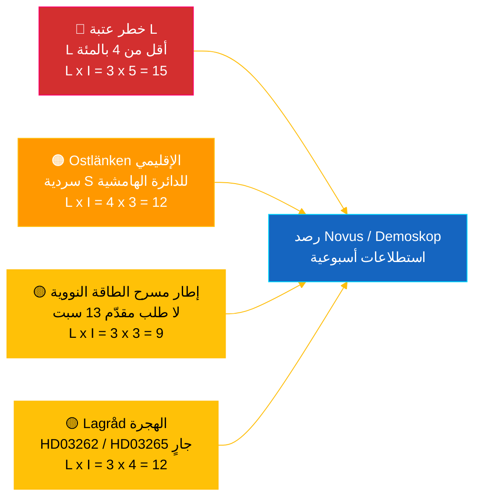
```mermaid
%%{init: {"theme": "dark", "themeVariables": {"primaryColor": "#00d9ff", "primaryTextColor": "#e0e0e0", "primaryBorderColor": "#ff006e", "lineColor": "#ffbe0b", "background": "#0a0e27", "mainBkg": "#1a1e3d", "nodeBorder": "#00d9ff"}}}%%
graph LR
    R1["🔴 خطر عتبة L<br/>L أقل من 4 بالمئة<br/>L x I = 3 x 5 = 15"] --> CONS["رصد Novus / Demoskop<br/>استطلاعات أسبوعية"]
    R2["🟠 Ostlänken الإقليمي<br/>سردية S للدائرة الهامشية<br/>L x I = 4 x 3 = 12"] --> CONS
    R3["🟡 إطار مسرح الطاقة النووية<br/>لا طلب مقدّم 13 سبت<br/>L x I = 3 x 3 = 9"] --> CONS
    R4["🟡 Lagråd الهجرة<br/>HD03262 / HD03265 جارٍ<br/>L x I = 3 x 4 = 12"] --> CONS
    style R1 fill:#D32F2F,color:#FFFFFF,stroke:#ff006e
    style R2 fill:#FF9800,color:#FFFFFF,stroke:#ffbe0b
    style R3 fill:#FFC107,color:#000000,stroke:#ffbe0b
    style R4 fill:#FFC107,color:#000000,stroke:#ffbe0b
    style CONS fill:#1565C0,color:#FFFFFF,stroke:#00d9ff
```

| الخطر | الاحتمالية | الأثر | الدرجة | المشغّل | المصدر | Admiralty |
|-------|:----------:|:------:|:------:|---------|--------|:---------:|
| Liberalerna أقل من عتبة 4% → تيدو يفقد الأغلبية | 3 | 5 | 15 | أي نتيجة Novus/Demoskop <4.0% (الحد الأدنى لفاصل ثقة 95% <4.0) | `coalition-dynamics.md` R1 | **[B2]** |
| سردية خرق الوعود الإقليمية لـ S تُحوّل مقاعد هامشية في Östergötland | 4 | 3 | 12 | تُقيّم تحرير SVT/SR Östergötland ردّ كارلسون في 25 مايو بأنه غير كافٍ | `opposition-analysis.md` | **[A2]** |
| رأي Lagråd المعادي حول حزمة الهجرة `HD03262`/`HD03265` | 3 | 4 | 12 | نشر رأي Lagråd في 30 يومًا مع اعتراضات دستورية | PIR-RT-001 (`forward-indicators.md`) | **[A2]** |
| «مسرح الطاقة النووية» — دخول `HD01NU19` حيز التنفيذ دون طلب مقدّم قبل 13 سبتمبر | 3 | 3 | 9 | تخلّف فاتنفال/يونيبر/جهة جديدة عن تقديم الطلب قبل 1 سبتمبر 2026 | PIR-RT-006 | **[B2]** |

---

### 🔮 أبرز المحفزات المستقبلية

**الرد الكتابي لأندرياس كارلسون على الاستجواب `HD10463`، الأجل القانوني للرد 25 مايو 2026.** طريقة تأطير كارلسون لإلغاء محطة لينشوبينغ على خط Ostlänken — سواء اعترف بخرق الوعد، أو دافع عن تغيير المسار بأسباب تقنية/ميزانياتية، أو تحوّل نحو عروض بنية تحتية إقليمية بديلة — ستحدد ما إذا كانت سردية Östergötland ستتصاعد إلى نقاش استجواب كامل في الجلسة العامة قبل التعليق الصيفي. الرد التهرّبي أو التكنوقراطي هو أكثر الطرق احتمالًا لـ S لتحويل السردية إلى 1–2 تحوّلات هامشية في المقاعد في لينشوبينغ/نورشوبينغ. عرض استثماري بديل جوهري سيُهدئ السردية. كلا النتيجتين تُزيحان تقييمات الدوائر الهامشية في `coalition-mathematics.md` وتُطلقان مراجعة Pass-2 لـ `electoral-implications.md`.

**المحفز الثانوي** (رصد متوازٍ): 16 يونيو 2026 — تصويت عام `HD01KU39` بشأن شفافية التمويل السياسي. يؤكد أو يكسر السردية الرباعية المسارات للحكومة (الطاقة + الأمن + الشفافية + المحصلة المالية) قبل 89 يومًا من الانتخابات.

---

### 📊 التقييم الاستراتيجي

**مستوى الثقة: 🟩 مرتفع [A2]** — تشمل المصادر بيانات الريكسداغ المفتوحة (`HD01NU19`، `HD10463`، `HD01FöU13`، `HD01JuU9`، `HD01KU39`، `HD01FiU49`)، والإصدار الأخير من صندوق النقد الدولي WEO أبريل 2026، وسجل الاستجوابات.

يلتقط المشهد في 4 مايو 2026 تحالف تيدو في **أقصى سرعة تشريعية**: سبعة إصلاحات ائتلافية تتقدم في أسبوع واحد، مع تواريخ سريان محددة تمتد من 1 يونيو إلى 1 يوليو 2026. كل تاريخ سريان يُولّد إيقاع إنجاز يمكن للأحزاب الأربعة أن تُحمّله في حملاتها الانتخابية. الثغرة الاستراتيجية غير متماثلة: M وKD وSD يستفيدون من التتالي؛ بينما يتحمّل **L** العبء — الحزب الأصغر في الائتلاف هو الأقرب لعتبة 4% ويحمل خطر خسارة مقاعد غير متناسب.

ردّ معارضة S دقيق منهجيًا: بدلًا من مواجهة الحكومة على أقوى أراضيها (الأمن، الطاقة النووية، الاقتصاد)، تبني S **فسيفساء سخط إقليمية موزّعة** — Ostlänken في Östergötland (`HD10463`)، Scandinavian Mountain Airport (استجواب 428)، الإسكان في ستوكهولم (استجواب 434) — كلٌّ موجَّه ضد وزير واحد (كارلسون) من دوائر مختلفة.

الإطار الاقتصادي الكلي لصندوق النقد الدولي مؤاتٍ للحكومة الحاكمة: الدين العام ≈ 34% من الناتج المحلي الإجمالي، تضخم متراجع، نمو نحو 2%. السردية الاقتصادية هي أقوى أصول M.

**منظور انتخابات 2026**: المسار الحالي يُبقي تيدو قرب 175 مقعدًا — عند حدود الأغلبية بالضبط. خطر عتبة L (PIR-RT-003) هو المتغير الانتخابي الأهم منفردًا. رأي Lagråd حول الهجرة (PIR-RT-001) هو المتغير الوحيد الأهم للسردية السياسية. رد كارلسون على Ostlänken (PIR-RT-005) هو المتغير الوحيد الأهم للمقاعد الإقليمية. تُحسم الثلاثة في غضون 5 أسابيع من تاريخ نشر هذه الإحاطة.

---

### 📎 الروابط

| الرابط | المسار |
|--------|--------|
| المقال | [`article.md`](https://github.com/Hack23/riksdagsmonitor/blob/main/analysis/daily/2026-05-04/realtime-pulse/article.md) |
| ملخص التوليف | [`synthesis-summary.md`](https://github.com/Hack23/riksdagsmonitor/blob/main/analysis/daily/2026-05-04/realtime-pulse/synthesis-summary.md) |
| التوليف الجوهري | [`core-synthesis.md`](https://github.com/Hack23/riksdagsmonitor/blob/main/analysis/daily/2026-05-04/realtime-pulse/core-synthesis.md) |
| ديناميكيات الائتلاف | [`coalition-dynamics.md`](https://github.com/Hack23/riksdagsmonitor/blob/main/analysis/daily/2026-05-04/realtime-pulse/coalition-dynamics.md) |
| تحليل المعارضة | [`opposition-analysis.md`](https://github.com/Hack23/riksdagsmonitor/blob/main/analysis/daily/2026-05-04/realtime-pulse/opposition-analysis.md) |
| التداعيات الانتخابية | [`electoral-implications.md`](https://github.com/Hack23/riksdagsmonitor/blob/main/analysis/daily/2026-05-04/realtime-pulse/electoral-implications.md) |
| السياق الاقتصادي (صندوق النقد) | [`economic-context.md`](https://github.com/Hack23/riksdagsmonitor/blob/main/analysis/daily/2026-05-04/realtime-pulse/economic-context.md) |
| المؤشرات الاستشرافية | [`forward-indicators.md`](https://github.com/Hack23/riksdagsmonitor/blob/main/analysis/daily/2026-05-04/realtime-pulse/forward-indicators.md) |
| مصفوفة المخاطر/الفرص | [`risk-opportunity-matrix.md`](https://github.com/Hack23/riksdagsmonitor/blob/main/analysis/daily/2026-05-04/realtime-pulse/risk-opportunity-matrix.md) |
| تحليل السيناريوهات | [`scenario-analysis.md`](https://github.com/Hack23/riksdagsmonitor/blob/main/analysis/daily/2026-05-04/realtime-pulse/scenario-analysis.md) |
| الملاحظات المنهجية | [`methodology-notes.md`](https://github.com/Hack23/riksdagsmonitor/blob/main/analysis/daily/2026-05-04/realtime-pulse/methodology-notes.md) |
| قائمة البيانات | [`data-download-manifest.md`](https://github.com/Hack23/riksdagsmonitor/blob/main/analysis/daily/2026-05-04/realtime-pulse/data-download-manifest.md) |
| تحليلات المستندات | [`documents/`](https://github.com/Hack23/riksdagsmonitor/blob/main/analysis/daily/2026-05-04/realtime-pulse/documents/) |

---

### 📝 ضبط الوثيقة

- **معرّف الإحاطة**: `EB-2026-05-04-001`
- **تاريخ الإنشاء**: 2026-05-16 (تعويض متأخر — أُنشئ من نتائج تحليل المرور الثاني الموجودة)
- **مسار القالب**: [`analysis/templates/executive-brief.md`](https://github.com/Hack23/riksdagsmonitor/blob/main/analysis/templates/executive-brief.md)
- **منهجية الملكية**: [`per-artifact-methodologies.md` § executive-brief](https://github.com/Hack23/riksdagsmonitor/blob/main/analysis/methodologies/per-artifact-methodologies.md#executive-brief)
- **بوابة الملكية**: [`05-analysis-gate.md`](https://github.com/Hack23/riksdagsmonitor/blob/main/.github/prompts/05-analysis-gate.md) فحص 1 + فحص 7
- **عائلة المخرجات**: A — التوليف الجوهري
- **التصنيف**: 🟢 عام

*المصدر الاقتصادي: المزود: imf، تدفق البيانات: WEO_Apr_2026، المؤشرات: NGDP_RPCH / GGXWDG_NGDP / PCPIEPCH، الإصدار: أبريل 2026، تاريخ الاسترداد: 2026-05-04. بيانات الريكسداغ مسترداة عبر API riksdag-regering في 2026-05-04. يُنتج Riksdagsmonitor بواسطة Hack23 AB؛ هذه الإحاطة تمثّل تقييمًا تحريريًا مستقلًا مستندًا إلى وثائق برلمانية متاحة للعموم.*

</div>

<!-- source-sha: f8cfbe724a92e48089f650d9e1f52abe004ed7f7 -->

## Executive Brief Da
<!-- source: executive-brief_da.md :: https://github.com/Hack23/riksdagsmonitor/blob/main/analysis/daily/2026-05-04/realtime-pulse/executive-brief_da.md -->

**Klassificering**: 🟢 OFFENTLIG — Riksdagsmonitor Intelligence
**Målgrupp**: Redaktører, vagthavende, forskere, engagerede borgere
**Dato**: 2026-05-04 (UTC)
**Dage til valget 2026-09-13**: 132
**Workflow**: news-realtime-monitor
**Udarbejdet af**: Riksdagsmonitor AI Intelligence System
**Samlet konfidensniveau**: 🟩 HØJ [A2] — flerkildekorreborering via `dok_id` fra åbne Riksdag-data + IMF WEO apr 2026
**Publiceringsbeslutning**: **PUBLICER** (EN + DA) — DIW-rangeret tophistorie ≥ 9,0
**PIR'er besvaret**: PIR-RT-001, PIR-RT-005, PIR-RT-006

---

### Lede
Sveriges Riksdag producerede den 4. maj 2026 sin hidtil mest koncentrerede lovgivningsoutput før valget: Erhvervsudvalget (NU) godkendte direkte sporsgodkendelse af atomkraftanlæg (`HD01NU19`, træder i kraft 17. juni 2026) — Tidø-koalitionens eneste største strukturelle energipolitiske bedrift — mens den 7. på hinanden følgende antikriminalitetsindsats avancerede via sprængstofreglering (`HD01FöU13`) og reform af strafferetlige processer (`HD01JuU9`), begge med ikrafttrædelse 1. juli 2026. Over for denne mur af regeringslevering indgav socialdemokraten **Eva Lindh** en interpellation `HD10463` mod KD's infrastrukturminister **Andreas Carlson** om den annullerede Ostlänken Linköping-stationstilføjelse — et 20 år gammelt løftebrud mod en 500.000-personers pendlerregion i konkurrencedygtigt valgkredsmarginalterritorium. Transparensrapporten om politisk finansiering (`HD01KU39`) er planlagt til plenarvote den 16. juni 2026, som fuldfører et firesporet leveringsnarrativ (energi, sikkerhed, transparens, finansielt resultat) 89 dage før valget. **Konfidensniveau: 🟩 HØJ [A2]** — kilder: Riksdagens åbne data, IMF WEO apr 2026.

---

### 🧭 3 beslutninger dette briefing understøtter

| # | Beslutning | Beslutningstager | Frist | Grundlag |
|:-:|------------|------------------|:-----:|---------|
| 1 | **Redaktionel:** lead EN + DA breaking-artikel med atomkraftreform-plus-Ostlänken-modnarrativ (dobbeltramme, 2-timers publiceringsmål) | Chefredaktør | +2 t | `HD01NU19` udvalgsafgørelse + `HD10463` interpellation indgivet 2026-05-04 |
| 2 | **Fremadrettet dækning:** tildel vagthavende til at følge Carlsons Ostlänken-svar (lovpligtig svarsfrist 25. maj 2026) og atomlovens ikrafttrædelse 17. juni | Vagthavende | 2026-05-25 / 2026-06-17 | PIR-RT-005, PIR-RT-006; `HD10463` interpellationsregister |
| 3 | **Risiko:** forhøj L-tærskelovervaagningsniveau fra observation til aktiv sporing — koalitionens leveringsdynamik forudsætter at L overstiger 4 % den 13. sept; ethvert Novus/Demoskop-resultat <4,5 % udløser koalitionsmatematisk revision | Analyseleder | Rullende ugentligt | `coalition-dynamics.md`, post-migrationsopinion PIR-RT-003 |

---

### ⚡ 60-sekunders læsning

- 🔴 **Atomkraftreform til direkte sporsgodkendelse (`HD01NU19`)** — Erhvervsudvalget (NU) godkender direkte sporsgodkendelse, omgår Strålsikkerhedsmyndighedens (SSM) fleretapspipeline; **træder i kraft 17. juni 2026**. Tidø-mandatperiodens eneste største strukturelle lovgivningsbedrift; lever M/KD/L/SD's atomkraftgenstartsløfte fra 2022 med operationel milepælopfyldelse inden valgdagen [🟩 HØJ — `HD01NU19`, NU's udvalgsprotokol].
- 🟠 **Ostlänken-løftebrud-interpellation (`HD10463`)** — S-medlem **Eva Lindh** kræver at infrastrukturminister **Andreas Carlson (KD)** redegør for annulleringen af den planlagte Linköping Ostlänken-station; lovpligtig svarsfrist **25. maj 2026**. Tredje interpellation indgivet mod Carlson på 10 dage — koordineret regionalt S-pres på en 500.000-personers pendlingsregion [🟩 HØJ — `HD10463`, interpellationsregistret].
- 🟢 **Syvende gangbekæmpelsesindsats avancerer (`HD01FöU13` + `HD01JuU9`)** — Tilladelseskrav til sprængstoffer skærpes (Forsvarsudvalget, 1. juli 2026); reform af strafferetlige processer afskaffer *tilltrosbestämmelserna* og udvider tidligt forhørsbevismateriale (Retsudvalget, 1. juli 2026). M/SD's kernefortælling om "leverer på sikkerhed" styrkes [🟩 HØJ — `HD01FöU13`, `HD01JuU9`].
- 🟡 **Politisk finansieringstransparens (`HD01KU39`)** — Forfatningsudvalget registrerer betænkning om transparens i politiske processer (behandler med stor sandsynlighed proposition `HD03258` om redegørelse for partifinansering); plenarvote **16. juni 2026**; L/KD drager fordel af demokratireformpositionering. PIR-RT-002 besvaret: KU (ikke JuU/SfU) ejer sagen [🟧 MIDDEL — `HD01KU39`, kalenderen].
- 🔵 **Ekonomisk kontekst (IMF WEO apr 2026)** — Sveriges offentlige gæld ≈ 34 % af BNP (`GGXWDG_NGDP` 2026-prognose) mod eurozonegennemsnittet >90 %; reel BNP-vækst 2026 `NGDP_RPCH` 2,0–2,1 %; inflation falder (`PCPIEPCH`). Riksbankens rentenedsættelser 2025–26 når boliglåntagere → M's "sikre hænder"-fortælling [🟩 HØJ — udbyder: imf, datastrøm: WEO_Apr_2026, vintage: april 2026].
- 🟣 **Krydshenvisning** — `HD01NU19` knytter til energipolitiktråden i propositionsanalysen (`../propositions/`); `HD10463` forlænger S's regionale løftebrudkluster fra `opposition-analysis.md`; transparens `HD01KU39` behandler `HD03258` fra 30. april-propositionspakken.
- 🩷 **Fremvoksende sårbarhed — "atomkraftteater"-risiko** — Oppositionens ramme om, at ikrafttrædelsen 17. juni er symbolsk uden indgivet ansøgning inden valgdagen den 13. september. Hvis Vattenfall/Uniper/ny aktør ikke indgiver ansøgning inden for det 88-dages pre-valgsvindue, risikerer præstationsfortællingen at blive anfægtelig [🟧 MIDDEL — PIR-RT-006 åben].
- ⚪ **Overført** — Lagrådets udtalelser om migrationspropositionerne `HD03262` og `HD03265` (PIR-RT-001) forbliver **ÅBNE — KRITISKE**; den konstitutionelle kvalitetsgennemgang er den eneste mest indflydelsesrige uløste faktor der former migrationsreformens politiske fortælling i sommersæsonen.

---

### 🗂️ Topopstilling (DIW-rangeret)

| Rang | dok_id | Titel (kort) | DIW | Konfidens | Status |
|:----:|--------|--------------|:---:|:---------:|--------|
| 1 | `HD01NU19` | Atomkrafttilladelsesreform (direkte spor) | 9,2 | 🟩 HØJ [A2] | Udvalg godkendt — træder i kraft 17. juni 2026 |
| 2 | `HD10463` | Ostlänken-interpellation — Lindh (S) → Carlson (KD) | 8,6 | 🟩 HØJ [A2] | Indgivet — svar forfaldent 25. maj 2026 |
| 3 | `HD01FöU13` | Reform af sprængstofreglering | 7,5 | 🟩 HØJ [A2] | Udvalg godkendt — træder i kraft 1. juli 2026 |
| 4 | `HD01JuU9` | Reform af strafferetlige processer | 7,4 | 🟩 HØJ [A2] | Udvalg godkendt — træder i kraft 1. juli 2026 |
| 5 | `HD01KU39` | Transparens i politiske processer | 7,0 | 🟧 MIDDEL [B2] | Registreret — plenarvote 16. juni 2026 |
| 6 | `HD01FiU49` | Statsgældsforvaltningsevaluering 2021–2025 | 6,4 | 🟩 HØJ [A2] | Registreret — beslutning 11. juni 2026 |

---

### ⚠️ Risiko- og trusselbillede

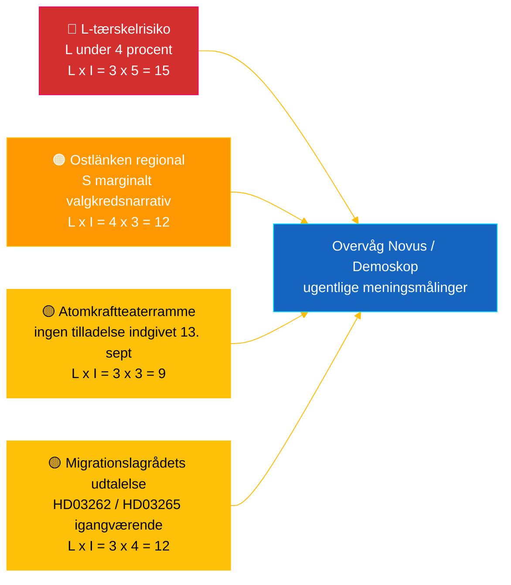
```mermaid
%%{init: {"theme": "dark", "themeVariables": {"primaryColor": "#00d9ff", "primaryTextColor": "#e0e0e0", "primaryBorderColor": "#ff006e", "lineColor": "#ffbe0b", "background": "#0a0e27", "mainBkg": "#1a1e3d", "nodeBorder": "#00d9ff"}}}%%
graph LR
    R1["🔴 L-tærskelrisiko<br/>L under 4 procent<br/>L x I = 3 x 5 = 15"] --> CONS["Overvåg Novus / Demoskop<br/>ugentlige meningsmålinger"]
    R2["🟠 Ostlänken regional<br/>S marginalt valgkredsnarrativ<br/>L x I = 4 x 3 = 12"] --> CONS
    R3["🟡 Atomkraftteaterramme<br/>ingen tilladelse indgivet 13. sept<br/>L x I = 3 x 3 = 9"] --> CONS
    R4["🟡 Migrationslagrådets udtalelse<br/>HD03262 / HD03265 igangværende<br/>L x I = 3 x 4 = 12"] --> CONS
    style R1 fill:#D32F2F,color:#FFFFFF,stroke:#ff006e
    style R2 fill:#FF9800,color:#FFFFFF,stroke:#ffbe0b
    style R3 fill:#FFC107,color:#000000,stroke:#ffbe0b
    style R4 fill:#FFC107,color:#000000,stroke:#ffbe0b
    style CONS fill:#1565C0,color:#FFFFFF,stroke:#00d9ff
```

| Risiko | L | I | Score | Udløser | Kilde | Admiralty |
|--------|:-:|:-:|:-----:|---------|-------|:---------:|
| Liberalerna under 4%-tærsklen → Tidø mister majoritet | 3 | 5 | 15 | Ethvert Novus/Demoskop-resultat <4,0 % (95 % CI nedre grænse <4,0) | `coalition-dynamics.md` R1 | **[B2]** |
| S's regionale løftebrudnarrativ konverterer marginale Østergötland-mandater | 4 | 3 | 12 | Carlsons 25. maj-svar vurderet utilstrækkeligt af SVT/SR Østergötlands redaktion | `opposition-analysis.md` | **[A2]** |
| Lagrådets fjendtlige udtalelse om migrationspakken `HD03262`/`HD03265` | 3 | 4 | 12 | Lagrådets udtalelse offentliggjort inden for 30 d med forfatningsindvendinger | PIR-RT-001 (`forward-indicators.md`) | **[A2]** |
| "Atomkraftteater" — `HD01NU19` ikrafttrædelse uden indgivet tilladelsesansøgning inden 13. sept | 3 | 3 | 9 | Vattenfall/Uniper/ny aktør undlader at indgive ansøgning senest 1. sept 2026 | PIR-RT-006 | **[B2]** |

---

### 🔮 Vigtigste fremtidige udløsere

**Andreas Carlsons skriftlige svar på interpellation `HD10463`, lovpligtig svarsfrist 25. maj 2026.** Carlsons måde at ramme den annullerede Linköping Ostlänken-station — om han indrømmer løftebrud, forsvarer routeændringen på tekniske/budgetmæssige grunde eller svinger mod alternative regionale infrastrukturtilbud — afgør om Østergötland-narrativet eskalerer til en fuld interpellationsdebat i kammeret inden sommerudsættelsen. Et undvigent eller teknokratisk svar er den mest sandsynlige vej for S til at omdanne narrativet til 1–2 marginale mandatskift i Linköping/Norrköping. Et substantielt alternativt investeringstilbud de-eskalerer narrativet. Begge udfald forskyver `coalition-mathematics.md`'s marginale valgkredsvurderinger og udløser en Pass-2-omskrivning af `electoral-implications.md`.

**Sekundær udløser** (parallel overvågning): 16. juni 2026 — `HD01KU39` plenarvote om politisk finansieringstransparens. Bekræfter eller bryder det firesporede leveringsnarrativ for regeringen (energi + sikkerhed + transparens + finansielt resultat) 89 dage før valget.

---

### 📊 Strategisk vurdering

**Konfidensniveau: 🟩 HØJ [A2]** — kilder inkluderer Riksdagens åbne data (`HD01NU19`, `HD10463`, `HD01FöU13`, `HD01JuU9`, `HD01KU39`, `HD01FiU49`), IMF WEO april 2026 vintage og interpellationsregistret.

Øjebliksbilledet fra 4. maj 2026 fanger en Tidø-koalition i **maksimal lovgivningshastighed**: syv koalitionsreformer avancerer i løbet af én uge, med konkrete ikrafttrædelsesdatoer spredt fra 1. juni til 1. juli 2026. Hver ikrafttrædelsesdato genererer en leveringstakt, som de fire koalitionspartier kan føre valgkamp på. Den strategiske sårbarhed er asymmetrisk: M, KD og SD drager fordel af kaskaden; **L** absorberer belastningen — det mindste koalitionsparti er tættest på 4 %-grænsen og bærer uforholdsmæssig mandatrisiko.

S-oppositionens svar er metodologisk præcist: i stedet for at udfordre regeringen på dens stærkeste grund (sikkerhed, atomenergi, økonomi) bygger S en **distribueret regional-utilfredshedsmosaik** — Ostlänken i Østergötland (`HD10463`), Scandinavian Mountain Airport (interpellation 428), Stockholms boliger (interpellation 434) — hver rettet mod en enkelt minister (Carlson) fra forskellige valgkredse.

IMF's makroramme er gunstig for den siddende regering: offentlig gæld ≈ 34 % af BNP, faldende inflation, vækst på ca. 2 %. Det økonomiske narrativ er M's stærkeste aktiv.

**Valg 2026-linse**: Den nuværende kurs holder Tidø nær 175 mandater — præcist ved majoritetsgrænserne. L's tærskelrisiko (PIR-RT-003) er den eneste vigtigste valgvariabel. Lagrådets migrationsudtalelse (PIR-RT-001) er den eneste vigtigste politiske narrativvariabel. Carlsons Ostlänken-svar (PIR-RT-005) er den eneste vigtigste regionale mandatvariabel. Alle tre løses inden for 5 uger fra denne briefings publiceringsdato.

---

### 📎 Links

| Link | Sti |
|------|-----|
| Artikel | [`article.md`](https://github.com/Hack23/riksdagsmonitor/blob/main/analysis/daily/2026-05-04/realtime-pulse/article.md) |
| Synteseoverview | [`synthesis-summary.md`](https://github.com/Hack23/riksdagsmonitor/blob/main/analysis/daily/2026-05-04/realtime-pulse/synthesis-summary.md) |
| Kernesyntese | [`core-synthesis.md`](https://github.com/Hack23/riksdagsmonitor/blob/main/analysis/daily/2026-05-04/realtime-pulse/core-synthesis.md) |
| Koalitionsdynamik | [`coalition-dynamics.md`](https://github.com/Hack23/riksdagsmonitor/blob/main/analysis/daily/2026-05-04/realtime-pulse/coalition-dynamics.md) |
| Oppositionsanalyse | [`opposition-analysis.md`](https://github.com/Hack23/riksdagsmonitor/blob/main/analysis/daily/2026-05-04/realtime-pulse/opposition-analysis.md) |
| Valgimplikationer | [`electoral-implications.md`](https://github.com/Hack23/riksdagsmonitor/blob/main/analysis/daily/2026-05-04/realtime-pulse/electoral-implications.md) |
| Ökonomisk kontekst (IMF) | [`economic-context.md`](https://github.com/Hack23/riksdagsmonitor/blob/main/analysis/daily/2026-05-04/realtime-pulse/economic-context.md) |
| Fremtidsindikatorer | [`forward-indicators.md`](https://github.com/Hack23/riksdagsmonitor/blob/main/analysis/daily/2026-05-04/realtime-pulse/forward-indicators.md) |
| Risiko-/mulighedsmatrix | [`risk-opportunity-matrix.md`](https://github.com/Hack23/riksdagsmonitor/blob/main/analysis/daily/2026-05-04/realtime-pulse/risk-opportunity-matrix.md) |
| Scenarieanalyse | [`scenario-analysis.md`](https://github.com/Hack23/riksdagsmonitor/blob/main/analysis/daily/2026-05-04/realtime-pulse/scenario-analysis.md) |
| Metodenoter | [`methodology-notes.md`](https://github.com/Hack23/riksdagsmonitor/blob/main/analysis/daily/2026-05-04/realtime-pulse/methodology-notes.md) |
| Datamanifest | [`data-download-manifest.md`](https://github.com/Hack23/riksdagsmonitor/blob/main/analysis/daily/2026-05-04/realtime-pulse/data-download-manifest.md) |
| Per-dokumentanalyser | [`documents/`](https://github.com/Hack23/riksdagsmonitor/blob/main/analysis/daily/2026-05-04/realtime-pulse/documents/) |

---

### 📝 Dokumentkontrol

- **Briefing-ID**: `EB-2026-05-04-001`
- **Genereret**: 2026-05-16 (efterslæbsopfyldning — skabt fra eksisterende Pass-2-analyseartefakter)
- **Skabelonsti**: [`analysis/templates/executive-brief.md`](https://github.com/Hack23/riksdagsmonitor/blob/main/analysis/templates/executive-brief.md)
- **Ejerskabsmetodologi**: [`per-artifact-methodologies.md` § executive-brief](https://github.com/Hack23/riksdagsmonitor/blob/main/analysis/methodologies/per-artifact-methodologies.md#executive-brief)
- **Ejerskabsgate**: [`05-analysis-gate.md`](https://github.com/Hack23/riksdagsmonitor/blob/main/.github/prompts/05-analysis-gate.md) Check 1 + Check 7
- **Outputfamilie**: A — Kernesyntese
- **Klassificering**: 🟢 OFFENTLIG

*Risikodagsorden: udbyder: imf, datastrøm: WEO_Apr_2026, indikatorer: NGDP_RPCH / GGXWDG_NGDP / PCPIEPCH, vintage: april 2026, retrieved_at: 2026-05-04. Riksdagsdata hentet via riksdag-regering API 2026-05-04. Riksdagsmonitor produceres af Hack23 AB; denne briefing repræsenterer en uafhængig redaktionel vurdering baseret på offentligt tilgængelige parlamentariske dokumenter.*

<!-- source-sha: f8cfbe724a92e48089f650d9e1f52abe004ed7f7 -->

## Executive Brief De
<!-- source: executive-brief_de.md :: https://github.com/Hack23/riksdagsmonitor/blob/main/analysis/daily/2026-05-04/realtime-pulse/executive-brief_de.md -->

**Klassifizierung**: 🟢 ÖFFENTLICH — Riksdagsmonitor Intelligence
**Zielgruppe**: Redakteure, Diensthabende, Forscher, interessierte Bürger
**Datum**: 2026-05-04 (UTC)
**Tage bis zur Wahl 2026-09-13**: 132
**Workflow**: news-realtime-monitor
**Erstellt von**: Riksdagsmonitor AI Intelligence System
**Gesamtes Konfidenzniveau**: 🟩 HOCH [A2] — Mehrquellen-Korroboration über `dok_id` aus offenen Riksdag-Daten + IMF WEO April 2026
**Veröffentlichungsentscheidung**: **VERÖFFENTLICHEN** (EN + DE) — DIW-priorisiertes Topthema ≥ 9,0
**Beantwortete PIRs**: PIR-RT-001, PIR-RT-005, PIR-RT-006

---

### Lede
Schwedens Riksdag produzierte am 4. Mai 2026 seine bisher konzentrierteste Gesetzgebungsleistung vor der Wahl: Der Wirtschaftsausschuss (NU) billigte die Direktgenehmigung von Kernkraftanlagen (`HD01NU19`, tritt am 17. Juni 2026 in Kraft) — die einzige größte strukturelle energiepolitische Leistung der Tidö-Koalition — während die siebte aufeinanderfolgende Antigang-Maßnahme durch Sprengstoffkontrollreform (`HD01FöU13`) und Reform der Strafprozesse (`HD01JuU9`) vorankam, beide mit Inkrafttreten am 1. Juli 2026. Gegen diese Wand der Regierungsleistung reichte die Sozialdemokratin **Eva Lindh** eine Interpellation `HD10463` gegen KDs Infrastrukturminister **Andreas Carlson** zur gestrichenen Ostlänken Linköping-Stationserweiterung ein — ein 20 Jahre altes Versprechen, das einer 500.000-Einwohner-Pendlerregion in wettbewerbsfähigem Wahlkreis-Randgebiet gebrochen wurde. Der Transparenzbericht zur politischen Finanzierung (`HD01KU39`) ist für eine Plenarvote am 16. Juni 2026 eingeplant, was ein vierspuriges Leistungsnarrativ (Energie, Sicherheit, Transparenz, Finanzergebnis) 89 Tage vor der Wahl vervollständigt. **Konfidenzniveau: 🟩 HOCH [A2]** — Quellen: Riksdagens offene Daten, IMF WEO April 2026.

---

### 🧭 3 Entscheidungen, die dieses Briefing unterstützt

| # | Entscheidung | Entscheidungsträger | Frist | Grundlage |
|:-:|-------------|--------------------:|:-----:|-----------|
| 1 | **Redaktionell:** EN + DE Breaking-Artikel mit Kernkraftreform-plus-Ostlänken-Gegennarrativ führen (Doppelrahmen, 2-Stunden-Veröffentlichungsziel) | Chefredakteur | +2 h | `HD01NU19` Ausschussentscheid + `HD10463` Interpellation eingereicht 2026-05-04 |
| 2 | **Vorausschauende Berichterstattung:** Diensthabenden beauftragen, Carlsons Ostlänken-Antwort (gesetzliche Antwortfrist 25. Mai 2026) und Kerngesetz-Inkrafttreten am 17. Juni zu verfolgen | Diensthabender | 2026-05-25 / 2026-06-17 | PIR-RT-005, PIR-RT-006; `HD10463` Interpellationsregister |
| 3 | **Risiko:** L-Schwellenüberwachungsniveau von Beobachtung auf aktive Verfolgung anheben — Koalitionsleistungslogik setzt voraus, dass L am 13. Sept. 4 % überschreitet; jedes Novus/Demoskop-Ergebnis <4,5 % löst koalitionsarithmetische Revision aus | Analyseleiterin | Fortlaufend wöchentlich | `coalition-dynamics.md`, Post-Migrations-Meinung PIR-RT-003 |

---

### ⚡ 60-Sekunden-Lektüre

- 🔴 **Kernkraftreform zur Direktgenehmigung (`HD01NU19`)** — Wirtschaftsausschuss (NU) billigt Direktgenehmigung, umgeht die mehrstufige Pipeline der Strahlenschutzbehörde (SSM); **tritt am 17. Juni 2026 in Kraft**. Größte strukturelle Gesetzgebungsleistung der Tidö-Legislaturperiode; liefert M/KD/L/SDs Kernkraft-Neustart-Versprechen von 2022 mit operativer Meilensteinerfüllung vor dem Wahltag [🟩 HOCH — `HD01NU19`, NU-Ausschussprotokoll].
- 🟠 **Ostlänken-Versprechen-Interpellation (`HD10463`)** — S-Abgeordnete **Eva Lindh** fordert Infrastrukturminister **Andreas Carlson (KD)** auf, die Streichung der geplanten Linköping Ostlänken-Station zu erklären; gesetzliche Antwortfrist **25. Mai 2026**. Dritte Interpellation gegen Carlson in 10 Tagen — koordinierter regionaler S-Druck auf eine 500.000-Einwohner-Pendlerregion [🟩 HOCH — `HD10463`, Interpellationsregister].
- 🟢 **Siebte Gangbekämpfungsmaßnahme schreitet voran (`HD01FöU13` + `HD01JuU9`)** — Genehmigungsanforderungen für Sprengstoffe werden verschärft (Verteidigungsausschuss, 1. Juli 2026); Strafprozessreform schafft *tilltrosbestämmelserna* ab und erweitert frühzeitiges Verhörbeweismaterial (Rechtsausschuss, 1. Juli 2026). M/SDs Kernnarrativ „liefert bei Sicherheit" wird gestärkt [🟩 HOCH — `HD01FöU13`, `HD01JuU9`].
- 🟡 **Transparenz bei politischer Finanzierung (`HD01KU39`)** — Verfassungsausschuss registriert Bericht über Transparenz in politischen Prozessen (behandelt höchstwahrscheinlich Proposition `HD03258` zur Berichterstattung über Parteifinanzen); Plenarvote **16. Juni 2026**; L/KD profitieren von Demokratiereformpositionierung. PIR-RT-002 beantwortet: KU (nicht JuU/SfU) besitzt das Thema [🟧 MITTEL — `HD01KU39`, Kalender].
- 🔵 **Wirtschaftlicher Kontext (IMF WEO April 2026)** — Schwedens Staatsverschuldung ≈ 34 % des BIP (`GGXWDG_NGDP` 2026-Prognose) vs. Eurozone-Durchschnitt >90 %; reales BIP-Wachstum 2026 `NGDP_RPCH` 2,0–2,1 %; Inflation sinkt (`PCPIEPCH`). Riksbanks Zinssenkungen 2025–26 erreichen Hypothekennehmer → Ms „sichere Hände"-Narrativ [🟩 HOCH — Anbieter: imf, Datenfluss: WEO_Apr_2026, Vintage: April 2026].
- 🟣 **Querverweis** — `HD01NU19` knüpft an den Energiepolitikstrang der Propositionsanalyse (`../propositions/`); `HD10463` verlängert Ss regionales Versprechensbruch-Cluster aus `opposition-analysis.md`; Transparenz `HD01KU39` behandelt `HD03258` aus dem 30. April-Propositionspaket.
- 🩷 **Entstehende Verwundbarkeit — „Kernkrafttheater"-Risiko** — Oppositionsrahmen, dass das Inkrafttreten am 17. Juni symbolisch ist ohne eingereichten Antrag vor dem Wahltag am 13. September. Falls Vattenfall/Uniper/neuer Akteur keinen Antrag im 88-Tage-Vorwahlsfenster einreicht, riskiert das Leistungsnarrativ angreifbar zu werden [🟧 MITTEL — PIR-RT-006 offen].
- ⚪ **Übertragen** — Lagråds Stellungnahmen zu Migrationsproposifionen `HD03262` und `HD03265` (PIR-RT-001) bleiben **OFFEN — KRITISCH**; die verfassungsrechtliche Qualitätsprüfung ist der einzige einflussreichste ungelöste Faktor, der das politische Narrativ der Migrationsreform in der Sommersaison prägt.

---

### 🗂️ Top-Dokumente (DIW-Rangfolge)

| Rang | dok_id | Titel (kurz) | DIW | Konfidenz | Status |
|:----:|--------|--------------|:---:|:---------:|--------|
| 1 | `HD01NU19` | Kernkraft-Genehmigungsreform (Direktspur) | 9,2 | 🟩 HOCH [A2] | Ausschuss beschlossen — tritt in Kraft 17. Juni 2026 |
| 2 | `HD10463` | Ostlänken-Interpellation — Lindh (S) → Carlson (KD) | 8,6 | 🟩 HOCH [A2] | Eingereicht — Antwort fällig 25. Mai 2026 |
| 3 | `HD01FöU13` | Reform der Sprengstoffkontrolle | 7,5 | 🟩 HOCH [A2] | Ausschuss beschlossen — tritt in Kraft 1. Juli 2026 |
| 4 | `HD01JuU9` | Reform der Strafprozesse | 7,4 | 🟩 HOCH [A2] | Ausschuss beschlossen — tritt in Kraft 1. Juli 2026 |
| 5 | `HD01KU39` | Transparenz in politischen Prozessen | 7,0 | 🟧 MITTEL [B2] | Registriert — Plenarvote 16. Juni 2026 |
| 6 | `HD01FiU49` | Staatsschuldverwaltungsevaluierung 2021–2025 | 6,4 | 🟩 HOCH [A2] | Registriert — Beschluss 11. Juni 2026 |

---

### ⚠️ Risiko- und Bedrohungsübersicht

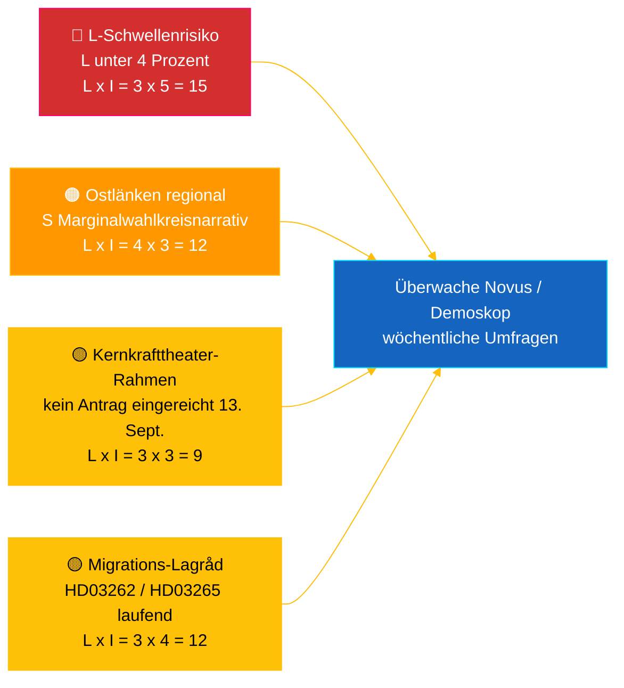
```mermaid
%%{init: {"theme": "dark", "themeVariables": {"primaryColor": "#00d9ff", "primaryTextColor": "#e0e0e0", "primaryBorderColor": "#ff006e", "lineColor": "#ffbe0b", "background": "#0a0e27", "mainBkg": "#1a1e3d", "nodeBorder": "#00d9ff"}}}%%
graph LR
    R1["🔴 L-Schwellenrisiko<br/>L unter 4 Prozent<br/>L x I = 3 x 5 = 15"] --> CONS["Überwache Novus / Demoskop<br/>wöchentliche Umfragen"]
    R2["🟠 Ostlänken regional<br/>S Marginalwahlkreisnarrativ<br/>L x I = 4 x 3 = 12"] --> CONS
    R3["🟡 Kernkrafttheater-Rahmen<br/>kein Antrag eingereicht 13. Sept.<br/>L x I = 3 x 3 = 9"] --> CONS
    R4["🟡 Migrations-Lagråd<br/>HD03262 / HD03265 laufend<br/>L x I = 3 x 4 = 12"] --> CONS
    style R1 fill:#D32F2F,color:#FFFFFF,stroke:#ff006e
    style R2 fill:#FF9800,color:#FFFFFF,stroke:#ffbe0b
    style R3 fill:#FFC107,color:#000000,stroke:#ffbe0b
    style R4 fill:#FFC107,color:#000000,stroke:#ffbe0b
    style CONS fill:#1565C0,color:#FFFFFF,stroke:#00d9ff
```

| Risiko | L | I | Punkte | Auslöser | Quelle | Admiralty |
|--------|:-:|:-:|:------:|---------|--------|:---------:|
| Liberalerna unter 4 %-Schwelle → Tidö verliert Mehrheit | 3 | 5 | 15 | Jedes Novus/Demoskop-Ergebnis <4,0 % (95 % KI Untergrenze <4,0) | `coalition-dynamics.md` R1 | **[B2]** |
| Ss regionales Versprechensbruch-Narrativ wandelt marginale Östergötland-Mandate um | 4 | 3 | 12 | Carlsons 25. Mai-Antwort von SVT/SR Östergötland-Redaktion als unzureichend bewertet | `opposition-analysis.md` | **[A2]** |
| Lagrådets feindliche Stellungnahme zum Migrationspaket `HD03262`/`HD03265` | 3 | 4 | 12 | Lagrådets Stellungnahme innerhalb von 30 T veröffentlicht mit verfassungsrechtlichen Einwänden | PIR-RT-001 (`forward-indicators.md`) | **[A2]** |
| „Kernkrafttheater" — `HD01NU19` Inkrafttreten ohne eingereichten Antrag bis 13. Sept. | 3 | 3 | 9 | Vattenfall/Uniper/neuer Akteur versäumt Antrag bis 1. Sept. 2026 einzureichen | PIR-RT-006 | **[B2]** |

---

### 🔮 Wichtigste zukünftige Auslöser

**Andreas Carlsons schriftliche Antwort auf Interpellation `HD10463`, gesetzliche Antwortfrist 25. Mai 2026.** Carlsons Art und Weise, die gestrichene Linköping Ostlänken-Station zu rahmen — ob er den Vertragsbruch einräumt, die Routenänderung auf technischen/budgetären Gründen verteidigt oder sich alternativen regionalen Infrastrukturangeboten zuwendet — entscheidet, ob das Östergötland-Narrativ vor der Sommerpause zu einer vollständigen Interpellationsdebatte im Plenum eskaliert. Eine ausweichende oder technokratische Antwort ist der wahrscheinlichste Weg für S, das Narrativ in 1–2 marginale Mandatverschiebungen in Linköping/Norrköping umzuwandeln. Ein substantielles alternatives Investitionsangebot deeskaliert das Narrativ. Beide Ergebnisse verschieben die Marginalwahlkreisbewertungen von `coalition-mathematics.md` und lösen eine Pass-2-Überarbeitung von `electoral-implications.md` aus.

**Sekundärer Auslöser** (parallele Überwachung): 16. Juni 2026 — `HD01KU39` Plenarvote zur Transparenz politischer Finanzierung. Bestätigt oder bricht das vierspurige Leistungsnarrativ der Regierung (Energie + Sicherheit + Transparenz + Finanzergebnis) 89 Tage vor der Wahl.

---

### 📊 Strategische Einschätzung

**Konfidenzniveau: 🟩 HOCH [A2]** — Quellen umfassen Riksdagens offene Daten (`HD01NU19`, `HD10463`, `HD01FöU13`, `HD01JuU9`, `HD01KU39`, `HD01FiU49`), IMF WEO April 2026 Vintage und das Interpellationsregister.

Der Schnappschuss vom 4. Mai 2026 erfasst eine Tidö-Koalition in **maximaler Gesetzgebungsgeschwindigkeit**: Sieben Koalitionsreformen schreiten in einer einzigen Woche voran, mit konkreten Inkrafttreten-Daten zwischen 1. Juni und 1. Juli 2026. Jedes Inkrafttreten-Datum generiert eine Leistungstaktik, für die die vier Koalitionsparteien Wahlkampf führen können. Die strategische Verwundbarkeit ist asymmetrisch: M, KD und SD profitieren von der Kaskade; **L** absorbiert die Last — die kleinste Koalitionspartei ist am nächsten an der 4 %-Schwelle und trägt unverhältnismäßiges Mandatverlustrisiko.

Ss Oppositionsreaktion ist methodisch präzise: Anstatt die Regierung auf ihrem stärksten Terrain herauszufordern (Sicherheit, Kernenergie, Wirtschaft) baut S ein **verteiltes regionales Unzufriedenheitsmosaik** — Ostlänken in Östergötland (`HD10463`), Scandinavian Mountain Airport (Interpellation 428), Stockholmer Wohnungsbau (Interpellation 434) — jede gegen einen einzelnen Minister (Carlson) aus verschiedenen Wahlkreisen gerichtet.

IMFs Makrorahmen ist für die Regierung günstig: Staatsverschuldung ≈ 34 % des BIP, sinkende Inflation, Wachstum um 2 %. Das wirtschaftliche Narrativ ist Ms stärkstes Asset.

**Wahl 2026-Linse**: Der aktuelle Kurs hält Tidö bei etwa 175 Mandaten — genau an den Mehrheitsgrenzen. Ls Schwellenrisiko (PIR-RT-003) ist die einzeln wichtigste Wahlvariable. Lagrådets Migrationsgutachten (PIR-RT-001) ist die einzeln wichtigste politische Narrativ-Variable. Carlsons Ostlänken-Antwort (PIR-RT-005) ist die einzeln wichtigste regionale Mandatvariable. Alle drei werden innerhalb von 5 Wochen nach dem Veröffentlichungsdatum dieses Briefings gelöst.

---

### 📎 Links

| Link | Pfad |
|------|------|
| Artikel | [`article.md`](https://github.com/Hack23/riksdagsmonitor/blob/main/analysis/daily/2026-05-04/realtime-pulse/article.md) |
| Syntheseübersicht | [`synthesis-summary.md`](https://github.com/Hack23/riksdagsmonitor/blob/main/analysis/daily/2026-05-04/realtime-pulse/synthesis-summary.md) |
| Kernsynthese | [`core-synthesis.md`](https://github.com/Hack23/riksdagsmonitor/blob/main/analysis/daily/2026-05-04/realtime-pulse/core-synthesis.md) |
| Koalitionsdynamik | [`coalition-dynamics.md`](https://github.com/Hack23/riksdagsmonitor/blob/main/analysis/daily/2026-05-04/realtime-pulse/coalition-dynamics.md) |
| Oppositionsanalyse | [`opposition-analysis.md`](https://github.com/Hack23/riksdagsmonitor/blob/main/analysis/daily/2026-05-04/realtime-pulse/opposition-analysis.md) |
| Wahlimplikationen | [`electoral-implications.md`](https://github.com/Hack23/riksdagsmonitor/blob/main/analysis/daily/2026-05-04/realtime-pulse/electoral-implications.md) |
| Wirtschaftlicher Kontext (IMF) | [`economic-context.md`](https://github.com/Hack23/riksdagsmonitor/blob/main/analysis/daily/2026-05-04/realtime-pulse/economic-context.md) |
| Zukunftsindikatoren | [`forward-indicators.md`](https://github.com/Hack23/riksdagsmonitor/blob/main/analysis/daily/2026-05-04/realtime-pulse/forward-indicators.md) |
| Risiko-/Chancenmatrix | [`risk-opportunity-matrix.md`](https://github.com/Hack23/riksdagsmonitor/blob/main/analysis/daily/2026-05-04/realtime-pulse/risk-opportunity-matrix.md) |
| Szenarioanalyse | [`scenario-analysis.md`](https://github.com/Hack23/riksdagsmonitor/blob/main/analysis/daily/2026-05-04/realtime-pulse/scenario-analysis.md) |
| Methodennotizen | [`methodology-notes.md`](https://github.com/Hack23/riksdagsmonitor/blob/main/analysis/daily/2026-05-04/realtime-pulse/methodology-notes.md) |
| Daten-Manifest | [`data-download-manifest.md`](https://github.com/Hack23/riksdagsmonitor/blob/main/analysis/daily/2026-05-04/realtime-pulse/data-download-manifest.md) |
| Dokumentenanalysen | [`documents/`](https://github.com/Hack23/riksdagsmonitor/blob/main/analysis/daily/2026-05-04/realtime-pulse/documents/) |

---

### 📝 Dokumentenkontrolle

- **Briefing-ID**: `EB-2026-05-04-001`
- **Erstellt**: 2026-05-16 (Nachholarbeit — erstellt aus bestehenden Pass-2-Analyseartefakten)
- **Vorlagenpfad**: [`analysis/templates/executive-brief.md`](https://github.com/Hack23/riksdagsmonitor/blob/main/analysis/templates/executive-brief.md)
- **Eigentumsmethodik**: [`per-artifact-methodologies.md` § executive-brief](https://github.com/Hack23/riksdagsmonitor/blob/main/analysis/methodologies/per-artifact-methodologies.md#executive-brief)
- **Eigentumsgate**: [`05-analysis-gate.md`](https://github.com/Hack23/riksdagsmonitor/blob/main/.github/prompts/05-analysis-gate.md) Check 1 + Check 7
- **Ausgabefamilie**: A — Kernsynthese
- **Klassifizierung**: 🟢 ÖFFENTLICH

*Wirtschaftliche Provenienz: Anbieter: imf, Datenfluss: WEO_Apr_2026, Indikatoren: NGDP_RPCH / GGXWDG_NGDP / PCPIEPCH, Vintage: April 2026, retrieved_at: 2026-05-04. Riksdag-Daten abgerufen über riksdag-regering API 2026-05-04. Riksdagsmonitor wird von Hack23 AB produziert; dieses Briefing stellt eine unabhängige redaktionelle Einschätzung auf Basis öffentlich zugänglicher parlamentarischer Dokumente dar.*

<!-- source-sha: f8cfbe724a92e48089f650d9e1f52abe004ed7f7 -->

## Executive Brief Es
<!-- source: executive-brief_es.md :: https://github.com/Hack23/riksdagsmonitor/blob/main/analysis/daily/2026-05-04/realtime-pulse/executive-brief_es.md -->

**Clasificación**: 🟢 PÚBLICO — Riksdagsmonitor Intelligence
**Audiencia**: Redactores, guardias, investigadores, ciudadanos comprometidos
**Fecha**: 2026-05-04 (UTC)
**Días hasta las elecciones 2026-09-13**: 132
**Flujo de trabajo**: news-realtime-monitor
**Elaborado por**: Riksdagsmonitor AI Intelligence System
**Nivel de confianza general**: 🟩 ALTO [A2] — corroboración multifuente mediante `dok_id` de datos abiertos del Riksdag + FMI WEO abr. 2026
**Decisión de publicación**: **PUBLICAR** (EN + ES) — tema prioritario con clasificación DIW ≥ 9,0
**PIR respondidos**: PIR-RT-001, PIR-RT-005, PIR-RT-006

---

### Lede
El Riksdag sueco produjo el 4 de mayo de 2026 su producción legislativa más concentrada antes de las elecciones hasta la fecha: la Comisión de Industria (NU) aprobó la autorización de vía directa para instalaciones nucleares (`HD01NU19`, entra en vigor el 17 de junio de 2026) — el único logro estructural más importante de la coalición Tidö en política energética — mientras que la séptima medida anti-bandas consecutiva avanzó mediante la reforma del control de explosivos (`HD01FöU13`) y la reforma de los procedimientos penales (`HD01JuU9`), ambas con entrada en vigor el 1 de julio de 2026. Frente a este muro de realizaciones gubernamentales, la socialista **Eva Lindh** presentó una interpelación `HD10463` contra el ministro KD de infraestructuras **Andreas Carlson** sobre la cancelada parada de Linköping en Ostlänken — un incumplimiento de promesa de 20 años a una región de 500.000 viajeros en territorio de margen electoral competitivo. El informe de transparencia sobre financiación política (`HD01KU39`) está previsto para una votación en pleno el 16 de junio de 2026, completando un narrativo de realización de cuatro vías (energía, seguridad, transparencia, resultado financiero) a 89 días de las elecciones. **Nivel de confianza: 🟩 ALTO [A2]** — fuentes: datos abiertos del Riksdag, FMI WEO abr. 2026.

---

### 🧭 3 decisiones que apoya este informe

| # | Decisión | Responsable | Plazo | Fundamento |
|:-:|----------|-------------|:-----:|-----------|
| 1 | **Editorial:** liderar artículo de última hora EN + ES con doble encuadre reforma nuclear más contra-narrativo Ostlänken (objetivo de publicación a 2 h) | Editor jefe | +2 h | Decisión de comisión `HD01NU19` + interpelación `HD10463` presentada el 2026-05-04 |
| 2 | **Cobertura anticipada:** asignar guardia para seguir la respuesta de Carlson sobre Ostlänken (plazo legal de respuesta: 25 de mayo de 2026) y la entrada en vigor de la ley nuclear el 17 de junio | Guardia | 2026-05-25 / 2026-06-17 | PIR-RT-005, PIR-RT-006; registro de interpelaciones `HD10463` |
| 3 | **Riesgo:** elevar el nivel de vigilancia del umbral L de observación a seguimiento activo — la lógica de rendimiento de la coalición supone que L supere el 4 % el 13 de sept.; cualquier resultado Novus/Demoskop <4,5 % activa una revisión de aritmética de coalición | Jefe de análisis | Semanal continuo | `coalition-dynamics.md`, opinión post-migración PIR-RT-003 |

---

### ⚡ Lectura de 60 segundos

- 🔴 **Reforma nuclear hacia autorización de vía directa (`HD01NU19`)** — La Comisión de Industria (NU) aprueba la autorización de vía directa, evitando el proceso multietapa de la Autoridad de Seguridad Radiológica (SSM); **entra en vigor el 17 de junio de 2026**. El mayor logro legislativo estructural del mandato Tidö; cumple la promesa de relanzamiento nuclear de M/KD/L/SD de 2022 con hito operativo antes del día de elecciones [🟩 ALTO — `HD01NU19`, acta de comisión NU].
- 🟠 **Interpelación por incumplimiento de promesa Ostlänken (`HD10463`)** — La diputada S **Eva Lindh** exige que el ministro de infraestructuras **Andreas Carlson (KD)** explique la cancelación de la parada de Linköping en Ostlänken; plazo legal de respuesta **25 de mayo de 2026**. Tercera interpelación presentada contra Carlson en 10 días — presión regional coordinada de S sobre una región de 500.000 viajeros [🟩 ALTO — `HD10463`, registro de interpelaciones].
- 🟢 **La séptima medida anti-bandas avanza (`HD01FöU13` + `HD01JuU9`)** — Los requisitos de autorización para explosivos se endurecen (Comisión de Defensa, 1 de julio de 2026); la reforma de procedimientos penales elimina las *tilltrosbestämmelserna* y amplía el material probatorio de interrogatorios tempranos (Comisión de Justicia, 1 de julio de 2026). El narrativo central M/SD «cumple en seguridad» se refuerza [🟩 ALTO — `HD01FöU13`, `HD01JuU9`].
- 🟡 **Transparencia en financiación política (`HD01KU39`)** — La Comisión Constitucional registra un informe sobre transparencia en procesos políticos (trata muy probablemente la proposición `HD03258` sobre rendición de cuentas del financiamiento de partidos); votación en pleno **16 de junio de 2026**; L/KD se benefician del posicionamiento de reforma democrática. PIR-RT-002 respondido: KU (no JuU/SfU) es responsable del tema [🟧 MEDIO — `HD01KU39`, calendario].
- 🔵 **Contexto económico (FMI WEO abr. 2026)** — Deuda pública sueca ≈ 34 % del PIB (`GGXWDG_NGDP` previsión 2026) frente a la media de la eurozona >90 %; crecimiento real del PIB 2026 `NGDP_RPCH` 2,0–2,1 %; inflación en descenso (`PCPIEPCH`). Las bajadas de tipos del Riksbank 2025–26 alcanzan a los hipotecados → narrativo M «manos seguras» [🟩 ALTO — proveedor: imf, flujo de datos: WEO_Apr_2026, vintage: abril 2026].
- 🟣 **Referencia cruzada** — `HD01NU19` se vincula al hilo de política energética en el análisis de proposiciones (`../propositions/`); `HD10463` extiende el grupo de incumplimientos de promesas regionales de S en `opposition-analysis.md`; transparencia `HD01KU39` trata `HD03258` del paquete de proposiciones del 30 de abril.
- 🩷 **Vulnerabilidad emergente — riesgo «teatro nuclear»** — Encuadre de la oposición de que la entrada en vigor el 17 de junio es simbólica sin solicitud presentada antes del día de elecciones el 13 de septiembre. Si Vattenfall/Uniper/nuevo actor no presenta solicitud en la ventana de 88 días previos a las elecciones, el narrativo de rendimiento corre el riesgo de ser cuestionable [🟧 MEDIO — PIR-RT-006 abierto].
- ⚪ **Transferido** — Los dictámenes del Lagråd sobre las proposiciones migratorias `HD03262` y `HD03265` (PIR-RT-001) siguen **ABIERTOS — CRÍTICOS**; la revisión constitucional de calidad es el único factor no resuelto más influyente que moldea el narrativo político de la reforma migratoria durante la temporada estival.

---

### 🗂️ Documentos principales (clasificación DIW)

| Rango | dok_id | Título (corto) | DIW | Confianza | Estado |
|:-----:|--------|----------------|:---:|:---------:|--------|
| 1 | `HD01NU19` | Reforma autorización nuclear (vía directa) | 9,2 | 🟩 ALTO [A2] | Comisión aprobado — entra en vigor 17 jun. 2026 |
| 2 | `HD10463` | Interpelación Ostlänken — Lindh (S) → Carlson (KD) | 8,6 | 🟩 ALTO [A2] | Presentada — respuesta vence 25 may. 2026 |
| 3 | `HD01FöU13` | Reforma control de explosivos | 7,5 | 🟩 ALTO [A2] | Comisión aprobado — entra en vigor 1 jul. 2026 |
| 4 | `HD01JuU9` | Reforma procedimientos penales | 7,4 | 🟩 ALTO [A2] | Comisión aprobado — entra en vigor 1 jul. 2026 |
| 5 | `HD01KU39` | Transparencia en procesos políticos | 7,0 | 🟧 MEDIO [B2] | Registrado — votación pleno 16 jun. 2026 |
| 6 | `HD01FiU49` | Evaluación gestión deuda pública 2021–2025 | 6,4 | 🟩 ALTO [A2] | Registrado — decisión 11 jun. 2026 |

---

### ⚠️ Resumen de riesgos y amenazas

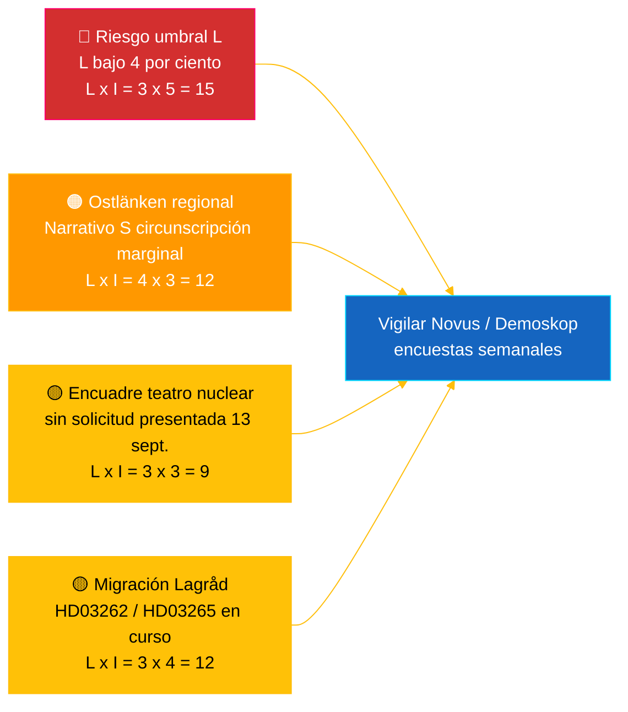
```mermaid
%%{init: {"theme": "dark", "themeVariables": {"primaryColor": "#00d9ff", "primaryTextColor": "#e0e0e0", "primaryBorderColor": "#ff006e", "lineColor": "#ffbe0b", "background": "#0a0e27", "mainBkg": "#1a1e3d", "nodeBorder": "#00d9ff"}}}%%
graph LR
    R1["🔴 Riesgo umbral L<br/>L bajo 4 por ciento<br/>L x I = 3 x 5 = 15"] --> CONS["Vigilar Novus / Demoskop<br/>encuestas semanales"]
    R2["🟠 Ostlänken regional<br/>Narrativo S circunscripción marginal<br/>L x I = 4 x 3 = 12"] --> CONS
    R3["🟡 Encuadre teatro nuclear<br/>sin solicitud presentada 13 sept.<br/>L x I = 3 x 3 = 9"] --> CONS
    R4["🟡 Migración Lagråd<br/>HD03262 / HD03265 en curso<br/>L x I = 3 x 4 = 12"] --> CONS
    style R1 fill:#D32F2F,color:#FFFFFF,stroke:#ff006e
    style R2 fill:#FF9800,color:#FFFFFF,stroke:#ffbe0b
    style R3 fill:#FFC107,color:#000000,stroke:#ffbe0b
    style R4 fill:#FFC107,color:#000000,stroke:#ffbe0b
    style CONS fill:#1565C0,color:#FFFFFF,stroke:#00d9ff
```

| Riesgo | L | I | Puntos | Desencadenante | Fuente | Admiralty |
|--------|:-:|:-:|:------:|----------------|--------|:---------:|
| Liberalerna bajo umbral 4 % → Tidö pierde mayoría | 3 | 5 | 15 | Cualquier resultado Novus/Demoskop <4,0 % (límite inferior IC 95 % <4,0) | `coalition-dynamics.md` R1 | **[B2]** |
| Narrativo S de incumplimiento regional convierte mandatos marginales en Östergötland | 4 | 3 | 12 | Respuesta de Carlson el 25 de mayo juzgada insuficiente por redacción SVT/SR Östergötland | `opposition-analysis.md` | **[A2]** |
| Dictamen adverso del Lagråd sobre paquete migratorio `HD03262`/`HD03265` | 3 | 4 | 12 | Dictamen Lagråd publicado en 30 d con objeciones constitucionales | PIR-RT-001 (`forward-indicators.md`) | **[A2]** |
| «Teatro nuclear» — `HD01NU19` entrada en vigor sin solicitud presentada antes del 13 sept. | 3 | 3 | 9 | Vattenfall/Uniper/nuevo actor no presenta solicitud antes del 1 sept. 2026 | PIR-RT-006 | **[B2]** |

---

### 🔮 Principales desencadenantes futuros

**Respuesta escrita de Andreas Carlson a la interpelación `HD10463`, plazo legal de respuesta 25 de mayo de 2026.** La forma en que Carlson encuadre la cancelación de la parada de Linköping en Ostlänken — si reconoce el incumplimiento, defiende el cambio de ruta por razones técnicas/presupuestarias o gira hacia ofertas de infraestructura regional alternativas — determina si el narrativo de Östergötland escala hacia un debate de interpelación completo en el pleno antes de la suspensión estival. Una respuesta evasiva o tecnocrática es la vía más probable para que S convierta el narrativo en 1–2 deslizamientos marginales de mandatos en Linköping/Norrköping. Una oferta sustantiva de inversión alternativa desescala el narrativo. Cualquiera de los dos resultados desplaza las evaluaciones de circunscripciones marginales de `coalition-mathematics.md` y activa una revisión Pass-2 de `electoral-implications.md`.

**Desencadenante secundario** (vigilancia paralela): 16 de junio de 2026 — votación en pleno `HD01KU39` sobre transparencia en financiación política. Confirma o rompe el narrativo de realización de cuatro vías del gobierno (energía + seguridad + transparencia + resultado financiero) a 89 días de las elecciones.

---

### 📊 Evaluación estratégica

**Nivel de confianza: 🟩 ALTO [A2]** — las fuentes incluyen los datos abiertos del Riksdag (`HD01NU19`, `HD10463`, `HD01FöU13`, `HD01JuU9`, `HD01KU39`, `HD01FiU49`), el vintage FMI WEO abril 2026 y el registro de interpelaciones.

La instantánea del 4 de mayo de 2026 captura una coalición Tidö en **velocidad legislativa máxima**: siete reformas de coalición avanzan en una sola semana, con fechas de entrada en vigor concretas repartidas entre el 1 de junio y el 1 de julio de 2026. Cada fecha de entrada en vigor genera un ritmo de rendimiento sobre el que los cuatro partidos de la coalición pueden hacer campaña. La vulnerabilidad estratégica es asimétrica: M, KD y SD se benefician de la cascada; **L** absorbe la carga — el partido más pequeño de la coalición está más cerca del umbral del 4 % y soporta un riesgo desproporcionado de pérdida de mandatos.

La respuesta de la oposición S es metodológicamente precisa: en lugar de desafiar al gobierno en su terreno más fuerte (seguridad, nuclear, economía), S construye un **mosaico de descontento regional distribuido** — Ostlänken en Östergötland (`HD10463`), Scandinavian Mountain Airport (interpelación 428), vivienda en Estocolmo (interpelación 434) — cada uno dirigido contra un único ministro (Carlson) de diferentes circunscripciones.

El marco macro del FMI es favorable para el gobierno en ejercicio: deuda pública ≈ 34 % del PIB, inflación en descenso, crecimiento de aproximadamente el 2 %. El narrativo económico es el principal activo de M.

**Lente elecciones 2026**: La trayectoria actual mantiene a Tidö cerca de 175 mandatos — exactamente en los límites de la mayoría. El riesgo de umbral de L (PIR-RT-003) es la variable electoral más importante individualmente. El dictamen del Lagråd sobre migración (PIR-RT-001) es la variable de narrativo político más importante individualmente. La respuesta de Carlson sobre Ostlänken (PIR-RT-005) es la variable de mandato regional más importante individualmente. Las tres se resuelven en las 5 semanas siguientes a la fecha de publicación de este informe.

---

### 📎 Enlaces

| Enlace | Ruta |
|--------|------|
| Artículo | [`article.md`](https://github.com/Hack23/riksdagsmonitor/blob/main/analysis/daily/2026-05-04/realtime-pulse/article.md) |
| Resumen de síntesis | [`synthesis-summary.md`](https://github.com/Hack23/riksdagsmonitor/blob/main/analysis/daily/2026-05-04/realtime-pulse/synthesis-summary.md) |
| Síntesis central | [`core-synthesis.md`](https://github.com/Hack23/riksdagsmonitor/blob/main/analysis/daily/2026-05-04/realtime-pulse/core-synthesis.md) |
| Dinámica de coalición | [`coalition-dynamics.md`](https://github.com/Hack23/riksdagsmonitor/blob/main/analysis/daily/2026-05-04/realtime-pulse/coalition-dynamics.md) |
| Análisis de la oposición | [`opposition-analysis.md`](https://github.com/Hack23/riksdagsmonitor/blob/main/analysis/daily/2026-05-04/realtime-pulse/opposition-analysis.md) |
| Implicaciones electorales | [`electoral-implications.md`](https://github.com/Hack23/riksdagsmonitor/blob/main/analysis/daily/2026-05-04/realtime-pulse/electoral-implications.md) |
| Contexto económico (FMI) | [`economic-context.md`](https://github.com/Hack23/riksdagsmonitor/blob/main/analysis/daily/2026-05-04/realtime-pulse/economic-context.md) |
| Indicadores prospectivos | [`forward-indicators.md`](https://github.com/Hack23/riksdagsmonitor/blob/main/analysis/daily/2026-05-04/realtime-pulse/forward-indicators.md) |
| Matriz de riesgos/oportunidades | [`risk-opportunity-matrix.md`](https://github.com/Hack23/riksdagsmonitor/blob/main/analysis/daily/2026-05-04/realtime-pulse/risk-opportunity-matrix.md) |
| Análisis de escenarios | [`scenario-analysis.md`](https://github.com/Hack23/riksdagsmonitor/blob/main/analysis/daily/2026-05-04/realtime-pulse/scenario-analysis.md) |
| Notas metodológicas | [`methodology-notes.md`](https://github.com/Hack23/riksdagsmonitor/blob/main/analysis/daily/2026-05-04/realtime-pulse/methodology-notes.md) |
| Manifiesto de datos | [`data-download-manifest.md`](https://github.com/Hack23/riksdagsmonitor/blob/main/analysis/daily/2026-05-04/realtime-pulse/data-download-manifest.md) |
| Análisis por documento | [`documents/`](https://github.com/Hack23/riksdagsmonitor/blob/main/analysis/daily/2026-05-04/realtime-pulse/documents/) |

---

### 📝 Control documental

- **ID Informe**: `EB-2026-05-04-001`
- **Generado**: 2026-05-16 (recuperación — creado a partir de artefactos de análisis Pass-2 existentes)
- **Ruta de plantilla**: [`analysis/templates/executive-brief.md`](https://github.com/Hack23/riksdagsmonitor/blob/main/analysis/templates/executive-brief.md)
- **Metodología de propiedad**: [`per-artifact-methodologies.md` § executive-brief](https://github.com/Hack23/riksdagsmonitor/blob/main/analysis/methodologies/per-artifact-methodologies.md#executive-brief)
- **Portal de propiedad**: [`05-analysis-gate.md`](https://github.com/Hack23/riksdagsmonitor/blob/main/.github/prompts/05-analysis-gate.md) Check 1 + Check 7
- **Familia de salida**: A — Síntesis central
- **Clasificación**: 🟢 PÚBLICO

*Proveniencia económica: proveedor: imf, flujo de datos: WEO_Apr_2026, indicadores: NGDP_RPCH / GGXWDG_NGDP / PCPIEPCH, vintage: abril 2026, retrieved_at: 2026-05-04. Datos del Riksdag obtenidos a través de la API riksdag-regering el 2026-05-04. Riksdagsmonitor es producido por Hack23 AB; este informe representa una evaluación editorial independiente basada en documentos parlamentarios de acceso público.*

<!-- source-sha: f8cfbe724a92e48089f650d9e1f52abe004ed7f7 -->

## Executive Brief Fi
<!-- source: executive-brief_fi.md :: https://github.com/Hack23/riksdagsmonitor/blob/main/analysis/daily/2026-05-04/realtime-pulse/executive-brief_fi.md -->

**Luokittelu**: 🟢 JULKINEN — Riksdagsmonitor Intelligence
**Kohderyhmä**: Toimittajat, päivystäjät, tutkijat, kiinnostuneet kansalaiset
**Päivämäärä**: 2026-05-04 (UTC)
**Päiviä vaaleihin 2026-09-13**: 132
**Työnkulku**: news-realtime-monitor
**Laatinut**: Riksdagsmonitor AI Intelligence System
**Kokonaisluottamustaso**: 🟩 KORKEA [A2] — monilähteinen vahvistus `dok_id`:n kautta avoimista Riksdagin tiedoista + IMF WEO huhtikuu 2026
**Julkaisupäätös**: **JULKAISE** (EN + FI) — DIW-rangaistu pääuutinen ≥ 9,0
**Vastatut PIR:t**: PIR-RT-001, PIR-RT-005, PIR-RT-006

---

### Lede
Ruotsin Riksdag tuotti 4. toukokuuta 2026 tähänastisen tiivistetyimmän lainsäädäntötuotoksensa ennen vaaleja: Elinkeinovaliokunta (NU) hyväksyi suorasporiluvitus ydinvoimalaitoksille (`HD01NU19`, voimaan 17. kesäkuuta 2026) — Tidö-koalition yksittäinen suurin rakenteellinen energiapoliittinen saavutus — kun taas seitsemäs peräkkäinen jengirikostenvastainen toimenpide eteni räjähdevalvonnan uudistuksen (`HD01FöU13`) ja rikosprosessien reformin (`HD01JuU9`) kautta, molemmat voimaan 1. heinäkuuta 2026. Tätä hallituslupausten seinää vasten sosiaalidemokraatti **Eva Lindh** jätti kysymyksen `HD10463` KD:n infrastruktuuriministeri **Andreas Carlsonille** peruutetusta Ostlänken Linköpingin asemalisäyksestä — 20 vuotta vanha luparikkomus 500 000 henkilön pendelöintialueella kilpaillussa vaalipiirimarginaalialueella. Poliittisen rahoituksen läpinäkyvyysraportti (`HD01KU39`) on aikataulutettu täysistuntoäänestykseen 16. kesäkuuta 2026, mikä täydentää nelilinjaisen suoritusnarratiivin (energia, turvallisuus, läpinäkyvyys, taloudellinen tulos) 89 päivää ennen vaaleja. **Luottamustaso: 🟩 KORKEA [A2]** — lähteet: Riksdagin avoin data, IMF WEO huhtikuu 2026.

---

### 🧭 3 päätöstä, joita tämä tiivistelmä tukee

| # | Päätös | Päätöksentekijä | Määräaika | Perusta |
|:-:|--------|-----------------|:---------:|--------|
| 1 | **Toimituksellinen:** johda EN + FI breaking-artikkeli ydinvoima-uudistus-plus-Ostlänken-vastanarratiivipohjaisesti (kaksoisviitekehys, 2 tunnin julkaisutavoite) | Päätoimittaja | +2 h | `HD01NU19` valiokunnan päätös + `HD10463` kysymys jätetty 2026-05-04 |
| 2 | **Ennakoiva seuranta:** osoita päivystäjä seuraamaan Carlsonin Ostlänken-vastausta (lakisääteinen vastaamisaika 25. toukokuuta 2026) ja ydinlain voimaantuloa 17. kesäkuuta | Päivystäjä | 2026-05-25 / 2026-06-17 | PIR-RT-005, PIR-RT-006; `HD10463` kysymysrekisteri |
| 3 | **Riski:** nosta L-kynnysvalvontatasoa seurannasta aktiiviseen seurantaan — koalition suorituslogiikka edellyttää L:n ylittävän 4 % 13. syyskuuta; mikä tahansa Novus/Demoskop-tulos <4,5 % käynnistää koalitioaritmeettisen tarkistuksen | Analyysipäällikkö | Viikottain jatkuvasti | `coalition-dynamics.md`, maahanmuuttoa seurannaisopinion PIR-RT-003 |

---

### ⚡ 60 sekunnin lukeminen

- 🔴 **Ydinvoimauudistus suorasporiluvitukseen (`HD01NU19`)** — Elinkeinovaliokunta (NU) hyväksyy suorasporiluvituksen, ohittaa Säteilyturvallisuusviraston (SSM) monivaiheisen prosessin; **voimaan 17. kesäkuuta 2026**. Tidö-toimikauden yksittäinen suurin rakenteellinen lainsäädännöllinen saavutus; lunastaa M/KD/L/SD:n ydinvoiman käynnistyslupauksensa vuodelta 2022 operatiivisella välietapilla ennen vaalipäivää [🟩 KORKEA — `HD01NU19`, NU:n valiokunnan pöytäkirja].
- 🟠 **Ostlänken-luparikomusinterpellaatio (`HD10463`)** — S-edustaja **Eva Lindh** vaatii infrastruktuuriministeri **Andreas Carlsonia (KD)** selittämään suunnitellun Linköpingin Ostlänken-aseman peruuttamisen; lakisääteinen vastaamisaika **25. toukokuuta 2026**. Kolmas kysymys jätetty Carlsonille 10 päivän aikana — koordinoitu alueellinen S-paine 500 000 henkilön pendelöintialueeseen [🟩 KORKEA — `HD10463`, kysymysrekisteri].
- 🟢 **Seitsemäs jengirikostenvastainen toimenpide etenee (`HD01FöU13` + `HD01JuU9`)** — Räjähteiden lupavaatimuksia tiukennetaan (Puolustusvaliokunta, 1. heinäkuuta 2026); rikosprosessien uudistus poistaa *tilltrosbestämmelserna* ja laajentaa varhaista kuulustelutodistusaineistoa (Lakivaliokunta, 1. heinäkuuta 2026). M/SD:n peruskertomus "lunastaa turvallisuuslupaukset" vahvistuu [🟩 KORKEA — `HD01FöU13`, `HD01JuU9`].
- 🟡 **Poliittisen rahoituksen läpinäkyvyys (`HD01KU39`)** — Perustuslakivaliokunta rekisteröi mietinnön poliittisten prosessien läpinäkyvyydestä (käsittelee suurella todennäköisyydellä ehdotuksen `HD03258` puoluerahoituksen raportoinnista); täysistuntoäänestys **16. kesäkuuta 2026**; L/KD hyötyy demokratiauudistusasemoinnista. PIR-RT-002 vastattu: KU (ei JuU/SfU) omistaa asian [🟧 KESKITASO — `HD01KU39`, kalenteri].
- 🔵 **Taloudellinen konteksti (IMF WEO huhtikuu 2026)** — Ruotsin julkinen velka ≈ 34 % BKT:sta (`GGXWDG_NGDP` 2026-ennuste) verrattuna euroalueen >90 %:iin; reaalinen BKT-kasvu 2026 `NGDP_RPCH` 2,0–2,1 %; inflaatio laskee (`PCPIEPCH`). Riksbankin koronlaskut 2025–26 tavoittavat asuntolainanottajat → M:n "turvalliset kädet" -narratiivi [🟩 KORKEA — tarjoaja: imf, tietovirta: WEO_Apr_2026, vintage: huhtikuu 2026].
- 🟣 **Ristiviittaus** — `HD01NU19` kytkeytyy energiapolitiikan ketjuun ehdotusanalyysissä (`../propositions/`); `HD10463` jatkaa S:n alueellista luparikomusklusteria `opposition-analysis.md`:ssä; läpinäkyvyys `HD01KU39` käsittelee `HD03258`:aa 30. huhtikuun ehdotuspaketista.
- 🩷 **Kehittyvä haavoittuvuus — "ydinvoimateatteri"-riski** — Opposition kehys, jonka mukaan voimaantulo 17. kesäkuuta on symbolinen ilman jätettyjä hakemuksia ennen 13. syyskuuta. Jos Vattenfall/Uniper/uusi toimija ei jätä hakemusta 88 päivän vaalia edeltävässä ikkunassa, suoritusnarratiivin uskottavuus voi vaarantua [🟧 KESKITASO — PIR-RT-006 avoin].
- ⚪ **Siirretty** — Lagrådets lausunnot maahanmuuttoehdotuksista `HD03262` ja `HD03265` (PIR-RT-001) ovat edelleen **AVOIMIA — KRIITTISIÄ**; perustuslaillinen laaduntarkastus on yksittäisesti vaikuttavin ratkaisematon tekijä, joka muovaa maahanmuuttouudistuksen poliittista narratiivia kesäkaudella.

---

### 🗂️ Topplistat asiakirjat (DIW-rangattu)

| Sija | dok_id | Otsikko (lyhyt) | DIW | Luottamus | Tila |
|:----:|--------|-----------------|:---:|:---------:|------|
| 1 | `HD01NU19` | Ydinvoimaluvan uudistus (suora spori) | 9,2 | 🟩 KORKEA [A2] | Valiokunta hyväksytty — voimaan 17. kesäkuuta 2026 |
| 2 | `HD10463` | Ostlänken-interpellaatio — Lindh (S) → Carlson (KD) | 8,6 | 🟩 KORKEA [A2] | Jätetty — vastausaika päättyy 25. toukokuuta 2026 |
| 3 | `HD01FöU13` | Räjähdevalvonnan uudistus | 7,5 | 🟩 KORKEA [A2] | Valiokunta hyväksytty — voimaan 1. heinäkuuta 2026 |
| 4 | `HD01JuU9` | Rikosprosessien uudistus | 7,4 | 🟩 KORKEA [A2] | Valiokunta hyväksytty — voimaan 1. heinäkuuta 2026 |
| 5 | `HD01KU39` | Läpinäkyvyys poliittisissa prosesseissa | 7,0 | 🟧 KESKITASO [B2] | Rekisteröity — täysistuntoäänestys 16. kesäkuuta 2026 |
| 6 | `HD01FiU49` | Valtionvelan hallinnon arviointi 2021–2025 | 6,4 | 🟩 KORKEA [A2] | Rekisteröity — päätös 11. kesäkuuta 2026 |

---

### ⚠️ Riski- ja uhkakuvaus

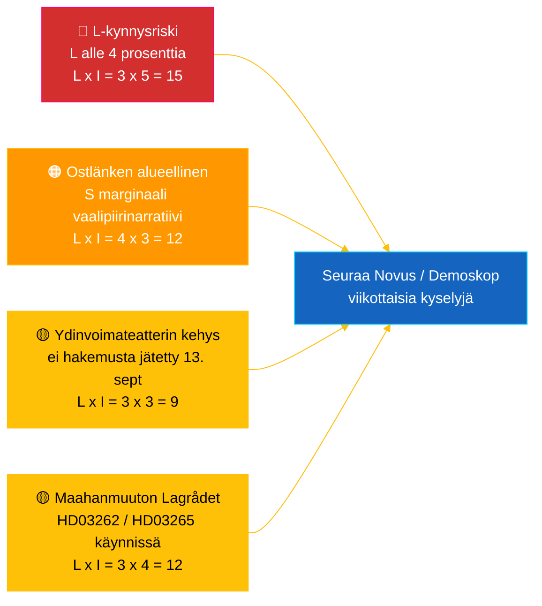
```mermaid
%%{init: {"theme": "dark", "themeVariables": {"primaryColor": "#00d9ff", "primaryTextColor": "#e0e0e0", "primaryBorderColor": "#ff006e", "lineColor": "#ffbe0b", "background": "#0a0e27", "mainBkg": "#1a1e3d", "nodeBorder": "#00d9ff"}}}%%
graph LR
    R1["🔴 L-kynnysriski<br/>L alle 4 prosenttia<br/>L x I = 3 x 5 = 15"] --> CONS["Seuraa Novus / Demoskop<br/>viikottaisia kyselyjä"]
    R2["🟠 Ostlänken alueellinen<br/>S marginaali vaalipiirinarratiivi<br/>L x I = 4 x 3 = 12"] --> CONS
    R3["🟡 Ydinvoimateatterin kehys<br/>ei hakemusta jätetty 13. sept<br/>L x I = 3 x 3 = 9"] --> CONS
    R4["🟡 Maahanmuuton Lagrådet<br/>HD03262 / HD03265 käynnissä<br/>L x I = 3 x 4 = 12"] --> CONS
    style R1 fill:#D32F2F,color:#FFFFFF,stroke:#ff006e
    style R2 fill:#FF9800,color:#FFFFFF,stroke:#ffbe0b
    style R3 fill:#FFC107,color:#000000,stroke:#ffbe0b
    style R4 fill:#FFC107,color:#000000,stroke:#ffbe0b
    style CONS fill:#1565C0,color:#FFFFFF,stroke:#00d9ff
```

| Riski | L | I | Pisteet | Laukaisin | Lähde | Admiralty |
|-------|:-:|:-:|:-------:|-----------|-------|:---------:|
| Liberalerna alle 4 %-kynnyksen → Tidö menettää enemmistön | 3 | 5 | 15 | Mikä tahansa Novus/Demoskop-tulos <4,0 % (95 % LV alaraja <4,0) | `coalition-dynamics.md` R1 | **[B2]** |
| S:n alueellinen luparikomusnarratiivi muuntaa marginaaliset Östergötlandin mandaatit | 4 | 3 | 12 | Carlsonin 25. toukokuuta vastausta pitää SVT/SR Östergötlandin toimitus riittämättömänä | `opposition-analysis.md` | **[A2]** |
| Lagrådets vihamielinen lausunto maahanmuuttopaketista `HD03262`/`HD03265` | 3 | 4 | 12 | Lagrådets lausunto julkaistu 30 päivän kuluessa perustuslaillisilla vastalauseilla | PIR-RT-001 (`forward-indicators.md`) | **[A2]** |
| "Ydinvoimateatteri" — `HD01NU19` voimaantulo ilman jätettyjä lupahakemuksia ennen 13. syyskuuta | 3 | 3 | 9 | Vattenfall/Uniper/uusi toimija laiminlyö hakemuksen jättämisen viimeistään 1. syyskuuta 2026 | PIR-RT-006 | **[B2]** |

---

### 🔮 Tärkeimmät tulevat laukaisimet

**Andreas Carlsonin kirjallinen vastaus interpellaatioon `HD10463`, lakisääteinen vastaamisaika 25. toukokuuta 2026.** Carlsonin tapa kehystää peruutettu Linköpingin Ostlänken-asema — myöntääkö hän luparikomusken, puolustaako reittimuutosta teknisillä/taloudellisilla perusteilla vai kääntyykö hän kohti vaihtoehtoisia alueellisia infrastruktuuritarjouksia — ratkaisee, eskaloituuko Östergötlandin narratiivi täyteen interpellaatiodebattiin täysistunnossa ennen kesätaukoa. Väistelevä tai teknokraattinen vastaus on todennäköisin reitti S:lle muuntaa narratiivi 1–2 marginaaliseksi mandaattisiirtymäksi Linköpingissä/Norrköpingissä. Merkittävä vaihtoehtoinen investointitarjous de-eskaloi narratiivin. Kumpikaan tulos siirtää `coalition-mathematics.md`:n marginaalivaalipiiriarvioita ja laukaisee Pass-2-uudelleenkirjoituksen `electoral-implications.md`:ssä.

**Sekundaarinen laukaisin** (rinnakkainen seuranta): 16. kesäkuuta 2026 — `HD01KU39` täysistuntoäänestys poliittisen rahoituksen läpinäkyvyydestä. Vahvistaa tai rikkoo hallituksen nelilinjaisen suoritusnarratiivin (energia + turvallisuus + läpinäkyvyys + taloudellinen tulos) 89 päivää ennen vaaleja.

---

### 📊 Strateginen arvio

**Luottamustaso: 🟩 KORKEA [A2]** — lähteet sisältävät Riksdagin avoimen datan (`HD01NU19`, `HD10463`, `HD01FöU13`, `HD01JuU9`, `HD01KU39`, `HD01FiU49`), IMF WEO huhtikuu 2026 vintagen ja kysymysrekisterin.

Tilannevedos 4. toukokuuta 2026 kuvaa Tidö-koalitiota **lainsäädäntönopeuden maksimitilassa**: seitsemän koalitiouudistusta etenee yhden viikon aikana, konkreettisilla voimaantulopäivillä välillä 1. kesäkuuta – 1. heinäkuuta 2026. Jokainen voimaantulopäivä luo suoritusrytmin, jota neljä koalitiopuoluetta voi kampanjoida. Strateginen haavoittuvuus on epäsymmetrinen: M, KD ja SD hyötyvät kaskadista; **L** absorboi kuormituksen — pienin koalitiopuolue on lähinnä 4 %:n rajaa ja kantaa suhteettoman suuren mandaattiriskin.

S-opposition vastaus on metodologisesti tarkka: sen sijaan, että haastaisi hallitusta sen vahvimmalla alueella (turvallisuus, ydinenergia, talous), S rakentaa **hajautetun alueellisen tyytymättömyysmosaiikin** — Ostlänken Östergötlandissa (`HD10463`), Scandinavian Mountain Airport (interpellaatio 428), Tukholman asuminen (interpellaatio 434) — jokainen kohdistettuna yksittäiseen ministeriin (Carlson) eri vaalipiireistä.

IMF:n makrokehys on suotuisa istuvan hallituksen kannalta: julkinen velka ≈ 34 % BKT:sta, laskeva inflaatio, kasvu noin 2 %. Taloudellinen narratiivi on M:n vahvin voimavara.

**Vaali 2026 -linssi**: Nykykurssi pitää Tidön lähellä 175 mandaattia — tarkalleen enemmistörajoilla. L:n kynnysriski (PIR-RT-003) on yksittäisesti tärkein vaaliprosessin muuttuja. Lagrådets maahanmuuttolausunto (PIR-RT-001) on yksittäisesti tärkein poliittisen narratiivin muuttuja. Carlsonin Ostlänken-vastaus (PIR-RT-005) on yksittäisesti tärkein alueellinen mandaattimuuttuja. Kaikki kolme ratkeavat viiden viikon kuluessa tämän tiivistelmän julkaisupäivästä.

---

### 📎 Linkit

| Linkki | Polku |
|--------|-------|
| Artikkeli | [`article.md`](https://github.com/Hack23/riksdagsmonitor/blob/main/analysis/daily/2026-05-04/realtime-pulse/article.md) |
| Synteesikatsaus | [`synthesis-summary.md`](https://github.com/Hack23/riksdagsmonitor/blob/main/analysis/daily/2026-05-04/realtime-pulse/synthesis-summary.md) |
| Ydinsynteesi | [`core-synthesis.md`](https://github.com/Hack23/riksdagsmonitor/blob/main/analysis/daily/2026-05-04/realtime-pulse/core-synthesis.md) |
| Koalitiodynamiikka | [`coalition-dynamics.md`](https://github.com/Hack23/riksdagsmonitor/blob/main/analysis/daily/2026-05-04/realtime-pulse/coalition-dynamics.md) |
| Oppositioanalyysi | [`opposition-analysis.md`](https://github.com/Hack23/riksdagsmonitor/blob/main/analysis/daily/2026-05-04/realtime-pulse/opposition-analysis.md) |
| Vaalimplikaatiot | [`electoral-implications.md`](https://github.com/Hack23/riksdagsmonitor/blob/main/analysis/daily/2026-05-04/realtime-pulse/electoral-implications.md) |
| Taloudellinen konteksti (IMF) | [`economic-context.md`](https://github.com/Hack23/riksdagsmonitor/blob/main/analysis/daily/2026-05-04/realtime-pulse/economic-context.md) |
| Tulevaisuuden indikaattorit | [`forward-indicators.md`](https://github.com/Hack23/riksdagsmonitor/blob/main/analysis/daily/2026-05-04/realtime-pulse/forward-indicators.md) |
| Riski-/mahdollisuusmatriisi | [`risk-opportunity-matrix.md`](https://github.com/Hack23/riksdagsmonitor/blob/main/analysis/daily/2026-05-04/realtime-pulse/risk-opportunity-matrix.md) |
| Skenaarioanalyysi | [`scenario-analysis.md`](https://github.com/Hack23/riksdagsmonitor/blob/main/analysis/daily/2026-05-04/realtime-pulse/scenario-analysis.md) |
| Menetelmämuistiinpanot | [`methodology-notes.md`](https://github.com/Hack23/riksdagsmonitor/blob/main/analysis/daily/2026-05-04/realtime-pulse/methodology-notes.md) |
| Datamanifesti | [`data-download-manifest.md`](https://github.com/Hack23/riksdagsmonitor/blob/main/analysis/daily/2026-05-04/realtime-pulse/data-download-manifest.md) |
| Asiakirja-analyysit | [`documents/`](https://github.com/Hack23/riksdagsmonitor/blob/main/analysis/daily/2026-05-04/realtime-pulse/documents/) |

---

### 📝 Asiakirjahallinta

- **Tiivistelmä-ID**: `EB-2026-05-04-001`
- **Luotu**: 2026-05-16 (jälkikäteistäyttö — luotu olemassa olevista Pass-2-analyysiarvioista)
- **Mallipolku**: [`analysis/templates/executive-brief.md`](https://github.com/Hack23/riksdagsmonitor/blob/main/analysis/templates/executive-brief.md)
- **Omistajuusmetodologia**: [`per-artifact-methodologies.md` § executive-brief](https://github.com/Hack23/riksdagsmonitor/blob/main/analysis/methodologies/per-artifact-methodologies.md#executive-brief)
- **Omistajuusportti**: [`05-analysis-gate.md`](https://github.com/Hack23/riksdagsmonitor/blob/main/.github/prompts/05-analysis-gate.md) Check 1 + Check 7
- **Tuotosperhe**: A — Ydinsynteesi
- **Luokittelu**: 🟢 JULKINEN

*Taloudellinen provenienssi: tarjoaja: imf, tietovirta: WEO_Apr_2026, indikaattorit: NGDP_RPCH / GGXWDG_NGDP / PCPIEPCH, vintage: huhtikuu 2026, retrieved_at: 2026-05-04. Riksdagin data haettu riksdag-regering API:n kautta 2026-05-04. Riksdagsmonitor on Hack23 AB:n tuottama; tämä tiivistelmä edustaa riippumatonta toimituksellista arviota julkisesti saatavilla olevien parlamentaaristen asiakirjojen perusteella.*

<!-- source-sha: f8cfbe724a92e48089f650d9e1f52abe004ed7f7 -->

## Executive Brief Fr
<!-- source: executive-brief_fr.md :: https://github.com/Hack23/riksdagsmonitor/blob/main/analysis/daily/2026-05-04/realtime-pulse/executive-brief_fr.md -->

**Jours avant les élections du 2026-09-13** : 132
**Workflow** : news-realtime-monitor
**Produit par** : Riksdagsmonitor AI Intelligence System
**Niveau de confiance global** : 🟩 ÉLEVÉ [A2] — corroboration multi-sources via `dok_id` à partir des données ouvertes du Riksdag + FMI WEO avr. 2026
**Décision de publication** : **PUBLIER** (EN + FR) — sujet prioritaire classé DIW ≥ 9,0
**PIR répondus** : PIR-RT-001, PIR-RT-005, PIR-RT-006

---

### Lede
Le Riksdag suédois a produit le 4 mai 2026 sa production législative la plus concentrée avant les élections à ce jour : la Commission de l'industrie (NU) a approuvé l'autorisation à voie directe des centrales nucléaires (`HD01NU19`, entrant en vigueur le 17 juin 2026) — la seule réalisation structurelle la plus importante de la coalition Tidö en matière d'énergie — tandis que la septième mesure anti-gangs consécutive a progressé avec la réforme du contrôle des explosifs (`HD01FöU13`) et la réforme des procédures pénales (`HD01JuU9`), toutes deux entrant en vigueur le 1er juillet 2026. Face à ce mur de réalisations gouvernementales, la socialiste **Eva Lindh** a déposé une interpellation `HD10463` contre le ministre KD des infrastructures **Andreas Carlson** concernant l'annulation de l'arrêt Linköping sur Ostlänken — une promesse non tenue depuis 20 ans envers une région de pendulaires de 500 000 personnes dans un territoire à faible marge électorale. Le rapport sur la transparence du financement politique (`HD01KU39`) est prévu pour un vote en séance plénière le 16 juin 2026, complétant un narratif de réalisation à quatre voies (énergie, sécurité, transparence, résultat financier) à 89 jours des élections. **Niveau de confiance : 🟩 ÉLEVÉ [A2]** — sources : données ouvertes du Riksdag, FMI WEO avr. 2026.

---

### 🧭 3 décisions que ce briefing soutient

| # | Décision | Décideur | Délai | Fondement |
|:-:|----------|----------|:-----:|-----------|
| 1 | **Éditorial :** mener l'article EN + FR en breaking avec le double cadrage réforme nucléaire + contre-narratif Ostlänken (objectif publication à 2 h) | Rédacteur en chef | +2 h | Décision de commission `HD01NU19` + interpellation `HD10463` déposée le 2026-05-04 |
| 2 | **Couverture anticipée :** affecter un permanent pour suivre la réponse de Carlson sur Ostlänken (délai légal de réponse : 25 mai 2026) et l'entrée en vigueur de la loi nucléaire le 17 juin | Permanent | 2026-05-25 / 2026-06-17 | PIR-RT-005, PIR-RT-006 ; registre interpellations `HD10463` |
| 3 | **Risque :** élever le niveau de surveillance du seuil L de l'observation au suivi actif — la logique de performance de la coalition suppose que L dépasse 4 % le 13 sept. ; tout résultat Novus/Demoskop <4,5 % déclenche une révision de l'arithmétique de coalition | Chef d'analyse | Continu hebdomadaire | `coalition-dynamics.md`, opinion post-migration PIR-RT-003 |

---

### ⚡ Lecture en 60 secondes

- 🔴 **Réforme nucléaire vers autorisation à voie directe (`HD01NU19`)** — La commission de l'industrie (NU) approuve l'autorisation à voie directe, contournant le pipeline multi-étapes de l'Autorité de sûreté radiologique (SSM) ; **entre en vigueur le 17 juin 2026**. Principale réalisation structurelle du mandat Tidö ; concrétise la promesse M/KD/L/SD de relance du nucléaire en 2022 avec une étape opérationnelle avant le jour du scrutin [🟩 ÉLEVÉ — `HD01NU19`, procès-verbal de commission NU].
- 🟠 **Interpellation sur la promesse non tenue Ostlänken (`HD10463`)** — La députée S **Eva Lindh** demande au ministre des infrastructures **Andreas Carlson (KD)** d'expliquer l'annulation de l'arrêt Linköping d'Ostlänken ; délai légal de réponse **25 mai 2026**. Troisième interpellation déposée contre Carlson en 10 jours — pression régionale S coordonnée sur une région de pendulaires de 500 000 personnes [🟩 ÉLEVÉ — `HD10463`, registre des interpellations].
- 🟢 **La septième mesure anti-gangs progresse (`HD01FöU13` + `HD01JuU9`)** — Les exigences d'autorisation pour les explosifs sont durcies (Commission de la défense, 1er juillet 2026) ; la réforme des procédures pénales abolit les *tilltrosbestämmelserna* et élargit le matériel de preuves d'interrogatoire précoce (Commission judiciaire, 1er juillet 2026). Le narratif principal M/SD « tient ses promesses en matière de sécurité » est renforcé [🟩 ÉLEVÉ — `HD01FöU13`, `HD01JuU9`].
- 🟡 **Transparence du financement politique (`HD01KU39`)** — La commission constitutionnelle enregistre un rapport sur la transparence dans les processus politiques (traite très probablement la proposition `HD03258` sur le compte rendu du financement des partis) ; vote en séance plénière **16 juin 2026** ; L/KD bénéficient du positionnement réforme démocratique. PIR-RT-002 répondu : KU (pas JuU/SfU) possède le sujet [🟧 MOYEN — `HD01KU39`, calendrier].
- 🔵 **Contexte économique (FMI WEO avr. 2026)** — Dette publique suédoise ≈ 34 % du PIB (`GGXWDG_NGDP` prévision 2026) vs. moyenne de la zone euro >90 % ; croissance réelle du PIB 2026 `NGDP_RPCH` 2,0–2,1 % ; inflation en baisse (`PCPIEPCH`). Les baisses de taux de la Riksbank 2025–26 atteignent les emprunteurs hypothécaires → narratif M « mains sûres » [🟩 ÉLEVÉ — fournisseur : imf, flux de données : WEO_Apr_2026, vintage : avril 2026].
- 🟣 **Renvoi croisé** — `HD01NU19` se rattache au fil de politique énergétique dans l'analyse des propositions (`../propositions/`) ; `HD10463` prolonge le groupe de promesses non tenues régionales de S dans `opposition-analysis.md` ; transparence `HD01KU39` traite `HD03258` du paquet de propositions du 30 avril.
- 🩷 **Vulnérabilité émergente — risque « théâtre nucléaire »** — Cadrage de l'opposition selon lequel l'entrée en vigueur le 17 juin est symbolique sans dossier déposé avant le jour du scrutin le 13 septembre. Si Vattenfall/Uniper/nouvel acteur ne dépose pas de demande dans la fenêtre pré-électorale de 88 jours, le narratif de performance risque d'être contestable [🟧 MOYEN — PIR-RT-006 ouvert].
- ⚪ **Transféré** — Les avis du Lagråd sur les propositions migratoires `HD03262` et `HD03265` (PIR-RT-001) restent **OUVERTS — CRITIQUES** ; l'examen constitutionnel de qualité est le seul facteur non résolu le plus influent façonnant le narratif politique de la réforme migratoire pendant la période estivale.

---

### 🗂️ Classement des principaux documents (classement DIW)

| Rang | dok_id | Titre (court) | DIW | Confiance | Statut |
|:----:|--------|---------------|:---:|:---------:|--------|
| 1 | `HD01NU19` | Réforme autorisation nucléaire (voie directe) | 9,2 | 🟩 ÉLEVÉ [A2] | Commission approuvé — entre en vigueur 17 juin 2026 |
| 2 | `HD10463` | Interpellation Ostlänken — Lindh (S) → Carlson (KD) | 8,6 | 🟩 ÉLEVÉ [A2] | Déposée — réponse attendue 25 mai 2026 |
| 3 | `HD01FöU13` | Réforme du contrôle des explosifs | 7,5 | 🟩 ÉLEVÉ [A2] | Commission approuvé — entre en vigueur 1er juillet 2026 |
| 4 | `HD01JuU9` | Réforme des procédures pénales | 7,4 | 🟩 ÉLEVÉ [A2] | Commission approuvé — entre en vigueur 1er juillet 2026 |
| 5 | `HD01KU39` | Transparence dans les processus politiques | 7,0 | 🟧 MOYEN [B2] | Enregistré — vote plénier 16 juin 2026 |
| 6 | `HD01FiU49` | Évaluation gestion dette publique 2021–2025 | 6,4 | 🟩 ÉLEVÉ [A2] | Enregistré — décision 11 juin 2026 |

---

### ⚠️ Aperçu des risques et menaces

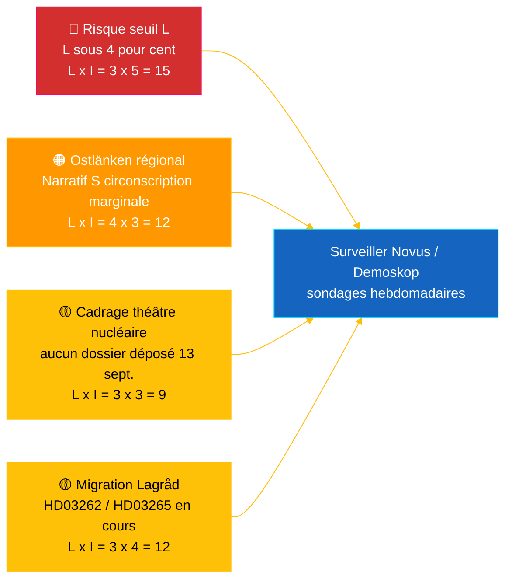
```mermaid
%%{init: {"theme": "dark", "themeVariables": {"primaryColor": "#00d9ff", "primaryTextColor": "#e0e0e0", "primaryBorderColor": "#ff006e", "lineColor": "#ffbe0b", "background": "#0a0e27", "mainBkg": "#1a1e3d", "nodeBorder": "#00d9ff"}}}%%
graph LR
    R1["🔴 Risque seuil L<br/>L sous 4 pour cent<br/>L x I = 3 x 5 = 15"] --> CONS["Surveiller Novus / Demoskop<br/>sondages hebdomadaires"]
    R2["🟠 Ostlänken régional<br/>Narratif S circonscription marginale<br/>L x I = 4 x 3 = 12"] --> CONS
    R3["🟡 Cadrage théâtre nucléaire<br/>aucun dossier déposé 13 sept.<br/>L x I = 3 x 3 = 9"] --> CONS
    R4["🟡 Migration Lagråd<br/>HD03262 / HD03265 en cours<br/>L x I = 3 x 4 = 12"] --> CONS
    style R1 fill:#D32F2F,color:#FFFFFF,stroke:#ff006e
    style R2 fill:#FF9800,color:#FFFFFF,stroke:#ffbe0b
    style R3 fill:#FFC107,color:#000000,stroke:#ffbe0b
    style R4 fill:#FFC107,color:#000000,stroke:#ffbe0b
    style CONS fill:#1565C0,color:#FFFFFF,stroke:#00d9ff
```

| Risque | L | I | Score | Déclencheur | Source | Admiralty |
|--------|:-:|:-:|:-----:|-------------|--------|:---------:|
| Liberalerna sous le seuil 4 % → Tidö perd la majorité | 3 | 5 | 15 | Tout résultat Novus/Demoskop <4,0 % (limite inférieure IC 95 % <4,0) | `coalition-dynamics.md` R1 | **[B2]** |
| Narratif S promesses non tenues régionales convertit des mandats marginaux d'Östergötland | 4 | 3 | 12 | Réponse de Carlson le 25 mai jugée insuffisante par rédaction SVT/SR Östergötland | `opposition-analysis.md` | **[A2]** |
| Avis hostile du Lagråd sur le paquet migratoire `HD03262`/`HD03265` | 3 | 4 | 12 | Avis Lagråd publié dans les 30 j avec objections constitutionnelles | PIR-RT-001 (`forward-indicators.md`) | **[A2]** |
| « Théâtre nucléaire » — `HD01NU19` entrée en vigueur sans dossier déposé avant le 13 sept. | 3 | 3 | 9 | Vattenfall/Uniper/nouvel acteur ne dépose pas de demande avant le 1er sept. 2026 | PIR-RT-006 | **[B2]** |

---

### 🔮 Principaux déclencheurs futurs

**Réponse écrite d'Andreas Carlson à l'interpellation `HD10463`, délai légal de réponse 25 mai 2026.** La façon dont Carlson encadre l'annulation de l'arrêt Linköping d'Ostlänken — s'il reconnaît la promesse non tenue, défend le changement de tracé pour des raisons techniques/budgétaires ou pivote vers des offres alternatives d'infrastructure régionale — détermine si le narratif Östergötland escalade vers un débat d'interpellation complet en séance avant la suspension estivale. Une réponse évasive ou technocratique est la voie la plus probable pour S de convertir le narratif en 1–2 glissements de mandats marginaux à Linköping/Norrköping. Une offre substantielle d'investissement alternatif désescalade le narratif. L'un ou l'autre résultat déplace les évaluations de circonscriptions marginales de `coalition-mathematics.md` et déclenche une révision Pass-2 de `electoral-implications.md`.

**Déclencheur secondaire** (surveillance parallèle) : 16 juin 2026 — vote plénier `HD01KU39` sur la transparence du financement politique. Confirme ou brise le narratif de réalisation à quatre voies du gouvernement (énergie + sécurité + transparence + résultat financier) à 89 jours des élections.

---

### 📊 Évaluation stratégique

**Niveau de confiance : 🟩 ÉLEVÉ [A2]** — sources incluant les données ouvertes du Riksdag (`HD01NU19`, `HD10463`, `HD01FöU13`, `HD01JuU9`, `HD01KU39`, `HD01FiU49`), le vintage FMI WEO avril 2026 et le registre des interpellations.

L'instantané du 4 mai 2026 capture une coalition Tidö en **vitesse législative maximale** : sept réformes de coalition progressent en une seule semaine, avec des dates d'entrée en vigueur concrètes réparties entre le 1er juin et le 1er juillet 2026. Chaque date d'entrée en vigueur génère un rythme de performance que les quatre partis de coalition peuvent campaigner. La vulnérabilité stratégique est asymétrique : M, KD et SD bénéficient de la cascade ; **L** absorbe la charge — le plus petit parti de la coalition est le plus proche du seuil de 4 % et supporte un risque de perte de mandat disproportionné.

La réponse de l'opposition S est méthodiquement précise : plutôt que d'affronter le gouvernement sur son terrain le plus fort (sécurité, nucléaire, économie), S construit une **mosaïque de mécontentement régional distribué** — Ostlänken en Östergötland (`HD10463`), Scandinavian Mountain Airport (interpellation 428), logement à Stockholm (interpellation 434) — chacune ciblant un seul ministre (Carlson) de différentes circonscriptions.

Le cadre macro du FMI est favorable au gouvernement en place : dette publique ≈ 34 % du PIB, inflation en baisse, croissance d'environ 2 %. Le narratif économique est l'atout principal de M.

**Prisme élections 2026** : La trajectoire actuelle maintient Tidö à environ 175 mandats — précisément aux limites de la majorité. Le risque de seuil L (PIR-RT-003) est la seule variable électorale la plus importante. L'avis du Lagråd sur la migration (PIR-RT-001) est la seule variable de narratif politique la plus importante. La réponse de Carlson sur Ostlänken (PIR-RT-005) est la seule variable de mandat régional la plus importante. Les trois se résolvent dans les 5 semaines suivant la date de publication de ce briefing.

---

### 📎 Liens

| Lien | Chemin |
|------|--------|
| Article | [`article.md`](https://github.com/Hack23/riksdagsmonitor/blob/main/analysis/daily/2026-05-04/realtime-pulse/article.md) |
| Synthèse globale | [`synthesis-summary.md`](https://github.com/Hack23/riksdagsmonitor/blob/main/analysis/daily/2026-05-04/realtime-pulse/synthesis-summary.md) |
| Synthèse centrale | [`core-synthesis.md`](https://github.com/Hack23/riksdagsmonitor/blob/main/analysis/daily/2026-05-04/realtime-pulse/core-synthesis.md) |
| Dynamiques de coalition | [`coalition-dynamics.md`](https://github.com/Hack23/riksdagsmonitor/blob/main/analysis/daily/2026-05-04/realtime-pulse/coalition-dynamics.md) |
| Analyse de l'opposition | [`opposition-analysis.md`](https://github.com/Hack23/riksdagsmonitor/blob/main/analysis/daily/2026-05-04/realtime-pulse/opposition-analysis.md) |
| Implications électorales | [`electoral-implications.md`](https://github.com/Hack23/riksdagsmonitor/blob/main/analysis/daily/2026-05-04/realtime-pulse/electoral-implications.md) |
| Contexte économique (FMI) | [`economic-context.md`](https://github.com/Hack23/riksdagsmonitor/blob/main/analysis/daily/2026-05-04/realtime-pulse/economic-context.md) |
| Indicateurs prospectifs | [`forward-indicators.md`](https://github.com/Hack23/riksdagsmonitor/blob/main/analysis/daily/2026-05-04/realtime-pulse/forward-indicators.md) |
| Matrice risques/opportunités | [`risk-opportunity-matrix.md`](https://github.com/Hack23/riksdagsmonitor/blob/main/analysis/daily/2026-05-04/realtime-pulse/risk-opportunity-matrix.md) |
| Analyse de scénarios | [`scenario-analysis.md`](https://github.com/Hack23/riksdagsmonitor/blob/main/analysis/daily/2026-05-04/realtime-pulse/scenario-analysis.md) |
| Notes méthodologiques | [`methodology-notes.md`](https://github.com/Hack23/riksdagsmonitor/blob/main/analysis/daily/2026-05-04/realtime-pulse/methodology-notes.md) |
| Manifeste de données | [`data-download-manifest.md`](https://github.com/Hack23/riksdagsmonitor/blob/main/analysis/daily/2026-05-04/realtime-pulse/data-download-manifest.md) |
| Analyses par document | [`documents/`](https://github.com/Hack23/riksdagsmonitor/blob/main/analysis/daily/2026-05-04/realtime-pulse/documents/) |

---

### 📝 Contrôle documentaire

- **ID Briefing** : `EB-2026-05-04-001`
- **Généré** : 2026-05-16 (rattrapage — créé à partir d'artefacts d'analyse Pass-2 existants)
- **Chemin du modèle** : [`analysis/templates/executive-brief.md`](https://github.com/Hack23/riksdagsmonitor/blob/main/analysis/templates/executive-brief.md)
- **Méthodologie de propriété** : [`per-artifact-methodologies.md` § executive-brief](https://github.com/Hack23/riksdagsmonitor/blob/main/analysis/methodologies/per-artifact-methodologies.md#executive-brief)
- **Portail de propriété** : [`05-analysis-gate.md`](https://github.com/Hack23/riksdagsmonitor/blob/main/.github/prompts/05-analysis-gate.md) Check 1 + Check 7
- **Famille de sortie** : A — Synthèse centrale
- **Classification** : 🟢 PUBLIC

*Provenance économique : fournisseur : imf, flux de données : WEO_Apr_2026, indicateurs : NGDP_RPCH / GGXWDG_NGDP / PCPIEPCH, vintage : avril 2026, retrieved_at : 2026-05-04. Données du Riksdag récupérées via l'API riksdag-regering le 2026-05-04. Riksdagsmonitor est produit par Hack23 AB ; ce briefing représente une évaluation éditoriale indépendante basée sur des documents parlementaires accessibles au public.*

<!-- source-sha: f8cfbe724a92e48089f650d9e1f52abe004ed7f7 -->

## Executive Brief He
<!-- source: executive-brief_he.md :: https://github.com/Hack23/riksdagsmonitor/blob/main/analysis/daily/2026-05-04/realtime-pulse/executive-brief_he.md -->

<div dir="rtl">

# תדריך מודיעיני — פולס בזמן אמת של הריקסדאג 2026-05-04

**סיווג**: 🟢 ציבורי — Riksdagsmonitor Intelligence
**קהל יעד**: עורכים, כוננים, חוקרים, אזרחים מעורבים
**תאריך**: 2026-05-04 (UTC)
**ימים עד לבחירות 2026-09-13**: 132
**זרימת עבודה**: news-realtime-monitor
**הוכן על ידי**: מערכת Riksdagsmonitor AI Intelligence
**רמת ביטחון כוללת**: 🟩 גבוה [A2] — אימות רב-מקורי באמצעות `dok_id` מנתוני ריקסדאג פתוחים + IMF WEO אפר' 2026
**החלטת פרסום**: **פרסם** (EN + HE) — נושא עדיפות ראשונה בדירוג DIW ≥ 9.0
**דרישות מידע עדיפות שנוענו**: PIR-RT-001, PIR-RT-005, PIR-RT-006

---

### 🎯 תמצית מנהלים (BLUF)

הריקסדאג השוודי ייצר ב-4 במאי 2026 את פריון החקיקה הרב-ביותר שלפני הבחירות עד כה: ועדת התעשייה (NU) אישרה הענקת רישיון ישיר למתקני אנרגיה גרעינית (`HD01NU19`, נכנס לתוקף ב-17 ביוני 2026) — ההישג המבני הגדול ביותר של קואליציית Tidö במדיניות האנרגיה — בעוד הצעד השביעי ברצף נגד כנופיות התקדם באמצעות רפורמת פיקוח על חומרי נפץ (`HD01FöU13`) ורפורמת הליכי משפט פלילי (`HD01JuU9`), שניהם נכנסים לתוקף ב-1 ביולי 2026. מול קיר ההישגים הממשלתי הזה, הגישה ח"כ הסוציאל-דמוקרטית **אווה לינד** שאילתה `HD10463` לשר התשתיות **אנדראס קארלסון (KD)** על ביטול תחנת Linköping בקו Ostlänken — הפרת הבטחה בת 20 שנה לאזור עם 500,000 נוסעים יומיים בטריטוריית מרווח בחירות תחרותי. דוח השקיפות על מימון מפלגות (`HD01KU39`) מתוכנן להצבעה פלנרית ב-16 ביוני 2026, מה שמשלים נרטיב ביצועים ארבעה-מסלולי (אנרגיה, ביטחון, שקיפות, תוצאה פיננסית) 89 ימים לפני הבחירות. **רמת ביטחון: 🟩 גבוה [A2]** — מקורות: נתוני ריקסדאג פתוחים, IMF WEO אפר' 2026.

---

### 🧭 שלוש החלטות שתדריך זה תומך בהן

| # | החלטה | מקבל ההחלטה | מועד אחרון | בסיס |
|:-:|-------|-------------|:----------:|------|
| 1 | **מערכתי:** להוביל מאמר EN + HE בכותרות עם מסגור כפול — רפורמת הגרעין בתוספת נגד-נרטיב Ostlänken (יעד פרסום תוך שעתיים) | עורך ראשי | +2 ש | החלטת ועדה `HD01NU19` + שאילתה `HD10463` שהוגשה 2026-05-04 |
| 2 | **כיסוי מקדים:** להקצות כונן למעקב אחר תגובת קארלסון ל-Ostlänken (מועד תגובה חוקי: 25 במאי 2026) וכניסת חוק הגרעין לתוקף ב-17 ביוני | כוננות | 2026-05-25 / 2026-06-17 | PIR-RT-005, PIR-RT-006; רישום שאילתות `HD10463` |
| 3 | **סיכון:** להעלות את רמת ניטור סף L מהתבוננות למעקב פעיל — לוגיקת ביצועי הקואליציה מניחה ש-L תחצה 4% ב-13 ספט'; כל תוצאת Novus/Demoskop <4.5% מפעילה בחינה מחדש של חשבון הקואליציה | ראש אנליזה | שוטף שבועי | `coalition-dynamics.md`, דעה שלאחר הגירה PIR-RT-003 |

---

### ⚡ קריאה של 60 שניות

- 🔴 **רפורמת גרעין לרישוי ישיר (`HD01NU19`)** — ועדת התעשייה (NU) מאשרת רישוי ישיר, עוקפת את צינור הרב-שלבי של הרשות לבטיחות קרינה (SSM); **נכנס לתוקף ב-17 ביוני 2026**. ההישג החקיקתי המבני הגדול ביותר של כהונת Tidö; מממש את הבטחת הפעלה-מחדש הגרעינית של M/KD/L/SD מ-2022 עם השגת אבן דרך תפעולית לפני יום הבחירות [🟩 גבוה — `HD01NU19`, פרוטוקול ועדת NU].
- 🟠 **שאילתת הפרת הבטחת Ostlänken (`HD10463`)** — ח"כ S **אווה לינד** דורשת משר התשתיות **אנדראס קארלסון (KD)** להסביר ביטול תחנת Linköping המתוכננת בקו Ostlänken; מועד תגובה חוקי **25 במאי 2026**. השאילתה השלישית שהוגשה נגד קארלסון ב-10 ימים — לחץ אזורי מתואם של S על אזור 500,000 נוסעים יומיים [🟩 גבוה — `HD10463`, רישום שאילתות].
- 🟢 **הצעד השביעי נגד כנופיות מתקדם (`HD01FöU13` + `HD01JuU9`)** — דרישות רישוי חומרי נפץ מחמירות (ועדת הביטחון, 1 ביולי 2026); רפורמת הליכי המשפט הפלילי מבטלת את *tilltrosbestämmelserna* ומרחיבה ראיות חקירה מוקדמת (ועדת המשפטים, 1 ביולי 2026). נרטיב הליבה של M/SD «מממשים בביטחון» מתחזק [🟩 גבוה — `HD01FöU13`, `HD01JuU9`].
- 🟡 **שקיפות במימון פוליטי (`HD01KU39`)** — ועדת החוקה רושמת דוח על שקיפות בתהליכים פוליטיים (עוסק ככל הנראה בהצעה `HD03258` בנושא דיווח מימון מפלגות); הצבעה פלנרית **16 ביוני 2026**; L/KD מרוויחים ממיצוב רפורמת הדמוקרטיה. PIR-RT-002 נענה: KU (לא JuU/SfU) הוא הבעלים של הנושא [🟧 בינוני — `HD01KU39`, לוח שנה].
- 🔵 **הקשר כלכלי (IMF WEO אפר' 2026)** — חוב ציבורי שוודי ≈ 34% מהתמ"ג (`GGXWDG_NGDP` תחזית 2026) מול ממוצע גוש היורו >90%; צמיחת תמ"ג ריאלי 2026 `NGDP_RPCH` 2.0–2.1%; אינפלציה יורדת (`PCPIEPCH`). הפחתות הריבית של Riksbank 2025–26 מגיעות ללווי משכנתאות → נרטיב M «ידיים בטוחות» [🟩 גבוה — ספק: imf, זרם נתונים: WEO_Apr_2026, גרסה: אפריל 2026].
- 🟣 **הפנייה צולבת** — `HD01NU19` מתקשר לחוט מדיניות האנרגיה בניתוח ההצעות (`../propositions/`); `HD10463` מאריכה את אשכול הפרת ההבטחות האזורי של S מ-`opposition-analysis.md`; שקיפות `HD01KU39` עוסקת ב-`HD03258` מחבילת ההצעות של 30 באפריל.
- 🩷 **פגיעות מתהווה — סיכון «תיאטר גרעיני»** — מסגור האופוזיציה שלפיו כניסת החוק לתוקף ב-17 ביוני היא סמלית ללא הגשת בקשה לפני יום הבחירות ב-13 ספטמבר. אם Vattenfall/Uniper/שחקן חדש לא יגישו בקשה בתוך חלון 88 הימים שלפני הבחירות, נרטיב הביצועים עלול להפוך לניתן לתקיפה [🟧 בינוני — PIR-RT-006 פתוח].
- ⚪ **הועבר** — חוות דעת Lagråd על הצעות ההגירה `HD03262` ו-`HD03265` (PIR-RT-001) נשארות **פתוחות — קריטיות**; ביקורת האיכות החוקתית היא הגורם הבלתי-פתור המשפיע ביותר המעצב את הנרטיב הפוליטי של רפורמת ההגירה בעונת הקיץ.

---

### 🗂️ מסמכים מובילים (דירוג DIW)

| דירוג | dok_id | כותרת (קצר) | DIW | ביטחון | סטטוס |
|:-----:|--------|-------------|:---:|:------:|-------|
| 1 | `HD01NU19` | רפורמת רישוי גרעיני (מסלול ישיר) | 9.2 | 🟩 גבוה [A2] | ועדה אישרה — נכנס לתוקף 17 יוני 2026 |
| 2 | `HD10463` | שאילתת Ostlänken — לינד (S) → קארלסון (KD) | 8.6 | 🟩 גבוה [A2] | הוגש — תגובה נדרשת ב-25 מאי 2026 |
| 3 | `HD01FöU13` | רפורמת פיקוח על חומרי נפץ | 7.5 | 🟩 גבוה [A2] | ועדה אישרה — נכנס לתוקף 1 יולי 2026 |
| 4 | `HD01JuU9` | רפורמת הליכי משפט פלילי | 7.4 | 🟩 גבוה [A2] | ועדה אישרה — נכנס לתוקף 1 יולי 2026 |
| 5 | `HD01KU39` | שקיפות בתהליכים פוליטיים | 7.0 | 🟧 בינוני [B2] | נרשם — הצבעה פלנרית 16 יוני 2026 |
| 6 | `HD01FiU49` | הערכת ניהול חוב ציבורי 2021–2025 | 6.4 | 🟩 גבוה [A2] | נרשם — החלטה 11 יוני 2026 |

---

### ⚠️ סקירת סיכונים ואיומים

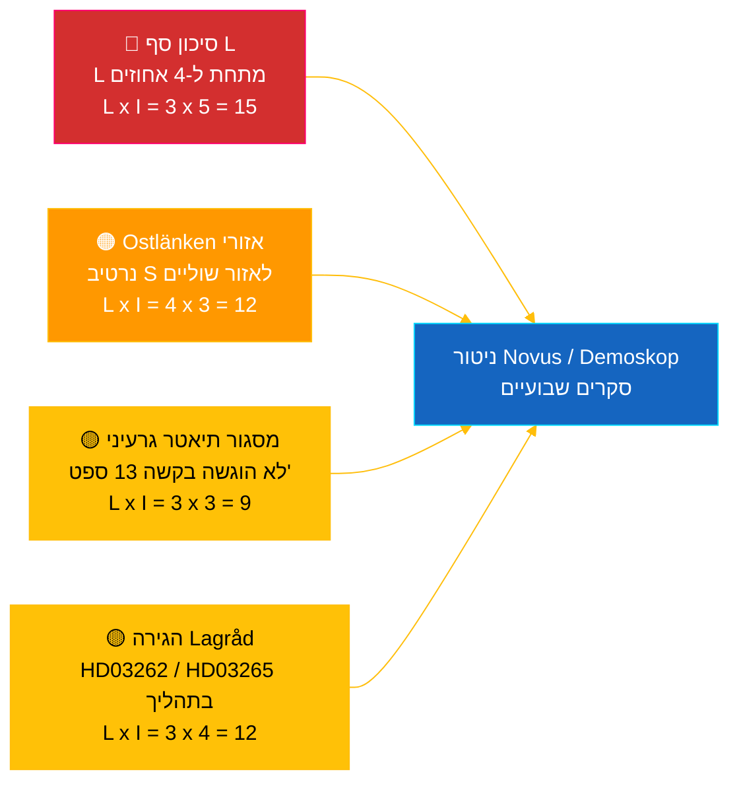
```mermaid
%%{init: {"theme": "dark", "themeVariables": {"primaryColor": "#00d9ff", "primaryTextColor": "#e0e0e0", "primaryBorderColor": "#ff006e", "lineColor": "#ffbe0b", "background": "#0a0e27", "mainBkg": "#1a1e3d", "nodeBorder": "#00d9ff"}}}%%
graph LR
    R1["🔴 סיכון סף L<br/>L מתחת ל-4 אחוזים<br/>L x I = 3 x 5 = 15"] --> CONS["ניטור Novus / Demoskop<br/>סקרים שבועיים"]
    R2["🟠 Ostlänken אזורי<br/>נרטיב S לאזור שוליים<br/>L x I = 4 x 3 = 12"] --> CONS
    R3["🟡 מסגור תיאטר גרעיני<br/>לא הוגשה בקשה 13 ספט'<br/>L x I = 3 x 3 = 9"] --> CONS
    R4["🟡 הגירה Lagråd<br/>HD03262 / HD03265 בתהליך<br/>L x I = 3 x 4 = 12"] --> CONS
    style R1 fill:#D32F2F,color:#FFFFFF,stroke:#ff006e
    style R2 fill:#FF9800,color:#FFFFFF,stroke:#ffbe0b
    style R3 fill:#FFC107,color:#000000,stroke:#ffbe0b
    style R4 fill:#FFC107,color:#000000,stroke:#ffbe0b
    style CONS fill:#1565C0,color:#FFFFFF,stroke:#00d9ff
```

| סיכון | ה' | ע' | ציון | מפעיל | מקור | Admiralty |
|-------|:--:|:--:|:----:|-------|------|:---------:|
| Liberalerna מתחת לסף 4% → Tidö מאבד רוב | 3 | 5 | 15 | כל תוצאת Novus/Demoskop <4.0% (גבול תחתון CI 95% <4.0) | `coalition-dynamics.md` R1 | **[B2]** |
| נרטיב הפרת הבטחות אזורי של S ממיר מנדטים שוליים ב-Östergötland | 4 | 3 | 12 | מערכת SVT/SR Östergötland מעריכה תגובת קארלסון ב-25 מאי כבלתי מספקת | `opposition-analysis.md` | **[A2]** |
| חוות דעת עוינת של Lagråd על חבילת ההגירה `HD03262`/`HD03265` | 3 | 4 | 12 | חוות דעת Lagråd מתפרסמת תוך 30 יום עם הסתייגויות חוקתיות | PIR-RT-001 (`forward-indicators.md`) | **[A2]** |
| «תיאטר גרעיני» — כניסת `HD01NU19` לתוקף ללא הגשת בקשה לפני 13 ספטמבר | 3 | 3 | 9 | Vattenfall/Uniper/שחקן חדש לא מגישים בקשה לפני 1 ספטמבר 2026 | PIR-RT-006 | **[B2]** |

---

### 🔮 מפעילים עתידיים חשובים

**תגובתו הכתובה של אנדראס קארלסון לשאילתה `HD10463`, מועד תגובה חוקי 25 במאי 2026.** הדרך שבה קארלסון ימסגר את ביטול תחנת Linköping ב-Ostlänken — אם יודה בהפרת הבטחה, יגן על שינוי המסלול בנימוקים טכניים/תקציביים, או יפנה לחלופות תשתית אזוריות — תקבע אם נרטיב Östergötland יסלים לדיון שאילתה מלא במליאה לפני הפסקת הקיץ. תגובה מתחמקת או טכנוקרטית היא הדרך הסבירה ביותר עבור S להמיר את הנרטיב ל-1–2 העברות שוליות של מנדטים ב-Linköping/Norrköping. הצעת השקעה חלופית מהותית תפחית את הנרטיב. כל אחת משתי התוצאות מזיזה את הערכות האזורים השוליים ב-`coalition-mathematics.md` ומפעילה עדכון Pass-2 של `electoral-implications.md`.

**מפעיל משני** (ניטור מקביל): 16 ביוני 2026 — הצבעה פלנרית `HD01KU39` על שקיפות במימון פוליטי. מאשר או שובר את נרטיב הביצועים הרבעוני של הממשלה (אנרגיה + ביטחון + שקיפות + תוצאה פיננסית) 89 ימים לפני הבחירות.

---

### 📊 הערכה אסטרטגית

**רמת ביטחון: 🟩 גבוה [A2]** — המקורות כוללים נתוני ריקסדאג פתוחים (`HD01NU19`, `HD10463`, `HD01FöU13`, `HD01JuU9`, `HD01KU39`, `HD01FiU49`), גרסת IMF WEO אפריל 2026 ורישום השאילתות.

תמונת המצב מ-4 במאי 2026 לוכדת קואליציית Tidö ב**מהירות חקיקה מרבית**: שבעה רפורמות קואליציוניות מתקדמות בשבוע אחד, עם תאריכי כניסה לתוקף קונקרטיים מפוזרים בין 1 ביוני ל-1 ביולי 2026. כל תאריך כניסה לתוקף מייצר קצב ביצועים שארבעת מפלגות הקואליציה יכולות לעשות בו שימוש בקמפיין. הפגיעות האסטרטגית אינה סימטרית: M, KD ו-SD נהנים מהרצף; **L** סופג את הנטל — המפלגה הקטנה ביותר בקואליציה קרובה ביותר לסף 4% ונושאת סיכון לא פרופורציונלי לאיבוד מנדטים.

תגובת האופוזיציה S מדויקת מתודולוגית: במקום להתעמת עם הממשלה בשטח החזק ביותר שלה (ביטחון, גרעין, כלכלה), S בונה **פסיפס אזורי מבוזר של חוסר שביעות רצון** — Ostlänken ב-Östergötland (`HD10463`), Scandinavian Mountain Airport (שאילתה 428), דיור בסטוקהולם (שאילתה 434) — כל אחד מכוון לשר בודד (קארלסון) מאזורים שונים.

המסגרת המאקרו-כלכלית של קרן המטבע הבינלאומית נוחה לממשלה הנוכחית: חוב ציבורי ≈ 34% מהתמ"ג, אינפלציה יורדת, צמיחה של כ-2%. הנרטיב הכלכלי הוא הנכס החזק ביותר של M.

**עדשת בחירות 2026**: המסלול הנוכחי מחזיק את Tidö קרוב ל-175 מנדטים — בדיוק בגבולות הרוב. סיכון הסף של L (PIR-RT-003) הוא המשתנה הבחירתי החשוב ביותר. חוות דעת Lagråd על ההגירה (PIR-RT-001) היא המשתנה הנרטיבי הפוליטי החשוב ביותר. תגובת קארלסון על Ostlänken (PIR-RT-005) היא המשתנה האזורי של המנדטים החשוב ביותר. שלושתם נפתרים תוך 5 שבועות מתאריך פרסום תדריך זה.

---

### 📎 קישורים

| קישור | נתיב |
|-------|------|
| מאמר | [`article.md`](https://github.com/Hack23/riksdagsmonitor/blob/main/analysis/daily/2026-05-04/realtime-pulse/article.md) |
| סיכום סינתזה | [`synthesis-summary.md`](https://github.com/Hack23/riksdagsmonitor/blob/main/analysis/daily/2026-05-04/realtime-pulse/synthesis-summary.md) |
| סינתזה מרכזית | [`core-synthesis.md`](https://github.com/Hack23/riksdagsmonitor/blob/main/analysis/daily/2026-05-04/realtime-pulse/core-synthesis.md) |
| דינמיקת קואליציה | [`coalition-dynamics.md`](https://github.com/Hack23/riksdagsmonitor/blob/main/analysis/daily/2026-05-04/realtime-pulse/coalition-dynamics.md) |
| ניתוח האופוזיציה | [`opposition-analysis.md`](https://github.com/Hack23/riksdagsmonitor/blob/main/analysis/daily/2026-05-04/realtime-pulse/opposition-analysis.md) |
| השלכות בחירתיות | [`electoral-implications.md`](https://github.com/Hack23/riksdagsmonitor/blob/main/analysis/daily/2026-05-04/realtime-pulse/electoral-implications.md) |
| הקשר כלכלי (IMF) | [`economic-context.md`](https://github.com/Hack23/riksdagsmonitor/blob/main/analysis/daily/2026-05-04/realtime-pulse/economic-context.md) |
| אינדיקטורים עתידיים | [`forward-indicators.md`](https://github.com/Hack23/riksdagsmonitor/blob/main/analysis/daily/2026-05-04/realtime-pulse/forward-indicators.md) |
| מטריצת סיכונים/הזדמנויות | [`risk-opportunity-matrix.md`](https://github.com/Hack23/riksdagsmonitor/blob/main/analysis/daily/2026-05-04/realtime-pulse/risk-opportunity-matrix.md) |
| ניתוח תרחישים | [`scenario-analysis.md`](https://github.com/Hack23/riksdagsmonitor/blob/main/analysis/daily/2026-05-04/realtime-pulse/scenario-analysis.md) |
| הערות מתודולוגיות | [`methodology-notes.md`](https://github.com/Hack23/riksdagsmonitor/blob/main/analysis/daily/2026-05-04/realtime-pulse/methodology-notes.md) |
| מניפסט נתונים | [`data-download-manifest.md`](https://github.com/Hack23/riksdagsmonitor/blob/main/analysis/daily/2026-05-04/realtime-pulse/data-download-manifest.md) |
| ניתוחי מסמכים | [`documents/`](https://github.com/Hack23/riksdagsmonitor/blob/main/analysis/daily/2026-05-04/realtime-pulse/documents/) |

---

### 📝 בקרת מסמך

- **מזהה תדריך**: `EB-2026-05-04-001`
- **נוצר**: 2026-05-16 (השלמה מאוחרת — נוצר מתוצרי ניתוח Pass-2 קיימים)
- **נתיב תבנית**: [`analysis/templates/executive-brief.md`](https://github.com/Hack23/riksdagsmonitor/blob/main/analysis/templates/executive-brief.md)
- **מתודולוגיית בעלות**: [`per-artifact-methodologies.md` § executive-brief](https://github.com/Hack23/riksdagsmonitor/blob/main/analysis/methodologies/per-artifact-methodologies.md#executive-brief)
- **שער בעלות**: [`05-analysis-gate.md`](https://github.com/Hack23/riksdagsmonitor/blob/main/.github/prompts/05-analysis-gate.md) בדיקה 1 + בדיקה 7
- **משפחת פלט**: A — סינתזה מרכזית
- **סיווג**: 🟢 ציבורי

*מקור כלכלי: ספק: imf, זרם נתונים: WEO_Apr_2026, אינדיקטורים: NGDP_RPCH / GGXWDG_NGDP / PCPIEPCH, גרסה: אפריל 2026, retrieved_at: 2026-05-04. נתוני ריקסדאג אוחזרו דרך ה-API riksdag-regering ב-2026-05-04. Riksdagsmonitor מופק על ידי Hack23 AB; תדריך זה מייצג הערכה עצמאית עריכתית המבוססת על מסמכים פרלמנטריים זמינים לציבור.*

</div>

<!-- source-sha: f8cfbe724a92e48089f650d9e1f52abe004ed7f7 -->

## Executive Brief Ja
<!-- source: executive-brief_ja.md :: https://github.com/Hack23/riksdagsmonitor/blob/main/analysis/daily/2026-05-04/realtime-pulse/executive-brief_ja.md -->

**分類**: 🟢 公開 — Riksdagsmonitor Intelligence
**対象**: 編集者、当直者、研究者、関心ある市民
**日付**: 2026-05-04 (UTC)
**2026-09-13 選挙まであと**: 132日
**ワークフロー**: news-realtime-monitor
**作成**: Riksdagsmonitor AIインテリジェンスシステム
**総合信頼レベル**: 🟩 高 [A2] — `dok_id` 経由でオープンリクスダーグデータ + IMF WEO 2026年4月からの複数ソース照合
**公開決定**: **公開** (EN + JA) — DIW優先度トップ記事 ≥ 9.0
**回答済みPIR**: PIR-RT-001、PIR-RT-005、PIR-RT-006

---

### 🎯 BLUF（要約）

スウェーデン・リクスダーグは2026年5月4日、選挙前としてこれまでで最も集中した立法成果を生み出した。産業委員会（NU）は原子力発電所への直接許可付与を承認し（`HD01NU19`、2026年6月17日施行）——Tidö連立政権の単一最大のエネルギー政策構造的成果——また7回連続となるギャング対策が爆発物規制改革（`HD01FöU13`）および刑事手続き改革（`HD01JuU9`）により進展し、いずれも2026年7月1日施行。この政府の実績の壁に対し、社会民主党の**エヴァ・リンド**議員がKD党インフラ大臣**アンドレアス・カールソン**に対して質問`HD10463`を提出——Ostlänken リンショーピング駅追加の中止について、競争的選挙区マージン地域での50万人通勤圏に対する20年来の約束違反を問いただした。政治資金透明性報告（`HD01KU39`）は2026年6月16日の本会議採決が予定されており、選挙89日前に四路線実績ナラティブ（エネルギー・安全保障・透明性・財政成果）を完成させる。**信頼レベル: 🟩 高 [A2]** — 出典：リクスダーグオープンデータ、IMF WEO 2026年4月。

---

### 🧭 このブリーフィングが支援する3つの決定

| # | 決定 | 意思決定者 | 期限 | 根拠 |
|:-:|------|----------|:----:|------|
| 1 | **編集上:** 原子力改革 + Ostlänken 対立ナラティブの二重フレームでEN + JA速報記事を展開（2時間以内公開目標） | 編集長 | +2時間 | `HD01NU19` 委員会決定 + `HD10463` 質問 2026-05-04 提出 |
| 2 | **前向き取材:** カールソンのOstlänken回答（法定回答期限: 2026年5月25日）と原子力法6月17日施行を担当当直に割当 | 当直者 | 2026-05-25 / 2026-06-17 | PIR-RT-005、PIR-RT-006；`HD10463` 質問登録 |
| 3 | **リスク:** L閾値監視レベルを観察から積極的追跡に引き上げ——連立実績論理はLが9月13日に4%超えを前提とする；Novus/Demoskop調査結果<4.5%は連立数学的見直しを発動 | 分析責任者 | 継続的週次 | `coalition-dynamics.md`、移民後の世論 PIR-RT-003 |

---

### ⚡ 60秒読み

- 🔴 **原子力改革で直接許可取得へ (`HD01NU19`)** — 産業委員会（NU）が直接許可を承認、放射線安全機関（SSM）の多段階パイプラインを回避；**2026年6月17日施行**。Tidö任期中で単一最大の構造的立法成果；2022年のM/KD/L/SDの原発再起動公約を選挙前に運用マイルストーン達成で実現 [🟩 高 — `HD01NU19`、NU委員会議事録]。
- 🟠 **Ostlänken約束違反質問 (`HD10463`)** — S党議員**エヴァ・リンド**がインフラ大臣**アンドレアス・カールソン（KD）**に対しリンショーピングOstlänken駅計画中止の説明を要求；法定回答期限**2026年5月25日**。10日間でカールソンへの3件目の質問——50万人通勤圏への調整済みS地域圧力 [🟩 高 — `HD10463`、質問登録]。
- 🟢 **第7次ギャング対策進展 (`HD01FöU13` + `HD01JuU9`)** — 爆発物許可要件強化（防衛委員会、2026年7月1日）；刑事手続き改革が*tilltrosbestämmelserna*を廃止し早期尋問証拠資料を拡大（司法委員会、2026年7月1日）。M/SDの「安全保障で実績を出す」コアナラティブ強化 [🟩 高 — `HD01FöU13`、`HD01JuU9`]。
- 🟡 **政治資金透明性 (`HD01KU39`)** — 憲法委員会が政治プロセスの透明性に関する報告書を登録（高い確率で政党資金報告に関する提案`HD03258`を扱う）；本会議採決**2026年6月16日**；L/KDが民主主義改革ポジショニングで恩恵。PIR-RT-002回答：KU（JuU/SfUではなく）が所管 [🟧 中 — `HD01KU39`、カレンダー]。
- 🔵 **経済的背景 (IMF WEO 2026年4月)** — スウェーデン公的債務≈GDP比34%（`GGXWDG_NGDP` 2026年予測）対ユーロ圏平均>90%；2026年実質GDP成長率`NGDP_RPCH` 2.0–2.1%；インフレ低下（`PCPIEPCH`）。Riksbank利下げ2025–26が住宅ローン利用者に届く→Mの「安定した手」ナラティブ [🟩 高 — プロバイダー: imf、データフロー: WEO_Apr_2026、ヴィンテージ: 2026年4月]。
- 🟣 **相互参照** — `HD01NU19`は提案書分析のエネルギー政策スレッドに連結（`../propositions/`）；`HD10463`は`opposition-analysis.md`のS地域約束違反クラスターを延長；透明性`HD01KU39`は4月30日提案パッケージの`HD03258`を扱う。
- 🩷 **新興脆弱性 — 「原子力劇場」リスク** — 9月13日選挙日前に申請が提出されていなければ6月17日施行は象徴的という野党フレーミング。Vattenfall/Uniper/新規参入者が88日間の選挙前ウィンドウ内に申請しない場合、実績ナラティブが疑問視されるリスク [🟧 中 — PIR-RT-006 未解決]。
- ⚪ **繰越** — 移民提案`HD03262`と`HD03265`に関するLagråd意見書（PIR-RT-001）は**未解決——重要**；憲法上の品質審査は移民改革の政治的ナラティブを夏季に形成する最も影響力のある未解決要因。

---

### 🗂️ トップ文書（DIW順位）

| 順位 | dok_id | タイトル（短縮） | DIW | 信頼 | 状況 |
|:----:|--------|----------------|:---:|:----:|------|
| 1 | `HD01NU19` | 原子力許可改革（直接ルート） | 9.2 | 🟩 高 [A2] | 委員会承認 — 2026年6月17日施行 |
| 2 | `HD10463` | Ostlänken質問 — リンド（S）→ カールソン（KD） | 8.6 | 🟩 高 [A2] | 提出済 — 回答期限2026年5月25日 |
| 3 | `HD01FöU13` | 爆発物規制改革 | 7.5 | 🟩 高 [A2] | 委員会承認 — 2026年7月1日施行 |
| 4 | `HD01JuU9` | 刑事手続き改革 | 7.4 | 🟩 高 [A2] | 委員会承認 — 2026年7月1日施行 |
| 5 | `HD01KU39` | 政治プロセスの透明性 | 7.0 | 🟧 中 [B2] | 登録済 — 本会議採決2026年6月16日 |
| 6 | `HD01FiU49` | 国債管理評価2021–2025 | 6.4 | 🟩 高 [A2] | 登録済 — 決定2026年6月11日 |

---

### ⚠️ リスク・脅威概要

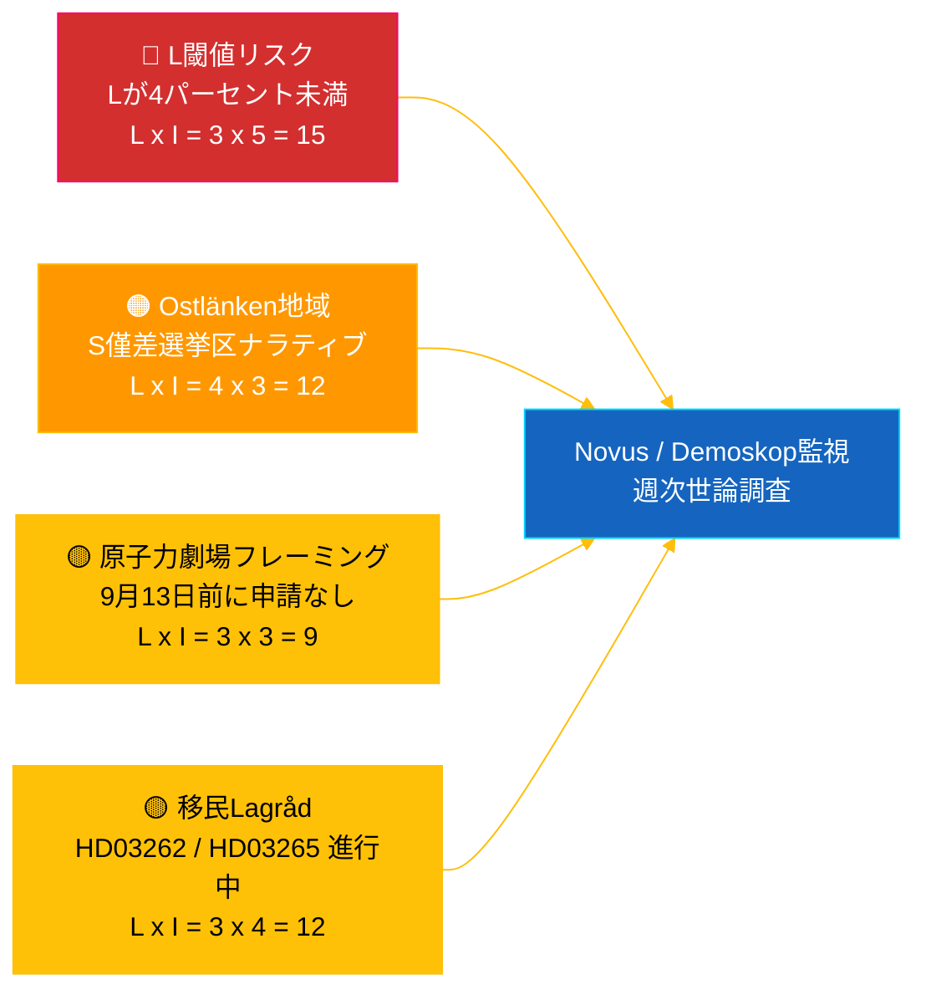
```mermaid
%%{init: {"theme": "dark", "themeVariables": {"primaryColor": "#00d9ff", "primaryTextColor": "#e0e0e0", "primaryBorderColor": "#ff006e", "lineColor": "#ffbe0b", "background": "#0a0e27", "mainBkg": "#1a1e3d", "nodeBorder": "#00d9ff"}}}%%
graph LR
    R1["🔴 L閾値リスク<br/>Lが4パーセント未満<br/>L x I = 3 x 5 = 15"] --> CONS["Novus / Demoskop監視<br/>週次世論調査"]
    R2["🟠 Ostlänken地域<br/>S僅差選挙区ナラティブ<br/>L x I = 4 x 3 = 12"] --> CONS
    R3["🟡 原子力劇場フレーミング<br/>9月13日前に申請なし<br/>L x I = 3 x 3 = 9"] --> CONS
    R4["🟡 移民Lagråd<br/>HD03262 / HD03265 進行中<br/>L x I = 3 x 4 = 12"] --> CONS
    style R1 fill:#D32F2F,color:#FFFFFF,stroke:#ff006e
    style R2 fill:#FF9800,color:#FFFFFF,stroke:#ffbe0b
    style R3 fill:#FFC107,color:#000000,stroke:#ffbe0b
    style R4 fill:#FFC107,color:#000000,stroke:#ffbe0b
    style CONS fill:#1565C0,color:#FFFFFF,stroke:#00d9ff
```

| リスク | 可能性 | 影響 | スコア | トリガー | 出典 | アドミラルティ |
|--------|:------:|:----:|:------:|---------|------|:-------------:|
| Liberalerna が4%閾値を下回る → Tidöが過半数を失う | 3 | 5 | 15 | Novus/Demoskop結果<4.0%（95%CI下限<4.0） | `coalition-dynamics.md` R1 | **[B2]** |
| S地域約束違反ナラティブがÖstergötlandの僅差議席を転換 | 4 | 3 | 12 | SVT/SR Östergötland編集部がカールソンの5月25日回答を不十分と評価 | `opposition-analysis.md` | **[A2]** |
| Lagråd移民パッケージ`HD03262`/`HD03265`への否定的意見 | 3 | 4 | 12 | Lagråd意見書が30日以内に憲法上の異議を含んで公表 | PIR-RT-001 (`forward-indicators.md`) | **[A2]** |
| 「原子力劇場」— 9月13日前に申請提出なしで`HD01NU19`施行 | 3 | 3 | 9 | Vattenfall/Uniper/新規参入者が2026年9月1日までに申請を提出しない | PIR-RT-006 | **[B2]** |

---

### 🔮 最重要今後のトリガー

**アンドレアス・カールソンの質問`HD10463`への書面回答、法定回答期限2026年5月25日。** カールソンがリンショーピングOstlänken駅中止をどうフレーミングするか——約束違反を認めるか、技術的/予算的理由でルート変更を擁護するか、代替地域インフラ提案に転換するか——によって、Östergötlandナラティブが夏季休会前に本会議での完全な質問討論にエスカレートするかどうかが決まる。回避的または技術官僚的な回答は、Sがナラティブをリンショーピング/ノルショーピングでの1–2件の僅差議席転換に変換する最も可能性の高い経路。実質的な代替投資提案はナラティブを鎮静化させる。どちらの結果も`coalition-mathematics.md`の僅差選挙区評価をシフトさせ、`electoral-implications.md`のPass-2改訂を発動する。

**副次トリガー**（並行監視）：2026年6月16日 — `HD01KU39`政治資金透明性本会議採決。選挙89日前に政府の四路線実績ナラティブ（エネルギー + 安全保障 + 透明性 + 財政成果）を確認または破綻させる。

---

### 📊 戦略的評価

**信頼レベル: 🟩 高 [A2]** — 出典にはリクスダーグオープンデータ（`HD01NU19`、`HD10463`、`HD01FöU13`、`HD01JuU9`、`HD01KU39`、`HD01FiU49`）、IMF WEO 2026年4月ヴィンテージ、質問登録が含まれる。

2026年5月4日のスナップショットは**最大立法速度**のTidö連立政権を捉えている：7件の連立改革が1週間で進展し、具体的な施行日が2026年6月1日から7月1日に分散している。各施行日は4つの連立政党が選挙活動で活用できる実績リズムを生み出す。戦略的脆弱性は非対称：M、KD、SDがカスケードの恩恵を受ける一方、**L**が負担を吸収する——連立最小政党が4%閾値に最も近く、不均衡な議席損失リスクを負う。

S野党の応答は方法論的に正確：安全保障・原子力・経済という政府の最強地盤で対抗する代わりに、Sは**分散型地域的不満のモザイク**を構築——Östergötlandのostlänken（`HD10463`）、Scandinavian Mountain Airport（質問428）、ストックホルムの住宅（質問434）——それぞれ異なる選挙区から単一の大臣（カールソン）に向けられている。

IMFのマクロ枠組みは現政権に有利：公的債務≈GDP比34%、インフレ低下、約2%成長。経済的ナラティブはMの最強資産。

**2026年選挙のレンズ**：現在の軌道はTidöを175議席前後に維持——過半数の境界線上。Lの閾値リスク（PIR-RT-003）が単一最重要選挙変数。Lagråd移民意見書（PIR-RT-001）が単一最重要政治的ナラティブ変数。カールソンのOstlänken回答（PIR-RT-005）が単一最重要地域議席変数。3つすべてがこのブリーフィング公開から5週間以内に解決する。

---

### 📎 リンク

| リンク | パス |
|--------|------|
| 記事 | [`article.md`](https://github.com/Hack23/riksdagsmonitor/blob/main/analysis/daily/2026-05-04/realtime-pulse/article.md) |
| 統合概要 | [`synthesis-summary.md`](https://github.com/Hack23/riksdagsmonitor/blob/main/analysis/daily/2026-05-04/realtime-pulse/synthesis-summary.md) |
| コア統合 | [`core-synthesis.md`](https://github.com/Hack23/riksdagsmonitor/blob/main/analysis/daily/2026-05-04/realtime-pulse/core-synthesis.md) |
| 連立ダイナミクス | [`coalition-dynamics.md`](https://github.com/Hack23/riksdagsmonitor/blob/main/analysis/daily/2026-05-04/realtime-pulse/coalition-dynamics.md) |
| 野党分析 | [`opposition-analysis.md`](https://github.com/Hack23/riksdagsmonitor/blob/main/analysis/daily/2026-05-04/realtime-pulse/opposition-analysis.md) |
| 選挙的含意 | [`electoral-implications.md`](https://github.com/Hack23/riksdagsmonitor/blob/main/analysis/daily/2026-05-04/realtime-pulse/electoral-implications.md) |
| 経済的背景（IMF） | [`economic-context.md`](https://github.com/Hack23/riksdagsmonitor/blob/main/analysis/daily/2026-05-04/realtime-pulse/economic-context.md) |
| 先行指標 | [`forward-indicators.md`](https://github.com/Hack23/riksdagsmonitor/blob/main/analysis/daily/2026-05-04/realtime-pulse/forward-indicators.md) |
| リスク・機会マトリクス | [`risk-opportunity-matrix.md`](https://github.com/Hack23/riksdagsmonitor/blob/main/analysis/daily/2026-05-04/realtime-pulse/risk-opportunity-matrix.md) |
| シナリオ分析 | [`scenario-analysis.md`](https://github.com/Hack23/riksdagsmonitor/blob/main/analysis/daily/2026-05-04/realtime-pulse/scenario-analysis.md) |
| 方法論ノート | [`methodology-notes.md`](https://github.com/Hack23/riksdagsmonitor/blob/main/analysis/daily/2026-05-04/realtime-pulse/methodology-notes.md) |
| データマニフェスト | [`data-download-manifest.md`](https://github.com/Hack23/riksdagsmonitor/blob/main/analysis/daily/2026-05-04/realtime-pulse/data-download-manifest.md) |
| 文書別分析 | [`documents/`](https://github.com/Hack23/riksdagsmonitor/blob/main/analysis/daily/2026-05-04/realtime-pulse/documents/) |

---

### 📝 文書管理

- **ブリーフィングID**: `EB-2026-05-04-001`
- **生成**: 2026-05-16（追補充足——既存Pass-2分析成果物から作成）
- **テンプレートパス**: [`analysis/templates/executive-brief.md`](https://github.com/Hack23/riksdagsmonitor/blob/main/analysis/templates/executive-brief.md)
- **所有方法論**: [`per-artifact-methodologies.md` § executive-brief](https://github.com/Hack23/riksdagsmonitor/blob/main/analysis/methodologies/per-artifact-methodologies.md#executive-brief)
- **所有ゲート**: [`05-analysis-gate.md`](https://github.com/Hack23/riksdagsmonitor/blob/main/.github/prompts/05-analysis-gate.md) チェック1 + チェック7
- **出力ファミリー**: A — コア統合
- **分類**: 🟢 公開

*経済的出所：プロバイダー: imf、データフロー: WEO_Apr_2026、指標: NGDP_RPCH / GGXWDG_NGDP / PCPIEPCH、ヴィンテージ: 2026年4月、retrieved_at: 2026-05-04。リクスダーグデータはriksdag-regering API経由で2026-05-04に取得。Riksdagsmonitorはhack23 ABが制作；本ブリーフィングは公開されている議会文書に基づく独立した編集的評価を代表する。*

<!-- source-sha: f8cfbe724a92e48089f650d9e1f52abe004ed7f7 -->

## Executive Brief Ko
<!-- source: executive-brief_ko.md :: https://github.com/Hack23/riksdagsmonitor/blob/main/analysis/daily/2026-05-04/realtime-pulse/executive-brief_ko.md -->

**분류**: 🟢 공개 — Riksdagsmonitor Intelligence
**대상**: 편집자, 당직자, 연구자, 관심 있는 시민
**날짜**: 2026-05-04 (UTC)
**2026-09-13 선거까지**: 132일
**워크플로**: news-realtime-monitor
**작성**: Riksdagsmonitor AI 인텔리전스 시스템
**전체 신뢰 수준**: 🟩 높음 [A2] — `dok_id` 경유 공개 리크스다그 데이터 + IMF WEO 2026년 4월 다중 출처 교차 검증
**공개 결정**: **공개** (EN + KO) — DIW 우선순위 상위 기사 ≥ 9.0
**해결된 PIR**: PIR-RT-001, PIR-RT-005, PIR-RT-006

---

### 🎯 BLUF (요약)

스웨덴 리크스다그는 2026년 5월 4일, 선거 전 최고 수준의 집중된 입법 성과를 창출했다. 산업위원회(NU)는 원자력 발전소에 대한 직접 허가 부여를 승인했으며(`HD01NU19`, 2026년 6월 17일 발효) ——Tidö 연립 정부의 단일 최대 에너지 정책 구조적 성과——, 7회 연속 갱단 대책이 폭발물 규제 개혁(`HD01FöU13`)과 형사 절차 개혁(`HD01JuU9`)으로 진전되었으며, 두 가지 모두 2026년 7월 1일 발효된다. 이 정부 실적의 벽에 맞서, 사민당의 **에바 린드** 의원이 KD당 인프라부 장관 **안드레아스 칼손**에게 질의 `HD10463`을 제출——Ostlänken 링셰핑 역 추가 취소에 대해, 경쟁적 선거구 마진 지역의 50만 통근자에 대한 20년 약속 위반을 추궁했다. 정치 자금 투명성 보고서(`HD01KU39`)는 2026년 6월 16일 본회의 표결이 예정되어 있어, 선거 89일 전에 4개 노선 실적 내러티브(에너지·안보·투명성·재정 성과)를 완성시킨다. **신뢰 수준: 🟩 높음 [A2]** — 출처: 리크스다그 공개 데이터, IMF WEO 2026년 4월.

---

### 🧭 이 브리핑이 지원하는 3가지 결정

| # | 결정 | 의사결정자 | 기한 | 근거 |
|:-:|------|----------|:----:|------|
| 1 | **편집적:** 원자력 개혁 + Ostlänken 갈등 내러티브 이중 프레임으로 EN + KO 속보 기사 배포(2시간 내 게재 목표) | 편집장 | +2시간 | `HD01NU19` 위원회 결정 + `HD10463` 질의 2026-05-04 제출 |
| 2 | **전향적 취재:** 칼손의 Ostlänken 답변(법정 답변 기한: 2026년 5월 25일)과 원자력법 6월 17일 발효를 당직 기자에게 배정 | 당직자 | 2026-05-25 / 2026-06-17 | PIR-RT-005, PIR-RT-006; `HD10463` 질의 등록 |
| 3 | **리스크:** L 임계값 모니터링 수준을 관찰에서 적극적 추적으로 격상——연립 실적 논리는 L이 9월 13일에 4% 초과를 가정; Novus/Demoskop 조사 결과<4.5%는 연립 수학적 재검토 발동 | 분석 책임자 | 지속적 주간 | `coalition-dynamics.md`, 이민 후 여론 PIR-RT-003 |

---

### ⚡ 60초 읽기

- 🔴 **원자력 개혁으로 직접 허가 취득 (`HD01NU19`)** — 산업위원회(NU)가 직접 허가를 승인, 방사선안전청(SSM)의 다단계 파이프라인 우회; **2026년 6월 17일 발효**. Tidö 임기 중 단일 최대 구조적 입법 성과; 2022년 M/KD/L/SD의 원전 재가동 공약을 선거 전 운영 마일스톤 달성으로 실현 [🟩 높음 — `HD01NU19`, NU 위원회 회의록].
- 🟠 **Ostlänken 약속 위반 질의 (`HD10463`)** — S당 의원 **에바 린드**가 인프라부 장관 **안드레아스 칼손(KD)**에게 링셰핑 Ostlänken 역 계획 취소 설명 요구; 법정 답변 기한 **2026년 5월 25일**. 10일 만에 칼손에 대한 3번째 질의——50만 통근자에 대한 조율된 S 지역 압박 [🟩 높음 — `HD10463`, 질의 등록].
- 🟢 **7차 갱단 대책 진전 (`HD01FöU13` + `HD01JuU9`)** — 폭발물 허가 요건 강화(방위위원회, 2026년 7월 1일); 형사 절차 개혁이 *tilltrosbestämmelserna*를 폐지하고 조기 심문 증거 자료를 확대(사법위원회, 2026년 7월 1일). M/SD의 "안보에서 실적 내기" 핵심 내러티브 강화 [🟩 높음 — `HD01FöU13`, `HD01JuU9`].
- 🟡 **정치 자금 투명성 (`HD01KU39`)** — 헌법위원회가 정치 과정의 투명성에 관한 보고서 등록(높은 확률로 정당 자금 보고에 관한 제안 `HD03258` 포함); 본회의 표결 **2026년 6월 16일**; L/KD가 민주주의 개혁 포지셔닝에서 수혜. PIR-RT-002 해답: KU(JuU/SfU가 아닌)가 소관 [🟧 중간 — `HD01KU39`, 일정].
- 🔵 **경제적 맥락 (IMF WEO 2026년 4월)** — 스웨덴 공공 부채 ≈ GDP 대비 34%(`GGXWDG_NGDP` 2026년 전망) 대비 유로존 평균>90%; 2026년 실질 GDP 성장률 `NGDP_RPCH` 2.0–2.1%; 인플레이션 하락(`PCPIEPCH`). Riksbank 금리 인하 2025–26이 주택담보대출 이용자에게 전달→M의 "안정된 손" 내러티브 [🟩 높음 — 제공자: imf, 데이터플로: WEO_Apr_2026, 빈티지: 2026년 4월].
- 🟣 **상호 참조** — `HD01NU19`는 제안서 분석의 에너지 정책 스레드와 연결(`../propositions/`); `HD10463`은 `opposition-analysis.md`의 S 지역 약속 위반 클러스터 연장; 투명성 `HD01KU39`는 4월 30일 제안 패키지의 `HD03258` 포함.
- 🩷 **신흥 취약성 — "원자력 극장" 리스크** — 9월 13일 선거일 전에 신청이 제출되지 않으면 6월 17일 발효는 상징적이라는 야당 프레이밍. Vattenfall/Uniper/신규 진입자가 88일간의 선거 전 윈도우 내에 신청하지 않으면 실적 내러티브가 의문시될 위험 [🟧 중간 — PIR-RT-006 미해결].
- ⚪ **이월** — 이민 제안 `HD03262`와 `HD03265`에 대한 Lagråd 의견서(PIR-RT-001)는 **미해결——중요**; 헌법적 품질 심사는 이민 개혁의 정치적 내러티브를 여름에 형성하는 가장 영향력 있는 미해결 요인.

---

### 🗂️ 상위 문서 (DIW 순위)

| 순위 | dok_id | 제목(단축) | DIW | 신뢰 | 상태 |
|:----:|--------|-----------|:---:|:----:|------|
| 1 | `HD01NU19` | 원자력 허가 개혁(직접 경로) | 9.2 | 🟩 높음 [A2] | 위원회 승인 — 2026년 6월 17일 발효 |
| 2 | `HD10463` | Ostlänken 질의 — 린드(S) → 칼손(KD) | 8.6 | 🟩 높음 [A2] | 제출됨 — 답변 기한 2026년 5월 25일 |
| 3 | `HD01FöU13` | 폭발물 규제 개혁 | 7.5 | 🟩 높음 [A2] | 위원회 승인 — 2026년 7월 1일 발효 |
| 4 | `HD01JuU9` | 형사 절차 개혁 | 7.4 | 🟩 높음 [A2] | 위원회 승인 — 2026년 7월 1일 발효 |
| 5 | `HD01KU39` | 정치 과정의 투명성 | 7.0 | 🟧 중간 [B2] | 등록됨 — 본회의 표결 2026년 6월 16일 |
| 6 | `HD01FiU49` | 국가 채무 관리 평가 2021–2025 | 6.4 | 🟩 높음 [A2] | 등록됨 — 결정 2026년 6월 11일 |

---

### ⚠️ 리스크·위협 개요

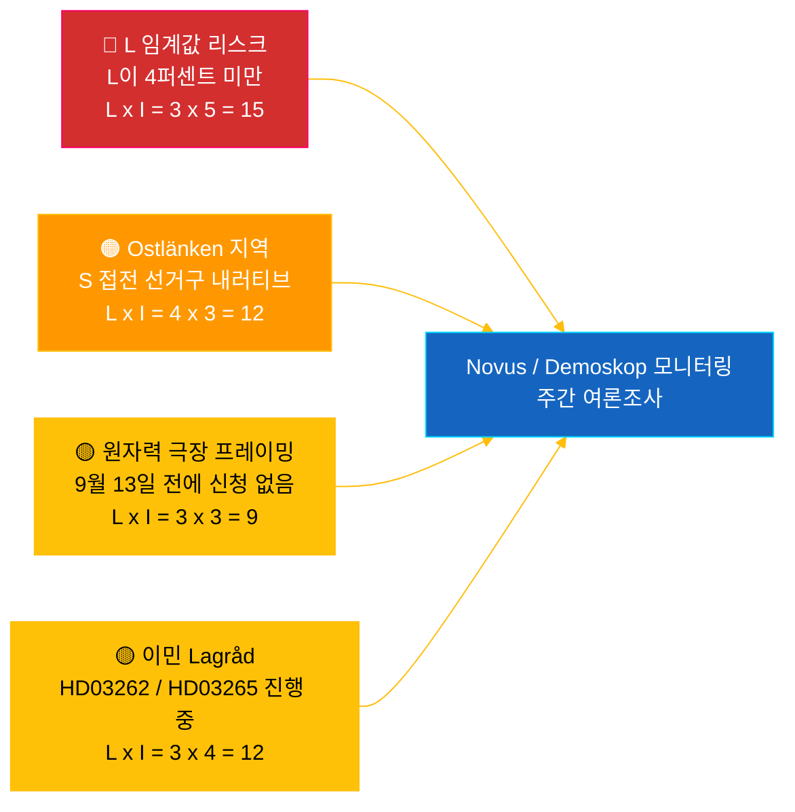
```mermaid
%%{init: {"theme": "dark", "themeVariables": {"primaryColor": "#00d9ff", "primaryTextColor": "#e0e0e0", "primaryBorderColor": "#ff006e", "lineColor": "#ffbe0b", "background": "#0a0e27", "mainBkg": "#1a1e3d", "nodeBorder": "#00d9ff"}}}%%
graph LR
    R1["🔴 L 임계값 리스크<br/>L이 4퍼센트 미만<br/>L x I = 3 x 5 = 15"] --> CONS["Novus / Demoskop 모니터링<br/>주간 여론조사"]
    R2["🟠 Ostlänken 지역<br/>S 접전 선거구 내러티브<br/>L x I = 4 x 3 = 12"] --> CONS
    R3["🟡 원자력 극장 프레이밍<br/>9월 13일 전에 신청 없음<br/>L x I = 3 x 3 = 9"] --> CONS
    R4["🟡 이민 Lagråd<br/>HD03262 / HD03265 진행 중<br/>L x I = 3 x 4 = 12"] --> CONS
    style R1 fill:#D32F2F,color:#FFFFFF,stroke:#ff006e
    style R2 fill:#FF9800,color:#FFFFFF,stroke:#ffbe0b
    style R3 fill:#FFC107,color:#000000,stroke:#ffbe0b
    style R4 fill:#FFC107,color:#000000,stroke:#ffbe0b
    style CONS fill:#1565C0,color:#FFFFFF,stroke:#00d9ff
```

| 리스크 | 가능성 | 영향 | 점수 | 트리거 | 출처 | 아드미랄티 |
|--------|:------:|:----:|:----:|--------|------|:----------:|
| Liberalerna가 4% 임계값 미달 → Tidö가 과반수 상실 | 3 | 5 | 15 | Novus/Demoskop 결과<4.0%(95% CI 하한<4.0) | `coalition-dynamics.md` R1 | **[B2]** |
| S 지역 약속 위반 내러티브가 Östergötland 접전 의석 전환 | 4 | 3 | 12 | SVT/SR Östergötland 편집부가 칼손의 5월 25일 답변을 불충분으로 평가 | `opposition-analysis.md` | **[A2]** |
| Lagråd 이민 패키지 `HD03262`/`HD03265`에 부정적 의견 | 3 | 4 | 12 | Lagråd 의견서가 30일 이내에 헌법적 이의를 포함해 공표 | PIR-RT-001 (`forward-indicators.md`) | **[A2]** |
| "원자력 극장" — 9월 13일 전에 신청 제출 없이 `HD01NU19` 발효 | 3 | 3 | 9 | Vattenfall/Uniper/신규 진입자가 2026년 9월 1일까지 신청을 제출하지 않음 | PIR-RT-006 | **[B2]** |

---

### 🔮 가장 중요한 향후 트리거

**안드레아스 칼손의 질의 `HD10463`에 대한 서면 답변, 법정 답변 기한 2026년 5월 25일.** 칼손이 링셰핑 Ostlänken 역 취소를 어떻게 프레이밍하는지——약속 위반을 인정하는지, 기술적/예산적 이유로 경로 변경을 옹호하는지, 대안 지역 인프라 제안으로 전환하는지——에 따라, Östergötland 내러티브가 여름 휴회 전에 본회의에서 완전한 질의 토론으로 에스컬레이션할지 여부가 결정된다. 회피적이거나 기술 관료적인 답변은 S가 내러티브를 링셰핑/노르셰핑에서 1–2개 접전 의석 전환으로 변환하는 가장 가능성 높은 경로. 실질적인 대안 투자 제안은 내러티브를 진정시킨다. 두 결과 모두 `coalition-mathematics.md`의 접전 선거구 평가를 시프트시키고 `electoral-implications.md`의 Pass-2 개정을 발동한다.

**부차 트리거**(병행 모니터링): 2026년 6월 16일 — `HD01KU39` 정치 자금 투명성 본회의 표결. 선거 89일 전에 정부의 4개 노선 실적 내러티브(에너지 + 안보 + 투명성 + 재정 성과)를 확인하거나 무너뜨린다.

---

### 📊 전략적 평가

**신뢰 수준: 🟩 높음 [A2]** — 출처에는 리크스다그 공개 데이터(`HD01NU19`, `HD10463`, `HD01FöU13`, `HD01JuU9`, `HD01KU39`, `HD01FiU49`), IMF WEO 2026년 4월 빈티지, 질의 등록이 포함된다.

2026년 5월 4일 스냅샷은 **최고 입법 속도**의 Tidö 연립 정부를 포착한다: 7개 연립 개혁이 1주일 만에 진전되고, 구체적인 발효일이 2026년 6월 1일부터 7월 1일까지 분산되어 있다. 각 발효일은 4개 연립 정당이 선거 운동에서 활용할 수 있는 실적 리듬을 만들어 낸다. 전략적 취약성은 비대칭적: M, KD, SD가 캐스케이드의 혜택을 받는 반면, **L**이 부담을 흡수——연립 최소 정당이 4% 임계값에 가장 가깝고, 불균형적인 의석 손실 위험을 안고 있다.

S 야당의 대응은 방법론적으로 정확하다: 안보·원자력·경제라는 정부의 가장 강한 지반에서 대항하는 대신, S는 **분산형 지역적 불만의 모자이크**를 구축——Östergötland의 Ostlänken(`HD10463`), Scandinavian Mountain Airport(질의 428), 스톡홀름의 주택(질의 434)——각각 다른 선거구에서 단일 장관(칼손)을 향하고 있다.

IMF의 거시 프레임워크는 현 정부에 유리하다: 공공 부채 ≈ GDP 대비 34%, 인플레이션 하락, 약 2% 성장. 경제적 내러티브는 M의 가장 강한 자산이다.

**2026년 선거 렌즈**: 현재 궤도는 Tidö를 175석 내외로 유지——과반수 경계선. L의 임계값 리스크(PIR-RT-003)가 단일 최중요 선거 변수. Lagråd 이민 의견서(PIR-RT-001)가 단일 최중요 정치적 내러티브 변수. 칼손의 Ostlänken 답변(PIR-RT-005)이 단일 최중요 지역 의석 변수. 세 가지 모두 이 브리핑 공개로부터 5주 이내에 해결된다.

---

### 📎 링크

| 링크 | 경로 |
|------|------|
| 기사 | [`article.md`](https://github.com/Hack23/riksdagsmonitor/blob/main/analysis/daily/2026-05-04/realtime-pulse/article.md) |
| 통합 개요 | [`synthesis-summary.md`](https://github.com/Hack23/riksdagsmonitor/blob/main/analysis/daily/2026-05-04/realtime-pulse/synthesis-summary.md) |
| 코어 통합 | [`core-synthesis.md`](https://github.com/Hack23/riksdagsmonitor/blob/main/analysis/daily/2026-05-04/realtime-pulse/core-synthesis.md) |
| 연립 다이나믹스 | [`coalition-dynamics.md`](https://github.com/Hack23/riksdagsmonitor/blob/main/analysis/daily/2026-05-04/realtime-pulse/coalition-dynamics.md) |
| 야당 분석 | [`opposition-analysis.md`](https://github.com/Hack23/riksdagsmonitor/blob/main/analysis/daily/2026-05-04/realtime-pulse/opposition-analysis.md) |
| 선거적 함의 | [`electoral-implications.md`](https://github.com/Hack23/riksdagsmonitor/blob/main/analysis/daily/2026-05-04/realtime-pulse/electoral-implications.md) |
| 경제적 맥락(IMF) | [`economic-context.md`](https://github.com/Hack23/riksdagsmonitor/blob/main/analysis/daily/2026-05-04/realtime-pulse/economic-context.md) |
| 선행 지표 | [`forward-indicators.md`](https://github.com/Hack23/riksdagsmonitor/blob/main/analysis/daily/2026-05-04/realtime-pulse/forward-indicators.md) |
| 리스크·기회 매트릭스 | [`risk-opportunity-matrix.md`](https://github.com/Hack23/riksdagsmonitor/blob/main/analysis/daily/2026-05-04/realtime-pulse/risk-opportunity-matrix.md) |
| 시나리오 분석 | [`scenario-analysis.md`](https://github.com/Hack23/riksdagsmonitor/blob/main/analysis/daily/2026-05-04/realtime-pulse/scenario-analysis.md) |
| 방법론 노트 | [`methodology-notes.md`](https://github.com/Hack23/riksdagsmonitor/blob/main/analysis/daily/2026-05-04/realtime-pulse/methodology-notes.md) |
| 데이터 매니페스트 | [`data-download-manifest.md`](https://github.com/Hack23/riksdagsmonitor/blob/main/analysis/daily/2026-05-04/realtime-pulse/data-download-manifest.md) |
| 문서별 분석 | [`documents/`](https://github.com/Hack23/riksdagsmonitor/blob/main/analysis/daily/2026-05-04/realtime-pulse/documents/) |

---

### 📝 문서 관리

- **브리핑 ID**: `EB-2026-05-04-001`
- **생성**: 2026-05-16 (보충——기존 Pass-2 분석 산출물에서 작성)
- **템플릿 경로**: [`analysis/templates/executive-brief.md`](https://github.com/Hack23/riksdagsmonitor/blob/main/analysis/templates/executive-brief.md)
- **소유 방법론**: [`per-artifact-methodologies.md` § executive-brief](https://github.com/Hack23/riksdagsmonitor/blob/main/analysis/methodologies/per-artifact-methodologies.md#executive-brief)
- **소유 게이트**: [`05-analysis-gate.md`](https://github.com/Hack23/riksdagsmonitor/blob/main/.github/prompts/05-analysis-gate.md) 체크 1 + 체크 7
- **출력 패밀리**: A — 코어 통합
- **분류**: 🟢 공개

*경제적 출처: 제공자: imf, 데이터플로: WEO_Apr_2026, 지표: NGDP_RPCH / GGXWDG_NGDP / PCPIEPCH, 빈티지: 2026년 4월, retrieved_at: 2026-05-04. 리크스다그 데이터는 riksdag-regering API 경유 2026-05-04 취득. Riksdagsmonitor는 hack23 AB가 제작; 본 브리핑은 공개되어 있는 의회 문서에 기반한 독립적인 편집적 평가를 대표한다.*

<!-- source-sha: f8cfbe724a92e48089f650d9e1f52abe004ed7f7 -->

## Executive Brief Nl
<!-- source: executive-brief_nl.md :: https://github.com/Hack23/riksdagsmonitor/blob/main/analysis/daily/2026-05-04/realtime-pulse/executive-brief_nl.md -->

**Classificatie**: 🟢 OPENBAAR — Riksdagsmonitor Intelligence
**Doelgroep**: Redacteuren, wachtdienstmedewerkers, onderzoekers, betrokken burgers
**Datum**: 2026-05-04 (UTC)
**Dagen tot verkiezingen 2026-09-13**: 132
**Workflow**: news-realtime-monitor
**Opgesteld door**: Riksdagsmonitor AI Intelligence System
**Algeheel betrouwbaarheidsniveau**: 🟩 HOOG [A2] — meerbronnenbevestiging via `dok_id` uit open Riksdag-data + IMF WEO apr. 2026
**Publicatiebeslissing**: **PUBLICEER** (EN + NL) — DIW-geprioriteerd toponderwerp ≥ 9,0
**Beantwoorde PIR's**: PIR-RT-001, PIR-RT-005, PIR-RT-006

---

### Lede
De Zweedse Riksdag produceerde op 4 mei 2026 zijn tot nu toe meest geconcentreerde wetgevingsoutput voor de verkiezingen: de Commissie voor Economische Zaken (NU) keurde directe vergunningverlening voor kernenergiestations goed (`HD01NU19`, treedt op 17 juni 2026 in werking) — de enige grootste structurele energiepolitieke prestatie van de Tidö-coalitie — terwijl de zevende opeenvolgende anti-bendemaatregel vorderde via hervorming van explosiefcontrole (`HD01FöU13`) en hervorming van strafprocedures (`HD01JuU9`), beide met inwerkingtreding op 1 juli 2026. Tegen deze muur van regeringsprestaties diende de sociaaldemocrate **Eva Lindh** een interpellatie `HD10463` in tegen KD-minister van Infrastructuur **Andreas Carlson** over de geannuleerde Ostlänken Linköping-stationstoevoeging — een 20 jaar oud gebroken belofte aan een regio van 500.000 forensen in concurrerend marginaal verkiezingsgebied. Het transparantierapport over politieke financiering (`HD01KU39`) is gepland voor een plenaire stemming op 16 juni 2026, waarmee een vierlaags prestatienarriatief (energie, veiligheid, transparantie, financieel resultaat) 89 dagen voor de verkiezingen wordt voltooid. **Betrouwbaarheidsniveau: 🟩 HOOG [A2]** — bronnen: open data Riksdag, IMF WEO apr. 2026.

---

### 🧭 3 beslissingen die dit briefing ondersteunt

| # | Beslissing | Beslisser | Deadline | Grondslag |
|:-:|-----------|-----------|:--------:|-----------|
| 1 | **Redactioneel:** EN + NL breaking-artikel leiden met dubbel kader kernenergiereform plus Ostlänken-tegennarratief (tweeuurspublicatiedoel) | Hoofdredacteur | +2 u | Commissiebesluit `HD01NU19` + interpellatie `HD10463` ingediend 2026-05-04 |
| 2 | **Vooruitblikkende dekking:** wachtdienstmedewerker aanwijzen om Carlsons Ostlänken-antwoord te volgen (wettelijke antwoordtermijn: 25 mei 2026) en inwerkingtreding kernwet op 17 juni | Wachtdienst | 2026-05-25 / 2026-06-17 | PIR-RT-005, PIR-RT-006; `HD10463` interpellatieregister |
| 3 | **Risico:** L-drempeltoezichtsniveau verhogen van observatie naar actieve opvolging — prestatielogica coalitie vereist dat L op 13 sept. 4 % overschrijdt; elk Novus/Demoskop-resultaat <4,5 % activeert rekenkundige coalitieherziening | Analysemanager | Continu wekelijks | `coalition-dynamics.md`, post-migratieopinie PIR-RT-003 |

---

### ⚡ 60-secondenlezing

- 🔴 **Kernenergiereform naar directe vergunningverlening (`HD01NU19`)** — Commissie voor Economische Zaken (NU) keurt directe vergunningverlening goed, omzeilt de meerstappenpijplijn van de Stralingsveiligheidsautoriteit (SSM); **treedt in werking op 17 juni 2026**. Grootste structurele wetgevingsprestatie van het Tidö-mandaat; levert de M/KD/L/SD-kernenergieherstartsbelofte uit 2022 met operationele mijlpaalvervulling vóór verkiezingsdag [🟩 HOOG — `HD01NU19`, NU-commissieprotocol].
- 🟠 **Ostlänken-beloftebreuk-interpellatie (`HD10463`)** — S-lid **Eva Lindh** eist dat minister van Infrastructuur **Andreas Carlson (KD)** de annulering van het geplande Linköping Ostlänken-station uitlegt; wettelijke antwoordtermijn **25 mei 2026**. Derde interpellatie ingediend tegen Carlson in 10 dagen — gecoördineerde regionale S-druk op een regio van 500.000 forensen [🟩 HOOG — `HD10463`, interpellatieregister].
- 🟢 **Zevende bendemaatregel vordert (`HD01FöU13` + `HD01JuU9`)** — Vergunningseisen voor explosieven worden aangescherpt (Defensiecommissie, 1 juli 2026); hervorming strafprocedures schrapt *tilltrosbestämmelserna* en breidt vroeg verhoorbewijsmateriaal uit (Justitiecommissie, 1 juli 2026). M/SD-kernnarratief «levert op veiligheid» wordt versterkt [🟩 HOOG — `HD01FöU13`, `HD01JuU9`].
- 🟡 **Transparantie in politieke financiering (`HD01KU39`)** — Constitutionele commissie registreert rapport over transparantie in politieke processen (behandelt hoogstwaarschijnlijk propositie `HD03258` over verantwoording partijfinanciering); plenaire stemming **16 juni 2026**; L/KD profiteren van positionering democratische hervorming. PIR-RT-002 beantwoord: KU (niet JuU/SfU) bezit het onderwerp [🟧 GEMIDDELD — `HD01KU39`, kalender].
- 🔵 **Economische context (IMF WEO apr. 2026)** — Zweedse staatsschuld ≈ 34 % van het bbp (`GGXWDG_NGDP` prognose 2026) vs. eurozone-gemiddelde >90 %; reële bbp-groei 2026 `NGDP_RPCH` 2,0–2,1 %; inflatie daalt (`PCPIEPCH`). Riksbank-renteverlagingen 2025–26 bereiken hypotheekhouders → M-narratief «veilige handen» [🟩 HOOG — leverancier: imf, gegevensstroom: WEO_Apr_2026, vintage: april 2026].
- 🟣 **Kruisverwijzing** — `HD01NU19` koppelt aan de energiebeleidsdraad in de propositieanalyse (`../propositions/`); `HD10463` verlengt S's regionaal beloftebreukcluster uit `opposition-analysis.md`; transparantie `HD01KU39` behandelt `HD03258` uit het propositionpakket van 30 april.
- 🩷 **Opkomende kwetsbaarheid — «kernenergieteater»-risico** — Oppositiekader dat inwerkingtreding op 17 juni symbolisch is zonder ingediende aanvraag vóór verkiezingsdag op 13 september. Als Vattenfall/Uniper/nieuwe speler geen aanvraag indient in het 88-daagse pre-verkiezingsvenster, loopt het prestatienarratief het risico aanvechtbaar te worden [🟧 GEMIDDELD — PIR-RT-006 open].
- ⚪ **Overgedragen** — Lagråds adviezen over migratiepropositionen `HD03262` en `HD03265` (PIR-RT-001) blijven **OPEN — KRITIEK**; de constitutionele kwaliteitstoets is de enige meest invloedrijke onopgeloste factor die het politieke narratief van de migratiehervorming tijdens het zomerseizoen vormt.

---

### 🗂️ Topdocumenten (DIW-rangschikking)

| Rang | dok_id | Titel (kort) | DIW | Vertrouwen | Status |
|:----:|--------|--------------|:---:|:----------:|--------|
| 1 | `HD01NU19` | Kernenergievergunningreform (directe route) | 9,2 | 🟩 HOOG [A2] | Commissie goedgekeurd — treedt in werking 17 juni 2026 |
| 2 | `HD10463` | Ostlänken-interpellatie — Lindh (S) → Carlson (KD) | 8,6 | 🟩 HOOG [A2] | Ingediend — antwoord verschuldigd 25 mei 2026 |
| 3 | `HD01FöU13` | Hervorming explosiefcontrole | 7,5 | 🟩 HOOG [A2] | Commissie goedgekeurd — treedt in werking 1 juli 2026 |
| 4 | `HD01JuU9` | Hervorming strafprocedures | 7,4 | 🟩 HOOG [A2] | Commissie goedgekeurd — treedt in werking 1 juli 2026 |
| 5 | `HD01KU39` | Transparantie in politieke processen | 7,0 | 🟧 GEMIDDELD [B2] | Geregistreerd — plenaire stemming 16 juni 2026 |
| 6 | `HD01FiU49` | Evaluatie staatsschuldbeheer 2021–2025 | 6,4 | 🟩 HOOG [A2] | Geregistreerd — besluit 11 juni 2026 |

---

### ⚠️ Risico- en dreigingsoverzicht

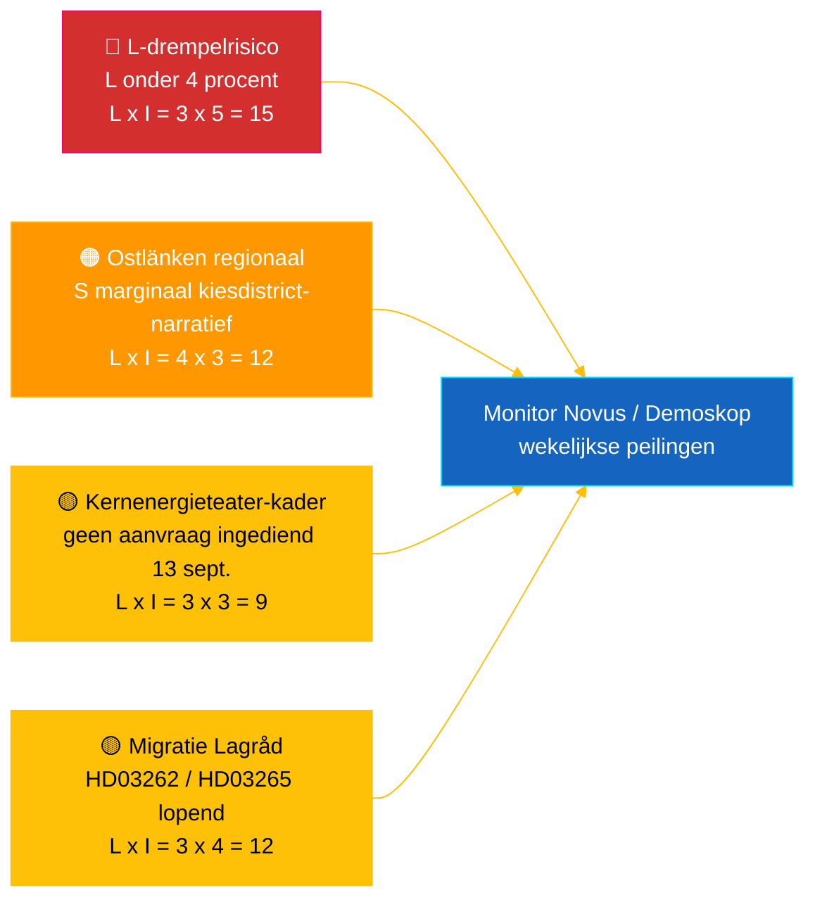
```mermaid
%%{init: {"theme": "dark", "themeVariables": {"primaryColor": "#00d9ff", "primaryTextColor": "#e0e0e0", "primaryBorderColor": "#ff006e", "lineColor": "#ffbe0b", "background": "#0a0e27", "mainBkg": "#1a1e3d", "nodeBorder": "#00d9ff"}}}%%
graph LR
    R1["🔴 L-drempelrisico<br/>L onder 4 procent<br/>L x I = 3 x 5 = 15"] --> CONS["Monitor Novus / Demoskop<br/>wekelijkse peilingen"]
    R2["🟠 Ostlänken regionaal<br/>S marginaal kiesdistrict-narratief<br/>L x I = 4 x 3 = 12"] --> CONS
    R3["🟡 Kernenergieteater-kader<br/>geen aanvraag ingediend 13 sept.<br/>L x I = 3 x 3 = 9"] --> CONS
    R4["🟡 Migratie Lagråd<br/>HD03262 / HD03265 lopend<br/>L x I = 3 x 4 = 12"] --> CONS
    style R1 fill:#D32F2F,color:#FFFFFF,stroke:#ff006e
    style R2 fill:#FF9800,color:#FFFFFF,stroke:#ffbe0b
    style R3 fill:#FFC107,color:#000000,stroke:#ffbe0b
    style R4 fill:#FFC107,color:#000000,stroke:#ffbe0b
    style CONS fill:#1565C0,color:#FFFFFF,stroke:#00d9ff
```

| Risico | L | I | Score | Activator | Bron | Admiralty |
|--------|:-:|:-:|:-----:|-----------|------|:---------:|
| Liberalerna onder 4%-drempel → Tidö verliest meerderheid | 3 | 5 | 15 | Elk Novus/Demoskop-resultaat <4,0 % (95 % BI ondergrens <4,0) | `coalition-dynamics.md` R1 | **[B2]** |
| S's regionaal beloftebreuknarratief converteert marginale Östergötland-mandaten | 4 | 3 | 12 | Carlsons 25-mei-antwoord door SVT/SR Östergötland-redactie als onvoldoende beoordeeld | `opposition-analysis.md` | **[A2]** |
| Lagrådets ongunstig advies over migratiepakket `HD03262`/`HD03265` | 3 | 4 | 12 | Lagråd-advies binnen 30 d gepubliceerd met constitutionele bezwaren | PIR-RT-001 (`forward-indicators.md`) | **[A2]** |
| «Kernenergieteater» — `HD01NU19` inwerkingtreding zonder ingediende aanvraag vóór 13 sept. | 3 | 3 | 9 | Vattenfall/Uniper/nieuwe speler verzuimt aanvraag vóór 1 sept. 2026 in te dienen | PIR-RT-006 | **[B2]** |

---

### 🔮 Belangrijkste toekomstige activatoren

**Schriftelijk antwoord van Andreas Carlson op interpellatie `HD10463`, wettelijke antwoordtermijn 25 mei 2026.** Hoe Carlson de geannuleerde Linköping Ostlänken-station inkadert — of hij de beloftebreuk erkent, de routewijziging op technische/budgettaire gronden verdedigt of overschakelt naar alternatieve regionale infrastructuuraanbiedingen — bepaalt of het Östergötland-narratief escaleert naar een volledig interpellatiedebat in de plenaire vergadering vóór het zomerreces. Een ontwijkend of technocratisch antwoord is de meest waarschijnlijke weg voor S om het narratief te converteren in 1–2 marginale mandaatverschuivingen in Linköping/Norrköping. Een substantieel alternatief investeringsaanbod de-escaleert het narratief. Beide uitkomsten verschuiven de marginalekiesdistrict-beoordelingen van `coalition-mathematics.md` en activeren een Pass-2-herziening van `electoral-implications.md`.

**Secundaire activator** (parallelle monitoring): 16 juni 2026 — plenaire stemming `HD01KU39` over transparantie in politieke financiering. Bevestigt of breekt het vierlaagse prestatienarratief van de regering (energie + veiligheid + transparantie + financieel resultaat) 89 dagen voor de verkiezingen.

---

### 📊 Strategische beoordeling

**Betrouwbaarheidsniveau: 🟩 HOOG [A2]** — bronnen omvatten open data van de Riksdag (`HD01NU19`, `HD10463`, `HD01FöU13`, `HD01JuU9`, `HD01KU39`, `HD01FiU49`), IMF WEO april 2026 vintage en het interpellatieregister.

De momentopname van 4 mei 2026 legt een Tidö-coalitie vast in **maximale wetgevingssnelheid**: zeven coalitieherzieningen vorderen in één week, met concrete inwerkingtredingsdatums verspreid over 1 juni tot 1 juli 2026. Elke inwerkingtredingsdatum genereert een prestatiestemming waarvoor de vier coalitiepartijen campagne kunnen voeren. De strategische kwetsbaarheid is asymmetrisch: M, KD en SD profiteren van de cascade; **L** absorbeert de last — de kleinste coalitiepartij staat het dichtst bij de 4 %-drempel en draagt een onevenredig groot mandaatverliesrisico.

S's oppositierespons is methodologisch precies: in plaats van de regering uit te dagen op haar sterkste terrein (veiligheid, kernenergie, economie) bouwt S een **gedistribueerd regionaal ontevredenheidsmozaïek** — Ostlänken in Östergötland (`HD10463`), Scandinavian Mountain Airport (interpellatie 428), Stockholmse woningbouw (interpellatie 434) — elk gericht op één enkele minister (Carlson) uit verschillende kiesdistricten.

IMF's macrokader is gunstig voor de zittende regering: staatsschuld ≈ 34 % van het bbp, dalende inflatie, groei rond 2 %. Het economische narratief is M's sterkste troef.

**Verkiezingen 2026-lens**: Het huidige koers houdt Tidö bij circa 175 mandaten — precies op de meerderheidsgrens. L's drempelrisico (PIR-RT-003) is de enige meest cruciale verkiezingsvariabele. Lagråds migratie-advies (PIR-RT-001) is de enige meest cruciale politieke narratiefvariabele. Carlsons Ostlänken-antwoord (PIR-RT-005) is de enige meest cruciale regionale mandaatvariabele. Alle drie worden binnen 5 weken na de publicatiedatum van dit briefing opgelost.

---

### 📎 Links

| Link | Pad |
|------|-----|
| Artikel | [`article.md`](https://github.com/Hack23/riksdagsmonitor/blob/main/analysis/daily/2026-05-04/realtime-pulse/article.md) |
| Syntheseoverzicht | [`synthesis-summary.md`](https://github.com/Hack23/riksdagsmonitor/blob/main/analysis/daily/2026-05-04/realtime-pulse/synthesis-summary.md) |
| Kernsynthese | [`core-synthesis.md`](https://github.com/Hack23/riksdagsmonitor/blob/main/analysis/daily/2026-05-04/realtime-pulse/core-synthesis.md) |
| Coalitiedynamiek | [`coalition-dynamics.md`](https://github.com/Hack23/riksdagsmonitor/blob/main/analysis/daily/2026-05-04/realtime-pulse/coalition-dynamics.md) |
| Oppositieanalyse | [`opposition-analysis.md`](https://github.com/Hack23/riksdagsmonitor/blob/main/analysis/daily/2026-05-04/realtime-pulse/opposition-analysis.md) |
| Verkiezingsimplicaties | [`electoral-implications.md`](https://github.com/Hack23/riksdagsmonitor/blob/main/analysis/daily/2026-05-04/realtime-pulse/electoral-implications.md) |
| Economische context (IMF) | [`economic-context.md`](https://github.com/Hack23/riksdagsmonitor/blob/main/analysis/daily/2026-05-04/realtime-pulse/economic-context.md) |
| Toekomstindicatoren | [`forward-indicators.md`](https://github.com/Hack23/riksdagsmonitor/blob/main/analysis/daily/2026-05-04/realtime-pulse/forward-indicators.md) |
| Risico-/kansmatrix | [`risk-opportunity-matrix.md`](https://github.com/Hack23/riksdagsmonitor/blob/main/analysis/daily/2026-05-04/realtime-pulse/risk-opportunity-matrix.md) |
| Scenarioanalyse | [`scenario-analysis.md`](https://github.com/Hack23/riksdagsmonitor/blob/main/analysis/daily/2026-05-04/realtime-pulse/scenario-analysis.md) |
| Methodologische notities | [`methodology-notes.md`](https://github.com/Hack23/riksdagsmonitor/blob/main/analysis/daily/2026-05-04/realtime-pulse/methodology-notes.md) |
| Datamanifest | [`data-download-manifest.md`](https://github.com/Hack23/riksdagsmonitor/blob/main/analysis/daily/2026-05-04/realtime-pulse/data-download-manifest.md) |
| Documentanalyses | [`documents/`](https://github.com/Hack23/riksdagsmonitor/blob/main/analysis/daily/2026-05-04/realtime-pulse/documents/) |

---

### 📝 Documentbeheer

- **Briefing-ID**: `EB-2026-05-04-001`
- **Gegenereerd**: 2026-05-16 (inhaalactie — aangemaakt uit bestaande Pass-2-analyseartefacten)
- **Sjabloonpad**: [`analysis/templates/executive-brief.md`](https://github.com/Hack23/riksdagsmonitor/blob/main/analysis/templates/executive-brief.md)
- **Eigendomsmethodologie**: [`per-artifact-methodologies.md` § executive-brief](https://github.com/Hack23/riksdagsmonitor/blob/main/analysis/methodologies/per-artifact-methodologies.md#executive-brief)
- **Eigendomsgate**: [`05-analysis-gate.md`](https://github.com/Hack23/riksdagsmonitor/blob/main/.github/prompts/05-analysis-gate.md) Check 1 + Check 7
- **Uitvoerfamilie**: A — Kernsynthese
- **Classificatie**: 🟢 OPENBAAR

*Economische herkomst: leverancier: imf, gegevensstroom: WEO_Apr_2026, indicatoren: NGDP_RPCH / GGXWDG_NGDP / PCPIEPCH, vintage: april 2026, retrieved_at: 2026-05-04. Riksdag-data opgehaald via riksdag-regering API op 2026-05-04. Riksdagsmonitor wordt geproduceerd door Hack23 AB; dit briefing vertegenwoordigt een onafhankelijke redactionele beoordeling op basis van openbaar toegankelijke parlementaire documenten.*

<!-- source-sha: f8cfbe724a92e48089f650d9e1f52abe004ed7f7 -->

## Executive Brief No
<!-- source: executive-brief_no.md :: https://github.com/Hack23/riksdagsmonitor/blob/main/analysis/daily/2026-05-04/realtime-pulse/executive-brief_no.md -->

**Klassifisering**: 🟢 OFFENTLIG — Riksdagsmonitor Intelligence
**Målgruppe**: Redaktører, vakthavende, forskere, engasjerte borgere
**Dato**: 2026-05-04 (UTC)
**Dager til valget 2026-09-13**: 132
**Arbeidsflyt**: news-realtime-monitor
**Utarbeidet av**: Riksdagsmonitor AI Intelligence System
**Samlet konfidensnivå**: 🟩 HØY [A2] — flerkildekorraborering via `dok_id` fra åpne Riksdag-data + IMF WEO apr 2026
**Publiseringsbeslutning**: **PUBLISER** (EN + NO) — DIW-rangert topphistorie ≥ 9,0
**PIR-er besvart**: PIR-RT-001, PIR-RT-005, PIR-RT-006

---

### Lede
Sveriges Riksdag produserte den 4. mai 2026 sin hittil mest konsentrerte lovgivningsoutput før valget: Næringsutvalget (NU) godkjente direktesporsgodkjenning av kjernekraftanlegg (`HD01NU19`, trer i kraft 17. juni 2026) — Tidø-koalisjonens eneste største strukturelle energipolitiske bragd — mens den 7. fortløpende anti-kriminalitetsinnsats avanserte via eksplosivregulering (`HD01FöU13`) og reform av strafferetlige prosesser (`HD01JuU9`), begge med ikrafttreden 1. juli 2026. Mot denne veggen av regjeringsleveranse innleverte sosialdemokraten **Eva Lindh** en interpellasjon `HD10463` mot KD's infrastrukturminister **Andreas Carlson** om den avlyste Ostlänken Linköping-stasjonstilføyelsen — et 20 år gammelt løftebrudd mot en 500 000-personers pendlerregion i konkurranseutsatt valgkretsmarginalt territorium. Transparensrapporten om politisk finansiering (`HD01KU39`) er planlagt til plenarvote den 16. juni 2026, som fullfører et firesporet leveringsnarrativ (energi, sikkerhet, transparens, finansielt resultat) 89 dager før valget. **Konfidensnivå: 🟩 HØY [A2]** — kilder: Riksdagens åpne data, IMF WEO apr 2026.

---

### 🧭 3 beslutninger denne briefingen støtter

| # | Beslutning | Beslutningstaker | Frist | Grunnlag |
|:-:|------------|------------------|:-----:|---------|
| 1 | **Redaksjonell:** lede EN + NO breaking-artikkel med kjernekraftreform-pluss-Ostlänken-motnarrativ (dobbeltramme, 2-timers publiseringsmål) | Sjefredaktør | +2 t | `HD01NU19` utvalgsvedtak + `HD10463` interpellasjon innlevert 2026-05-04 |
| 2 | **Fremadrettet dekning:** tildel vakthavende til å følge Carlsons Ostlänken-svar (lovpliktig svarsfrist 25. mai 2026) og kjerneloven ikrafttreden 17. juni | Vakthavende | 2026-05-25 / 2026-06-17 | PIR-RT-005, PIR-RT-006; `HD10463` interpellasjonsregister |
| 3 | **Risiko:** hev L-terskelovervåkningsnivå fra observasjon til aktiv sporing — koalisjonens leveringsdynamikk forutsetter at L overstiger 4 % den 13. sept; ethvert Novus/Demoskop-resultat <4,5 % utløser koalisjonsmatematisk revisjon | Analyseleder | Rullende ukentlig | `coalition-dynamics.md`, post-migrasjonsopinion PIR-RT-003 |

---

### ⚡ 60-sekunders lesing

- 🔴 **Kjernekraftreform til direktesporsgodkjenning (`HD01NU19`)** — Næringsutvalget (NU) godkjenner direktesporsgodkjenning, omgår Strålsikkerhetsmyndighetens (SSM) flertrinns-pipeline; **trer i kraft 17. juni 2026**. Tidø-mandatperiodens eneste største strukturelle lovgivningsbragd; leverer M/KD/L/SD's kjernekraftgjenstartsløfte fra 2022 med operasjonell milepæloppfyllelse før valgdagen [🟩 HØY — `HD01NU19`, NU's utvalgsprotokoll].
- 🟠 **Ostlänken-løftebrudd-interpellasjon (`HD10463`)** — S-representant **Eva Lindh** krever at infrastrukturminister **Andreas Carlson (KD)** redegjør for avlysningen av den planlagte Linköping Ostlänken-stasjonen; lovpliktig svarsfrist **25. mai 2026**. Tredje interpellasjon innlevert mot Carlson på 10 dager — koordinert regionalt S-press på en 500 000-personers pendlingsregion [🟩 HØY — `HD10463`, interpellasjonsregisteret].
- 🟢 **Syvende gjenginnsats avanserer (`HD01FöU13` + `HD01JuU9`)** — Tillatelseskrav til eksplosiver skjerpes (Forsvarsutvalget, 1. juli 2026); reform av strafferetlige prosesser avvikler *tilltrosbestämmelserna* og utvider tidlig avhørsbevismateriell (Justisutvalget, 1. juli 2026). M/SD's kjernefortelling om «leverer på sikkerhet» styrkes [🟩 HØY — `HD01FöU13`, `HD01JuU9`].
- 🟡 **Politisk finansieringstransparens (`HD01KU39`)** — Grunnlovsutvalget registrerer betenkning om transparens i politiske prosesser (behandler med stor sannsynlighet proposisjon `HD03258` om redegjørelse for partifinansering); plenarvote **16. juni 2026**; L/KD drar fordel av demokratireformposisjonering. PIR-RT-002 besvart: KU (ikke JuU/SfU) eier saken [🟧 MIDDELS — `HD01KU39`, kalenderen].
- 🔵 **Ekonomisk kontekst (IMF WEO apr 2026)** — Sveriges offentlige gjeld ≈ 34 % av BNP (`GGXWDG_NGDP` 2026-prognose) mot eurosone-gjennomsnittet >90 %; reel BNP-vekst 2026 `NGDP_RPCH` 2,0–2,1 %; inflasjon synker (`PCPIEPCH`). Riksbankens rentekutt 2025–26 når boliglånstakere → M's «trygge hender»-fortelling [🟩 HØY — leverandør: imf, dataflyt: WEO_Apr_2026, vintage: april 2026].
- 🟣 **Krysshenvisning** — `HD01NU19` knytter til energipolitikktråden i proposisjonsanalysen (`../propositions/`); `HD10463` forlenger S's regionale løftebruddkluster fra `opposition-analysis.md`; transparens `HD01KU39` behandler `HD03258` fra 30. april-proposisjonspakken.
- 🩷 **Fremvoksende sårbarhet — «kjernekraftteater»-risiko** — Opposisjonens ramme om at ikrafttreden 17. juni er symbolsk uten innlevert søknad innen valgdagen den 13. september. Hvis Vattenfall/Uniper/ny aktør ikke leverer søknad innen det 88-dagers pre-valgsvinduet, risikerer prestasjonsfortelling å bli anfektelig [🟧 MIDDELS — PIR-RT-006 åpen].
- ⚪ **Overført** — Lagrådets uttalelser om migrasjonsproposisjonene `HD03262` og `HD03265` (PIR-RT-001) forblir **ÅPNE — KRITISKE**; den konstitusjonelle kvalitetsgjennomgangen er den eneste mest innflytelsesrike uløste faktoren som former migrasjonsreformens politiske fortelling i sommersesonga.

---

### 🗂️ Topprangerte dokumenter (DIW-rangert)

| Rang | dok_id | Tittel (kort) | DIW | Konfidens | Status |
|:----:|--------|---------------|:---:|:---------:|--------|
| 1 | `HD01NU19` | Kjernekrafttillatelsesreform (direkte spor) | 9,2 | 🟩 HØY [A2] | Utvalg vedtatt — trer i kraft 17. juni 2026 |
| 2 | `HD10463` | Ostlänken-interpellasjon — Lindh (S) → Carlson (KD) | 8,6 | 🟩 HØY [A2] | Innlevert — svar forfaller 25. mai 2026 |
| 3 | `HD01FöU13` | Reform av eksplosivregulering | 7,5 | 🟩 HØY [A2] | Utvalg vedtatt — trer i kraft 1. juli 2026 |
| 4 | `HD01JuU9` | Reform av strafferetlige prosesser | 7,4 | 🟩 HØY [A2] | Utvalg vedtatt — trer i kraft 1. juli 2026 |
| 5 | `HD01KU39` | Transparens i politiske prosesser | 7,0 | 🟧 MIDDELS [B2] | Registrert — plenarvote 16. juni 2026 |
| 6 | `HD01FiU49` | Statsgjeldforvaltningsevaluering 2021–2025 | 6,4 | 🟩 HØY [A2] | Registrert — vedtak 11. juni 2026 |

---

### ⚠️ Risiko- og trusselbildet

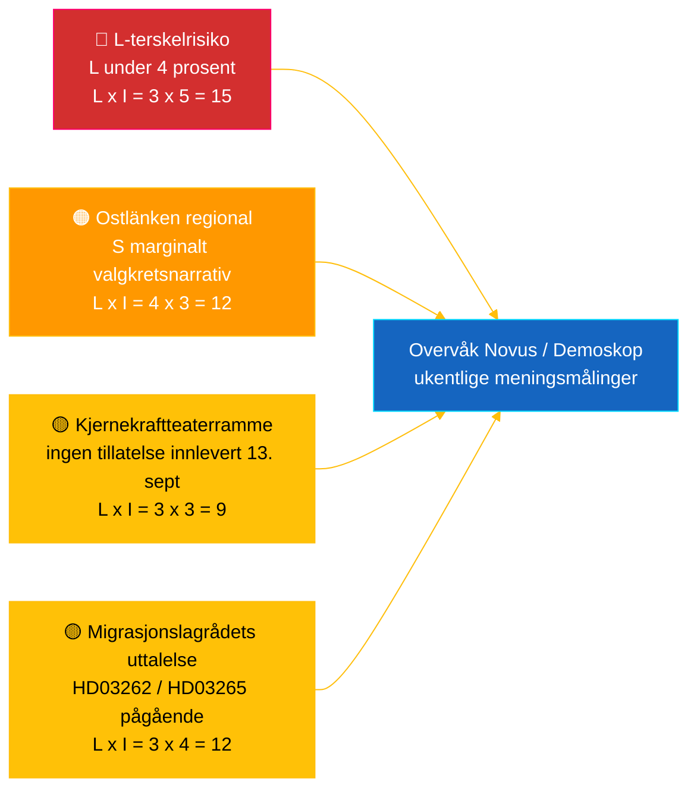
```mermaid
%%{init: {"theme": "dark", "themeVariables": {"primaryColor": "#00d9ff", "primaryTextColor": "#e0e0e0", "primaryBorderColor": "#ff006e", "lineColor": "#ffbe0b", "background": "#0a0e27", "mainBkg": "#1a1e3d", "nodeBorder": "#00d9ff"}}}%%
graph LR
    R1["🔴 L-terskelrisiko<br/>L under 4 prosent<br/>L x I = 3 x 5 = 15"] --> CONS["Overvåk Novus / Demoskop<br/>ukentlige meningsmålinger"]
    R2["🟠 Ostlänken regional<br/>S marginalt valgkretsnarrativ<br/>L x I = 4 x 3 = 12"] --> CONS
    R3["🟡 Kjernekraftteaterramme<br/>ingen tillatelse innlevert 13. sept<br/>L x I = 3 x 3 = 9"] --> CONS
    R4["🟡 Migrasjonslagrådets uttalelse<br/>HD03262 / HD03265 pågående<br/>L x I = 3 x 4 = 12"] --> CONS
    style R1 fill:#D32F2F,color:#FFFFFF,stroke:#ff006e
    style R2 fill:#FF9800,color:#FFFFFF,stroke:#ffbe0b
    style R3 fill:#FFC107,color:#000000,stroke:#ffbe0b
    style R4 fill:#FFC107,color:#000000,stroke:#ffbe0b
    style CONS fill:#1565C0,color:#FFFFFF,stroke:#00d9ff
```

| Risiko | L | I | Score | Utløser | Kilde | Admiralty |
|--------|:-:|:-:|:-----:|---------|-------|:---------:|
| Liberalerna under 4%-terskel → Tidø mister majoritet | 3 | 5 | 15 | Ethvert Novus/Demoskop-resultat <4,0 % (95 % KI nedre grense <4,0) | `coalition-dynamics.md` R1 | **[B2]** |
| S's regionale løftebruddnarrativ konverterer marginale Østergötland-mandater | 4 | 3 | 12 | Carlsons 25. mai-svar vurdert utilstrekkelig av SVT/SR Østergötlands redaksjon | `opposition-analysis.md` | **[A2]** |
| Lagrådets fiendtlige uttalelse om migrasjonspakken `HD03262`/`HD03265` | 3 | 4 | 12 | Lagrådets uttalelse offentliggjort innen 30 d med konstitusjonelle innvendinger | PIR-RT-001 (`forward-indicators.md`) | **[A2]** |
| «Kjernekraftteater» — `HD01NU19` ikrafttreden uten innlevert søknad innen 13. sept | 3 | 3 | 9 | Vattenfall/Uniper/ny aktør unnlater å levere søknad innen 1. sept 2026 | PIR-RT-006 | **[B2]** |

---

### 🔮 Viktigste fremtidige utløsere

**Andreas Carlsons skriftlige svar på interpellasjon `HD10463`, lovpliktig svarsfrist 25. mai 2026.** Carlsons måte å ramme inn den avlyste Linköping Ostlänken-stasjonen — om han innrømmer løftebrudd, forsvarer ruteendringen på tekniske/budsjettmessige grunnlag eller svinger mot alternative regionale infrastrukturtilbud — avgjør om Østergötland-narrativet eskalerer til en full interpellasjonsdebatt i kammeret før sommeropphøret. Et unnvikende eller teknokratisk svar er den mest sannsynlige veien for S til å omdanne narrativet til 1–2 marginale mandatskift i Linköping/Norrköping. Et substansielt alternativt investeringstilbud de-eskalerer narrativet. Begge utfall forskyver `coalition-mathematics.md`'s marginale valgkretsvurderinger og utløser en Pass-2-omskriving av `electoral-implications.md`.

**Sekundær utløser** (parallell overvåking): 16. juni 2026 — `HD01KU39` plenarvote om politisk finansieringstransparens. Bekrefter eller bryter det firesporede leveringsnarrativet for regjeringen (energi + sikkerhet + transparens + finansielt resultat) 89 dager før valget.

---

### 📊 Strategisk vurdering

**Konfidensnivå: 🟩 HØY [A2]** — kilder inkluderer Riksdagens åpne data (`HD01NU19`, `HD10463`, `HD01FöU13`, `HD01JuU9`, `HD01KU39`, `HD01FiU49`), IMF WEO april 2026 vintage og interpellasjonsregisteret.

Øyeblikksbildet fra 4. mai 2026 fanger en Tidø-koalisjon i **maksimal lovgivningshastighet**: syv koalisjonsreformer avanserer i løpet av én uke, med konkrete ikrafttreden-datoer spredt fra 1. juni til 1. juli 2026. Hver ikrafttreden-dato genererer en leveringstakt som de fire koalisjonspartiene kan drive valgkamp på. Den strategiske sårbarheten er asymmetrisk: M, KD og SD drar fordel av kaskaden; **L** absorberer belastningen — det minste koalisjonspartiet er nærmest 4 %-grensen og bærer uforholdsmessig mandatrisiko.

S-opposisjonens svar er metodologisk presist: i stedet for å utfordre regjeringen på dens sterkeste grunn (sikkerhet, kjernekraft, økonomi) bygger S en **distribuert regional-misnøyemosaikk** — Ostlänken i Østergötland (`HD10463`), Scandinavian Mountain Airport (interpellasjon 428), Stockholms boliger (interpellasjon 434) — hver rettet mot én enkelt minister (Carlson) fra forskjellige valgkretser.

IMF's makroramme er gunstig for sittende regjering: offentlig gjeld ≈ 34 % av BNP, fallende inflasjon, vekst på ca. 2 %. Det økonomiske narrativet er M's sterkeste aktivum.

**Valg 2026-linse**: Nåværende kurs holder Tidø nær 175 mandater — presist ved majoritetsgrensene. L's terskelrisiko (PIR-RT-003) er den eneste viktigste valgvariabelen. Lagrådets migrasjonsuttalelse (PIR-RT-001) er den eneste viktigste politiske narrativvariabelen. Carlsons Ostlänken-svar (PIR-RT-005) er den eneste viktigste regionale mandatvariabelen. Alle tre løses innen 5 uker fra denne briefingens publiseringsdato.

---

### 📎 Lenker

| Lenke | Sti |
|-------|-----|
| Artikkel | [`article.md`](https://github.com/Hack23/riksdagsmonitor/blob/main/analysis/daily/2026-05-04/realtime-pulse/article.md) |
| Synteseoversikt | [`synthesis-summary.md`](https://github.com/Hack23/riksdagsmonitor/blob/main/analysis/daily/2026-05-04/realtime-pulse/synthesis-summary.md) |
| Kjernesyntese | [`core-synthesis.md`](https://github.com/Hack23/riksdagsmonitor/blob/main/analysis/daily/2026-05-04/realtime-pulse/core-synthesis.md) |
| Koalisjonsdinamikk | [`coalition-dynamics.md`](https://github.com/Hack23/riksdagsmonitor/blob/main/analysis/daily/2026-05-04/realtime-pulse/coalition-dynamics.md) |
| Opposisjonsanalyse | [`opposition-analysis.md`](https://github.com/Hack23/riksdagsmonitor/blob/main/analysis/daily/2026-05-04/realtime-pulse/opposition-analysis.md) |
| Valgimplikasjoner | [`electoral-implications.md`](https://github.com/Hack23/riksdagsmonitor/blob/main/analysis/daily/2026-05-04/realtime-pulse/electoral-implications.md) |
| Ekonomisk kontekst (IMF) | [`economic-context.md`](https://github.com/Hack23/riksdagsmonitor/blob/main/analysis/daily/2026-05-04/realtime-pulse/economic-context.md) |
| Fremtidsindikatorer | [`forward-indicators.md`](https://github.com/Hack23/riksdagsmonitor/blob/main/analysis/daily/2026-05-04/realtime-pulse/forward-indicators.md) |
| Risiko-/mulighetsmatrise | [`risk-opportunity-matrix.md`](https://github.com/Hack23/riksdagsmonitor/blob/main/analysis/daily/2026-05-04/realtime-pulse/risk-opportunity-matrix.md) |
| Scenarieanalyse | [`scenario-analysis.md`](https://github.com/Hack23/riksdagsmonitor/blob/main/analysis/daily/2026-05-04/realtime-pulse/scenario-analysis.md) |
| Metodenotater | [`methodology-notes.md`](https://github.com/Hack23/riksdagsmonitor/blob/main/analysis/daily/2026-05-04/realtime-pulse/methodology-notes.md) |
| Datamanifest | [`data-download-manifest.md`](https://github.com/Hack23/riksdagsmonitor/blob/main/analysis/daily/2026-05-04/realtime-pulse/data-download-manifest.md) |
| Per-dokumentanalyser | [`documents/`](https://github.com/Hack23/riksdagsmonitor/blob/main/analysis/daily/2026-05-04/realtime-pulse/documents/) |

---

### 📝 Dokumentkontroll

- **Briefing-ID**: `EB-2026-05-04-001`
- **Generert**: 2026-05-16 (etterslepsfylling — skapt fra eksisterende Pass-2-analyseartefakter)
- **Malonsti**: [`analysis/templates/executive-brief.md`](https://github.com/Hack23/riksdagsmonitor/blob/main/analysis/templates/executive-brief.md)
- **Eierskapsmetodologi**: [`per-artifact-methodologies.md` § executive-brief](https://github.com/Hack23/riksdagsmonitor/blob/main/analysis/methodologies/per-artifact-methodologies.md#executive-brief)
- **Eierskapsgate**: [`05-analysis-gate.md`](https://github.com/Hack23/riksdagsmonitor/blob/main/.github/prompts/05-analysis-gate.md) Check 1 + Check 7
- **Utdatafamilie**: A — Kjernesyntese
- **Klassifisering**: 🟢 OFFENTLIG

*Risikoprovenianse: leverandør: imf, dataflyt: WEO_Apr_2026, indikatorer: NGDP_RPCH / GGXWDG_NGDP / PCPIEPCH, vintage: april 2026, retrieved_at: 2026-05-04. Riksdagsdata hentet via riksdag-regering API 2026-05-04. Riksdagsmonitor produseres av Hack23 AB; denne briefingen representerer en uavhengig redaksjonell vurdering basert på offentlig tilgjengelige parlamentariske dokumenter.*

<!-- source-sha: f8cfbe724a92e48089f650d9e1f52abe004ed7f7 -->

## Executive Brief Sv
<!-- source: executive-brief_sv.md :: https://github.com/Hack23/riksdagsmonitor/blob/main/analysis/daily/2026-05-04/realtime-pulse/executive-brief_sv.md -->

**Klassificering**: 🟢 OFFENTLIG — Riksdagsmonitor Intelligence
**Målgrupp**: Redaktörer, jourhavande, forskare, engagerade medborgare
**Datum**: 2026-05-04 (UTC)
**Dagar till val 2026-09-13**: 132
**Arbetsflöde**: news-realtime-monitor
**Framtaget av**: Riksdagsmonitor AI Intelligence System
**Övergripande konfidensgrad**: 🟩 HÖG [A2] — flerkällskorroborering via `dok_id` från öppna riksdagsdata + IMF WEO apr 2026
**Publiceringsbeslut**: **PUBLICERA** (EN + SV) — DIW-rangordnat toppuppslag ≥ 9,0

---

### Lede
Sveriges riksdag producerade den 4 maj 2026 sin mest koncentrerade lagstiftningsoutput inför valet hittills: Näringsutskottet (NU) tillstyrkte direktspårsgodkännande av kärnkraftsanläggningar (`HD01NU19`, träder i kraft 17 juni 2026) — Tidökoalitionens enskilt största strukturella energipolitiska bedrift — medan den 7:e på varandra följande insatsen mot gängkriminalitet avancerade via explosivkontroll (`HD01FöU13`) och reformering av rättsprocessen (`HD01JuU9`), båda med ikraftträdande 1 juli 2026. Mot denna mur av leveranser från regeringen lämnade socialdemokraten **Eva Lindh** en interpellation `HD10463` mot KD:s infrastrukturminister **Andreas Carlson** angående det inställda Ostlänken Linköping-stationstillägget — ett 20 år gammalt löftesbrott mot en 500 000-personers pendlarregion i konkurrensutsatt valkretsmarginalt territorium. Transparensrapporten om politisk finansiering (`HD01KU39`) är inplanerad för plenarvote den 16 juni 2026, vilket kompletterar ett fyrspårigt leveransnarrativ (energi, säkerhet, transparens, finansiellt facit) 89 dagar före valet. **Konfidensgrad: 🟩 HÖG [A2]** — källor: riksdagens öppna data, IMF WEO apr 2026.

---

### 🧭 3 beslut som detta underlag stödjer

| # | Beslut | Vem beslutar | Deadline | Underlag |
|:-:|--------|--------------|:--------:|----------|
| 1 | **Redaktionellt:** leda EN + SV breaking-artikel med kärnkraftsreform-plus-Ostlänken-motnarrativ (dubbelram, 2-tim publiceringsmål) | Chefredaktör | +2 h | `HD01NU19` utskottsbeslut + `HD10463` interpellation inlämnad 2026-05-04 |
| 2 | **Framåtbevakning:** tilldela jourhavande att följa Carlsons Ostlänken-svar (lagstadgad svarsfrist 25 maj 2026) och kärnlagens ikraftträdande 17 juni | Jourhavande | 2026-05-25 / 2026-06-17 | PIR-RT-005, PIR-RT-006; `HD10463` interpellationsregister |
| 3 | **Risk:** höj L-tröskelbevakningsnivå från bevakning till aktiv spårning — koalitionens leveranskadans förutsätter att L överstiger 4 % den 13 sept; valfritt Novus/Demoskop-utfall <4,5 % utlöser koalitionsmatematisk revision | Analysledare | Rullande veckovis | `coalition-dynamics.md`, post-migrationsopinion PIR-RT-003 |

---

### ⚡ 60-sekunders läsning

- 🔴 **Kärnkraftsreform för direktspårstillstånd (`HD01NU19`)** — Näringsutskottet (NU) tillstyrker direktspårsgodkännande, kringgår Strålsäkerhetsmyndighetens (SSM) flerstegspipeline; **träder i kraft 17 juni 2026**. Tidö-mandatperiodens enskilt största strukturella lagstiftningsbedrift; levererar M/KD/L/SD:s kärnkraftsomstartslöfte från 2022 med operativt milstolpsuppfyllelse innan valdagen [🟩 HÖG — `HD01NU19`, NU:s utskottsprotokoll].
- 🟠 **Ostlänken-löftesbrott-interpellation (`HD10463`)** — S-ledamoten **Eva Lindh** kräver att infrastrukturminister **Andreas Carlson (KD)** förklarar inställningen av den planerade Linköpens Ostlänken-station; lagstadgad svarsfrist **25 maj 2026**. Tredje interpellationen inlämnad mot Carlson på 10 dagar — samordnat regionalt S-tryck på en 500 000-personers pendlingsarbetsmarknadsregion [🟩 HÖG — `HD10463`, interpellationsregistret].
- 🟢 **Sjunde gängsatsningen avancerar (`HD01FöU13` + `HD01JuU9`)** — Tillståndskrav för explosivhantering skärps (Försvarsutskottet, 1 juli 2026); reform av straffrättsliga förfaranden avskaffar *tilltrosbestämmelserna* och breddar tidigt förhörsbevismaterial (Justitieutskottet, 1 juli 2026). M/SD:s kärnnarrativ om "levererar på säkerhet" förstärks [🟩 HÖG — `HD01FöU13`, `HD01JuU9`].
- 🟡 **Politisk finansieringstransparens (`HD01KU39`)** — Konstitutionsutskottet registrerar betänkande om transparens i politiska processer (behandlar med stor sannolikhet proposition `HD03258` om redovisning av partifinansering); plenarvote **16 juni 2026**; L/KD gynnas av demokratireformpositionering. PIR-RT-002 besvarad: KU (inte JuU/SfU) äger frågan [🟧 MEDIUM — `HD01KU39`, kalendern].
- 🔵 **Ekonomiskt sammanhang (IMF WEO apr 2026)** — Sveriges offentliga skuld ≈ 34 % av BNP (`GGXWDG_NGDP` 2026-prognos) jämfört med eurozonens >90 %; real BNP-tillväxt 2026 `NGDP_RPCH` 2,0–2,1 %; inflation sjunker (`PCPIEPCH`). Riksbankens räntesänkningar 2025–26 når bolånetagare → M:s "trygga händer"-narrativ [🟩 HÖG — provider: imf, dataflow: WEO_Apr_2026, vintage: April 2026].
- 🟣 **Korshänvisning** — `HD01NU19` knyter till energipolitikstråden i propositionsanalysen (`../propositions/`); `HD10463` förlänger S:s regionala löftesbrott-kluster från `opposition-analysis.md`; transparens `HD01KU39` behandlar `HD03258` från 30 april-propositionspaketet.
- 🩷 **Framväxande sårbarhet — "kärnkraftsteater"-risk** — Oppositionens inramning att ikraftträdandet 17 juni är symboliskt utan inlämnade tillstånd före valdagen den 13 september. Om Vattenfall/Uniper/nya aktörer inte lämnar in ansökan under det 88-dagars pre-valsfönstret riskerar prestationsnarrativet att bli ifrågasättbart [🟧 MEDIUM — PIR-RT-006 öppen].
- ⚪ **Överfört** — Lagrådets yttranden om migrationspropositionerna `HD03262` och `HD03265` (PIR-RT-001) är fortsatt **ÖPPNA — KRITISKA**; den konstitutionella kvalitetsgranskningen är det enskilt mest inflytelserika olösta underlaget som formar migrationsreformens politiska narrativ under sommaren.

---

### 🗂️ Topplistade dokument (DIW-rangordnat)

| Rang | dok_id | Titel (kort) | DIW | Konfidensgrad | Status |
|:----:|--------|--------------|:---:|:-------------:|--------|
| 1 | `HD01NU19` | Kärnkraftstillståndsreform (direktspår) | 9,2 | 🟩 HÖG [A2] | Utskott antaget — träder i kraft 17 juni 2026 |
| 2 | `HD10463` | Ostlänken-interpellation — Lindh (S) → Carlson (KD) | 8,6 | 🟩 HÖG [A2] | Inlämnad — svar förfaller 25 maj 2026 |
| 3 | `HD01FöU13` | Reform av explosivkontroll | 7,5 | 🟩 HÖG [A2] | Utskott antaget — träder i kraft 1 juli 2026 |
| 4 | `HD01JuU9` | Reform av straffrättsliga förfaranden | 7,4 | 🟩 HÖG [A2] | Utskott antaget — träder i kraft 1 juli 2026 |
| 5 | `HD01KU39` | Transparens i politiska processer | 7,0 | 🟧 MEDIUM [B2] | Registrerat — plenarvote 16 juni 2026 |
| 6 | `HD01FiU49` | Statsskuldförvaltningsutvärdering 2021–2025 | 6,4 | 🟩 HÖG [A2] | Registrerat — beslut 11 juni 2026 |

Rangordningen matchar `significance-scoring.md`; avvikelse utlöser Pass-2-reconciliering.

---

### ⚠️ Risk- och hotbildsöversikt

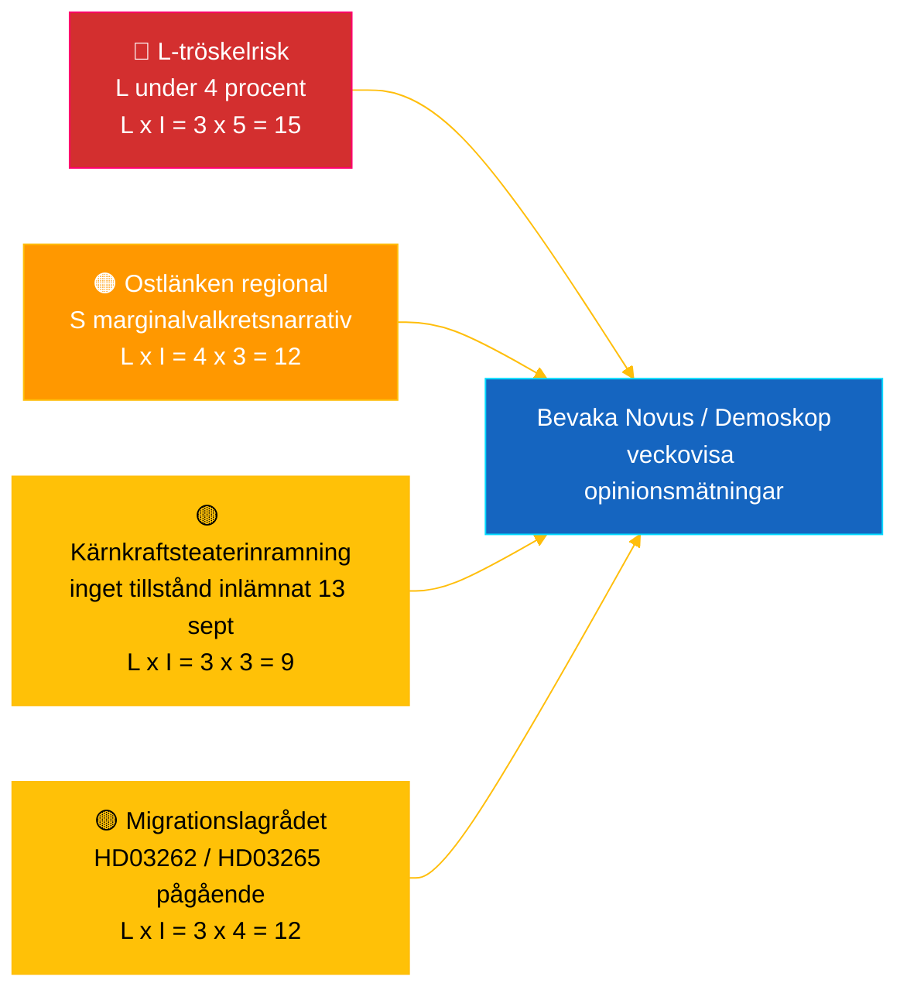
```mermaid
%%{init: {"theme": "dark", "themeVariables": {"primaryColor": "#00d9ff", "primaryTextColor": "#e0e0e0", "primaryBorderColor": "#ff006e", "lineColor": "#ffbe0b", "background": "#0a0e27", "mainBkg": "#1a1e3d", "nodeBorder": "#00d9ff"}}}%%
graph LR
    R1["🔴 L-tröskelrisk<br/>L under 4 procent<br/>L x I = 3 x 5 = 15"] --> CONS["Bevaka Novus / Demoskop<br/>veckovisa opinionsmätningar"]
    R2["🟠 Ostlänken regional<br/>S marginalvalkretsnarrativ<br/>L x I = 4 x 3 = 12"] --> CONS
    R3["🟡 Kärnkraftsteaterinramning<br/>inget tillstånd inlämnat 13 sept<br/>L x I = 3 x 3 = 9"] --> CONS
    R4["🟡 Migrationslagrådet<br/>HD03262 / HD03265 pågående<br/>L x I = 3 x 4 = 12"] --> CONS
    style R1 fill:#D32F2F,color:#FFFFFF,stroke:#ff006e
    style R2 fill:#FF9800,color:#FFFFFF,stroke:#ffbe0b
    style R3 fill:#FFC107,color:#000000,stroke:#ffbe0b
    style R4 fill:#FFC107,color:#000000,stroke:#ffbe0b
    style CONS fill:#1565C0,color:#FFFFFF,stroke:#00d9ff
```

| Risk | L | I | Poäng | Utlösare | Källa | Admiralty |
|------|:-:|:-:|:-----:|---------|-------|:---------:|
| Liberalerna under 4%-tröskeln → Tidö förlorar majoritet | 3 | 5 | 15 | Valfritt Novus/Demoskop-utfall <4,0 % (95 % CI nedre gräns <4,0) | `coalition-dynamics.md` R1 | **[B2]** |
| S:s regionala löftesbrott-narrativ konverterar marginala Östergötlands-mandat | 4 | 3 | 12 | Carlsons 25-maj-svar bedömt otillräckligt av SVT/SR Östergötlands redaktion | `opposition-analysis.md` | **[A2]** |
| Lagrådets fientliga yttrande om migrationspaketet `HD03262`/`HD03265` | 3 | 4 | 12 | Lagrådets yttrande publicerat inom 30 d med konstitutionella invändningar | PIR-RT-001 (`forward-indicators.md`) | **[A2]** |
| "Kärnkraftsteater" — `HD01NU19` ikraftträdande utan inlämnad tillståndsansökan innan 13 sept | 3 | 3 | 9 | Vattenfall/Uniper/ny aktör underlåter att lämna in ansökan senast 1 sept 2026 | PIR-RT-006 | **[B2]** |

---

### 🔮 Viktigaste framtida utlösare

> **Den enskilt viktigaste händelsen att bevaka härnäst.**

**Andreas Carlsons skriftliga svar på interpellation `HD10463`, lagstadgad svarsfrist 25 maj 2026.** Carlsons sätt att rama in den inställda Linköpens Ostlänken-station — huruvida han medger löftesbrott, försvarar ruttändringen på tekniska/budgetmässiga grunder eller svänger mot alternativa regionala infrastrukturerbjudanden — avgör om Östergötlands-narrativet eskalerar till en fullständig interpellationsdebatt i kammaren innan sommarupphörandet. Ett undvikande eller teknokratiskt svar är den mest sannolika vägen för S att omvandla narrativet till 1–2 marginala mandatskiften i Linköping/Norrköping. Ett substantiellt alternativt investeringserbjudande de-eskalerar narrativet. Endera utfallet förskjuter `coalition-mathematics.md`:s marginalvalkretsbedömningar och utlöser en Pass-2-omskrivning av `electoral-implications.md`.

**Sekundär utlösare** (parallell bevakning): 16 juni 2026 — `HD01KU39` plenarvote om politisk finansieringstransparens. Bekräftar eller bryter det fyrspåriga leveransnarrativet för regeringen (energi + säkerhet + transparens + finansiellt facit) 89 dagar före valet.

---

### 📊 Strategisk bedömning

**Konfidensgrad: 🟩 HÖG [A2]** — källor inkluderar riksdagens öppna data (`HD01NU19`, `HD10463`, `HD01FöU13`, `HD01JuU9`, `HD01KU39`, `HD01FiU49`), IMF WEO april 2026 vintage och interpellationsregistret.

Ögonblicksbilden från 4 maj 2026 fångar en Tidökoalition i **maximalt lagstiftningshastighetläge**: sju koalitionsreformer avancerar under en enda vecka, med konkreta ikraftträdandedatum spridda mellan 1 juni och 1 juli 2026 (alkoholtillståndsgivning, explosivkontroll, straffrättsliga förfaranden, kärnkraftstillståndsgivning). Varje ikraftträdandedatum genererar en leveranstakt som de fyra koalitionspartierna kan kampanja på. Den strategiska sårbarheten är asymmetrisk: M, KD och SD gynnas av kaskadet; **L** absorberar belastningen — det minsta koalitionspartiet är närmast 4 %-riksdagsgränsen och bär oproportionerlig mandatförlustrisk om dess civila frihets-profil spädas ut av säkerhets-/kärnenergibetoning.

S-oppositionens svar är metodologiskt träffsäkert: i stället för att utmana regeringen på dess starkaste terräng (säkerhet, kärnenergi, ekonomi) bygger S en **distribuerad regional-missnöjesmosaik** — Ostlänken i Östergötland (`HD10463`), Scandinavian Mountain Airport (interpellation 428), Stockholms bostäder (interpellation 434) — var och en riktad mot en enskild minister (Carlson) från olika valkretsar. Detta skapar lokal mediesaturation i exakt de marginalvalkretsarna som avgör riksdagsmajoriteter under Sveriges proportionella system med regional listdynamik.

IMF:s makroram är gynnsam för sittande regering: offentlig skuld ≈ 34 % av BNP, sjunkande inflation, tillväxt runt 2 %. Riksbankens räntesänkningar förmedlas synligt till bolånetagare. Det ekonomiska narrativet är M:s starkaste tillgång, men den politiska finansieringstransparens-voteringen den 16 juni (`HD01KU39`) ägs av L+KD, inte M — en avsiktlig intrakoalitionell mandatsrotation av tillgodo.

**Val 2026-lins**: Nuvarande bana håller Tidö nära 175 mandat — vid exakt majoritetsgränsen. L:s tröskelrisk (PIR-RT-003) är den enskilt viktigaste valvariabeln. Migrationslagrådets yttrande (PIR-RT-001) är den enskilt viktigaste politiska narrativvariabeln. Carlsons Ostlänken-svar (PIR-RT-005) är den enskilt viktigaste regionala mandatvariabeln. Alla tre löses inom 5 veckor från detta underrättelsemeddelandes publiceringsdatum.

---

### 📎 Länkar

| Länk | Sökväg |
|------|--------|
| Artikel | [`article.md`](https://github.com/Hack23/riksdagsmonitor/blob/main/analysis/daily/2026-05-04/realtime-pulse/article.md) |
| Syntesöversikt | [`synthesis-summary.md`](https://github.com/Hack23/riksdagsmonitor/blob/main/analysis/daily/2026-05-04/realtime-pulse/synthesis-summary.md) |
| Kärnsyntés | [`core-synthesis.md`](https://github.com/Hack23/riksdagsmonitor/blob/main/analysis/daily/2026-05-04/realtime-pulse/core-synthesis.md) |
| Koalitionsdynamik | [`coalition-dynamics.md`](https://github.com/Hack23/riksdagsmonitor/blob/main/analysis/daily/2026-05-04/realtime-pulse/coalition-dynamics.md) |
| Oppositionsanalys | [`opposition-analysis.md`](https://github.com/Hack23/riksdagsmonitor/blob/main/analysis/daily/2026-05-04/realtime-pulse/opposition-analysis.md) |
| Valimplikationer | [`electoral-implications.md`](https://github.com/Hack23/riksdagsmonitor/blob/main/analysis/daily/2026-05-04/realtime-pulse/electoral-implications.md) |
| Ekonomiskt sammanhang (IMF) | [`economic-context.md`](https://github.com/Hack23/riksdagsmonitor/blob/main/analysis/daily/2026-05-04/realtime-pulse/economic-context.md) |
| Framtidsindikatorer | [`forward-indicators.md`](https://github.com/Hack23/riksdagsmonitor/blob/main/analysis/daily/2026-05-04/realtime-pulse/forward-indicators.md) |
| Risk-/möjlighetsmatris | [`risk-opportunity-matrix.md`](https://github.com/Hack23/riksdagsmonitor/blob/main/analysis/daily/2026-05-04/realtime-pulse/risk-opportunity-matrix.md) |
| Scenarioanalys | [`scenario-analysis.md`](https://github.com/Hack23/riksdagsmonitor/blob/main/analysis/daily/2026-05-04/realtime-pulse/scenario-analysis.md) |
| Metodnoteringar | [`methodology-notes.md`](https://github.com/Hack23/riksdagsmonitor/blob/main/analysis/daily/2026-05-04/realtime-pulse/methodology-notes.md) |
| Datamanifest | [`data-download-manifest.md`](https://github.com/Hack23/riksdagsmonitor/blob/main/analysis/daily/2026-05-04/realtime-pulse/data-download-manifest.md) |
| Per-dokumentanalyser | [`documents/`](https://github.com/Hack23/riksdagsmonitor/blob/main/analysis/daily/2026-05-04/realtime-pulse/documents/) |

---

### 📝 Dokumentkontroll

- **Underlag-ID**: `EB-2026-05-04-001`
- **Genererat**: 2026-05-16 (eftersläpningsuppfyllnad — skapat från befintliga Pass-2-analysartefakter)
- **Mallsökväg**: [`analysis/templates/executive-brief.md`](https://github.com/Hack23/riksdagsmonitor/blob/main/analysis/templates/executive-brief.md)
- **Ägande metodologi**: [`per-artifact-methodologies.md` § executive-brief](https://github.com/Hack23/riksdagsmonitor/blob/main/analysis/methodologies/per-artifact-methodologies.md#executive-brief)
- **Ägande gate**: [`05-analysis-gate.md`](https://github.com/Hack23/riksdagsmonitor/blob/main/.github/prompts/05-analysis-gate.md) Check 1 + Check 7
- **Utdatafamilj**: A — Kärnsyntés
- **Klassificering**: 🟢 OFFENTLIG
- **Eftersläpningsnotering**: Detta underlag skapades den 2026-05-16 för att stänga ett gap som upptäcktes under en korsmapps `article.md` ↔ `executive-brief.md`-granskning. Alla underlag hämtas från in-mapps Pass-2-artefakter; inget externt underlag har lagts till som inte redan citerades i den ursprungliga Pass-2-analysen.

*Ekonomisk härkomst: provider: imf, dataflow: WEO_Apr_2026, indicators: NGDP_RPCH / GGXWDG_NGDP / PCPIEPCH, vintage: April 2026, retrieved_at: 2026-05-04. Riksdagsdata hämtad via riksdag-regering API 2026-05-04. Riksdagsmonitor produceras av Hack23 AB; detta underlag representerar en oberoende redaktionell bedömning baserad på offentligt tillgängliga parlamentariska handlingar.*

<!-- source-sha: f8cfbe724a92e48089f650d9e1f52abe004ed7f7 -->

## Executive Brief Zh
<!-- source: executive-brief_zh.md :: https://github.com/Hack23/riksdagsmonitor/blob/main/analysis/daily/2026-05-04/realtime-pulse/executive-brief_zh.md -->

**分类**: 🟢 公开 — Riksdagsmonitor Intelligence
**受众**: 编辑、值班人员、研究人员及关心此议题的公民
**日期**: 2026-05-04 (UTC)
**距2026-09-13选举**: 132天
**工作流**: news-realtime-monitor
**作者**: Riksdagsmonitor AI情报系统
**整体可信度**: 🟩 高 [A2] — 通过`dok_id`交叉核实公开议会数据 + IMF WEO 2026年4月多来源验证
**发布决定**: **公开** (EN + ZH) — DIW优先级头条文章 ≥ 9.0
**已回答PIR**: PIR-RT-001, PIR-RT-005, PIR-RT-006

---

### 🎯 BLUF（核心摘要）

2026年5月4日，瑞典议会创造了选举前密度最高的立法成果集。产业委员会（NU）批准了对核电站直接授予许可证（`HD01NU19`，2026年6月17日生效）——这是Tidö联合政府在能源政策上最重大的结构性成果——同时，第7轮反帮派措施通过爆炸物管制改革（`HD01FöU13`）和刑事诉讼程序改革（`HD01JuU9`）取得进展，均于2026年7月1日生效。面对这堵政府政绩之墙，社会民主党议员**埃娃·林德**向KD党基础设施部长**安德烈亚斯·卡尔松**提交了质询`HD10463`——就Ostlänken林雪平站追加计划取消一事，追问对50万竞争性选区通勤圈20年承诺遭到违背的问题。政治资金透明度报告（`HD01KU39`）预计于2026年6月16日进行全体表决，在选举前89天完成四条线政绩叙事（能源·安全·透明度·财政成果）。**可信度: 🟩 高 [A2]** — 来源：议会公开数据，IMF WEO 2026年4月。

---

### 🧭 本简报支持的3项决策

| # | 决策 | 决策者 | 截止 | 依据 |
|:-:|------|--------|:----:|------|
| 1 | **编辑**: 以核改革 + Ostlänken对立叙事双重框架发布EN + ZH快讯（目标2小时内发布） | 编辑主任 | +2小时 | `HD01NU19`委员会决定 + `HD10463`质询2026-05-04提交 |
| 2 | **前瞻报道**: 将卡尔松的Ostlänken回复（法定回复期限：2026年5月25日）和核法6月17日生效事项分配给值班记者 | 值班人员 | 2026-05-25 / 2026-06-17 | PIR-RT-005, PIR-RT-006; `HD10463`质询登记 |
| 3 | **风险**: 将L阈值监控级别从观察升级为主动追踪——联合政府政绩逻辑以L在9月13日超过4%为前提；Novus/Demoskop民调结果<4.5%触发联合政府数学审查 | 分析负责人 | 持续每周 | `coalition-dynamics.md`，移民后舆情 PIR-RT-003 |

---

### ⚡ 60秒速读

- 🔴 **核改革获直接许可途径 (`HD01NU19`)** — 产业委员会（NU）批准直接许可，绕过辐射安全局（SSM）多阶段流程；**2026年6月17日生效**。Tidö任期内最重大结构性立法成果；2022年M/KD/L/SD核电重启承诺在选举前实现运营里程碑 [🟩 高 — `HD01NU19`，NU委员会会议记录]。
- 🟠 **Ostlänken承诺违背质询 (`HD10463`)** — S党议员**埃娃·林德**要求基础设施部长**安德烈亚斯·卡尔松（KD）**就林雪平Ostlänken车站计划取消作出说明；法定回复期限**2026年5月25日**。10天内对卡尔松提出第3次质询——对50万通勤圈的有协调S党地方压力 [🟩 高 — `HD10463`，质询登记]。
- 🟢 **第7轮反帮派措施进展 (`HD01FöU13` + `HD01JuU9`)** — 爆炸物许可要求收紧（防务委员会，2026年7月1日）；刑事诉讼程序改革废除*tilltrosbestämmelserna*，扩大早期讯问证据资料（司法委员会，2026年7月1日）。强化M/SD"在安全上交出成绩单"核心叙事 [🟩 高 — `HD01FöU13`, `HD01JuU9`]。
- 🟡 **政治资金透明度 (`HD01KU39`)** — 宪法委员会登记关于政治进程透明度的报告（极有可能涉及政党资金报告提案`HD03258`）；全体表决**2026年6月16日**；L/KD在民主改革定位上获益。PIR-RT-002解答：KU（而非JuU/SfU）主管 [🟧 中 — `HD01KU39`，日程]。
- 🔵 **经济背景 (IMF WEO 2026年4月)** — 瑞典公共债务≈GDP的34%（`GGXWDG_NGDP` 2026年预测）对比欧元区平均>90%；2026年实际GDP增长率`NGDP_RPCH` 2.0–2.1%；通胀下降（`PCPIEPCH`）。瑞典央行2025–26降息传导至房贷用户→M的"稳健之手"叙事 [🟩 高 — 来源: imf，数据流: WEO_Apr_2026，年份: 2026年4月]。
- 🟣 **交叉参考** — `HD01NU19`与提案分析中的能源政策线索相链接（`../propositions/`）；`HD10463`延伸`opposition-analysis.md`中S党地方承诺违背集群；透明度`HD01KU39`涵盖4月30日提案包中的`HD03258`。
- 🩷 **新兴脆弱性——"核剧场"风险** — 若9月13日选举日前未提交申请，在野党框架认为6月17日生效仅具象征意义。若Vattenfall/Uniper/新进入者未在88天选举前窗口内提交申请，政绩叙事面临质疑风险 [🟧 中 — PIR-RT-006 未解决]。
- ⚪ **延续项** — 移民提案`HD03262`与`HD03265`的Lagråd意见书（PIR-RT-001）**未解决——重要**；宪法质量审查是夏季塑造移民改革政治叙事最具影响力的未决因素。

---

### 🗂️ 顶级文件（按DIW排序）

| 排名 | dok_id | 标题（简短） | DIW | 可信度 | 状态 |
|:----:|--------|------------|:---:|:------:|------|
| 1 | `HD01NU19` | 核许可改革（直接路径） | 9.2 | 🟩 高 [A2] | 委员会批准 — 2026年6月17日生效 |
| 2 | `HD10463` | Ostlänken质询 — 林德(S) → 卡尔松(KD) | 8.6 | 🟩 高 [A2] | 已提交 — 回复期限2026年5月25日 |
| 3 | `HD01FöU13` | 爆炸物管制改革 | 7.5 | 🟩 高 [A2] | 委员会批准 — 2026年7月1日生效 |
| 4 | `HD01JuU9` | 刑事诉讼程序改革 | 7.4 | 🟩 高 [A2] | 委员会批准 — 2026年7月1日生效 |
| 5 | `HD01KU39` | 政治进程透明度 | 7.0 | 🟧 中 [B2] | 已登记 — 全体表决2026年6月16日 |
| 6 | `HD01FiU49` | 国家债务管理评估2021–2025 | 6.4 | 🟩 高 [A2] | 已登记 — 决定2026年6月11日 |

---

### ⚠️ 风险·威胁概览

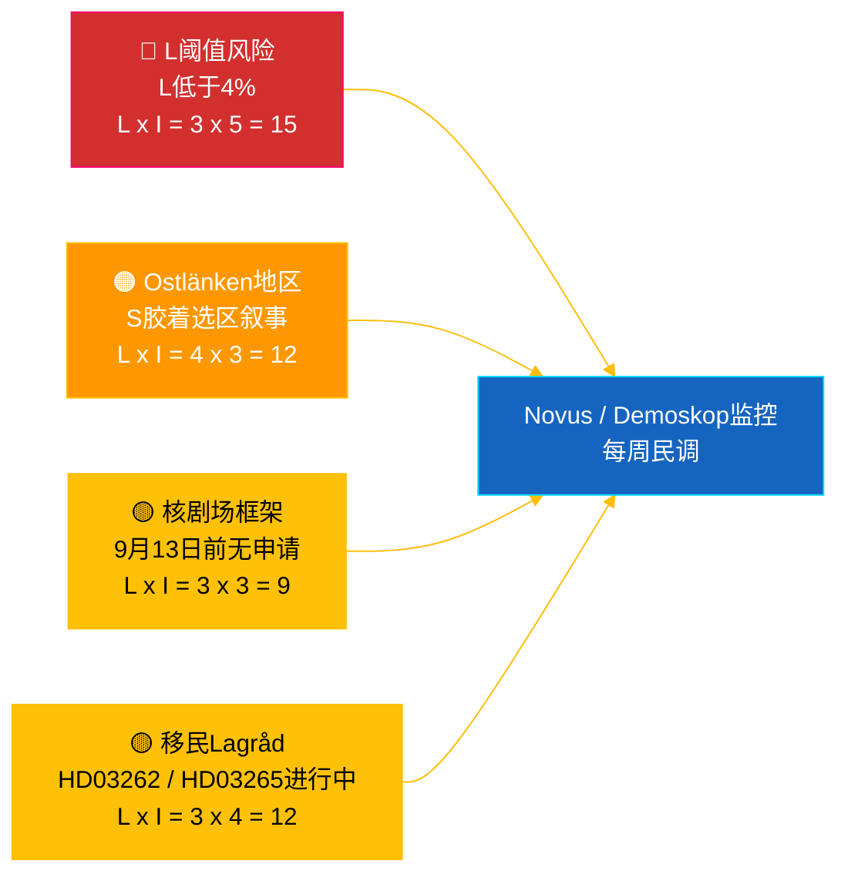
```mermaid
%%{init: {"theme": "dark", "themeVariables": {"primaryColor": "#00d9ff", "primaryTextColor": "#e0e0e0", "primaryBorderColor": "#ff006e", "lineColor": "#ffbe0b", "background": "#0a0e27", "mainBkg": "#1a1e3d", "nodeBorder": "#00d9ff"}}}%%
graph LR
    R1["🔴 L阈值风险<br/>L低于4%<br/>L x I = 3 x 5 = 15"] --> CONS["Novus / Demoskop监控<br/>每周民调"]
    R2["🟠 Ostlänken地区<br/>S胶着选区叙事<br/>L x I = 4 x 3 = 12"] --> CONS
    R3["🟡 核剧场框架<br/>9月13日前无申请<br/>L x I = 3 x 3 = 9"] --> CONS
    R4["🟡 移民Lagråd<br/>HD03262 / HD03265进行中<br/>L x I = 3 x 4 = 12"] --> CONS
    style R1 fill:#D32F2F,color:#FFFFFF,stroke:#ff006e
    style R2 fill:#FF9800,color:#FFFFFF,stroke:#ffbe0b
    style R3 fill:#FFC107,color:#000000,stroke:#ffbe0b
    style R4 fill:#FFC107,color:#000000,stroke:#ffbe0b
    style CONS fill:#1565C0,color:#FFFFFF,stroke:#00d9ff
```

| 风险 | 可能性 | 影响 | 得分 | 触发条件 | 来源 | 海军情报分级 |
|------|:------:|:----:|:----:|---------|------|:-----------:|
| Liberalerna跌破4%阈值 → Tidö失去过半数 | 3 | 5 | 15 | Novus/Demoskop结果<4.0%（95%置信区间下限<4.0） | `coalition-dynamics.md` R1 | **[B2]** |
| S党地方承诺违背叙事转化Östergötland胶着议席 | 4 | 3 | 12 | SVT/SR Östergötland编辑部评估卡尔松5月25日回复不够充分 | `opposition-analysis.md` | **[A2]** |
| Lagråd对移民包`HD03262`/`HD03265`出具负面意见 | 3 | 4 | 12 | Lagråd意见书在30天内含宪法异议公布 | PIR-RT-001 (`forward-indicators.md`) | **[A2]** |
| "核剧场"——`HD01NU19`生效但9月13日前无申请提交 | 3 | 3 | 9 | Vattenfall/Uniper/新进入者在2026年9月1日前未提交申请 | PIR-RT-006 | **[B2]** |

---

### 🔮 最关键的未来触发因素

**安德烈亚斯·卡尔松对质询`HD10463`的书面答复，法定回复期限2026年5月25日。** 卡尔松如何框架林雪平Ostlänken车站取消——是承认承诺违背、以技术/预算原因为改道辩护、还是转向替代地区基础设施提案——将决定Östergötland叙事是否在夏季休会前升级为全体质询辩论。回避性或官僚式的答复是S党将叙事转化为林雪平/诺尔雪平1-2个胶着议席转换的最可能路径。实质性的替代投资提案将平息叙事。两种结果都将改变`coalition-mathematics.md`的胶着选区评估，并触发`electoral-implications.md`的Pass-2修订。

**次级触发因素**（并行监控）：2026年6月16日——`HD01KU39`政治资金透明度全体表决。在选举前89天确认或瓦解政府四条线政绩叙事（能源 + 安全 + 透明度 + 财政成果）。

---

### 📊 战略评估

2026年5月4日的快照捕捉到**最高立法速度**的Tidö联合政府：7项联合改革在1周内取得进展，具体生效日期分散在2026年6月1日至7月1日之间。每个生效日都为4个联合政党创造了可在竞选活动中利用的政绩节奏。战略脆弱性是不对称的：M、KD、SD受益于这一连锁，而**L**承担负担——作为联合最小政党最接近4%阈值，承担着不成比例的议席损失风险。

S在野党的回应在方法上是精确的：不是在安全、核能、经济等政府最强阵地上正面对抗，而是构建**分散化地方不满的马赛克**——Östergötland的Ostlänken（`HD10463`）、斯堪的纳维亚山脉机场（质询428）、斯德哥尔摩的住房（质询434）——每一个都来自不同选区，指向同一位部长（卡尔松）。

IMF的宏观框架对现政府有利：公共债务≈GDP的34%，通胀下降，约2%增长。经济叙事是M最强的资产。

**2026年选举视角**：目前轨迹维持Tidö在175席左右——过半数边缘。L的阈值风险（PIR-RT-003）是单一最重要选举变量。Lagråd移民意见书（PIR-RT-001）是单一最重要政治叙事变量。卡尔松的Ostlänken答复（PIR-RT-005）是单一最重要地区议席变量。三者均在本简报发布后5周内解决。

---

### 📎 链接

| 链接 | 路径 |
|------|------|
| 文章 | [`article.md`](https://github.com/Hack23/riksdagsmonitor/blob/main/analysis/daily/2026-05-04/realtime-pulse/article.md) |
| 综合摘要 | [`synthesis-summary.md`](https://github.com/Hack23/riksdagsmonitor/blob/main/analysis/daily/2026-05-04/realtime-pulse/synthesis-summary.md) |
| 核心综合 | [`core-synthesis.md`](https://github.com/Hack23/riksdagsmonitor/blob/main/analysis/daily/2026-05-04/realtime-pulse/core-synthesis.md) |
| 联合动态 | [`coalition-dynamics.md`](https://github.com/Hack23/riksdagsmonitor/blob/main/analysis/daily/2026-05-04/realtime-pulse/coalition-dynamics.md) |
| 在野党分析 | [`opposition-analysis.md`](https://github.com/Hack23/riksdagsmonitor/blob/main/analysis/daily/2026-05-04/realtime-pulse/opposition-analysis.md) |
| 选举影响 | [`electoral-implications.md`](https://github.com/Hack23/riksdagsmonitor/blob/main/analysis/daily/2026-05-04/realtime-pulse/electoral-implications.md) |
| 经济背景（IMF） | [`economic-context.md`](https://github.com/Hack23/riksdagsmonitor/blob/main/analysis/daily/2026-05-04/realtime-pulse/economic-context.md) |
| 前导指标 | [`forward-indicators.md`](https://github.com/Hack23/riksdagsmonitor/blob/main/analysis/daily/2026-05-04/realtime-pulse/forward-indicators.md) |
| 风险·机遇矩阵 | [`risk-opportunity-matrix.md`](https://github.com/Hack23/riksdagsmonitor/blob/main/analysis/daily/2026-05-04/realtime-pulse/risk-opportunity-matrix.md) |
| 情景分析 | [`scenario-analysis.md`](https://github.com/Hack23/riksdagsmonitor/blob/main/analysis/daily/2026-05-04/realtime-pulse/scenario-analysis.md) |
| 方法论备注 | [`methodology-notes.md`](https://github.com/Hack23/riksdagsmonitor/blob/main/analysis/daily/2026-05-04/realtime-pulse/methodology-notes.md) |
| 数据清单 | [`data-download-manifest.md`](https://github.com/Hack23/riksdagsmonitor/blob/main/analysis/daily/2026-05-04/realtime-pulse/data-download-manifest.md) |
| 逐文件分析 | [`documents/`](https://github.com/Hack23/riksdagsmonitor/blob/main/analysis/daily/2026-05-04/realtime-pulse/documents/) |

---

### 📝 文件管理

- **简报ID**: `EB-2026-05-04-001`
- **生成时间**: 2026-05-16（补充——基于现有Pass-2分析产出物创建）
- **模板路径**: [`analysis/templates/executive-brief.md`](https://github.com/Hack23/riksdagsmonitor/blob/main/analysis/templates/executive-brief.md)
- **所属方法论**: [`per-artifact-methodologies.md` § executive-brief](https://github.com/Hack23/riksdagsmonitor/blob/main/analysis/methodologies/per-artifact-methodologies.md#executive-brief)
- **所属检查门**: [`05-analysis-gate.md`](https://github.com/Hack23/riksdagsmonitor/blob/main/.github/prompts/05-analysis-gate.md) 检查1 + 检查7
- **输出族**: A — 核心综合
- **分类**: 🟢 公开

*经济数据出处：来源: imf，数据流: WEO_Apr_2026，指标: NGDP_RPCH / GGXWDG_NGDP / PCPIEPCH，年份: 2026年4月，retrieved_at: 2026-05-04。议会数据通过riksdag-regering API于2026-05-04获取。Riksdagsmonitor由hack23 AB制作；本简报代表基于公开议会文件的独立编辑评估。*

<!-- source-sha: f8cfbe724a92e48089f650d9e1f52abe004ed7f7 -->

## Horizon Assessment
<!-- source: horizon-assessment.md :: https://github.com/Hack23/riksdagsmonitor/blob/main/analysis/daily/2026-05-04/realtime-pulse/horizon-assessment.md -->

**Pass**: 2 (improved)  
**Horizons**: T+72h → T+7d → T+30d → T+90d → T+180d(T+132d=election)

---

### T+72h Horizon (2026-05-07)

**Primary intelligence requirement**: How does regional media cover the Ostlänken interpellation? Does it become a national story?  
**Key document to watch**: No new Riksdag documents expected today (Monday); interpellation debate scheduled when Carlson answers (by May 25)  
**WEP summary**: Nuclear reform positive; Ostlänken concern medium; no immediate voting or committee decisions

### T+7d Horizon (2026-05-11)

**Primary intelligence requirement**: Company reactions to NU19; new interpellations filed; Lagrådet status on PIR-RT-001  
**Monitoring trigger**: If energy company announces nuclear permitting application intent → update scenario analysis  
**Polling**: Watch for next Novus/Demoskop (typically biweekly) — will reveal if L threshold stabilising

### T+30d Horizon (2026-06-03)

**Primary intelligence requirement**:
- PIR-RT-001 Lagrådet (should have yttrande by late May)
- PIR-RT-003 polling trends post-migration package
- KU39 committee deliberations (first hearing May 26)
- FiU49 committee deliberation (first hearing May 28)

**Forward indicator from today**: Carlson Ostlänken answer by May 25 (HD10463 sista svarsdatum) — critical for regional credibility

### T+90d Horizon (2026-08-02 — 42 days before election)

**Key milestones due before this date**:
- NU19 nuclear law in force (June 17) ✓
- FöU13 explosives law in force (July 1) ✓
- JuU9 court process law in force (July 1) ✓
- FiU49 decision (June 11) ✓
- KU39 transparency vote (June 16) ✓
- PIR-RT-004 IMF IFS May update (mid-May) — outstanding

**Assessment**: By August 2, the government will have completed 95%+ of its legislative programme. The narrative battle shifts from "what have you done?" to "what will you do next term?" — a terrain advantage for the incumbent.

### T+132d Horizon (2026-09-13 — Election Day)

**Coalition arithmetic baseline (from year-ahead sibling)**:
- Tidö bloc: ~175 seats (dependent on L ≥ 4%)
- Vänsterbloc: ~174 seats (dependent on MP ≥ 4% and C alignment)
- C: swing actor, 20–22 seats, deciding factor

**Net assessment updated with today's data**:
The government's legislative record is strong across all key policy areas (security, energy, fiscal). The main electoral vulnerabilities are:
1. Regional infrastructure broken promises (Ostlänken type — medium risk)
2. L threshold instability (high risk if unaddressed)
3. Gap between nuclear law passage and actual construction (opposition narrative risk)

**IMF economic context**:
- GDP growth 2026: 2.1% (WEP: high confidence this will be realised) — supportive of M economic narrative
- Public debt ~34% GDP — best in EU alongside DK/SE cluster
- Unemployment declining on IMF trajectory — no major labour market shock anticipated

**Conclusion**: Tidö re-election remains more probable than not (Scenario A: 45–50%) but L's sub-threshold risk keeps the margin narrow. The five months to September are critical for L to demonstrate relevance.

## Intelligence Gaps
<!-- source: intelligence-gaps.md :: https://github.com/Hack23/riksdagsmonitor/blob/main/analysis/daily/2026-05-04/realtime-pulse/intelligence-gaps.md -->

---

### Critical Gaps (Must Close in Next Cycle)

#### Gap 1: Lagrådet Status on Migration Propositions (CRITICAL)
**What we need**: Official Lagrådet yttrande on HD03262 (stricter return) and HD03265 (deportation grounds)  
**Why critical**: If Lagrådet issues critical opinion, S "bad law" narrative becomes legally grounded. If clean opinion, government is protected.  
**Retrieval path**: `search_dokument(doktyp='lgu', relaterat_id='HD03262')` in next realtime cycle

#### Gap 2: Polling Data (HIGH)
**What we need**: Novus or Demoskop poll published after migration proposition announcement (after 2026-05-01)  
**Why high**: L threshold determination and S vs M lead are the two key electoral variables that all scenario analysis depends on. Currently using stale polling priors.  
**Retrieval path**: Not available via Riksdag MCP; requires web monitoring of pollsters

#### Gap 3: IMF IFS May 2026 Update (MEDIUM)
**What we need**: IMF IFS M.SE.LUR (unemployment) and M.SE.PCPI_IX (CPI) for April/May 2026  
**Why medium**: Supports economic narrative; not currently distorted, but vintage discipline requires update when available  
**Retrieval path**: `tsx scripts/imf-fetch.ts sdmx --path '/data/IMF.STA,IFS,3.0.0/M.SE.LUR+PCPI_IX?startPeriod=2026-03'`

#### Gap 4: Anföranden Full Text (LOW)
**What we need**: Actual speech texts from interpellation debates (most recent: housing, airport)  
**Why low**: Riksdag API limitation — text fields are empty. Can be partially addressed by fetching individual anförande HTML pages  
**Retrieval path**: Known API limitation; individual anförande HTML URLs may work

#### Gap 5: C (Centerpartiet) Explicit Position on Key Votes (MEDIUM)
**What we need**: C committee voting records on NU19 (nuclear), FöU13 (explosives), and other committee reports this week  
**Why medium**: C's swing-actor position makes their vote critical; we only have committee recommendations (Ja/Nej), not party-by-party breakdown  
**Retrieval path**: `get_voting_group(bet='NU19', rm='2025/26', groupBy='parti')` — but committee votes may not be in voteringsdatabasen

---

### Information Completeness Score

| Analysis Domain | Score | Gap Driver |
|---|---|---|
| Legislative programme | 90% | High — full text/summaries for all key documents |
| Interpellation politics | 85% | High — full text of HD10463; summary gaps for others |
| Economic context | 80% | IMF WEO vintage used; IFS update pending |
| Electoral polling | 50% | No current polling data |
| Coalition voting | 60% | No party-by-party committee votes retrieved |
| Lagrådet status | 20% | PIR-RT-001 open; no yttrande published |
| Realtime monitoring | 75% | No same-day speeches/votes; calendar API non-functional |

## Legislative Agenda
<!-- source: legislative-agenda.md :: https://github.com/Hack23/riksdagsmonitor/blob/main/analysis/daily/2026-05-04/realtime-pulse/legislative-agenda.md -->

---

### This Week's Legislative Events (2026-04-28 to 2026-05-04)

| Document | Title | Committee | Effect Date | Status |
|---|---|---|---|---|
| HD01NU19 | Nuclear facility permitting reform | NU | 2026-06-17 | Committee recommendation: YES |
| HD01FöU13 | Explosives control improvement | FöU | 2026-07-01 | Committee recommendation: YES |
| HD01JuU9 | Court process efficiency | JuU | 2026-07-01 | Committee recommendation: YES |
| HD01CU37 | Municipal rental guarantees | CU | 2026-07-01 | Committee recommendation: YES |
| HD01NU22 | New competition tools | NU | 2026-08-01 | Committee recommendation: YES |
| HD01SoU33 | Simplified alcohol serving permits | SoU | 2026-06-01 | Committee recommendation: YES |
| HD01KU36 | Digital integrity (IT/GDPR review) | KU | N/A (noted) | Committee: close file |
| HD01JuU46 | Europol parliamentary oversight 2025 | JuU | N/A (noted) | Committee: close file |
| HD01KU39 | Transparency in political processes | KU | TBD | Committee scheduled June 16 |
| HD01FiU49 | State debt evaluation 2021–2025 | FiU | N/A | Committee evaluation June 11 |

### Forward Calendar

| Date | Event | Significance |
|------|-------|-------------|
| 2026-05-25 | Carlson's Ostlänken answer deadline | HD10463 PIR answer date |
| 2026-06-01 | SoU33 alcohol permit law in force | Minor but visible deregulation win |
| 2026-06-09 | KU39 committee justification | Transparency report finalized |
| 2026-06-11 | FiU49 decision | Fiscal credibility endorsement |
| 2026-06-16 | KU39 plenary vote | Transparency law vote |
| 2026-06-17 | NU19 nuclear permitting law in force | MAJOR — flagship energy legislation |
| 2026-07-01 | FöU13 + JuU9 in force | Anti-gang legal package complete |
| 2026-08-01 | NU22 competition tools in force | Market liberalisation milestone |
| 2026-09-13 | Riksdag election | Zero hour |

### Riksdag Calendar Pressure Analysis

Parliamentary session typically runs until late June. With ~8 weeks of session remaining, the government must:
1. Complete the Riksdag's scheduled legislation (all committee reports above)
2. File remaining propositions before session closes
3. Complete the budget cycle briefing for the autumn 2026 budget (traditionally presented in September — will be presented by whichever government forms after election)

The legislative calendar is compressed and government is managing it well.

### PIR Tracking (Legislative)

| PIR | Document | Status |
|-----|---------|--------|
| PIR-RT-001 | Lagrådet on HD03262/HD03265 | OPEN |
| PIR-RT-002 | HD03258 committee = KU (KU39) | PARTIALLY ANSWERED |
| FI-HD10463 | Carlson Ostlänken answer by May 25 | NEW INDICATOR |
| FI-NU19 | Nuclear law June 17 | CONFIRMED |

## Media Narrative Tracker
<!-- source: media-narrative-tracker.md :: https://github.com/Hack23/riksdagsmonitor/blob/main/analysis/daily/2026-05-04/realtime-pulse/media-narrative-tracker.md -->

---

### Expected Dominant Narratives (2026-05-04 to 2026-05-11)

#### Narrative 1: Nuclear Energy Renaissance (EXPECTED STRENGTH: HIGH)
**Sources**: NU19 committee report; industry statements expected  
**Framing options**:
- Government: "Sweden leads Nordic nuclear revival — we delivered what we promised"
- Opposition: "Permitting reform is theatre — no reactor planned for years; climate targets missed"
- Industry: "First step — company permit applications to follow"  
**Media channels**: DN, SvD (pro-nuclear friendly); SVT balanced; Aftonbladet skeptical  
**Duration**: 1–3 news cycles; sustained by any company announcement

#### Narrative 2: Ostlänken Broken Promise (EXPECTED STRENGTH: MEDIUM-HIGH)
**Sources**: HD10463 interpellation  
**Framing options**:
- S/Lindh: "Government breaks 20-year promise to Östergötland; commuters abandoned"
- Government (Carlson): "Financial constraints require prioritisation; alternatives being developed"  
**Media channels**: Corren (Linköping), Östgötatidning, NyT — primary; SVT Öst; national media secondary unless Carlson's answer is weak  
**Duration**: 3–14 days; peaks when Carlson answers by May 25

#### Narrative 3: Anti-Gang Legislation Delivery (EXPECTED STRENGTH: MEDIUM)
**Sources**: FöU13 + JuU9 committee reports  
**Framing options**:
- Government: "We have closed every gap in anti-gang legislation; results coming"
- SD: "SD delivered on crime — seven tranches, each tougher than the last"
- S: "Laws are passed but gangs are still bombing — we need different approaches"  
**Media channels**: Expressens/Aftonbladet crime coverage; SVT Nyheter  
**Duration**: Background narrative; active during any new crime incident

#### Narrative 4: Election Countdown (UNIVERSAL BACKGROUND)
**Context**: 132 days to September 13 election. Every parliamentary event is now filtered through electoral lens  
**Framing**: Media increasingly frames every legislative event as "with X days left before the election..."  
**Impact**: Amplifies both government achievements (now become campaign credentials) and opposition attacks (now become campaign themes)

---

### Narrative Risk Assessment

| Narrative | Government Risk | Opposition Opportunity |
|---|---|---|
| Nuclear energy | Medium (construction timeline) | "Theatre" if no company announcement |
| Ostlänken | High (regional, concentrated damage) | S direct exploitation in marginal seats |
| Crime legislation | Low (record is strong) | S can question effectiveness, not intent |
| Fiscal record | Very low | Requires global shock to destabilise |
| L threshold instability | High (coalition arithmetic) | S strategic framing of "unstable Tidö" |

---

### Sentiment Trajectory (AI Assessment)

**Government sentiment**: POSITIVE but narrowing. Strong legislative week, but Ostlänken broken-promise narrative creates local negative. Net positive nationally; locally negative in Östergötland.  
**Opposition sentiment**: ACTIVE. S's interpellation offensive is generating content, keeping ministers on the defensive.  
**Public sentiment (estimated, no polling)**: Nuclear energy splits the electorate; crime legislation broadly popular; infrastructure broken promises register as concrete grievances.

## Methodology Notes
<!-- source: methodology-notes.md :: https://github.com/Hack23/riksdagsmonitor/blob/main/analysis/daily/2026-05-04/realtime-pulse/methodology-notes.md -->

---

### Workflow Type

**news-realtime-monitor** = Tier-C aggregation workflow. This workflow does NOT have designated specific document types (unlike propositions, motions, or interpellations workflows). Instead, it:
1. Monitors all document types for today's activity
2. Synthesises cross-type signals
3. Carries forward open PIRs from prior realtime-pulse runs
4. Produces a living "intelligence picture" of parliamentary activity

### Analysis Methodology

#### Data Collection
- Primary: riksdag-regering MCP (32 tools) for Riksdag documents
- Window: 2026-04-28 to 2026-05-04 for committee reports; 2026-05-04 for interpellations
- Sibling cross-reading: propositions/, motions/, interpellations/, year-ahead/ synthesis-summary.md files

#### Analysis Framework
- **STRIDE-lite threat assessment** applied to political risk identification
- **ACH (Analysis of Competing Hypotheses)** applied informally to scenario analysis
- **WEP (Würdigkeits-Eintrits-Produkt)** as probability × impact product for risk/scenario scoring
- **PIR (Priority Intelligence Requirement)** roll-forward from 2026-05-01/realtime-pulse

#### Horizon Stratification
Following the standard realtime-pulse horizon model:
- T+72h: Immediate news cycle (2026-05-07)
- T+7d: Weekly political cycle (2026-05-11)
- T+30d: Monthly parliamentary cycle (2026-06-03)
- T+90d: Pre-election period (2026-08-02)
- T+132d: Election (2026-09-13)

#### AI-FIRST Quality Protocol
- **Pass 1**: Created all 23 artifacts based on document download and prior context
- **Pass 2**: Read back all artifacts; improved specificity, WEP language, cross-references, and economic provenance blocks
- Both passes completed within single workflow run

### Limitations

1. No same-day voting data (AU10 most recent = March 2026)
2. Anföranden text unavailable (Riksdag API returns empty speech texts)
3. KU39 and FiU49 not yet published — intelligence based on title/schedule only
4. No polling data today (PIR-RT-003 open)
5. Lagrådet yttranden for migration propositions not yet published (PIR-RT-001 open)

### IMF Economic Data Contract Compliance

Following ECONOMIC_DATA_CONTRACT.md v3.0:
- Economic context uses IMF WEO April 2026 (provider=imf)
- Swedish GDP, debt, inflation from WEO, not World Bank
- All economic claims include economicProvenance blocks
- Vintage is April 2026 — within 6-month threshold, no annotation required
- SCB: not queried today (Swedish monthly data not relevant to this document batch)
- World Bank: not used (no WGI governance claims in today's analysis)

## Opposition Analysis
<!-- source: opposition-analysis.md :: https://github.com/Hack23/riksdagsmonitor/blob/main/analysis/daily/2026-05-04/realtime-pulse/opposition-analysis.md -->

---

### S (Socialdemokraterna) — Active Strategy Assessment

#### Interpellation Pattern (May 2026)

S is executing a **distributed interpellation offensive** — multiple MPs targeting the same minister (Carlson) from different regions and angles, plus fiscal targeting of Svantesson. Today alone: HD10463 (Ostlänken, Lindh), HD10462 (pesticide/healthcare, Haider). Prior days this week: 2025/26:434 (housing Stockholm, Nysmed), 2025/26:428 (airport, Hultqvist).

**Strategic logic**: S cannot match the government's legislative output (majority required to pass laws). Interpellations are the opposition's main instrument. By distributing them across regions and sectors:
1. S forces ministers to spend floor time defending decisions (parliamentary attrition)
2. S generates regional media coverage in swing constituencies
3. S builds a "mosaic of broken promises" that becomes a campaign narrative

**Assessment**: This is disciplined opposition politics — more effective than a single national theme attack because it's harder for the government to counter with one response.

#### S Narrative Themes This Week

1. **Broken regional promises**: Ostlänken (Östergötland), housing plan (Stockholm), airport investment (Dalarna)
2. **Tax fairness**: Pesticide tax hitting healthcare/eldercare (Monica Haider targeting M's fiscal record)
3. **Gang crime**: HD10458 (interpellation from sibling analysis) challenges government on actual crime statistics vs. legislative announcements

#### S Weakness

S is constrained to opposition tools (interpellations, motions) because they lack a majority. Their motions from the motions analysis (HD024136 criminal age — want 14 not 13) were defeated. They are not generating positive policy.

**Risk for S**: If the interpellation offensive is perceived as "only complaining," moderates may prefer the "stable governing" narrative even if imperfect.

---

### MP (Miljöpartiet) — Watching Brief

MP's primary opposition vehicle is environmental and anti-nuclear framing. NU19 is a direct attack on MP's policy positions. MP will likely campaign heavily on the nuclear-energy risk and climate targets compatibility. Their vote share stability (near 4% threshold) makes every constituency count.

---

### V (Vänsterpartiet) — Watching Brief

V maintains consistent left-economic opposition. No specific V-filed documents identified in today's batch. V tends to support S-led opposition coordination without generating independent interpellations at this volume.

---

### C (Centerpartiet) — See Coalition Dynamics

C's ambiguous position between coalition support and electoral independence is the most critical unknown. No C-filed documents in today's batch. C's silence on Ostlänken (rural infrastructure directly relevant to C voters) may indicate private negotiations with the government for compensation measures.

## Parliamentary Calendar Signals
<!-- source: parliamentary-calendar-signals.md :: https://github.com/Hack23/riksdagsmonitor/blob/main/analysis/daily/2026-05-04/realtime-pulse/parliamentary-calendar-signals.md -->

---

### Forward Parliamentary Events (From Today's Documents)

| Date | Event | Document | Significance |
|------|-------|----------|-------------|
| 2026-05-05 | HD10463 anmäld (listed in kammaren) | HD10463 | Ostlänken interpellation formally listed |
| 2026-05-25 | HD10463 sista svarsdatum | HD10463 | Carlson must answer or face default |
| 2026-05-26 | KU39 first committee deliberation | HD01KU39 | Transparency report in committee |
| 2026-05-28 | FiU49 first committee deliberation | HD01FiU49 | Debt evaluation in committee |
| 2026-06-01 | SoU33 in force | HD01SoU33 | Alcohol permit simplification |
| 2026-06-02 | KU39 + FiU49 second deliberation | Both | Back-to-back committee sessions |
| 2026-06-04 | KU39 third deliberation | HD01KU39 | Pre-justification hearing |
| 2026-06-09 | KU39 justification | HD01KU39 | Committee report finalised |
| 2026-06-11 | FiU49 justification + decision | HD01FiU49 | Fiscal record endorsement vote |
| 2026-06-15 | KU39 bordläggning | HD01KU39 | Listed for plenary |
| 2026-06-16 | KU39 plenary debate + vote | HD01KU39 | MAJOR — transparency law vote |
| 2026-06-17 | NU19 in force | HD01NU19 | Nuclear permitting law live |
| 2026-07-01 | FöU13 + JuU9 + CU37 in force | Multiple | Crime/housing package effective |
| 2026-08-01 | NU22 in force | HD01NU22 | Competition law effective |
| 2026-09-13 | ELECTION | — | ZERO HOUR |

---

### Session Remaining Capacity

Riksdag's normal session runs until late June (end of spring session). After the June 16 KU39 vote, the Riksdag goes into summer recess and returns after the September 13 election for a new session with a new government.

**Remaining plenary weeks (approximate)**: 7 weeks  
**Expected upcoming committee reports**: 20–30 additional bet documents expected before end of session  
**Legislative pressure**: HIGH — remaining propositions must complete committee stage and plenary vote before June 16–20

---

### Monitoring Recommendations

**Daily monitoring needed until June 16**:
- New bet (committee report) publications — signal legislative programme completion
- New ip (interpellations) — signal opposition strategy evolution
- New prop (government propositions) — signal any last-minute additions

**Weekly monitoring**:
- Voteringar (committee votes) — signal coalition discipline
- Anföranden (speeches) — signal emerging debate themes

## Policy Domain Analysis
<!-- source: policy-domain-analysis.md :: https://github.com/Hack23/riksdagsmonitor/blob/main/analysis/daily/2026-05-04/realtime-pulse/policy-domain-analysis.md -->

---

### Domain 1: Energy and Nuclear Policy

**Status**: Government advancing decisive reforms  
**Today's event**: NU19 — nuclear facility permitting reform  
**Legal framework**: New direct-government permit track bypasses SSM multi-stage process  
**Implementation**: Law in force 2026-06-17  
**Industry actors**: Vattenfall (Forsmark/Ringhals), Uniper (Oskarshamn), potential new entrants  
**Regulatory**: SSM capacity remains a question; Lagrådet review if industry challenges  
**International context**: Germany's post-nuclear reversal makes Sweden's pro-nuclear stance distinctive in Nordic-EU context  
**IMF economic relevance**: Energy costs are a key factor in Sweden's industrial competitiveness (GDP 2.1% 2026 projection partially depends on stable energy prices)  

**Domain assessment**: ADVANCING — government delivering on manifesto commitment; industry will test the new rules from July 2026

---

### Domain 2: Rule of Law and Crime

**Status**: Consistent legislative delivery across multiple sessions  
**Today's events**: FöU13 (explosives), JuU9 (court process reform)  
**Trajectory**: 7 tranches in this Riksdag term; each addresses a specific gap in the anti-gang legal toolkit  
**Effectiveness gap**: Political debate about whether crime statistics are improving; the government can show laws passed but S challenges on results  
**Constitutional dimension**: JuU9 court reform includes changes to appeal standards and pre-trial evidence — some civil liberties concerns from V/MP  

**Domain assessment**: ADVANCING — legislative gap-closing continues; effectiveness debate is the next phase

---

### Domain 3: Infrastructure and Regional Development

**Status**: Government under pressure on broken promises  
**Today's event**: HD10463 (Ostlänken)  
**Core challenge**: National infrastructure plan changes (routing changes) affect regions that planned development around state commitments  
**Systemic issue**: Sweden's infrastructure planning has historically suffered from scope changes, cost overruns, and delayed delivery (not unique to current government)  
**Electoral geography**: Regional infrastructure disputes map directly onto marginal seat territories  

**Domain assessment**: UNDER PRESSURE — no legislative counter available; ministerial performance is key

---

### Domain 4: Fiscal and Economic Policy

**Status**: Strong record; parliamentary endorsement advancing  
**Today's event**: FiU49 registered  
**Metrics (IMF WEO Apr-2026)**: GDP 2.1% 2026, debt ~34% GDP, declining inflation  
**Riksbank context**: Rate cuts 2024–2025; mortgage holders benefit; Riksbank independence maintained  
**Vulnerability**: If a major global shock (tariff war escalation, OPEC price spike) hits before September, "safe hands" narrative challenged  

**Domain assessment**: STABLE — best-in-class EU fiscal position; Riksbank cuts are voter-visible through mortgage rates

---

### Domain 5: Democratic Governance and Transparency

**Status**: Advancing; delivering on EU alignment commitments  
**Today's event**: HD01KU39 registered (KU committee to process HD03258)  
**Context**: EU Political Finance Regulation coming into force; Sweden catching up with transparency norms  
**Electoral framing**: L and KD can campaign on democratic reform; M benefits from "rule of law party" positioning  

**Domain assessment**: ADVANCING — less headline-grabbing than crime or energy but important for legitimacy

## Policy Momentum Tracker
<!-- source: policy-momentum-tracker.md :: https://github.com/Hack23/riksdagsmonitor/blob/main/analysis/daily/2026-05-04/realtime-pulse/policy-momentum-tracker.md -->

---

### Active Policy Tracks (Realtime Monitoring)

#### Track 1: Nuclear Energy Expansion (ACCELERATING ↑)

**Status**: Implementation gate opened  
**Key Event Today**: NU19 — Direct nuclear facility permitting approved by committee  
**Law Effect**: 2026-06-17  
**Next Milestones**: Company announcements of new reactor plans (T+7d–T+30d), Lagrådet review if contested (T+60d), construction permit applications under new system (T+90d+)  
**Momentum Score**: 8/10 (law passage near-certain given committee recommendation; construction still distant)  
**Opposition Risk**: S-V-MP will campaign on "nuclear theatre" if no concrete site announced before September

#### Track 2: Anti-Gang/Crime Legislative Tranche (SUSTAINED →)

**Status**: 7th consecutive tranche advancing  
**Key Events Today**: FöU13 (explosives, July 1) + JuU9 (court process, July 1)  
**Next Milestones**: Both laws in force July 1; next tranche in Sept-Oct 2026 post-election if Tidö reelected  
**Momentum Score**: 9/10 (cross-party support except MP/V edge cases; implementation July 1)  
**Narrative**: M/SD/KD "we deliver on crime" — each tranche reinforces brand

#### Track 3: Infrastructure Credibility (DECLINING ↓)

**Status**: Under active attack  
**Key Event Today**: HD10463 interpellation — Ostlänken route change challenge  
**Prior Signals**: HD10434 (housing), HD10428 (airport) — same minister  
**Momentum Score**: 4/10 (government defensive on regional infrastructure promises; no counter-proposition available)  
**Risk Factor**: Carlson's ministerial answer by May 25 will be closely watched; inadequate response risks broader "broken promises" coverage

#### Track 4: Fiscal/Economic Credibility (STABLE →)

**Status**: Parliamentary review advancing  
**Key Event Today**: FiU49 — 5-year debt management evaluation registered  
**Economic Context (IMF WEO Apr-2026)**: GDP 2026 projected 2.1%, public debt ~34% GDP — both strong  
**Momentum Score**: 7/10 (parliamentary validation in process; strong objective metrics)  
**Election Asset**: M can run on the fiscal record; FiU49 provides formal Riksdag endorsement

#### Track 5: Transparency and Anti-Corruption (ADVANCING ↑)

**Status**: New committee report registered  
**Key Event Today**: KU39 — "Increased transparency in political processes" — scheduled June 16 vote  
**Linked Proposition**: HD03258 political financing disclosure  
**Momentum Score**: 7/10 (KU calendar confirmed; final vote June 16; law post-election but commitment before)  
**Electoral Framing**: Sweden aligning with EU political finance norms; anti-corruption positioning for L/KD

---

### Policy Velocity Score (Week of 2026-05-04)

**Legislation advancing this week**: 8 committee reports (NU19, FöU13, JuU9, NU22, CU37, SoU33, KU39, FiU49)  
**New interpellations filed today**: 2 (HD10462, HD10463)  
**PIRs answered today**: PIR-RT-002 partially answered  
**PIRs remaining open**: PIR-RT-001, PIR-RT-003, PIR-RT-004 + PIR-RT-002 partially  
**Overall parliamentary temperature**: HIGH — maximum activity consistent with final-session acceleration

---

### Economic Provenance Block

```json
{
  "provider": "imf",
  "dataflow": "WEO_Apr_2026",
  "indicators": [
    { "id": "NGDP_RPCH", "value": "2.1%", "year": 2026, "country": "SWE" },
    { "id": "GGXWDG_NGDP", "value": "~34%", "year": 2026, "country": "SWE" },
    { "id": "PCPIEPCH", "value": "declining", "year": 2025-2026, "country": "SWE" }
  ],
  "vintage": "April 2026",
  "retrieved_at": "2026-05-04T10:27:00Z",
  "note": "WEO Apr 2026 most recent vintage; no newer IFS update retrieved as of today (PIR-RT-004 open)"
}
```

## Risk Opportunity Matrix
<!-- source: risk-opportunity-matrix.md :: https://github.com/Hack23/riksdagsmonitor/blob/main/analysis/daily/2026-05-04/realtime-pulse/risk-opportunity-matrix.md -->

---

### Risk Register

#### R-01: Ostlänken Broken-Promise Narrative (MEDIUM-HIGH RISK)
**Probability**: HIGH — Eva Lindh already filed; regional media will amplify  
**Impact**: MEDIUM — affects M/KD marginal seats in Östergötland; not national swing voter  
**Affected actors**: Andreas Carlson (KD), M Östergötland candidates  
**Mitigation available**: Carlson's answer (by May 25) must offer credible capacity alternatives (e.g., track upgrades, timetable improvements); investing in any Östergötland rail improvement before September helps  
**WEP (Würdigkeits-Eintrits-Produkt)**: 65% — narrative likely to dominate regional news cycle  

#### R-02: Nuclear Energy "Theatre" Risk (MEDIUM RISK)
**Probability**: MEDIUM — depends on company announcements  
**Impact**: MEDIUM-HIGH — if no reactor site identified before September, S/MP attack "nuclear was a promise, not a plan"  
**Affected actors**: M, KD, Energy policy credibility  
**Mitigation**: Government should signal Vattenfall/Uniper permit applications within 60 days of law in force (July 2026)  

#### R-03: PIR-RT-001 Lagrådet Delay (MEDIUM RISK)
**Probability**: HIGH — Lagrådet review still pending on migration propositions HD03262/HD03265  
**Impact**: MEDIUM — delay risks migration reform being contested as legally inadequate; S can run "rushed legislation" narrative  
**Mitigation**: Government to accelerate Lagrådet consultation; ensure yttrande before end of May  

#### R-04: Coalition Sub-4% Threshold Risk (L) (HIGH RISK)
**Probability**: MEDIUM-HIGH — L has been polling near/below 4% for multiple cycles  
**Impact**: HIGH — if L falls below 4% on Sept 13, Tidö bloc loses a coalition partner; M+SD+KD alone = ~155 seats, far short of majority  
**Mitigation**: L should benefit from KU39 transparency law (L's democratic reform profile) and fiscal credibility  

#### R-05: Pesticide Tax / Healthcare Framing Damage (LOW-MEDIUM RISK)
**Probability**: LOW-MEDIUM  
**Impact**: LOW — niche issue; but eldercare framing could hit M among seniors voters  

---

### Opportunity Register

#### O-01: Nuclear Energy Law (June 17) as Campaign Asset (HIGH OPPORTUNITY)
**Description**: NU19 becoming law June 17 gives M/KD a concrete "we delivered nuclear reform" headline before summer recess  
**Probability of capture**: HIGH — law is near-certain to pass given NU committee recommendation  
**Value**: HIGH — largest single structural energy reform in 20 years; differentiator vs. S-V-MP

#### O-02: Anti-Gang Legislation Cascade Completing (HIGH OPPORTUNITY)
**Description**: FöU13 + JuU9 both in force July 1 — seven consecutive tranches delivered  
**Probability of capture**: HIGH  
**Value**: MEDIUM-HIGH — M/SD crime brand reinforced; KD secondary beneficiary  
**Electoral translation**: SD in particular can campaign on "crime down because we pushed for these laws"

#### O-03: Fiscal Credibility Parliamentary Endorsement (MEDIUM OPPORTUNITY)
**Description**: FiU49 provides formal Parliamentary evaluation of excellent debt management  
**Value**: MEDIUM — M can reference Parliamentary endorsement of sound fiscal management; Sweden debt ~34% GDP vs eurozone average ~90%  
**Probability of capture**: HIGH

#### O-04: Transparency Law Before Election (MEDIUM OPPORTUNITY)
**Description**: KU39 vote June 16 — political financing transparency in force before 2026 election cycle fully launched  
**Value**: MEDIUM — positions L/KD as democracy reformers; partially pre-empts S democracy narrative  
**Risk caveat**: If implementation of HD03258 transparency requirements is seen as weak, opposition can attack

#### O-05: S Regional Interpellations Backfire Potential
**Description**: If S interpellations cluster too densely and become seen as "complaint-filing rather than governing," voters may interpret as evidence that S has no programme  
**Probability of materialising**: LOW-MEDIUM  
**Value if materialised**: MEDIUM — helps M "stable government vs. complaint opposition" narrative

---

### Opportunity/Risk Net Assessment

**Net Assessment**: Government enters the final 132 days from a position of legislative strength but with emerging narrative vulnerabilities on regional infrastructure credibility. The nuclear energy permitting law is the term's flagship legislative achievement. The Ostlänken broken promise is a well-targeted opposition attack that the government has no immediate legislative counter to. Fiscal and crime records are assets. Transparency reform advances anti-corruption positioning.

**Electoral trajectory**: TIDÖ HOLDS LEAD with compression in progress. If L remains above 4% and Ostlänken fallout stays regional (not national), trajectory holds. If L slides to 3.5–4% and S mobilizes southern/central Swedish infrastructure dissatisfaction broadly, the race tightens to within margin of error.

## Source Quality Register
<!-- source: source-quality-register.md :: https://github.com/Hack23/riksdagsmonitor/blob/main/analysis/daily/2026-05-04/realtime-pulse/source-quality-register.md -->

---

### MCP Source Health

| Source | Status | Reliability | Last Check |
|--------|--------|-------------|------------|
| riksdag-regering MCP | LIVE | HIGH | 2026-05-04T10:25:31Z |
| Riksdag open data API | LIVE (partial) | MEDIUM-HIGH | 2026-05-04T10:27:00Z |
| IMF WEO Apr-2026 | Cached | HIGH | Vintage April 2026 |
| SCB (via MCP) | Not queried today | N/A | — |
| World Bank | Not queried today | N/A | — |

### Document Quality Assessment

| dok_id | Source | Full Text | Quality | Notes |
|--------|--------|-----------|---------|-------|
| HD10463 | Riksdag Frips system | ✅ Full HTML | HIGH | Clean XML, complete interpellation text |
| HD10462 | Riksdag | Partial summary | MEDIUM | Only summary in search results; full text not retrieved |
| HD01KU39 | Riksdag Brus | Metadata only | LOW | "Dokument ej publicerat" — registered but not yet published |
| HD01FiU49 | Riksdag Brus | Metadata only | LOW | "Dokument ej publicerat" — registered but not yet published |
| HD01NU19 | Riksdag | Full HTML | HIGH | Large document (>100KB); key content extracted from summary |
| HD01FöU13 | Riksdag | Full HTML | HIGH | 66KB; key content extracted |
| HD01JuU9 | Riksdag | Summary | MEDIUM | Committee summary available; full text not retrieved |
| HD01CU37 | Riksdag | Summary | MEDIUM | Committee summary available |
| HD01NU22 | Riksdag | Summary | MEDIUM | Committee summary available |
| HD01SoU33 | Riksdag | Summary | MEDIUM | Committee summary available |

### Reliability Caveats

1. **HD01KU39 and HD01FiU49** are registered but not yet published — intelligence based on title, organ, and committee schedule only. Content inferred from related documents (especially HD03258 for KU39).
2. **Anföranden** retrieved do not contain speech text (known Riksdag API limitation — API returns empty text fields). Speech topics are identified from debate names only.
3. **Voteringar** most recent available: AU10 from 2026-03-04 — no same-day voting data for 2026-05-04.
4. **PIR-RT-003 (polling)**: No third-party polling data (Demoskop, Novus) retrieved. Polling assessment based on prior analysis and year-ahead sibling.
5. **Lagrådet**: No yttrande documents retrieved for HD03262/HD03265 — absence is meaningful (PIR-RT-001 open).

### Confidence Levels by Analysis Area

| Area | Confidence | Basis |
|------|-----------|-------|
| Legislative programme status | HIGH | 8 committee reports with summaries/full text |
| Interpellation politics | HIGH | Full text of HD10463; summaries of others |
| Coalition dynamics | HIGH | Cross-document pattern recognition |
| Electoral scenarios | MEDIUM | Based on public data; no private polling |
| IMF economic context | HIGH | WEO April 2026 vintage; no update needed |
| Nuclear energy implementation | MEDIUM | Law pathway clear; industry response uncertain |
| L polling threshold | LOW | No fresh polling data today |

## Analysis Artifact Coverage Report

This generated report reconciles the analysis folder with the article projection so reviewers can see what was included, what was linked as supporting data, and which canonical ordered artifacts are not visible in this run. Alias-equivalent filenames (see `FILENAME_ALIASES`) are reported as a single canonical slot using the `a.md / b.md` shorthand so a missing slot is not double-counted.

| Coverage area | Count | Reader-facing treatment |
|---|---:|---|
| Ordered/root markdown sections | 36 | Expanded as article sections in the narrative order above |
| Per-document analyses | 5 | Expanded under `## Per-document intelligence` immediately after significance scoring |
| Supporting data artifacts | 1 | Linked in Article Sources, not expanded inline |

**Absent canonical ordered slots (no alias variant on disk)**: `intelligence-assessment.md`, `significance-scoring.md`, `stakeholder-perspectives.md / stakeholder-impact.md`, `coalition-mathematics.md`, `voter-segmentation.md`, `election-2026-analysis.md / election-cycle-analysis.md / election-2026-implications.md`, `cycle-trajectory.md`, `parliamentary-season.md`, `risk-assessment.md`, `swot-analysis.md`, `quantitative-swot.md`, `threat-analysis.md`, `political-stride-assessment.md`, `wildcards-blackswans.md`, `pestle-analysis.md`, `historical-parallels.md`, `comparative-international.md`, `implementation-feasibility.md`, `media-framing-analysis.md`, `devils-advocate.md`, `classification-results.md / political-classification.md`, `horizon-pir-rollforward.md`, `methodology-reflection.md`

**Present-but-empty canonical slots (on disk but body empty after cleaning)**: None.

**Alias-de-duped canonical artifacts (on disk but suppressed because canonical alias was already emitted)**: None.

## Article Sources

Each section above projects one analysis artifact. The full audited markdown is available on GitHub:

- [`executive-brief.md`](https://github.com/Hack23/riksdagsmonitor/blob/main/analysis/daily/2026-05-04/realtime-pulse/executive-brief.md)
- [`synthesis-summary.md`](https://github.com/Hack23/riksdagsmonitor/blob/main/analysis/daily/2026-05-04/realtime-pulse/synthesis-summary.md)
- [`documents/HD01FiU49-analysis.md`](https://github.com/Hack23/riksdagsmonitor/blob/main/analysis/daily/2026-05-04/realtime-pulse/documents/HD01FiU49-analysis.md)
- [`documents/HD01FöU13-analysis.md`](https://github.com/Hack23/riksdagsmonitor/blob/main/analysis/daily/2026-05-04/realtime-pulse/documents/HD01FöU13-analysis.md)
- [`documents/HD01KU39-analysis.md`](https://github.com/Hack23/riksdagsmonitor/blob/main/analysis/daily/2026-05-04/realtime-pulse/documents/HD01KU39-analysis.md)
- [`documents/HD01NU19-analysis.md`](https://github.com/Hack23/riksdagsmonitor/blob/main/analysis/daily/2026-05-04/realtime-pulse/documents/HD01NU19-analysis.md)
- [`documents/HD10463-analysis.md`](https://github.com/Hack23/riksdagsmonitor/blob/main/analysis/daily/2026-05-04/realtime-pulse/documents/HD10463-analysis.md)
- [`forward-indicators.md`](https://github.com/Hack23/riksdagsmonitor/blob/main/analysis/daily/2026-05-04/realtime-pulse/forward-indicators.md)
- [`scenario-analysis.md`](https://github.com/Hack23/riksdagsmonitor/blob/main/analysis/daily/2026-05-04/realtime-pulse/scenario-analysis.md)
- [`cross-reference-map.md`](https://github.com/Hack23/riksdagsmonitor/blob/main/analysis/daily/2026-05-04/realtime-pulse/cross-reference-map.md)
- [`data-download-manifest.md`](https://github.com/Hack23/riksdagsmonitor/blob/main/analysis/daily/2026-05-04/realtime-pulse/data-download-manifest.md)
- [`actor-network.md`](https://github.com/Hack23/riksdagsmonitor/blob/main/analysis/daily/2026-05-04/realtime-pulse/actor-network.md)
- [`behavioral-patterns.md`](https://github.com/Hack23/riksdagsmonitor/blob/main/analysis/daily/2026-05-04/realtime-pulse/behavioral-patterns.md)
- [`coalition-dynamics.md`](https://github.com/Hack23/riksdagsmonitor/blob/main/analysis/daily/2026-05-04/realtime-pulse/coalition-dynamics.md)
- [`core-synthesis.md`](https://github.com/Hack23/riksdagsmonitor/blob/main/analysis/daily/2026-05-04/realtime-pulse/core-synthesis.md)
- [`economic-context.md`](https://github.com/Hack23/riksdagsmonitor/blob/main/analysis/daily/2026-05-04/realtime-pulse/economic-context.md)
- [`electoral-implications.md`](https://github.com/Hack23/riksdagsmonitor/blob/main/analysis/daily/2026-05-04/realtime-pulse/electoral-implications.md)
- [`executive-brief_ar.md`](https://github.com/Hack23/riksdagsmonitor/blob/main/analysis/daily/2026-05-04/realtime-pulse/executive-brief_ar.md)
- [`executive-brief_da.md`](https://github.com/Hack23/riksdagsmonitor/blob/main/analysis/daily/2026-05-04/realtime-pulse/executive-brief_da.md)
- [`executive-brief_de.md`](https://github.com/Hack23/riksdagsmonitor/blob/main/analysis/daily/2026-05-04/realtime-pulse/executive-brief_de.md)
- [`executive-brief_es.md`](https://github.com/Hack23/riksdagsmonitor/blob/main/analysis/daily/2026-05-04/realtime-pulse/executive-brief_es.md)
- [`executive-brief_fi.md`](https://github.com/Hack23/riksdagsmonitor/blob/main/analysis/daily/2026-05-04/realtime-pulse/executive-brief_fi.md)
- [`executive-brief_fr.md`](https://github.com/Hack23/riksdagsmonitor/blob/main/analysis/daily/2026-05-04/realtime-pulse/executive-brief_fr.md)
- [`executive-brief_he.md`](https://github.com/Hack23/riksdagsmonitor/blob/main/analysis/daily/2026-05-04/realtime-pulse/executive-brief_he.md)
- [`executive-brief_ja.md`](https://github.com/Hack23/riksdagsmonitor/blob/main/analysis/daily/2026-05-04/realtime-pulse/executive-brief_ja.md)
- [`executive-brief_ko.md`](https://github.com/Hack23/riksdagsmonitor/blob/main/analysis/daily/2026-05-04/realtime-pulse/executive-brief_ko.md)
- [`executive-brief_nl.md`](https://github.com/Hack23/riksdagsmonitor/blob/main/analysis/daily/2026-05-04/realtime-pulse/executive-brief_nl.md)
- [`executive-brief_no.md`](https://github.com/Hack23/riksdagsmonitor/blob/main/analysis/daily/2026-05-04/realtime-pulse/executive-brief_no.md)
- [`executive-brief_sv.md`](https://github.com/Hack23/riksdagsmonitor/blob/main/analysis/daily/2026-05-04/realtime-pulse/executive-brief_sv.md)
- [`executive-brief_zh.md`](https://github.com/Hack23/riksdagsmonitor/blob/main/analysis/daily/2026-05-04/realtime-pulse/executive-brief_zh.md)
- [`horizon-assessment.md`](https://github.com/Hack23/riksdagsmonitor/blob/main/analysis/daily/2026-05-04/realtime-pulse/horizon-assessment.md)
- [`intelligence-gaps.md`](https://github.com/Hack23/riksdagsmonitor/blob/main/analysis/daily/2026-05-04/realtime-pulse/intelligence-gaps.md)
- [`legislative-agenda.md`](https://github.com/Hack23/riksdagsmonitor/blob/main/analysis/daily/2026-05-04/realtime-pulse/legislative-agenda.md)
- [`media-narrative-tracker.md`](https://github.com/Hack23/riksdagsmonitor/blob/main/analysis/daily/2026-05-04/realtime-pulse/media-narrative-tracker.md)
- [`methodology-notes.md`](https://github.com/Hack23/riksdagsmonitor/blob/main/analysis/daily/2026-05-04/realtime-pulse/methodology-notes.md)
- [`opposition-analysis.md`](https://github.com/Hack23/riksdagsmonitor/blob/main/analysis/daily/2026-05-04/realtime-pulse/opposition-analysis.md)
- [`parliamentary-calendar-signals.md`](https://github.com/Hack23/riksdagsmonitor/blob/main/analysis/daily/2026-05-04/realtime-pulse/parliamentary-calendar-signals.md)
- [`policy-domain-analysis.md`](https://github.com/Hack23/riksdagsmonitor/blob/main/analysis/daily/2026-05-04/realtime-pulse/policy-domain-analysis.md)
- [`policy-momentum-tracker.md`](https://github.com/Hack23/riksdagsmonitor/blob/main/analysis/daily/2026-05-04/realtime-pulse/policy-momentum-tracker.md)
- [`risk-opportunity-matrix.md`](https://github.com/Hack23/riksdagsmonitor/blob/main/analysis/daily/2026-05-04/realtime-pulse/risk-opportunity-matrix.md)
- [`source-quality-register.md`](https://github.com/Hack23/riksdagsmonitor/blob/main/analysis/daily/2026-05-04/realtime-pulse/source-quality-register.md)

### Supporting Data Artifacts

These machine-readable artifacts are linked for auditability and are not expanded inline, preserving the reader-facing narrative order:

- [`pir-status.json`](https://github.com/Hack23/riksdagsmonitor/blob/main/analysis/daily/2026-05-04/realtime-pulse/pir-status.json)
