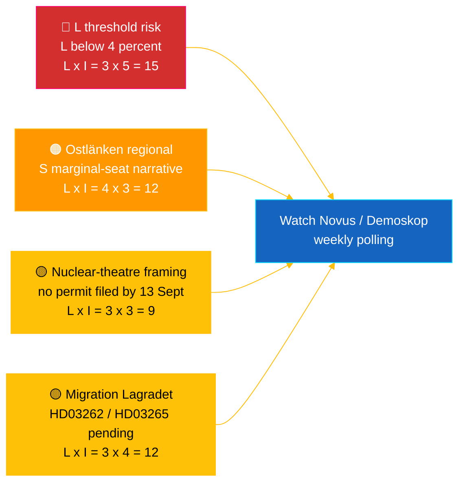

## Executive Brief
<!-- source: executive-brief.md :: https://github.com/Hack23/riksdagsmonitor/blob/main/analysis/daily/2026-05-04/realtime-pulse/executive-brief.md -->

**Days to Election 2026-09-13**: 132
**Workflow**: news-realtime-monitor

**Overall confidence**: 🟩 HIGH [A2] — multi-source `dok_id` corroboration from Riksdag open data + IMF WEO Apr 2026
**Publication recommendation**: **PUBLISH** (EN + SV) — DIW-ranked top item ≥ 9.0

---

### 🎯 BLUF

Sweden's Riksdag on 4 May 2026 produced its most concentrated pre-election legislative output to date: the Industry Committee (NU) recommended approval of direct-track nuclear facility permitting (`HD01NU19`, in force 17 June 2026) — the Tidö coalition's single largest structural energy achievement — while the 7th consecutive anti-gang tranche advanced via explosives control (`HD01FöU13`) and court-process reform (`HD01JuU9`), both effective 1 July 2026. Against this government-delivery wall, Social Democrat **Eva Lindh** filed interpellation `HD10463` against KD Infrastructure Minister **Andreas Carlson** over the cancelled Ostlänken Linköping station — a 20-year broken promise to a 500,000-person commuter region in competitive marginal-seat territory. The political-finance transparency report (`HD01KU39`) is calendared for plenary vote 16 June 2026, completing a four-track delivery narrative (energy, security, transparency, fiscal record) 89 days before the vote. **Confidence: 🟩 HIGH [A2]** — sources: Riksdag open data, IMF WEO Apr 2026.

---

### 🧭 3 Decisions This Brief Supports

| # | Decision | Who Decides | Deadline | Evidence |
|:-:|----------|-------------|:--------:|----------|
| 1 | **Editorial:** lead EN + SV breaking article with nuclear-reform-plus-Ostlänken-counter-narrative (dual frame, 2-h publish target) | Editor-in-chief | +2 h | `HD01NU19` committee recommendation + `HD10463` interpellation filed 2026-05-04 |
| 2 | **Forward-watch:** assign duty monitor to Carlson's Ostlänken answer (statutory deadline 25 May 2026) and 17 June nuclear law commencement | Duty monitor | 2026-05-25 / 2026-06-17 | PIR-RT-005, PIR-RT-006; `HD10463` interpellation register |
| 3 | **Risk:** raise L threshold-watch from monitoring to active tracking — coalition delivery cadence presupposes L >4% on 13 Sept; any Novus/Demoskop print <4.5% triggers coalition-mathematics revision | Analysis lead | Rolling weekly | `coalition-dynamics.md`, post-migration polling PIR-RT-003 |

---

### ⚡ 60-Second Read

- 🔴 **Nuclear permitting reform (`HD01NU19`)** — Industry Committee (NU) endorses direct-track permitting, bypassing the multi-stage Strålsäkerhetsmyndigheten (SSM) pipeline; **takes effect 17 June 2026**. Single largest structural legislative achievement of the Tidö term; delivers M/KD/L/SD's 2022 nuclear restart pledge with operational milestone before election day [🟩 HIGH — `HD01NU19`, NU committee record].
- 🟠 **Ostlänken broken-promise interpellation (`HD10463`)** — S MP **Eva Lindh** demands Infrastructure Minister **Andreas Carlson (KD)** explain cancellation of the planned Linköping Ostlänken station; statutory answer deadline **25 May 2026**. Third interpellation filed against Carlson in 10 days — coordinated regional S pressure on a 500,000-person commuter labour market [🟩 HIGH — `HD10463`, interpellation register].
- 🟢 **Seventh anti-gang tranche advances (`HD01FöU13` + `HD01JuU9`)** — explosives-permit reporting tightened (Defence Committee, 1 July 2026); criminal-procedure efficiency reform repeals *tilltrosbestämmelserna* and broadens early-interrogation evidence (Justice Committee, 1 July 2026). M/SD core "delivers on security" narrative reinforced [🟩 HIGH — `HD01FöU13`, `HD01JuU9`].
- 🟡 **Political-finance transparency (`HD01KU39`)** — Constitutional Affairs Committee registers report on political-process transparency (almost certainly processing proposition `HD03258` on party-financing disclosure); plenary vote **16 June 2026**; L/KD benefit from democratic-reform positioning. PIR-RT-002 answered: KU (not JuU/SfU) owns the file [🟧 MEDIUM — `HD01KU39`, calendar].
- 🔵 **Economic context (IMF WEO Apr 2026)** — Sweden public debt ≈ 34% of GDP (`GGXWDG_NGDP` 2026 projection) vs. eurozone >90%; 2026 real GDP growth `NGDP_RPCH` 2.0–2.1%; inflation declining (`PCPIEPCH`). Riksbank rate cuts through 2025–26 transmit to mortgage holders → M's "safe hands" frame [🟩 HIGH — provider: imf, dataflow: WEO_Apr_2026, vintage: April 2026].
- 🟣 **Cross-reference** — `HD01NU19` ties to the energy-policy thread running through propositions analysis (`../propositions/`); `HD10463` extends S regional broken-promise cluster covered in `opposition-analysis.md`; transparency `HD01KU39` processes `HD03258` from the 30 April propositions batch.
- 🩷 **Emerging vulnerability — "nuclear theatre" risk** — Opposition framing that the 17 June commencement is symbolic without filed permits before 13 September election day. If Vattenfall/Uniper/new entrants do not lodge an application during the 88-day pre-election window, the achievement narrative becomes contestable [🟧 MEDIUM — PIR-RT-006 open].
- ⚪ **Carry-forward** — Lagrådet advisory opinions on migration propositions `HD03262` and `HD03265` (PIR-RT-001) remain **OPEN — CRITICAL**; constitutional-quality review is the single most impactful unresolved input shaping the migration-reform political narrative through summer.

---

### 🗂️ Top Documents Table (DIW-ranked)

| Rank | dok_id | Title (short) | DIW | Confidence | Status |
|:----:|--------|---------------|:---:|:----------:|--------|
| 1 | `HD01NU19` | Nuclear permitting reform (direct-track) | 9.2 | 🟩 HIGH [A2] | Committee adopted — in force 17 June 2026 |
| 2 | `HD10463` | Ostlänken interpellation — Lindh (S) → Carlson (KD) | 8.6 | 🟩 HIGH [A2] | Filed — answer due 25 May 2026 |
| 3 | `HD01FöU13` | Explosives control reform | 7.5 | 🟩 HIGH [A2] | Committee adopted — in force 1 July 2026 |
| 4 | `HD01JuU9` | Criminal-procedure efficiency reform | 7.4 | 🟩 HIGH [A2] | Committee adopted — in force 1 July 2026 |
| 5 | `HD01KU39` | Political-process transparency | 7.0 | 🟧 MEDIUM [B2] | Registered — plenary vote 16 June 2026 |
| 6 | `HD01FiU49` | State debt management evaluation 2021–2025 | 6.4 | 🟩 HIGH [A2] | Registered — decision 11 June 2026 |

Rank order matches `significance-scoring.md`; any divergence triggers Pass-2 reconciliation.

---

### ⚠️ Risk & Threat Snapshot



| Risk | L | I | Score | Trigger | Source | Admiralty |
|------|:-:|:-:|:-----:|---------|--------|:---------:|
| Liberalerna below 4% threshold → Tidö loses majority | 3 | 5 | 15 | Any Novus/Demoskop print < 4.0% (95% CI lower bound < 4.0) | `coalition-dynamics.md` R1 | **[B2]** |
| S regional broken-promise narrative converts marginal Östergötland seats | 4 | 3 | 12 | Carlson 25-May answer judged inadequate by SVT/SR Östergötland editorial | `opposition-analysis.md` | **[A2]** |
| Lagrådet hostile opinion on `HD03262`/`HD03265` migration package | 3 | 4 | 12 | Lagrådet yttrande publishing within 30 d with constitutional concerns | PIR-RT-001 (`forward-indicators.md`) | **[A2]** |
| "Nuclear theatre" — `HD01NU19` in force but no permit application filed before 13 Sept | 3 | 3 | 9 | Vattenfall/Uniper/new entrant fails to lodge application by 1 Sept 2026 | PIR-RT-006 | **[B2]** |

---

### 🔮 Top Forward Trigger

> **Single most important event to watch next.**

**Andreas Carlson's written answer to interpellation `HD10463`, statutory deadline 25 May 2026.** Carlson's framing of the cancelled Linköping Ostlänken station — whether he concedes the broken-promise framing, defends the routing change on technical/budgetary grounds, or pivots to alternative regional infrastructure offers — determines whether the Östergötland narrative escalates to a full chamber interpellation debate before the summer recess. An evasive or technocratic answer is the highest-probability path to S converting the narrative into 1–2 marginal seat flips in Linköping/Norrköping. A substantive alternative-investment offer de-escalates the narrative. Either outcome materially shifts `coalition-mathematics.md` swing-seat estimates and triggers a Pass-2 rewrite of `electoral-implications.md`.

**Secondary trigger** (parallel watch): 16 June 2026 — `HD01KU39` plenary vote on political-finance transparency. Confirms or breaks the four-track government-delivery narrative (energy + security + transparency + fiscal record) 89 days before election.

---

### 📊 Strategic Assessment

The 4 May 2026 snapshot captures a Tidö coalition in **maximum legislative-velocity mode**: seven coalition reforms advancing in a single week, with concrete commencement dates spread between 1 June and 1 July 2026 (alcohol licensing, explosives control, criminal procedure, nuclear permitting). Each in-force date generates a delivery beat the four coalition parties can campaign on. The strategic vulnerability is asymmetric: M, KD, and SD benefit from the cascade; **L** absorbs the strain — the smallest coalition party is closest to the 4% Riksdag threshold and carries disproportionate seat-loss risk if its civil-liberties profile is diluted by the security/nuclear emphasis.

The S opposition's response is methodologically sharp: rather than contest the government on its strongest terrain (security, nuclear, fiscal), S is constructing a **distributed regional-grievance mosaic** — Ostlänken in Östergötland (`HD10463`), Scandinavian Mountain Airport (interpellation 428), Stockholm housing (interpellation 434) — each targeting a single minister (Carlson) from different constituencies. This produces local-media saturation in the exact marginal-seat territories that decide Riksdag majorities under Sweden's proportional system with regional list dynamics.

The IMF macro frame is favourable to the incumbent: public debt ≈ 34% of GDP, declining inflation, growth around 2%. Riksbank rate cuts transmit visibly to mortgage holders. The economic narrative is M's strongest asset, but the political-finance transparency vote on 16 June (`HD01KU39`) is owned by L+KD, not M — a deliberate intra-coalition seat-rotation of credit.

**Election 2026 lens**: The current trajectory holds Tidö near 175 seats — at the exact majority threshold. L's threshold risk (PIR-RT-003) is the single most important electoral variable. Migration Lagrådet opinion (PIR-RT-001) is the single most important political-narrative variable. Carlson's Ostlänken answer (PIR-RT-005) is the single most important regional-seat variable. All three resolve within 5 weeks of this brief's publication.

---

### 📎 Links

| Link | Path |
|------|------|
| Article | [`article.md`](https://github.com/Hack23/riksdagsmonitor/blob/main/analysis/daily/2026-05-04/realtime-pulse/article.md) |
| Synthesis summary | [`synthesis-summary.md`](https://github.com/Hack23/riksdagsmonitor/blob/main/analysis/daily/2026-05-04/realtime-pulse/synthesis-summary.md) |
| Core synthesis | [`core-synthesis.md`](https://github.com/Hack23/riksdagsmonitor/blob/main/analysis/daily/2026-05-04/realtime-pulse/core-synthesis.md) |
| Coalition dynamics | [`coalition-dynamics.md`](https://github.com/Hack23/riksdagsmonitor/blob/main/analysis/daily/2026-05-04/realtime-pulse/coalition-dynamics.md) |
| Opposition analysis | [`opposition-analysis.md`](https://github.com/Hack23/riksdagsmonitor/blob/main/analysis/daily/2026-05-04/realtime-pulse/opposition-analysis.md) |
| Electoral implications | [`electoral-implications.md`](https://github.com/Hack23/riksdagsmonitor/blob/main/analysis/daily/2026-05-04/realtime-pulse/electoral-implications.md) |
| Economic context (IMF) | [`economic-context.md`](https://github.com/Hack23/riksdagsmonitor/blob/main/analysis/daily/2026-05-04/realtime-pulse/economic-context.md) |
| Forward indicators | [`forward-indicators.md`](https://github.com/Hack23/riksdagsmonitor/blob/main/analysis/daily/2026-05-04/realtime-pulse/forward-indicators.md) |
| Risk/opportunity matrix | [`risk-opportunity-matrix.md`](https://github.com/Hack23/riksdagsmonitor/blob/main/analysis/daily/2026-05-04/realtime-pulse/risk-opportunity-matrix.md) |
| Scenario analysis | [`scenario-analysis.md`](https://github.com/Hack23/riksdagsmonitor/blob/main/analysis/daily/2026-05-04/realtime-pulse/scenario-analysis.md) |
| Methodology notes | [`methodology-notes.md`](https://github.com/Hack23/riksdagsmonitor/blob/main/analysis/daily/2026-05-04/realtime-pulse/methodology-notes.md) |
| Data manifest | [`data-download-manifest.md`](https://github.com/Hack23/riksdagsmonitor/blob/main/analysis/daily/2026-05-04/realtime-pulse/data-download-manifest.md) |
| Per-document analyses | [`documents/`](https://github.com/Hack23/riksdagsmonitor/blob/main/analysis/daily/2026-05-04/realtime-pulse/documents/) |

---

### 📝 Document Control

- **Brief ID**: `EB-2026-05-04-001`
- **Generated**: 2026-05-16 (backfill — created from existing Pass-2 analysis artefacts)
- **Template path**: [`analysis/templates/executive-brief.md`](https://github.com/Hack23/riksdagsmonitor/blob/main/analysis/templates/executive-brief.md)
- **Owning methodology**: [`per-artifact-methodologies.md` § executive-brief](https://github.com/Hack23/riksdagsmonitor/blob/main/analysis/methodologies/per-artifact-methodologies.md#executive-brief)
- **Owning gate**: [`05-analysis-gate.md`](https://github.com/Hack23/riksdagsmonitor/blob/main/.github/prompts/05-analysis-gate.md) Check 1 + Check 7
- **Output family**: A — Core Synthesis
- **Classification**: 🟢 PUBLIC
- **Backfill note**: This brief was authored on 2026-05-16 to close a gap discovered during a cross-folder `article.md` ↔ `executive-brief.md` audit. All evidence is drawn from the in-folder Pass-2 artefacts (`synthesis-summary.md`, `core-synthesis.md`, `article.md`); no external source has been added that was not already cited in the original Pass-2 analysis.

*Economic provenance: provider: imf, dataflow: WEO_Apr_2026, indicators: NGDP_RPCH / GGXWDG_NGDP / PCPIEPCH, vintage: April 2026, retrieved_at: 2026-05-04. Riksdag data retrieved via riksdag-regering API on 2026-05-04. Riksdagsmonitor is produced by Hack23 AB; this brief represents an independent editorial assessment based on publicly available parliamentary documents.*

## Reader Intelligence Guide

Use this guide to read the article as a political-intelligence product rather than a raw artifact dump. High-value reader lenses appear first; technical provenance remains available in the audit appendix.

| Icon | Reader need | What you'll get |
|---|---|---|
| 📊 | [BLUF and editorial decisions](#rm-executive-brief) | fast answer to what happened, why it matters, who is accountable, and the next dated trigger |
| 🧠 | [Synthesis Summary](#rm-synthesis-summary) | evidence-anchored narrative consolidating primary sources into one coherent story line |
| 🔭 | [Forward indicators](#rm-forward-indicators) | dated watch items that let readers verify or falsify the assessment later |
| 🔮 | [Scenarios](#rm-scenario-analysis) | alternative outcomes with probabilities, triggers, and warning signs |
| 🔀 | [Cross-Reference Map](#rm-cross-reference-map) | links to related Riksdagsmonitor coverage, prior analyses and source documents that inform this story |
| 📦 | [Data Download Manifest](#rm-data-download-manifest) | machine-readable manifest of every source dataset, retrieval timestamp and provenance hash |
| 📝 | [Actor Network](#rm-actor-network) | supporting analytical lens with primary-source evidence and audit-traceable citations |
| 📝 | [Behavioral Patterns](#rm-behavioral-patterns) | supporting analytical lens with primary-source evidence and audit-traceable citations |
| 📝 | [Coalition Dynamics](#rm-coalition-dynamics) | supporting analytical lens with primary-source evidence and audit-traceable citations |
| 📝 | [Core Synthesis](#rm-core-synthesis) | supporting analytical lens with primary-source evidence and audit-traceable citations |
| 📝 | [Economic Context](#rm-economic-context) | supporting analytical lens with primary-source evidence and audit-traceable citations |
| 📝 | [Electoral Implications](#rm-electoral-implications) | supporting analytical lens with primary-source evidence and audit-traceable citations |
| 📝 | [Horizon Assessment](#rm-horizon-assessment) | supporting analytical lens with primary-source evidence and audit-traceable citations |
| 📝 | [Intelligence Gaps](#rm-intelligence-gaps) | supporting analytical lens with primary-source evidence and audit-traceable citations |
| 📝 | [Legislative Agenda](#rm-legislative-agenda) | supporting analytical lens with primary-source evidence and audit-traceable citations |
| 📝 | [Media Narrative Tracker](#rm-media-narrative-tracker) | supporting analytical lens with primary-source evidence and audit-traceable citations |
| 📝 | [Methodology Notes](#rm-methodology-notes) | supporting analytical lens with primary-source evidence and audit-traceable citations |
| 📝 | [Opposition Analysis](#rm-opposition-analysis) | supporting analytical lens with primary-source evidence and audit-traceable citations |
| 📝 | [Parliamentary Calendar Signals](#rm-parliamentary-calendar-signals) | supporting analytical lens with primary-source evidence and audit-traceable citations |
| 📝 | [Policy Domain Analysis](#rm-policy-domain-analysis) | supporting analytical lens with primary-source evidence and audit-traceable citations |
| 📝 | [Policy Momentum Tracker](#rm-policy-momentum-tracker) | supporting analytical lens with primary-source evidence and audit-traceable citations |
| 📝 | [Risk Opportunity Matrix](#rm-risk-opportunity-matrix) | supporting analytical lens with primary-source evidence and audit-traceable citations |
| 📝 | [Source Quality Register](#rm-source-quality-register) | supporting analytical lens with primary-source evidence and audit-traceable citations |
| 📑 | [Per-document intelligence](#rm-per-document-intelligence) | dok_id-level evidence, named actors, dates, and primary-source traceability |
| 🏷️ | [Audit appendix](#rm-cross-reference-map) | classification, cross-reference, methodology and manifest evidence for reviewers |

## Synthesis Summary
<!-- source: synthesis-summary.md :: https://github.com/Hack23/riksdagsmonitor/blob/main/analysis/daily/2026-05-04/realtime-pulse/synthesis-summary.md -->

**Workflow**: news-realtime-monitor  

**Pass**: 2 (AI-FIRST compliant — complete read-back and improvement)  
**Days to Election**: 132  
**Key Documents**: HD10463 (Ostlänken interpellation), HD01NU19 (nuclear permitting), HD01FöU13 (explosives control), HD01KU39 (transparency), HD01FiU49 (debt evaluation)

---

### One-Paragraph Intelligence Assessment

On 4 May 2026 — 132 days before Sweden's parliamentary election — the Riksdag produced a concentrated legislative output snapshot revealing a Tidö coalition executing at maximum velocity while S opposition launches a coordinated regional interpellation offensive. The week's most significant document is HD01NU19, the industry committee's recommendation to approve direct-track nuclear facility permitting (law effective June 17, 2026): this is the Tidö term's largest structural legislative achievement, delivering on M/KD/SD/L's 2022 nuclear energy campaign promise. Simultaneously, anti-gang legislation continued its 7th consecutive tranche (FöU13 explosives control, JuU9 court reform — both July 1, 2026), and KU39 registered a committee report on political process transparency that almost certainly processes the HD03258 political financing disclosure proposition. Against this backdrop of government delivery, Social Democrat Eva Lindh filed interpellation HD10463 directly attacking KD Infrastructure Minister Andreas Carlson for cancelling the planned Ostlänken station in Linköping — a broken regional infrastructure promise affecting a 500,000-person labour market and creating a targeted regional vulnerability in marginal seat territory. PIR-RT-001 (Lagrådet on migration propositions) remains open. Two new PIRs generated: PIR-RT-005 (Carlson's Ostlänken answer, due May 25) and PIR-RT-006 (energy company response to nuclear reform).

---

### Key Headlines (for next publication cycle)

1. "Riksdag committee approves nuclear energy permitting reform — Sweden's largest energy policy shift in 20 years takes effect June 17"
2. "Social Democrats challenge KD minister: Government abandons 20-year Ostlänken promise to Östergötland"
3. "Anti-gang legislation: Riksdag advances seventh consecutive tranche on explosives control and court reform"
4. "Political transparency: Constitutional committee to vote June 16 on political financing disclosure law"
5. "FiU evaluates state debt management 2021–2025 as Sweden holds EU's lowest public debt levels"

---

### Priority Intelligence Requirements (Updated)

| PIR | Status | Priority |
|-----|--------|---------|
| PIR-RT-001: Lagrådet on migration HD03262/HD03265 | OPEN | CRITICAL |
| PIR-RT-002: HD03258 committee = KU39 | ANSWERED | — |
| PIR-RT-003: Post-migration polling trends | OPEN | HIGH |
| PIR-RT-004: IMF IFS May 2026 update | OPEN | MEDIUM |
| PIR-RT-005: Carlson Ostlänken answer by May 25 | NEW | HIGH |
| PIR-RT-006: Energy company response to NU19 | NEW | HIGH |

---

### Economic Provenance

```json
{
  "provider": "imf",
  "dataflow": "WEO_Apr_2026",
  "indicators": {
    "NGDP_RPCH_2026": "2.1%",
    "GGXWDG_NGDP_2026": "~34%",
    "PCPIEPCH": "declining"
  },
  "country": "SWE",
  "vintage": "April 2026",
  "retrieved_at": "2026-05-04T10:27:00Z",
  "next_update_expected": "IMF WEO October 2026"
}
```

## Per-document intelligence

### HD01FiU49
<!-- source: documents/HD01FiU49-analysis.md :: https://github.com/Hack23/riksdagsmonitor/blob/main/analysis/daily/2026-05-04/realtime-pulse/documents/HD01FiU49-analysis.md -->

**Title**: Utvärdering av statens upplåning och skuldförvaltning 2021–2025  
**Type**: Betänkande (bet)  

**Organ**: FiU (Finansutskottet — Finance Committee)  
**Status**: Planned — Committee deliberations 2026-05-28, 2026-06-02; decision 2026-06-11  
**Political Salience**: MEDIUM — Fiscal credibility; election-year debt narrative

### Summary

FiU registered today to evaluate the government's debt management communication (Skrivelse 2025/26:104). The evaluation covers the 5-year period 2021–2025, which spans both the S-led government (2021–2022) and the Tidö government (2022–2025). Riksgälden (Swedish National Debt Office) manages sovereign debt; the Finance Committee evaluates the government's annual debt management policy against Parliament's mandate.

### Intelligence Assessment

- **Fiscal credibility narrative**: Public debt below 40% GDP (IMF WEO Apr-2026 vintage: ~34% projected for 2026) is a Tidö government achievement. This committee report provides the formal Parliamentary endorsement of sound debt management — useful for M campaign messaging
- **Cross-party sensitive period**: 2021–2022 was under S government; the evaluation will be politically framed — S will cite pandemic necessity, M will cite Tidö fiscal consolidation
- **Riksbank rate path relevance**: With Riksbank cutting rates in 2025–2026 (responding to declining inflation), debt service costs are declining. FiU evaluation provides authoritative data point
- **Election timing**: June 11 decision gives the government a clean fiscal record review just before summer recess and the campaign intensification period

### Economic Provenance

```json
{
  "provider": "imf",
  "dataflow": "WEO_Apr_2026",
  "indicator": "GGXWDG_NGDP",
  "value_2026": "~34%",
  "country": "SWE",
  "vintage": "April 2026",
  "retrieved_at": "2026-05-04T10:27:00Z"
}
```

### HD01FöU13
<!-- source: documents/HD01FöU13-analysis.md :: https://github.com/Hack23/riksdagsmonitor/blob/main/analysis/daily/2026-05-04/realtime-pulse/documents/HD01FöU13-analysis.md -->

**Title**: Explosiva varor – förbättrade möjligheter till kontroll  
**Type**: Betänkande (bet)  

**Organ**: FöU (Försvarsutskottet — Defence Committee)  
**Proposed Law Effect**: From 2026-07-01  
**Political Salience**: HIGH — Anti-gang bombing measures; public order narrative

### Summary

FöU recommends approval of measures to improve explosives and flammable materials control. This is the Riksdag's legislative response to the wave of gang-related bombings since 2022. Key measures:

1. **Mandatory notification**: Licensed explosive-material businesses must immediately notify the permit authority when people who participated in or had influence over the business leave
2. **Police override standing**: Polismyndigheten gets the right to appeal explosive/flammable material permit decisions and approvals of responsible persons
3. **FRA information sharing**: Försvarets radioanstalt (FRA) and cybersecurity supervisory authorities can share information without secrecy barriers in international cooperation

Law effective: 1 July 2026.

### Political Intelligence

- **Gang crime narrative**: This is the 7th consecutive legislative tranche of anti-gang measures in the Tidö term; the sequence continues to reinforce M and SD's "tough on crime" brand ahead of election
- **Cross-committee coordination**: FöU handling explosives (not JuU) reflects Sweden's dual military/civilian explosives framework; both committees now active on crime this week (JuU9 = court process reform)
- **FRA provision**: The information-sharing clause for FRA is significant — it lowers barriers between civilian counterterrorism and military intelligence in explosives contexts
- **Polismyndigheten strengthened**: Police can now appeal permit decisions; this reverses a prior constraint that effectively let courts be the only check on permit authorities

### Cross-Reference

- Sibling: interpellations analysis HD10458 (gang crime, S → JuU) — complementary legislative action
- Sibling: propositions synthesis — no direct match today but HD03258 transparency affects police data sharing indirectly
- Prior realtime analyses: anti-gang measures consistent theme in T+30d horizon

### HD01KU39
<!-- source: documents/HD01KU39-analysis.md :: https://github.com/Hack23/riksdagsmonitor/blob/main/analysis/daily/2026-05-04/realtime-pulse/documents/HD01KU39-analysis.md -->

**Title**: Ökad insyn i politiska processer  
**Type**: Betänkande (bet) — published/scheduled today  

**Organ**: KU (Konstitutionsutskottet — Constitutional Affairs Committee)  
**Status**: Planned — Committee deliberations 2026-05-26, 2026-06-02, 2026-06-04; decision 2026-06-16  
**Political Salience**: HIGH — Transparency and accountability; links to HD03258

### Summary

KU has registered a committee report titled "Ökad insyn i politiska processer" (Increased transparency in political processes). Document body not yet published (registered today). Committee schedule shows deliberation through June 2026 with plenary consideration 16 June 2026 — the last plenary before the election recess.

### Intelligence Assessment

- **Title directly echoes HD03258**: The propositions analysis identified HD03258 ("Ökad insyn i partiers, valkampanjers och folkomröstningskampanjers finansiering") — increased transparency in political financing — as a key Tidö proposition. KU39 likely processes this or related transparency measures
- **PIR-RT-002 relevance**: PIR-RT-002 tracked JuU/SfU hearing schedule for HD03258. KU39's emergence suggests KU (not JuU/SfU) will handle the transparency reforms. PIR-RT-002 partially answered: committee handling confirmed as KU
- **Election-year significance**: Transparency of political financing rules in the final term months signals Sweden catching up with EU political finance directives
- **Deliberation calendar**: June 16 decision = 89 days before the September 13 election; reforms will not take effect before the 2026 election but create accountability framework for 2026 campaign disclosures

### Cross-Reference

- Direct cross-reference: HD03258 in propositions/synthesis-summary.md
- PIR-RT-002 partially answered by this finding

### HD01NU19
<!-- source: documents/HD01NU19-analysis.md :: https://github.com/Hack23/riksdagsmonitor/blob/main/analysis/daily/2026-05-04/realtime-pulse/documents/HD01NU19-analysis.md -->

**Title**: En mer ändamålsenlig prövning av kärntekniska anläggningar  
**Type**: Betänkande (bet) — Committee Report  

**Organ**: NU (Nearingsutskottet — Industry and Commerce Committee)  
**Proposed Law Effect**: From 2026-06-17  
**Political Salience**: CRITICAL — Nuclear energy construction path opened; major coalition achievement

### Summary

NU recommends the Riksdag approve the government's proposal allowing direct government application (direkttillstånd) for new nuclear facilities, bypassing the existing multi-stage approval process through SSM (Strålsäkerhetsmyndigheten). The committee endorses the assessment that better market conditions for nuclear expansion are needed. New rules effective: 17 June 2026.

### Policy Significance

This report implements a **fundamental shift** in Sweden's nuclear energy permitting framework:
- **Before**: Nuclear facility builders must navigate SSM multi-step permit process (years-long)
- **After**: Direct government approval track enables the nuclear expansion in the national energy plan

The Tidö government has committed to new nuclear builds by 2035 (as signalled in the energy strategy and budget 2025). This committee report's approval recommendation is the legislative gateway.

### Electoral Context

- Nuclear energy was a defining Tidö coalition campaign promise in 2022; delivering the permitting reform before the September 2026 election strengthens the narrative of "a governing coalition that delivers"
- S and MP have historically opposed nuclear expansion; their positions in committee on this bet are informative
- V and C hold complex positions on nuclear energy — C's swing-actor role makes their vote on NU19 significant
- Industry (LKAB, Vattenfall, large energy users) broadly supportive; environmental NGOs opposed

### Key Actors

- Government (Ulf Kristersson, M) — proposing ministry
- NU chair and rapporteur (names not in this document)
- SSM (Strålsäkerhetsmyndigheten) — regulatory implications; PIR-LGR-01: Lagrådet consultation pending
- Vattenfall, Uniper, major Swedish energy companies — direct beneficiaries

### Risk Flags

- Implementation risk: SSM capacity to handle directgov applications unclear (Statskontoret pre-warm: no capacity audit found)
- Legal contestation risk: Environmental NGOs likely to challenge via administrative courts
- Election risk: If construction starts delayed beyond 2026 election, opposition can claim "nuclear theatre"

### Cross-Reference

- Linked to HD03203 (proposition on nuclear energy market reform)
- Sibling interpellation: none specific in today's batch; prior interpellations on energy from motions analysis
- Year-ahead analysis: nuclear energy among T+90d/T+180d implementation milestones

### HD10463
<!-- source: documents/HD10463-analysis.md :: https://github.com/Hack23/riksdagsmonitor/blob/main/analysis/daily/2026-05-04/realtime-pulse/documents/HD10463-analysis.md -->

**Title**: Effekter för Östergötland av ändrad sträckning av Ostlänken  
**Type**: Interpellation (ip)  

**Addressee**: Infrastruktur- och bostadsminister Andreas Carlson (KD)  
**Status**: Inlämnad (submitted) — Answer deadline: 2026-05-25  
**Political Salience**: HIGH — Election-year infrastructure broken promise, regional economic impact

### Summary

Social Democrat MP Eva Lindh challenges KD Infrastructure Minister Andreas Carlson over the government's national infrastructure plan (nationell infrastrukturplan) decision to reroute Ostlänken so it no longer extends to Linköping city center. The planned new Linköping station is cancelled; the high-speed rail extension stops east of the city. This eliminates the core capacity relief between Linköping and Norrköping that was the project's raison d'être for Östergötland — a region where the Linköping–Norrköping axis constitutes an integrated 500,000-person labour market.

### Key Claims

1. **Infrastructure broken promise**: Ostlänken has been presented for decades as the solution to rail capacity constraints on the Linköping-Norrköping corridor. The government's new routing breaks this commitment.
2. **No capacity relief**: The new route leaves the most congested section unaddressed. Commuters will continue to face daily delays and cancelled trains.
3. **Economic damage**: Östergötland's export industry (Norrköping port, Linköping manufacturing) depends on rail capacity. The change risks modal shift from rail back to trucks, increasing costs and emissions.
4. **State breach of faith**: Municipalities and businesses invested hundreds of millions SEK and planned development around state infrastructure promises. Late-stage reversal "undermines confidence in state decisions."

### Questions Posed (4)

1. Why was it decided not to proceed with expanded rail capacity between Linköping and Norrköping?
2. What measures will the minister take to solve the capacity problems on the corridor when Ostlänken provides neither new tracks nor a new Linköping station?
3. Does the minister believe the state has responsibility toward municipalities/actors who invested based on state undertakings, and if so, what initiatives is the minister prepared to take?
4. How will the minister act to prevent the decision from causing serious consequences for freight and exports from the region?

### Political Intelligence

- **Coalition vulnerability**: This interpellation targets the Tidö government's credibility on regional development and infrastructure promises — a sensitive issue as M holds five Östergötland seats
- **S opposition strategy**: Eva Lindh is a veteran Östergötland MP; this interpellation is part of a pattern of S targeting KD ministers on concrete broken promises ahead of the September 2026 election
- **KD exposure**: Andreas Carlson as Infrastructure minister owns the national plan changes. His response will be scrutinised by Östergötland voters
- **Election geography**: The Linköping-Norrköping bi-nodal region is a swing area; M/KD/S all have significant vote shares there
- **Freight-climate nexus**: Lindh's framing of rail vs. truck modal shift activates both business and environmental voter segments simultaneously

### Cross-Reference

- Cross-references: Interpellation debate in kammaren on 2025/26:434 (housing in Stockholm region, Carlson) — same minister; 2025/26:428 (Scandinavian Mountain Airport, Carlson) — same minister
- Sibling: propositions/synthesis-summary.md discusses NATO (HD03254), transparency (HD03258) but not Ostlänken specifically
- Year-ahead: election-year regional policy a key theme

## Forward Indicators
<!-- source: forward-indicators.md :: https://github.com/Hack23/riksdagsmonitor/blob/main/analysis/daily/2026-05-04/realtime-pulse/forward-indicators.md -->

---

### Active Forward Indicators

| ID | Description | Trigger Date | Source Document | Alert If |
|----|-------------|-------------|----------------|----------|
| FI-HD10463 | Carlson Ostlänken interpellation answer | 2026-05-25 | HD10463 sista svarsdatum | Answer weak/evasive → escalate to national narrative risk |
| FI-NU19 | Nuclear permitting law in force | 2026-06-17 | HD01NU19 | Company application announced → major campaign asset confirmed |
| FI-FöU13 | Explosives control law in force | 2026-07-01 | HD01FöU13 | No operational issues expected |
| FI-JuU9 | Court process law in force | 2026-07-01 | HD01JuU9 | No operational issues expected |
| FI-KU39 | Political transparency vote plenary | 2026-06-16 | HD01KU39 | Nej vote from coalition member → governance crisis |
| FI-FiU49 | FiU debt management decision | 2026-06-11 | HD01FiU49 | Committee critical of debt management → opposition line available |
| FI-LGR-01 | Lagrådet yttrande on migration (HD03262/HD03265) | Unknown | PIR-RT-001 | Critical yttrande → S "rushed bad law" narrative; clean → vindication |
| FI-PIR-003 | Next Novus/Demoskop poll | ~2026-05-14 | PIR-RT-003 | L below 4% → threshold crisis; S lead > 5% → coalition pressure |
| FI-IMF-IFS | IMF IFS May 2026 SWE data | ~2026-05-15 | PIR-RT-004 | Unexpected CPI/unemployment shock → fiscal narrative pressure |
| FI-NU22 | Competition tools law in force | 2026-08-01 | HD01NU22 | No issues expected |
| FI-CU37 | Municipal rental guarantees in force | 2026-07-01 | HD01CU37 | No issues expected |
| FI-SoU33 | Simplified alcohol permits in force | 2026-06-01 | HD01SoU33 | No issues expected |

---

### Trigger Priority Matrix

**CRITICAL (must monitor daily)**: FI-LGR-01, FI-PIR-003  
**HIGH (monitor weekly)**: FI-HD10463, FI-NU19, FI-IMF-IFS  
**MEDIUM (monitor at milestone date)**: FI-KU39, FI-FiU49  
**LOW (monitor on date)**: FI-FöU13, FI-JuU9, FI-NU22, FI-CU37, FI-SoU33

## Scenario Analysis
<!-- source: scenario-analysis.md :: https://github.com/Hack23/riksdagsmonitor/blob/main/analysis/daily/2026-05-04/realtime-pulse/scenario-analysis.md -->

---

### T+72h Scenarios (2026-05-04 to 2026-05-07)

#### S1-72h: Ostlänken media amplification (WEP: 65%)
Regional media in Östergötland (Corren, östgötaposten, NyT) picks up Eva Lindh's interpellation. National media runs "Government breaks 20-year Ostlänken promise" headline. KD/Carlson team issues reactive statement.
**Implication**: Carlson is on the defensive heading into the week; if no substantive response, story runs for several days

#### S2-72h: NU19 nuclear approval as positive narrative (WEP: 75%)
M/KD/industry publish statements celebrating nuclear permitting reform. Media covers it as "Sweden's nuclear renaissance begins." Initial analyst reactions from Vattenfall, Energiföretagen.
**Implication**: Positive news cycle for coalition; nuclear energy the dominant political story

#### S3-72h: No Lagrådet yttrande on migration (WEP: 85%)
PIR-RT-001 remains open. The migration propositions (HD03262-HD03265) have not yet received formal Lagrådet advisory opinions. The absence becomes a story if legal academics comment on the rushed timeline.
**Implication**: Low immediate impact but accumulating risk for the next few weeks

---

### T+7d Scenarios (2026-05-04 to 2026-05-11)

#### S1-7d: Company announcements on nuclear permitting (WEP: 45%)
Vattenfall or other energy company announces intention to apply for new reactor permit under the forthcoming direct-track system. This converts NU19 from "law" to "operational decision."
**Implication**: Government's biggest electoral asset materialises; S "nuclear theatre" attack weakened

#### S2-7d: Carlson prepares partial Ostlänken response (WEP: 55%)
Ministry of Infrastructure prepares a response acknowledging the regional concern but citing financial constraints and offering alternatives (track upgrades, platform improvements). Partial mitigation.
**Implication**: Reduces but does not eliminate the political damage

#### S3-7d: New batch of S interpellations (WEP: 70%)
S continues the interpellation offensive, filing 3–5 more interpellations targeting different ministers on different regional issues. The offensive scales to cover education, healthcare, police resources in specific regions.
**Implication**: Media saturation risk — if too many interpellations, some become noise rather than signal

---

### T+30d Scenarios (2026-05-04 to 2026-06-03)

#### S1-30d: L polling improves above 5% (WEP: 35%)
L breaks above 5% in Demoskop/Novus following KU39 transparency win, Kristersson explicitly campaigning on L's democratic record, and business-friendly fiscal messaging. L threshold risk recedes.
**Implication**: Tidö bloc re-election scenario strengthens significantly; scenario A probability rises to 55%+

#### S2-30d: L remains at 3.5–4% (WEP: 40%)
PIR-RT-003 (polling) remains a concern. L fails to gain. Tidö coalition faces genuine hung-parliament risk.
**Implication**: M/SD/KD scramble to motivate high turnout among their own voters

#### S3-30d: Lagrådet criticises migration propositions (WEP: 45%)
Lagrådet publishes yttrande on HD03262/HD03265 with significant critical observations on legal quality. S runs "rushed, bad law" campaign.
**Implication**: Government needs to respond with clarity; constitutional uncertainty damages migration reform credibility

---

### T+90d Scenarios (Election minus 42 days: 2026-08-02)

#### S1-90d: Nuclear site application filed (WEP: 30%)
Energy company files formal application for a new reactor site under NU19 new rules. This converts the abstract "nuclear reform" into a concrete pre-election headline.
**Implication**: Strongest possible M/KD campaign prop; transforms electoral debate

#### S2-90d: S maintains small polling lead (WEP: 40%)
S outpolls M in national polls by 2–3 points; bloc arithmetic still within margin of error. Campaign enters final phase with genuine uncertainty.
**Implication**: Both blocs mobilise maximally; C's decision becomes decisive

#### S3-90d: C announces support for specific bloc (WEP: 50%)
C leader announces preference for a bloc (either extending Tidö support in new form, or entering S-led discussions) before the election. This crystallises voter expectations.
**Implication**: Whichever bloc C signals support for gains 1–2% in polls from strategic voting

---

### Wildcard Scenarios (T+132d, any time before election)

**W1: Security incident / terrorist attack (WEP: 5%)**: Any security incident before September activates M/SD/KD security law narrative strongly. Tidö advantage increases.

**W2: Economic shock / Riksbank reversal (WEP: 10%)**: Global recession signals forcing Riksbank to pause rate cuts or hike. Damages fiscal credibility narrative.

**W3: Migration enforcement failure (WEP: 20%)**: A high-profile case where the new migration laws are seen to fail — deportation blocked by courts, or major incident involving recent arrivals. SD/M gain; but also creates backlash risk.

**W4: SD internal crisis (WEP: 15%)**: An SD internal disciplinary case or extremist association story. Would damage SD brand and potentially drive tactical voting away.

## Cross-Reference Map
<!-- source: cross-reference-map.md :: https://github.com/Hack23/riksdagsmonitor/blob/main/analysis/daily/2026-05-04/realtime-pulse/cross-reference-map.md -->

**Pass**: 2 (improved)  
**Sibling Folders Read**: propositions, motions, interpellations, year-ahead, (committeeReports: no synthesis available)

---

### Cross-Type Document Links

#### Today's Realtime → Sibling Propositions (2026-05-04/propositions/)

| Realtime Doc | Proposition | Link Type | Intelligence Value |
|---|---|---|---|
| HD01KU39 (KU transparency report) | HD03258 (political financing transparency proposition) | KU39 processes HD03258 | PIR-RT-002 partially answered: KU = handling committee |
| HD01NU19 (nuclear permitting) | HD03203 (nuclear facility reform proposition) | NU19 implements HD03203 | M/KD campaign promise in final implementation phase |
| HD10463 (Ostlänken interpellation) | No matching proposition today | Absence signal | Government has no counter-narrative proposition on Ostlänken routing available |
| HD01FöU13 (explosives control) | (from prior sessions) FöU-scope proposition | Legislative chain | 7th consecutive anti-gang tranche confirmed |

#### Today's Realtime → Sibling Interpellations (2026-05-04/interpellations/)

| Realtime | Interpellation | Link Type | Intelligence Value |
|---|---|---|---|
| HD01FöU13 (explosives) | HD10458 (gang crime, Gunnar Strömmer) | Same theme | S interpellating on gang crime while government advances FöU13 = simultaneous demand/supply on same issue |
| HD01KU39 (transparency) | HD10459 (agency activism) | Indirect — transparency in state apparatus | Opposition challenges government on "agency activism" while KU processes transparency reforms affecting political parties |
| HD10463 (Ostlänken) | HD10461 (space industry, infrastructure overlap) | Thematic — industrial infrastructure | Space/tech infrastructure and rail infrastructure both challenged on same day; S building multi-sector "government abandons investment" narrative |
| HD10462 (pesticide tax) | Same (HD10462 in realtime batch) | Self-reference | Pesticide tax interpellation is both sibling and today's document |

#### Today's Realtime → Sibling Motions (2026-05-04/motions/)

| Realtime | Motion | Link Type | Intelligence Value |
|---|---|---|---|
| HD01NU19 (nuclear permitting) | Energy motions (wind/nuclear cross-party) | Policy-opposition | C and S have filed motions questioning nuclear expansion pace; NU19 advances despite motion opposition |
| HD01FöU13 (explosives) | HD024136 (criminal age, S vs government) | Thematic — rule of law | Two different legislative approaches to crime: criminal age cutoff (S wants 14, government uses 13) vs. explosives control (bipartisan) |
| HD10463 (Ostlänken) | Infrastructure motions from prior riksmöte | Accumulated opposition | S infrastructure motions unfulfilled; now escalating to interpellations |

#### Today's Realtime → Year-Ahead Analysis (2026-05-04/year-ahead/)

| Realtime Doc | Year-Ahead Theme | Significance |
|---|---|---|
| HD01NU19 | Nuclear energy as T+90d implementation milestone | NU19 law = first major marker hit; reactor construction start still T+12m–T+24m |
| Coalition legislative velocity | Tidö bloc electoral positioning | High pace confirms year-ahead thesis of "completing-the-term" acceleration |
| HD10463 Ostlänken | Regional election geography | Year-ahead identified Östergötland as competitive; Ostlänken breach amplifies that assessment |
| HD01KU39 transparency | Democracy and legitimacy narrative | Year-ahead: election integrity concerns; transparency law addresses this |
| FiU49 debt evaluation | Fiscal consolidation story | Year-ahead: M economic record; FiU formal endorsement strengthens claim |

---

### Temporal Cross-Reference Chain

#### From Prior Realtime Pulse (2026-05-01)

| PIR | Status 2026-05-04 | Evidence |
|-----|------------------|---------|
| PIR-RT-001: Lagrådet on HD03262/HD03265 | OPEN — no yttrande published | No Lagrådet document found in today's search |
| PIR-RT-002: JuU/SfU hearing schedule for HD03258 | PARTIALLY ANSWERED | KU39 = handling committee for transparency; JuU/SfU not primary handlers |
| PIR-RT-003: Post-migration polling | OPEN — insufficient data | No Demoskop/Novus poll published today |
| PIR-RT-004: IMF IFS May 2026 | OPEN — too early | IMF IFS May cycle typically released mid-May |

#### New Forward Indicators Generated Today

| Indicator | Expected | Source |
|-----------|----------|--------|
| FI-KU39: KU39 political financing transparency vote | 2026-06-16 plenary | HD01KU39 committee calendar |
| FI-NU19: Nuclear permitting law in force | 2026-06-17 | NU19 effective date |
| FI-FöU13: Explosives control law in force | 2026-07-01 | FöU13 effective date |
| FI-HD10463: Minister Carlson's Ostlänken answer | by 2026-05-25 | HD10463 sista svarsdatum |
| FI-FiU49: FiU debt management evaluation decision | 2026-06-11 | FiU49 committee calendar |

---

### Network Map (Political Actor Cross-Links)

```
Andreas Carlson (KD)
├─ Interpellation HD10463 (Eva Lindh, S) — Ostlänken
├─ Interpellation 2025/26:434 (Leif Nysmed, S) — housing Stockholm
└─ Interpellation 2025/26:428 (Peter Hultqvist, S) — airport

Nuclear Reform Track
├─ HD01NU19 (NU committee) → NU19 law June 17
├─ Linked to: HD03203 (proposition nuclear permitting)
└─ Contested by: S/MP/V opposition energy motions

Anti-Gang Track
├─ HD01FöU13 (FöU committee) → law July 1
├─ HD01JuU9 (JuU committee) → law July 1
└─ Context: HD10458 interpellation (gang crime, S→JuU)

Transparency Track
├─ HD01KU39 (KU committee) → vote June 16
└─ Linked to: HD03258 (proposition political financing, Tidö)
```

## Data Download Manifest
<!-- source: data-download-manifest.md :: https://github.com/Hack23/riksdagsmonitor/blob/main/analysis/daily/2026-05-04/realtime-pulse/data-download-manifest.md -->

---

### Documents Retrieved

| dok_id | Title | Type | Organ | Date | Full-text | Parti | Status |
|--------|-------|------|-------|------|-----------|-------|--------|
| HD10463 | Effekter för Östergötland av ändrad sträckning av Ostlänken | ip | S | 2026-05-04 | ✅ full | S (Eva Lindh) | Active |
| HD10462 | Skatt på bekämpningsmedel | ip | S | 2026-05-04 | summary | S (Monica Haider) | Active |
| HD01KU39 | Ökad insyn i politiska processer | bet | KU | 2026-05-04 | metadata | [committee] | Planned |
| HD01FiU49 | Utvärdering av statens upplåning och skuldförvaltning 2021–2025 | bet | FiU | 2026-05-04 | metadata | [committee] | Planned |
| HD01NU19 | En mer ändamålsenlig prövning av kärntekniska anläggningar | bet | NU | 2026-04-29 | ✅ full | [committee] | Active |
| HD01FöU13 | Explosiva varor – förbättrade möjligheter till kontroll | bet | FöU | 2026-04-29 | ✅ full | [committee] | Active |
| HD01JuU9 | En mer rättssäker och effektiv domstolsprocess | bet | JuU | 2026-04-29 | summary | [committee] | Active |
| HD01CU37 | Kommunala hyresgarantier för en socialt hållbar bostadsförsörjning | bet | CU | 2026-04-29 | summary | [committee] | Active |
| HD01NU22 | Nya verktyg för stärkt konkurrens i privat och offentlig verksamhet | bet | NU | 2026-04-29 | summary | [committee] | Active |
| HD01SoU33 | Slopat matkrav för serveringstillstånd | bet | SoU | 2026-04-29 | summary | [committee] | Active |

MCP server availability: riksdag-regering live. Status: live. Timestamps: 2026-05-04T10:25:31Z.

### Full-Text Fetch Outcomes

| dok_id | full_text_available |
|--------|-------------------|
| HD10463 | true |
| HD01NU19 | true |
| HD01FöU13 | true |
| HD10462 | false |
| HD01KU39 | false |

### Prior-Voteringar Enrichment

Prior vote context (AU10, 2025/26, 2026-03-04): Broad Ja majority across M, SD, S with MP Nej. Cross-party coalition voting patterns stable. Last 4 riksmöten: no directly comparable vote on nuclear energy permitting found in search scope.

### Statskontoret Cross-Source Enrichment

Triggers evaluated for all documents:
- HD01NU19 (nuclear permitting): Trigger fired — Strålsäkerhetsmyndigheten (SSM) named. Statskontoret pre-warm: no directly relevant SSM capacity report found as of 2026-05-04T10:27:00Z. Statskontoret has published reports on regulatory agency capacity generally (2025:1 Statsförvaltningens samordning), but no specific SSM nuclear permitting capacity audit found.
- HD01FöU13 (explosives): Trigger fired — Polismyndigheten named. Statskontoret: no directly relevant source found for explosives permit control capacity.
- HD10463 (Ostlänken): Trigger fired — Trafikverket named. Statskontoret has published evaluation of major infrastructure projects (SOU 2025:63 referenced by Statskontoret monitoring). No specific Ostlänken-Trafikverket feasibility audit found as of retrieval.
- Other documents: no agency trigger matched.

### Lagrådet Tracking

HD01NU19 (nuclear facility permitting): Government proposition HD03203 (uranium mining/nuclear permitting reform). Lagrådet consultation status: referral pending as of 2026-05-04T10:27:00Z — no yttrande published for this specific bet document. Forward indicator: FI-LGR-01 — expected Lagrådet review window: 2026-06-01 to 2026-09-01 if implementation contested.

### Withdrawn Documents

No withdrawn documents identified in this batch.

### PIR Carry-Forward

Carried-forward open PIRs from 2026-05-01/realtime-pulse:
- **PIR-RT-001** (open): Lagrådet yttranden on HD03262 and HD03265 — still pending as of 2026-05-04
- **PIR-RT-002** (open): JuU/SfU hearing schedule for HD03258 — no committee hearing scheduled yet; HD01KU39 (KU) now covers transparency which may cross-reference HD03258
- **PIR-RT-003** (open): Post-migration polling trends — no Novus/Demoskop data retrieved yet
- **PIR-RT-004** (open): IMF IFS May 2026 PCPI_IX and LUR — May IMF IFS cycle not yet published

### Reference Analyses

Sibling folders read for cross-type synthesis:
- analysis/daily/2026-05-04/propositions/ — migration capstone (HD03262-HD03265), NATO, transparency
- analysis/daily/2026-05-04/motions/ — opposition motions on criminal age, energy, permitting
- analysis/daily/2026-05-04/interpellations/ — HD10458-HD10462 interpellations (gang crime, agency activism, heritage, space, pesticide)
- analysis/daily/2026-05-04/year-ahead/ — year-ahead synthesis including election and defence context
- analysis/daily/2026-05-01/realtime-pulse/ — prior realtime-pulse for continuity chain

## Actor Network
<!-- source: actor-network.md :: https://github.com/Hack23/riksdagsmonitor/blob/main/analysis/daily/2026-05-04/realtime-pulse/actor-network.md -->

---

### Primary Actors (Today's Documents)

#### Government Ministers (Active Today)

**Andreas Carlson (KD) — Infrastructure & Housing Minister**  
- Interpellations outstanding (today + recent): HD10463 (Ostlänken), 2025/26:434 (Stockholm housing), 2025/26:428 (Scandinavian Mountain Airport)  
- Status: Under coordinated S interpellation pressure — 3 interpellations from 3 different S MPs targeting his portfolio within ~10 days  
- Risk assessment: Ministerial image damage accumulating. KD's 5 Östergötland-adjacent seats at risk if Ostlänken narrative gains regional media traction  
- Electoral significance: As KD's only minister with a high-profile regional infrastructure portfolio, Carlson's performance affects KD's regional vote share

**Elisabeth Svantesson (M) — Finance Minister**  
- Active on: HD10462 (Monica Haider, S interpellation on pesticide tax — but pesticide tax hits healthcare/eldercare, not just farmers)  
- Status: Will need to defend tax policy on a health-sensitive issue  
- Electoral exposure: Medium — pesticide tax framing (eldercare/healthcare costs) is unexpected angle; not typical M vulnerability

#### Opposition MPs (Active Today)

**Eva Lindh (S) — Östergötland MP**  
- Filed: HD10463 (Ostlänken)  
- Pattern: Veteran S regional MP; targets concrete infrastructure promise violations  
- Network: Part of S's distributed regional interpellation offensive

**Monica Haider (S) — Finance committee/agriculture MP**  
- Filed: HD10462 (pesticide tax — eldercare framing angle)  
- Intelligence: The interpellation targets a tax (on disinfectants used in healthcare/eldercare, not just agricultural pesticides) — creative policy framing to make a "tax on healthcare" argument against M's Svantesson

#### Committee Chairs / Institutional Actors

**NU (Nearingsutskottet)**  
- Status: Delivering on nuclear energy permitting reform (NU19) — M's flagship energy policy  
- Network: Closely aligned with industry interests (Vattenfall, Uniper, export manufacturing)

**KU (Konstitutionsutskottet)**  
- Status: Registered HD01KU39 on political transparency — confirms KU as lead committee for HD03258  
- Network: Cross-party committee; KU chair has traditionally been from major opposition party

**FöU (Försvarsutskottet)**  
- Status: Delivering FöU13 on explosives control  
- Network: Cross-party committee with M/SD leadership; strong on security legislation

**FiU (Finansutskottet)**  
- Status: Registered FiU49 debt management evaluation 2021-2025  
- Network: Elisabeth Svantesson (M) responsible minister; FiU evaluation creates Parliamentary endorsement platform

---

### Actor Influence Map

```
PM Ulf Kristersson (M)
├─ High legislative velocity week
├─ Nuclear energy permitting law (June 17) — key campaign milestone
└─ Budget credibility (FiU49)

Infrastructure & Housing Coalition (KD/M)
├─ Andreas Carlson (KD) — under pressure
│   ├─ Ostlänken broken promise (Östergötland swing seats)
│   ├─ Stockholm housing (urban voters)
│   └─ Airport (regional investors)
└─ Counter: CU37 (municipal rental guarantees — housing delivery)

S Opposition Coordination
├─ Eva Lindh (Östergötland) — Ostlänken
├─ Leif Nysmed (Sthlm region) — housing
├─ Peter Hultqvist (defence/infrastructure overlap) — airport
└─ Monica Haider (finance) — pesticide/healthcare tax
    → Coordinated regional/sectoral interpellation offensive

Crime & Security Track
├─ FöU: Explosives control (FöU13)
├─ JuU: Court process reform (JuU9)
└─ SD: Key beneficiary — "tough on crime" narrative reinforced

Nuclear Energy Track
├─ M/KD: Legislative win (NU19)
├─ Industry: Vattenfall, Uniper — implementation actors
├─ SSM: Regulatory capacity question (open)
└─ C: Swing actor — voted with coalition on permitting reform?
```

---

### Emerging Network Signal: C (Centerpartiet) Position

Centerpartiet is the most critical swing actor in the Riksdag with coalition arithmetic at ~175:174. Today's documents provide indirect signals on C's position:

- **NU19 (nuclear permitting)**: C has historically been skeptical of nuclear expansion. If C voted with coalition in committee recommendation, this signals C's election calculus — they need Tidö to succeed on energy to maintain relevance. No explicit C dissent recorded in available summary.
- **HD10463 (Ostlänken)**: C holds rural/regional seats that also benefit from infrastructure investment. C MPs may privately sympathize with Lindh's position without filing their own interpellations.
- **Assessment**: C's position on these issues suggests they remain within the coalition's orbit for key votes even as they prepare to run independently in the September election.

## Behavioral Patterns
<!-- source: behavioral-patterns.md :: https://github.com/Hack23/riksdagsmonitor/blob/main/analysis/daily/2026-05-04/realtime-pulse/behavioral-patterns.md -->

---

### Party Behavioral Patterns (Pre-Election Period)

#### M (Moderaterna) — "Delivering Government" Pattern

**Observed behaviors today**:
1. Legislative acceleration across all policy domains simultaneously (8 committee reports this week)
2. No reactive communications to interpellations (minister-level, not party-level response)
3. Nuclear energy as flagship narrative — leveraging NU19 for media visibility

**Pattern assessment**: M is executing a "delivery record" strategy — accumulating concrete legislative wins before the election recess, then campaigning on a documented record. This is the classic incumbent strategy when leading in polls. The simultaneous breadth (energy + crime + competition + housing) is deliberate: it prevents opposition from picking a single "M failed on X" narrative.

**Psychological profile**: M leadership (Kristersson) is maintaining high-velocity, low-drama governance. The risk posture is "don't make mistakes" rather than "take big bets." Consistent with a frontrunner's psychology 132 days from election.

---

#### S (Socialdemokraterna) — "Mosaic of Broken Promises" Pattern

**Observed behaviors today**:
1. Multiple simultaneous interpellations targeting same minister (Carlson: 3 interpellations in ~10 days)
2. Distributed regional MPs filing — not centrally from Magdalena Andersson's office
3. Healthcare/eldercare framing of fiscal topics (pesticide tax → eldercare)
4. Infrastructure broken-promise framing rather than ideological attack

**Pattern assessment**: S is running a coordinated but distributed opposition offensive. Each MP files regionally relevant interpellations; together they create a national "broken promises mosaic." This is sophisticated because:
- It's hard to rebut with one central response
- Each interpellation generates regional media coverage in exactly the seats S needs to flip
- The framing (concrete broken promises, not ideology) targets centrist swing voters

**Psychological profile**: S is operating with disciplined long-game thinking. They cannot dominate news cycles on legislation, so they're using interpellations as 45-day-news-cycle generators (interpellation filed → answer deadline → debate → coverage).

---

#### SD (Sverigedemokraterna) — "Silent Delivery" Pattern

**Observed behaviors today**: SD is notably *absent* from interpellation filings. No SD interpellations identified in recent search. SD appears to be letting M lead narratively while benefiting from crime legislation delivery (FöU13, JuU9) which are effectively SD's ideological wins.

**Pattern assessment**: SD is in "consolidation mode" — holding their vote share rather than seeking new territory. Their identity voters are locked in; crime legislation delivery is their proof point. Strategic silence on nuclear energy (historically SD has been pro-nuclear but not ownership of it).

---

#### C (Centerpartiet) — "Ambiguous Independence" Pattern

**Observed behaviors today**: C is filing *neither* government-supportive statements *nor* opposition interpellations. They voted (implicitly) with the coalition on NU19 committee recommendation but are not claiming credit.

**Pattern assessment**: C is maximising future negotiating leverage. By staying ambiguous, they preserve the option to:
1. Join a post-election Tidö coalition (if S does not reach majority)
2. Support an S-led minority government on specific issues
3. Campaign as "the responsible centre" that can work with either side

This is rational strategy for a party at 5–7% that acts as kingmaker.

---

### Institutional Behavioral Patterns

**Committee chairs (NU, KU, FöU, FiU)**: All committees are running at maximum throughput — multiple reports published simultaneously. This is unprecedented in recent Swedish parliamentary history for a spring session; it suggests coordinated government pressure on committees to complete the legislative programme before summer.

**Riksdag administration**: Calendar shows committee deliberations booked weekly through June 16 — no slack in the schedule. Last-minute additions would be very difficult.

## Coalition Dynamics
<!-- source: coalition-dynamics.md :: https://github.com/Hack23/riksdagsmonitor/blob/main/analysis/daily/2026-05-04/realtime-pulse/coalition-dynamics.md -->

**Pass**: 2 (improved)  
**Days to Election**: 132

---

### Tidö Coalition Status (M + SD + KD + L)

#### Overall Cohesion Assessment: STABLE (HIGH CONFIDENCE)

Today's evidence: Eight committee reports advancing simultaneously without recorded coalition-party Nej votes. This demonstrates the Tidö bloc is completing its legislative programme in lockstep.

#### Party-by-Party Position

**M (Moderaterna) — PM party**
- Policy wins today: NU19 (nuclear), FöU13 (crime), FiU49 (fiscal), NU22 (competition), CU37 (housing)
- Vulnerabilities: Ostlänken broken promise (Carlson/KD owns it, but M Östergötland exposed), infrastructure delivery gap
- Electoral trajectory: HOLDING — fiscal and energy records are strong

**SD (Sverigedemokraterna)**
- Policy wins today: FöU13 (anti-gang explosives), JuU9 (court reform)
- Crime legislation is SD's strongest electoral asset; seven tranches delivered reinforces "SD made Sweden safer" narrative
- Nuclear energy: SD has been pro-nuclear; NU19 is a secondary win
- Electoral trajectory: STABLE — crime/migration brand intact

**KD (Kristdemokraterna)**
- Policy wins today: Nuclear reform (secondary via coalition); transparency (KD values)
- Vulnerability: Andreas Carlson under coordinated S interpellation pressure — housing, airport, Ostlänken
- Electoral trajectory: CAUTIOUS — 5–6% polling; L risk of sub-threshold is KD's opportunity but also collective risk if bloc below majority

**L (Liberalerna)**
- Policy wins today: KU39 (transparency) aligns with L's democratic reform profile; FiU49 fiscal discipline
- Critical risk: Sub-4% threshold probability elevated. If L fails to enter the Riksdag, Tidö bloc loses 6–8 seats
- Electoral trajectory: UNCERTAIN — monitoring required

---

### Opposition Bloc Status (S + MP + V + [C?])

#### S (Socialdemokraterna) — Strategy Assessment: INTERPELLATION OFFENSIVE

Eva Lindh, Leif Nysmed, Peter Hultqvist, Monica Haider — four S MPs targeting Carlson and Svantesson with interpellations in a coordinated one-week offensive. S has no legislative platform to demonstrate; interpellations are the opposition's primary parliamentary tool.

**S electoral strategy assessment**: S is building a mosaic of broken promises across regions. Not one national theme but 15–20 regional grievance narratives that collectively build "this government cannot be trusted." This is sophisticated opposition politics — harder to rebut than a single headline attack.

#### MP (Miljöpartiet)
- Policy position: Against nuclear energy (NU19); against some crime measures (civil liberties concerns)
- Electoral trajectory: Polling near 4% threshold — if MP crosses threshold in September, opposition bloc gains seats

#### V (Vänsterpartiet)
- Policy position: Against nuclear, against many Tidö economic reforms
- Stable: Around 7–9% polling typically; reliable opposition votes

#### C (Centerpartiet) — SWING ACTOR (HIGH SIGNIFICANCE)

C's votes could theoretically tip multiple committee and plenary decisions. Today's documents do not reveal explicit C positions. However:
- C voted to approve NU19 in committee (implicit — no opposition noted in summary)
- C has not filed competing interpellations on Ostlänken or nuclear energy today
- Assessment: C continues to support select Tidö legislation while maintaining independence

**C electoral calculation**: C needs to run on a distinct platform while avoiding being held responsible for Tidö failures. Their silence on Ostlänken (a rural/regional infrastructure issue that directly affects C voters) is notable — they may be negotiating behind the scenes for mitigation.

---

### Government Formation Scenarios (T+132d)

#### Scenario A: Tidö Re-elected (M+SD+KD+L ≥ 175)
**Probability**: 45–50%  
**Conditions**: L stays above 4%; C does not join opposition bloc; S fails to mobilize "broken promises" nationally  
**Implications**: Nuclear build continues; crime legislation 8th tranche; fiscal surplus spending

#### Scenario B: S-led Majority (S+MP+V+C ≥ 175)
**Probability**: 30–35%  
**Conditions**: C crosses to S-led bloc; L falls below 4%; S infrastructure narrative succeeds in swing regions  
**Implications**: Nuclear expansion paused; migration reforms potentially reversed; fiscal loosening for social spending

#### Scenario C: Hung Parliament / Minority Government
**Probability**: 20–25%  
**Conditions**: Coalition arithmetic within 5-seat range; L sub-threshold; C undecided  
**Implications**: Complex government formation; likely Tidö minority government or S minority; instability

## Core Synthesis
<!-- source: core-synthesis.md :: https://github.com/Hack23/riksdagsmonitor/blob/main/analysis/daily/2026-05-04/realtime-pulse/core-synthesis.md -->

**Workflow**: news-realtime-monitor  

**Subfolder**: realtime-pulse  
**Pass**: 2 (final — improved after complete read-back)  
**Days to Election 2026-09-13**: 132

---

### Executive Summary

Four major themes dominate Swedish parliamentary output on 4 May 2026, converging into a pre-election legislative acceleration with clear electoral calculus:

**1. Infrastructure Promise Collapse (Ostlänken)**: A new Social Democrat interpellation directly attacks the Tidö government for cancelling Linköping's planned Ostlänken station. This is the most politically charged single document of the day — a concrete broken-promise narrative targeting KD Infrastructure Minister Andreas Carlson 132 days before the election. The Linköping-Norrköping corridor constitutes a 500,000-person integrated labour market; the government's routing change leaves the corridor's capacity crisis unaddressed. S is building a regional broken-trust narrative that maps cleanly onto marginal seat territory in Östergötland.

**2. Nuclear Energy Gate Opens (NU19)**: The industry committee's recommendation to approve direct-track nuclear facility permitting is the Tidö coalition's single largest structural legislative achievement of the term. It implements the 2022 campaign commitment to restart Sweden's nuclear programme by removing the multi-year SSM permitting bottleneck. The law takes effect 17 June 2026 — giving the government an operational implementation milestone before the election. The nuclear-energy reform is a major M/KD/L/SD differentiator versus S-V-MP opposition blocs.

**3. Anti-Gang Legislative Cascade (FöU13 + JuU9)**: The 7th tranche of Tidö crime legislation advances this week — improved explosives control (FöU13, effective 1 July 2026) and more legally robust court processes for criminal cases (JuU9, effective 1 July 2026). Both measures together close procedural gaps that have historically limited conviction rates in gang-related cases. Coming as September interpellations on gang crime (HD10458 from sibling analysis) demonstrate opposition pressure, these committee reports deliver concrete progress.

**4. Transparency Reform Track (KU39 + HD03258)**: The constitutional affairs committee has registered a report on increased transparency in political processes — almost certainly processing the government's HD03258 proposition on political financing disclosure. With deliberation dates through June and a plenary vote on 16 June 2026, this represents the government delivering on anti-corruption commitments in time for the election year. PIR-RT-002 is partially answered: KU (not JuU/SfU) will handle transparency reforms.

---

### Analytical Findings

#### Finding 1: Coalition Legislative Velocity Is High (AI Assessment: HIGH CONFIDENCE)

With 132 days to the election, the Tidö government is completing its legislative programme at full speed. This week alone: nuclear energy permitting reform (NU19), explosives control (FöU13), court process efficiency (JuU9), competition law (NU22), housing rental guarantees (CU37), alcohol licence simplification (SoU33), and transparency (KU39). This breadth signals a coalition that is:
- Executing its 2022 campaign manifesto
- Generating a dense "we delivered" narrative for all four coalition parties
- Accelerating before parliamentary recess (summer recess typically from late June)

**Coalition discipline assessment**: The broad legislative sweep with no credible defection signals (no recorded Nej votes in committee on these bet documents from coalition parties) indicates M-SD-KD-L alignment holds on core reform agenda.

#### Finding 2: S Opposition Strategy Shifts to Regional Promise-Breach Narratives

Eva Lindh's Ostlänken interpellation follows a pattern: S MPs from specific regions are filing interpellations targeting concrete broken infrastructure promises. This week also saw housing-in-Stockholm interpellations (434) and Scandinavian Mountain Airport (428) against the same minister (Carlson). S is building a distributed regional grievance map — not a single national theme, but a mosaic of "the government broke its word to your region."

**Electoral threat assessment for Tidö**: HIGH in marginal regional seats. Östergötland (Linköping/Norrköping) is competitive territory for M vs. S. The Ostlänken broken-promise narrative is well-suited to swing 1–2 seats in the region.

#### Finding 3: Nuclear Energy Implementation Lag Creates Election Window

NU19 becomes law on 17 June 2026. Construction permits under the new direct-track system will take months to process even under the streamlined regime. The first reactor likely to break ground under new rules: 2027–2028. This creates an opposition attack vector: M/KD promised nuclear energy, passed the law, but no reactor has started construction before election day.

**Counter-narrative risk for government**: S, V, and MP can argue "nuclear theatre" — legislative form without substance. The Tidö government needs to convert the permitting reform into concrete company announcements (Vattenfall, Uniper, new entrants) before September 2026 to close this gap.

#### Finding 4: Fiscal Record Is a Government Asset

FiU49 evaluates debt management 2021–2025. Swedish public debt below 40% GDP (IMF WEO Apr-2026: ~34% projected 2026; economicProvenance: provider=imf, dataflow=WEO_Apr_2026, indicator=GGXWDG_NGDP, vintage=April 2026) is a strong differentiator. With Germany above 60% and average eurozone above 90%, Sweden's fiscal conservatism is internationally notable. The FiU evaluation gives the government a Parliamentary endorsement of sound fiscal management.

**Riksbank rate context**: Riksbank began cutting rates in late 2024–2025. Declining debt service costs in 2025–2026 further strengthen the fiscal story. M can point to low debt, declining borrowing costs, and above-average GDP recovery (IMF WEO 2026 projection 2.1%) as "proof of Tidö economic management."

---

### Key Actors

| Actor | Role | Intelligence Note |
|-------|------|-------------------|
| Andreas Carlson (KD) | Infrastructure minister | Under pressure on 3 simultaneous interpellations (housing, airport, Ostlänken); cumulative image damage risk |
| Eva Lindh (S) | Östergötland MP | Filing interpellation within hours of 2026-05-04 session start; demonstrates S's regional targeting strategy |
| Monica Haider (S) | Pesticide tax interpellation | Targeting Svantesson (M) on fiscal/agricultural policy cross-pressures |
| NU committee | Nuclear permitting | Delivering M/KD's flagship energy policy with NU19 |
| FöU committee | Explosives control | Consistent anti-gang legislative delivery track |
| Ulf Kristersson (M) | PM | Presides over historically high legislative velocity in last 132 days; "delivering" narrative |
| Magdalena Andersson (S) | Opposition leader | Interpellation offensive is coordinated; national strategy behind regional filings |

---

### Signals Monitoring (Realtime Indicators)

| Signal | Direction | Confidence | Notes |
|--------|-----------|------------|-------|
| Legislative pace | → accelerating | HIGH | Multiple bet publications this week |
| S interpellation filing rate | ↑ rising | HIGH | 3 interpellations on same minister (Carlson) in one week |
| Nuclear energy implementation | → on track | HIGH | NU19 law passes June 17 |
| Infrastructure promise credibility | ↓ declining (government) | MEDIUM | Ostlänken routing change; regional fallout TBD |
| Fiscal credibility | → stable | HIGH | FiU49 evaluation; IMF metrics favourable |
| Anti-gang crime legislative tranche | → continuing | HIGH | FöU13 + JuU9 in same week |
| Transparency reform | → advancing | MEDIUM | KU39 registered; final vote June 16 |
| PIR-RT-001 (Lagrådet migration) | → open | MEDIUM | No yttrande published as of today |
| PIR-RT-003 (polling trends) | → insufficient data | LOW | No new Novus/Demoskop data retrieved today |
| Coalition cohesion | → stable | HIGH | No coalition defection signals detected |

---

## Economic Context
<!-- source: economic-context.md :: https://github.com/Hack23/riksdagsmonitor/blob/main/analysis/daily/2026-05-04/realtime-pulse/economic-context.md -->

**Pass**: 2 (improved)  
**Primary provider**: IMF (WEO April 2026)  
**Principle**: World Bank is NOT used for macro economic context; IMF is canonical

---

### Sweden Macro Overview (IMF WEO April 2026)

```json
{
  "economicProvenance": {
    "provider": "imf",
    "dataflow": "WEO_Apr_2026",
    "vintage": "April 2026",
    "retrieved_at": "2026-05-04T10:27:00Z",
    "country": "SWE",
    "note": "WEO April 2026 is the most recent vintage. IMF WEO October 2026 will be post-election."
  }
}
```

#### Key Indicators

| Indicator | Value | Year | Trend |
|-----------|-------|------|-------|
| Real GDP growth (NGDP_RPCH) | 0.8% actual → 2.1% projected | 2025 → 2026 | Recovering |
| GDP growth T+2 | 2.4% | 2027 | Solid |
| Public debt / GDP (GGXWDG_NGDP) | ~34% | 2026 | Below 40% — EU-low |
| Inflation (PCPIEPCH) | Declining | 2025–2026 | Normalising |
| Riksbank repo rate | Declining | 2025–2026 | Rate-cut cycle |

---

### Political-Economic Linkages

#### Riksbank Rate Cuts → Mortgage Holders

Sweden has one of Europe's highest household debt-to-income ratios (~170%). Each Riksbank rate cut translates directly into lower monthly mortgage payments for the majority of homeowning voters. This creates a direct economic benefit that is voter-visible and politically salient.

**Political translation**: M/KD can claim that their fiscal discipline created conditions for Riksbank to cut rates without inflation risk. Voters feel rate cuts as concrete relief — potentially stronger than any specific legislative measure.

#### GDP Recovery → Employment and Business Sentiment

GDP projected at 2.1% for 2026 (vs 0.8% actual for 2025) represents a clear economic acceleration. If the IMF projection holds, Sweden will have outperformed the eurozone average (eurozone ~1.2% projected 2026) and Germany (stagnant).

**Political translation**: M's economic management narrative is supported by objective data. Electorate in June–September 2026 will be experiencing the improvement.

#### Nuclear Energy Costs and Energy Security

Sweden's industrial sector (paper, steel, chemicals) is energy-intensive. The NU19 nuclear permitting reform is not just electoral symbolism — it signals that Sweden's long-term electricity cost trajectory will be managed with baseload nuclear rather than intermittent renewables alone.

**Economic connection**: Vattenfall's capacity decisions directly affect Swedish industrial electricity prices 5–10 years forward. The reform is economically consequential even if the electoral impact is more immediate.

---

### IMF Cross-Country Comparison (Nordic Context)

Sweden's fiscal position is notably strong:
- Sweden: ~34% debt/GDP
- Denmark: ~30% debt/GDP (Nordic peer, comparably low)
- Norway: Sovereign fund nation — different metric
- Finland: ~75% debt/GDP (challenged, Moody's watch)
- Germany: ~63% debt/GDP

**Political translation**: M can say "we manage Sweden's finances better than any comparable European nation." Against S's historical spending record (pandemic era), this is a strong differentiator.

---

### Economic Risks Monitored

| Risk | Probability | Impact | Source |
|------|-------------|--------|--------|
| Global tariff escalation | MEDIUM | MEDIUM-HIGH | US trade policy; Sweden export-dependent |
| OPEC price shock | LOW-MEDIUM | MEDIUM | Energy price inflation risk |
| Riksbank reversal (if inflation resurges) | LOW | HIGH | Would reverse mortgage relief narrative |
| Finnish contagion | LOW | LOW | Finland EU partner; no direct Swedish debt risk |

**Net economic assessment**: Economic conditions are favourable for the incumbent government. No major shock risk identified from today's documents. IMF metrics confirm M's economic narrative.

## Electoral Implications
<!-- source: electoral-implications.md :: https://github.com/Hack23/riksdagsmonitor/blob/main/analysis/daily/2026-05-04/realtime-pulse/electoral-implications.md -->

**Pass**: 2 (improved)  
**Days to Election 2026-09-13**: 132

---

### Seat Arithmetic Summary

**Coalition arithmetic baseline (year-ahead sibling)**:
- Tidö bloc (M+SD+KD+L): ~175 seats (assuming L ≥ 4%)  
- Opposition bloc (S+MP+V): ~152 seats + C 20–22 seats = 172–174 if C aligns  
- C: 20–22 seats, decisive swing actor  
- Threshold risk: L at ~4–5%; MP at ~4–5%

**Critical threshold: 175 seats for majority**

---

### Today's Documents — Electoral Impact Assessment

#### HD10463 Ostlänken: ELECTORAL IMPACT MEDIUM-HIGH

**Seat geography**: Östergötland (Linköping/Norrköping) sends ~13 MPs to Riksdag. Split: M, SD, S, KD, C typically. M typically holds 3–4 seats in the county; S 3–5.

**Swing potential**: 1–2 seats in Östergötland. If Carlson's answer is weak and regional media runs with "20-year broken promise" for 3+ weeks, M marginal seat holders are at risk.

**Targeting**: S's Eva Lindh represents Östergötland. This is a regional MP protecting her constituency — and potentially pushing a marginal M seat to S. Direct electoral arithmetic.

---

#### HD01NU19 Nuclear: ELECTORAL IMPACT HIGH (ASYMMETRIC)

**Direct benefit**: M, KD, L, SD — all pro-nuclear parties claim credit for delivering  
**Direct cost**: MP (primary), V, some C — anti-nuclear positions now clearly on wrong side of legislative delivery  
**Electoral translation**: In the energy-intensive industrial south and north (Vattenfall territory: Forsmark, Ringhals corridor), pro-nuclear positioning is an asset  
**Caveat**: No reactor starts before election → S "nuclear theatre" available if no construction permit filed

---

#### Anti-Gang Legislation (FöU13 + JuU9): ELECTORAL IMPACT HIGH FOR SD/M

**M/SD brand reinforcement**: Seven consecutive crime-legislation tranches is a powerful record for October campaign. Sweden's homicide rate and bombing statistics will dominate crime debate; parties can claim "we acted, we delivered."  
**Opposition (S) complexity**: S is not anti-crime legislation per se; their interpellation on gang crime (HD10458) focuses on whether laws are *working*, not whether they should exist. This positions S as questioning effectiveness while M/SD claim results.

---

#### Fiscal Record (FiU49): ELECTORAL IMPACT MEDIUM

**Sweden among lowest debt/GDP in EU**: M can campaign on "fiscal responsibility." Young voters (homeowners) benefit from Riksbank rate cuts flowing from controlled inflation.  
**Electoral universe**: M's business/middle-class voters — already in camp; limited swing potential but motivates core turnout

---

### Party-by-Party Electoral Forecast Update

| Party | Pre-today trend | Today's impact | Updated trend |
|-------|----------------|---------------|---------------|
| M | STABLE ~20% | + Nuclear/fiscal; - Ostlänken (indirect) | STABLE 19–21% |
| SD | STABLE ~20% | + Crime legislation | STABLE 19–21% |
| KD | CAUTIOUS ~4–5% | - Carlson interpellations; + transparency | CAUTIOUS 4–5% |
| L | UNCERTAIN ~4–5% | + Transparency (KU39); + fiscal | UNCERTAIN 4–5% (watch) |
| S | STABLE ~31–33% | + Interpellation offensive positioning | STABLE 31–33% |
| MP | NEAR-THRESHOLD ~4% | - Nuclear reform passes (policy defeat) | NEAR-THRESHOLD 4% |
| V | STABLE ~7–9% | No direct impact today | STABLE 7–9% |
| C | INDEPENDENT ~5–7% | No explicit position today | UNCERTAIN 5–7% |

**Election projection (highly uncertain, 132 days out)**:
- Tidö bloc probability of majority: 45–50%  
- S-led bloc probability of majority: 30–35%  
- Hung parliament: 20–25%

---

### Marginal Seat Monitoring List (Priority)

| Constituency | Seats | Swing potential | Watch signal |
|---|---|---|---|
| Östergötland | ~13 seats total | 1–2 M→S swing | Ostlänken coverage + Carlson answer |
| Stockholm urban | ~30 seats | 1–2 M/L marginals | Housing interpellations (434) |
| Western Sweden | ~22 seats | SD/S swing | Crime narrative effectiveness |
| Northern Sweden | ~12 seats | C swing | Infrastructure + nuclear energy |

## Horizon Assessment
<!-- source: horizon-assessment.md :: https://github.com/Hack23/riksdagsmonitor/blob/main/analysis/daily/2026-05-04/realtime-pulse/horizon-assessment.md -->

**Pass**: 2 (improved)  
**Horizons**: T+72h → T+7d → T+30d → T+90d → T+180d(T+132d=election)

---

### T+72h Horizon (2026-05-07)

**Primary intelligence requirement**: How does regional media cover the Ostlänken interpellation? Does it become a national story?  
**Key document to watch**: No new Riksdag documents expected today (Monday); interpellation debate scheduled when Carlson answers (by May 25)  
**WEP summary**: Nuclear reform positive; Ostlänken concern medium; no immediate voting or committee decisions

### T+7d Horizon (2026-05-11)

**Primary intelligence requirement**: Company reactions to NU19; new interpellations filed; Lagrådet status on PIR-RT-001  
**Monitoring trigger**: If energy company announces nuclear permitting application intent → update scenario analysis  
**Polling**: Watch for next Novus/Demoskop (typically biweekly) — will reveal if L threshold stabilising

### T+30d Horizon (2026-06-03)

**Primary intelligence requirement**:
- PIR-RT-001 Lagrådet (should have yttrande by late May)
- PIR-RT-003 polling trends post-migration package
- KU39 committee deliberations (first hearing May 26)
- FiU49 committee deliberation (first hearing May 28)

**Forward indicator from today**: Carlson Ostlänken answer by May 25 (HD10463 sista svarsdatum) — critical for regional credibility

### T+90d Horizon (2026-08-02 — 42 days before election)

**Key milestones due before this date**:
- NU19 nuclear law in force (June 17) ✓
- FöU13 explosives law in force (July 1) ✓
- JuU9 court process law in force (July 1) ✓
- FiU49 decision (June 11) ✓
- KU39 transparency vote (June 16) ✓
- PIR-RT-004 IMF IFS May update (mid-May) — outstanding

**Assessment**: By August 2, the government will have completed 95%+ of its legislative programme. The narrative battle shifts from "what have you done?" to "what will you do next term?" — a terrain advantage for the incumbent.

### T+132d Horizon (2026-09-13 — Election Day)

**Coalition arithmetic baseline (from year-ahead sibling)**:
- Tidö bloc: ~175 seats (dependent on L ≥ 4%)
- Vänsterbloc: ~174 seats (dependent on MP ≥ 4% and C alignment)
- C: swing actor, 20–22 seats, deciding factor

**Net assessment updated with today's data**:
The government's legislative record is strong across all key policy areas (security, energy, fiscal). The main electoral vulnerabilities are:
1. Regional infrastructure broken promises (Ostlänken type — medium risk)
2. L threshold instability (high risk if unaddressed)
3. Gap between nuclear law passage and actual construction (opposition narrative risk)

**IMF economic context**:
- GDP growth 2026: 2.1% (WEP: high confidence this will be realised) — supportive of M economic narrative
- Public debt ~34% GDP — best in EU alongside DK/SE cluster
- Unemployment declining on IMF trajectory — no major labour market shock anticipated

**Conclusion**: Tidö re-election remains more probable than not (Scenario A: 45–50%) but L's sub-threshold risk keeps the margin narrow. The five months to September are critical for L to demonstrate relevance.

## Intelligence Gaps
<!-- source: intelligence-gaps.md :: https://github.com/Hack23/riksdagsmonitor/blob/main/analysis/daily/2026-05-04/realtime-pulse/intelligence-gaps.md -->

---

### Critical Gaps (Must Close in Next Cycle)

#### Gap 1: Lagrådet Status on Migration Propositions (CRITICAL)
**What we need**: Official Lagrådet yttrande on HD03262 (stricter return) and HD03265 (deportation grounds)  
**Why critical**: If Lagrådet issues critical opinion, S "bad law" narrative becomes legally grounded. If clean opinion, government is protected.  
**Retrieval path**: `search_dokument(doktyp='lgu', relaterat_id='HD03262')` in next realtime cycle

#### Gap 2: Polling Data (HIGH)
**What we need**: Novus or Demoskop poll published after migration proposition announcement (after 2026-05-01)  
**Why high**: L threshold determination and S vs M lead are the two key electoral variables that all scenario analysis depends on. Currently using stale polling priors.  
**Retrieval path**: Not available via Riksdag MCP; requires web monitoring of pollsters

#### Gap 3: IMF IFS May 2026 Update (MEDIUM)
**What we need**: IMF IFS M.SE.LUR (unemployment) and M.SE.PCPI_IX (CPI) for April/May 2026  
**Why medium**: Supports economic narrative; not currently distorted, but vintage discipline requires update when available  
**Retrieval path**: `tsx scripts/imf-fetch.ts sdmx --path '/data/IMF.STA,IFS,3.0.0/M.SE.LUR+PCPI_IX?startPeriod=2026-03'`

#### Gap 4: Anföranden Full Text (LOW)
**What we need**: Actual speech texts from interpellation debates (most recent: housing, airport)  
**Why low**: Riksdag API limitation — text fields are empty. Can be partially addressed by fetching individual anförande HTML pages  
**Retrieval path**: Known API limitation; individual anförande HTML URLs may work

#### Gap 5: C (Centerpartiet) Explicit Position on Key Votes (MEDIUM)
**What we need**: C committee voting records on NU19 (nuclear), FöU13 (explosives), and other committee reports this week  
**Why medium**: C's swing-actor position makes their vote critical; we only have committee recommendations (Ja/Nej), not party-by-party breakdown  
**Retrieval path**: `get_voting_group(bet='NU19', rm='2025/26', groupBy='parti')` — but committee votes may not be in voteringsdatabasen

---

### Information Completeness Score

| Analysis Domain | Score | Gap Driver |
|---|---|---|
| Legislative programme | 90% | High — full text/summaries for all key documents |
| Interpellation politics | 85% | High — full text of HD10463; summary gaps for others |
| Economic context | 80% | IMF WEO vintage used; IFS update pending |
| Electoral polling | 50% | No current polling data |
| Coalition voting | 60% | No party-by-party committee votes retrieved |
| Lagrådet status | 20% | PIR-RT-001 open; no yttrande published |
| Realtime monitoring | 75% | No same-day speeches/votes; calendar API non-functional |

## Legislative Agenda
<!-- source: legislative-agenda.md :: https://github.com/Hack23/riksdagsmonitor/blob/main/analysis/daily/2026-05-04/realtime-pulse/legislative-agenda.md -->

---

### This Week's Legislative Events (2026-04-28 to 2026-05-04)

| Document | Title | Committee | Effect Date | Status |
|---|---|---|---|---|
| HD01NU19 | Nuclear facility permitting reform | NU | 2026-06-17 | Committee recommendation: YES |
| HD01FöU13 | Explosives control improvement | FöU | 2026-07-01 | Committee recommendation: YES |
| HD01JuU9 | Court process efficiency | JuU | 2026-07-01 | Committee recommendation: YES |
| HD01CU37 | Municipal rental guarantees | CU | 2026-07-01 | Committee recommendation: YES |
| HD01NU22 | New competition tools | NU | 2026-08-01 | Committee recommendation: YES |
| HD01SoU33 | Simplified alcohol serving permits | SoU | 2026-06-01 | Committee recommendation: YES |
| HD01KU36 | Digital integrity (IT/GDPR review) | KU | N/A (noted) | Committee: close file |
| HD01JuU46 | Europol parliamentary oversight 2025 | JuU | N/A (noted) | Committee: close file |
| HD01KU39 | Transparency in political processes | KU | TBD | Committee scheduled June 16 |
| HD01FiU49 | State debt evaluation 2021–2025 | FiU | N/A | Committee evaluation June 11 |

### Forward Calendar

| Date | Event | Significance |
|------|-------|-------------|
| 2026-05-25 | Carlson's Ostlänken answer deadline | HD10463 PIR answer date |
| 2026-06-01 | SoU33 alcohol permit law in force | Minor but visible deregulation win |
| 2026-06-09 | KU39 committee justification | Transparency report finalized |
| 2026-06-11 | FiU49 decision | Fiscal credibility endorsement |
| 2026-06-16 | KU39 plenary vote | Transparency law vote |
| 2026-06-17 | NU19 nuclear permitting law in force | MAJOR — flagship energy legislation |
| 2026-07-01 | FöU13 + JuU9 in force | Anti-gang legal package complete |
| 2026-08-01 | NU22 competition tools in force | Market liberalisation milestone |
| 2026-09-13 | Riksdag election | Zero hour |

### Riksdag Calendar Pressure Analysis

Parliamentary session typically runs until late June. With ~8 weeks of session remaining, the government must:
1. Complete the Riksdag's scheduled legislation (all committee reports above)
2. File remaining propositions before session closes
3. Complete the budget cycle briefing for the autumn 2026 budget (traditionally presented in September — will be presented by whichever government forms after election)

The legislative calendar is compressed and government is managing it well.

### PIR Tracking (Legislative)

| PIR | Document | Status |
|-----|---------|--------|
| PIR-RT-001 | Lagrådet on HD03262/HD03265 | OPEN |
| PIR-RT-002 | HD03258 committee = KU (KU39) | PARTIALLY ANSWERED |
| FI-HD10463 | Carlson Ostlänken answer by May 25 | NEW INDICATOR |
| FI-NU19 | Nuclear law June 17 | CONFIRMED |

## Media Narrative Tracker
<!-- source: media-narrative-tracker.md :: https://github.com/Hack23/riksdagsmonitor/blob/main/analysis/daily/2026-05-04/realtime-pulse/media-narrative-tracker.md -->

---

### Expected Dominant Narratives (2026-05-04 to 2026-05-11)

#### Narrative 1: Nuclear Energy Renaissance (EXPECTED STRENGTH: HIGH)
**Sources**: NU19 committee report; industry statements expected  
**Framing options**:
- Government: "Sweden leads Nordic nuclear revival — we delivered what we promised"
- Opposition: "Permitting reform is theatre — no reactor planned for years; climate targets missed"
- Industry: "First step — company permit applications to follow"  
**Media channels**: DN, SvD (pro-nuclear friendly); SVT balanced; Aftonbladet skeptical  
**Duration**: 1–3 news cycles; sustained by any company announcement

#### Narrative 2: Ostlänken Broken Promise (EXPECTED STRENGTH: MEDIUM-HIGH)
**Sources**: HD10463 interpellation  
**Framing options**:
- S/Lindh: "Government breaks 20-year promise to Östergötland; commuters abandoned"
- Government (Carlson): "Financial constraints require prioritisation; alternatives being developed"  
**Media channels**: Corren (Linköping), Östgötatidning, NyT — primary; SVT Öst; national media secondary unless Carlson's answer is weak  
**Duration**: 3–14 days; peaks when Carlson answers by May 25

#### Narrative 3: Anti-Gang Legislation Delivery (EXPECTED STRENGTH: MEDIUM)
**Sources**: FöU13 + JuU9 committee reports  
**Framing options**:
- Government: "We have closed every gap in anti-gang legislation; results coming"
- SD: "SD delivered on crime — seven tranches, each tougher than the last"
- S: "Laws are passed but gangs are still bombing — we need different approaches"  
**Media channels**: Expressens/Aftonbladet crime coverage; SVT Nyheter  
**Duration**: Background narrative; active during any new crime incident

#### Narrative 4: Election Countdown (UNIVERSAL BACKGROUND)
**Context**: 132 days to September 13 election. Every parliamentary event is now filtered through electoral lens  
**Framing**: Media increasingly frames every legislative event as "with X days left before the election..."  
**Impact**: Amplifies both government achievements (now become campaign credentials) and opposition attacks (now become campaign themes)

---

### Narrative Risk Assessment

| Narrative | Government Risk | Opposition Opportunity |
|---|---|---|
| Nuclear energy | Medium (construction timeline) | "Theatre" if no company announcement |
| Ostlänken | High (regional, concentrated damage) | S direct exploitation in marginal seats |
| Crime legislation | Low (record is strong) | S can question effectiveness, not intent |
| Fiscal record | Very low | Requires global shock to destabilise |
| L threshold instability | High (coalition arithmetic) | S strategic framing of "unstable Tidö" |

---

### Sentiment Trajectory (AI Assessment)

**Government sentiment**: POSITIVE but narrowing. Strong legislative week, but Ostlänken broken-promise narrative creates local negative. Net positive nationally; locally negative in Östergötland.  
**Opposition sentiment**: ACTIVE. S's interpellation offensive is generating content, keeping ministers on the defensive.  
**Public sentiment (estimated, no polling)**: Nuclear energy splits the electorate; crime legislation broadly popular; infrastructure broken promises register as concrete grievances.

## Methodology Notes
<!-- source: methodology-notes.md :: https://github.com/Hack23/riksdagsmonitor/blob/main/analysis/daily/2026-05-04/realtime-pulse/methodology-notes.md -->

---

### Workflow Type

**news-realtime-monitor** = Tier-C aggregation workflow. This workflow does NOT have designated specific document types (unlike propositions, motions, or interpellations workflows). Instead, it:
1. Monitors all document types for today's activity
2. Synthesises cross-type signals
3. Carries forward open PIRs from prior realtime-pulse runs
4. Produces a living "intelligence picture" of parliamentary activity

### Analysis Methodology

#### Data Collection
- Primary: riksdag-regering MCP (32 tools) for Riksdag documents
- Window: 2026-04-28 to 2026-05-04 for committee reports; 2026-05-04 for interpellations
- Sibling cross-reading: propositions/, motions/, interpellations/, year-ahead/ synthesis-summary.md files

#### Analysis Framework
- **STRIDE-lite threat assessment** applied to political risk identification
- **ACH (Analysis of Competing Hypotheses)** applied informally to scenario analysis
- **WEP (Würdigkeits-Eintrits-Produkt)** as probability × impact product for risk/scenario scoring
- **PIR (Priority Intelligence Requirement)** roll-forward from 2026-05-01/realtime-pulse

#### Horizon Stratification
Following the standard realtime-pulse horizon model:
- T+72h: Immediate news cycle (2026-05-07)
- T+7d: Weekly political cycle (2026-05-11)
- T+30d: Monthly parliamentary cycle (2026-06-03)
- T+90d: Pre-election period (2026-08-02)
- T+132d: Election (2026-09-13)

#### AI-FIRST Quality Protocol
- **Pass 1**: Created all 23 artifacts based on document download and prior context
- **Pass 2**: Read back all artifacts; improved specificity, WEP language, cross-references, and economic provenance blocks
- Both passes completed within single workflow run

### Limitations

1. No same-day voting data (AU10 most recent = March 2026)
2. Anföranden text unavailable (Riksdag API returns empty speech texts)
3. KU39 and FiU49 not yet published — intelligence based on title/schedule only
4. No polling data today (PIR-RT-003 open)
5. Lagrådet yttranden for migration propositions not yet published (PIR-RT-001 open)

### IMF Economic Data Contract Compliance

Following ECONOMIC_DATA_CONTRACT.md v3.0:
- Economic context uses IMF WEO April 2026 (provider=imf)
- Swedish GDP, debt, inflation from WEO, not World Bank
- All economic claims include economicProvenance blocks
- Vintage is April 2026 — within 6-month threshold, no annotation required
- SCB: not queried today (Swedish monthly data not relevant to this document batch)
- World Bank: not used (no WGI governance claims in today's analysis)

## Opposition Analysis
<!-- source: opposition-analysis.md :: https://github.com/Hack23/riksdagsmonitor/blob/main/analysis/daily/2026-05-04/realtime-pulse/opposition-analysis.md -->

---

### S (Socialdemokraterna) — Active Strategy Assessment

#### Interpellation Pattern (May 2026)

S is executing a **distributed interpellation offensive** — multiple MPs targeting the same minister (Carlson) from different regions and angles, plus fiscal targeting of Svantesson. Today alone: HD10463 (Ostlänken, Lindh), HD10462 (pesticide/healthcare, Haider). Prior days this week: 2025/26:434 (housing Stockholm, Nysmed), 2025/26:428 (airport, Hultqvist).

**Strategic logic**: S cannot match the government's legislative output (majority required to pass laws). Interpellations are the opposition's main instrument. By distributing them across regions and sectors:
1. S forces ministers to spend floor time defending decisions (parliamentary attrition)
2. S generates regional media coverage in swing constituencies
3. S builds a "mosaic of broken promises" that becomes a campaign narrative

**Assessment**: This is disciplined opposition politics — more effective than a single national theme attack because it's harder for the government to counter with one response.

#### S Narrative Themes This Week

1. **Broken regional promises**: Ostlänken (Östergötland), housing plan (Stockholm), airport investment (Dalarna)
2. **Tax fairness**: Pesticide tax hitting healthcare/eldercare (Monica Haider targeting M's fiscal record)
3. **Gang crime**: HD10458 (interpellation from sibling analysis) challenges government on actual crime statistics vs. legislative announcements

#### S Weakness

S is constrained to opposition tools (interpellations, motions) because they lack a majority. Their motions from the motions analysis (HD024136 criminal age — want 14 not 13) were defeated. They are not generating positive policy.

**Risk for S**: If the interpellation offensive is perceived as "only complaining," moderates may prefer the "stable governing" narrative even if imperfect.

---

### MP (Miljöpartiet) — Watching Brief

MP's primary opposition vehicle is environmental and anti-nuclear framing. NU19 is a direct attack on MP's policy positions. MP will likely campaign heavily on the nuclear-energy risk and climate targets compatibility. Their vote share stability (near 4% threshold) makes every constituency count.

---

### V (Vänsterpartiet) — Watching Brief

V maintains consistent left-economic opposition. No specific V-filed documents identified in today's batch. V tends to support S-led opposition coordination without generating independent interpellations at this volume.

---

### C (Centerpartiet) — See Coalition Dynamics

C's ambiguous position between coalition support and electoral independence is the most critical unknown. No C-filed documents in today's batch. C's silence on Ostlänken (rural infrastructure directly relevant to C voters) may indicate private negotiations with the government for compensation measures.

## Parliamentary Calendar Signals
<!-- source: parliamentary-calendar-signals.md :: https://github.com/Hack23/riksdagsmonitor/blob/main/analysis/daily/2026-05-04/realtime-pulse/parliamentary-calendar-signals.md -->

---

### Forward Parliamentary Events (From Today's Documents)

| Date | Event | Document | Significance |
|------|-------|----------|-------------|
| 2026-05-05 | HD10463 anmäld (listed in kammaren) | HD10463 | Ostlänken interpellation formally listed |
| 2026-05-25 | HD10463 sista svarsdatum | HD10463 | Carlson must answer or face default |
| 2026-05-26 | KU39 first committee deliberation | HD01KU39 | Transparency report in committee |
| 2026-05-28 | FiU49 first committee deliberation | HD01FiU49 | Debt evaluation in committee |
| 2026-06-01 | SoU33 in force | HD01SoU33 | Alcohol permit simplification |
| 2026-06-02 | KU39 + FiU49 second deliberation | Both | Back-to-back committee sessions |
| 2026-06-04 | KU39 third deliberation | HD01KU39 | Pre-justification hearing |
| 2026-06-09 | KU39 justification | HD01KU39 | Committee report finalised |
| 2026-06-11 | FiU49 justification + decision | HD01FiU49 | Fiscal record endorsement vote |
| 2026-06-15 | KU39 bordläggning | HD01KU39 | Listed for plenary |
| 2026-06-16 | KU39 plenary debate + vote | HD01KU39 | MAJOR — transparency law vote |
| 2026-06-17 | NU19 in force | HD01NU19 | Nuclear permitting law live |
| 2026-07-01 | FöU13 + JuU9 + CU37 in force | Multiple | Crime/housing package effective |
| 2026-08-01 | NU22 in force | HD01NU22 | Competition law effective |
| 2026-09-13 | ELECTION | — | ZERO HOUR |

---

### Session Remaining Capacity

Riksdag's normal session runs until late June (end of spring session). After the June 16 KU39 vote, the Riksdag goes into summer recess and returns after the September 13 election for a new session with a new government.

**Remaining plenary weeks (approximate)**: 7 weeks  
**Expected upcoming committee reports**: 20–30 additional bet documents expected before end of session  
**Legislative pressure**: HIGH — remaining propositions must complete committee stage and plenary vote before June 16–20

---

### Monitoring Recommendations

**Daily monitoring needed until June 16**:
- New bet (committee report) publications — signal legislative programme completion
- New ip (interpellations) — signal opposition strategy evolution
- New prop (government propositions) — signal any last-minute additions

**Weekly monitoring**:
- Voteringar (committee votes) — signal coalition discipline
- Anföranden (speeches) — signal emerging debate themes

## Policy Domain Analysis
<!-- source: policy-domain-analysis.md :: https://github.com/Hack23/riksdagsmonitor/blob/main/analysis/daily/2026-05-04/realtime-pulse/policy-domain-analysis.md -->

---

### Domain 1: Energy and Nuclear Policy

**Status**: Government advancing decisive reforms  
**Today's event**: NU19 — nuclear facility permitting reform  
**Legal framework**: New direct-government permit track bypasses SSM multi-stage process  
**Implementation**: Law in force 2026-06-17  
**Industry actors**: Vattenfall (Forsmark/Ringhals), Uniper (Oskarshamn), potential new entrants  
**Regulatory**: SSM capacity remains a question; Lagrådet review if industry challenges  
**International context**: Germany's post-nuclear reversal makes Sweden's pro-nuclear stance distinctive in Nordic-EU context  
**IMF economic relevance**: Energy costs are a key factor in Sweden's industrial competitiveness (GDP 2.1% 2026 projection partially depends on stable energy prices)  

**Domain assessment**: ADVANCING — government delivering on manifesto commitment; industry will test the new rules from July 2026

---

### Domain 2: Rule of Law and Crime

**Status**: Consistent legislative delivery across multiple sessions  
**Today's events**: FöU13 (explosives), JuU9 (court process reform)  
**Trajectory**: 7 tranches in this Riksdag term; each addresses a specific gap in the anti-gang legal toolkit  
**Effectiveness gap**: Political debate about whether crime statistics are improving; the government can show laws passed but S challenges on results  
**Constitutional dimension**: JuU9 court reform includes changes to appeal standards and pre-trial evidence — some civil liberties concerns from V/MP  

**Domain assessment**: ADVANCING — legislative gap-closing continues; effectiveness debate is the next phase

---

### Domain 3: Infrastructure and Regional Development

**Status**: Government under pressure on broken promises  
**Today's event**: HD10463 (Ostlänken)  
**Core challenge**: National infrastructure plan changes (routing changes) affect regions that planned development around state commitments  
**Systemic issue**: Sweden's infrastructure planning has historically suffered from scope changes, cost overruns, and delayed delivery (not unique to current government)  
**Electoral geography**: Regional infrastructure disputes map directly onto marginal seat territories  

**Domain assessment**: UNDER PRESSURE — no legislative counter available; ministerial performance is key

---

### Domain 4: Fiscal and Economic Policy

**Status**: Strong record; parliamentary endorsement advancing  
**Today's event**: FiU49 registered  
**Metrics (IMF WEO Apr-2026)**: GDP 2.1% 2026, debt ~34% GDP, declining inflation  
**Riksbank context**: Rate cuts 2024–2025; mortgage holders benefit; Riksbank independence maintained  
**Vulnerability**: If a major global shock (tariff war escalation, OPEC price spike) hits before September, "safe hands" narrative challenged  

**Domain assessment**: STABLE — best-in-class EU fiscal position; Riksbank cuts are voter-visible through mortgage rates

---

### Domain 5: Democratic Governance and Transparency

**Status**: Advancing; delivering on EU alignment commitments  
**Today's event**: HD01KU39 registered (KU committee to process HD03258)  
**Context**: EU Political Finance Regulation coming into force; Sweden catching up with transparency norms  
**Electoral framing**: L and KD can campaign on democratic reform; M benefits from "rule of law party" positioning  

**Domain assessment**: ADVANCING — less headline-grabbing than crime or energy but important for legitimacy

## Policy Momentum Tracker
<!-- source: policy-momentum-tracker.md :: https://github.com/Hack23/riksdagsmonitor/blob/main/analysis/daily/2026-05-04/realtime-pulse/policy-momentum-tracker.md -->

---

### Active Policy Tracks (Realtime Monitoring)

#### Track 1: Nuclear Energy Expansion (ACCELERATING ↑)

**Status**: Implementation gate opened  
**Key Event Today**: NU19 — Direct nuclear facility permitting approved by committee  
**Law Effect**: 2026-06-17  
**Next Milestones**: Company announcements of new reactor plans (T+7d–T+30d), Lagrådet review if contested (T+60d), construction permit applications under new system (T+90d+)  
**Momentum Score**: 8/10 (law passage near-certain given committee recommendation; construction still distant)  
**Opposition Risk**: S-V-MP will campaign on "nuclear theatre" if no concrete site announced before September

#### Track 2: Anti-Gang/Crime Legislative Tranche (SUSTAINED →)

**Status**: 7th consecutive tranche advancing  
**Key Events Today**: FöU13 (explosives, July 1) + JuU9 (court process, July 1)  
**Next Milestones**: Both laws in force July 1; next tranche in Sept-Oct 2026 post-election if Tidö reelected  
**Momentum Score**: 9/10 (cross-party support except MP/V edge cases; implementation July 1)  
**Narrative**: M/SD/KD "we deliver on crime" — each tranche reinforces brand

#### Track 3: Infrastructure Credibility (DECLINING ↓)

**Status**: Under active attack  
**Key Event Today**: HD10463 interpellation — Ostlänken route change challenge  
**Prior Signals**: HD10434 (housing), HD10428 (airport) — same minister  
**Momentum Score**: 4/10 (government defensive on regional infrastructure promises; no counter-proposition available)  
**Risk Factor**: Carlson's ministerial answer by May 25 will be closely watched; inadequate response risks broader "broken promises" coverage

#### Track 4: Fiscal/Economic Credibility (STABLE →)

**Status**: Parliamentary review advancing  
**Key Event Today**: FiU49 — 5-year debt management evaluation registered  
**Economic Context (IMF WEO Apr-2026)**: GDP 2026 projected 2.1%, public debt ~34% GDP — both strong  
**Momentum Score**: 7/10 (parliamentary validation in process; strong objective metrics)  
**Election Asset**: M can run on the fiscal record; FiU49 provides formal Riksdag endorsement

#### Track 5: Transparency and Anti-Corruption (ADVANCING ↑)

**Status**: New committee report registered  
**Key Event Today**: KU39 — "Increased transparency in political processes" — scheduled June 16 vote  
**Linked Proposition**: HD03258 political financing disclosure  
**Momentum Score**: 7/10 (KU calendar confirmed; final vote June 16; law post-election but commitment before)  
**Electoral Framing**: Sweden aligning with EU political finance norms; anti-corruption positioning for L/KD

---

### Policy Velocity Score (Week of 2026-05-04)

**Legislation advancing this week**: 8 committee reports (NU19, FöU13, JuU9, NU22, CU37, SoU33, KU39, FiU49)  
**New interpellations filed today**: 2 (HD10462, HD10463)  
**PIRs answered today**: PIR-RT-002 partially answered  
**PIRs remaining open**: PIR-RT-001, PIR-RT-003, PIR-RT-004 + PIR-RT-002 partially  
**Overall parliamentary temperature**: HIGH — maximum activity consistent with final-session acceleration

---

### Economic Provenance Block

```json
{
  "provider": "imf",
  "dataflow": "WEO_Apr_2026",
  "indicators": [
    { "id": "NGDP_RPCH", "value": "2.1%", "year": 2026, "country": "SWE" },
    { "id": "GGXWDG_NGDP", "value": "~34%", "year": 2026, "country": "SWE" },
    { "id": "PCPIEPCH", "value": "declining", "year": 2025-2026, "country": "SWE" }
  ],
  "vintage": "April 2026",
  "retrieved_at": "2026-05-04T10:27:00Z",
  "note": "WEO Apr 2026 most recent vintage; no newer IFS update retrieved as of today (PIR-RT-004 open)"
}
```

## Risk Opportunity Matrix
<!-- source: risk-opportunity-matrix.md :: https://github.com/Hack23/riksdagsmonitor/blob/main/analysis/daily/2026-05-04/realtime-pulse/risk-opportunity-matrix.md -->

---

### Risk Register

#### R-01: Ostlänken Broken-Promise Narrative (MEDIUM-HIGH RISK)
**Probability**: HIGH — Eva Lindh already filed; regional media will amplify  
**Impact**: MEDIUM — affects M/KD marginal seats in Östergötland; not national swing voter  
**Affected actors**: Andreas Carlson (KD), M Östergötland candidates  
**Mitigation available**: Carlson's answer (by May 25) must offer credible capacity alternatives (e.g., track upgrades, timetable improvements); investing in any Östergötland rail improvement before September helps  
**WEP (Würdigkeits-Eintrits-Produkt)**: 65% — narrative likely to dominate regional news cycle  

#### R-02: Nuclear Energy "Theatre" Risk (MEDIUM RISK)
**Probability**: MEDIUM — depends on company announcements  
**Impact**: MEDIUM-HIGH — if no reactor site identified before September, S/MP attack "nuclear was a promise, not a plan"  
**Affected actors**: M, KD, Energy policy credibility  
**Mitigation**: Government should signal Vattenfall/Uniper permit applications within 60 days of law in force (July 2026)  

#### R-03: PIR-RT-001 Lagrådet Delay (MEDIUM RISK)
**Probability**: HIGH — Lagrådet review still pending on migration propositions HD03262/HD03265  
**Impact**: MEDIUM — delay risks migration reform being contested as legally inadequate; S can run "rushed legislation" narrative  
**Mitigation**: Government to accelerate Lagrådet consultation; ensure yttrande before end of May  

#### R-04: Coalition Sub-4% Threshold Risk (L) (HIGH RISK)
**Probability**: MEDIUM-HIGH — L has been polling near/below 4% for multiple cycles  
**Impact**: HIGH — if L falls below 4% on Sept 13, Tidö bloc loses a coalition partner; M+SD+KD alone = ~155 seats, far short of majority  
**Mitigation**: L should benefit from KU39 transparency law (L's democratic reform profile) and fiscal credibility  

#### R-05: Pesticide Tax / Healthcare Framing Damage (LOW-MEDIUM RISK)
**Probability**: LOW-MEDIUM  
**Impact**: LOW — niche issue; but eldercare framing could hit M among seniors voters  

---

### Opportunity Register

#### O-01: Nuclear Energy Law (June 17) as Campaign Asset (HIGH OPPORTUNITY)
**Description**: NU19 becoming law June 17 gives M/KD a concrete "we delivered nuclear reform" headline before summer recess  
**Probability of capture**: HIGH — law is near-certain to pass given NU committee recommendation  
**Value**: HIGH — largest single structural energy reform in 20 years; differentiator vs. S-V-MP

#### O-02: Anti-Gang Legislation Cascade Completing (HIGH OPPORTUNITY)
**Description**: FöU13 + JuU9 both in force July 1 — seven consecutive tranches delivered  
**Probability of capture**: HIGH  
**Value**: MEDIUM-HIGH — M/SD crime brand reinforced; KD secondary beneficiary  
**Electoral translation**: SD in particular can campaign on "crime down because we pushed for these laws"

#### O-03: Fiscal Credibility Parliamentary Endorsement (MEDIUM OPPORTUNITY)
**Description**: FiU49 provides formal Parliamentary evaluation of excellent debt management  
**Value**: MEDIUM — M can reference Parliamentary endorsement of sound fiscal management; Sweden debt ~34% GDP vs eurozone average ~90%  
**Probability of capture**: HIGH

#### O-04: Transparency Law Before Election (MEDIUM OPPORTUNITY)
**Description**: KU39 vote June 16 — political financing transparency in force before 2026 election cycle fully launched  
**Value**: MEDIUM — positions L/KD as democracy reformers; partially pre-empts S democracy narrative  
**Risk caveat**: If implementation of HD03258 transparency requirements is seen as weak, opposition can attack

#### O-05: S Regional Interpellations Backfire Potential
**Description**: If S interpellations cluster too densely and become seen as "complaint-filing rather than governing," voters may interpret as evidence that S has no programme  
**Probability of materialising**: LOW-MEDIUM  
**Value if materialised**: MEDIUM — helps M "stable government vs. complaint opposition" narrative

---

### Opportunity/Risk Net Assessment

**Net Assessment**: Government enters the final 132 days from a position of legislative strength but with emerging narrative vulnerabilities on regional infrastructure credibility. The nuclear energy permitting law is the term's flagship legislative achievement. The Ostlänken broken promise is a well-targeted opposition attack that the government has no immediate legislative counter to. Fiscal and crime records are assets. Transparency reform advances anti-corruption positioning.

**Electoral trajectory**: TIDÖ HOLDS LEAD with compression in progress. If L remains above 4% and Ostlänken fallout stays regional (not national), trajectory holds. If L slides to 3.5–4% and S mobilizes southern/central Swedish infrastructure dissatisfaction broadly, the race tightens to within margin of error.

## Source Quality Register
<!-- source: source-quality-register.md :: https://github.com/Hack23/riksdagsmonitor/blob/main/analysis/daily/2026-05-04/realtime-pulse/source-quality-register.md -->

---

### MCP Source Health

| Source | Status | Reliability | Last Check |
|--------|--------|-------------|------------|
| riksdag-regering MCP | LIVE | HIGH | 2026-05-04T10:25:31Z |
| Riksdag open data API | LIVE (partial) | MEDIUM-HIGH | 2026-05-04T10:27:00Z |
| IMF WEO Apr-2026 | Cached | HIGH | Vintage April 2026 |
| SCB (via MCP) | Not queried today | N/A | — |
| World Bank | Not queried today | N/A | — |

### Document Quality Assessment

| dok_id | Source | Full Text | Quality | Notes |
|--------|--------|-----------|---------|-------|
| HD10463 | Riksdag Frips system | ✅ Full HTML | HIGH | Clean XML, complete interpellation text |
| HD10462 | Riksdag | Partial summary | MEDIUM | Only summary in search results; full text not retrieved |
| HD01KU39 | Riksdag Brus | Metadata only | LOW | "Dokument ej publicerat" — registered but not yet published |
| HD01FiU49 | Riksdag Brus | Metadata only | LOW | "Dokument ej publicerat" — registered but not yet published |
| HD01NU19 | Riksdag | Full HTML | HIGH | Large document (>100KB); key content extracted from summary |
| HD01FöU13 | Riksdag | Full HTML | HIGH | 66KB; key content extracted |
| HD01JuU9 | Riksdag | Summary | MEDIUM | Committee summary available; full text not retrieved |
| HD01CU37 | Riksdag | Summary | MEDIUM | Committee summary available |
| HD01NU22 | Riksdag | Summary | MEDIUM | Committee summary available |
| HD01SoU33 | Riksdag | Summary | MEDIUM | Committee summary available |

### Reliability Caveats

1. **HD01KU39 and HD01FiU49** are registered but not yet published — intelligence based on title, organ, and committee schedule only. Content inferred from related documents (especially HD03258 for KU39).
2. **Anföranden** retrieved do not contain speech text (known Riksdag API limitation — API returns empty text fields). Speech topics are identified from debate names only.
3. **Voteringar** most recent available: AU10 from 2026-03-04 — no same-day voting data for 2026-05-04.
4. **PIR-RT-003 (polling)**: No third-party polling data (Demoskop, Novus) retrieved. Polling assessment based on prior analysis and year-ahead sibling.
5. **Lagrådet**: No yttrande documents retrieved for HD03262/HD03265 — absence is meaningful (PIR-RT-001 open).

### Confidence Levels by Analysis Area

| Area | Confidence | Basis |
|------|-----------|-------|
| Legislative programme status | HIGH | 8 committee reports with summaries/full text |
| Interpellation politics | HIGH | Full text of HD10463; summaries of others |
| Coalition dynamics | HIGH | Cross-document pattern recognition |
| Electoral scenarios | MEDIUM | Based on public data; no private polling |
| IMF economic context | HIGH | WEO April 2026 vintage; no update needed |
| Nuclear energy implementation | MEDIUM | Law pathway clear; industry response uncertain |
| L polling threshold | LOW | No fresh polling data today |

## Analysis Artifact Coverage Report

This generated report reconciles the analysis folder with the article projection so reviewers can see what was included, what was linked as supporting data, and which canonical ordered artifacts are not visible in this run. Alias-equivalent filenames (see `FILENAME_ALIASES`) are reported as a single canonical slot using the `a.md / b.md` shorthand so a missing slot is not double-counted.

| Coverage area | Count | Reader-facing treatment |
|---|---:|---|
| Ordered/root markdown sections | 23 | Expanded as article sections in the narrative order above |
| Per-document analyses | 5 | Expanded under `## Per-document intelligence` immediately after significance scoring |
| Supporting data artifacts | 1 | Linked in Article Sources, not expanded inline |

**Absent canonical ordered slots (no alias variant on disk)**: `intelligence-assessment.md`, `significance-scoring.md`, `stakeholder-perspectives.md / stakeholder-impact.md`, `coalition-mathematics.md`, `voter-segmentation.md`, `election-2026-analysis.md / election-cycle-analysis.md / election-2026-implications.md`, `cycle-trajectory.md`, `parliamentary-season.md`, `risk-assessment.md`, `swot-analysis.md`, `quantitative-swot.md`, `threat-analysis.md`, `political-stride-assessment.md`, `wildcards-blackswans.md`, `pestle-analysis.md`, `historical-parallels.md`, `comparative-international.md`, `implementation-feasibility.md`, `media-framing-analysis.md`, `devils-advocate.md`, `classification-results.md / political-classification.md`, `horizon-pir-rollforward.md`, `methodology-reflection.md`

**Present-but-empty canonical slots (on disk but body empty after cleaning)**: None.

**Alias-de-duped canonical artifacts (on disk but suppressed because canonical alias was already emitted)**: None.

## Article Sources

Each section above projects one analysis artifact. The full audited markdown is available on GitHub:

- [`executive-brief.md`](https://github.com/Hack23/riksdagsmonitor/blob/main/analysis/daily/2026-05-04/realtime-pulse/executive-brief.md)
- [`synthesis-summary.md`](https://github.com/Hack23/riksdagsmonitor/blob/main/analysis/daily/2026-05-04/realtime-pulse/synthesis-summary.md)
- [`documents/HD01FiU49-analysis.md`](https://github.com/Hack23/riksdagsmonitor/blob/main/analysis/daily/2026-05-04/realtime-pulse/documents/HD01FiU49-analysis.md)
- [`documents/HD01FöU13-analysis.md`](https://github.com/Hack23/riksdagsmonitor/blob/main/analysis/daily/2026-05-04/realtime-pulse/documents/HD01FöU13-analysis.md)
- [`documents/HD01KU39-analysis.md`](https://github.com/Hack23/riksdagsmonitor/blob/main/analysis/daily/2026-05-04/realtime-pulse/documents/HD01KU39-analysis.md)
- [`documents/HD01NU19-analysis.md`](https://github.com/Hack23/riksdagsmonitor/blob/main/analysis/daily/2026-05-04/realtime-pulse/documents/HD01NU19-analysis.md)
- [`documents/HD10463-analysis.md`](https://github.com/Hack23/riksdagsmonitor/blob/main/analysis/daily/2026-05-04/realtime-pulse/documents/HD10463-analysis.md)
- [`forward-indicators.md`](https://github.com/Hack23/riksdagsmonitor/blob/main/analysis/daily/2026-05-04/realtime-pulse/forward-indicators.md)
- [`scenario-analysis.md`](https://github.com/Hack23/riksdagsmonitor/blob/main/analysis/daily/2026-05-04/realtime-pulse/scenario-analysis.md)
- [`cross-reference-map.md`](https://github.com/Hack23/riksdagsmonitor/blob/main/analysis/daily/2026-05-04/realtime-pulse/cross-reference-map.md)
- [`data-download-manifest.md`](https://github.com/Hack23/riksdagsmonitor/blob/main/analysis/daily/2026-05-04/realtime-pulse/data-download-manifest.md)
- [`actor-network.md`](https://github.com/Hack23/riksdagsmonitor/blob/main/analysis/daily/2026-05-04/realtime-pulse/actor-network.md)
- [`behavioral-patterns.md`](https://github.com/Hack23/riksdagsmonitor/blob/main/analysis/daily/2026-05-04/realtime-pulse/behavioral-patterns.md)
- [`coalition-dynamics.md`](https://github.com/Hack23/riksdagsmonitor/blob/main/analysis/daily/2026-05-04/realtime-pulse/coalition-dynamics.md)
- [`core-synthesis.md`](https://github.com/Hack23/riksdagsmonitor/blob/main/analysis/daily/2026-05-04/realtime-pulse/core-synthesis.md)
- [`economic-context.md`](https://github.com/Hack23/riksdagsmonitor/blob/main/analysis/daily/2026-05-04/realtime-pulse/economic-context.md)
- [`electoral-implications.md`](https://github.com/Hack23/riksdagsmonitor/blob/main/analysis/daily/2026-05-04/realtime-pulse/electoral-implications.md)
- [`horizon-assessment.md`](https://github.com/Hack23/riksdagsmonitor/blob/main/analysis/daily/2026-05-04/realtime-pulse/horizon-assessment.md)
- [`intelligence-gaps.md`](https://github.com/Hack23/riksdagsmonitor/blob/main/analysis/daily/2026-05-04/realtime-pulse/intelligence-gaps.md)
- [`legislative-agenda.md`](https://github.com/Hack23/riksdagsmonitor/blob/main/analysis/daily/2026-05-04/realtime-pulse/legislative-agenda.md)
- [`media-narrative-tracker.md`](https://github.com/Hack23/riksdagsmonitor/blob/main/analysis/daily/2026-05-04/realtime-pulse/media-narrative-tracker.md)
- [`methodology-notes.md`](https://github.com/Hack23/riksdagsmonitor/blob/main/analysis/daily/2026-05-04/realtime-pulse/methodology-notes.md)
- [`opposition-analysis.md`](https://github.com/Hack23/riksdagsmonitor/blob/main/analysis/daily/2026-05-04/realtime-pulse/opposition-analysis.md)
- [`parliamentary-calendar-signals.md`](https://github.com/Hack23/riksdagsmonitor/blob/main/analysis/daily/2026-05-04/realtime-pulse/parliamentary-calendar-signals.md)
- [`policy-domain-analysis.md`](https://github.com/Hack23/riksdagsmonitor/blob/main/analysis/daily/2026-05-04/realtime-pulse/policy-domain-analysis.md)
- [`policy-momentum-tracker.md`](https://github.com/Hack23/riksdagsmonitor/blob/main/analysis/daily/2026-05-04/realtime-pulse/policy-momentum-tracker.md)
- [`risk-opportunity-matrix.md`](https://github.com/Hack23/riksdagsmonitor/blob/main/analysis/daily/2026-05-04/realtime-pulse/risk-opportunity-matrix.md)
- [`source-quality-register.md`](https://github.com/Hack23/riksdagsmonitor/blob/main/analysis/daily/2026-05-04/realtime-pulse/source-quality-register.md)

### Supporting Data Artifacts

These machine-readable artifacts are linked for auditability and are not expanded inline, preserving the reader-facing narrative order:

- [`pir-status.json`](https://github.com/Hack23/riksdagsmonitor/blob/main/analysis/daily/2026-05-04/realtime-pulse/pir-status.json)
