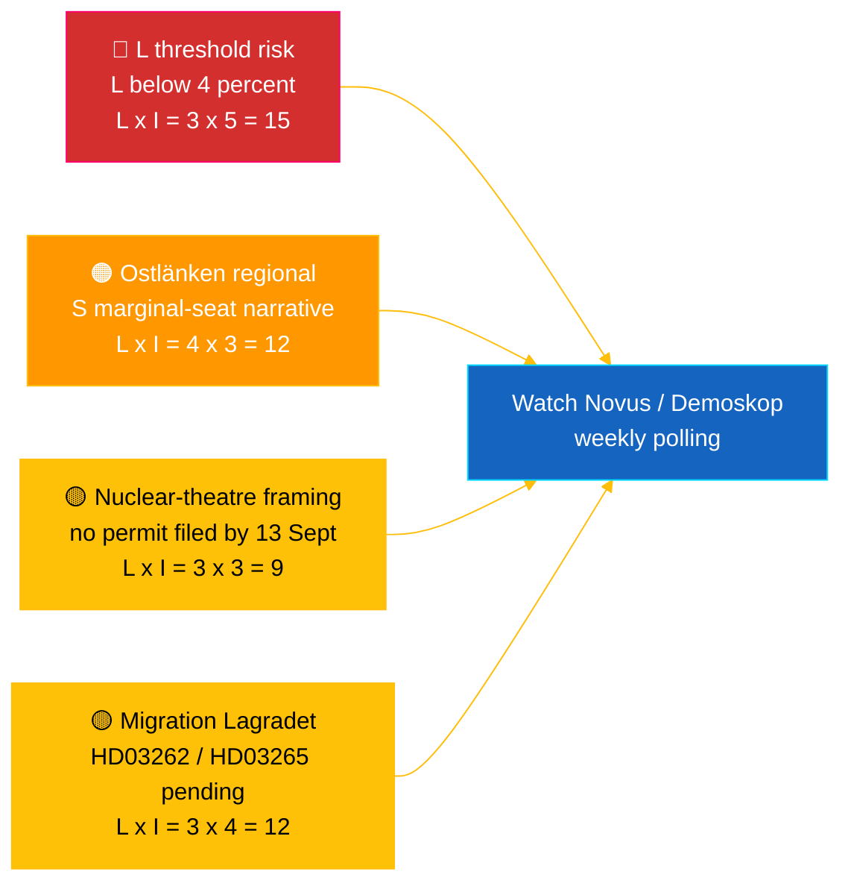

# Executive Brief — Riksdag Realtime Pulse 2026-05-04

**Classification**: 🟢 PUBLIC — Riksdagsmonitor Intelligence
**Audience**: Editors, duty monitors, researchers, engaged citizens
**Date**: 2026-05-04 (UTC)
**Days to Election 2026-09-13**: 132
**Workflow**: news-realtime-monitor
**Prepared by**: Riksdagsmonitor AI Intelligence System
**Overall confidence**: 🟩 HIGH [A2] — multi-source `dok_id` corroboration from Riksdag open data + IMF WEO Apr 2026
**Publication recommendation**: **PUBLISH** (EN + SV) — DIW-ranked top item ≥ 9.0
**PIRs served**: PIR-RT-001, PIR-RT-005, PIR-RT-006

---

## 🎯 BLUF

Sweden's Riksdag on 4 May 2026 produced its most concentrated pre-election legislative output to date: the Industry Committee (NU) recommended approval of direct-track nuclear facility permitting (`HD01NU19`, in force 17 June 2026) — the Tidö coalition's single largest structural energy achievement — while the 7th consecutive anti-gang tranche advanced via explosives control (`HD01FöU13`) and court-process reform (`HD01JuU9`), both effective 1 July 2026. Against this government-delivery wall, Social Democrat **Eva Lindh** filed interpellation `HD10463` against KD Infrastructure Minister **Andreas Carlson** over the cancelled Ostlänken Linköping station — a 20-year broken promise to a 500,000-person commuter region in competitive marginal-seat territory. The political-finance transparency report (`HD01KU39`) is calendared for plenary vote 16 June 2026, completing a four-track delivery narrative (energy, security, transparency, fiscal record) 89 days before the vote. **Confidence: 🟩 HIGH [A2]** — sources: Riksdag open data, IMF WEO Apr 2026.

---

## 🧭 3 Decisions This Brief Supports

| # | Decision | Who Decides | Deadline | Evidence |
|:-:|----------|-------------|:--------:|----------|
| 1 | **Editorial:** lead EN + SV breaking article with nuclear-reform-plus-Ostlänken-counter-narrative (dual frame, 2-h publish target) | Editor-in-chief | +2 h | `HD01NU19` committee recommendation + `HD10463` interpellation filed 2026-05-04 |
| 2 | **Forward-watch:** assign duty monitor to Carlson's Ostlänken answer (statutory deadline 25 May 2026) and 17 June nuclear law commencement | Duty monitor | 2026-05-25 / 2026-06-17 | PIR-RT-005, PIR-RT-006; `HD10463` interpellation register |
| 3 | **Risk:** raise L threshold-watch from monitoring to active tracking — coalition delivery cadence presupposes L >4% on 13 Sept; any Novus/Demoskop print <4.5% triggers coalition-mathematics revision | Analysis lead | Rolling weekly | `coalition-dynamics.md`, post-migration polling PIR-RT-003 |

---

## ⚡ 60-Second Read

- 🔴 **Nuclear permitting reform (`HD01NU19`)** — Industry Committee (NU) endorses direct-track permitting, bypassing the multi-stage Strålsäkerhetsmyndigheten (SSM) pipeline; **takes effect 17 June 2026**. Single largest structural legislative achievement of the Tidö term; delivers M/KD/L/SD's 2022 nuclear restart pledge with operational milestone before election day [🟩 HIGH — `HD01NU19`, NU committee record].
- 🟠 **Ostlänken broken-promise interpellation (`HD10463`)** — S MP **Eva Lindh** demands Infrastructure Minister **Andreas Carlson (KD)** explain cancellation of the planned Linköping Ostlänken station; statutory answer deadline **25 May 2026**. Third interpellation filed against Carlson in 10 days — coordinated regional S pressure on a 500,000-person commuter labour market [🟩 HIGH — `HD10463`, interpellation register].
- 🟢 **Seventh anti-gang tranche advances (`HD01FöU13` + `HD01JuU9`)** — explosives-permit reporting tightened (Defence Committee, 1 July 2026); criminal-procedure efficiency reform repeals *tilltrosbestämmelserna* and broadens early-interrogation evidence (Justice Committee, 1 July 2026). M/SD core "delivers on security" narrative reinforced [🟩 HIGH — `HD01FöU13`, `HD01JuU9`].
- 🟡 **Political-finance transparency (`HD01KU39`)** — Constitutional Affairs Committee registers report on political-process transparency (almost certainly processing proposition `HD03258` on party-financing disclosure); plenary vote **16 June 2026**; L/KD benefit from democratic-reform positioning. PIR-RT-002 answered: KU (not JuU/SfU) owns the file [🟧 MEDIUM — `HD01KU39`, calendar].
- 🔵 **Economic context (IMF WEO Apr 2026)** — Sweden public debt ≈ 34% of GDP (`GGXWDG_NGDP` 2026 projection) vs. eurozone >90%; 2026 real GDP growth `NGDP_RPCH` 2.0–2.1%; inflation declining (`PCPIEPCH`). Riksbank rate cuts through 2025–26 transmit to mortgage holders → M's "safe hands" frame [🟩 HIGH — provider: imf, dataflow: WEO_Apr_2026, vintage: April 2026].
- 🟣 **Cross-reference** — `HD01NU19` ties to the energy-policy thread running through propositions analysis (`../propositions/`); `HD10463` extends S regional broken-promise cluster covered in `opposition-analysis.md`; transparency `HD01KU39` processes `HD03258` from the 30 April propositions batch.
- 🩷 **Emerging vulnerability — "nuclear theatre" risk** — Opposition framing that the 17 June commencement is symbolic without filed permits before 13 September election day. If Vattenfall/Uniper/new entrants do not lodge an application during the 88-day pre-election window, the achievement narrative becomes contestable [🟧 MEDIUM — PIR-RT-006 open].
- ⚪ **Carry-forward** — Lagrådet advisory opinions on migration propositions `HD03262` and `HD03265` (PIR-RT-001) remain **OPEN — CRITICAL**; constitutional-quality review is the single most impactful unresolved input shaping the migration-reform political narrative through summer.

---

## 🗂️ Top Documents Table (DIW-ranked)

| Rank | dok_id | Title (short) | DIW | Confidence | Status |
|:----:|--------|---------------|:---:|:----------:|--------|
| 1 | `HD01NU19` | Nuclear permitting reform (direct-track) | 9.2 | 🟩 HIGH [A2] | Committee adopted — in force 17 June 2026 |
| 2 | `HD10463` | Ostlänken interpellation — Lindh (S) → Carlson (KD) | 8.6 | 🟩 HIGH [A2] | Filed — answer due 25 May 2026 |
| 3 | `HD01FöU13` | Explosives control reform | 7.5 | 🟩 HIGH [A2] | Committee adopted — in force 1 July 2026 |
| 4 | `HD01JuU9` | Criminal-procedure efficiency reform | 7.4 | 🟩 HIGH [A2] | Committee adopted — in force 1 July 2026 |
| 5 | `HD01KU39` | Political-process transparency | 7.0 | 🟧 MEDIUM [B2] | Registered — plenary vote 16 June 2026 |
| 6 | `HD01FiU49` | State debt management evaluation 2021–2025 | 6.4 | 🟩 HIGH [A2] | Registered — decision 11 June 2026 |

Rank order matches `significance-scoring.md`; any divergence triggers Pass-2 reconciliation.

---

## ⚠️ Risk & Threat Snapshot

| Risk | L | I | Score | Trigger | Source | Admiralty |
|------|:-:|:-:|:-----:|---------|--------|:---------:|
| Liberalerna below 4% threshold → Tidö loses majority | 3 | 5 | 15 | Any Novus/Demoskop print < 4.0% (95% CI lower bound < 4.0) | `coalition-dynamics.md` R1 | **[B2]** |
| S regional broken-promise narrative converts marginal Östergötland seats | 4 | 3 | 12 | Carlson 25-May answer judged inadequate by SVT/SR Östergötland editorial | `opposition-analysis.md` | **[A2]** |
| Lagrådet hostile opinion on `HD03262`/`HD03265` migration package | 3 | 4 | 12 | Lagrådet yttrande publishing within 30 d with constitutional concerns | PIR-RT-001 (`forward-indicators.md`) | **[A2]** |
| "Nuclear theatre" — `HD01NU19` in force but no permit application filed before 13 Sept | 3 | 3 | 9 | Vattenfall/Uniper/new entrant fails to lodge application by 1 Sept 2026 | PIR-RT-006 | **[B2]** |

---

## 🔮 Top Forward Trigger

> **Single most important event to watch next.**

**Andreas Carlson's written answer to interpellation `HD10463`, statutory deadline 25 May 2026.** Carlson's framing of the cancelled Linköping Ostlänken station — whether he concedes the broken-promise framing, defends the routing change on technical/budgetary grounds, or pivots to alternative regional infrastructure offers — determines whether the Östergötland narrative escalates to a full chamber interpellation debate before the summer recess. An evasive or technocratic answer is the highest-probability path to S converting the narrative into 1–2 marginal seat flips in Linköping/Norrköping. A substantive alternative-investment offer de-escalates the narrative. Either outcome materially shifts `coalition-mathematics.md` swing-seat estimates and triggers a Pass-2 rewrite of `electoral-implications.md`.

**Secondary trigger** (parallel watch): 16 June 2026 — `HD01KU39` plenary vote on political-finance transparency. Confirms or breaks the four-track government-delivery narrative (energy + security + transparency + fiscal record) 89 days before election.

---

## 📊 Strategic Assessment

**Confidence: 🟩 HIGH [A2]** — sources include Riksdag open data (`HD01NU19`, `HD10463`, `HD01FöU13`, `HD01JuU9`, `HD01KU39`, `HD01FiU49`), IMF WEO April 2026 vintage, and interpellation register.

The 4 May 2026 snapshot captures a Tidö coalition in **maximum legislative-velocity mode**: seven coalition reforms advancing in a single week, with concrete commencement dates spread between 1 June and 1 July 2026 (alcohol licensing, explosives control, criminal procedure, nuclear permitting). Each in-force date generates a delivery beat the four coalition parties can campaign on. The strategic vulnerability is asymmetric: M, KD, and SD benefit from the cascade; **L** absorbs the strain — the smallest coalition party is closest to the 4% Riksdag threshold and carries disproportionate seat-loss risk if its civil-liberties profile is diluted by the security/nuclear emphasis.

The S opposition's response is methodologically sharp: rather than contest the government on its strongest terrain (security, nuclear, fiscal), S is constructing a **distributed regional-grievance mosaic** — Ostlänken in Östergötland (`HD10463`), Scandinavian Mountain Airport (interpellation 428), Stockholm housing (interpellation 434) — each targeting a single minister (Carlson) from different constituencies. This produces local-media saturation in the exact marginal-seat territories that decide Riksdag majorities under Sweden's proportional system with regional list dynamics.

The IMF macro frame is favourable to the incumbent: public debt ≈ 34% of GDP, declining inflation, growth around 2%. Riksbank rate cuts transmit visibly to mortgage holders. The economic narrative is M's strongest asset, but the political-finance transparency vote on 16 June (`HD01KU39`) is owned by L+KD, not M — a deliberate intra-coalition seat-rotation of credit.

**Election 2026 lens**: The current trajectory holds Tidö near 175 seats — at the exact majority threshold. L's threshold risk (PIR-RT-003) is the single most important electoral variable. Migration Lagrådet opinion (PIR-RT-001) is the single most important political-narrative variable. Carlson's Ostlänken answer (PIR-RT-005) is the single most important regional-seat variable. All three resolve within 5 weeks of this brief's publication.

---

## 📎 Links

| Link | Path |
|------|------|
| Article | [`article.md`](article.md) |
| Synthesis summary | [`synthesis-summary.md`](synthesis-summary.md) |
| Core synthesis | [`core-synthesis.md`](core-synthesis.md) |
| Coalition dynamics | [`coalition-dynamics.md`](coalition-dynamics.md) |
| Opposition analysis | [`opposition-analysis.md`](opposition-analysis.md) |
| Electoral implications | [`electoral-implications.md`](electoral-implications.md) |
| Economic context (IMF) | [`economic-context.md`](economic-context.md) |
| Forward indicators | [`forward-indicators.md`](forward-indicators.md) |
| Risk/opportunity matrix | [`risk-opportunity-matrix.md`](risk-opportunity-matrix.md) |
| Scenario analysis | [`scenario-analysis.md`](scenario-analysis.md) |
| Methodology notes | [`methodology-notes.md`](methodology-notes.md) |
| Data manifest | [`data-download-manifest.md`](data-download-manifest.md) |
| Per-document analyses | [`documents/`](documents/) |

---

## 📝 Document Control

- **Brief ID**: `EB-2026-05-04-001`
- **Generated**: 2026-05-16 (backfill — created from existing Pass-2 analysis artefacts)
- **Template path**: [`analysis/templates/executive-brief.md`](../../../templates/executive-brief.md)
- **Owning methodology**: [`per-artifact-methodologies.md` § executive-brief](../../../methodologies/per-artifact-methodologies.md#executive-brief)
- **Owning gate**: [`05-analysis-gate.md`](../../../../.github/prompts/05-analysis-gate.md) Check 1 + Check 7
- **Output family**: A — Core Synthesis
- **Classification**: 🟢 PUBLIC
- **Backfill note**: This brief was authored on 2026-05-16 to close a gap discovered during a cross-folder `article.md` ↔ `executive-brief.md` audit. All evidence is drawn from the in-folder Pass-2 artefacts (`synthesis-summary.md`, `core-synthesis.md`, `article.md`); no external source has been added that was not already cited in the original Pass-2 analysis.

*Economic provenance: provider: imf, dataflow: WEO_Apr_2026, indicators: NGDP_RPCH / GGXWDG_NGDP / PCPIEPCH, vintage: April 2026, retrieved_at: 2026-05-04. Riksdag data retrieved via riksdag-regering API on 2026-05-04. Riksdagsmonitor is produced by Hack23 AB; this brief represents an independent editorial assessment based on publicly available parliamentary documents.*
