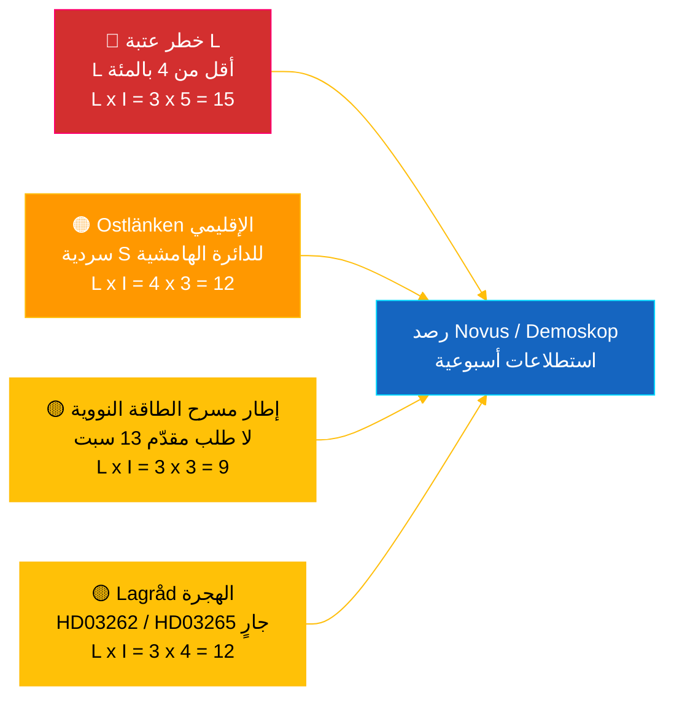

# إحاطة استخباراتية — النبض الفوري للريكسداغ 2026-05-04

**التصنيف**: 🟢 عام — Riksdagsmonitor Intelligence
**الجمهور المستهدف**: المحررون، المناوبون، الباحثون، المواطنون المهتمون
**التاريخ**: 2026-05-04 (بالتوقيت العالمي)
**الأيام المتبقية حتى انتخابات 2026-09-13**: 132
**سير العمل**: news-realtime-monitor
**أعدّه**: نظام الذكاء الاصطناعي Riksdagsmonitor
**مستوى الثقة الإجمالي**: 🟩 مرتفع [A2] — تحقق متعدد المصادر عبر `dok_id` من بيانات الريكسداغ المفتوحة + تقرير آفاق الاقتصاد العالمي لصندوق النقد الدولي أبريل 2026
**قرار النشر**: **نشر** (EN + AR) — الموضوع الأول بتصنيف DIW ≥ 9.0
**متطلبات المعلومات ذات الأولوية المُجابة**: PIR-RT-001، PIR-RT-005، PIR-RT-006

---

## 🎯 ملخص تنفيذي (BLUF)

أنتج الريكسداغ السويدي في 4 مايو 2026 أعلى كثافة تشريعية قبل الانتخابات حتى الآن: أقرّت لجنة الصناعة (NU) منح التراخيص المباشرة للمفاعلات النووية (`HD01NU19`، يدخل حيز التنفيذ في 17 يونيو 2026) — الإنجاز الهيكلي الأبرز لتحالف تيدو في السياسة الطاقوية — فيما تقدّمت الحزمة السابعة المتتالية لمكافحة العصابات عبر إصلاح ضبط المتفجرات (`HD01FöU13`) وإصلاح الإجراءات الجزائية (`HD01JuU9`)، كلاهما يدخل حيز التنفيذ في 1 يوليو 2026. في مواجهة هذا الجدار من الإنجازات الحكومية، تقدّمت النائبة الاشتراكية **إيفا ليند** باستجواب `HD10463` لوزير البنية التحتية أندرياس كارلسون (KD) بشأن إلغاء محطة لينشوبينغ على خط Ostlänken — وعد مكسور منذ 20 عامًا أمام منطقة ركوب يومية تضم 500,000 شخص في دائرة انتخابية ذات هامش تنافسي. من المقرر التصويت على تقرير الشفافية في تمويل الأحزاب (`HD01KU39`) في الجلسة العامة في 16 يونيو 2026، مما يستكمل رواية إنجاز رباعية المسارات (الطاقة والأمن والشفافية والمحصلة المالية) قبل 89 يومًا من الانتخابات. **مستوى الثقة: 🟩 مرتفع [A2]** — المصادر: بيانات الريكسداغ المفتوحة، صندوق النقد الدولي WEO أبريل 2026.

---

## 🧭 ثلاثة قرارات يدعمها هذا التقرير

| # | القرار | صاحب القرار | الموعد النهائي | الأساس |
|:-:|--------|-------------|:--------------:|--------|
| 1 | **تحريري:** تقديم مقال EN + AR عاجل بالإطار المزدوج (إصلاح الطاقة النووية + الرواية المضادة لـ Ostlänken) في غضون ساعتين | رئيس التحرير | +2 س | قرار لجنة `HD01NU19` + استجواب `HD10463` المقدّم في 2026-05-04 |
| 2 | **تغطية استباقية:** تكليف مناوب بمتابعة رد كارلسون على Ostlänken (الأجل القانوني للرد: 25 مايو 2026) ودخول قانون الطاقة النووية حيز التنفيذ في 17 يونيو | المناوب | 2026-05-25 / 2026-06-17 | PIR-RT-005، PIR-RT-006؛ سجل الاستجوابات `HD10463` |
| 3 | **مخاطر:** رفع مستوى رصد عتبة L من المراقبة إلى التتبع النشط — منطق أداء الائتلاف تفترض تجاوز L نسبة 4% في 13 سبتمبر؛ أي نتيجة Novus/Demoskop <4.5% تُطلق مراجعة حسابية للائتلاف | رئيس التحليل | أسبوعيًا مستمرًا | `coalition-dynamics.md`، رأي ما بعد الهجرة PIR-RT-003 |

---

## ⚡ قراءة في 60 ثانية

- 🔴 **إصلاح الطاقة النووية نحو الترخيص المباشر (`HD01NU19`)** — وافقت لجنة الصناعة (NU) على الترخيص المباشر متجاوزةً خط أنابيب الهيئة النووية (SSM) متعدد المراحل؛ **يدخل حيز التنفيذ في 17 يونيو 2026**. أكبر إنجاز تشريعي هيكلي في عهد تيدو؛ يُنجز وعد M/KD/L/SD بإعادة تشغيل الطاقة النووية عام 2022 قبل يوم الانتخابات [🟩 مرتفع — `HD01NU19`، محضر لجنة NU].
- 🟠 **استجواب خرق وعد Ostlänken (`HD10463`)** — تطلب النائبة S **إيفا ليند** من الوزير **أندرياس كارلسون (KD)** تفسير إلغاء محطة لينشوبينغ على خط Ostlänken؛ الأجل القانوني للرد **25 مايو 2026**. الاستجواب الثالث المقدّم ضد كارلسون في 10 أيام — ضغط S إقليمي منسق على منطقة ركوب 500,000 شخص [🟩 مرتفع — `HD10463`، سجل الاستجوابات].
- 🟢 **الحزمة السابعة لمكافحة العصابات تتقدم (`HD01FöU13` + `HD01JuU9`)** — اشتراط تشديد تراخيص المتفجرات (لجنة الدفاع، 1 يوليو 2026)؛ يُلغي إصلاح الإجراءات الجزائية *tilltrosbestämmelserna* ويوسع أدلة الاستجواب المبكر (لجنة العدالة، 1 يوليو 2026). يتعزز السرد الجوهري لـ M/SD «إنجاز ما وُعد به في الأمن» [🟩 مرتفع — `HD01FöU13`، `HD01JuU9`].
- 🟡 **شفافية تمويل الأحزاب (`HD01KU39`)** — تُسجّل لجنة الدستور تقريرًا عن الشفافية في العمليات السياسية (يتناول على الأرجح اقتراح `HD03258` بشأن الإفصاح عن تمويل الأحزاب)؛ تصويت عام **16 يونيو 2026**؛ L/KD يستفيدان من موقعهما في إصلاح الديمقراطية. تمت الإجابة على PIR-RT-002: KU (ليس JuU/SfU) هو المسؤول عن الملف [🟧 متوسط — `HD01KU39`، التقويم].
- 🔵 **السياق الاقتصادي (صندوق النقد الدولي WEO أبريل 2026)** — الدين العام السويدي ≈ 34% من الناتج المحلي الإجمالي (`GGXWDG_NGDP` توقعات 2026) مقابل متوسط منطقة اليورو >90%؛ نمو الناتج المحلي الإجمالي الحقيقي 2026 `NGDP_RPCH` 2.0–2.1%؛ التضخم يتراجع (`PCPIEPCH`). خفضت Riksbank أسعار الفائدة 2025–26 لتصل إلى أصحاب الرهن العقاري → سردية M «الأيادي الأمينة» [🟩 مرتفع — المزود: imf، تدفق البيانات: WEO_Apr_2026، الإصدار: أبريل 2026].
- 🟣 **مرجع متقاطع** — ترتبط `HD01NU19` بخيط السياسة الطاقوية في تحليل المقترحات (`../propositions/`)؛ تُطيل `HD10463` مجموعة خرق الوعود الإقليمي لـ S من `opposition-analysis.md`؛ الشفافية `HD01KU39` تتناول `HD03258` من حزمة مقترحات 30 أبريل.
- 🩷 **ثغرة ناشئة — مخاطر «مسرح الطاقة النووية»** — إطار المعارضة الذي يصف دخول القانون حيز التنفيذ في 17 يونيو بأنه رمزي دون تقديم طلب قبل يوم الانتخابات في 13 سبتمبر. إذا لم تُقدّم فاتنفال/يونيبر/جهة جديدة طلبًا خلال نافذة الـ88 يومًا قبل الانتخابات، قد تصبح سردية الأداء قابلة للطعن [🟧 متوسط — PIR-RT-006 مفتوح].
- ⚪ **منقول** — آراء Lagråd بشأن مقترحات الهجرة `HD03262` و`HD03265` (PIR-RT-001) لا تزال **مفتوحة — حرجة**؛ مراجعة الجودة الدستورية هي العامل الأكثر تأثيرًا غير المحسوم الذي يُشكّل السردية السياسية لإصلاح الهجرة خلال الموسم الصيفي.

---

## 🗂️ المستندات المصنّفة (ترتيب DIW)

| الترتيب | dok_id | العنوان (مختصر) | DIW | الثقة | الحالة |
|:-------:|--------|-----------------|:---:|:-----:|--------|
| 1 | `HD01NU19` | إصلاح ترخيص الطاقة النووية (مسار مباشر) | 9.2 | 🟩 مرتفع [A2] | موافقة اللجنة — يدخل حيز التنفيذ 17 يونيو 2026 |
| 2 | `HD10463` | استجواب Ostlänken — ليند (S) → كارلسون (KD) | 8.6 | 🟩 مرتفع [A2] | مقدّم — الرد مستحق 25 مايو 2026 |
| 3 | `HD01FöU13` | إصلاح ضبط المتفجرات | 7.5 | 🟩 مرتفع [A2] | موافقة اللجنة — يدخل حيز التنفيذ 1 يوليو 2026 |
| 4 | `HD01JuU9` | إصلاح الإجراءات الجزائية | 7.4 | 🟩 مرتفع [A2] | موافقة اللجنة — يدخل حيز التنفيذ 1 يوليو 2026 |
| 5 | `HD01KU39` | الشفافية في العمليات السياسية | 7.0 | 🟧 متوسط [B2] | مسجّل — تصويت عام 16 يونيو 2026 |
| 6 | `HD01FiU49` | تقييم إدارة الدين العام 2021–2025 | 6.4 | 🟩 مرتفع [A2] | مسجّل — قرار 11 يونيو 2026 |

---

## ⚠️ نظرة عامة على المخاطر والتهديدات

| الخطر | الاحتمالية | الأثر | الدرجة | المشغّل | المصدر | Admiralty |
|-------|:----------:|:------:|:------:|---------|--------|:---------:|
| Liberalerna أقل من عتبة 4% → تيدو يفقد الأغلبية | 3 | 5 | 15 | أي نتيجة Novus/Demoskop <4.0% (الحد الأدنى لفاصل ثقة 95% <4.0) | `coalition-dynamics.md` R1 | **[B2]** |
| سردية خرق الوعود الإقليمية لـ S تُحوّل مقاعد هامشية في Östergötland | 4 | 3 | 12 | تُقيّم تحرير SVT/SR Östergötland ردّ كارلسون في 25 مايو بأنه غير كافٍ | `opposition-analysis.md` | **[A2]** |
| رأي Lagråd المعادي حول حزمة الهجرة `HD03262`/`HD03265` | 3 | 4 | 12 | نشر رأي Lagråd في 30 يومًا مع اعتراضات دستورية | PIR-RT-001 (`forward-indicators.md`) | **[A2]** |
| «مسرح الطاقة النووية» — دخول `HD01NU19` حيز التنفيذ دون طلب مقدّم قبل 13 سبتمبر | 3 | 3 | 9 | تخلّف فاتنفال/يونيبر/جهة جديدة عن تقديم الطلب قبل 1 سبتمبر 2026 | PIR-RT-006 | **[B2]** |

---

## 🔮 أبرز المحفزات المستقبلية

**الرد الكتابي لأندرياس كارلسون على الاستجواب `HD10463`، الأجل القانوني للرد 25 مايو 2026.** طريقة تأطير كارلسون لإلغاء محطة لينشوبينغ على خط Ostlänken — سواء اعترف بخرق الوعد، أو دافع عن تغيير المسار بأسباب تقنية/ميزانياتية، أو تحوّل نحو عروض بنية تحتية إقليمية بديلة — ستحدد ما إذا كانت سردية Östergötland ستتصاعد إلى نقاش استجواب كامل في الجلسة العامة قبل التعليق الصيفي. الرد التهرّبي أو التكنوقراطي هو أكثر الطرق احتمالًا لـ S لتحويل السردية إلى 1–2 تحوّلات هامشية في المقاعد في لينشوبينغ/نورشوبينغ. عرض استثماري بديل جوهري سيُهدئ السردية. كلا النتيجتين تُزيحان تقييمات الدوائر الهامشية في `coalition-mathematics.md` وتُطلقان مراجعة Pass-2 لـ `electoral-implications.md`.

**المحفز الثانوي** (رصد متوازٍ): 16 يونيو 2026 — تصويت عام `HD01KU39` بشأن شفافية التمويل السياسي. يؤكد أو يكسر السردية الرباعية المسارات للحكومة (الطاقة + الأمن + الشفافية + المحصلة المالية) قبل 89 يومًا من الانتخابات.

---

## 📊 التقييم الاستراتيجي

**مستوى الثقة: 🟩 مرتفع [A2]** — تشمل المصادر بيانات الريكسداغ المفتوحة (`HD01NU19`، `HD10463`، `HD01FöU13`، `HD01JuU9`، `HD01KU39`، `HD01FiU49`)، والإصدار الأخير من صندوق النقد الدولي WEO أبريل 2026، وسجل الاستجوابات.

يلتقط المشهد في 4 مايو 2026 تحالف تيدو في **أقصى سرعة تشريعية**: سبعة إصلاحات ائتلافية تتقدم في أسبوع واحد، مع تواريخ سريان محددة تمتد من 1 يونيو إلى 1 يوليو 2026. كل تاريخ سريان يُولّد إيقاع إنجاز يمكن للأحزاب الأربعة أن تُحمّله في حملاتها الانتخابية. الثغرة الاستراتيجية غير متماثلة: M وKD وSD يستفيدون من التتالي؛ بينما يتحمّل **L** العبء — الحزب الأصغر في الائتلاف هو الأقرب لعتبة 4% ويحمل خطر خسارة مقاعد غير متناسب.

ردّ معارضة S دقيق منهجيًا: بدلًا من مواجهة الحكومة على أقوى أراضيها (الأمن، الطاقة النووية، الاقتصاد)، تبني S **فسيفساء سخط إقليمية موزّعة** — Ostlänken في Östergötland (`HD10463`)، Scandinavian Mountain Airport (استجواب 428)، الإسكان في ستوكهولم (استجواب 434) — كلٌّ موجَّه ضد وزير واحد (كارلسون) من دوائر مختلفة.

الإطار الاقتصادي الكلي لصندوق النقد الدولي مؤاتٍ للحكومة الحاكمة: الدين العام ≈ 34% من الناتج المحلي الإجمالي، تضخم متراجع، نمو نحو 2%. السردية الاقتصادية هي أقوى أصول M.

**منظور انتخابات 2026**: المسار الحالي يُبقي تيدو قرب 175 مقعدًا — عند حدود الأغلبية بالضبط. خطر عتبة L (PIR-RT-003) هو المتغير الانتخابي الأهم منفردًا. رأي Lagråd حول الهجرة (PIR-RT-001) هو المتغير الوحيد الأهم للسردية السياسية. رد كارلسون على Ostlänken (PIR-RT-005) هو المتغير الوحيد الأهم للمقاعد الإقليمية. تُحسم الثلاثة في غضون 5 أسابيع من تاريخ نشر هذه الإحاطة.

---

## 📎 الروابط

| الرابط | المسار |
|--------|--------|
| المقال | [`article.md`](article.md) |
| ملخص التوليف | [`synthesis-summary.md`](synthesis-summary.md) |
| التوليف الجوهري | [`core-synthesis.md`](core-synthesis.md) |
| ديناميكيات الائتلاف | [`coalition-dynamics.md`](coalition-dynamics.md) |
| تحليل المعارضة | [`opposition-analysis.md`](opposition-analysis.md) |
| التداعيات الانتخابية | [`electoral-implications.md`](electoral-implications.md) |
| السياق الاقتصادي (صندوق النقد) | [`economic-context.md`](economic-context.md) |
| المؤشرات الاستشرافية | [`forward-indicators.md`](forward-indicators.md) |
| مصفوفة المخاطر/الفرص | [`risk-opportunity-matrix.md`](risk-opportunity-matrix.md) |
| تحليل السيناريوهات | [`scenario-analysis.md`](scenario-analysis.md) |
| الملاحظات المنهجية | [`methodology-notes.md`](methodology-notes.md) |
| قائمة البيانات | [`data-download-manifest.md`](data-download-manifest.md) |
| تحليلات المستندات | [`documents/`](documents/) |

---

## 📝 ضبط الوثيقة

- **معرّف الإحاطة**: `EB-2026-05-04-001`
- **تاريخ الإنشاء**: 2026-05-16 (تعويض متأخر — أُنشئ من نتائج تحليل المرور الثاني الموجودة)
- **مسار القالب**: [`analysis/templates/executive-brief.md`](../../../templates/executive-brief.md)
- **منهجية الملكية**: [`per-artifact-methodologies.md` § executive-brief](../../../methodologies/per-artifact-methodologies.md#executive-brief)
- **بوابة الملكية**: [`05-analysis-gate.md`](../../../../.github/prompts/05-analysis-gate.md) فحص 1 + فحص 7
- **عائلة المخرجات**: A — التوليف الجوهري
- **التصنيف**: 🟢 عام

*المصدر الاقتصادي: المزود: imf، تدفق البيانات: WEO_Apr_2026، المؤشرات: NGDP_RPCH / GGXWDG_NGDP / PCPIEPCH، الإصدار: أبريل 2026، تاريخ الاسترداد: 2026-05-04. بيانات الريكسداغ مسترداة عبر API riksdag-regering في 2026-05-04. يُنتج Riksdagsmonitor بواسطة Hack23 AB؛ هذه الإحاطة تمثّل تقييمًا تحريريًا مستقلًا مستندًا إلى وثائق برلمانية متاحة للعموم.*

<!-- source-sha: f8cfbe724a92e48089f650d9e1f52abe004ed7f7 -->
