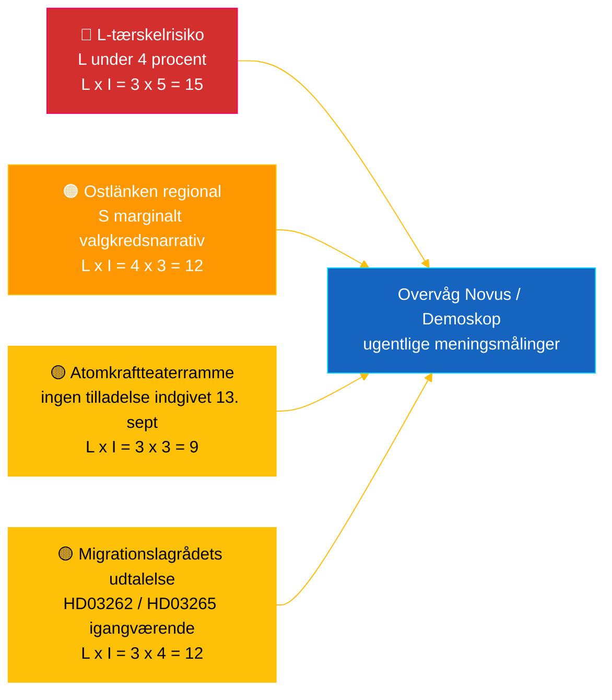

# Efterretningsbriefing — Realtidspuls Riksdag 2026-05-04

**Klassificering**: 🟢 OFFENTLIG — Riksdagsmonitor Intelligence
**Målgrupp**: Redaktører, vagthavende, forskere, engagerede borgere
**Dato**: 2026-05-04 (UTC)
**Dage til valget 2026-09-13**: 132
**Workflow**: news-realtime-monitor
**Udarbejdet af**: Riksdagsmonitor AI Intelligence System
**Samlet konfidensniveau**: 🟩 HØJ [A2] — flerkildekorreborering via `dok_id` fra åbne Riksdag-data + IMF WEO apr 2026
**Publiceringsbeslutning**: **PUBLICER** (EN + DA) — DIW-rangeret tophistorie ≥ 9,0
**PIR'er besvaret**: PIR-RT-001, PIR-RT-005, PIR-RT-006

---

## 🎯 BLUF

Sveriges Riksdag producerede den 4. maj 2026 sin hidtil mest koncentrerede lovgivningsoutput før valget: Erhvervsudvalget (NU) godkendte direkte sporsgodkendelse af atomkraftanlæg (`HD01NU19`, træder i kraft 17. juni 2026) — Tidø-koalitionens eneste største strukturelle energipolitiske bedrift — mens den 7. på hinanden følgende antikriminalitetsindsats avancerede via sprængstofreglering (`HD01FöU13`) og reform af strafferetlige processer (`HD01JuU9`), begge med ikrafttrædelse 1. juli 2026. Over for denne mur af regeringslevering indgav socialdemokraten **Eva Lindh** en interpellation `HD10463` mod KD's infrastrukturminister **Andreas Carlson** om den annullerede Ostlänken Linköping-stationstilføjelse — et 20 år gammelt løftebrud mod en 500.000-personers pendlerregion i konkurrencedygtigt valgkredsmarginalterritorium. Transparensrapporten om politisk finansiering (`HD01KU39`) er planlagt til plenarvote den 16. juni 2026, som fuldfører et firesporet leveringsnarrativ (energi, sikkerhed, transparens, finansielt resultat) 89 dage før valget. **Konfidensniveau: 🟩 HØJ [A2]** — kilder: Riksdagens åbne data, IMF WEO apr 2026.

---

## 🧭 3 beslutninger dette briefing understøtter

| # | Beslutning | Beslutningstager | Frist | Grundlag |
|:-:|------------|------------------|:-----:|---------|
| 1 | **Redaktionel:** lead EN + DA breaking-artikel med atomkraftreform-plus-Ostlänken-modnarrativ (dobbeltramme, 2-timers publiceringsmål) | Chefredaktør | +2 t | `HD01NU19` udvalgsafgørelse + `HD10463` interpellation indgivet 2026-05-04 |
| 2 | **Fremadrettet dækning:** tildel vagthavende til at følge Carlsons Ostlänken-svar (lovpligtig svarsfrist 25. maj 2026) og atomlovens ikrafttrædelse 17. juni | Vagthavende | 2026-05-25 / 2026-06-17 | PIR-RT-005, PIR-RT-006; `HD10463` interpellationsregister |
| 3 | **Risiko:** forhøj L-tærskelovervaagningsniveau fra observation til aktiv sporing — koalitionens leveringsdynamik forudsætter at L overstiger 4 % den 13. sept; ethvert Novus/Demoskop-resultat <4,5 % udløser koalitionsmatematisk revision | Analyseleder | Rullende ugentligt | `coalition-dynamics.md`, post-migrationsopinion PIR-RT-003 |

---

## ⚡ 60-sekunders læsning

- 🔴 **Atomkraftreform til direkte sporsgodkendelse (`HD01NU19`)** — Erhvervsudvalget (NU) godkender direkte sporsgodkendelse, omgår Strålsikkerhedsmyndighedens (SSM) fleretapspipeline; **træder i kraft 17. juni 2026**. Tidø-mandatperiodens eneste største strukturelle lovgivningsbedrift; lever M/KD/L/SD's atomkraftgenstartsløfte fra 2022 med operationel milepælopfyldelse inden valgdagen [🟩 HØJ — `HD01NU19`, NU's udvalgsprotokol].
- 🟠 **Ostlänken-løftebrud-interpellation (`HD10463`)** — S-medlem **Eva Lindh** kræver at infrastrukturminister **Andreas Carlson (KD)** redegør for annulleringen af den planlagte Linköping Ostlänken-station; lovpligtig svarsfrist **25. maj 2026**. Tredje interpellation indgivet mod Carlson på 10 dage — koordineret regionalt S-pres på en 500.000-personers pendlingsregion [🟩 HØJ — `HD10463`, interpellationsregistret].
- 🟢 **Syvende gangbekæmpelsesindsats avancerer (`HD01FöU13` + `HD01JuU9`)** — Tilladelseskrav til sprængstoffer skærpes (Forsvarsudvalget, 1. juli 2026); reform af strafferetlige processer afskaffer *tilltrosbestämmelserna* og udvider tidligt forhørsbevismateriale (Retsudvalget, 1. juli 2026). M/SD's kernefortælling om "leverer på sikkerhed" styrkes [🟩 HØJ — `HD01FöU13`, `HD01JuU9`].
- 🟡 **Politisk finansieringstransparens (`HD01KU39`)** — Forfatningsudvalget registrerer betænkning om transparens i politiske processer (behandler med stor sandsynlighed proposition `HD03258` om redegørelse for partifinansering); plenarvote **16. juni 2026**; L/KD drager fordel af demokratireformpositionering. PIR-RT-002 besvaret: KU (ikke JuU/SfU) ejer sagen [🟧 MIDDEL — `HD01KU39`, kalenderen].
- 🔵 **Ekonomisk kontekst (IMF WEO apr 2026)** — Sveriges offentlige gæld ≈ 34 % af BNP (`GGXWDG_NGDP` 2026-prognose) mod eurozonegennemsnittet >90 %; reel BNP-vækst 2026 `NGDP_RPCH` 2,0–2,1 %; inflation falder (`PCPIEPCH`). Riksbankens rentenedsættelser 2025–26 når boliglåntagere → M's "sikre hænder"-fortælling [🟩 HØJ — udbyder: imf, datastrøm: WEO_Apr_2026, vintage: april 2026].
- 🟣 **Krydshenvisning** — `HD01NU19` knytter til energipolitiktråden i propositionsanalysen (`../propositions/`); `HD10463` forlænger S's regionale løftebrudkluster fra `opposition-analysis.md`; transparens `HD01KU39` behandler `HD03258` fra 30. april-propositionspakken.
- 🩷 **Fremvoksende sårbarhed — "atomkraftteater"-risiko** — Oppositionens ramme om, at ikrafttrædelsen 17. juni er symbolsk uden indgivet ansøgning inden valgdagen den 13. september. Hvis Vattenfall/Uniper/ny aktør ikke indgiver ansøgning inden for det 88-dages pre-valgsvindue, risikerer præstationsfortællingen at blive anfægtelig [🟧 MIDDEL — PIR-RT-006 åben].
- ⚪ **Overført** — Lagrådets udtalelser om migrationspropositionerne `HD03262` og `HD03265` (PIR-RT-001) forbliver **ÅBNE — KRITISKE**; den konstitutionelle kvalitetsgennemgang er den eneste mest indflydelsesrige uløste faktor der former migrationsreformens politiske fortælling i sommersæsonen.

---

## 🗂️ Topopstilling (DIW-rangeret)

| Rang | dok_id | Titel (kort) | DIW | Konfidens | Status |
|:----:|--------|--------------|:---:|:---------:|--------|
| 1 | `HD01NU19` | Atomkrafttilladelsesreform (direkte spor) | 9,2 | 🟩 HØJ [A2] | Udvalg godkendt — træder i kraft 17. juni 2026 |
| 2 | `HD10463` | Ostlänken-interpellation — Lindh (S) → Carlson (KD) | 8,6 | 🟩 HØJ [A2] | Indgivet — svar forfaldent 25. maj 2026 |
| 3 | `HD01FöU13` | Reform af sprængstofreglering | 7,5 | 🟩 HØJ [A2] | Udvalg godkendt — træder i kraft 1. juli 2026 |
| 4 | `HD01JuU9` | Reform af strafferetlige processer | 7,4 | 🟩 HØJ [A2] | Udvalg godkendt — træder i kraft 1. juli 2026 |
| 5 | `HD01KU39` | Transparens i politiske processer | 7,0 | 🟧 MIDDEL [B2] | Registreret — plenarvote 16. juni 2026 |
| 6 | `HD01FiU49` | Statsgældsforvaltningsevaluering 2021–2025 | 6,4 | 🟩 HØJ [A2] | Registreret — beslutning 11. juni 2026 |

---

## ⚠️ Risiko- og trusselbillede

| Risiko | L | I | Score | Udløser | Kilde | Admiralty |
|--------|:-:|:-:|:-----:|---------|-------|:---------:|
| Liberalerna under 4%-tærsklen → Tidø mister majoritet | 3 | 5 | 15 | Ethvert Novus/Demoskop-resultat <4,0 % (95 % CI nedre grænse <4,0) | `coalition-dynamics.md` R1 | **[B2]** |
| S's regionale løftebrudnarrativ konverterer marginale Østergötland-mandater | 4 | 3 | 12 | Carlsons 25. maj-svar vurderet utilstrækkeligt af SVT/SR Østergötlands redaktion | `opposition-analysis.md` | **[A2]** |
| Lagrådets fjendtlige udtalelse om migrationspakken `HD03262`/`HD03265` | 3 | 4 | 12 | Lagrådets udtalelse offentliggjort inden for 30 d med forfatningsindvendinger | PIR-RT-001 (`forward-indicators.md`) | **[A2]** |
| "Atomkraftteater" — `HD01NU19` ikrafttrædelse uden indgivet tilladelsesansøgning inden 13. sept | 3 | 3 | 9 | Vattenfall/Uniper/ny aktør undlader at indgive ansøgning senest 1. sept 2026 | PIR-RT-006 | **[B2]** |

---

## 🔮 Vigtigste fremtidige udløsere

**Andreas Carlsons skriftlige svar på interpellation `HD10463`, lovpligtig svarsfrist 25. maj 2026.** Carlsons måde at ramme den annullerede Linköping Ostlänken-station — om han indrømmer løftebrud, forsvarer routeændringen på tekniske/budgetmæssige grunde eller svinger mod alternative regionale infrastrukturtilbud — afgør om Østergötland-narrativet eskalerer til en fuld interpellationsdebat i kammeret inden sommerudsættelsen. Et undvigent eller teknokratisk svar er den mest sandsynlige vej for S til at omdanne narrativet til 1–2 marginale mandatskift i Linköping/Norrköping. Et substantielt alternativt investeringstilbud de-eskalerer narrativet. Begge udfald forskyver `coalition-mathematics.md`'s marginale valgkredsvurderinger og udløser en Pass-2-omskrivning af `electoral-implications.md`.

**Sekundær udløser** (parallel overvågning): 16. juni 2026 — `HD01KU39` plenarvote om politisk finansieringstransparens. Bekræfter eller bryder det firesporede leveringsnarrativ for regeringen (energi + sikkerhed + transparens + finansielt resultat) 89 dage før valget.

---

## 📊 Strategisk vurdering

**Konfidensniveau: 🟩 HØJ [A2]** — kilder inkluderer Riksdagens åbne data (`HD01NU19`, `HD10463`, `HD01FöU13`, `HD01JuU9`, `HD01KU39`, `HD01FiU49`), IMF WEO april 2026 vintage og interpellationsregistret.

Øjebliksbilledet fra 4. maj 2026 fanger en Tidø-koalition i **maksimal lovgivningshastighed**: syv koalitionsreformer avancerer i løbet af én uge, med konkrete ikrafttrædelsesdatoer spredt fra 1. juni til 1. juli 2026. Hver ikrafttrædelsesdato genererer en leveringstakt, som de fire koalitionspartier kan føre valgkamp på. Den strategiske sårbarhed er asymmetrisk: M, KD og SD drager fordel af kaskaden; **L** absorberer belastningen — det mindste koalitionsparti er tættest på 4 %-grænsen og bærer uforholdsmæssig mandatrisiko.

S-oppositionens svar er metodologisk præcist: i stedet for at udfordre regeringen på dens stærkeste grund (sikkerhed, atomenergi, økonomi) bygger S en **distribueret regional-utilfredshedsmosaik** — Ostlänken i Østergötland (`HD10463`), Scandinavian Mountain Airport (interpellation 428), Stockholms boliger (interpellation 434) — hver rettet mod en enkelt minister (Carlson) fra forskellige valgkredse.

IMF's makroramme er gunstig for den siddende regering: offentlig gæld ≈ 34 % af BNP, faldende inflation, vækst på ca. 2 %. Det økonomiske narrativ er M's stærkeste aktiv.

**Valg 2026-linse**: Den nuværende kurs holder Tidø nær 175 mandater — præcist ved majoritetsgrænserne. L's tærskelrisiko (PIR-RT-003) er den eneste vigtigste valgvariabel. Lagrådets migrationsudtalelse (PIR-RT-001) er den eneste vigtigste politiske narrativvariabel. Carlsons Ostlänken-svar (PIR-RT-005) er den eneste vigtigste regionale mandatvariabel. Alle tre løses inden for 5 uger fra denne briefings publiceringsdato.

---

## 📎 Links

| Link | Sti |
|------|-----|
| Artikel | [`article.md`](article.md) |
| Synteseoverview | [`synthesis-summary.md`](synthesis-summary.md) |
| Kernesyntese | [`core-synthesis.md`](core-synthesis.md) |
| Koalitionsdynamik | [`coalition-dynamics.md`](coalition-dynamics.md) |
| Oppositionsanalyse | [`opposition-analysis.md`](opposition-analysis.md) |
| Valgimplikationer | [`electoral-implications.md`](electoral-implications.md) |
| Ökonomisk kontekst (IMF) | [`economic-context.md`](economic-context.md) |
| Fremtidsindikatorer | [`forward-indicators.md`](forward-indicators.md) |
| Risiko-/mulighedsmatrix | [`risk-opportunity-matrix.md`](risk-opportunity-matrix.md) |
| Scenarieanalyse | [`scenario-analysis.md`](scenario-analysis.md) |
| Metodenoter | [`methodology-notes.md`](methodology-notes.md) |
| Datamanifest | [`data-download-manifest.md`](data-download-manifest.md) |
| Per-dokumentanalyser | [`documents/`](documents/) |

---

## 📝 Dokumentkontrol

- **Briefing-ID**: `EB-2026-05-04-001`
- **Genereret**: 2026-05-16 (efterslæbsopfyldning — skabt fra eksisterende Pass-2-analyseartefakter)
- **Skabelonsti**: [`analysis/templates/executive-brief.md`](../../../templates/executive-brief.md)
- **Ejerskabsmetodologi**: [`per-artifact-methodologies.md` § executive-brief](../../../methodologies/per-artifact-methodologies.md#executive-brief)
- **Ejerskabsgate**: [`05-analysis-gate.md`](../../../../.github/prompts/05-analysis-gate.md) Check 1 + Check 7
- **Outputfamilie**: A — Kernesyntese
- **Klassificering**: 🟢 OFFENTLIG

*Risikodagsorden: udbyder: imf, datastrøm: WEO_Apr_2026, indikatorer: NGDP_RPCH / GGXWDG_NGDP / PCPIEPCH, vintage: april 2026, retrieved_at: 2026-05-04. Riksdagsdata hentet via riksdag-regering API 2026-05-04. Riksdagsmonitor produceres af Hack23 AB; denne briefing repræsenterer en uafhængig redaktionel vurdering baseret på offentligt tilgængelige parlamentariske dokumenter.*

<!-- source-sha: f8cfbe724a92e48089f650d9e1f52abe004ed7f7 -->
