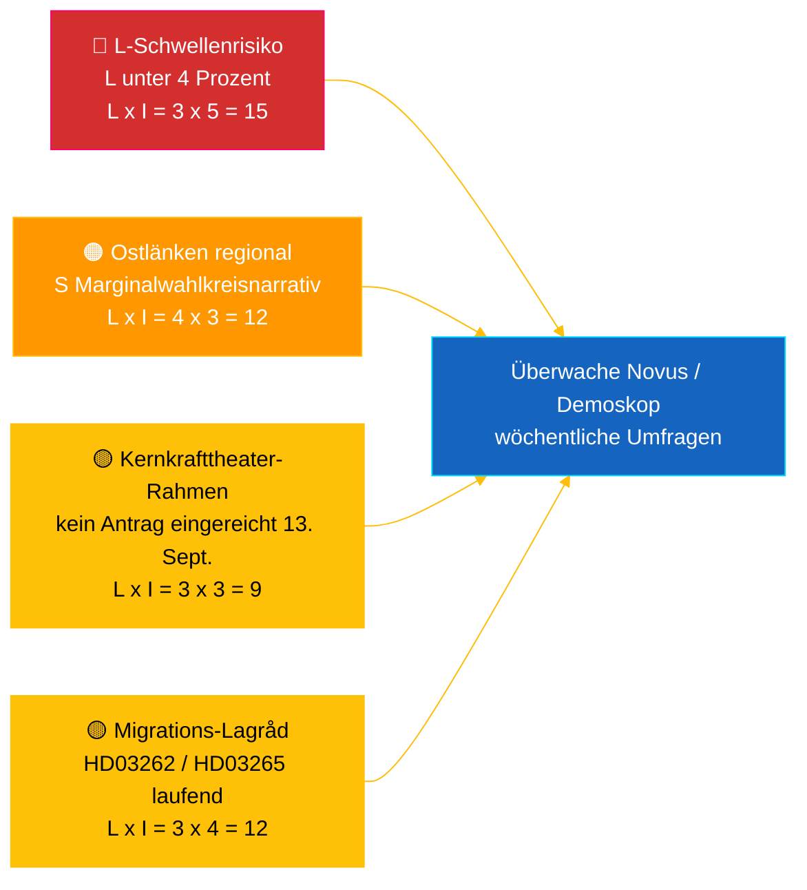

# Geheimdienstbriefing — Riksdag Echtzeit-Puls 2026-05-04

**Klassifizierung**: 🟢 ÖFFENTLICH — Riksdagsmonitor Intelligence
**Zielgruppe**: Redakteure, Diensthabende, Forscher, interessierte Bürger
**Datum**: 2026-05-04 (UTC)
**Tage bis zur Wahl 2026-09-13**: 132
**Workflow**: news-realtime-monitor
**Erstellt von**: Riksdagsmonitor AI Intelligence System
**Gesamtes Konfidenzniveau**: 🟩 HOCH [A2] — Mehrquellen-Korroboration über `dok_id` aus offenen Riksdag-Daten + IMF WEO April 2026
**Veröffentlichungsentscheidung**: **VERÖFFENTLICHEN** (EN + DE) — DIW-priorisiertes Topthema ≥ 9,0
**Beantwortete PIRs**: PIR-RT-001, PIR-RT-005, PIR-RT-006

---

## 🎯 BLUF

Schwedens Riksdag produzierte am 4. Mai 2026 seine bisher konzentrierteste Gesetzgebungsleistung vor der Wahl: Der Wirtschaftsausschuss (NU) billigte die Direktgenehmigung von Kernkraftanlagen (`HD01NU19`, tritt am 17. Juni 2026 in Kraft) — die einzige größte strukturelle energiepolitische Leistung der Tidö-Koalition — während die siebte aufeinanderfolgende Antigang-Maßnahme durch Sprengstoffkontrollreform (`HD01FöU13`) und Reform der Strafprozesse (`HD01JuU9`) vorankam, beide mit Inkrafttreten am 1. Juli 2026. Gegen diese Wand der Regierungsleistung reichte die Sozialdemokratin **Eva Lindh** eine Interpellation `HD10463` gegen KDs Infrastrukturminister **Andreas Carlson** zur gestrichenen Ostlänken Linköping-Stationserweiterung ein — ein 20 Jahre altes Versprechen, das einer 500.000-Einwohner-Pendlerregion in wettbewerbsfähigem Wahlkreis-Randgebiet gebrochen wurde. Der Transparenzbericht zur politischen Finanzierung (`HD01KU39`) ist für eine Plenarvote am 16. Juni 2026 eingeplant, was ein vierspuriges Leistungsnarrativ (Energie, Sicherheit, Transparenz, Finanzergebnis) 89 Tage vor der Wahl vervollständigt. **Konfidenzniveau: 🟩 HOCH [A2]** — Quellen: Riksdagens offene Daten, IMF WEO April 2026.

---

## 🧭 3 Entscheidungen, die dieses Briefing unterstützt

| # | Entscheidung | Entscheidungsträger | Frist | Grundlage |
|:-:|-------------|--------------------:|:-----:|-----------|
| 1 | **Redaktionell:** EN + DE Breaking-Artikel mit Kernkraftreform-plus-Ostlänken-Gegennarrativ führen (Doppelrahmen, 2-Stunden-Veröffentlichungsziel) | Chefredakteur | +2 h | `HD01NU19` Ausschussentscheid + `HD10463` Interpellation eingereicht 2026-05-04 |
| 2 | **Vorausschauende Berichterstattung:** Diensthabenden beauftragen, Carlsons Ostlänken-Antwort (gesetzliche Antwortfrist 25. Mai 2026) und Kerngesetz-Inkrafttreten am 17. Juni zu verfolgen | Diensthabender | 2026-05-25 / 2026-06-17 | PIR-RT-005, PIR-RT-006; `HD10463` Interpellationsregister |
| 3 | **Risiko:** L-Schwellenüberwachungsniveau von Beobachtung auf aktive Verfolgung anheben — Koalitionsleistungslogik setzt voraus, dass L am 13. Sept. 4 % überschreitet; jedes Novus/Demoskop-Ergebnis <4,5 % löst koalitionsarithmetische Revision aus | Analyseleiterin | Fortlaufend wöchentlich | `coalition-dynamics.md`, Post-Migrations-Meinung PIR-RT-003 |

---

## ⚡ 60-Sekunden-Lektüre

- 🔴 **Kernkraftreform zur Direktgenehmigung (`HD01NU19`)** — Wirtschaftsausschuss (NU) billigt Direktgenehmigung, umgeht die mehrstufige Pipeline der Strahlenschutzbehörde (SSM); **tritt am 17. Juni 2026 in Kraft**. Größte strukturelle Gesetzgebungsleistung der Tidö-Legislaturperiode; liefert M/KD/L/SDs Kernkraft-Neustart-Versprechen von 2022 mit operativer Meilensteinerfüllung vor dem Wahltag [🟩 HOCH — `HD01NU19`, NU-Ausschussprotokoll].
- 🟠 **Ostlänken-Versprechen-Interpellation (`HD10463`)** — S-Abgeordnete **Eva Lindh** fordert Infrastrukturminister **Andreas Carlson (KD)** auf, die Streichung der geplanten Linköping Ostlänken-Station zu erklären; gesetzliche Antwortfrist **25. Mai 2026**. Dritte Interpellation gegen Carlson in 10 Tagen — koordinierter regionaler S-Druck auf eine 500.000-Einwohner-Pendlerregion [🟩 HOCH — `HD10463`, Interpellationsregister].
- 🟢 **Siebte Gangbekämpfungsmaßnahme schreitet voran (`HD01FöU13` + `HD01JuU9`)** — Genehmigungsanforderungen für Sprengstoffe werden verschärft (Verteidigungsausschuss, 1. Juli 2026); Strafprozessreform schafft *tilltrosbestämmelserna* ab und erweitert frühzeitiges Verhörbeweismaterial (Rechtsausschuss, 1. Juli 2026). M/SDs Kernnarrativ „liefert bei Sicherheit" wird gestärkt [🟩 HOCH — `HD01FöU13`, `HD01JuU9`].
- 🟡 **Transparenz bei politischer Finanzierung (`HD01KU39`)** — Verfassungsausschuss registriert Bericht über Transparenz in politischen Prozessen (behandelt höchstwahrscheinlich Proposition `HD03258` zur Berichterstattung über Parteifinanzen); Plenarvote **16. Juni 2026**; L/KD profitieren von Demokratiereformpositionierung. PIR-RT-002 beantwortet: KU (nicht JuU/SfU) besitzt das Thema [🟧 MITTEL — `HD01KU39`, Kalender].
- 🔵 **Wirtschaftlicher Kontext (IMF WEO April 2026)** — Schwedens Staatsverschuldung ≈ 34 % des BIP (`GGXWDG_NGDP` 2026-Prognose) vs. Eurozone-Durchschnitt >90 %; reales BIP-Wachstum 2026 `NGDP_RPCH` 2,0–2,1 %; Inflation sinkt (`PCPIEPCH`). Riksbanks Zinssenkungen 2025–26 erreichen Hypothekennehmer → Ms „sichere Hände"-Narrativ [🟩 HOCH — Anbieter: imf, Datenfluss: WEO_Apr_2026, Vintage: April 2026].
- 🟣 **Querverweis** — `HD01NU19` knüpft an den Energiepolitikstrang der Propositionsanalyse (`../propositions/`); `HD10463` verlängert Ss regionales Versprechensbruch-Cluster aus `opposition-analysis.md`; Transparenz `HD01KU39` behandelt `HD03258` aus dem 30. April-Propositionspaket.
- 🩷 **Entstehende Verwundbarkeit — „Kernkrafttheater"-Risiko** — Oppositionsrahmen, dass das Inkrafttreten am 17. Juni symbolisch ist ohne eingereichten Antrag vor dem Wahltag am 13. September. Falls Vattenfall/Uniper/neuer Akteur keinen Antrag im 88-Tage-Vorwahlsfenster einreicht, riskiert das Leistungsnarrativ angreifbar zu werden [🟧 MITTEL — PIR-RT-006 offen].
- ⚪ **Übertragen** — Lagråds Stellungnahmen zu Migrationsproposifionen `HD03262` und `HD03265` (PIR-RT-001) bleiben **OFFEN — KRITISCH**; die verfassungsrechtliche Qualitätsprüfung ist der einzige einflussreichste ungelöste Faktor, der das politische Narrativ der Migrationsreform in der Sommersaison prägt.

---

## 🗂️ Top-Dokumente (DIW-Rangfolge)

| Rang | dok_id | Titel (kurz) | DIW | Konfidenz | Status |
|:----:|--------|--------------|:---:|:---------:|--------|
| 1 | `HD01NU19` | Kernkraft-Genehmigungsreform (Direktspur) | 9,2 | 🟩 HOCH [A2] | Ausschuss beschlossen — tritt in Kraft 17. Juni 2026 |
| 2 | `HD10463` | Ostlänken-Interpellation — Lindh (S) → Carlson (KD) | 8,6 | 🟩 HOCH [A2] | Eingereicht — Antwort fällig 25. Mai 2026 |
| 3 | `HD01FöU13` | Reform der Sprengstoffkontrolle | 7,5 | 🟩 HOCH [A2] | Ausschuss beschlossen — tritt in Kraft 1. Juli 2026 |
| 4 | `HD01JuU9` | Reform der Strafprozesse | 7,4 | 🟩 HOCH [A2] | Ausschuss beschlossen — tritt in Kraft 1. Juli 2026 |
| 5 | `HD01KU39` | Transparenz in politischen Prozessen | 7,0 | 🟧 MITTEL [B2] | Registriert — Plenarvote 16. Juni 2026 |
| 6 | `HD01FiU49` | Staatsschuldverwaltungsevaluierung 2021–2025 | 6,4 | 🟩 HOCH [A2] | Registriert — Beschluss 11. Juni 2026 |

---

## ⚠️ Risiko- und Bedrohungsübersicht

| Risiko | L | I | Punkte | Auslöser | Quelle | Admiralty |
|--------|:-:|:-:|:------:|---------|--------|:---------:|
| Liberalerna unter 4 %-Schwelle → Tidö verliert Mehrheit | 3 | 5 | 15 | Jedes Novus/Demoskop-Ergebnis <4,0 % (95 % KI Untergrenze <4,0) | `coalition-dynamics.md` R1 | **[B2]** |
| Ss regionales Versprechensbruch-Narrativ wandelt marginale Östergötland-Mandate um | 4 | 3 | 12 | Carlsons 25. Mai-Antwort von SVT/SR Östergötland-Redaktion als unzureichend bewertet | `opposition-analysis.md` | **[A2]** |
| Lagrådets feindliche Stellungnahme zum Migrationspaket `HD03262`/`HD03265` | 3 | 4 | 12 | Lagrådets Stellungnahme innerhalb von 30 T veröffentlicht mit verfassungsrechtlichen Einwänden | PIR-RT-001 (`forward-indicators.md`) | **[A2]** |
| „Kernkrafttheater" — `HD01NU19` Inkrafttreten ohne eingereichten Antrag bis 13. Sept. | 3 | 3 | 9 | Vattenfall/Uniper/neuer Akteur versäumt Antrag bis 1. Sept. 2026 einzureichen | PIR-RT-006 | **[B2]** |

---

## 🔮 Wichtigste zukünftige Auslöser

**Andreas Carlsons schriftliche Antwort auf Interpellation `HD10463`, gesetzliche Antwortfrist 25. Mai 2026.** Carlsons Art und Weise, die gestrichene Linköping Ostlänken-Station zu rahmen — ob er den Vertragsbruch einräumt, die Routenänderung auf technischen/budgetären Gründen verteidigt oder sich alternativen regionalen Infrastrukturangeboten zuwendet — entscheidet, ob das Östergötland-Narrativ vor der Sommerpause zu einer vollständigen Interpellationsdebatte im Plenum eskaliert. Eine ausweichende oder technokratische Antwort ist der wahrscheinlichste Weg für S, das Narrativ in 1–2 marginale Mandatverschiebungen in Linköping/Norrköping umzuwandeln. Ein substantielles alternatives Investitionsangebot deeskaliert das Narrativ. Beide Ergebnisse verschieben die Marginalwahlkreisbewertungen von `coalition-mathematics.md` und lösen eine Pass-2-Überarbeitung von `electoral-implications.md` aus.

**Sekundärer Auslöser** (parallele Überwachung): 16. Juni 2026 — `HD01KU39` Plenarvote zur Transparenz politischer Finanzierung. Bestätigt oder bricht das vierspurige Leistungsnarrativ der Regierung (Energie + Sicherheit + Transparenz + Finanzergebnis) 89 Tage vor der Wahl.

---

## 📊 Strategische Einschätzung

**Konfidenzniveau: 🟩 HOCH [A2]** — Quellen umfassen Riksdagens offene Daten (`HD01NU19`, `HD10463`, `HD01FöU13`, `HD01JuU9`, `HD01KU39`, `HD01FiU49`), IMF WEO April 2026 Vintage und das Interpellationsregister.

Der Schnappschuss vom 4. Mai 2026 erfasst eine Tidö-Koalition in **maximaler Gesetzgebungsgeschwindigkeit**: Sieben Koalitionsreformen schreiten in einer einzigen Woche voran, mit konkreten Inkrafttreten-Daten zwischen 1. Juni und 1. Juli 2026. Jedes Inkrafttreten-Datum generiert eine Leistungstaktik, für die die vier Koalitionsparteien Wahlkampf führen können. Die strategische Verwundbarkeit ist asymmetrisch: M, KD und SD profitieren von der Kaskade; **L** absorbiert die Last — die kleinste Koalitionspartei ist am nächsten an der 4 %-Schwelle und trägt unverhältnismäßiges Mandatverlustrisiko.

Ss Oppositionsreaktion ist methodisch präzise: Anstatt die Regierung auf ihrem stärksten Terrain herauszufordern (Sicherheit, Kernenergie, Wirtschaft) baut S ein **verteiltes regionales Unzufriedenheitsmosaik** — Ostlänken in Östergötland (`HD10463`), Scandinavian Mountain Airport (Interpellation 428), Stockholmer Wohnungsbau (Interpellation 434) — jede gegen einen einzelnen Minister (Carlson) aus verschiedenen Wahlkreisen gerichtet.

IMFs Makrorahmen ist für die Regierung günstig: Staatsverschuldung ≈ 34 % des BIP, sinkende Inflation, Wachstum um 2 %. Das wirtschaftliche Narrativ ist Ms stärkstes Asset.

**Wahl 2026-Linse**: Der aktuelle Kurs hält Tidö bei etwa 175 Mandaten — genau an den Mehrheitsgrenzen. Ls Schwellenrisiko (PIR-RT-003) ist die einzeln wichtigste Wahlvariable. Lagrådets Migrationsgutachten (PIR-RT-001) ist die einzeln wichtigste politische Narrativ-Variable. Carlsons Ostlänken-Antwort (PIR-RT-005) ist die einzeln wichtigste regionale Mandatvariable. Alle drei werden innerhalb von 5 Wochen nach dem Veröffentlichungsdatum dieses Briefings gelöst.

---

## 📎 Links

| Link | Pfad |
|------|------|
| Artikel | [`article.md`](article.md) |
| Syntheseübersicht | [`synthesis-summary.md`](synthesis-summary.md) |
| Kernsynthese | [`core-synthesis.md`](core-synthesis.md) |
| Koalitionsdynamik | [`coalition-dynamics.md`](coalition-dynamics.md) |
| Oppositionsanalyse | [`opposition-analysis.md`](opposition-analysis.md) |
| Wahlimplikationen | [`electoral-implications.md`](electoral-implications.md) |
| Wirtschaftlicher Kontext (IMF) | [`economic-context.md`](economic-context.md) |
| Zukunftsindikatoren | [`forward-indicators.md`](forward-indicators.md) |
| Risiko-/Chancenmatrix | [`risk-opportunity-matrix.md`](risk-opportunity-matrix.md) |
| Szenarioanalyse | [`scenario-analysis.md`](scenario-analysis.md) |
| Methodennotizen | [`methodology-notes.md`](methodology-notes.md) |
| Daten-Manifest | [`data-download-manifest.md`](data-download-manifest.md) |
| Dokumentenanalysen | [`documents/`](documents/) |

---

## 📝 Dokumentenkontrolle

- **Briefing-ID**: `EB-2026-05-04-001`
- **Erstellt**: 2026-05-16 (Nachholarbeit — erstellt aus bestehenden Pass-2-Analyseartefakten)
- **Vorlagenpfad**: [`analysis/templates/executive-brief.md`](../../../templates/executive-brief.md)
- **Eigentumsmethodik**: [`per-artifact-methodologies.md` § executive-brief](../../../methodologies/per-artifact-methodologies.md#executive-brief)
- **Eigentumsgate**: [`05-analysis-gate.md`](../../../../.github/prompts/05-analysis-gate.md) Check 1 + Check 7
- **Ausgabefamilie**: A — Kernsynthese
- **Klassifizierung**: 🟢 ÖFFENTLICH

*Wirtschaftliche Provenienz: Anbieter: imf, Datenfluss: WEO_Apr_2026, Indikatoren: NGDP_RPCH / GGXWDG_NGDP / PCPIEPCH, Vintage: April 2026, retrieved_at: 2026-05-04. Riksdag-Daten abgerufen über riksdag-regering API 2026-05-04. Riksdagsmonitor wird von Hack23 AB produziert; dieses Briefing stellt eine unabhängige redaktionelle Einschätzung auf Basis öffentlich zugänglicher parlamentarischer Dokumente dar.*

<!-- source-sha: f8cfbe724a92e48089f650d9e1f52abe004ed7f7 -->
