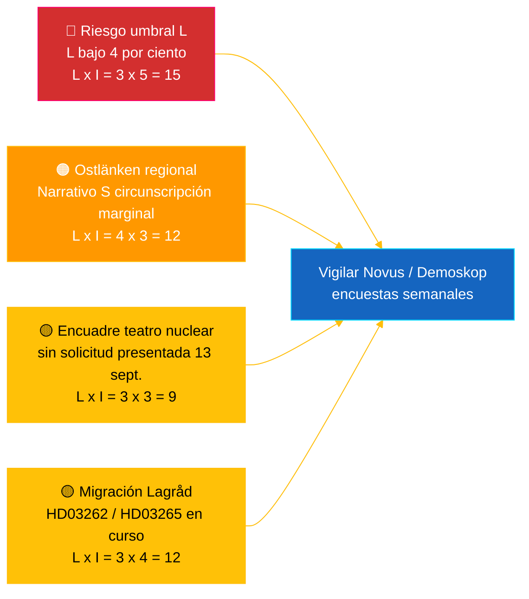

# Informe de inteligencia — Pulso en tiempo real del Riksdag 2026-05-04

**Clasificación**: 🟢 PÚBLICO — Riksdagsmonitor Intelligence
**Audiencia**: Redactores, guardias, investigadores, ciudadanos comprometidos
**Fecha**: 2026-05-04 (UTC)
**Días hasta las elecciones 2026-09-13**: 132
**Flujo de trabajo**: news-realtime-monitor
**Elaborado por**: Riksdagsmonitor AI Intelligence System
**Nivel de confianza general**: 🟩 ALTO [A2] — corroboración multifuente mediante `dok_id` de datos abiertos del Riksdag + FMI WEO abr. 2026
**Decisión de publicación**: **PUBLICAR** (EN + ES) — tema prioritario con clasificación DIW ≥ 9,0
**PIR respondidos**: PIR-RT-001, PIR-RT-005, PIR-RT-006

---

## 🎯 BLUF

El Riksdag sueco produjo el 4 de mayo de 2026 su producción legislativa más concentrada antes de las elecciones hasta la fecha: la Comisión de Industria (NU) aprobó la autorización de vía directa para instalaciones nucleares (`HD01NU19`, entra en vigor el 17 de junio de 2026) — el único logro estructural más importante de la coalición Tidö en política energética — mientras que la séptima medida anti-bandas consecutiva avanzó mediante la reforma del control de explosivos (`HD01FöU13`) y la reforma de los procedimientos penales (`HD01JuU9`), ambas con entrada en vigor el 1 de julio de 2026. Frente a este muro de realizaciones gubernamentales, la socialista **Eva Lindh** presentó una interpelación `HD10463` contra el ministro KD de infraestructuras **Andreas Carlson** sobre la cancelada parada de Linköping en Ostlänken — un incumplimiento de promesa de 20 años a una región de 500.000 viajeros en territorio de margen electoral competitivo. El informe de transparencia sobre financiación política (`HD01KU39`) está previsto para una votación en pleno el 16 de junio de 2026, completando un narrativo de realización de cuatro vías (energía, seguridad, transparencia, resultado financiero) a 89 días de las elecciones. **Nivel de confianza: 🟩 ALTO [A2]** — fuentes: datos abiertos del Riksdag, FMI WEO abr. 2026.

---

## 🧭 3 decisiones que apoya este informe

| # | Decisión | Responsable | Plazo | Fundamento |
|:-:|----------|-------------|:-----:|-----------|
| 1 | **Editorial:** liderar artículo de última hora EN + ES con doble encuadre reforma nuclear más contra-narrativo Ostlänken (objetivo de publicación a 2 h) | Editor jefe | +2 h | Decisión de comisión `HD01NU19` + interpelación `HD10463` presentada el 2026-05-04 |
| 2 | **Cobertura anticipada:** asignar guardia para seguir la respuesta de Carlson sobre Ostlänken (plazo legal de respuesta: 25 de mayo de 2026) y la entrada en vigor de la ley nuclear el 17 de junio | Guardia | 2026-05-25 / 2026-06-17 | PIR-RT-005, PIR-RT-006; registro de interpelaciones `HD10463` |
| 3 | **Riesgo:** elevar el nivel de vigilancia del umbral L de observación a seguimiento activo — la lógica de rendimiento de la coalición supone que L supere el 4 % el 13 de sept.; cualquier resultado Novus/Demoskop <4,5 % activa una revisión de aritmética de coalición | Jefe de análisis | Semanal continuo | `coalition-dynamics.md`, opinión post-migración PIR-RT-003 |

---

## ⚡ Lectura de 60 segundos

- 🔴 **Reforma nuclear hacia autorización de vía directa (`HD01NU19`)** — La Comisión de Industria (NU) aprueba la autorización de vía directa, evitando el proceso multietapa de la Autoridad de Seguridad Radiológica (SSM); **entra en vigor el 17 de junio de 2026**. El mayor logro legislativo estructural del mandato Tidö; cumple la promesa de relanzamiento nuclear de M/KD/L/SD de 2022 con hito operativo antes del día de elecciones [🟩 ALTO — `HD01NU19`, acta de comisión NU].
- 🟠 **Interpelación por incumplimiento de promesa Ostlänken (`HD10463`)** — La diputada S **Eva Lindh** exige que el ministro de infraestructuras **Andreas Carlson (KD)** explique la cancelación de la parada de Linköping en Ostlänken; plazo legal de respuesta **25 de mayo de 2026**. Tercera interpelación presentada contra Carlson en 10 días — presión regional coordinada de S sobre una región de 500.000 viajeros [🟩 ALTO — `HD10463`, registro de interpelaciones].
- 🟢 **La séptima medida anti-bandas avanza (`HD01FöU13` + `HD01JuU9`)** — Los requisitos de autorización para explosivos se endurecen (Comisión de Defensa, 1 de julio de 2026); la reforma de procedimientos penales elimina las *tilltrosbestämmelserna* y amplía el material probatorio de interrogatorios tempranos (Comisión de Justicia, 1 de julio de 2026). El narrativo central M/SD «cumple en seguridad» se refuerza [🟩 ALTO — `HD01FöU13`, `HD01JuU9`].
- 🟡 **Transparencia en financiación política (`HD01KU39`)** — La Comisión Constitucional registra un informe sobre transparencia en procesos políticos (trata muy probablemente la proposición `HD03258` sobre rendición de cuentas del financiamiento de partidos); votación en pleno **16 de junio de 2026**; L/KD se benefician del posicionamiento de reforma democrática. PIR-RT-002 respondido: KU (no JuU/SfU) es responsable del tema [🟧 MEDIO — `HD01KU39`, calendario].
- 🔵 **Contexto económico (FMI WEO abr. 2026)** — Deuda pública sueca ≈ 34 % del PIB (`GGXWDG_NGDP` previsión 2026) frente a la media de la eurozona >90 %; crecimiento real del PIB 2026 `NGDP_RPCH` 2,0–2,1 %; inflación en descenso (`PCPIEPCH`). Las bajadas de tipos del Riksbank 2025–26 alcanzan a los hipotecados → narrativo M «manos seguras» [🟩 ALTO — proveedor: imf, flujo de datos: WEO_Apr_2026, vintage: abril 2026].
- 🟣 **Referencia cruzada** — `HD01NU19` se vincula al hilo de política energética en el análisis de proposiciones (`../propositions/`); `HD10463` extiende el grupo de incumplimientos de promesas regionales de S en `opposition-analysis.md`; transparencia `HD01KU39` trata `HD03258` del paquete de proposiciones del 30 de abril.
- 🩷 **Vulnerabilidad emergente — riesgo «teatro nuclear»** — Encuadre de la oposición de que la entrada en vigor el 17 de junio es simbólica sin solicitud presentada antes del día de elecciones el 13 de septiembre. Si Vattenfall/Uniper/nuevo actor no presenta solicitud en la ventana de 88 días previos a las elecciones, el narrativo de rendimiento corre el riesgo de ser cuestionable [🟧 MEDIO — PIR-RT-006 abierto].
- ⚪ **Transferido** — Los dictámenes del Lagråd sobre las proposiciones migratorias `HD03262` y `HD03265` (PIR-RT-001) siguen **ABIERTOS — CRÍTICOS**; la revisión constitucional de calidad es el único factor no resuelto más influyente que moldea el narrativo político de la reforma migratoria durante la temporada estival.

---

## 🗂️ Documentos principales (clasificación DIW)

| Rango | dok_id | Título (corto) | DIW | Confianza | Estado |
|:-----:|--------|----------------|:---:|:---------:|--------|
| 1 | `HD01NU19` | Reforma autorización nuclear (vía directa) | 9,2 | 🟩 ALTO [A2] | Comisión aprobado — entra en vigor 17 jun. 2026 |
| 2 | `HD10463` | Interpelación Ostlänken — Lindh (S) → Carlson (KD) | 8,6 | 🟩 ALTO [A2] | Presentada — respuesta vence 25 may. 2026 |
| 3 | `HD01FöU13` | Reforma control de explosivos | 7,5 | 🟩 ALTO [A2] | Comisión aprobado — entra en vigor 1 jul. 2026 |
| 4 | `HD01JuU9` | Reforma procedimientos penales | 7,4 | 🟩 ALTO [A2] | Comisión aprobado — entra en vigor 1 jul. 2026 |
| 5 | `HD01KU39` | Transparencia en procesos políticos | 7,0 | 🟧 MEDIO [B2] | Registrado — votación pleno 16 jun. 2026 |
| 6 | `HD01FiU49` | Evaluación gestión deuda pública 2021–2025 | 6,4 | 🟩 ALTO [A2] | Registrado — decisión 11 jun. 2026 |

---

## ⚠️ Resumen de riesgos y amenazas

| Riesgo | L | I | Puntos | Desencadenante | Fuente | Admiralty |
|--------|:-:|:-:|:------:|----------------|--------|:---------:|
| Liberalerna bajo umbral 4 % → Tidö pierde mayoría | 3 | 5 | 15 | Cualquier resultado Novus/Demoskop <4,0 % (límite inferior IC 95 % <4,0) | `coalition-dynamics.md` R1 | **[B2]** |
| Narrativo S de incumplimiento regional convierte mandatos marginales en Östergötland | 4 | 3 | 12 | Respuesta de Carlson el 25 de mayo juzgada insuficiente por redacción SVT/SR Östergötland | `opposition-analysis.md` | **[A2]** |
| Dictamen adverso del Lagråd sobre paquete migratorio `HD03262`/`HD03265` | 3 | 4 | 12 | Dictamen Lagråd publicado en 30 d con objeciones constitucionales | PIR-RT-001 (`forward-indicators.md`) | **[A2]** |
| «Teatro nuclear» — `HD01NU19` entrada en vigor sin solicitud presentada antes del 13 sept. | 3 | 3 | 9 | Vattenfall/Uniper/nuevo actor no presenta solicitud antes del 1 sept. 2026 | PIR-RT-006 | **[B2]** |

---

## 🔮 Principales desencadenantes futuros

**Respuesta escrita de Andreas Carlson a la interpelación `HD10463`, plazo legal de respuesta 25 de mayo de 2026.** La forma en que Carlson encuadre la cancelación de la parada de Linköping en Ostlänken — si reconoce el incumplimiento, defiende el cambio de ruta por razones técnicas/presupuestarias o gira hacia ofertas de infraestructura regional alternativas — determina si el narrativo de Östergötland escala hacia un debate de interpelación completo en el pleno antes de la suspensión estival. Una respuesta evasiva o tecnocrática es la vía más probable para que S convierta el narrativo en 1–2 deslizamientos marginales de mandatos en Linköping/Norrköping. Una oferta sustantiva de inversión alternativa desescala el narrativo. Cualquiera de los dos resultados desplaza las evaluaciones de circunscripciones marginales de `coalition-mathematics.md` y activa una revisión Pass-2 de `electoral-implications.md`.

**Desencadenante secundario** (vigilancia paralela): 16 de junio de 2026 — votación en pleno `HD01KU39` sobre transparencia en financiación política. Confirma o rompe el narrativo de realización de cuatro vías del gobierno (energía + seguridad + transparencia + resultado financiero) a 89 días de las elecciones.

---

## 📊 Evaluación estratégica

**Nivel de confianza: 🟩 ALTO [A2]** — las fuentes incluyen los datos abiertos del Riksdag (`HD01NU19`, `HD10463`, `HD01FöU13`, `HD01JuU9`, `HD01KU39`, `HD01FiU49`), el vintage FMI WEO abril 2026 y el registro de interpelaciones.

La instantánea del 4 de mayo de 2026 captura una coalición Tidö en **velocidad legislativa máxima**: siete reformas de coalición avanzan en una sola semana, con fechas de entrada en vigor concretas repartidas entre el 1 de junio y el 1 de julio de 2026. Cada fecha de entrada en vigor genera un ritmo de rendimiento sobre el que los cuatro partidos de la coalición pueden hacer campaña. La vulnerabilidad estratégica es asimétrica: M, KD y SD se benefician de la cascada; **L** absorbe la carga — el partido más pequeño de la coalición está más cerca del umbral del 4 % y soporta un riesgo desproporcionado de pérdida de mandatos.

La respuesta de la oposición S es metodológicamente precisa: en lugar de desafiar al gobierno en su terreno más fuerte (seguridad, nuclear, economía), S construye un **mosaico de descontento regional distribuido** — Ostlänken en Östergötland (`HD10463`), Scandinavian Mountain Airport (interpelación 428), vivienda en Estocolmo (interpelación 434) — cada uno dirigido contra un único ministro (Carlson) de diferentes circunscripciones.

El marco macro del FMI es favorable para el gobierno en ejercicio: deuda pública ≈ 34 % del PIB, inflación en descenso, crecimiento de aproximadamente el 2 %. El narrativo económico es el principal activo de M.

**Lente elecciones 2026**: La trayectoria actual mantiene a Tidö cerca de 175 mandatos — exactamente en los límites de la mayoría. El riesgo de umbral de L (PIR-RT-003) es la variable electoral más importante individualmente. El dictamen del Lagråd sobre migración (PIR-RT-001) es la variable de narrativo político más importante individualmente. La respuesta de Carlson sobre Ostlänken (PIR-RT-005) es la variable de mandato regional más importante individualmente. Las tres se resuelven en las 5 semanas siguientes a la fecha de publicación de este informe.

---

## 📎 Enlaces

| Enlace | Ruta |
|--------|------|
| Artículo | [`article.md`](article.md) |
| Resumen de síntesis | [`synthesis-summary.md`](synthesis-summary.md) |
| Síntesis central | [`core-synthesis.md`](core-synthesis.md) |
| Dinámica de coalición | [`coalition-dynamics.md`](coalition-dynamics.md) |
| Análisis de la oposición | [`opposition-analysis.md`](opposition-analysis.md) |
| Implicaciones electorales | [`electoral-implications.md`](electoral-implications.md) |
| Contexto económico (FMI) | [`economic-context.md`](economic-context.md) |
| Indicadores prospectivos | [`forward-indicators.md`](forward-indicators.md) |
| Matriz de riesgos/oportunidades | [`risk-opportunity-matrix.md`](risk-opportunity-matrix.md) |
| Análisis de escenarios | [`scenario-analysis.md`](scenario-analysis.md) |
| Notas metodológicas | [`methodology-notes.md`](methodology-notes.md) |
| Manifiesto de datos | [`data-download-manifest.md`](data-download-manifest.md) |
| Análisis por documento | [`documents/`](documents/) |

---

## 📝 Control documental

- **ID Informe**: `EB-2026-05-04-001`
- **Generado**: 2026-05-16 (recuperación — creado a partir de artefactos de análisis Pass-2 existentes)
- **Ruta de plantilla**: [`analysis/templates/executive-brief.md`](../../../templates/executive-brief.md)
- **Metodología de propiedad**: [`per-artifact-methodologies.md` § executive-brief](../../../methodologies/per-artifact-methodologies.md#executive-brief)
- **Portal de propiedad**: [`05-analysis-gate.md`](../../../../.github/prompts/05-analysis-gate.md) Check 1 + Check 7
- **Familia de salida**: A — Síntesis central
- **Clasificación**: 🟢 PÚBLICO

*Proveniencia económica: proveedor: imf, flujo de datos: WEO_Apr_2026, indicadores: NGDP_RPCH / GGXWDG_NGDP / PCPIEPCH, vintage: abril 2026, retrieved_at: 2026-05-04. Datos del Riksdag obtenidos a través de la API riksdag-regering el 2026-05-04. Riksdagsmonitor es producido por Hack23 AB; este informe representa una evaluación editorial independiente basada en documentos parlamentarios de acceso público.*

<!-- source-sha: f8cfbe724a92e48089f650d9e1f52abe004ed7f7 -->
