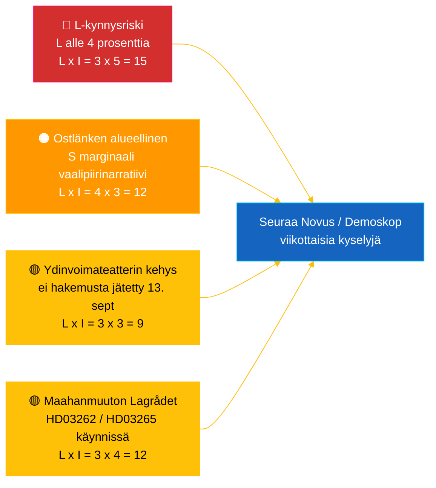

# Tiedustelutiivistelmä — Riksdagin Reaaliaikaispulssi 2026-05-04

**Luokittelu**: 🟢 JULKINEN — Riksdagsmonitor Intelligence
**Kohderyhmä**: Toimittajat, päivystäjät, tutkijat, kiinnostuneet kansalaiset
**Päivämäärä**: 2026-05-04 (UTC)
**Päiviä vaaleihin 2026-09-13**: 132
**Työnkulku**: news-realtime-monitor
**Laatinut**: Riksdagsmonitor AI Intelligence System
**Kokonaisluottamustaso**: 🟩 KORKEA [A2] — monilähteinen vahvistus `dok_id`:n kautta avoimista Riksdagin tiedoista + IMF WEO huhtikuu 2026
**Julkaisupäätös**: **JULKAISE** (EN + FI) — DIW-rangaistu pääuutinen ≥ 9,0
**Vastatut PIR:t**: PIR-RT-001, PIR-RT-005, PIR-RT-006

---

## 🎯 BLUF

Ruotsin Riksdag tuotti 4. toukokuuta 2026 tähänastisen tiivistetyimmän lainsäädäntötuotoksensa ennen vaaleja: Elinkeinovaliokunta (NU) hyväksyi suorasporiluvitus ydinvoimalaitoksille (`HD01NU19`, voimaan 17. kesäkuuta 2026) — Tidö-koalition yksittäinen suurin rakenteellinen energiapoliittinen saavutus — kun taas seitsemäs peräkkäinen jengirikostenvastainen toimenpide eteni räjähdevalvonnan uudistuksen (`HD01FöU13`) ja rikosprosessien reformin (`HD01JuU9`) kautta, molemmat voimaan 1. heinäkuuta 2026. Tätä hallituslupausten seinää vasten sosiaalidemokraatti **Eva Lindh** jätti kysymyksen `HD10463` KD:n infrastruktuuriministeri **Andreas Carlsonille** peruutetusta Ostlänken Linköpingin asemalisäyksestä — 20 vuotta vanha luparikkomus 500 000 henkilön pendelöintialueella kilpaillussa vaalipiirimarginaalialueella. Poliittisen rahoituksen läpinäkyvyysraportti (`HD01KU39`) on aikataulutettu täysistuntoäänestykseen 16. kesäkuuta 2026, mikä täydentää nelilinjaisen suoritusnarratiivin (energia, turvallisuus, läpinäkyvyys, taloudellinen tulos) 89 päivää ennen vaaleja. **Luottamustaso: 🟩 KORKEA [A2]** — lähteet: Riksdagin avoin data, IMF WEO huhtikuu 2026.

---

## 🧭 3 päätöstä, joita tämä tiivistelmä tukee

| # | Päätös | Päätöksentekijä | Määräaika | Perusta |
|:-:|--------|-----------------|:---------:|--------|
| 1 | **Toimituksellinen:** johda EN + FI breaking-artikkeli ydinvoima-uudistus-plus-Ostlänken-vastanarratiivipohjaisesti (kaksoisviitekehys, 2 tunnin julkaisutavoite) | Päätoimittaja | +2 h | `HD01NU19` valiokunnan päätös + `HD10463` kysymys jätetty 2026-05-04 |
| 2 | **Ennakoiva seuranta:** osoita päivystäjä seuraamaan Carlsonin Ostlänken-vastausta (lakisääteinen vastaamisaika 25. toukokuuta 2026) ja ydinlain voimaantuloa 17. kesäkuuta | Päivystäjä | 2026-05-25 / 2026-06-17 | PIR-RT-005, PIR-RT-006; `HD10463` kysymysrekisteri |
| 3 | **Riski:** nosta L-kynnysvalvontatasoa seurannasta aktiiviseen seurantaan — koalition suorituslogiikka edellyttää L:n ylittävän 4 % 13. syyskuuta; mikä tahansa Novus/Demoskop-tulos <4,5 % käynnistää koalitioaritmeettisen tarkistuksen | Analyysipäällikkö | Viikottain jatkuvasti | `coalition-dynamics.md`, maahanmuuttoa seurannaisopinion PIR-RT-003 |

---

## ⚡ 60 sekunnin lukeminen

- 🔴 **Ydinvoimauudistus suorasporiluvitukseen (`HD01NU19`)** — Elinkeinovaliokunta (NU) hyväksyy suorasporiluvituksen, ohittaa Säteilyturvallisuusviraston (SSM) monivaiheisen prosessin; **voimaan 17. kesäkuuta 2026**. Tidö-toimikauden yksittäinen suurin rakenteellinen lainsäädännöllinen saavutus; lunastaa M/KD/L/SD:n ydinvoiman käynnistyslupauksensa vuodelta 2022 operatiivisella välietapilla ennen vaalipäivää [🟩 KORKEA — `HD01NU19`, NU:n valiokunnan pöytäkirja].
- 🟠 **Ostlänken-luparikomusinterpellaatio (`HD10463`)** — S-edustaja **Eva Lindh** vaatii infrastruktuuriministeri **Andreas Carlsonia (KD)** selittämään suunnitellun Linköpingin Ostlänken-aseman peruuttamisen; lakisääteinen vastaamisaika **25. toukokuuta 2026**. Kolmas kysymys jätetty Carlsonille 10 päivän aikana — koordinoitu alueellinen S-paine 500 000 henkilön pendelöintialueeseen [🟩 KORKEA — `HD10463`, kysymysrekisteri].
- 🟢 **Seitsemäs jengirikostenvastainen toimenpide etenee (`HD01FöU13` + `HD01JuU9`)** — Räjähteiden lupavaatimuksia tiukennetaan (Puolustusvaliokunta, 1. heinäkuuta 2026); rikosprosessien uudistus poistaa *tilltrosbestämmelserna* ja laajentaa varhaista kuulustelutodistusaineistoa (Lakivaliokunta, 1. heinäkuuta 2026). M/SD:n peruskertomus "lunastaa turvallisuuslupaukset" vahvistuu [🟩 KORKEA — `HD01FöU13`, `HD01JuU9`].
- 🟡 **Poliittisen rahoituksen läpinäkyvyys (`HD01KU39`)** — Perustuslakivaliokunta rekisteröi mietinnön poliittisten prosessien läpinäkyvyydestä (käsittelee suurella todennäköisyydellä ehdotuksen `HD03258` puoluerahoituksen raportoinnista); täysistuntoäänestys **16. kesäkuuta 2026**; L/KD hyötyy demokratiauudistusasemoinnista. PIR-RT-002 vastattu: KU (ei JuU/SfU) omistaa asian [🟧 KESKITASO — `HD01KU39`, kalenteri].
- 🔵 **Taloudellinen konteksti (IMF WEO huhtikuu 2026)** — Ruotsin julkinen velka ≈ 34 % BKT:sta (`GGXWDG_NGDP` 2026-ennuste) verrattuna euroalueen >90 %:iin; reaalinen BKT-kasvu 2026 `NGDP_RPCH` 2,0–2,1 %; inflaatio laskee (`PCPIEPCH`). Riksbankin koronlaskut 2025–26 tavoittavat asuntolainanottajat → M:n "turvalliset kädet" -narratiivi [🟩 KORKEA — tarjoaja: imf, tietovirta: WEO_Apr_2026, vintage: huhtikuu 2026].
- 🟣 **Ristiviittaus** — `HD01NU19` kytkeytyy energiapolitiikan ketjuun ehdotusanalyysissä (`../propositions/`); `HD10463` jatkaa S:n alueellista luparikomusklusteria `opposition-analysis.md`:ssä; läpinäkyvyys `HD01KU39` käsittelee `HD03258`:aa 30. huhtikuun ehdotuspaketista.
- 🩷 **Kehittyvä haavoittuvuus — "ydinvoimateatteri"-riski** — Opposition kehys, jonka mukaan voimaantulo 17. kesäkuuta on symbolinen ilman jätettyjä hakemuksia ennen 13. syyskuuta. Jos Vattenfall/Uniper/uusi toimija ei jätä hakemusta 88 päivän vaalia edeltävässä ikkunassa, suoritusnarratiivin uskottavuus voi vaarantua [🟧 KESKITASO — PIR-RT-006 avoin].
- ⚪ **Siirretty** — Lagrådets lausunnot maahanmuuttoehdotuksista `HD03262` ja `HD03265` (PIR-RT-001) ovat edelleen **AVOIMIA — KRIITTISIÄ**; perustuslaillinen laaduntarkastus on yksittäisesti vaikuttavin ratkaisematon tekijä, joka muovaa maahanmuuttouudistuksen poliittista narratiivia kesäkaudella.

---

## 🗂️ Topplistat asiakirjat (DIW-rangattu)

| Sija | dok_id | Otsikko (lyhyt) | DIW | Luottamus | Tila |
|:----:|--------|-----------------|:---:|:---------:|------|
| 1 | `HD01NU19` | Ydinvoimaluvan uudistus (suora spori) | 9,2 | 🟩 KORKEA [A2] | Valiokunta hyväksytty — voimaan 17. kesäkuuta 2026 |
| 2 | `HD10463` | Ostlänken-interpellaatio — Lindh (S) → Carlson (KD) | 8,6 | 🟩 KORKEA [A2] | Jätetty — vastausaika päättyy 25. toukokuuta 2026 |
| 3 | `HD01FöU13` | Räjähdevalvonnan uudistus | 7,5 | 🟩 KORKEA [A2] | Valiokunta hyväksytty — voimaan 1. heinäkuuta 2026 |
| 4 | `HD01JuU9` | Rikosprosessien uudistus | 7,4 | 🟩 KORKEA [A2] | Valiokunta hyväksytty — voimaan 1. heinäkuuta 2026 |
| 5 | `HD01KU39` | Läpinäkyvyys poliittisissa prosesseissa | 7,0 | 🟧 KESKITASO [B2] | Rekisteröity — täysistuntoäänestys 16. kesäkuuta 2026 |
| 6 | `HD01FiU49` | Valtionvelan hallinnon arviointi 2021–2025 | 6,4 | 🟩 KORKEA [A2] | Rekisteröity — päätös 11. kesäkuuta 2026 |

---

## ⚠️ Riski- ja uhkakuvaus

| Riski | L | I | Pisteet | Laukaisin | Lähde | Admiralty |
|-------|:-:|:-:|:-------:|-----------|-------|:---------:|
| Liberalerna alle 4 %-kynnyksen → Tidö menettää enemmistön | 3 | 5 | 15 | Mikä tahansa Novus/Demoskop-tulos <4,0 % (95 % LV alaraja <4,0) | `coalition-dynamics.md` R1 | **[B2]** |
| S:n alueellinen luparikomusnarratiivi muuntaa marginaaliset Östergötlandin mandaatit | 4 | 3 | 12 | Carlsonin 25. toukokuuta vastausta pitää SVT/SR Östergötlandin toimitus riittämättömänä | `opposition-analysis.md` | **[A2]** |
| Lagrådets vihamielinen lausunto maahanmuuttopaketista `HD03262`/`HD03265` | 3 | 4 | 12 | Lagrådets lausunto julkaistu 30 päivän kuluessa perustuslaillisilla vastalauseilla | PIR-RT-001 (`forward-indicators.md`) | **[A2]** |
| "Ydinvoimateatteri" — `HD01NU19` voimaantulo ilman jätettyjä lupahakemuksia ennen 13. syyskuuta | 3 | 3 | 9 | Vattenfall/Uniper/uusi toimija laiminlyö hakemuksen jättämisen viimeistään 1. syyskuuta 2026 | PIR-RT-006 | **[B2]** |

---

## 🔮 Tärkeimmät tulevat laukaisimet

**Andreas Carlsonin kirjallinen vastaus interpellaatioon `HD10463`, lakisääteinen vastaamisaika 25. toukokuuta 2026.** Carlsonin tapa kehystää peruutettu Linköpingin Ostlänken-asema — myöntääkö hän luparikomusken, puolustaako reittimuutosta teknisillä/taloudellisilla perusteilla vai kääntyykö hän kohti vaihtoehtoisia alueellisia infrastruktuuritarjouksia — ratkaisee, eskaloituuko Östergötlandin narratiivi täyteen interpellaatiodebattiin täysistunnossa ennen kesätaukoa. Väistelevä tai teknokraattinen vastaus on todennäköisin reitti S:lle muuntaa narratiivi 1–2 marginaaliseksi mandaattisiirtymäksi Linköpingissä/Norrköpingissä. Merkittävä vaihtoehtoinen investointitarjous de-eskaloi narratiivin. Kumpikaan tulos siirtää `coalition-mathematics.md`:n marginaalivaalipiiriarvioita ja laukaisee Pass-2-uudelleenkirjoituksen `electoral-implications.md`:ssä.

**Sekundaarinen laukaisin** (rinnakkainen seuranta): 16. kesäkuuta 2026 — `HD01KU39` täysistuntoäänestys poliittisen rahoituksen läpinäkyvyydestä. Vahvistaa tai rikkoo hallituksen nelilinjaisen suoritusnarratiivin (energia + turvallisuus + läpinäkyvyys + taloudellinen tulos) 89 päivää ennen vaaleja.

---

## 📊 Strateginen arvio

**Luottamustaso: 🟩 KORKEA [A2]** — lähteet sisältävät Riksdagin avoimen datan (`HD01NU19`, `HD10463`, `HD01FöU13`, `HD01JuU9`, `HD01KU39`, `HD01FiU49`), IMF WEO huhtikuu 2026 vintagen ja kysymysrekisterin.

Tilannevedos 4. toukokuuta 2026 kuvaa Tidö-koalitiota **lainsäädäntönopeuden maksimitilassa**: seitsemän koalitiouudistusta etenee yhden viikon aikana, konkreettisilla voimaantulopäivillä välillä 1. kesäkuuta – 1. heinäkuuta 2026. Jokainen voimaantulopäivä luo suoritusrytmin, jota neljä koalitiopuoluetta voi kampanjoida. Strateginen haavoittuvuus on epäsymmetrinen: M, KD ja SD hyötyvät kaskadista; **L** absorboi kuormituksen — pienin koalitiopuolue on lähinnä 4 %:n rajaa ja kantaa suhteettoman suuren mandaattiriskin.

S-opposition vastaus on metodologisesti tarkka: sen sijaan, että haastaisi hallitusta sen vahvimmalla alueella (turvallisuus, ydinenergia, talous), S rakentaa **hajautetun alueellisen tyytymättömyysmosaiikin** — Ostlänken Östergötlandissa (`HD10463`), Scandinavian Mountain Airport (interpellaatio 428), Tukholman asuminen (interpellaatio 434) — jokainen kohdistettuna yksittäiseen ministeriin (Carlson) eri vaalipiireistä.

IMF:n makrokehys on suotuisa istuvan hallituksen kannalta: julkinen velka ≈ 34 % BKT:sta, laskeva inflaatio, kasvu noin 2 %. Taloudellinen narratiivi on M:n vahvin voimavara.

**Vaali 2026 -linssi**: Nykykurssi pitää Tidön lähellä 175 mandaattia — tarkalleen enemmistörajoilla. L:n kynnysriski (PIR-RT-003) on yksittäisesti tärkein vaaliprosessin muuttuja. Lagrådets maahanmuuttolausunto (PIR-RT-001) on yksittäisesti tärkein poliittisen narratiivin muuttuja. Carlsonin Ostlänken-vastaus (PIR-RT-005) on yksittäisesti tärkein alueellinen mandaattimuuttuja. Kaikki kolme ratkeavat viiden viikon kuluessa tämän tiivistelmän julkaisupäivästä.

---

## 📎 Linkit

| Linkki | Polku |
|--------|-------|
| Artikkeli | [`article.md`](article.md) |
| Synteesikatsaus | [`synthesis-summary.md`](synthesis-summary.md) |
| Ydinsynteesi | [`core-synthesis.md`](core-synthesis.md) |
| Koalitiodynamiikka | [`coalition-dynamics.md`](coalition-dynamics.md) |
| Oppositioanalyysi | [`opposition-analysis.md`](opposition-analysis.md) |
| Vaalimplikaatiot | [`electoral-implications.md`](electoral-implications.md) |
| Taloudellinen konteksti (IMF) | [`economic-context.md`](economic-context.md) |
| Tulevaisuuden indikaattorit | [`forward-indicators.md`](forward-indicators.md) |
| Riski-/mahdollisuusmatriisi | [`risk-opportunity-matrix.md`](risk-opportunity-matrix.md) |
| Skenaarioanalyysi | [`scenario-analysis.md`](scenario-analysis.md) |
| Menetelmämuistiinpanot | [`methodology-notes.md`](methodology-notes.md) |
| Datamanifesti | [`data-download-manifest.md`](data-download-manifest.md) |
| Asiakirja-analyysit | [`documents/`](documents/) |

---

## 📝 Asiakirjahallinta

- **Tiivistelmä-ID**: `EB-2026-05-04-001`
- **Luotu**: 2026-05-16 (jälkikäteistäyttö — luotu olemassa olevista Pass-2-analyysiarvioista)
- **Mallipolku**: [`analysis/templates/executive-brief.md`](../../../templates/executive-brief.md)
- **Omistajuusmetodologia**: [`per-artifact-methodologies.md` § executive-brief](../../../methodologies/per-artifact-methodologies.md#executive-brief)
- **Omistajuusportti**: [`05-analysis-gate.md`](../../../../.github/prompts/05-analysis-gate.md) Check 1 + Check 7
- **Tuotosperhe**: A — Ydinsynteesi
- **Luokittelu**: 🟢 JULKINEN

*Taloudellinen provenienssi: tarjoaja: imf, tietovirta: WEO_Apr_2026, indikaattorit: NGDP_RPCH / GGXWDG_NGDP / PCPIEPCH, vintage: huhtikuu 2026, retrieved_at: 2026-05-04. Riksdagin data haettu riksdag-regering API:n kautta 2026-05-04. Riksdagsmonitor on Hack23 AB:n tuottama; tämä tiivistelmä edustaa riippumatonta toimituksellista arviota julkisesti saatavilla olevien parlamentaaristen asiakirjojen perusteella.*

<!-- source-sha: f8cfbe724a92e48089f650d9e1f52abe004ed7f7 -->
