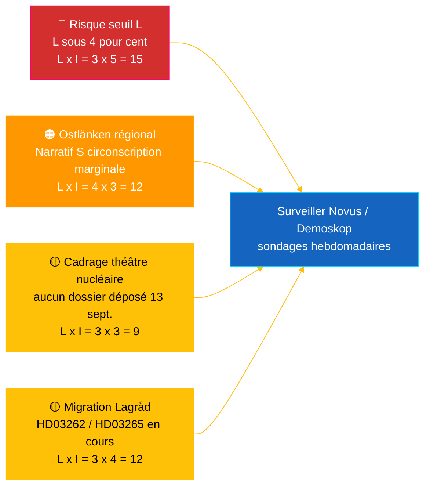

# Briefing de renseignement — Pouls en temps réel du Riksdag 2026-05-04

**Classification** : 🟢 PUBLIC — Riksdagsmonitor Intelligence
**Audience** : Rédacteurs, permanents, chercheurs, citoyens engagés
**Date** : 2026-05-04 (UTC)
**Jours avant les élections du 2026-09-13** : 132
**Workflow** : news-realtime-monitor
**Produit par** : Riksdagsmonitor AI Intelligence System
**Niveau de confiance global** : 🟩 ÉLEVÉ [A2] — corroboration multi-sources via `dok_id` à partir des données ouvertes du Riksdag + FMI WEO avr. 2026
**Décision de publication** : **PUBLIER** (EN + FR) — sujet prioritaire classé DIW ≥ 9,0
**PIR répondus** : PIR-RT-001, PIR-RT-005, PIR-RT-006

---

## 🎯 BLUF

Le Riksdag suédois a produit le 4 mai 2026 sa production législative la plus concentrée avant les élections à ce jour : la Commission de l'industrie (NU) a approuvé l'autorisation à voie directe des centrales nucléaires (`HD01NU19`, entrant en vigueur le 17 juin 2026) — la seule réalisation structurelle la plus importante de la coalition Tidö en matière d'énergie — tandis que la septième mesure anti-gangs consécutive a progressé avec la réforme du contrôle des explosifs (`HD01FöU13`) et la réforme des procédures pénales (`HD01JuU9`), toutes deux entrant en vigueur le 1er juillet 2026. Face à ce mur de réalisations gouvernementales, la socialiste **Eva Lindh** a déposé une interpellation `HD10463` contre le ministre KD des infrastructures **Andreas Carlson** concernant l'annulation de l'arrêt Linköping sur Ostlänken — une promesse non tenue depuis 20 ans envers une région de pendulaires de 500 000 personnes dans un territoire à faible marge électorale. Le rapport sur la transparence du financement politique (`HD01KU39`) est prévu pour un vote en séance plénière le 16 juin 2026, complétant un narratif de réalisation à quatre voies (énergie, sécurité, transparence, résultat financier) à 89 jours des élections. **Niveau de confiance : 🟩 ÉLEVÉ [A2]** — sources : données ouvertes du Riksdag, FMI WEO avr. 2026.

---

## 🧭 3 décisions que ce briefing soutient

| # | Décision | Décideur | Délai | Fondement |
|:-:|----------|----------|:-----:|-----------|
| 1 | **Éditorial :** mener l'article EN + FR en breaking avec le double cadrage réforme nucléaire + contre-narratif Ostlänken (objectif publication à 2 h) | Rédacteur en chef | +2 h | Décision de commission `HD01NU19` + interpellation `HD10463` déposée le 2026-05-04 |
| 2 | **Couverture anticipée :** affecter un permanent pour suivre la réponse de Carlson sur Ostlänken (délai légal de réponse : 25 mai 2026) et l'entrée en vigueur de la loi nucléaire le 17 juin | Permanent | 2026-05-25 / 2026-06-17 | PIR-RT-005, PIR-RT-006 ; registre interpellations `HD10463` |
| 3 | **Risque :** élever le niveau de surveillance du seuil L de l'observation au suivi actif — la logique de performance de la coalition suppose que L dépasse 4 % le 13 sept. ; tout résultat Novus/Demoskop <4,5 % déclenche une révision de l'arithmétique de coalition | Chef d'analyse | Continu hebdomadaire | `coalition-dynamics.md`, opinion post-migration PIR-RT-003 |

---

## ⚡ Lecture en 60 secondes

- 🔴 **Réforme nucléaire vers autorisation à voie directe (`HD01NU19`)** — La commission de l'industrie (NU) approuve l'autorisation à voie directe, contournant le pipeline multi-étapes de l'Autorité de sûreté radiologique (SSM) ; **entre en vigueur le 17 juin 2026**. Principale réalisation structurelle du mandat Tidö ; concrétise la promesse M/KD/L/SD de relance du nucléaire en 2022 avec une étape opérationnelle avant le jour du scrutin [🟩 ÉLEVÉ — `HD01NU19`, procès-verbal de commission NU].
- 🟠 **Interpellation sur la promesse non tenue Ostlänken (`HD10463`)** — La députée S **Eva Lindh** demande au ministre des infrastructures **Andreas Carlson (KD)** d'expliquer l'annulation de l'arrêt Linköping d'Ostlänken ; délai légal de réponse **25 mai 2026**. Troisième interpellation déposée contre Carlson en 10 jours — pression régionale S coordonnée sur une région de pendulaires de 500 000 personnes [🟩 ÉLEVÉ — `HD10463`, registre des interpellations].
- 🟢 **La septième mesure anti-gangs progresse (`HD01FöU13` + `HD01JuU9`)** — Les exigences d'autorisation pour les explosifs sont durcies (Commission de la défense, 1er juillet 2026) ; la réforme des procédures pénales abolit les *tilltrosbestämmelserna* et élargit le matériel de preuves d'interrogatoire précoce (Commission judiciaire, 1er juillet 2026). Le narratif principal M/SD « tient ses promesses en matière de sécurité » est renforcé [🟩 ÉLEVÉ — `HD01FöU13`, `HD01JuU9`].
- 🟡 **Transparence du financement politique (`HD01KU39`)** — La commission constitutionnelle enregistre un rapport sur la transparence dans les processus politiques (traite très probablement la proposition `HD03258` sur le compte rendu du financement des partis) ; vote en séance plénière **16 juin 2026** ; L/KD bénéficient du positionnement réforme démocratique. PIR-RT-002 répondu : KU (pas JuU/SfU) possède le sujet [🟧 MOYEN — `HD01KU39`, calendrier].
- 🔵 **Contexte économique (FMI WEO avr. 2026)** — Dette publique suédoise ≈ 34 % du PIB (`GGXWDG_NGDP` prévision 2026) vs. moyenne de la zone euro >90 % ; croissance réelle du PIB 2026 `NGDP_RPCH` 2,0–2,1 % ; inflation en baisse (`PCPIEPCH`). Les baisses de taux de la Riksbank 2025–26 atteignent les emprunteurs hypothécaires → narratif M « mains sûres » [🟩 ÉLEVÉ — fournisseur : imf, flux de données : WEO_Apr_2026, vintage : avril 2026].
- 🟣 **Renvoi croisé** — `HD01NU19` se rattache au fil de politique énergétique dans l'analyse des propositions (`../propositions/`) ; `HD10463` prolonge le groupe de promesses non tenues régionales de S dans `opposition-analysis.md` ; transparence `HD01KU39` traite `HD03258` du paquet de propositions du 30 avril.
- 🩷 **Vulnérabilité émergente — risque « théâtre nucléaire »** — Cadrage de l'opposition selon lequel l'entrée en vigueur le 17 juin est symbolique sans dossier déposé avant le jour du scrutin le 13 septembre. Si Vattenfall/Uniper/nouvel acteur ne dépose pas de demande dans la fenêtre pré-électorale de 88 jours, le narratif de performance risque d'être contestable [🟧 MOYEN — PIR-RT-006 ouvert].
- ⚪ **Transféré** — Les avis du Lagråd sur les propositions migratoires `HD03262` et `HD03265` (PIR-RT-001) restent **OUVERTS — CRITIQUES** ; l'examen constitutionnel de qualité est le seul facteur non résolu le plus influent façonnant le narratif politique de la réforme migratoire pendant la période estivale.

---

## 🗂️ Classement des principaux documents (classement DIW)

| Rang | dok_id | Titre (court) | DIW | Confiance | Statut |
|:----:|--------|---------------|:---:|:---------:|--------|
| 1 | `HD01NU19` | Réforme autorisation nucléaire (voie directe) | 9,2 | 🟩 ÉLEVÉ [A2] | Commission approuvé — entre en vigueur 17 juin 2026 |
| 2 | `HD10463` | Interpellation Ostlänken — Lindh (S) → Carlson (KD) | 8,6 | 🟩 ÉLEVÉ [A2] | Déposée — réponse attendue 25 mai 2026 |
| 3 | `HD01FöU13` | Réforme du contrôle des explosifs | 7,5 | 🟩 ÉLEVÉ [A2] | Commission approuvé — entre en vigueur 1er juillet 2026 |
| 4 | `HD01JuU9` | Réforme des procédures pénales | 7,4 | 🟩 ÉLEVÉ [A2] | Commission approuvé — entre en vigueur 1er juillet 2026 |
| 5 | `HD01KU39` | Transparence dans les processus politiques | 7,0 | 🟧 MOYEN [B2] | Enregistré — vote plénier 16 juin 2026 |
| 6 | `HD01FiU49` | Évaluation gestion dette publique 2021–2025 | 6,4 | 🟩 ÉLEVÉ [A2] | Enregistré — décision 11 juin 2026 |

---

## ⚠️ Aperçu des risques et menaces

| Risque | L | I | Score | Déclencheur | Source | Admiralty |
|--------|:-:|:-:|:-----:|-------------|--------|:---------:|
| Liberalerna sous le seuil 4 % → Tidö perd la majorité | 3 | 5 | 15 | Tout résultat Novus/Demoskop <4,0 % (limite inférieure IC 95 % <4,0) | `coalition-dynamics.md` R1 | **[B2]** |
| Narratif S promesses non tenues régionales convertit des mandats marginaux d'Östergötland | 4 | 3 | 12 | Réponse de Carlson le 25 mai jugée insuffisante par rédaction SVT/SR Östergötland | `opposition-analysis.md` | **[A2]** |
| Avis hostile du Lagråd sur le paquet migratoire `HD03262`/`HD03265` | 3 | 4 | 12 | Avis Lagråd publié dans les 30 j avec objections constitutionnelles | PIR-RT-001 (`forward-indicators.md`) | **[A2]** |
| « Théâtre nucléaire » — `HD01NU19` entrée en vigueur sans dossier déposé avant le 13 sept. | 3 | 3 | 9 | Vattenfall/Uniper/nouvel acteur ne dépose pas de demande avant le 1er sept. 2026 | PIR-RT-006 | **[B2]** |

---

## 🔮 Principaux déclencheurs futurs

**Réponse écrite d'Andreas Carlson à l'interpellation `HD10463`, délai légal de réponse 25 mai 2026.** La façon dont Carlson encadre l'annulation de l'arrêt Linköping d'Ostlänken — s'il reconnaît la promesse non tenue, défend le changement de tracé pour des raisons techniques/budgétaires ou pivote vers des offres alternatives d'infrastructure régionale — détermine si le narratif Östergötland escalade vers un débat d'interpellation complet en séance avant la suspension estivale. Une réponse évasive ou technocratique est la voie la plus probable pour S de convertir le narratif en 1–2 glissements de mandats marginaux à Linköping/Norrköping. Une offre substantielle d'investissement alternatif désescalade le narratif. L'un ou l'autre résultat déplace les évaluations de circonscriptions marginales de `coalition-mathematics.md` et déclenche une révision Pass-2 de `electoral-implications.md`.

**Déclencheur secondaire** (surveillance parallèle) : 16 juin 2026 — vote plénier `HD01KU39` sur la transparence du financement politique. Confirme ou brise le narratif de réalisation à quatre voies du gouvernement (énergie + sécurité + transparence + résultat financier) à 89 jours des élections.

---

## 📊 Évaluation stratégique

**Niveau de confiance : 🟩 ÉLEVÉ [A2]** — sources incluant les données ouvertes du Riksdag (`HD01NU19`, `HD10463`, `HD01FöU13`, `HD01JuU9`, `HD01KU39`, `HD01FiU49`), le vintage FMI WEO avril 2026 et le registre des interpellations.

L'instantané du 4 mai 2026 capture une coalition Tidö en **vitesse législative maximale** : sept réformes de coalition progressent en une seule semaine, avec des dates d'entrée en vigueur concrètes réparties entre le 1er juin et le 1er juillet 2026. Chaque date d'entrée en vigueur génère un rythme de performance que les quatre partis de coalition peuvent campaigner. La vulnérabilité stratégique est asymétrique : M, KD et SD bénéficient de la cascade ; **L** absorbe la charge — le plus petit parti de la coalition est le plus proche du seuil de 4 % et supporte un risque de perte de mandat disproportionné.

La réponse de l'opposition S est méthodiquement précise : plutôt que d'affronter le gouvernement sur son terrain le plus fort (sécurité, nucléaire, économie), S construit une **mosaïque de mécontentement régional distribué** — Ostlänken en Östergötland (`HD10463`), Scandinavian Mountain Airport (interpellation 428), logement à Stockholm (interpellation 434) — chacune ciblant un seul ministre (Carlson) de différentes circonscriptions.

Le cadre macro du FMI est favorable au gouvernement en place : dette publique ≈ 34 % du PIB, inflation en baisse, croissance d'environ 2 %. Le narratif économique est l'atout principal de M.

**Prisme élections 2026** : La trajectoire actuelle maintient Tidö à environ 175 mandats — précisément aux limites de la majorité. Le risque de seuil L (PIR-RT-003) est la seule variable électorale la plus importante. L'avis du Lagråd sur la migration (PIR-RT-001) est la seule variable de narratif politique la plus importante. La réponse de Carlson sur Ostlänken (PIR-RT-005) est la seule variable de mandat régional la plus importante. Les trois se résolvent dans les 5 semaines suivant la date de publication de ce briefing.

---

## 📎 Liens

| Lien | Chemin |
|------|--------|
| Article | [`article.md`](article.md) |
| Synthèse globale | [`synthesis-summary.md`](synthesis-summary.md) |
| Synthèse centrale | [`core-synthesis.md`](core-synthesis.md) |
| Dynamiques de coalition | [`coalition-dynamics.md`](coalition-dynamics.md) |
| Analyse de l'opposition | [`opposition-analysis.md`](opposition-analysis.md) |
| Implications électorales | [`electoral-implications.md`](electoral-implications.md) |
| Contexte économique (FMI) | [`economic-context.md`](economic-context.md) |
| Indicateurs prospectifs | [`forward-indicators.md`](forward-indicators.md) |
| Matrice risques/opportunités | [`risk-opportunity-matrix.md`](risk-opportunity-matrix.md) |
| Analyse de scénarios | [`scenario-analysis.md`](scenario-analysis.md) |
| Notes méthodologiques | [`methodology-notes.md`](methodology-notes.md) |
| Manifeste de données | [`data-download-manifest.md`](data-download-manifest.md) |
| Analyses par document | [`documents/`](documents/) |

---

## 📝 Contrôle documentaire

- **ID Briefing** : `EB-2026-05-04-001`
- **Généré** : 2026-05-16 (rattrapage — créé à partir d'artefacts d'analyse Pass-2 existants)
- **Chemin du modèle** : [`analysis/templates/executive-brief.md`](../../../templates/executive-brief.md)
- **Méthodologie de propriété** : [`per-artifact-methodologies.md` § executive-brief](../../../methodologies/per-artifact-methodologies.md#executive-brief)
- **Portail de propriété** : [`05-analysis-gate.md`](../../../../.github/prompts/05-analysis-gate.md) Check 1 + Check 7
- **Famille de sortie** : A — Synthèse centrale
- **Classification** : 🟢 PUBLIC

*Provenance économique : fournisseur : imf, flux de données : WEO_Apr_2026, indicateurs : NGDP_RPCH / GGXWDG_NGDP / PCPIEPCH, vintage : avril 2026, retrieved_at : 2026-05-04. Données du Riksdag récupérées via l'API riksdag-regering le 2026-05-04. Riksdagsmonitor est produit par Hack23 AB ; ce briefing représente une évaluation éditoriale indépendante basée sur des documents parlementaires accessibles au public.*

<!-- source-sha: f8cfbe724a92e48089f650d9e1f52abe004ed7f7 -->
