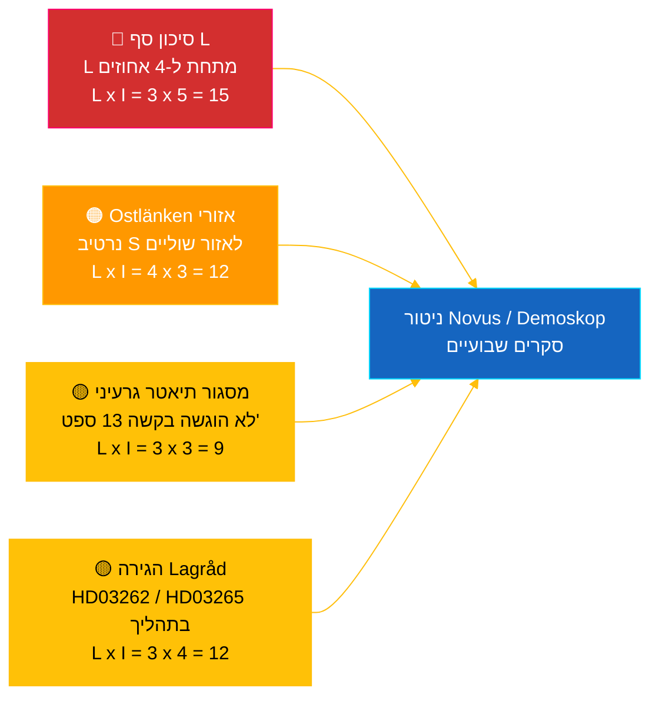

# תדריך מודיעיני — פולס בזמן אמת של הריקסדאג 2026-05-04

**סיווג**: 🟢 ציבורי — Riksdagsmonitor Intelligence
**קהל יעד**: עורכים, כוננים, חוקרים, אזרחים מעורבים
**תאריך**: 2026-05-04 (UTC)
**ימים עד לבחירות 2026-09-13**: 132
**זרימת עבודה**: news-realtime-monitor
**הוכן על ידי**: מערכת Riksdagsmonitor AI Intelligence
**רמת ביטחון כוללת**: 🟩 גבוה [A2] — אימות רב-מקורי באמצעות `dok_id` מנתוני ריקסדאג פתוחים + IMF WEO אפר' 2026
**החלטת פרסום**: **פרסם** (EN + HE) — נושא עדיפות ראשונה בדירוג DIW ≥ 9.0
**דרישות מידע עדיפות שנוענו**: PIR-RT-001, PIR-RT-005, PIR-RT-006

---

## 🎯 תמצית מנהלים (BLUF)

הריקסדאג השוודי ייצר ב-4 במאי 2026 את פריון החקיקה הרב-ביותר שלפני הבחירות עד כה: ועדת התעשייה (NU) אישרה הענקת רישיון ישיר למתקני אנרגיה גרעינית (`HD01NU19`, נכנס לתוקף ב-17 ביוני 2026) — ההישג המבני הגדול ביותר של קואליציית Tidö במדיניות האנרגיה — בעוד הצעד השביעי ברצף נגד כנופיות התקדם באמצעות רפורמת פיקוח על חומרי נפץ (`HD01FöU13`) ורפורמת הליכי משפט פלילי (`HD01JuU9`), שניהם נכנסים לתוקף ב-1 ביולי 2026. מול קיר ההישגים הממשלתי הזה, הגישה ח"כ הסוציאל-דמוקרטית **אווה לינד** שאילתה `HD10463` לשר התשתיות **אנדראס קארלסון (KD)** על ביטול תחנת Linköping בקו Ostlänken — הפרת הבטחה בת 20 שנה לאזור עם 500,000 נוסעים יומיים בטריטוריית מרווח בחירות תחרותי. דוח השקיפות על מימון מפלגות (`HD01KU39`) מתוכנן להצבעה פלנרית ב-16 ביוני 2026, מה שמשלים נרטיב ביצועים ארבעה-מסלולי (אנרגיה, ביטחון, שקיפות, תוצאה פיננסית) 89 ימים לפני הבחירות. **רמת ביטחון: 🟩 גבוה [A2]** — מקורות: נתוני ריקסדאג פתוחים, IMF WEO אפר' 2026.

---

## 🧭 שלוש החלטות שתדריך זה תומך בהן

| # | החלטה | מקבל ההחלטה | מועד אחרון | בסיס |
|:-:|-------|-------------|:----------:|------|
| 1 | **מערכתי:** להוביל מאמר EN + HE בכותרות עם מסגור כפול — רפורמת הגרעין בתוספת נגד-נרטיב Ostlänken (יעד פרסום תוך שעתיים) | עורך ראשי | +2 ש | החלטת ועדה `HD01NU19` + שאילתה `HD10463` שהוגשה 2026-05-04 |
| 2 | **כיסוי מקדים:** להקצות כונן למעקב אחר תגובת קארלסון ל-Ostlänken (מועד תגובה חוקי: 25 במאי 2026) וכניסת חוק הגרעין לתוקף ב-17 ביוני | כוננות | 2026-05-25 / 2026-06-17 | PIR-RT-005, PIR-RT-006; רישום שאילתות `HD10463` |
| 3 | **סיכון:** להעלות את רמת ניטור סף L מהתבוננות למעקב פעיל — לוגיקת ביצועי הקואליציה מניחה ש-L תחצה 4% ב-13 ספט'; כל תוצאת Novus/Demoskop <4.5% מפעילה בחינה מחדש של חשבון הקואליציה | ראש אנליזה | שוטף שבועי | `coalition-dynamics.md`, דעה שלאחר הגירה PIR-RT-003 |

---

## ⚡ קריאה של 60 שניות

- 🔴 **רפורמת גרעין לרישוי ישיר (`HD01NU19`)** — ועדת התעשייה (NU) מאשרת רישוי ישיר, עוקפת את צינור הרב-שלבי של הרשות לבטיחות קרינה (SSM); **נכנס לתוקף ב-17 ביוני 2026**. ההישג החקיקתי המבני הגדול ביותר של כהונת Tidö; מממש את הבטחת הפעלה-מחדש הגרעינית של M/KD/L/SD מ-2022 עם השגת אבן דרך תפעולית לפני יום הבחירות [🟩 גבוה — `HD01NU19`, פרוטוקול ועדת NU].
- 🟠 **שאילתת הפרת הבטחת Ostlänken (`HD10463`)** — ח"כ S **אווה לינד** דורשת משר התשתיות **אנדראס קארלסון (KD)** להסביר ביטול תחנת Linköping המתוכננת בקו Ostlänken; מועד תגובה חוקי **25 במאי 2026**. השאילתה השלישית שהוגשה נגד קארלסון ב-10 ימים — לחץ אזורי מתואם של S על אזור 500,000 נוסעים יומיים [🟩 גבוה — `HD10463`, רישום שאילתות].
- 🟢 **הצעד השביעי נגד כנופיות מתקדם (`HD01FöU13` + `HD01JuU9`)** — דרישות רישוי חומרי נפץ מחמירות (ועדת הביטחון, 1 ביולי 2026); רפורמת הליכי המשפט הפלילי מבטלת את *tilltrosbestämmelserna* ומרחיבה ראיות חקירה מוקדמת (ועדת המשפטים, 1 ביולי 2026). נרטיב הליבה של M/SD «מממשים בביטחון» מתחזק [🟩 גבוה — `HD01FöU13`, `HD01JuU9`].
- 🟡 **שקיפות במימון פוליטי (`HD01KU39`)** — ועדת החוקה רושמת דוח על שקיפות בתהליכים פוליטיים (עוסק ככל הנראה בהצעה `HD03258` בנושא דיווח מימון מפלגות); הצבעה פלנרית **16 ביוני 2026**; L/KD מרוויחים ממיצוב רפורמת הדמוקרטיה. PIR-RT-002 נענה: KU (לא JuU/SfU) הוא הבעלים של הנושא [🟧 בינוני — `HD01KU39`, לוח שנה].
- 🔵 **הקשר כלכלי (IMF WEO אפר' 2026)** — חוב ציבורי שוודי ≈ 34% מהתמ"ג (`GGXWDG_NGDP` תחזית 2026) מול ממוצע גוש היורו >90%; צמיחת תמ"ג ריאלי 2026 `NGDP_RPCH` 2.0–2.1%; אינפלציה יורדת (`PCPIEPCH`). הפחתות הריבית של Riksbank 2025–26 מגיעות ללווי משכנתאות → נרטיב M «ידיים בטוחות» [🟩 גבוה — ספק: imf, זרם נתונים: WEO_Apr_2026, גרסה: אפריל 2026].
- 🟣 **הפנייה צולבת** — `HD01NU19` מתקשר לחוט מדיניות האנרגיה בניתוח ההצעות (`../propositions/`); `HD10463` מאריכה את אשכול הפרת ההבטחות האזורי של S מ-`opposition-analysis.md`; שקיפות `HD01KU39` עוסקת ב-`HD03258` מחבילת ההצעות של 30 באפריל.
- 🩷 **פגיעות מתהווה — סיכון «תיאטר גרעיני»** — מסגור האופוזיציה שלפיו כניסת החוק לתוקף ב-17 ביוני היא סמלית ללא הגשת בקשה לפני יום הבחירות ב-13 ספטמבר. אם Vattenfall/Uniper/שחקן חדש לא יגישו בקשה בתוך חלון 88 הימים שלפני הבחירות, נרטיב הביצועים עלול להפוך לניתן לתקיפה [🟧 בינוני — PIR-RT-006 פתוח].
- ⚪ **הועבר** — חוות דעת Lagråd על הצעות ההגירה `HD03262` ו-`HD03265` (PIR-RT-001) נשארות **פתוחות — קריטיות**; ביקורת האיכות החוקתית היא הגורם הבלתי-פתור המשפיע ביותר המעצב את הנרטיב הפוליטי של רפורמת ההגירה בעונת הקיץ.

---

## 🗂️ מסמכים מובילים (דירוג DIW)

| דירוג | dok_id | כותרת (קצר) | DIW | ביטחון | סטטוס |
|:-----:|--------|-------------|:---:|:------:|-------|
| 1 | `HD01NU19` | רפורמת רישוי גרעיני (מסלול ישיר) | 9.2 | 🟩 גבוה [A2] | ועדה אישרה — נכנס לתוקף 17 יוני 2026 |
| 2 | `HD10463` | שאילתת Ostlänken — לינד (S) → קארלסון (KD) | 8.6 | 🟩 גבוה [A2] | הוגש — תגובה נדרשת ב-25 מאי 2026 |
| 3 | `HD01FöU13` | רפורמת פיקוח על חומרי נפץ | 7.5 | 🟩 גבוה [A2] | ועדה אישרה — נכנס לתוקף 1 יולי 2026 |
| 4 | `HD01JuU9` | רפורמת הליכי משפט פלילי | 7.4 | 🟩 גבוה [A2] | ועדה אישרה — נכנס לתוקף 1 יולי 2026 |
| 5 | `HD01KU39` | שקיפות בתהליכים פוליטיים | 7.0 | 🟧 בינוני [B2] | נרשם — הצבעה פלנרית 16 יוני 2026 |
| 6 | `HD01FiU49` | הערכת ניהול חוב ציבורי 2021–2025 | 6.4 | 🟩 גבוה [A2] | נרשם — החלטה 11 יוני 2026 |

---

## ⚠️ סקירת סיכונים ואיומים

| סיכון | ה' | ע' | ציון | מפעיל | מקור | Admiralty |
|-------|:--:|:--:|:----:|-------|------|:---------:|
| Liberalerna מתחת לסף 4% → Tidö מאבד רוב | 3 | 5 | 15 | כל תוצאת Novus/Demoskop <4.0% (גבול תחתון CI 95% <4.0) | `coalition-dynamics.md` R1 | **[B2]** |
| נרטיב הפרת הבטחות אזורי של S ממיר מנדטים שוליים ב-Östergötland | 4 | 3 | 12 | מערכת SVT/SR Östergötland מעריכה תגובת קארלסון ב-25 מאי כבלתי מספקת | `opposition-analysis.md` | **[A2]** |
| חוות דעת עוינת של Lagråd על חבילת ההגירה `HD03262`/`HD03265` | 3 | 4 | 12 | חוות דעת Lagråd מתפרסמת תוך 30 יום עם הסתייגויות חוקתיות | PIR-RT-001 (`forward-indicators.md`) | **[A2]** |
| «תיאטר גרעיני» — כניסת `HD01NU19` לתוקף ללא הגשת בקשה לפני 13 ספטמבר | 3 | 3 | 9 | Vattenfall/Uniper/שחקן חדש לא מגישים בקשה לפני 1 ספטמבר 2026 | PIR-RT-006 | **[B2]** |

---

## 🔮 מפעילים עתידיים חשובים

**תגובתו הכתובה של אנדראס קארלסון לשאילתה `HD10463`, מועד תגובה חוקי 25 במאי 2026.** הדרך שבה קארלסון ימסגר את ביטול תחנת Linköping ב-Ostlänken — אם יודה בהפרת הבטחה, יגן על שינוי המסלול בנימוקים טכניים/תקציביים, או יפנה לחלופות תשתית אזוריות — תקבע אם נרטיב Östergötland יסלים לדיון שאילתה מלא במליאה לפני הפסקת הקיץ. תגובה מתחמקת או טכנוקרטית היא הדרך הסבירה ביותר עבור S להמיר את הנרטיב ל-1–2 העברות שוליות של מנדטים ב-Linköping/Norrköping. הצעת השקעה חלופית מהותית תפחית את הנרטיב. כל אחת משתי התוצאות מזיזה את הערכות האזורים השוליים ב-`coalition-mathematics.md` ומפעילה עדכון Pass-2 של `electoral-implications.md`.

**מפעיל משני** (ניטור מקביל): 16 ביוני 2026 — הצבעה פלנרית `HD01KU39` על שקיפות במימון פוליטי. מאשר או שובר את נרטיב הביצועים הרבעוני של הממשלה (אנרגיה + ביטחון + שקיפות + תוצאה פיננסית) 89 ימים לפני הבחירות.

---

## 📊 הערכה אסטרטגית

**רמת ביטחון: 🟩 גבוה [A2]** — המקורות כוללים נתוני ריקסדאג פתוחים (`HD01NU19`, `HD10463`, `HD01FöU13`, `HD01JuU9`, `HD01KU39`, `HD01FiU49`), גרסת IMF WEO אפריל 2026 ורישום השאילתות.

תמונת המצב מ-4 במאי 2026 לוכדת קואליציית Tidö ב**מהירות חקיקה מרבית**: שבעה רפורמות קואליציוניות מתקדמות בשבוע אחד, עם תאריכי כניסה לתוקף קונקרטיים מפוזרים בין 1 ביוני ל-1 ביולי 2026. כל תאריך כניסה לתוקף מייצר קצב ביצועים שארבעת מפלגות הקואליציה יכולות לעשות בו שימוש בקמפיין. הפגיעות האסטרטגית אינה סימטרית: M, KD ו-SD נהנים מהרצף; **L** סופג את הנטל — המפלגה הקטנה ביותר בקואליציה קרובה ביותר לסף 4% ונושאת סיכון לא פרופורציונלי לאיבוד מנדטים.

תגובת האופוזיציה S מדויקת מתודולוגית: במקום להתעמת עם הממשלה בשטח החזק ביותר שלה (ביטחון, גרעין, כלכלה), S בונה **פסיפס אזורי מבוזר של חוסר שביעות רצון** — Ostlänken ב-Östergötland (`HD10463`), Scandinavian Mountain Airport (שאילתה 428), דיור בסטוקהולם (שאילתה 434) — כל אחד מכוון לשר בודד (קארלסון) מאזורים שונים.

המסגרת המאקרו-כלכלית של קרן המטבע הבינלאומית נוחה לממשלה הנוכחית: חוב ציבורי ≈ 34% מהתמ"ג, אינפלציה יורדת, צמיחה של כ-2%. הנרטיב הכלכלי הוא הנכס החזק ביותר של M.

**עדשת בחירות 2026**: המסלול הנוכחי מחזיק את Tidö קרוב ל-175 מנדטים — בדיוק בגבולות הרוב. סיכון הסף של L (PIR-RT-003) הוא המשתנה הבחירתי החשוב ביותר. חוות דעת Lagråd על ההגירה (PIR-RT-001) היא המשתנה הנרטיבי הפוליטי החשוב ביותר. תגובת קארלסון על Ostlänken (PIR-RT-005) היא המשתנה האזורי של המנדטים החשוב ביותר. שלושתם נפתרים תוך 5 שבועות מתאריך פרסום תדריך זה.

---

## 📎 קישורים

| קישור | נתיב |
|-------|------|
| מאמר | [`article.md`](article.md) |
| סיכום סינתזה | [`synthesis-summary.md`](synthesis-summary.md) |
| סינתזה מרכזית | [`core-synthesis.md`](core-synthesis.md) |
| דינמיקת קואליציה | [`coalition-dynamics.md`](coalition-dynamics.md) |
| ניתוח האופוזיציה | [`opposition-analysis.md`](opposition-analysis.md) |
| השלכות בחירתיות | [`electoral-implications.md`](electoral-implications.md) |
| הקשר כלכלי (IMF) | [`economic-context.md`](economic-context.md) |
| אינדיקטורים עתידיים | [`forward-indicators.md`](forward-indicators.md) |
| מטריצת סיכונים/הזדמנויות | [`risk-opportunity-matrix.md`](risk-opportunity-matrix.md) |
| ניתוח תרחישים | [`scenario-analysis.md`](scenario-analysis.md) |
| הערות מתודולוגיות | [`methodology-notes.md`](methodology-notes.md) |
| מניפסט נתונים | [`data-download-manifest.md`](data-download-manifest.md) |
| ניתוחי מסמכים | [`documents/`](documents/) |

---

## 📝 בקרת מסמך

- **מזהה תדריך**: `EB-2026-05-04-001`
- **נוצר**: 2026-05-16 (השלמה מאוחרת — נוצר מתוצרי ניתוח Pass-2 קיימים)
- **נתיב תבנית**: [`analysis/templates/executive-brief.md`](../../../templates/executive-brief.md)
- **מתודולוגיית בעלות**: [`per-artifact-methodologies.md` § executive-brief](../../../methodologies/per-artifact-methodologies.md#executive-brief)
- **שער בעלות**: [`05-analysis-gate.md`](../../../../.github/prompts/05-analysis-gate.md) בדיקה 1 + בדיקה 7
- **משפחת פלט**: A — סינתזה מרכזית
- **סיווג**: 🟢 ציבורי

*מקור כלכלי: ספק: imf, זרם נתונים: WEO_Apr_2026, אינדיקטורים: NGDP_RPCH / GGXWDG_NGDP / PCPIEPCH, גרסה: אפריל 2026, retrieved_at: 2026-05-04. נתוני ריקסדאג אוחזרו דרך ה-API riksdag-regering ב-2026-05-04. Riksdagsmonitor מופק על ידי Hack23 AB; תדריך זה מייצג הערכה עצמאית עריכתית המבוססת על מסמכים פרלמנטריים זמינים לציבור.*

<!-- source-sha: f8cfbe724a92e48089f650d9e1f52abe004ed7f7 -->
