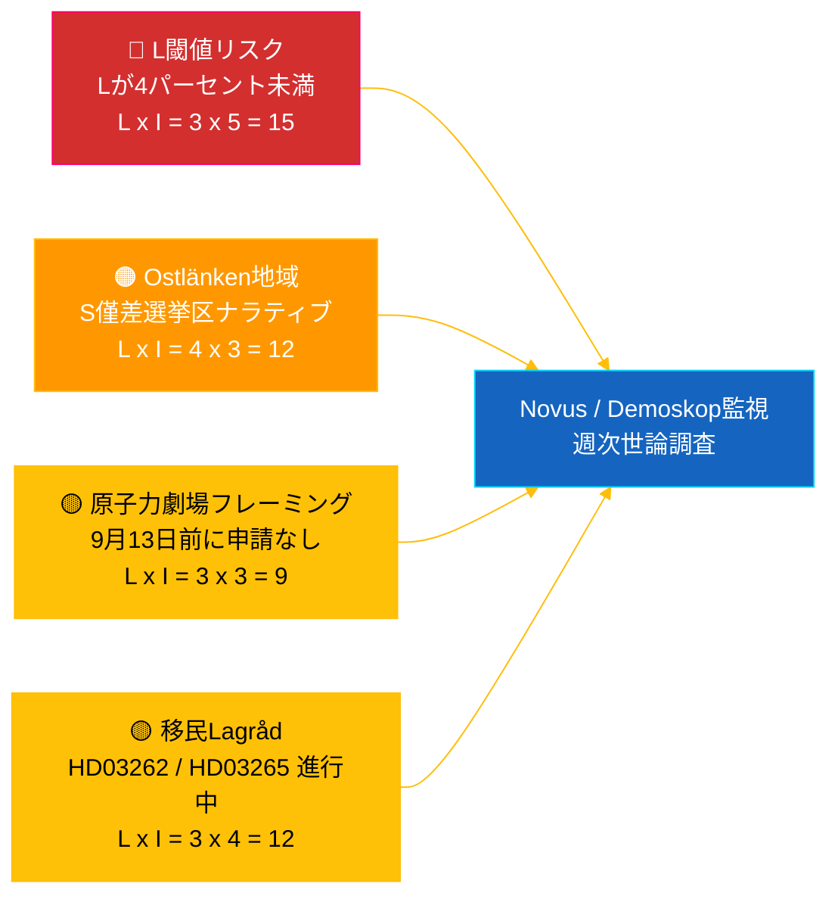

# インテリジェンスブリーフィング — リクスダーグ リアルタイムパルス 2026-05-04

**分類**: 🟢 公開 — Riksdagsmonitor Intelligence
**対象**: 編集者、当直者、研究者、関心ある市民
**日付**: 2026-05-04 (UTC)
**2026-09-13 選挙まであと**: 132日
**ワークフロー**: news-realtime-monitor
**作成**: Riksdagsmonitor AIインテリジェンスシステム
**総合信頼レベル**: 🟩 高 [A2] — `dok_id` 経由でオープンリクスダーグデータ + IMF WEO 2026年4月からの複数ソース照合
**公開決定**: **公開** (EN + JA) — DIW優先度トップ記事 ≥ 9.0
**回答済みPIR**: PIR-RT-001、PIR-RT-005、PIR-RT-006

---

## 🎯 BLUF（要約）

スウェーデン・リクスダーグは2026年5月4日、選挙前としてこれまでで最も集中した立法成果を生み出した。産業委員会（NU）は原子力発電所への直接許可付与を承認し（`HD01NU19`、2026年6月17日施行）——Tidö連立政権の単一最大のエネルギー政策構造的成果——また7回連続となるギャング対策が爆発物規制改革（`HD01FöU13`）および刑事手続き改革（`HD01JuU9`）により進展し、いずれも2026年7月1日施行。この政府の実績の壁に対し、社会民主党の**エヴァ・リンド**議員がKD党インフラ大臣**アンドレアス・カールソン**に対して質問`HD10463`を提出——Ostlänken リンショーピング駅追加の中止について、競争的選挙区マージン地域での50万人通勤圏に対する20年来の約束違反を問いただした。政治資金透明性報告（`HD01KU39`）は2026年6月16日の本会議採決が予定されており、選挙89日前に四路線実績ナラティブ（エネルギー・安全保障・透明性・財政成果）を完成させる。**信頼レベル: 🟩 高 [A2]** — 出典：リクスダーグオープンデータ、IMF WEO 2026年4月。

---

## 🧭 このブリーフィングが支援する3つの決定

| # | 決定 | 意思決定者 | 期限 | 根拠 |
|:-:|------|----------|:----:|------|
| 1 | **編集上:** 原子力改革 + Ostlänken 対立ナラティブの二重フレームでEN + JA速報記事を展開（2時間以内公開目標） | 編集長 | +2時間 | `HD01NU19` 委員会決定 + `HD10463` 質問 2026-05-04 提出 |
| 2 | **前向き取材:** カールソンのOstlänken回答（法定回答期限: 2026年5月25日）と原子力法6月17日施行を担当当直に割当 | 当直者 | 2026-05-25 / 2026-06-17 | PIR-RT-005、PIR-RT-006；`HD10463` 質問登録 |
| 3 | **リスク:** L閾値監視レベルを観察から積極的追跡に引き上げ——連立実績論理はLが9月13日に4%超えを前提とする；Novus/Demoskop調査結果<4.5%は連立数学的見直しを発動 | 分析責任者 | 継続的週次 | `coalition-dynamics.md`、移民後の世論 PIR-RT-003 |

---

## ⚡ 60秒読み

- 🔴 **原子力改革で直接許可取得へ (`HD01NU19`)** — 産業委員会（NU）が直接許可を承認、放射線安全機関（SSM）の多段階パイプラインを回避；**2026年6月17日施行**。Tidö任期中で単一最大の構造的立法成果；2022年のM/KD/L/SDの原発再起動公約を選挙前に運用マイルストーン達成で実現 [🟩 高 — `HD01NU19`、NU委員会議事録]。
- 🟠 **Ostlänken約束違反質問 (`HD10463`)** — S党議員**エヴァ・リンド**がインフラ大臣**アンドレアス・カールソン（KD）**に対しリンショーピングOstlänken駅計画中止の説明を要求；法定回答期限**2026年5月25日**。10日間でカールソンへの3件目の質問——50万人通勤圏への調整済みS地域圧力 [🟩 高 — `HD10463`、質問登録]。
- 🟢 **第7次ギャング対策進展 (`HD01FöU13` + `HD01JuU9`)** — 爆発物許可要件強化（防衛委員会、2026年7月1日）；刑事手続き改革が*tilltrosbestämmelserna*を廃止し早期尋問証拠資料を拡大（司法委員会、2026年7月1日）。M/SDの「安全保障で実績を出す」コアナラティブ強化 [🟩 高 — `HD01FöU13`、`HD01JuU9`]。
- 🟡 **政治資金透明性 (`HD01KU39`)** — 憲法委員会が政治プロセスの透明性に関する報告書を登録（高い確率で政党資金報告に関する提案`HD03258`を扱う）；本会議採決**2026年6月16日**；L/KDが民主主義改革ポジショニングで恩恵。PIR-RT-002回答：KU（JuU/SfUではなく）が所管 [🟧 中 — `HD01KU39`、カレンダー]。
- 🔵 **経済的背景 (IMF WEO 2026年4月)** — スウェーデン公的債務≈GDP比34%（`GGXWDG_NGDP` 2026年予測）対ユーロ圏平均>90%；2026年実質GDP成長率`NGDP_RPCH` 2.0–2.1%；インフレ低下（`PCPIEPCH`）。Riksbank利下げ2025–26が住宅ローン利用者に届く→Mの「安定した手」ナラティブ [🟩 高 — プロバイダー: imf、データフロー: WEO_Apr_2026、ヴィンテージ: 2026年4月]。
- 🟣 **相互参照** — `HD01NU19`は提案書分析のエネルギー政策スレッドに連結（`../propositions/`）；`HD10463`は`opposition-analysis.md`のS地域約束違反クラスターを延長；透明性`HD01KU39`は4月30日提案パッケージの`HD03258`を扱う。
- 🩷 **新興脆弱性 — 「原子力劇場」リスク** — 9月13日選挙日前に申請が提出されていなければ6月17日施行は象徴的という野党フレーミング。Vattenfall/Uniper/新規参入者が88日間の選挙前ウィンドウ内に申請しない場合、実績ナラティブが疑問視されるリスク [🟧 中 — PIR-RT-006 未解決]。
- ⚪ **繰越** — 移民提案`HD03262`と`HD03265`に関するLagråd意見書（PIR-RT-001）は**未解決——重要**；憲法上の品質審査は移民改革の政治的ナラティブを夏季に形成する最も影響力のある未解決要因。

---

## 🗂️ トップ文書（DIW順位）

| 順位 | dok_id | タイトル（短縮） | DIW | 信頼 | 状況 |
|:----:|--------|----------------|:---:|:----:|------|
| 1 | `HD01NU19` | 原子力許可改革（直接ルート） | 9.2 | 🟩 高 [A2] | 委員会承認 — 2026年6月17日施行 |
| 2 | `HD10463` | Ostlänken質問 — リンド（S）→ カールソン（KD） | 8.6 | 🟩 高 [A2] | 提出済 — 回答期限2026年5月25日 |
| 3 | `HD01FöU13` | 爆発物規制改革 | 7.5 | 🟩 高 [A2] | 委員会承認 — 2026年7月1日施行 |
| 4 | `HD01JuU9` | 刑事手続き改革 | 7.4 | 🟩 高 [A2] | 委員会承認 — 2026年7月1日施行 |
| 5 | `HD01KU39` | 政治プロセスの透明性 | 7.0 | 🟧 中 [B2] | 登録済 — 本会議採決2026年6月16日 |
| 6 | `HD01FiU49` | 国債管理評価2021–2025 | 6.4 | 🟩 高 [A2] | 登録済 — 決定2026年6月11日 |

---

## ⚠️ リスク・脅威概要

| リスク | 可能性 | 影響 | スコア | トリガー | 出典 | アドミラルティ |
|--------|:------:|:----:|:------:|---------|------|:-------------:|
| Liberalerna が4%閾値を下回る → Tidöが過半数を失う | 3 | 5 | 15 | Novus/Demoskop結果<4.0%（95%CI下限<4.0） | `coalition-dynamics.md` R1 | **[B2]** |
| S地域約束違反ナラティブがÖstergötlandの僅差議席を転換 | 4 | 3 | 12 | SVT/SR Östergötland編集部がカールソンの5月25日回答を不十分と評価 | `opposition-analysis.md` | **[A2]** |
| Lagråd移民パッケージ`HD03262`/`HD03265`への否定的意見 | 3 | 4 | 12 | Lagråd意見書が30日以内に憲法上の異議を含んで公表 | PIR-RT-001 (`forward-indicators.md`) | **[A2]** |
| 「原子力劇場」— 9月13日前に申請提出なしで`HD01NU19`施行 | 3 | 3 | 9 | Vattenfall/Uniper/新規参入者が2026年9月1日までに申請を提出しない | PIR-RT-006 | **[B2]** |

---

## 🔮 最重要今後のトリガー

**アンドレアス・カールソンの質問`HD10463`への書面回答、法定回答期限2026年5月25日。** カールソンがリンショーピングOstlänken駅中止をどうフレーミングするか——約束違反を認めるか、技術的/予算的理由でルート変更を擁護するか、代替地域インフラ提案に転換するか——によって、Östergötlandナラティブが夏季休会前に本会議での完全な質問討論にエスカレートするかどうかが決まる。回避的または技術官僚的な回答は、Sがナラティブをリンショーピング/ノルショーピングでの1–2件の僅差議席転換に変換する最も可能性の高い経路。実質的な代替投資提案はナラティブを鎮静化させる。どちらの結果も`coalition-mathematics.md`の僅差選挙区評価をシフトさせ、`electoral-implications.md`のPass-2改訂を発動する。

**副次トリガー**（並行監視）：2026年6月16日 — `HD01KU39`政治資金透明性本会議採決。選挙89日前に政府の四路線実績ナラティブ（エネルギー + 安全保障 + 透明性 + 財政成果）を確認または破綻させる。

---

## 📊 戦略的評価

**信頼レベル: 🟩 高 [A2]** — 出典にはリクスダーグオープンデータ（`HD01NU19`、`HD10463`、`HD01FöU13`、`HD01JuU9`、`HD01KU39`、`HD01FiU49`）、IMF WEO 2026年4月ヴィンテージ、質問登録が含まれる。

2026年5月4日のスナップショットは**最大立法速度**のTidö連立政権を捉えている：7件の連立改革が1週間で進展し、具体的な施行日が2026年6月1日から7月1日に分散している。各施行日は4つの連立政党が選挙活動で活用できる実績リズムを生み出す。戦略的脆弱性は非対称：M、KD、SDがカスケードの恩恵を受ける一方、**L**が負担を吸収する——連立最小政党が4%閾値に最も近く、不均衡な議席損失リスクを負う。

S野党の応答は方法論的に正確：安全保障・原子力・経済という政府の最強地盤で対抗する代わりに、Sは**分散型地域的不満のモザイク**を構築——Östergötlandのostlänken（`HD10463`）、Scandinavian Mountain Airport（質問428）、ストックホルムの住宅（質問434）——それぞれ異なる選挙区から単一の大臣（カールソン）に向けられている。

IMFのマクロ枠組みは現政権に有利：公的債務≈GDP比34%、インフレ低下、約2%成長。経済的ナラティブはMの最強資産。

**2026年選挙のレンズ**：現在の軌道はTidöを175議席前後に維持——過半数の境界線上。Lの閾値リスク（PIR-RT-003）が単一最重要選挙変数。Lagråd移民意見書（PIR-RT-001）が単一最重要政治的ナラティブ変数。カールソンのOstlänken回答（PIR-RT-005）が単一最重要地域議席変数。3つすべてがこのブリーフィング公開から5週間以内に解決する。

---

## 📎 リンク

| リンク | パス |
|--------|------|
| 記事 | [`article.md`](article.md) |
| 統合概要 | [`synthesis-summary.md`](synthesis-summary.md) |
| コア統合 | [`core-synthesis.md`](core-synthesis.md) |
| 連立ダイナミクス | [`coalition-dynamics.md`](coalition-dynamics.md) |
| 野党分析 | [`opposition-analysis.md`](opposition-analysis.md) |
| 選挙的含意 | [`electoral-implications.md`](electoral-implications.md) |
| 経済的背景（IMF） | [`economic-context.md`](economic-context.md) |
| 先行指標 | [`forward-indicators.md`](forward-indicators.md) |
| リスク・機会マトリクス | [`risk-opportunity-matrix.md`](risk-opportunity-matrix.md) |
| シナリオ分析 | [`scenario-analysis.md`](scenario-analysis.md) |
| 方法論ノート | [`methodology-notes.md`](methodology-notes.md) |
| データマニフェスト | [`data-download-manifest.md`](data-download-manifest.md) |
| 文書別分析 | [`documents/`](documents/) |

---

## 📝 文書管理

- **ブリーフィングID**: `EB-2026-05-04-001`
- **生成**: 2026-05-16（追補充足——既存Pass-2分析成果物から作成）
- **テンプレートパス**: [`analysis/templates/executive-brief.md`](../../../templates/executive-brief.md)
- **所有方法論**: [`per-artifact-methodologies.md` § executive-brief](../../../methodologies/per-artifact-methodologies.md#executive-brief)
- **所有ゲート**: [`05-analysis-gate.md`](../../../../.github/prompts/05-analysis-gate.md) チェック1 + チェック7
- **出力ファミリー**: A — コア統合
- **分類**: 🟢 公開

*経済的出所：プロバイダー: imf、データフロー: WEO_Apr_2026、指標: NGDP_RPCH / GGXWDG_NGDP / PCPIEPCH、ヴィンテージ: 2026年4月、retrieved_at: 2026-05-04。リクスダーグデータはriksdag-regering API経由で2026-05-04に取得。Riksdagsmonitorはhack23 ABが制作；本ブリーフィングは公開されている議会文書に基づく独立した編集的評価を代表する。*

<!-- source-sha: f8cfbe724a92e48089f650d9e1f52abe004ed7f7 -->
