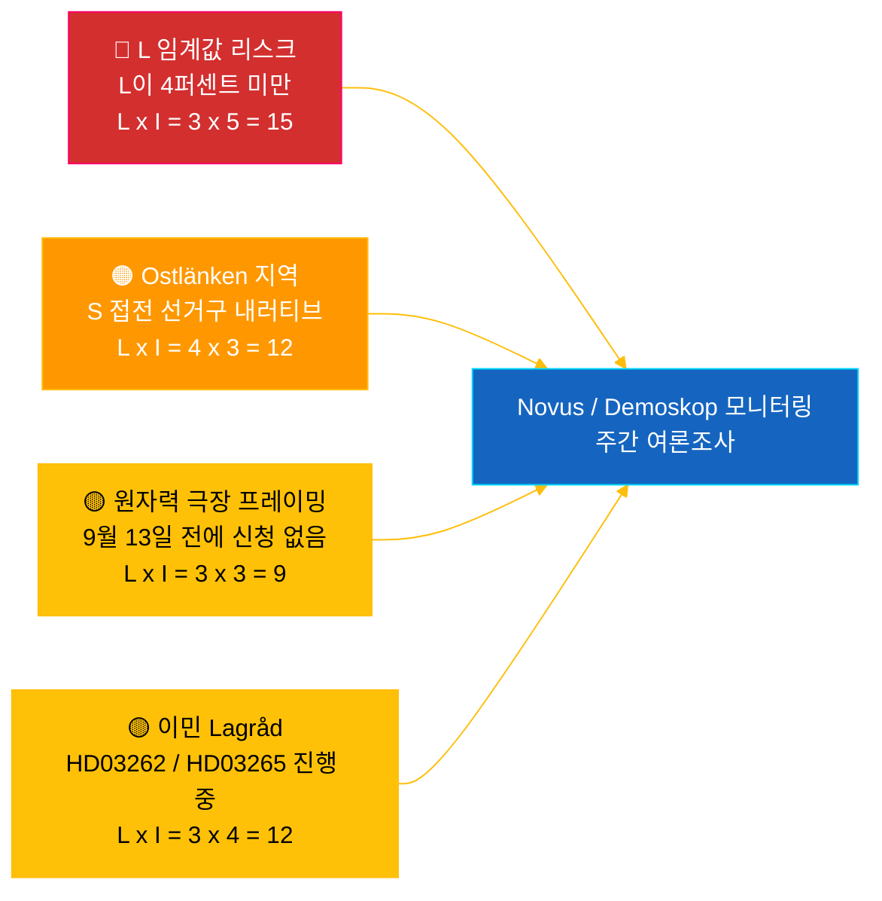

# 인텔리전스 브리핑 — 리크스다그 실시간 펄스 2026-05-04

**분류**: 🟢 공개 — Riksdagsmonitor Intelligence
**대상**: 편집자, 당직자, 연구자, 관심 있는 시민
**날짜**: 2026-05-04 (UTC)
**2026-09-13 선거까지**: 132일
**워크플로**: news-realtime-monitor
**작성**: Riksdagsmonitor AI 인텔리전스 시스템
**전체 신뢰 수준**: 🟩 높음 [A2] — `dok_id` 경유 공개 리크스다그 데이터 + IMF WEO 2026년 4월 다중 출처 교차 검증
**공개 결정**: **공개** (EN + KO) — DIW 우선순위 상위 기사 ≥ 9.0
**해결된 PIR**: PIR-RT-001, PIR-RT-005, PIR-RT-006

---

## 🎯 BLUF (요약)

스웨덴 리크스다그는 2026년 5월 4일, 선거 전 최고 수준의 집중된 입법 성과를 창출했다. 산업위원회(NU)는 원자력 발전소에 대한 직접 허가 부여를 승인했으며(`HD01NU19`, 2026년 6월 17일 발효) ——Tidö 연립 정부의 단일 최대 에너지 정책 구조적 성과——, 7회 연속 갱단 대책이 폭발물 규제 개혁(`HD01FöU13`)과 형사 절차 개혁(`HD01JuU9`)으로 진전되었으며, 두 가지 모두 2026년 7월 1일 발효된다. 이 정부 실적의 벽에 맞서, 사민당의 **에바 린드** 의원이 KD당 인프라부 장관 **안드레아스 칼손**에게 질의 `HD10463`을 제출——Ostlänken 링셰핑 역 추가 취소에 대해, 경쟁적 선거구 마진 지역의 50만 통근자에 대한 20년 약속 위반을 추궁했다. 정치 자금 투명성 보고서(`HD01KU39`)는 2026년 6월 16일 본회의 표결이 예정되어 있어, 선거 89일 전에 4개 노선 실적 내러티브(에너지·안보·투명성·재정 성과)를 완성시킨다. **신뢰 수준: 🟩 높음 [A2]** — 출처: 리크스다그 공개 데이터, IMF WEO 2026년 4월.

---

## 🧭 이 브리핑이 지원하는 3가지 결정

| # | 결정 | 의사결정자 | 기한 | 근거 |
|:-:|------|----------|:----:|------|
| 1 | **편집적:** 원자력 개혁 + Ostlänken 갈등 내러티브 이중 프레임으로 EN + KO 속보 기사 배포(2시간 내 게재 목표) | 편집장 | +2시간 | `HD01NU19` 위원회 결정 + `HD10463` 질의 2026-05-04 제출 |
| 2 | **전향적 취재:** 칼손의 Ostlänken 답변(법정 답변 기한: 2026년 5월 25일)과 원자력법 6월 17일 발효를 당직 기자에게 배정 | 당직자 | 2026-05-25 / 2026-06-17 | PIR-RT-005, PIR-RT-006; `HD10463` 질의 등록 |
| 3 | **리스크:** L 임계값 모니터링 수준을 관찰에서 적극적 추적으로 격상——연립 실적 논리는 L이 9월 13일에 4% 초과를 가정; Novus/Demoskop 조사 결과<4.5%는 연립 수학적 재검토 발동 | 분석 책임자 | 지속적 주간 | `coalition-dynamics.md`, 이민 후 여론 PIR-RT-003 |

---

## ⚡ 60초 읽기

- 🔴 **원자력 개혁으로 직접 허가 취득 (`HD01NU19`)** — 산업위원회(NU)가 직접 허가를 승인, 방사선안전청(SSM)의 다단계 파이프라인 우회; **2026년 6월 17일 발효**. Tidö 임기 중 단일 최대 구조적 입법 성과; 2022년 M/KD/L/SD의 원전 재가동 공약을 선거 전 운영 마일스톤 달성으로 실현 [🟩 높음 — `HD01NU19`, NU 위원회 회의록].
- 🟠 **Ostlänken 약속 위반 질의 (`HD10463`)** — S당 의원 **에바 린드**가 인프라부 장관 **안드레아스 칼손(KD)**에게 링셰핑 Ostlänken 역 계획 취소 설명 요구; 법정 답변 기한 **2026년 5월 25일**. 10일 만에 칼손에 대한 3번째 질의——50만 통근자에 대한 조율된 S 지역 압박 [🟩 높음 — `HD10463`, 질의 등록].
- 🟢 **7차 갱단 대책 진전 (`HD01FöU13` + `HD01JuU9`)** — 폭발물 허가 요건 강화(방위위원회, 2026년 7월 1일); 형사 절차 개혁이 *tilltrosbestämmelserna*를 폐지하고 조기 심문 증거 자료를 확대(사법위원회, 2026년 7월 1일). M/SD의 "안보에서 실적 내기" 핵심 내러티브 강화 [🟩 높음 — `HD01FöU13`, `HD01JuU9`].
- 🟡 **정치 자금 투명성 (`HD01KU39`)** — 헌법위원회가 정치 과정의 투명성에 관한 보고서 등록(높은 확률로 정당 자금 보고에 관한 제안 `HD03258` 포함); 본회의 표결 **2026년 6월 16일**; L/KD가 민주주의 개혁 포지셔닝에서 수혜. PIR-RT-002 해답: KU(JuU/SfU가 아닌)가 소관 [🟧 중간 — `HD01KU39`, 일정].
- 🔵 **경제적 맥락 (IMF WEO 2026년 4월)** — 스웨덴 공공 부채 ≈ GDP 대비 34%(`GGXWDG_NGDP` 2026년 전망) 대비 유로존 평균>90%; 2026년 실질 GDP 성장률 `NGDP_RPCH` 2.0–2.1%; 인플레이션 하락(`PCPIEPCH`). Riksbank 금리 인하 2025–26이 주택담보대출 이용자에게 전달→M의 "안정된 손" 내러티브 [🟩 높음 — 제공자: imf, 데이터플로: WEO_Apr_2026, 빈티지: 2026년 4월].
- 🟣 **상호 참조** — `HD01NU19`는 제안서 분석의 에너지 정책 스레드와 연결(`../propositions/`); `HD10463`은 `opposition-analysis.md`의 S 지역 약속 위반 클러스터 연장; 투명성 `HD01KU39`는 4월 30일 제안 패키지의 `HD03258` 포함.
- 🩷 **신흥 취약성 — "원자력 극장" 리스크** — 9월 13일 선거일 전에 신청이 제출되지 않으면 6월 17일 발효는 상징적이라는 야당 프레이밍. Vattenfall/Uniper/신규 진입자가 88일간의 선거 전 윈도우 내에 신청하지 않으면 실적 내러티브가 의문시될 위험 [🟧 중간 — PIR-RT-006 미해결].
- ⚪ **이월** — 이민 제안 `HD03262`와 `HD03265`에 대한 Lagråd 의견서(PIR-RT-001)는 **미해결——중요**; 헌법적 품질 심사는 이민 개혁의 정치적 내러티브를 여름에 형성하는 가장 영향력 있는 미해결 요인.

---

## 🗂️ 상위 문서 (DIW 순위)

| 순위 | dok_id | 제목(단축) | DIW | 신뢰 | 상태 |
|:----:|--------|-----------|:---:|:----:|------|
| 1 | `HD01NU19` | 원자력 허가 개혁(직접 경로) | 9.2 | 🟩 높음 [A2] | 위원회 승인 — 2026년 6월 17일 발효 |
| 2 | `HD10463` | Ostlänken 질의 — 린드(S) → 칼손(KD) | 8.6 | 🟩 높음 [A2] | 제출됨 — 답변 기한 2026년 5월 25일 |
| 3 | `HD01FöU13` | 폭발물 규제 개혁 | 7.5 | 🟩 높음 [A2] | 위원회 승인 — 2026년 7월 1일 발효 |
| 4 | `HD01JuU9` | 형사 절차 개혁 | 7.4 | 🟩 높음 [A2] | 위원회 승인 — 2026년 7월 1일 발효 |
| 5 | `HD01KU39` | 정치 과정의 투명성 | 7.0 | 🟧 중간 [B2] | 등록됨 — 본회의 표결 2026년 6월 16일 |
| 6 | `HD01FiU49` | 국가 채무 관리 평가 2021–2025 | 6.4 | 🟩 높음 [A2] | 등록됨 — 결정 2026년 6월 11일 |

---

## ⚠️ 리스크·위협 개요

| 리스크 | 가능성 | 영향 | 점수 | 트리거 | 출처 | 아드미랄티 |
|--------|:------:|:----:|:----:|--------|------|:----------:|
| Liberalerna가 4% 임계값 미달 → Tidö가 과반수 상실 | 3 | 5 | 15 | Novus/Demoskop 결과<4.0%(95% CI 하한<4.0) | `coalition-dynamics.md` R1 | **[B2]** |
| S 지역 약속 위반 내러티브가 Östergötland 접전 의석 전환 | 4 | 3 | 12 | SVT/SR Östergötland 편집부가 칼손의 5월 25일 답변을 불충분으로 평가 | `opposition-analysis.md` | **[A2]** |
| Lagråd 이민 패키지 `HD03262`/`HD03265`에 부정적 의견 | 3 | 4 | 12 | Lagråd 의견서가 30일 이내에 헌법적 이의를 포함해 공표 | PIR-RT-001 (`forward-indicators.md`) | **[A2]** |
| "원자력 극장" — 9월 13일 전에 신청 제출 없이 `HD01NU19` 발효 | 3 | 3 | 9 | Vattenfall/Uniper/신규 진입자가 2026년 9월 1일까지 신청을 제출하지 않음 | PIR-RT-006 | **[B2]** |

---

## 🔮 가장 중요한 향후 트리거

**안드레아스 칼손의 질의 `HD10463`에 대한 서면 답변, 법정 답변 기한 2026년 5월 25일.** 칼손이 링셰핑 Ostlänken 역 취소를 어떻게 프레이밍하는지——약속 위반을 인정하는지, 기술적/예산적 이유로 경로 변경을 옹호하는지, 대안 지역 인프라 제안으로 전환하는지——에 따라, Östergötland 내러티브가 여름 휴회 전에 본회의에서 완전한 질의 토론으로 에스컬레이션할지 여부가 결정된다. 회피적이거나 기술 관료적인 답변은 S가 내러티브를 링셰핑/노르셰핑에서 1–2개 접전 의석 전환으로 변환하는 가장 가능성 높은 경로. 실질적인 대안 투자 제안은 내러티브를 진정시킨다. 두 결과 모두 `coalition-mathematics.md`의 접전 선거구 평가를 시프트시키고 `electoral-implications.md`의 Pass-2 개정을 발동한다.

**부차 트리거**(병행 모니터링): 2026년 6월 16일 — `HD01KU39` 정치 자금 투명성 본회의 표결. 선거 89일 전에 정부의 4개 노선 실적 내러티브(에너지 + 안보 + 투명성 + 재정 성과)를 확인하거나 무너뜨린다.

---

## 📊 전략적 평가

**신뢰 수준: 🟩 높음 [A2]** — 출처에는 리크스다그 공개 데이터(`HD01NU19`, `HD10463`, `HD01FöU13`, `HD01JuU9`, `HD01KU39`, `HD01FiU49`), IMF WEO 2026년 4월 빈티지, 질의 등록이 포함된다.

2026년 5월 4일 스냅샷은 **최고 입법 속도**의 Tidö 연립 정부를 포착한다: 7개 연립 개혁이 1주일 만에 진전되고, 구체적인 발효일이 2026년 6월 1일부터 7월 1일까지 분산되어 있다. 각 발효일은 4개 연립 정당이 선거 운동에서 활용할 수 있는 실적 리듬을 만들어 낸다. 전략적 취약성은 비대칭적: M, KD, SD가 캐스케이드의 혜택을 받는 반면, **L**이 부담을 흡수——연립 최소 정당이 4% 임계값에 가장 가깝고, 불균형적인 의석 손실 위험을 안고 있다.

S 야당의 대응은 방법론적으로 정확하다: 안보·원자력·경제라는 정부의 가장 강한 지반에서 대항하는 대신, S는 **분산형 지역적 불만의 모자이크**를 구축——Östergötland의 Ostlänken(`HD10463`), Scandinavian Mountain Airport(질의 428), 스톡홀름의 주택(질의 434)——각각 다른 선거구에서 단일 장관(칼손)을 향하고 있다.

IMF의 거시 프레임워크는 현 정부에 유리하다: 공공 부채 ≈ GDP 대비 34%, 인플레이션 하락, 약 2% 성장. 경제적 내러티브는 M의 가장 강한 자산이다.

**2026년 선거 렌즈**: 현재 궤도는 Tidö를 175석 내외로 유지——과반수 경계선. L의 임계값 리스크(PIR-RT-003)가 단일 최중요 선거 변수. Lagråd 이민 의견서(PIR-RT-001)가 단일 최중요 정치적 내러티브 변수. 칼손의 Ostlänken 답변(PIR-RT-005)이 단일 최중요 지역 의석 변수. 세 가지 모두 이 브리핑 공개로부터 5주 이내에 해결된다.

---

## 📎 링크

| 링크 | 경로 |
|------|------|
| 기사 | [`article.md`](article.md) |
| 통합 개요 | [`synthesis-summary.md`](synthesis-summary.md) |
| 코어 통합 | [`core-synthesis.md`](core-synthesis.md) |
| 연립 다이나믹스 | [`coalition-dynamics.md`](coalition-dynamics.md) |
| 야당 분석 | [`opposition-analysis.md`](opposition-analysis.md) |
| 선거적 함의 | [`electoral-implications.md`](electoral-implications.md) |
| 경제적 맥락(IMF) | [`economic-context.md`](economic-context.md) |
| 선행 지표 | [`forward-indicators.md`](forward-indicators.md) |
| 리스크·기회 매트릭스 | [`risk-opportunity-matrix.md`](risk-opportunity-matrix.md) |
| 시나리오 분석 | [`scenario-analysis.md`](scenario-analysis.md) |
| 방법론 노트 | [`methodology-notes.md`](methodology-notes.md) |
| 데이터 매니페스트 | [`data-download-manifest.md`](data-download-manifest.md) |
| 문서별 분석 | [`documents/`](documents/) |

---

## 📝 문서 관리

- **브리핑 ID**: `EB-2026-05-04-001`
- **생성**: 2026-05-16 (보충——기존 Pass-2 분석 산출물에서 작성)
- **템플릿 경로**: [`analysis/templates/executive-brief.md`](../../../templates/executive-brief.md)
- **소유 방법론**: [`per-artifact-methodologies.md` § executive-brief](../../../methodologies/per-artifact-methodologies.md#executive-brief)
- **소유 게이트**: [`05-analysis-gate.md`](../../../../.github/prompts/05-analysis-gate.md) 체크 1 + 체크 7
- **출력 패밀리**: A — 코어 통합
- **분류**: 🟢 공개

*경제적 출처: 제공자: imf, 데이터플로: WEO_Apr_2026, 지표: NGDP_RPCH / GGXWDG_NGDP / PCPIEPCH, 빈티지: 2026년 4월, retrieved_at: 2026-05-04. 리크스다그 데이터는 riksdag-regering API 경유 2026-05-04 취득. Riksdagsmonitor는 hack23 AB가 제작; 본 브리핑은 공개되어 있는 의회 문서에 기반한 독립적인 편집적 평가를 대표한다.*

<!-- source-sha: f8cfbe724a92e48089f650d9e1f52abe004ed7f7 -->
