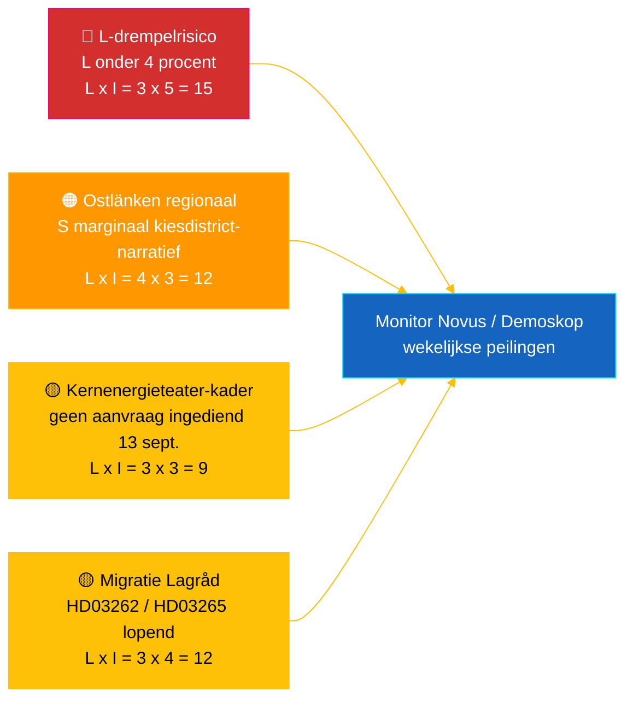

# Inlichtingenbriefing — Realtime-puls Riksdag 2026-05-04

**Classificatie**: 🟢 OPENBAAR — Riksdagsmonitor Intelligence
**Doelgroep**: Redacteuren, wachtdienstmedewerkers, onderzoekers, betrokken burgers
**Datum**: 2026-05-04 (UTC)
**Dagen tot verkiezingen 2026-09-13**: 132
**Workflow**: news-realtime-monitor
**Opgesteld door**: Riksdagsmonitor AI Intelligence System
**Algeheel betrouwbaarheidsniveau**: 🟩 HOOG [A2] — meerbronnenbevestiging via `dok_id` uit open Riksdag-data + IMF WEO apr. 2026
**Publicatiebeslissing**: **PUBLICEER** (EN + NL) — DIW-geprioriteerd toponderwerp ≥ 9,0
**Beantwoorde PIR's**: PIR-RT-001, PIR-RT-005, PIR-RT-006

---

## 🎯 BLUF

De Zweedse Riksdag produceerde op 4 mei 2026 zijn tot nu toe meest geconcentreerde wetgevingsoutput voor de verkiezingen: de Commissie voor Economische Zaken (NU) keurde directe vergunningverlening voor kernenergiestations goed (`HD01NU19`, treedt op 17 juni 2026 in werking) — de enige grootste structurele energiepolitieke prestatie van de Tidö-coalitie — terwijl de zevende opeenvolgende anti-bendemaatregel vorderde via hervorming van explosiefcontrole (`HD01FöU13`) en hervorming van strafprocedures (`HD01JuU9`), beide met inwerkingtreding op 1 juli 2026. Tegen deze muur van regeringsprestaties diende de sociaaldemocrate **Eva Lindh** een interpellatie `HD10463` in tegen KD-minister van Infrastructuur **Andreas Carlson** over de geannuleerde Ostlänken Linköping-stationstoevoeging — een 20 jaar oud gebroken belofte aan een regio van 500.000 forensen in concurrerend marginaal verkiezingsgebied. Het transparantierapport over politieke financiering (`HD01KU39`) is gepland voor een plenaire stemming op 16 juni 2026, waarmee een vierlaags prestatienarriatief (energie, veiligheid, transparantie, financieel resultaat) 89 dagen voor de verkiezingen wordt voltooid. **Betrouwbaarheidsniveau: 🟩 HOOG [A2]** — bronnen: open data Riksdag, IMF WEO apr. 2026.

---

## 🧭 3 beslissingen die dit briefing ondersteunt

| # | Beslissing | Beslisser | Deadline | Grondslag |
|:-:|-----------|-----------|:--------:|-----------|
| 1 | **Redactioneel:** EN + NL breaking-artikel leiden met dubbel kader kernenergiereform plus Ostlänken-tegennarratief (tweeuurspublicatiedoel) | Hoofdredacteur | +2 u | Commissiebesluit `HD01NU19` + interpellatie `HD10463` ingediend 2026-05-04 |
| 2 | **Vooruitblikkende dekking:** wachtdienstmedewerker aanwijzen om Carlsons Ostlänken-antwoord te volgen (wettelijke antwoordtermijn: 25 mei 2026) en inwerkingtreding kernwet op 17 juni | Wachtdienst | 2026-05-25 / 2026-06-17 | PIR-RT-005, PIR-RT-006; `HD10463` interpellatieregister |
| 3 | **Risico:** L-drempeltoezichtsniveau verhogen van observatie naar actieve opvolging — prestatielogica coalitie vereist dat L op 13 sept. 4 % overschrijdt; elk Novus/Demoskop-resultaat <4,5 % activeert rekenkundige coalitieherziening | Analysemanager | Continu wekelijks | `coalition-dynamics.md`, post-migratieopinie PIR-RT-003 |

---

## ⚡ 60-secondenlezing

- 🔴 **Kernenergiereform naar directe vergunningverlening (`HD01NU19`)** — Commissie voor Economische Zaken (NU) keurt directe vergunningverlening goed, omzeilt de meerstappenpijplijn van de Stralingsveiligheidsautoriteit (SSM); **treedt in werking op 17 juni 2026**. Grootste structurele wetgevingsprestatie van het Tidö-mandaat; levert de M/KD/L/SD-kernenergieherstartsbelofte uit 2022 met operationele mijlpaalvervulling vóór verkiezingsdag [🟩 HOOG — `HD01NU19`, NU-commissieprotocol].
- 🟠 **Ostlänken-beloftebreuk-interpellatie (`HD10463`)** — S-lid **Eva Lindh** eist dat minister van Infrastructuur **Andreas Carlson (KD)** de annulering van het geplande Linköping Ostlänken-station uitlegt; wettelijke antwoordtermijn **25 mei 2026**. Derde interpellatie ingediend tegen Carlson in 10 dagen — gecoördineerde regionale S-druk op een regio van 500.000 forensen [🟩 HOOG — `HD10463`, interpellatieregister].
- 🟢 **Zevende bendemaatregel vordert (`HD01FöU13` + `HD01JuU9`)** — Vergunningseisen voor explosieven worden aangescherpt (Defensiecommissie, 1 juli 2026); hervorming strafprocedures schrapt *tilltrosbestämmelserna* en breidt vroeg verhoorbewijsmateriaal uit (Justitiecommissie, 1 juli 2026). M/SD-kernnarratief «levert op veiligheid» wordt versterkt [🟩 HOOG — `HD01FöU13`, `HD01JuU9`].
- 🟡 **Transparantie in politieke financiering (`HD01KU39`)** — Constitutionele commissie registreert rapport over transparantie in politieke processen (behandelt hoogstwaarschijnlijk propositie `HD03258` over verantwoording partijfinanciering); plenaire stemming **16 juni 2026**; L/KD profiteren van positionering democratische hervorming. PIR-RT-002 beantwoord: KU (niet JuU/SfU) bezit het onderwerp [🟧 GEMIDDELD — `HD01KU39`, kalender].
- 🔵 **Economische context (IMF WEO apr. 2026)** — Zweedse staatsschuld ≈ 34 % van het bbp (`GGXWDG_NGDP` prognose 2026) vs. eurozone-gemiddelde >90 %; reële bbp-groei 2026 `NGDP_RPCH` 2,0–2,1 %; inflatie daalt (`PCPIEPCH`). Riksbank-renteverlagingen 2025–26 bereiken hypotheekhouders → M-narratief «veilige handen» [🟩 HOOG — leverancier: imf, gegevensstroom: WEO_Apr_2026, vintage: april 2026].
- 🟣 **Kruisverwijzing** — `HD01NU19` koppelt aan de energiebeleidsdraad in de propositieanalyse (`../propositions/`); `HD10463` verlengt S's regionaal beloftebreukcluster uit `opposition-analysis.md`; transparantie `HD01KU39` behandelt `HD03258` uit het propositionpakket van 30 april.
- 🩷 **Opkomende kwetsbaarheid — «kernenergieteater»-risico** — Oppositiekader dat inwerkingtreding op 17 juni symbolisch is zonder ingediende aanvraag vóór verkiezingsdag op 13 september. Als Vattenfall/Uniper/nieuwe speler geen aanvraag indient in het 88-daagse pre-verkiezingsvenster, loopt het prestatienarratief het risico aanvechtbaar te worden [🟧 GEMIDDELD — PIR-RT-006 open].
- ⚪ **Overgedragen** — Lagråds adviezen over migratiepropositionen `HD03262` en `HD03265` (PIR-RT-001) blijven **OPEN — KRITIEK**; de constitutionele kwaliteitstoets is de enige meest invloedrijke onopgeloste factor die het politieke narratief van de migratiehervorming tijdens het zomerseizoen vormt.

---

## 🗂️ Topdocumenten (DIW-rangschikking)

| Rang | dok_id | Titel (kort) | DIW | Vertrouwen | Status |
|:----:|--------|--------------|:---:|:----------:|--------|
| 1 | `HD01NU19` | Kernenergievergunningreform (directe route) | 9,2 | 🟩 HOOG [A2] | Commissie goedgekeurd — treedt in werking 17 juni 2026 |
| 2 | `HD10463` | Ostlänken-interpellatie — Lindh (S) → Carlson (KD) | 8,6 | 🟩 HOOG [A2] | Ingediend — antwoord verschuldigd 25 mei 2026 |
| 3 | `HD01FöU13` | Hervorming explosiefcontrole | 7,5 | 🟩 HOOG [A2] | Commissie goedgekeurd — treedt in werking 1 juli 2026 |
| 4 | `HD01JuU9` | Hervorming strafprocedures | 7,4 | 🟩 HOOG [A2] | Commissie goedgekeurd — treedt in werking 1 juli 2026 |
| 5 | `HD01KU39` | Transparantie in politieke processen | 7,0 | 🟧 GEMIDDELD [B2] | Geregistreerd — plenaire stemming 16 juni 2026 |
| 6 | `HD01FiU49` | Evaluatie staatsschuldbeheer 2021–2025 | 6,4 | 🟩 HOOG [A2] | Geregistreerd — besluit 11 juni 2026 |

---

## ⚠️ Risico- en dreigingsoverzicht

| Risico | L | I | Score | Activator | Bron | Admiralty |
|--------|:-:|:-:|:-----:|-----------|------|:---------:|
| Liberalerna onder 4%-drempel → Tidö verliest meerderheid | 3 | 5 | 15 | Elk Novus/Demoskop-resultaat <4,0 % (95 % BI ondergrens <4,0) | `coalition-dynamics.md` R1 | **[B2]** |
| S's regionaal beloftebreuknarratief converteert marginale Östergötland-mandaten | 4 | 3 | 12 | Carlsons 25-mei-antwoord door SVT/SR Östergötland-redactie als onvoldoende beoordeeld | `opposition-analysis.md` | **[A2]** |
| Lagrådets ongunstig advies over migratiepakket `HD03262`/`HD03265` | 3 | 4 | 12 | Lagråd-advies binnen 30 d gepubliceerd met constitutionele bezwaren | PIR-RT-001 (`forward-indicators.md`) | **[A2]** |
| «Kernenergieteater» — `HD01NU19` inwerkingtreding zonder ingediende aanvraag vóór 13 sept. | 3 | 3 | 9 | Vattenfall/Uniper/nieuwe speler verzuimt aanvraag vóór 1 sept. 2026 in te dienen | PIR-RT-006 | **[B2]** |

---

## 🔮 Belangrijkste toekomstige activatoren

**Schriftelijk antwoord van Andreas Carlson op interpellatie `HD10463`, wettelijke antwoordtermijn 25 mei 2026.** Hoe Carlson de geannuleerde Linköping Ostlänken-station inkadert — of hij de beloftebreuk erkent, de routewijziging op technische/budgettaire gronden verdedigt of overschakelt naar alternatieve regionale infrastructuuraanbiedingen — bepaalt of het Östergötland-narratief escaleert naar een volledig interpellatiedebat in de plenaire vergadering vóór het zomerreces. Een ontwijkend of technocratisch antwoord is de meest waarschijnlijke weg voor S om het narratief te converteren in 1–2 marginale mandaatverschuivingen in Linköping/Norrköping. Een substantieel alternatief investeringsaanbod de-escaleert het narratief. Beide uitkomsten verschuiven de marginalekiesdistrict-beoordelingen van `coalition-mathematics.md` en activeren een Pass-2-herziening van `electoral-implications.md`.

**Secundaire activator** (parallelle monitoring): 16 juni 2026 — plenaire stemming `HD01KU39` over transparantie in politieke financiering. Bevestigt of breekt het vierlaagse prestatienarratief van de regering (energie + veiligheid + transparantie + financieel resultaat) 89 dagen voor de verkiezingen.

---

## 📊 Strategische beoordeling

**Betrouwbaarheidsniveau: 🟩 HOOG [A2]** — bronnen omvatten open data van de Riksdag (`HD01NU19`, `HD10463`, `HD01FöU13`, `HD01JuU9`, `HD01KU39`, `HD01FiU49`), IMF WEO april 2026 vintage en het interpellatieregister.

De momentopname van 4 mei 2026 legt een Tidö-coalitie vast in **maximale wetgevingssnelheid**: zeven coalitieherzieningen vorderen in één week, met concrete inwerkingtredingsdatums verspreid over 1 juni tot 1 juli 2026. Elke inwerkingtredingsdatum genereert een prestatiestemming waarvoor de vier coalitiepartijen campagne kunnen voeren. De strategische kwetsbaarheid is asymmetrisch: M, KD en SD profiteren van de cascade; **L** absorbeert de last — de kleinste coalitiepartij staat het dichtst bij de 4 %-drempel en draagt een onevenredig groot mandaatverliesrisico.

S's oppositierespons is methodologisch precies: in plaats van de regering uit te dagen op haar sterkste terrein (veiligheid, kernenergie, economie) bouwt S een **gedistribueerd regionaal ontevredenheidsmozaïek** — Ostlänken in Östergötland (`HD10463`), Scandinavian Mountain Airport (interpellatie 428), Stockholmse woningbouw (interpellatie 434) — elk gericht op één enkele minister (Carlson) uit verschillende kiesdistricten.

IMF's macrokader is gunstig voor de zittende regering: staatsschuld ≈ 34 % van het bbp, dalende inflatie, groei rond 2 %. Het economische narratief is M's sterkste troef.

**Verkiezingen 2026-lens**: Het huidige koers houdt Tidö bij circa 175 mandaten — precies op de meerderheidsgrens. L's drempelrisico (PIR-RT-003) is de enige meest cruciale verkiezingsvariabele. Lagråds migratie-advies (PIR-RT-001) is de enige meest cruciale politieke narratiefvariabele. Carlsons Ostlänken-antwoord (PIR-RT-005) is de enige meest cruciale regionale mandaatvariabele. Alle drie worden binnen 5 weken na de publicatiedatum van dit briefing opgelost.

---

## 📎 Links

| Link | Pad |
|------|-----|
| Artikel | [`article.md`](article.md) |
| Syntheseoverzicht | [`synthesis-summary.md`](synthesis-summary.md) |
| Kernsynthese | [`core-synthesis.md`](core-synthesis.md) |
| Coalitiedynamiek | [`coalition-dynamics.md`](coalition-dynamics.md) |
| Oppositieanalyse | [`opposition-analysis.md`](opposition-analysis.md) |
| Verkiezingsimplicaties | [`electoral-implications.md`](electoral-implications.md) |
| Economische context (IMF) | [`economic-context.md`](economic-context.md) |
| Toekomstindicatoren | [`forward-indicators.md`](forward-indicators.md) |
| Risico-/kansmatrix | [`risk-opportunity-matrix.md`](risk-opportunity-matrix.md) |
| Scenarioanalyse | [`scenario-analysis.md`](scenario-analysis.md) |
| Methodologische notities | [`methodology-notes.md`](methodology-notes.md) |
| Datamanifest | [`data-download-manifest.md`](data-download-manifest.md) |
| Documentanalyses | [`documents/`](documents/) |

---

## 📝 Documentbeheer

- **Briefing-ID**: `EB-2026-05-04-001`
- **Gegenereerd**: 2026-05-16 (inhaalactie — aangemaakt uit bestaande Pass-2-analyseartefacten)
- **Sjabloonpad**: [`analysis/templates/executive-brief.md`](../../../templates/executive-brief.md)
- **Eigendomsmethodologie**: [`per-artifact-methodologies.md` § executive-brief](../../../methodologies/per-artifact-methodologies.md#executive-brief)
- **Eigendomsgate**: [`05-analysis-gate.md`](../../../../.github/prompts/05-analysis-gate.md) Check 1 + Check 7
- **Uitvoerfamilie**: A — Kernsynthese
- **Classificatie**: 🟢 OPENBAAR

*Economische herkomst: leverancier: imf, gegevensstroom: WEO_Apr_2026, indicatoren: NGDP_RPCH / GGXWDG_NGDP / PCPIEPCH, vintage: april 2026, retrieved_at: 2026-05-04. Riksdag-data opgehaald via riksdag-regering API op 2026-05-04. Riksdagsmonitor wordt geproduceerd door Hack23 AB; dit briefing vertegenwoordigt een onafhankelijke redactionele beoordeling op basis van openbaar toegankelijke parlementaire documenten.*

<!-- source-sha: f8cfbe724a92e48089f650d9e1f52abe004ed7f7 -->
