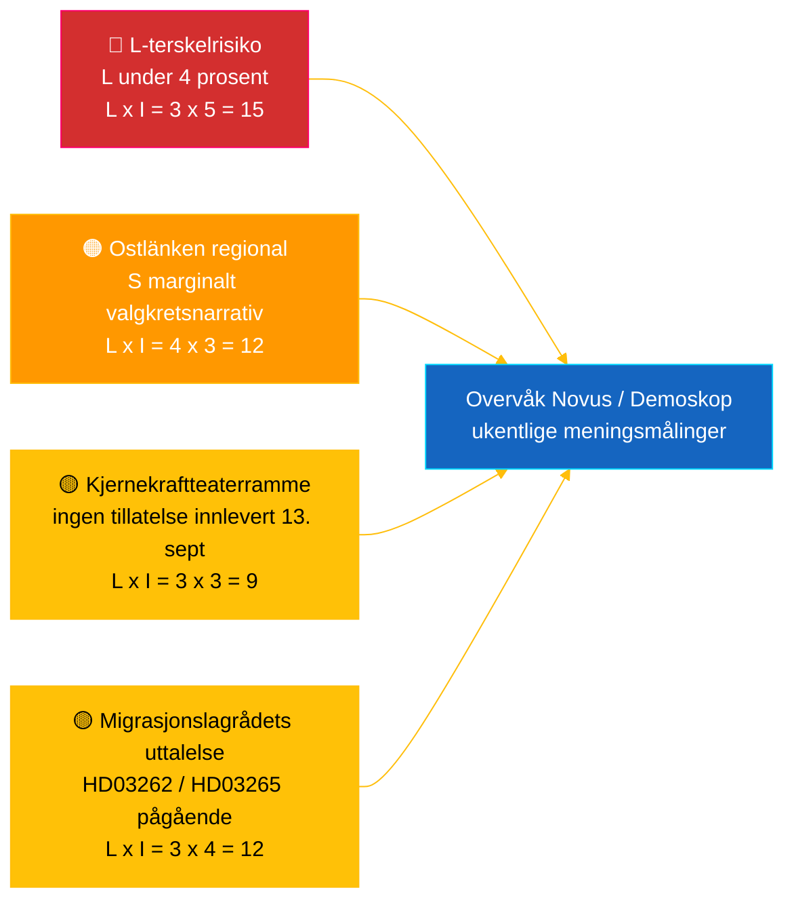

# Etterretningsbriefing — Realtidspuls Riksdag 2026-05-04

**Klassifisering**: 🟢 OFFENTLIG — Riksdagsmonitor Intelligence
**Målgruppe**: Redaktører, vakthavende, forskere, engasjerte borgere
**Dato**: 2026-05-04 (UTC)
**Dager til valget 2026-09-13**: 132
**Arbeidsflyt**: news-realtime-monitor
**Utarbeidet av**: Riksdagsmonitor AI Intelligence System
**Samlet konfidensnivå**: 🟩 HØY [A2] — flerkildekorraborering via `dok_id` fra åpne Riksdag-data + IMF WEO apr 2026
**Publiseringsbeslutning**: **PUBLISER** (EN + NO) — DIW-rangert topphistorie ≥ 9,0
**PIR-er besvart**: PIR-RT-001, PIR-RT-005, PIR-RT-006

---

## 🎯 BLUF

Sveriges Riksdag produserte den 4. mai 2026 sin hittil mest konsentrerte lovgivningsoutput før valget: Næringsutvalget (NU) godkjente direktesporsgodkjenning av kjernekraftanlegg (`HD01NU19`, trer i kraft 17. juni 2026) — Tidø-koalisjonens eneste største strukturelle energipolitiske bragd — mens den 7. fortløpende anti-kriminalitetsinnsats avanserte via eksplosivregulering (`HD01FöU13`) og reform av strafferetlige prosesser (`HD01JuU9`), begge med ikrafttreden 1. juli 2026. Mot denne veggen av regjeringsleveranse innleverte sosialdemokraten **Eva Lindh** en interpellasjon `HD10463` mot KD's infrastrukturminister **Andreas Carlson** om den avlyste Ostlänken Linköping-stasjonstilføyelsen — et 20 år gammelt løftebrudd mot en 500 000-personers pendlerregion i konkurranseutsatt valgkretsmarginalt territorium. Transparensrapporten om politisk finansiering (`HD01KU39`) er planlagt til plenarvote den 16. juni 2026, som fullfører et firesporet leveringsnarrativ (energi, sikkerhet, transparens, finansielt resultat) 89 dager før valget. **Konfidensnivå: 🟩 HØY [A2]** — kilder: Riksdagens åpne data, IMF WEO apr 2026.

---

## 🧭 3 beslutninger denne briefingen støtter

| # | Beslutning | Beslutningstaker | Frist | Grunnlag |
|:-:|------------|------------------|:-----:|---------|
| 1 | **Redaksjonell:** lede EN + NO breaking-artikkel med kjernekraftreform-pluss-Ostlänken-motnarrativ (dobbeltramme, 2-timers publiseringsmål) | Sjefredaktør | +2 t | `HD01NU19` utvalgsvedtak + `HD10463` interpellasjon innlevert 2026-05-04 |
| 2 | **Fremadrettet dekning:** tildel vakthavende til å følge Carlsons Ostlänken-svar (lovpliktig svarsfrist 25. mai 2026) og kjerneloven ikrafttreden 17. juni | Vakthavende | 2026-05-25 / 2026-06-17 | PIR-RT-005, PIR-RT-006; `HD10463` interpellasjonsregister |
| 3 | **Risiko:** hev L-terskelovervåkningsnivå fra observasjon til aktiv sporing — koalisjonens leveringsdynamikk forutsetter at L overstiger 4 % den 13. sept; ethvert Novus/Demoskop-resultat <4,5 % utløser koalisjonsmatematisk revisjon | Analyseleder | Rullende ukentlig | `coalition-dynamics.md`, post-migrasjonsopinion PIR-RT-003 |

---

## ⚡ 60-sekunders lesing

- 🔴 **Kjernekraftreform til direktesporsgodkjenning (`HD01NU19`)** — Næringsutvalget (NU) godkjenner direktesporsgodkjenning, omgår Strålsikkerhetsmyndighetens (SSM) flertrinns-pipeline; **trer i kraft 17. juni 2026**. Tidø-mandatperiodens eneste største strukturelle lovgivningsbragd; leverer M/KD/L/SD's kjernekraftgjenstartsløfte fra 2022 med operasjonell milepæloppfyllelse før valgdagen [🟩 HØY — `HD01NU19`, NU's utvalgsprotokoll].
- 🟠 **Ostlänken-løftebrudd-interpellasjon (`HD10463`)** — S-representant **Eva Lindh** krever at infrastrukturminister **Andreas Carlson (KD)** redegjør for avlysningen av den planlagte Linköping Ostlänken-stasjonen; lovpliktig svarsfrist **25. mai 2026**. Tredje interpellasjon innlevert mot Carlson på 10 dager — koordinert regionalt S-press på en 500 000-personers pendlingsregion [🟩 HØY — `HD10463`, interpellasjonsregisteret].
- 🟢 **Syvende gjenginnsats avanserer (`HD01FöU13` + `HD01JuU9`)** — Tillatelseskrav til eksplosiver skjerpes (Forsvarsutvalget, 1. juli 2026); reform av strafferetlige prosesser avvikler *tilltrosbestämmelserna* og utvider tidlig avhørsbevismateriell (Justisutvalget, 1. juli 2026). M/SD's kjernefortelling om «leverer på sikkerhet» styrkes [🟩 HØY — `HD01FöU13`, `HD01JuU9`].
- 🟡 **Politisk finansieringstransparens (`HD01KU39`)** — Grunnlovsutvalget registrerer betenkning om transparens i politiske prosesser (behandler med stor sannsynlighet proposisjon `HD03258` om redegjørelse for partifinansering); plenarvote **16. juni 2026**; L/KD drar fordel av demokratireformposisjonering. PIR-RT-002 besvart: KU (ikke JuU/SfU) eier saken [🟧 MIDDELS — `HD01KU39`, kalenderen].
- 🔵 **Ekonomisk kontekst (IMF WEO apr 2026)** — Sveriges offentlige gjeld ≈ 34 % av BNP (`GGXWDG_NGDP` 2026-prognose) mot eurosone-gjennomsnittet >90 %; reel BNP-vekst 2026 `NGDP_RPCH` 2,0–2,1 %; inflasjon synker (`PCPIEPCH`). Riksbankens rentekutt 2025–26 når boliglånstakere → M's «trygge hender»-fortelling [🟩 HØY — leverandør: imf, dataflyt: WEO_Apr_2026, vintage: april 2026].
- 🟣 **Krysshenvisning** — `HD01NU19` knytter til energipolitikktråden i proposisjonsanalysen (`../propositions/`); `HD10463` forlenger S's regionale løftebruddkluster fra `opposition-analysis.md`; transparens `HD01KU39` behandler `HD03258` fra 30. april-proposisjonspakken.
- 🩷 **Fremvoksende sårbarhet — «kjernekraftteater»-risiko** — Opposisjonens ramme om at ikrafttreden 17. juni er symbolsk uten innlevert søknad innen valgdagen den 13. september. Hvis Vattenfall/Uniper/ny aktør ikke leverer søknad innen det 88-dagers pre-valgsvinduet, risikerer prestasjonsfortelling å bli anfektelig [🟧 MIDDELS — PIR-RT-006 åpen].
- ⚪ **Overført** — Lagrådets uttalelser om migrasjonsproposisjonene `HD03262` og `HD03265` (PIR-RT-001) forblir **ÅPNE — KRITISKE**; den konstitusjonelle kvalitetsgjennomgangen er den eneste mest innflytelsesrike uløste faktoren som former migrasjonsreformens politiske fortelling i sommersesonga.

---

## 🗂️ Topprangerte dokumenter (DIW-rangert)

| Rang | dok_id | Tittel (kort) | DIW | Konfidens | Status |
|:----:|--------|---------------|:---:|:---------:|--------|
| 1 | `HD01NU19` | Kjernekrafttillatelsesreform (direkte spor) | 9,2 | 🟩 HØY [A2] | Utvalg vedtatt — trer i kraft 17. juni 2026 |
| 2 | `HD10463` | Ostlänken-interpellasjon — Lindh (S) → Carlson (KD) | 8,6 | 🟩 HØY [A2] | Innlevert — svar forfaller 25. mai 2026 |
| 3 | `HD01FöU13` | Reform av eksplosivregulering | 7,5 | 🟩 HØY [A2] | Utvalg vedtatt — trer i kraft 1. juli 2026 |
| 4 | `HD01JuU9` | Reform av strafferetlige prosesser | 7,4 | 🟩 HØY [A2] | Utvalg vedtatt — trer i kraft 1. juli 2026 |
| 5 | `HD01KU39` | Transparens i politiske prosesser | 7,0 | 🟧 MIDDELS [B2] | Registrert — plenarvote 16. juni 2026 |
| 6 | `HD01FiU49` | Statsgjeldforvaltningsevaluering 2021–2025 | 6,4 | 🟩 HØY [A2] | Registrert — vedtak 11. juni 2026 |

---

## ⚠️ Risiko- og trusselbildet

| Risiko | L | I | Score | Utløser | Kilde | Admiralty |
|--------|:-:|:-:|:-----:|---------|-------|:---------:|
| Liberalerna under 4%-terskel → Tidø mister majoritet | 3 | 5 | 15 | Ethvert Novus/Demoskop-resultat <4,0 % (95 % KI nedre grense <4,0) | `coalition-dynamics.md` R1 | **[B2]** |
| S's regionale løftebruddnarrativ konverterer marginale Østergötland-mandater | 4 | 3 | 12 | Carlsons 25. mai-svar vurdert utilstrekkelig av SVT/SR Østergötlands redaksjon | `opposition-analysis.md` | **[A2]** |
| Lagrådets fiendtlige uttalelse om migrasjonspakken `HD03262`/`HD03265` | 3 | 4 | 12 | Lagrådets uttalelse offentliggjort innen 30 d med konstitusjonelle innvendinger | PIR-RT-001 (`forward-indicators.md`) | **[A2]** |
| «Kjernekraftteater» — `HD01NU19` ikrafttreden uten innlevert søknad innen 13. sept | 3 | 3 | 9 | Vattenfall/Uniper/ny aktør unnlater å levere søknad innen 1. sept 2026 | PIR-RT-006 | **[B2]** |

---

## 🔮 Viktigste fremtidige utløsere

**Andreas Carlsons skriftlige svar på interpellasjon `HD10463`, lovpliktig svarsfrist 25. mai 2026.** Carlsons måte å ramme inn den avlyste Linköping Ostlänken-stasjonen — om han innrømmer løftebrudd, forsvarer ruteendringen på tekniske/budsjettmessige grunnlag eller svinger mot alternative regionale infrastrukturtilbud — avgjør om Østergötland-narrativet eskalerer til en full interpellasjonsdebatt i kammeret før sommeropphøret. Et unnvikende eller teknokratisk svar er den mest sannsynlige veien for S til å omdanne narrativet til 1–2 marginale mandatskift i Linköping/Norrköping. Et substansielt alternativt investeringstilbud de-eskalerer narrativet. Begge utfall forskyver `coalition-mathematics.md`'s marginale valgkretsvurderinger og utløser en Pass-2-omskriving av `electoral-implications.md`.

**Sekundær utløser** (parallell overvåking): 16. juni 2026 — `HD01KU39` plenarvote om politisk finansieringstransparens. Bekrefter eller bryter det firesporede leveringsnarrativet for regjeringen (energi + sikkerhet + transparens + finansielt resultat) 89 dager før valget.

---

## 📊 Strategisk vurdering

**Konfidensnivå: 🟩 HØY [A2]** — kilder inkluderer Riksdagens åpne data (`HD01NU19`, `HD10463`, `HD01FöU13`, `HD01JuU9`, `HD01KU39`, `HD01FiU49`), IMF WEO april 2026 vintage og interpellasjonsregisteret.

Øyeblikksbildet fra 4. mai 2026 fanger en Tidø-koalisjon i **maksimal lovgivningshastighet**: syv koalisjonsreformer avanserer i løpet av én uke, med konkrete ikrafttreden-datoer spredt fra 1. juni til 1. juli 2026. Hver ikrafttreden-dato genererer en leveringstakt som de fire koalisjonspartiene kan drive valgkamp på. Den strategiske sårbarheten er asymmetrisk: M, KD og SD drar fordel av kaskaden; **L** absorberer belastningen — det minste koalisjonspartiet er nærmest 4 %-grensen og bærer uforholdsmessig mandatrisiko.

S-opposisjonens svar er metodologisk presist: i stedet for å utfordre regjeringen på dens sterkeste grunn (sikkerhet, kjernekraft, økonomi) bygger S en **distribuert regional-misnøyemosaikk** — Ostlänken i Østergötland (`HD10463`), Scandinavian Mountain Airport (interpellasjon 428), Stockholms boliger (interpellasjon 434) — hver rettet mot én enkelt minister (Carlson) fra forskjellige valgkretser.

IMF's makroramme er gunstig for sittende regjering: offentlig gjeld ≈ 34 % av BNP, fallende inflasjon, vekst på ca. 2 %. Det økonomiske narrativet er M's sterkeste aktivum.

**Valg 2026-linse**: Nåværende kurs holder Tidø nær 175 mandater — presist ved majoritetsgrensene. L's terskelrisiko (PIR-RT-003) er den eneste viktigste valgvariabelen. Lagrådets migrasjonsuttalelse (PIR-RT-001) er den eneste viktigste politiske narrativvariabelen. Carlsons Ostlänken-svar (PIR-RT-005) er den eneste viktigste regionale mandatvariabelen. Alle tre løses innen 5 uker fra denne briefingens publiseringsdato.

---

## 📎 Lenker

| Lenke | Sti |
|-------|-----|
| Artikkel | [`article.md`](article.md) |
| Synteseoversikt | [`synthesis-summary.md`](synthesis-summary.md) |
| Kjernesyntese | [`core-synthesis.md`](core-synthesis.md) |
| Koalisjonsdinamikk | [`coalition-dynamics.md`](coalition-dynamics.md) |
| Opposisjonsanalyse | [`opposition-analysis.md`](opposition-analysis.md) |
| Valgimplikasjoner | [`electoral-implications.md`](electoral-implications.md) |
| Ekonomisk kontekst (IMF) | [`economic-context.md`](economic-context.md) |
| Fremtidsindikatorer | [`forward-indicators.md`](forward-indicators.md) |
| Risiko-/mulighetsmatrise | [`risk-opportunity-matrix.md`](risk-opportunity-matrix.md) |
| Scenarieanalyse | [`scenario-analysis.md`](scenario-analysis.md) |
| Metodenotater | [`methodology-notes.md`](methodology-notes.md) |
| Datamanifest | [`data-download-manifest.md`](data-download-manifest.md) |
| Per-dokumentanalyser | [`documents/`](documents/) |

---

## 📝 Dokumentkontroll

- **Briefing-ID**: `EB-2026-05-04-001`
- **Generert**: 2026-05-16 (etterslepsfylling — skapt fra eksisterende Pass-2-analyseartefakter)
- **Malonsti**: [`analysis/templates/executive-brief.md`](../../../templates/executive-brief.md)
- **Eierskapsmetodologi**: [`per-artifact-methodologies.md` § executive-brief](../../../methodologies/per-artifact-methodologies.md#executive-brief)
- **Eierskapsgate**: [`05-analysis-gate.md`](../../../../.github/prompts/05-analysis-gate.md) Check 1 + Check 7
- **Utdatafamilie**: A — Kjernesyntese
- **Klassifisering**: 🟢 OFFENTLIG

*Risikoprovenianse: leverandør: imf, dataflyt: WEO_Apr_2026, indikatorer: NGDP_RPCH / GGXWDG_NGDP / PCPIEPCH, vintage: april 2026, retrieved_at: 2026-05-04. Riksdagsdata hentet via riksdag-regering API 2026-05-04. Riksdagsmonitor produseres av Hack23 AB; denne briefingen representerer en uavhengig redaksjonell vurdering basert på offentlig tilgjengelige parlamentariske dokumenter.*

<!-- source-sha: f8cfbe724a92e48089f650d9e1f52abe004ed7f7 -->
