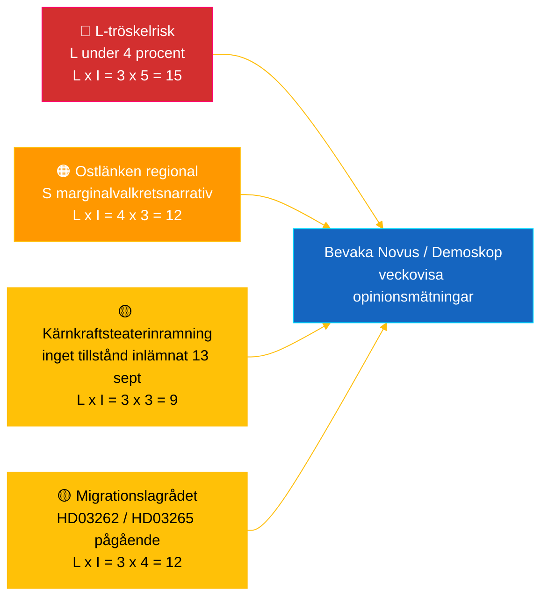

# Verksamhetsunderrättelse — Riksdagens Realtidspuls 2026-05-04

**Klassificering**: 🟢 OFFENTLIG — Riksdagsmonitor Intelligence
**Målgrupp**: Redaktörer, jourhavande, forskare, engagerade medborgare
**Datum**: 2026-05-04 (UTC)
**Dagar till val 2026-09-13**: 132
**Arbetsflöde**: news-realtime-monitor
**Framtaget av**: Riksdagsmonitor AI Intelligence System
**Övergripande konfidensgrad**: 🟩 HÖG [A2] — flerkällskorroborering via `dok_id` från öppna riksdagsdata + IMF WEO apr 2026
**Publiceringsbeslut**: **PUBLICERA** (EN + SV) — DIW-rangordnat toppuppslag ≥ 9,0
**PIR:er som besvaras**: PIR-RT-001, PIR-RT-005, PIR-RT-006

---

## 🎯 BLUF

Sveriges riksdag producerade den 4 maj 2026 sin mest koncentrerade lagstiftningsoutput inför valet hittills: Näringsutskottet (NU) tillstyrkte direktspårsgodkännande av kärnkraftsanläggningar (`HD01NU19`, träder i kraft 17 juni 2026) — Tidökoalitionens enskilt största strukturella energipolitiska bedrift — medan den 7:e på varandra följande insatsen mot gängkriminalitet avancerade via explosivkontroll (`HD01FöU13`) och reformering av rättsprocessen (`HD01JuU9`), båda med ikraftträdande 1 juli 2026. Mot denna mur av leveranser från regeringen lämnade socialdemokraten **Eva Lindh** en interpellation `HD10463` mot KD:s infrastrukturminister **Andreas Carlson** angående det inställda Ostlänken Linköping-stationstillägget — ett 20 år gammalt löftesbrott mot en 500 000-personers pendlarregion i konkurrensutsatt valkretsmarginalt territorium. Transparensrapporten om politisk finansiering (`HD01KU39`) är inplanerad för plenarvote den 16 juni 2026, vilket kompletterar ett fyrspårigt leveransnarrativ (energi, säkerhet, transparens, finansiellt facit) 89 dagar före valet. **Konfidensgrad: 🟩 HÖG [A2]** — källor: riksdagens öppna data, IMF WEO apr 2026.

---

## 🧭 3 beslut som detta underlag stödjer

| # | Beslut | Vem beslutar | Deadline | Underlag |
|:-:|--------|--------------|:--------:|----------|
| 1 | **Redaktionellt:** leda EN + SV breaking-artikel med kärnkraftsreform-plus-Ostlänken-motnarrativ (dubbelram, 2-tim publiceringsmål) | Chefredaktör | +2 h | `HD01NU19` utskottsbeslut + `HD10463` interpellation inlämnad 2026-05-04 |
| 2 | **Framåtbevakning:** tilldela jourhavande att följa Carlsons Ostlänken-svar (lagstadgad svarsfrist 25 maj 2026) och kärnlagens ikraftträdande 17 juni | Jourhavande | 2026-05-25 / 2026-06-17 | PIR-RT-005, PIR-RT-006; `HD10463` interpellationsregister |
| 3 | **Risk:** höj L-tröskelbevakningsnivå från bevakning till aktiv spårning — koalitionens leveranskadans förutsätter att L överstiger 4 % den 13 sept; valfritt Novus/Demoskop-utfall <4,5 % utlöser koalitionsmatematisk revision | Analysledare | Rullande veckovis | `coalition-dynamics.md`, post-migrationsopinion PIR-RT-003 |

---

## ⚡ 60-sekunders läsning

- 🔴 **Kärnkraftsreform för direktspårstillstånd (`HD01NU19`)** — Näringsutskottet (NU) tillstyrker direktspårsgodkännande, kringgår Strålsäkerhetsmyndighetens (SSM) flerstegspipeline; **träder i kraft 17 juni 2026**. Tidö-mandatperiodens enskilt största strukturella lagstiftningsbedrift; levererar M/KD/L/SD:s kärnkraftsomstartslöfte från 2022 med operativt milstolpsuppfyllelse innan valdagen [🟩 HÖG — `HD01NU19`, NU:s utskottsprotokoll].
- 🟠 **Ostlänken-löftesbrott-interpellation (`HD10463`)** — S-ledamoten **Eva Lindh** kräver att infrastrukturminister **Andreas Carlson (KD)** förklarar inställningen av den planerade Linköpens Ostlänken-station; lagstadgad svarsfrist **25 maj 2026**. Tredje interpellationen inlämnad mot Carlson på 10 dagar — samordnat regionalt S-tryck på en 500 000-personers pendlingsarbetsmarknadsregion [🟩 HÖG — `HD10463`, interpellationsregistret].
- 🟢 **Sjunde gängsatsningen avancerar (`HD01FöU13` + `HD01JuU9`)** — Tillståndskrav för explosivhantering skärps (Försvarsutskottet, 1 juli 2026); reform av straffrättsliga förfaranden avskaffar *tilltrosbestämmelserna* och breddar tidigt förhörsbevismaterial (Justitieutskottet, 1 juli 2026). M/SD:s kärnnarrativ om "levererar på säkerhet" förstärks [🟩 HÖG — `HD01FöU13`, `HD01JuU9`].
- 🟡 **Politisk finansieringstransparens (`HD01KU39`)** — Konstitutionsutskottet registrerar betänkande om transparens i politiska processer (behandlar med stor sannolikhet proposition `HD03258` om redovisning av partifinansering); plenarvote **16 juni 2026**; L/KD gynnas av demokratireformpositionering. PIR-RT-002 besvarad: KU (inte JuU/SfU) äger frågan [🟧 MEDIUM — `HD01KU39`, kalendern].
- 🔵 **Ekonomiskt sammanhang (IMF WEO apr 2026)** — Sveriges offentliga skuld ≈ 34 % av BNP (`GGXWDG_NGDP` 2026-prognos) jämfört med eurozonens >90 %; real BNP-tillväxt 2026 `NGDP_RPCH` 2,0–2,1 %; inflation sjunker (`PCPIEPCH`). Riksbankens räntesänkningar 2025–26 når bolånetagare → M:s "trygga händer"-narrativ [🟩 HÖG — provider: imf, dataflow: WEO_Apr_2026, vintage: April 2026].
- 🟣 **Korshänvisning** — `HD01NU19` knyter till energipolitikstråden i propositionsanalysen (`../propositions/`); `HD10463` förlänger S:s regionala löftesbrott-kluster från `opposition-analysis.md`; transparens `HD01KU39` behandlar `HD03258` från 30 april-propositionspaketet.
- 🩷 **Framväxande sårbarhet — "kärnkraftsteater"-risk** — Oppositionens inramning att ikraftträdandet 17 juni är symboliskt utan inlämnade tillstånd före valdagen den 13 september. Om Vattenfall/Uniper/nya aktörer inte lämnar in ansökan under det 88-dagars pre-valsfönstret riskerar prestationsnarrativet att bli ifrågasättbart [🟧 MEDIUM — PIR-RT-006 öppen].
- ⚪ **Överfört** — Lagrådets yttranden om migrationspropositionerna `HD03262` och `HD03265` (PIR-RT-001) är fortsatt **ÖPPNA — KRITISKA**; den konstitutionella kvalitetsgranskningen är det enskilt mest inflytelserika olösta underlaget som formar migrationsreformens politiska narrativ under sommaren.

---

## 🗂️ Topplistade dokument (DIW-rangordnat)

| Rang | dok_id | Titel (kort) | DIW | Konfidensgrad | Status |
|:----:|--------|--------------|:---:|:-------------:|--------|
| 1 | `HD01NU19` | Kärnkraftstillståndsreform (direktspår) | 9,2 | 🟩 HÖG [A2] | Utskott antaget — träder i kraft 17 juni 2026 |
| 2 | `HD10463` | Ostlänken-interpellation — Lindh (S) → Carlson (KD) | 8,6 | 🟩 HÖG [A2] | Inlämnad — svar förfaller 25 maj 2026 |
| 3 | `HD01FöU13` | Reform av explosivkontroll | 7,5 | 🟩 HÖG [A2] | Utskott antaget — träder i kraft 1 juli 2026 |
| 4 | `HD01JuU9` | Reform av straffrättsliga förfaranden | 7,4 | 🟩 HÖG [A2] | Utskott antaget — träder i kraft 1 juli 2026 |
| 5 | `HD01KU39` | Transparens i politiska processer | 7,0 | 🟧 MEDIUM [B2] | Registrerat — plenarvote 16 juni 2026 |
| 6 | `HD01FiU49` | Statsskuldförvaltningsutvärdering 2021–2025 | 6,4 | 🟩 HÖG [A2] | Registrerat — beslut 11 juni 2026 |

Rangordningen matchar `significance-scoring.md`; avvikelse utlöser Pass-2-reconciliering.

---

## ⚠️ Risk- och hotbildsöversikt

| Risk | L | I | Poäng | Utlösare | Källa | Admiralty |
|------|:-:|:-:|:-----:|---------|-------|:---------:|
| Liberalerna under 4%-tröskeln → Tidö förlorar majoritet | 3 | 5 | 15 | Valfritt Novus/Demoskop-utfall <4,0 % (95 % CI nedre gräns <4,0) | `coalition-dynamics.md` R1 | **[B2]** |
| S:s regionala löftesbrott-narrativ konverterar marginala Östergötlands-mandat | 4 | 3 | 12 | Carlsons 25-maj-svar bedömt otillräckligt av SVT/SR Östergötlands redaktion | `opposition-analysis.md` | **[A2]** |
| Lagrådets fientliga yttrande om migrationspaketet `HD03262`/`HD03265` | 3 | 4 | 12 | Lagrådets yttrande publicerat inom 30 d med konstitutionella invändningar | PIR-RT-001 (`forward-indicators.md`) | **[A2]** |
| "Kärnkraftsteater" — `HD01NU19` ikraftträdande utan inlämnad tillståndsansökan innan 13 sept | 3 | 3 | 9 | Vattenfall/Uniper/ny aktör underlåter att lämna in ansökan senast 1 sept 2026 | PIR-RT-006 | **[B2]** |

---

## 🔮 Viktigaste framtida utlösare

> **Den enskilt viktigaste händelsen att bevaka härnäst.**

**Andreas Carlsons skriftliga svar på interpellation `HD10463`, lagstadgad svarsfrist 25 maj 2026.** Carlsons sätt att rama in den inställda Linköpens Ostlänken-station — huruvida han medger löftesbrott, försvarar ruttändringen på tekniska/budgetmässiga grunder eller svänger mot alternativa regionala infrastrukturerbjudanden — avgör om Östergötlands-narrativet eskalerar till en fullständig interpellationsdebatt i kammaren innan sommarupphörandet. Ett undvikande eller teknokratiskt svar är den mest sannolika vägen för S att omvandla narrativet till 1–2 marginala mandatskiften i Linköping/Norrköping. Ett substantiellt alternativt investeringserbjudande de-eskalerar narrativet. Endera utfallet förskjuter `coalition-mathematics.md`:s marginalvalkretsbedömningar och utlöser en Pass-2-omskrivning av `electoral-implications.md`.

**Sekundär utlösare** (parallell bevakning): 16 juni 2026 — `HD01KU39` plenarvote om politisk finansieringstransparens. Bekräftar eller bryter det fyrspåriga leveransnarrativet för regeringen (energi + säkerhet + transparens + finansiellt facit) 89 dagar före valet.

---

## 📊 Strategisk bedömning

**Konfidensgrad: 🟩 HÖG [A2]** — källor inkluderar riksdagens öppna data (`HD01NU19`, `HD10463`, `HD01FöU13`, `HD01JuU9`, `HD01KU39`, `HD01FiU49`), IMF WEO april 2026 vintage och interpellationsregistret.

Ögonblicksbilden från 4 maj 2026 fångar en Tidökoalition i **maximalt lagstiftningshastighetläge**: sju koalitionsreformer avancerar under en enda vecka, med konkreta ikraftträdandedatum spridda mellan 1 juni och 1 juli 2026 (alkoholtillståndsgivning, explosivkontroll, straffrättsliga förfaranden, kärnkraftstillståndsgivning). Varje ikraftträdandedatum genererar en leveranstakt som de fyra koalitionspartierna kan kampanja på. Den strategiska sårbarheten är asymmetrisk: M, KD och SD gynnas av kaskadet; **L** absorberar belastningen — det minsta koalitionspartiet är närmast 4 %-riksdagsgränsen och bär oproportionerlig mandatförlustrisk om dess civila frihets-profil spädas ut av säkerhets-/kärnenergibetoning.

S-oppositionens svar är metodologiskt träffsäkert: i stället för att utmana regeringen på dess starkaste terräng (säkerhet, kärnenergi, ekonomi) bygger S en **distribuerad regional-missnöjesmosaik** — Ostlänken i Östergötland (`HD10463`), Scandinavian Mountain Airport (interpellation 428), Stockholms bostäder (interpellation 434) — var och en riktad mot en enskild minister (Carlson) från olika valkretsar. Detta skapar lokal mediesaturation i exakt de marginalvalkretsarna som avgör riksdagsmajoriteter under Sveriges proportionella system med regional listdynamik.

IMF:s makroram är gynnsam för sittande regering: offentlig skuld ≈ 34 % av BNP, sjunkande inflation, tillväxt runt 2 %. Riksbankens räntesänkningar förmedlas synligt till bolånetagare. Det ekonomiska narrativet är M:s starkaste tillgång, men den politiska finansieringstransparens-voteringen den 16 juni (`HD01KU39`) ägs av L+KD, inte M — en avsiktlig intrakoalitionell mandatsrotation av tillgodo.

**Val 2026-lins**: Nuvarande bana håller Tidö nära 175 mandat — vid exakt majoritetsgränsen. L:s tröskelrisk (PIR-RT-003) är den enskilt viktigaste valvariabeln. Migrationslagrådets yttrande (PIR-RT-001) är den enskilt viktigaste politiska narrativvariabeln. Carlsons Ostlänken-svar (PIR-RT-005) är den enskilt viktigaste regionala mandatvariabeln. Alla tre löses inom 5 veckor från detta underrättelsemeddelandes publiceringsdatum.

---

## 📎 Länkar

| Länk | Sökväg |
|------|--------|
| Artikel | [`article.md`](article.md) |
| Syntesöversikt | [`synthesis-summary.md`](synthesis-summary.md) |
| Kärnsyntés | [`core-synthesis.md`](core-synthesis.md) |
| Koalitionsdynamik | [`coalition-dynamics.md`](coalition-dynamics.md) |
| Oppositionsanalys | [`opposition-analysis.md`](opposition-analysis.md) |
| Valimplikationer | [`electoral-implications.md`](electoral-implications.md) |
| Ekonomiskt sammanhang (IMF) | [`economic-context.md`](economic-context.md) |
| Framtidsindikatorer | [`forward-indicators.md`](forward-indicators.md) |
| Risk-/möjlighetsmatris | [`risk-opportunity-matrix.md`](risk-opportunity-matrix.md) |
| Scenarioanalys | [`scenario-analysis.md`](scenario-analysis.md) |
| Metodnoteringar | [`methodology-notes.md`](methodology-notes.md) |
| Datamanifest | [`data-download-manifest.md`](data-download-manifest.md) |
| Per-dokumentanalyser | [`documents/`](documents/) |

---

## 📝 Dokumentkontroll

- **Underlag-ID**: `EB-2026-05-04-001`
- **Genererat**: 2026-05-16 (eftersläpningsuppfyllnad — skapat från befintliga Pass-2-analysartefakter)
- **Mallsökväg**: [`analysis/templates/executive-brief.md`](../../../templates/executive-brief.md)
- **Ägande metodologi**: [`per-artifact-methodologies.md` § executive-brief](../../../methodologies/per-artifact-methodologies.md#executive-brief)
- **Ägande gate**: [`05-analysis-gate.md`](../../../../.github/prompts/05-analysis-gate.md) Check 1 + Check 7
- **Utdatafamilj**: A — Kärnsyntés
- **Klassificering**: 🟢 OFFENTLIG
- **Eftersläpningsnotering**: Detta underlag skapades den 2026-05-16 för att stänga ett gap som upptäcktes under en korsmapps `article.md` ↔ `executive-brief.md`-granskning. Alla underlag hämtas från in-mapps Pass-2-artefakter; inget externt underlag har lagts till som inte redan citerades i den ursprungliga Pass-2-analysen.

*Ekonomisk härkomst: provider: imf, dataflow: WEO_Apr_2026, indicators: NGDP_RPCH / GGXWDG_NGDP / PCPIEPCH, vintage: April 2026, retrieved_at: 2026-05-04. Riksdagsdata hämtad via riksdag-regering API 2026-05-04. Riksdagsmonitor produceras av Hack23 AB; detta underlag representerar en oberoende redaktionell bedömning baserad på offentligt tillgängliga parlamentariska handlingar.*

<!-- source-sha: f8cfbe724a92e48089f650d9e1f52abe004ed7f7 -->
