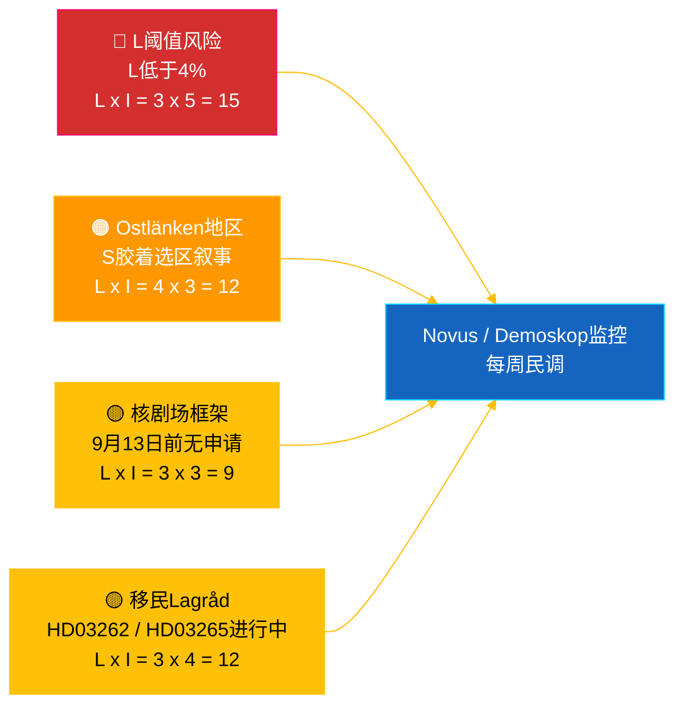

# 情报简报 — 瑞典议会实时脉搏 2026-05-04

**分类**: 🟢 公开 — Riksdagsmonitor Intelligence
**受众**: 编辑、值班人员、研究人员及关心此议题的公民
**日期**: 2026-05-04 (UTC)
**距2026-09-13选举**: 132天
**工作流**: news-realtime-monitor
**作者**: Riksdagsmonitor AI情报系统
**整体可信度**: 🟩 高 [A2] — 通过`dok_id`交叉核实公开议会数据 + IMF WEO 2026年4月多来源验证
**发布决定**: **公开** (EN + ZH) — DIW优先级头条文章 ≥ 9.0
**已回答PIR**: PIR-RT-001, PIR-RT-005, PIR-RT-006

---

## 🎯 BLUF（核心摘要）

2026年5月4日，瑞典议会创造了选举前密度最高的立法成果集。产业委员会（NU）批准了对核电站直接授予许可证（`HD01NU19`，2026年6月17日生效）——这是Tidö联合政府在能源政策上最重大的结构性成果——同时，第7轮反帮派措施通过爆炸物管制改革（`HD01FöU13`）和刑事诉讼程序改革（`HD01JuU9`）取得进展，均于2026年7月1日生效。面对这堵政府政绩之墙，社会民主党议员**埃娃·林德**向KD党基础设施部长**安德烈亚斯·卡尔松**提交了质询`HD10463`——就Ostlänken林雪平站追加计划取消一事，追问对50万竞争性选区通勤圈20年承诺遭到违背的问题。政治资金透明度报告（`HD01KU39`）预计于2026年6月16日进行全体表决，在选举前89天完成四条线政绩叙事（能源·安全·透明度·财政成果）。**可信度: 🟩 高 [A2]** — 来源：议会公开数据，IMF WEO 2026年4月。

---

## 🧭 本简报支持的3项决策

| # | 决策 | 决策者 | 截止 | 依据 |
|:-:|------|--------|:----:|------|
| 1 | **编辑**: 以核改革 + Ostlänken对立叙事双重框架发布EN + ZH快讯（目标2小时内发布） | 编辑主任 | +2小时 | `HD01NU19`委员会决定 + `HD10463`质询2026-05-04提交 |
| 2 | **前瞻报道**: 将卡尔松的Ostlänken回复（法定回复期限：2026年5月25日）和核法6月17日生效事项分配给值班记者 | 值班人员 | 2026-05-25 / 2026-06-17 | PIR-RT-005, PIR-RT-006; `HD10463`质询登记 |
| 3 | **风险**: 将L阈值监控级别从观察升级为主动追踪——联合政府政绩逻辑以L在9月13日超过4%为前提；Novus/Demoskop民调结果<4.5%触发联合政府数学审查 | 分析负责人 | 持续每周 | `coalition-dynamics.md`，移民后舆情 PIR-RT-003 |

---

## ⚡ 60秒速读

- 🔴 **核改革获直接许可途径 (`HD01NU19`)** — 产业委员会（NU）批准直接许可，绕过辐射安全局（SSM）多阶段流程；**2026年6月17日生效**。Tidö任期内最重大结构性立法成果；2022年M/KD/L/SD核电重启承诺在选举前实现运营里程碑 [🟩 高 — `HD01NU19`，NU委员会会议记录]。
- 🟠 **Ostlänken承诺违背质询 (`HD10463`)** — S党议员**埃娃·林德**要求基础设施部长**安德烈亚斯·卡尔松（KD）**就林雪平Ostlänken车站计划取消作出说明；法定回复期限**2026年5月25日**。10天内对卡尔松提出第3次质询——对50万通勤圈的有协调S党地方压力 [🟩 高 — `HD10463`，质询登记]。
- 🟢 **第7轮反帮派措施进展 (`HD01FöU13` + `HD01JuU9`)** — 爆炸物许可要求收紧（防务委员会，2026年7月1日）；刑事诉讼程序改革废除*tilltrosbestämmelserna*，扩大早期讯问证据资料（司法委员会，2026年7月1日）。强化M/SD"在安全上交出成绩单"核心叙事 [🟩 高 — `HD01FöU13`, `HD01JuU9`]。
- 🟡 **政治资金透明度 (`HD01KU39`)** — 宪法委员会登记关于政治进程透明度的报告（极有可能涉及政党资金报告提案`HD03258`）；全体表决**2026年6月16日**；L/KD在民主改革定位上获益。PIR-RT-002解答：KU（而非JuU/SfU）主管 [🟧 中 — `HD01KU39`，日程]。
- 🔵 **经济背景 (IMF WEO 2026年4月)** — 瑞典公共债务≈GDP的34%（`GGXWDG_NGDP` 2026年预测）对比欧元区平均>90%；2026年实际GDP增长率`NGDP_RPCH` 2.0–2.1%；通胀下降（`PCPIEPCH`）。瑞典央行2025–26降息传导至房贷用户→M的"稳健之手"叙事 [🟩 高 — 来源: imf，数据流: WEO_Apr_2026，年份: 2026年4月]。
- 🟣 **交叉参考** — `HD01NU19`与提案分析中的能源政策线索相链接（`../propositions/`）；`HD10463`延伸`opposition-analysis.md`中S党地方承诺违背集群；透明度`HD01KU39`涵盖4月30日提案包中的`HD03258`。
- 🩷 **新兴脆弱性——"核剧场"风险** — 若9月13日选举日前未提交申请，在野党框架认为6月17日生效仅具象征意义。若Vattenfall/Uniper/新进入者未在88天选举前窗口内提交申请，政绩叙事面临质疑风险 [🟧 中 — PIR-RT-006 未解决]。
- ⚪ **延续项** — 移民提案`HD03262`与`HD03265`的Lagråd意见书（PIR-RT-001）**未解决——重要**；宪法质量审查是夏季塑造移民改革政治叙事最具影响力的未决因素。

---

## 🗂️ 顶级文件（按DIW排序）

| 排名 | dok_id | 标题（简短） | DIW | 可信度 | 状态 |
|:----:|--------|------------|:---:|:------:|------|
| 1 | `HD01NU19` | 核许可改革（直接路径） | 9.2 | 🟩 高 [A2] | 委员会批准 — 2026年6月17日生效 |
| 2 | `HD10463` | Ostlänken质询 — 林德(S) → 卡尔松(KD) | 8.6 | 🟩 高 [A2] | 已提交 — 回复期限2026年5月25日 |
| 3 | `HD01FöU13` | 爆炸物管制改革 | 7.5 | 🟩 高 [A2] | 委员会批准 — 2026年7月1日生效 |
| 4 | `HD01JuU9` | 刑事诉讼程序改革 | 7.4 | 🟩 高 [A2] | 委员会批准 — 2026年7月1日生效 |
| 5 | `HD01KU39` | 政治进程透明度 | 7.0 | 🟧 中 [B2] | 已登记 — 全体表决2026年6月16日 |
| 6 | `HD01FiU49` | 国家债务管理评估2021–2025 | 6.4 | 🟩 高 [A2] | 已登记 — 决定2026年6月11日 |

---

## ⚠️ 风险·威胁概览

| 风险 | 可能性 | 影响 | 得分 | 触发条件 | 来源 | 海军情报分级 |
|------|:------:|:----:|:----:|---------|------|:-----------:|
| Liberalerna跌破4%阈值 → Tidö失去过半数 | 3 | 5 | 15 | Novus/Demoskop结果<4.0%（95%置信区间下限<4.0） | `coalition-dynamics.md` R1 | **[B2]** |
| S党地方承诺违背叙事转化Östergötland胶着议席 | 4 | 3 | 12 | SVT/SR Östergötland编辑部评估卡尔松5月25日回复不够充分 | `opposition-analysis.md` | **[A2]** |
| Lagråd对移民包`HD03262`/`HD03265`出具负面意见 | 3 | 4 | 12 | Lagråd意见书在30天内含宪法异议公布 | PIR-RT-001 (`forward-indicators.md`) | **[A2]** |
| "核剧场"——`HD01NU19`生效但9月13日前无申请提交 | 3 | 3 | 9 | Vattenfall/Uniper/新进入者在2026年9月1日前未提交申请 | PIR-RT-006 | **[B2]** |

---

## 🔮 最关键的未来触发因素

**安德烈亚斯·卡尔松对质询`HD10463`的书面答复，法定回复期限2026年5月25日。** 卡尔松如何框架林雪平Ostlänken车站取消——是承认承诺违背、以技术/预算原因为改道辩护、还是转向替代地区基础设施提案——将决定Östergötland叙事是否在夏季休会前升级为全体质询辩论。回避性或官僚式的答复是S党将叙事转化为林雪平/诺尔雪平1-2个胶着议席转换的最可能路径。实质性的替代投资提案将平息叙事。两种结果都将改变`coalition-mathematics.md`的胶着选区评估，并触发`electoral-implications.md`的Pass-2修订。

**次级触发因素**（并行监控）：2026年6月16日——`HD01KU39`政治资金透明度全体表决。在选举前89天确认或瓦解政府四条线政绩叙事（能源 + 安全 + 透明度 + 财政成果）。

---

## 📊 战略评估

**可信度: 🟩 高 [A2]** — 来源包括议会公开数据（`HD01NU19`, `HD10463`, `HD01FöU13`, `HD01JuU9`, `HD01KU39`, `HD01FiU49`）、IMF WEO 2026年4月年份、质询登记。

2026年5月4日的快照捕捉到**最高立法速度**的Tidö联合政府：7项联合改革在1周内取得进展，具体生效日期分散在2026年6月1日至7月1日之间。每个生效日都为4个联合政党创造了可在竞选活动中利用的政绩节奏。战略脆弱性是不对称的：M、KD、SD受益于这一连锁，而**L**承担负担——作为联合最小政党最接近4%阈值，承担着不成比例的议席损失风险。

S在野党的回应在方法上是精确的：不是在安全、核能、经济等政府最强阵地上正面对抗，而是构建**分散化地方不满的马赛克**——Östergötland的Ostlänken（`HD10463`）、斯堪的纳维亚山脉机场（质询428）、斯德哥尔摩的住房（质询434）——每一个都来自不同选区，指向同一位部长（卡尔松）。

IMF的宏观框架对现政府有利：公共债务≈GDP的34%，通胀下降，约2%增长。经济叙事是M最强的资产。

**2026年选举视角**：目前轨迹维持Tidö在175席左右——过半数边缘。L的阈值风险（PIR-RT-003）是单一最重要选举变量。Lagråd移民意见书（PIR-RT-001）是单一最重要政治叙事变量。卡尔松的Ostlänken答复（PIR-RT-005）是单一最重要地区议席变量。三者均在本简报发布后5周内解决。

---

## 📎 链接

| 链接 | 路径 |
|------|------|
| 文章 | [`article.md`](article.md) |
| 综合摘要 | [`synthesis-summary.md`](synthesis-summary.md) |
| 核心综合 | [`core-synthesis.md`](core-synthesis.md) |
| 联合动态 | [`coalition-dynamics.md`](coalition-dynamics.md) |
| 在野党分析 | [`opposition-analysis.md`](opposition-analysis.md) |
| 选举影响 | [`electoral-implications.md`](electoral-implications.md) |
| 经济背景（IMF） | [`economic-context.md`](economic-context.md) |
| 前导指标 | [`forward-indicators.md`](forward-indicators.md) |
| 风险·机遇矩阵 | [`risk-opportunity-matrix.md`](risk-opportunity-matrix.md) |
| 情景分析 | [`scenario-analysis.md`](scenario-analysis.md) |
| 方法论备注 | [`methodology-notes.md`](methodology-notes.md) |
| 数据清单 | [`data-download-manifest.md`](data-download-manifest.md) |
| 逐文件分析 | [`documents/`](documents/) |

---

## 📝 文件管理

- **简报ID**: `EB-2026-05-04-001`
- **生成时间**: 2026-05-16（补充——基于现有Pass-2分析产出物创建）
- **模板路径**: [`analysis/templates/executive-brief.md`](../../../templates/executive-brief.md)
- **所属方法论**: [`per-artifact-methodologies.md` § executive-brief](../../../methodologies/per-artifact-methodologies.md#executive-brief)
- **所属检查门**: [`05-analysis-gate.md`](../../../../.github/prompts/05-analysis-gate.md) 检查1 + 检查7
- **输出族**: A — 核心综合
- **分类**: 🟢 公开

*经济数据出处：来源: imf，数据流: WEO_Apr_2026，指标: NGDP_RPCH / GGXWDG_NGDP / PCPIEPCH，年份: 2026年4月，retrieved_at: 2026-05-04。议会数据通过riksdag-regering API于2026-05-04获取。Riksdagsmonitor由hack23 AB制作；本简报代表基于公开议会文件的独立编辑评估。*

<!-- source-sha: f8cfbe724a92e48089f650d9e1f52abe004ed7f7 -->
