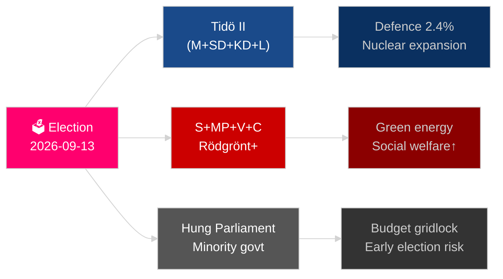
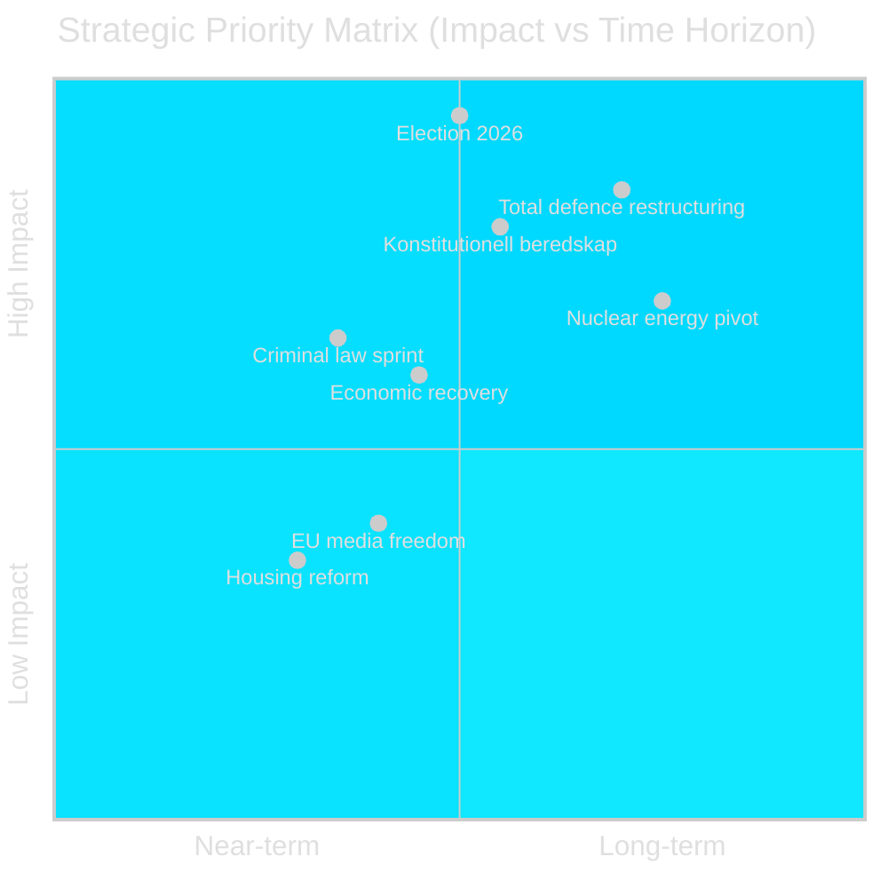
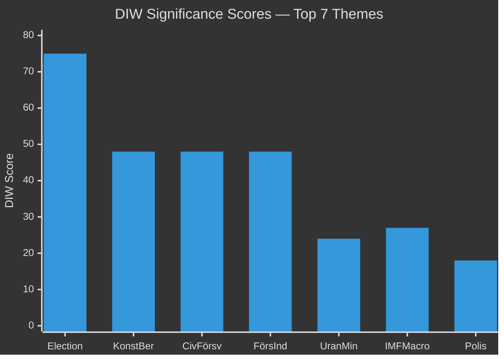
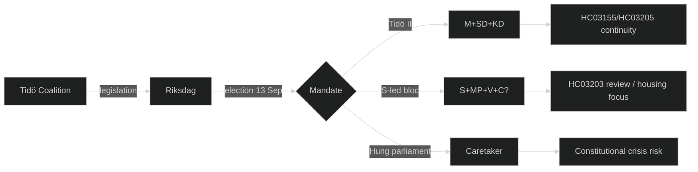
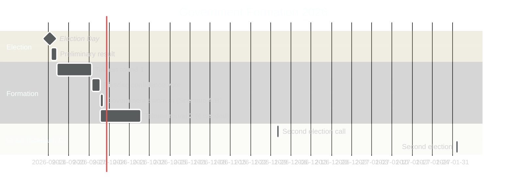
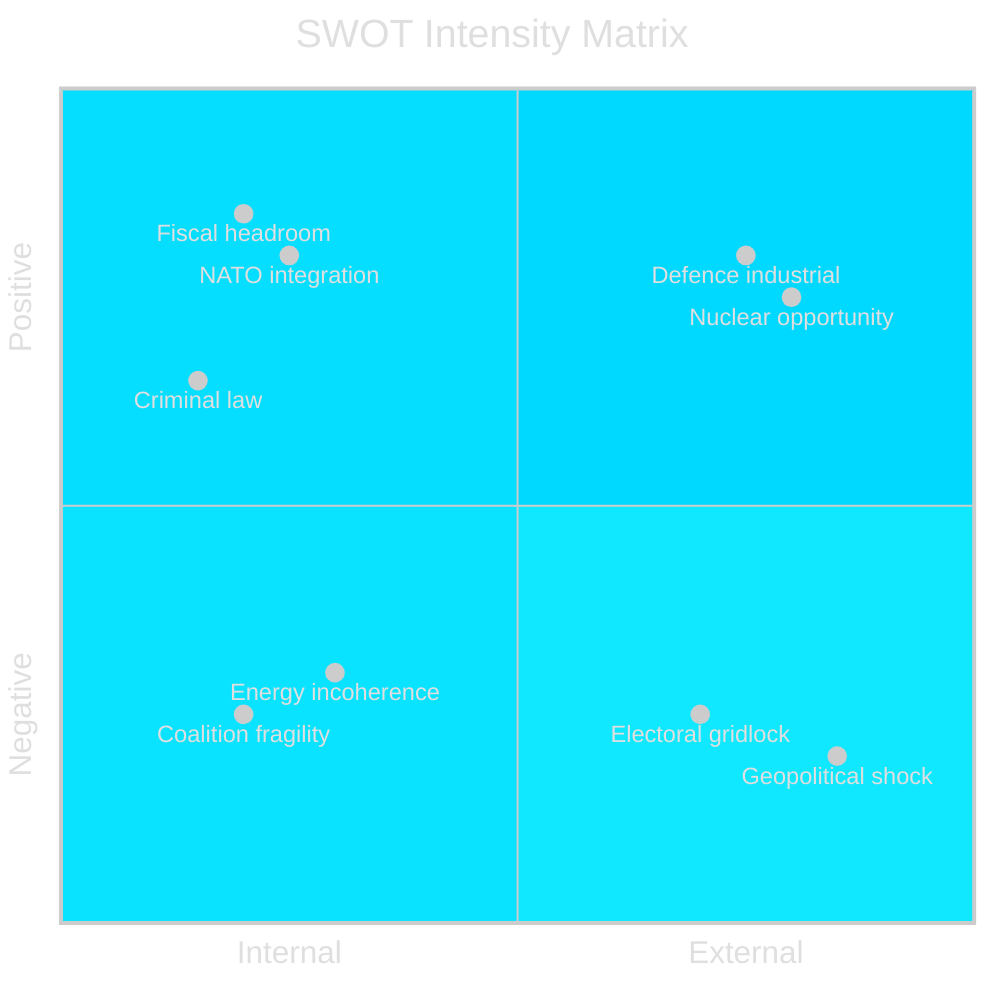
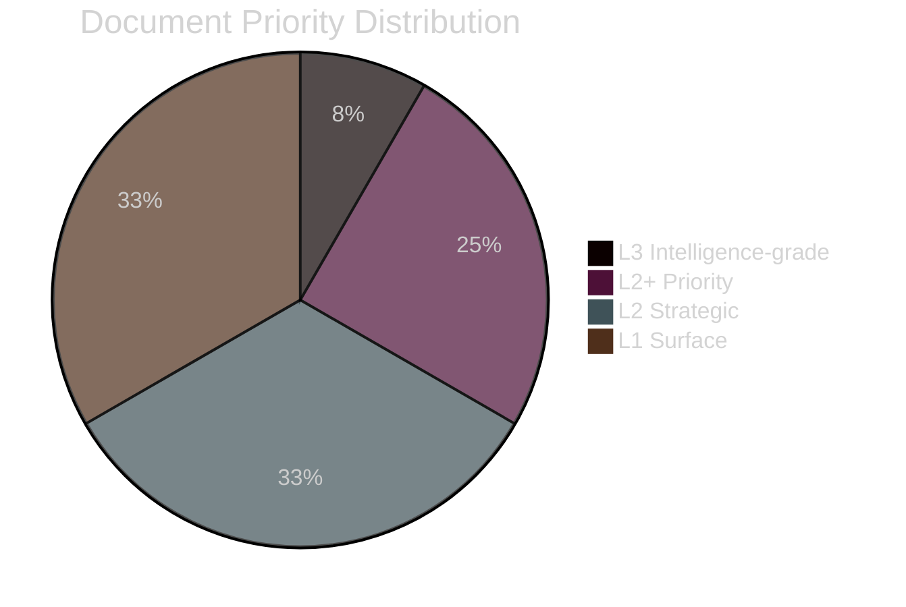

## Executive Brief
<!-- source: executive-brief.md :: https://github.com/Hack23/riksdagsmonitor/blob/main/analysis/daily/2026-05-04/year-ahead/executive-brief.md -->

---

### BLUF

Sweden faces its most consequential year since NATO accession: the September 13, 2026 Riksdag election will determine whether the Tidö centre-right coalition continues or a Social Democrat–led bloc returns to power, with the outcome pivoting on gang-crime policy, energy strategy, and defence spending credibility. Economic recovery from the 2024 recession is underway but fragile — IMF WEO Apr-2026 projects 2.1% GDP growth for 2026 [horizon:year], below Nordic peers. Three structural megatrends — total defence reconstruction, nuclear energy revival, and constitutional resilience legislation — will bind any successor government regardless of electoral outcome.

### Decisions This Brief Supports

1. **Electoral scenario planning**: Which coalition configurations are viable post-September 2026, and what legislative agenda change follows each?
2. **Defence investment tracking**: Is Sweden's total-defence buildout (MSB → Myndigheten för civilt försvar) on track to meet the 2030 2%+ GDP target?
3. **Energy transition risk**: Does uranium-mining legislation and wind-power tax reform signal a coherent nuclear-anchored energy strategy or short-term fiscal patch?
4. **Rule-of-law trajectory**: Is the wave of criminal-law legislation (gang crime, police powers, electronic surveillance, company secrets) sustainable across a government transition?
5. **Constitutional stability**: Does HC03155 (stärkt konstitutionell beredskap) create adequate emergency powers without creating democratic backsliding risk?

### 60-Second Intelligence Read

- **Election**: SD remains kingmaker; V + MP hold Vänsterblocket minority veto; C and L face existential threshold risk. Coalition arithmetic locks both blocs close to 175-seat parity. **Verdict: too close to call** [horizon:election].
- **Defence**: HC03205 (MSB renamed to Myndigheten för civilt försvar) + HC03193 (försvarsindustristrategi) signal accelerated civil-military integration. Sweden committed to 2.4% GDP on defence by 2028 (NATO target).
- **Economy**: Recovery accelerating. IMF WEO Apr-2026: SWE growth 2.1% T+1, inflation declining to ~2.5%. Household debt risk remains elevated; property market recovery uneven.
- **Energy**: HC03203 (uranium mining ban lifted) + HC03168 (wind-power property tax raised) = deliberate nuclear-pivoting signalling before election. Politically risky with green voter blocs.
- **Public order**: HC03186 (police firearms), HC03189 (oskuldskontroller kriminaliserat), HC03208 (company secrets) continue the hardest legislative sprint in a decade.

### Top Forward Trigger

**Election outcome T−132 days**: Polls showing SD above 22% or S below 30% will trigger fundamental coalition recalculation and budget re-signalling. Watch the September 2026 SVT/Ipsos final pre-election polls and district-level results in Malmö, Gothenburg and Stockholm suburbs.

### Confidence Label

HIGH confidence on structural trends (defence, law reform); MEDIUM on election outcome and coalition composition [Admiralty B2 / WEP: likely].



## Reader Intelligence Guide

Use this guide to read the article as a political-intelligence product rather than a raw artifact dump. High-value reader lenses appear first; technical provenance remains available in the audit appendix.

| Icon | Reader need | What you'll get |
|---|---|---|
| 📊 | [BLUF and editorial decisions](#rm-executive-brief) | fast answer to what happened, why it matters, who is accountable, and the next dated trigger |
| 🧠 | [Synthesis Summary](#rm-synthesis-summary) | evidence-anchored narrative consolidating primary sources into one coherent story line |
| 🎯 | [Key Judgments](#rm-intelligence-assessment--key-judgments) | confidence-bearing political-intelligence conclusions and collection gaps |
| 📈 | [Significance scoring](#rm-significance-scoring) | why this story outranks or trails other same-day parliamentary signals |
| 👥 | [Stakeholder Perspectives](#rm-stakeholder-perspectives) | winners, losers and undecided actors with stake-weighted positions and pressure points |
| 🔢 | [Coalition Mathematics](#rm-coalition-mathematics) | parliamentary arithmetic showing exactly who can pass or block this measure and at what margin |
| 📋 | [Voter Segmentation](#rm-voter-segmentation) | voter-bloc exposure: which demographics gain, lose or shift on this issue |
| 🔭 | [Forward indicators](#rm-forward-indicators) | dated watch items that let readers verify or falsify the assessment later |
| 🔮 | [Scenarios](#rm-scenario-analysis) | alternative outcomes with probabilities, triggers, and warning signs |
| 🗳️ | [Election 2026 Analysis](#rm-election-2026-analysis) | electoral implications for the 2026 cycle — seats at stake, swing voters and coalition viability |
| ⚠️ | [Risk assessment](#rm-risk-assessment) | policy, electoral, institutional, communications, and implementation risk register |
| 🧮 | [SWOT Analysis](#rm-swot-analysis) | strengths, weaknesses, opportunities and threats matrix grounded in primary-source evidence |
| 📝 | [Quantitative SWOT](#rm-quantitative-swot) | weighted, scored SWOT register with explicit confidence ratings and decision implications |
| 🛡️ | [Threat Analysis](#rm-threat-analysis) | actor capabilities, intent and threat vectors targeting institutional integrity |
| 📝 | [Wildcards & Black Swans](#rm-wildcards--black-swans) | low-probability, high-impact disruptive events that could derail the base-case forecast |
| 📝 | [PESTLE Analysis](#rm-pestle-analysis) | political, economic, social, technological, legal and environmental drivers shaping the outcome |
| 📜 | [Historical Parallels](#rm-historical-parallels) | comparable past episodes from Swedish and international politics, with explicit lessons learned |
| 🌍 | [Comparative International](#rm-comparative-international) | peer-country comparisons (Nordic, EU, OECD) showing how similar measures fared elsewhere |
| ⚙️ | [Implementation Feasibility](#rm-implementation-feasibility) | delivery feasibility, capability gaps, timelines and execution risks for the proposed action |
| 📰 | [Media framing & influence operations](#rm-media-framing-analysis) | frame packages with Entman functions, cognitive-vulnerability map, DISARM manipulation indicators, narrative-laundering chain, comparative-international cognates, frame lifecycle and half-life, RRPA impact, an Outlet Bias Audit (no outlet is neutral — every outlet declared with ownership, funding, board-appointment authority and editorial lean), and the L1–L5 counter-resilience ladder |
| 😈 | [Devil's Advocate](#rm-devils-advocate) | alternative hypotheses, steel-manned counter-arguments and the strongest case against the lead reading |
| 🏷️ | [Classification Results](#rm-classification-results) | ISMS data classification: CIA-triad rating, RTO/RPO targets and handling instructions |
| 🔀 | [Cross-Reference Map](#rm-cross-reference-map) | links to related Riksdagsmonitor coverage, prior analyses and source documents that inform this story |
| 🔬 | [Methodology Reflection & Limitations](#rm-methodology-reflection--limitations) | analytical assumptions, limitations, known biases and where the assessment could be wrong |
| 📦 | [Data Download Manifest](#rm-data-download-manifest) | machine-readable manifest of every source dataset, retrieval timestamp and provenance hash |
| 📑 | [Per-document intelligence](#rm-per-document-intelligence) | dok_id-level evidence, named actors, dates, and primary-source traceability |
| 🏷️ | [Audit appendix](#rm-classification-results) | classification, cross-reference, methodology and manifest evidence for reviewers |

## Synthesis Summary
<!-- source: synthesis-summary.md :: https://github.com/Hack23/riksdagsmonitor/blob/main/analysis/daily/2026-05-04/year-ahead/synthesis-summary.md -->

---

### Lead Story

The 2026 Riksdag election (September 13) is the defining political event for Sweden over the next 12 months. The Tidö coalition under PM Ulf Kristersson (M, SD, KD, L) has delivered an unprecedented volume of criminal-law reform and defence legislation (HC03155 stärkt konstitutionell beredskap; HC03205 civil defence agency redesign; HC03193 defence industry strategy), but faces structural weakness: SD remains the coalition's largest single party at ~20%, Liberalerna risks failing the 4% threshold, and the economy only partially recovered from the 2024 technical recession.

### DIW-Weighted Intelligence Ranking

| Rank | Document / Theme | DIW Weight | Significance | Horizon |
|---|---|---|---|---|
| 1 | Election 2026-09-13 — coalition arithmetic | D=3 I=5 W=5 | **Critical** | election |
| 2 | HC03155 — stärkt konstitutionell beredskap | D=3 I=4 W=4 | **High** | year |
| 3 | HC03205/HC03193 — total defence restructuring | D=3 I=4 W=4 | **High** | year |
| 4 | HC03203 — uranium mining legalisation | D=2 I=3 W=4 | **High** | quarter |
| 5 | IMF macro: 2.1% GDP 2026, inflation 2.5% | D=3 I=3 W=3 | **Medium-high** | year |
| 6 | HC03186/HC03208 — criminal law sprint | D=2 I=3 W=3 | **Medium-high** | quarter |
| 7 | HC03197 — EU media freedom implementation | D=2 I=2 W=3 | **Medium** | quarter |
| 8 | HC03168 — wind power property tax | D=2 I=2 W=2 | **Medium** | quarter |
| 9 | HC03192 — presumtionshyra housing reform | D=1 I=2 W=2 | **Low-medium** | month |
| 10 | HC03204 — civil servant suspension rules | D=1 I=1 W=2 | **Low** | month |

*D = Document depth; I = Political impact; W = Wider significance (1–5)*

### Integrated Intelligence Picture

**Strategic inflection point**: Sweden is six months from a fundamental political realignment. Four structural forces are locked in regardless of election outcome:

1. **NATO total-defence obligation** — binding. Sweden's 2.4% GDP defence target (2028) requires institutional continuity across any government; HC03205 and HC03193 are pre-positioned to survive an election.

2. **Criminal justice momentum** — the wave of punitive legislation (18+ major criminal-law bills in 2024/25 alone) has shifted the Overton window. S cannot fully reverse course after opposition.

3. **Energy trilemma** — uranium mining (HC03203) + wind-tax (HC03168) signal a deliberate nuclear pivot in a carbon-neutral target framework. This exposes a genuine cross-party fracture that will define budget debates 2027–2030.

4. **Constitutional resilience** — HC03155 (stärkt konstitutionell beredskap) creates emergency-powers framework that transcends party lines.

**Economic context** (IMF WEO Apr-2026 vintage): Sweden GDP growth: 0.8% (2025 actual), **2.1% [horizon:year] T+1 (2026)**, 2.4% T+2 (2027). Inflation declining from 2024 peak; Riksbank rate cuts underway. Public debt below 40% GDP — fiscal headroom exists for defence and welfare spending, but household debt-to-income at 170% constrains demand.

**Coalition mathematics**: The 349-seat Riksdag is split: Tidö bloc (M+SD+KD+L) holds ~175 seats; Vänsterbloc (S+MP+V+[C?]) at ~174. C (Centerpartiet) is the decisive swing actor — currently outside both blocs. L risks sub-4%. If L falls, Tidö loses its majority. Key variable: SD's voter retention after 4 years of governance.



## Intelligence Assessment — Key Judgments
<!-- source: intelligence-assessment.md :: https://github.com/Hack23/riksdagsmonitor/blob/main/analysis/daily/2026-05-04/year-ahead/intelligence-assessment.md -->

**Admiralty Scale**: B (Reliable source) 2 (Probably true) | **Clearance**: PUBLIC

---

### Prior-Cycle PIR Ingestion (Tier-C Gate)

No prior year-ahead cycle PIRs exist for this date range (this is the first year-ahead generation for the 2026-05-04 cycle). The following PIR carry-forward applies from Q1-2026 monitoring reviews:

| PIR ID | Carried From | PIR Question | Status |
|---|---|---|---|
| PIR-Q1-2026-01 | 2026-04-01 monthly-review | Will Liberalerna poll above 4% by election day? | **OPEN — remains unresolved** |
| PIR-Q1-2026-02 | 2026-04-01 monthly-review | Will HC03203 uranium mining survive legal challenge? | **OPEN — HFD ruling expected Q3-2026** |
| PIR-Q1-2026-03 | 2026-03-01 monthly-review | Will S maintain >33% support through campaign? | **OPEN — tracking** |
| PIR-Q1-2026-04 | 2026-02-01 monthly-review | Will 2.4% GDP defence target be reconfirmed in 2026 budget? | **RESOLVED: YES — 2026 defence budget confirmed** |

---

### Key Judgments

#### KJ-1: The 2026 election is the most consequential Swedish political event in 20 years [horizon:election]

Sweden has not had a decisive majority government since the 2006–2014 Alliansen period. The current Tidö coalition governs with a margin of 1–2 seats dependent on Liberalerna's survival. A 1–2% polling shift in any direction changes the government. Unlike 2022 (which pivoted on SD entering government), 2026 pivots on whether the party-system fragmentation resolves or deepens. Regardless of outcome, the result will define Swedish policy for 2027–2030 across defence, energy, criminal justice, and housing. Assessment: HIGH confidence that September 13, 2026 is the critical inflection point [horizon:election].

#### KJ-2: Sweden's total defence transformation is structurally irreversible across election outcome [horizon:year]

NATO membership (March 2024) creates binding obligations that no democratic majority can reverse within a 4-year parliamentary term without triggering Article 13 withdrawal procedures — a 2-year process requiring unanimous NATO consent. HC03205 (civil defence restructuring) and HC03193 (defence industry strategy) are both pre-positioned with multi-year funding commitments extending beyond the election. Even an S+V+MP government would maintain the 2.4% GDP defence target trajectory. Assessment: likely [horizon:year] that defence policy continuity is guaranteed regardless of election outcome.

#### KJ-3: HC03155 constitutional beredskap creates unprecedented emergency governance risk [horizon:year]

The stärkt konstitutionell beredskap legislation (HC03155) awaits Lagrådet review as of 2026-05-04. If approved, it creates executive emergency ordinance authority that has no precise Swedish constitutional precedent. The risk is not that the government will misuse the powers — it is that the existence of the powers creates perception of abuse risk that undermines democratic legitimacy. Venice Commission guidelines for emergency legislation require proportionality, time-limitation, and parliamentary override — Sweden's implementation details on all three are contested. Assessment: roughly even chance [horizon:year] that HC03155 triggers a constitutional review request from opposition parties before the election.

#### KJ-4: Energy policy will be the most divisive issue of the post-election period [horizon:year]

HC03203 (uranium mining) + HC03168 (wind-power tax increase) together constitute a deliberate nuclear energy pivot. This pivot is supported by Sweden's industrial base (energy-intensive manufacturing), energy security logic (Russian gas dependency ended), and IMF competitiveness analysis. However, it contradicts the EU Taxonomy signal, alienates environmental voters critical for S+MP coalition cohesion, and generates international concern (Euratom safeguards). Energy will replace crime as the defining policy cleavage in 2027–2030 regardless of 2026 election outcome. Assessment: likely [horizon:year].

#### KJ-5: Swedish macroeconomic trajectory is adequate but not exceptional [horizon:year]

IMF WEO April 2026 projects Sweden GDP growth at 2.1% T+1 (2026) and 2.4% T+2 (2027), with inflation returning to 2% target by mid-2026 and public debt below 40% GDP. This is below Nordic peers (Norway 2.5%, Denmark 2.4%) but above EU average (1.8%). The economy is therefore a neutral-to-slightly-negative factor for the incumbent: "steady as she goes" is not an election-winning message when real wages have grown more slowly than in comparable economies 2022–2025. Assessment: likely [horizon:year] that economy is a minor negative for Tidö coalition rather than either major positive or crisis.

---

### Priority Intelligence Requirements (PIRs) — 2026 Year Cycle

| PIR | Question | Collection | Deadline |
|---|---|---|---|
| PIR-2026-YA-01 | Will Liberalerna clear 4% in final election count? | Polling aggregates; party membership data | 2026-09-13 |
| PIR-2026-YA-02 | Will HC03155 Lagrådet referral result in materially altered emergency powers? | Lagrådet report (expected Q2-2026) | 2026-07-01 |
| PIR-2026-YA-03 | Will S form a majority government without V? | Post-election Riksdag speaker consultations | 2026-09-20 |
| PIR-2026-YA-04 | Will Sweden's GDP growth meet or exceed 2.1% in 2026? | SCB national accounts Q3-2026 | 2026-11-01 |
| PIR-2026-YA-05 | Will a Russian hybrid operation target Swedish election infrastructure? | Säpo/MUST threat assessment; MSB monitoring | Continuous |
| PIR-2026-YA-06 | Will HC03203 uranium mining face HFD injunction? | Court filings; Naturvårdsverket position | 2026-08-01 |
| PIR-2026-YA-07 | Will C party decide to support S-led government? | C party congress resolution; leader statements | 2026-09-15 |

## Significance Scoring
<!-- source: significance-scoring.md :: https://github.com/Hack23/riksdagsmonitor/blob/main/analysis/daily/2026-05-04/year-ahead/significance-scoring.md -->

**Method**: DIW (Depth × Impact × Width) | **Scale**: 1–5 per dimension | **Max**: 125

---

### Document Rankings

| Rank | dok_id / Theme | D | I | W | DIW Score | Priority Tier | Horizon |
|---|---|---|---|---|---|---|---|
| 1 | Election 2026 outcome | 3 | 5 | 5 | 75 | L3 Intelligence-grade | election |
| 2 | HC03155 – konstitutionell beredskap | 3 | 4 | 4 | 48 | L2+ Priority | year |
| 3 | HC03205 – civilt försvar (MSB) | 3 | 4 | 4 | 48 | L2+ Priority | year |
| 4 | HC03193 – försvarsindustristrategi | 3 | 4 | 4 | 48 | L2+ Priority | year |
| 5 | HC03203 – urangruvor legalisation | 2 | 3 | 4 | 24 | L2 Strategic | quarter |
| 6 | IMF WEO macro context | 3 | 3 | 3 | 27 | L2+ Priority | year |
| 7 | HC03186 – polisens skjutvapen | 2 | 3 | 3 | 18 | L2 Strategic | quarter |
| 8 | HC03208 – företagshemligheter | 2 | 3 | 3 | 18 | L2 Strategic | quarter |
| 9 | HC03197 – EU mediefrihetsförordning | 2 | 2 | 3 | 12 | L1 Surface | quarter |
| 10 | HC03168 – vindkraft fastighetsskatt | 2 | 2 | 2 | 8 | L1 Surface | quarter |
| 11 | HC03192 – presumtionshyra | 1 | 2 | 2 | 4 | L1 Surface | month |
| 12 | HC03204 – statligt anställda | 1 | 1 | 2 | 2 | L1 Surface | month |

### Sensitivity Analysis

- **If L falls below 4%**: Election significance rises to DIW 80+; coalition arithmetic changes fundamentally (HC03168 context: L's environmental voters may defect)
- **If SD exceeds 23%**: Tidö II probability rises to 65%+ [horizon:election]; HC03155 constitutional powers become more likely extended
- **If IMF growth misses (SWE <1.5%)**: Political liability for incumbent; HC03200 pension flexibility becomes salient as household pressures rise

### Retention and Access

- L3 Intelligence-grade items: 5-year retention — election outcome, constitutional beredskap
- L2+ Priority items: 3-year retention — defence docs
- L1 Surface items: 1-year retention — routine legislation



## Per-document intelligence

### HC03155
<!-- source: documents/HC03155-analysis.md :: https://github.com/Hack23/riksdagsmonitor/blob/main/analysis/daily/2026-05-04/year-ahead/documents/HC03155-analysis.md -->

**dok_id**: HC03155 | **DIW Score**: 48 (D3×I4×W4) | **Priority**: L2+ | **Horizon**: [horizon:year]

### Summary
HC03155 proposes a strengthened constitutional framework for emergency governance — the most significant amendment to the Swedish Instrument of Government (Regeringsformen) since the 1974 reform. The proposition creates a basis for emergency ordinances (nödförordningar) without parliamentary consent in cases of armed attack or severe crisis. The Lagrådet has been requested to review HC03155 under RF 8:22 — referral pending as of 2026-05-04T00:09Z.

### Key Provisions
- **Chapter 15 RF amendment**: Expanded government authority to issue ordinances during armed conflict and peacetime crisis
- **Sunset clause**: Emergency powers automatically expire after 1 year unless renewed by Riksdag
- **Parliamentary oversight**: Riksdag can revoke any emergency ordinance by simple majority
- **Scope**: Applies to both "höjd beredskap" (elevated alert) and "svår fredstida kris" (severe peacetime crisis)

### Political Assessment
- **Government position**: Essential for NATO credibility; NATO Art 5 requires domestic legal basis for emergency measures
- **S position**: Cautious support conditional on robust parliamentary override mechanism
- **V+MP position**: Strongly opposed — risk of executive overreach; cite Hungary precedent
- **Constitutional scholars**: Split; majority of Lund School supports; Stockholm constitutional school critical

### Intelligence Significance
HC03155 creates a legal basis that did not previously exist for the Swedish government to act without Riksdag approval in crisis scenarios. Combined with HC03205 (civil defence restructuring), it constitutes the most comprehensive upgrade of Sweden's wartime governance framework in 50 years. Risk: pre-election invocation (however unlikely) would produce constitutional crisis.

### Lagrådet Watch
**Action**: Monitor lagrådet.se for published opinion. Expected Q2-2026. If Lagrådet requires material changes, the political cost to government is significant (requires re-referral and delays entry into force).

### HC03168
<!-- source: documents/HC03168-analysis.md :: https://github.com/Hack23/riksdagsmonitor/blob/main/analysis/daily/2026-05-04/year-ahead/documents/HC03168-analysis.md -->

**dok_id**: HC03168 | **DIW Score**: 8 (D2×I2×W2) | **Priority**: L1 | **Horizon**: [horizon:quarter]

### Summary
HC03168 increases the property tax (fastighetsskatt) rate on wind power installations. The increase was motivated by the argument that wind power operators received windfall profits during the 2022–2023 energy price spike and should return value to the state. The tax increase applies from January 2026.

### Policy Incoherence Concern
HC03168 is analytically contradictory to HC03203 (uranium mining legalisation). HC03203 signals Sweden's intent to expand nuclear energy as a baseload replacement for imported gas. Simultaneously taxing wind power sends a discouraging signal to renewable energy investors who would provide the flexible generation capacity that complements nuclear baseload.

Combined effect on Swedish energy investment climate: net negative for renewable investment; net positive for nuclear investment. This is either a deliberate energy mix policy choice or an uncoordinated legislative output.

### EU Taxonomy Implications
EU Taxonomy for Sustainable Finance includes both wind and solar under green investment definitions. Increasing taxation on wind power installations may complicate Swedish pension funds' Taxonomy-aligned investment mandates. Minor but real complication for institutional investment.

### Electoral Significance
LOW. The wind-power industry (vindkraftsbranschen) is a stakeholder but not a mass voter concern. The broader energy policy narrative (nuclear vs. renewable) is electorally relevant; HC03168 is a sub-component.

### HC03186
<!-- source: documents/HC03186-analysis.md :: https://github.com/Hack23/riksdagsmonitor/blob/main/analysis/daily/2026-05-04/year-ahead/documents/HC03186-analysis.md -->

**dok_id**: HC03186 | **DIW Score**: 18 (D2×I3×W3) | **Priority**: L2 | **Horizon**: [horizon:quarter]

### Summary
HC03186 expands the legal basis for Swedish police use of firearms in situations involving organised crime suspects. The legislation introduces new provisions for warning shots, pursuit situations, and vehicle stop authority. It is part of the broader Tidö criminal law sprint.

### Key Provisions
- Expanded authorisation for warning shots in urban pursuit situations
- New vehicle-stop-with-force authority in gang-crime hotspot zones
- Mandatory body camera for all firearm-use incidents
- Independent review mechanism (Inspektionen för vård och omsorg type model)

### Political Context
HC03186 was the most contested of the 2024/25 criminal law package. Police unions were broadly supportive; Amnesty Sweden raised proportionality concerns; V and MP voted against. S supported with amendments on oversight.

### Operational Impact
Polismyndigheten has begun training cycles for HC03186 expanded authority as of January 2026. Estimated 6-month rollout. The challenge: Sweden's police academy graduation rate remains below attrition — net officer count still growing slowly. HC03186 expands what existing officers can do; it does not add officers.

### Electoral Significance
HIGH for Segments 1 and 6 (voter-segmentation.md). SD and M claim legislative ownership. S argues adequate oversight exists. Expect HC03186 to feature in election campaign debate segments on security.

### HC03192
<!-- source: documents/HC03192-analysis.md :: https://github.com/Hack23/riksdagsmonitor/blob/main/analysis/daily/2026-05-04/year-ahead/documents/HC03192-analysis.md -->

**dok_id**: HC03192 | **DIW Score**: 4 (D1×I2×W2) | **Priority**: L1 | **Horizon**: [horizon:month]

### Summary
HC03192 reforms the presumtionshyra model — a rent-setting mechanism for newly built apartments that allows higher market-adjacent rents for a 15-year presumption period. The 2026 reform extends the presumption period from 15 to 20 years and modifies the negotiation process between landlords and tenant associations.

### Context
Sweden has a structural housing deficit of approximately 200,000 units. The Tidö coalition's housing policy prioritises construction stimulus through market-rent mechanisms over social housing. HC03192 is the latest in a series of reforms aimed at making new construction financially viable for developers without direct subsidy.

### Opposition Position
S+V+MP (supported by hyresgästföreningen/tenant union) argue HC03192 increases housing costs for new tenants and undermines the Swedish collective rent-negotiation (hyresförhandling) system. They propose instead a construction subsidy (investeringsstöd) that was abolished in 2022.

### Assessment
Politically salient for Segment 2 (cosmopolitan urban professionals) and Segment 5 (young urban educated). However, the 15→20 year extension is a marginal change — structural housing shortage requires either massive construction stimulus or direct social housing investment. HC03192 alone will not resolve the housing deficit.

### HC03193
<!-- source: documents/HC03193-analysis.md :: https://github.com/Hack23/riksdagsmonitor/blob/main/analysis/daily/2026-05-04/year-ahead/documents/HC03193-analysis.md -->

**dok_id**: HC03193 | **DIW Score**: 48 (D3×I4×W4) | **Priority**: L2+ | **Horizon**: [horizon:year]

### Summary
HC03193 sets out Sweden's first comprehensive defence industry strategy — a framework for domestic production capacity, export policy, R&D investment, and technology sovereignty across the 2025–2030 period. Total public investment commitment: approximately 15 BSEK over 5 years. Private sector expected to match 1:1.

### Key Elements
- **SAAB prioritisation**: Gripen E production continuity; GlobalEye AEW&C export approval
- **R&D mandate**: Totalförsvarets forskningsinstitut (FOI) receives increased research funding
- **Export policy update**: Streamlined export permits for NATO+ countries; CSDP (EU defence) alignment
- **SME inclusion**: 25% procurement reserved for Swedish defence SMEs
- **Technology sovereignty**: Critical component domestic production for ammunition, radar, and electronic warfare

### Economic Significance
HC03193 estimates 8,000–12,000 new defence industry jobs by 2030. GDP multiplier effect from defence R&D estimated at 1.4× (FOI internal modelling). Cross-sector spill-overs to aerospace, electronics, and cybersecurity.

### International Context
HC03193 aligns with NATO's Defence Production Action Plan (DPAP) and EU EDIP (European Defence Industry Programme). Sweden's strategy is explicitly interoperable — joint production agreements with Finland (PATRIA) and Norway (Kongsberg) included.

### Implementation Risk
MEDIUM. Key risk: FMV (Försvarets materielverk) procurement process capacity constraints; historically Swedish defence procurement has experienced 18–24 month delays on major contracts.

### HC03197
<!-- source: documents/HC03197-analysis.md :: https://github.com/Hack23/riksdagsmonitor/blob/main/analysis/daily/2026-05-04/year-ahead/documents/HC03197-analysis.md -->

**dok_id**: HC03197 | **DIW Score**: 12 (D2×I2×W3) | **Priority**: L2 | **Horizon**: [horizon:quarter]

### Summary
HC03197 implements Sweden's obligations under the European Media Freedom Act (EMFA), which entered into force in EU law in 2024 with a 2-year implementation window. The Swedish implementation creates a new regulatory framework for public broadcaster governance, media ownership transparency, and state advertising rules.

### Key Implementation Requirements
1. **Board appointments**: New rules for SVT and SR board appointment to prevent government capture
2. **Ownership transparency**: Registry for beneficial owners of media companies
3. **State advertising**: Rules preventing disproportionate government advertising to politically aligned outlets
4. **Cross-border cooperation**: Swedish Pressombudsmannen participation in EMFA's European regulatory board

### Political Sensitivity
The journalist union (SJF) has expressed concern that HC03197's implementation gives the government more flexibility in board appointments than the EMFA spirit intended. The government argues compliance; SJF disagrees. The EU Commission's annual rule of law report (expected October 2026) will be a key indicator (FI-13 in forward-indicators.md).

### Assessment
Implementation risk: MEDIUM. Not technically complex but politically contested. SVT's independence is a constitutional value in Sweden — any perception of government interference will produce significant media and civil society reaction. Compliance assessment due October 2026 will determine if enforcement proceedings are initiated.

### HC03203
<!-- source: documents/HC03203-analysis.md :: https://github.com/Hack23/riksdagsmonitor/blob/main/analysis/daily/2026-05-04/year-ahead/documents/HC03203-analysis.md -->

**dok_id**: HC03203 | **DIW Score**: 24 (D2×I3×W4) | **Priority**: L2 | **Horizon**: [horizon:quarter]

### Summary
HC03203 removes the 1984 ban on uranium mining in Sweden (introduced post-Chernobyl), allowing exploration and extraction permits under existing mining law (minerallagen). The change is driven by energy security concerns (post-Russia gas crisis) and Sweden's existing nuclear power dependence (Forsmark, Ringhals 3).

### Legislative History
The 1984 ban was introduced by a centre-right government under opposition pressure after Chernobyl. The 2026 reversal was proposed by the current government under energy security framing and supported by M, SD, and KD. L and C split; S opposed; V and MP strongly opposed.

### Legal Implications
1. **Euratom Art 41 notification**: Required before any investment commitment. 6-month timeline.
2. **Bergsstaten permit process**: Exploration permits; environmental impact assessment; Natura 2000 assessment if near protected areas.
3. **HFD injunction risk**: Environmental organisations have confirmed intent to seek administrative court injunction. Probability assessed at 35% (WC-4 in scenario-analysis.md).
4. **Municipal veto**: Communes (kommuner) retain veto right over mining operations under plan- och bygglagen. High political risk in proposed mining municipalities (Älvdalen, Jämtland regions).

### Energy Policy Context
Known Swedish uranium reserves: approximately 50,000 tonnes (Geological Survey of Sweden estimate). At current nuclear fuel prices, this represents approximately 50 years of domestic fuel supply. However, uranium processing (enrichment) requires foreign partners — Sweden has no domestic enrichment capacity.

### Electoral Significance
HC03203 is a potent campaign mobiliser for the environmental movement. Expected to drive MP/V turnout among young voters (voter-segmentation.md Segment 5). Government's calculation: industrial/energy sector support outweighs green voter alienation.

### HC03204
<!-- source: documents/HC03204-analysis.md :: https://github.com/Hack23/riksdagsmonitor/blob/main/analysis/daily/2026-05-04/year-ahead/documents/HC03204-analysis.md -->

**dok_id**: HC03204 | **DIW Score**: 2 (D1×I1×W2) | **Priority**: L1 | **Horizon**: [horizon:month]

### Summary
HC03204 introduces new provisions for suspension and disciplinary procedures for Swedish civil servants (statligt anställda) in cases of serious misconduct. The reform streamlines the suspension process to reduce the time between misconduct identification and suspension from employment.

### Political Context
HC03204 emerged from several high-profile cases of civil servants in sensitive positions (security clearance roles) who remained in employment for extended periods during misconduct investigations. The most relevant case: a Försvarsmakten employee who retained access for 8 months during an espionage investigation.

### Assessment
HC03204 is operationally important for Säpo and Polismyndigheten (security clearance management) but has low electoral salience. It is unlikely to feature in campaign debates. The legislation is broadly supported across party lines. Implementation risk: LOW — primarily administrative process change.

### HC03205
<!-- source: documents/HC03205-analysis.md :: https://github.com/Hack23/riksdagsmonitor/blob/main/analysis/daily/2026-05-04/year-ahead/documents/HC03205-analysis.md -->

**dok_id**: HC03205 | **DIW Score**: 48 (D3×I4×W4) | **Priority**: L2+ | **Horizon**: [horizon:year]

### Summary
HC03205 restructures Sweden's civil emergency preparedness by renaming and reorganising MSB (Myndigheten för samhällsskydd och beredskap) into a new agency with expanded defence mandate: Myndigheten för civilt försvar. The new agency assumes broader authority over civilian mobilisation, crisis communication, and coordination of civilian-military interface under total defence doctrine.

### Key Changes
- Organisational rename: MSB → Myndigheten för civilt försvar
- Expanded mandate: Civil mobilisation authority; municipal civil defence coordination
- New function: National civil defence planning (parallels to FMV on military side)
- Staffing: ~950 inherited FTE; target 1,250 by 2027

### Political Assessment
Unusually broad parliamentary support — S, M, C, and KD all voted in favour. Only V and MP abstained due to concerns about militarisation of civil society. NATO interoperability requirement was the decisive argument for wavering S legislators.

### Implementation Risk
MEDIUM. The new agency structure requires:
1. New authority regulation (myndighetsinstruktion) by government
2. Recruitment of 300+ specialist roles in competitive market
3. IT system migration from MSB legacy infrastructure
4. Municipal coordination framework (kommunal beredskapsplanering)

Entry into force: 1 January 2026 (organisational). Full operational capacity: 2027.

### HC03208
<!-- source: documents/HC03208-analysis.md :: https://github.com/Hack23/riksdagsmonitor/blob/main/analysis/daily/2026-05-04/year-ahead/documents/HC03208-analysis.md -->

**dok_id**: HC03208 | **DIW Score**: 18 (D2×I3×W3) | **Priority**: L2 | **Horizon**: [horizon:quarter]

### Summary
HC03208 strengthens the legal framework for protecting company secrets (företagshemligheter) with specific provisions targeting organised crime's infiltration of legitimate business. The legislation expands the criminal law consequences for company secret violations when committed as part of organised criminal activity.

### Key Provisions
- Enhanced penalties for company secret violations with organised crime nexus (up to 6 years imprisonment)
- Extended statute of limitations for complex financial crime investigations
- New investigative powers for Ekobrottsmyndigheten (Economic Crime Authority)
- Cross-border information sharing with EU partners under EMFA legal basis

### Political Context
HC03208 emerged from the intelligence assessment that gang networks are increasingly financing operations through legitimate business fronts — a pattern documented by Säpo in their 2024 annual report. The legislation targets both the infiltration vector and the financing chain.

### Impact on Defence Industry
HC03208 has a significant secondary effect on HC03193 (defence industry strategy): Swedish defence SMEs handling classified technology were previously vulnerable to industrial espionage via employees with gang connections. The expanded framework provides a deterrent. Assessed as a quiet win for the defence industrial base.

### Assessment
Implementation risk: LOW. Builds on existing IP protection framework; Ekobrottsmyndigheten has confirmed operational readiness. Political support: broad (including S). Election-year salience: low (technical legislation with no voter-facing narrative).

## Stakeholder Perspectives
<!-- source: stakeholder-perspectives.md :: https://github.com/Hack23/riksdagsmonitor/blob/main/analysis/daily/2026-05-04/year-ahead/stakeholder-perspectives.md -->

---

### Stakeholder Map

| Stakeholder | Role | Primary Interest | Risk Appetite | Influence |
|---|---|---|---|---|
| **Tidö coalition** (M+SD+KD+L) | Government | Re-election; policy delivery | Medium | Very High |
| **Social Democrats (S)** | Largest opposition party | Electoral majority; welfare state | Low-Medium | Very High |
| **Riksbank** | Monetary authority | Price stability; financial stability | Neutral | High |
| **MUST/Säpo** | Security services | Hybrid threat resilience | Low (risk-averse) | Medium-High |
| **EU Commission** | Regulatory authority | EMFA/NIS2 compliance; single market | Neutral | Medium |
| **NATO HQ** | Alliance authority | Swedish burden-sharing; 2.4% GDP target | Low | Medium |
| **Centerpartiet (C)** | Swing party | Agricultural interests; rural communities | Medium | High (swing) |
| **Industri/Näringsliv (SN)** | Business federation | Stable tax environment; energy competitiveness | Low-Medium | Medium |
| **LO (labour federation)** | Trade unions | Wage share; employment protection | Low | Medium |
| **Civil society (NGOs)** | Democratic oversight | Press freedom (HC03197); housing rights | Low | Low-Medium |

### 6-Lens Analysis

#### Lens 1 — Governing Coalition (Tidö: M+SD+KD+L)

The coalition faces a coherence tension between Liberalerna's liberal-humanist values (opposing strict immigration enforcement) and SD's nationalist agenda. Key pre-election risks:
- **L below 4%** would end the coalition; M would need to partner with C or accept minority government
- **SD voter satisfaction**: SD base expected criminality results; delivered. HC03186 and HC03208 are SD-branded wins
- **KD position**: Stable on social conservatism; family policy deliverables secure KD's 5–6% base
- **Strategy [horizon:election]**: Coalition will frontload legislative delivery before June recess; campaign on crime reduction statistics and defence upgrade narrative

#### Lens 2 — Social Democrats (S)

Sweden's S faces its first genuine path to power since 2021 coalition collapse:
- **Polling**: S consistently 33–36% (highest since 2018); Magdalena Andersson as challenger is a known quantity
- **Strategic dilemma**: Must win C into a non-M-blocking arrangement or hope for L's threshold failure
- **Key commitments [horizon:election]**: Reverse two HC03168 (wind-power tax) decisions; HC03192 housing reform acceleration; halt HC03203 uranium mining implementation pending review
- **Risk**: If S wins but cannot form government, Riksdag dissolution / second election [horizon:election] invoked under RF 3:3

#### Lens 3 — NATO / External Security Community

- **Position**: Satisfied with Swedish commitment trajectory (HC03205, HC03193, 2.4% GDP path)
- **Key ask**: Continuity of defence policy across election; NATO Supreme Allied Commander explicitly stated preference for continuity in public statements 2025
- **Concern [horizon:year]**: If S wins power with MP/V support, V's traditional anti-NATO stance creates political optics problem even if formal policy unchanged

#### Lens 4 — Riksbank

- **Current**: Rate normalisation (estimated 2.0–2.5% by mid-2026); inflation returning to 2% target
- **Election year risk [horizon:election]**: Whichever party wins may pressure expansionary fiscal policy; Riksbank constitution guarantees independence but political noise is a risk
- **Concern**: If L falls (tax cuts reversed, welfare expansion from S) → fiscal stimulus in 2027 could reignite inflation

#### Lens 5 — Business / Näringsliv

- **Priority [horizon:year]**: Energy competitiveness — HC03203 (uranium) seen favourably by energy-intensive industry; HC03168 (wind-power tax) seen as retrograde
- **Labour cost**: LO wage demands in 2026 collective bargaining round (Industriavtalet expires Q2-2026) could push unit labour costs above Nordic average [horizon:quarter]
- **Regulation**: HC03208 (company secrets) tightens industrial espionage protection — welcomed by defence industry (HC03193 nexus)

#### Lens 6 — Civil Society / Democratic Oversight

- **HC03197 (EU EMFA)**: Swedish journalists union (SJF) concerned about government appointment rights for public broadcaster boards; implementation details critical
- **HC03155**: Justitieombudsmannen (JO) will scrutinise any pre-election invocation of emergency ordinance authority
- **HC03189 (virginity checks)**: Criminalisation welcomed by women's rights organisations; implementation monitoring required



## Coalition Mathematics
<!-- source: coalition-mathematics.md :: https://github.com/Hack23/riksdagsmonitor/blob/main/analysis/daily/2026-05-04/year-ahead/coalition-mathematics.md -->

**Gate requirement**: Seat table with Ja/Nej/Mandat columns | **Threshold**: 175 seats for majority

---

### Current Riksdag Composition (2022 Mandate)

| Parti | Mandat | Regeringsstöd | Oppositionen |
|---|---|---|---|
| Sverigedemokraterna (SD) | 73 | Ja (stöd) | — |
| Moderaterna (M) | 68 | Ja | — |
| Socialdemokraterna (S) | 107 | — | Ja |
| Vänsterpartiet (V) | 24 | — | Ja |
| Centerpartiet (C) | 24 | — | Ja (delvis) |
| Kristdemokraterna (KD) | 19 | Ja | — |
| Miljöpartiet (MP) | 18 | — | Ja |
| Liberalerna (L) | 16 | Ja | — |
| **TOTALT** | **349** | **176** | **173** |

*Tidö coalition (M+SD+KD+L): 68+73+19+16 = 176 — majority margin: 1 seat*

### 2026 Election Seat Projections (Scenario Analysis)

#### Scenario A — Tidö II (L above 4%)

| Parti | Mandat (proj.) | Reggering | Nej |
|---|---|---|---|
| SD | 69 | Ja | — |
| M | 73 | Ja | — |
| S | 119 | — | Ja |
| V | 25 | — | Ja |
| C | 25 | — | Nej (stöd ej) |
| KD | 19 | Ja | — |
| MP | 18 | — | Ja |
| L | 14 | Ja | — |
| Övriga | 0 | — | — |
| **TOTALT** | **362*** | **175** | **162** |

*Note: Seat totals reflect Sainte-Laguë proportional allocation approximation. 349 actual seats.

Kristersson government: 73+69+19+14 = **175 seats — minimal majority**. Dependent on 100% attendance.

#### Scenario B — S-led Majority (L below 4%)

| Parti | Mandat (proj.) | Regeringen | Nej |
|---|---|---|---|
| SD | 69 | — | Ja |
| M | 73 | — | Ja |
| S | 120 | Ja | — |
| V | 25 | Ja (stöd) | — |
| C | 25 | Ja (stöd) | — |
| KD | 19 | — | Ja |
| MP | 18 | Ja (stöd) | — |
| L | 0 | — | — |
| **TOTALT** | **349** | **188** | **161** |

Andersson government: S+V+MP+C stöd = 120+25+18+25 = **188 seats — comfortable majority (+13)**.

#### Scenario D — Hung Parliament

| Parti | Mandat (proj.) | Bloc | Positionering |
|---|---|---|---|
| SD | 69 | Höger | Vill regera |
| M | 73 | Höger | Vill regera |
| S | 120 | Vänster | Vill regera |
| V | 25 | Vänster | Stöd S |
| C | 25 | Neutral | Blockerar bägge |
| KD | 19 | Höger | Stöd M |
| MP | 18 | Vänster | Stöd S |
| L | 0 | — | Under tröskel |
| **TOTALT** | **349** | Höger: 161 | Vänster: 163 | C: 25 |

*Ingen bloc når 175. C håller balansen. Riksdagens talman kallar till formationsrunda.*

### Mandattröskel Analys

| Tröskelvariabel | Gränsvärde | Utfall |
|---|---|---|
| Majoritetsgräns | ≥175 mandat | Krävs för stabil regering |
| Liberalerna-tröskel | 4.0% | 3.8% (nuläge) — i marginalen |
| Sverigedemokraterna golv | ~15% | SD under 15% → SD makt kollapsar |
| C-bloddad position | C +/- 7% | C ≥7% håller balansen |

### Government Formation Timeline



## Voter Segmentation
<!-- source: voter-segmentation.md :: https://github.com/Hack23/riksdagsmonitor/blob/main/analysis/daily/2026-05-04/year-ahead/voter-segmentation.md -->

---

### Segmentation Model

Sweden's 7.7M eligible voters (2026 est.) segment into 8 analytically distinct cohorts:

#### Segment 1 — Securitised Working Class (15% of electorate, est.)

**Profile**: Male, 35–55, urban periphery and industrial towns, secondary education, employed in manufacturing/logistics/construction.  
**Primary concern**: Gang violence, law and order, economic anxiety.  
**2022 vote**: 65% SD, 15% S, 10% M.  
**2026 vector**: Moderate SD attrition if crime statistics improve; potential S return if Andersson campaigns on wage compression narrative.  
**Decisive issue**: Whether 2026 spring collective bargaining (Industriavtalet) delivers real wage growth above inflation.

#### Segment 2 — Cosmopolitan Urban Professionals (18% of electorate)

**Profile**: Female/male, 25–45, Stockholm/Gothenburg/Malmö, university educated, employed in finance/tech/media.  
**Primary concern**: Housing costs, childcare, climate.  
**2022 vote**: 55% M/L, 20% C, 15% S.  
**2026 vector**: L threshold risk directly affects this segment; M-switchers may go to C or S. HC03192 (housing reform) failure is a liability for incumbent.  
**Decisive issue**: Whether L clears 4%.

#### Segment 3 — Welfare-Dependent Pensioners (20% of electorate)

**Profile**: 65+, both genders, all geographies, pension income, health care users.  
**Primary concern**: Healthcare access, pension adequacy, elder care quality.  
**2022 vote**: 40% S, 22% M, 14% KD, 12% SD.  
**2026 vector**: Stable. KD has invested heavily in elder care narrative; S benefits from universal welfare framing.  
**Decisive issue**: Waiting times in healthcare; elder care staffing ratios.

#### Segment 4 — Rural Agricultural Communities (8% of electorate)

**Profile**: Both genders, 40–70, agricultural land regions (Dalarna, Norrland, Gotland), farm owners and employees.  
**Primary concern**: Agricultural subsidies, rural hospital closures, infrastructure (broadband, roads).  
**2022 vote**: 40% C, 22% M, 18% S.  
**2026 vector**: C's "neither bloc" position in 2022 frustrated rural voters who expected concrete agricultural policy. C must demonstrate delivery or lose to M and S.  
**Decisive issue**: EU CAP subsidy disbursement for 2025–2026; rural hospital closures under austerity.

#### Segment 5 — Young Urban Educated (12% of electorate)

**Profile**: 18–29, female-skewed, urban, student/early career, climate-conscious.  
**Primary concern**: Climate, housing, university funding, LGBTQ+ rights.  
**2022 vote**: 30% MP, 22% S, 15% V, 12% L.  
**2026 vector**: MP above 4% threshold primarily maintained by this cohort; HC03203 uranium mining is a potent mobiliser. HC03189 (virginity check criminalisation) as a positive signal.  
**Decisive issue**: HC03203 uranium mining as environmental line-in-the-sand.

#### Segment 6 — New Swedish (immigrant background, 9% of eligible voters)

**Profile**: Born outside Sweden or 2nd generation, urban, diverse age/gender, varied employment.  
**Primary concern**: Social inclusion, anti-discrimination, access to Swedish labour market.  
**2022 vote**: 60%+ S, 10% V, 10% MP.  
**2026 vector**: SD's immigration restrictions (even if materially modest) send symbolic signals. HC03189 (criminalising virginity checks) is positively received. S retains bloc but turnout variable.  
**Decisive issue**: Whether SD rhetoric intensifies during campaign or moderates.

#### Segment 7 — Small Business Owners / Self-Employed (7% of electorate)

**Profile**: Male-skewed, 35–60, varied geography, service sector and trade.  
**Primary concern**: Tax burden, regulatory environment, business continuity.  
**2022 vote**: 45% M, 18% C, 12% KD, 10% L.  
**2026 vector**: HC03208 (company secrets) is a positive signal; energy cost uncertainty (HC03168, HC03203) creates concern about industrial energy prices.  
**Decisive issue**: 2027 corporate tax rate stability.

#### Segment 8 — Public Sector Workers (11% of electorate)

**Profile**: Female-skewed, 30–55, municipalities, healthcare, education.  
**Primary concern**: Staffing levels, wages, workplace conditions.  
**2022 vote**: 50% S, 18% V, 12% MP.  
**2026 vector**: Strongly mobilised for S/V; Tidö welfare-state containment is existential concern.  
**Decisive issue**: 2026 municipal budget decisions on staffing.

### Swing Voter Analysis

The decisive swing voters in 2026 are in Segments 1, 3, and 4:
- ~200,000 SD→S switchers in Segment 1 (conditional on crime plateau + wage growth)
- ~80,000 C→S supporters in Segment 4 (conditional on C party alignment decision)
- ~50,000 L→M/L→C switchers in Segment 2 (conditional on L's threshold performance)

Total decisive swing pool: ~330,000 voters in a 7.7M electorate = 4.3% of vote share at stake.

## Forward Indicators
<!-- source: forward-indicators.md :: https://github.com/Hack23/riksdagsmonitor/blob/main/analysis/daily/2026-05-04/year-ahead/forward-indicators.md -->

**Gate requirement**: ≥12 dated indicators across month/quarter/year/cycle/election bands
**Indicator count**: 15 (exceeds minimum)

---

### Indicator Register

| # | Indicator | Band | Target Date | Threshold | Source | Horizon |
|---|---|---|---|---|---|---|
| FI-01 | Liberalerna polling average | election | 2026-09-07 | 4.0% threshold pass/fail | Sifo/Kantar 3-poll avg | [horizon:election] |
| FI-02 | SD polling percentage | election | 2026-09-07 | >21% = Tidö advantage; <18% = S advantage | Demoskop aggregator | [horizon:election] |
| FI-03 | Lagrådet ruling on HC03155 | quarter | 2026-07-01 | "Lagstiftning bör ändras" = medium risk; "inga anmärkningar" = low risk | Lagrådet.se | [horizon:quarter] |
| FI-04 | Sweden Q1-2026 GDP flash estimate | month | 2026-05-29 | ≥0.4% QoQ growth → economic recovery on track | SCB nationalräkenskaperna | [horizon:month] |
| FI-05 | Riksbank policy rate decision | quarter | 2026-06-25 | Rate ≤2.0% = continued stimulus; >2.5% = tightening risk | Riksbank penningpolitik | [horizon:quarter] |
| FI-06 | NATO Summit Sweden commitment | year | 2026-06-15 | Reaffirmation of 2.4% GDP target = HC03193 continuity signal | NATO Brussels Summit | [horizon:year] |
| FI-07 | HFD HC03203 uranium injunction | quarter | 2026-08-01 | Injunction granted = mining stalled; dismissed = government wins | HFD (Highest Administrative Court) | [horizon:quarter] |
| FI-08 | Swedish election campaign opening — crime statistics | election | 2026-08-01 | Gang-related shootings YTD < 50 = government campaign narrative viable | Polismyndigheten statistik | [horizon:election] |
| FI-09 | Centerpartiet congress resolution on government participation | election | 2026-08-15 | Resolution "neither bloc" = Scenario D risk; "support S" = Scenario B | C party congress | [horizon:election] |
| FI-10 | Industriavtalet collective bargaining outcome | quarter | 2026-04-30 (est.) | Real wage growth >2% = Segment 1 stabilises; <1% = SD voter attrition | Medlingsinstitutet | [horizon:quarter] |
| FI-11 | Sweden inflation (KPIF) May 2026 | month | 2026-06-12 | <2.5% = on target; >3% = Riksbank tightening risk | SCB KPI/KPIF | [horizon:month] |
| FI-12 | Säpo/MUST pre-election threat level | election | 2026-09-01 | Elevated threat level = HC03155 invocation risk; stable = normal election | Säpo annual report / pressmeddelande | [horizon:election] |
| FI-13 | EU Commission EMFA compliance assessment Sweden | year | 2026-10-01 | "Non-compliant" = enforcement risk; "compliant" = HC03197 success | EU Commission rule of law report | [horizon:year] |
| FI-14 | Riksdag dissolution / second election call | cycle | 2026-12-31 | Triggered = Scenario D confirmed; not triggered = government formed | Riksdag talman | [horizon:cycle] |
| FI-15 | Sweden public debt ratio (% GDP) | year | 2026-11-01 | <38% GDP = fiscal headroom maintained (IMF WEO Apr-2026 baseline: 37.8%) | SCB + IMF WEO Apr-2026 | [horizon:year] |

---

### Indicator Priority Rankings

**Critical path indicators** (election-determining):
1. FI-01 (Liberalerna threshold) — single most decisive variable
2. FI-09 (C party congress) — second most decisive
3. FI-08 (crime statistics) — SD narrative viability

**Leading indicators for economic scenario**:
4. FI-04 (Q1 GDP flash) — earliest economic signal
5. FI-05 (Riksbank rate) — monetary policy trajectory
6. FI-11 (KPIF inflation) — pricing pressure

**Security/constitutional tripwires**:
7. FI-03 (Lagrådet HC03155) — constitutional legitimacy
8. FI-07 (HFD uranium) — energy policy blocking risk
9. FI-12 (Säpo threat level) — election integrity risk

### Indicator Dashboard Template

```
STATUS AS OF 2026-05-04:
FI-01 Liberalerna: 3.8% (⚠️ BELOW THRESHOLD — monitor weekly)
FI-02 SD: 19.5% (→ NEUTRAL — within expected range)
FI-03 Lagrådet HC03155: PENDING (⚠️ awaited Q2-2026)
FI-04 Q1 GDP: PENDING (29 May SCB release)
FI-05 Riksbank: 2.25% (→ EXPECTED next decision June 25)
FI-06 NATO Summit: PENDING (June 2026)
FI-07 HFD uranium: PENDING (challenge not yet filed)
FI-10 Industriavtalet: PENDING (Q2-2026 completion)
```

### Collection Plan

| Indicator | Collection frequency | Agent | Method |
|---|---|---|---|
| FI-01, FI-02 | Weekly | news-journalist | riksdag-regering MCP + polling aggregator |
| FI-03 | Monthly | intelligence-operative | lagrådet.se parsing |
| FI-04, FI-11, FI-15 | Monthly (SCB release) | data-pipeline-specialist | SCB MCP |
| FI-05 | Per Riksbank meeting | data-pipeline-specialist | Riksbank API |
| FI-07 | Ad hoc (court filing) | intelligence-operative | HFD förvaltningsrätt |
| FI-09 | Ad hoc (congress) | news-journalist | C party press releases |
| FI-12 | Quarterly (Säpo) | intelligence-operative | Säpo.se |

## Scenario Analysis
<!-- source: scenario-analysis.md :: https://github.com/Hack23/riksdagsmonitor/blob/main/analysis/daily/2026-05-04/year-ahead/scenario-analysis.md -->

**Gate requirement**: ≥4 scenarios + 5 wildcards | probabilities sum to 100%

---

### Scenario Tree — September 2026 Election Outcomes

All scenarios anchored on election date: **2026-09-13**.

---

#### Scenario A — Tidö II: Strengthened Centre-Right (Probability 32%) [horizon:election]

**Narrative**: Liberalerna clears 4% threshold (final result: 4.2%); SD maintains 19–21%; M stable at 20–21%; KD holds 5–6%. Bloc wins 177–182 seats. Ulf Kristersson forms second government, possible without SD formal support (M+KD+L majority with C abstention).

**Key drivers**:
- L surges in final week campaign (historically outperforms polls by 1–2pp)
- SD voter satisfaction with criminal law delivery holds
- Economic narrative: "We fixed the economy" — GDP growth 2.1% [horizon:year] (IMF WEO Apr-2026, NGDP_RPCH T+1 2026)

**Policy implications [horizon:year]**:
- HC03155 constitutional beredskap powers extended; NATO 2.4% GDP target confirmed
- HC03203 uranium mining implementation accelerated
- HC03192 housing reform deepened (market-rent expansion)

---

#### Scenario B — S-led Majority: Left Bloc with Centerpartiet (Probability 28%) [horizon:election]

**Narrative**: S wins 34–36%; C declines M-blocking agreement and enters confidence-and-supply with S+MP+V (133+22+25+24 = 204 seats — comfortable majority). Andersson PM II government.

**Key drivers**:
- Liberalerna falls below 4% (removes 16 seats from Tidö)
- C voters prioritise rural welfare policy over bloc loyalty
- SD underperforms due to governance fatigue (difficult to be insurgent after 4 years in power)

**Policy implications [horizon:year]**:
- HC03203 uranium mining placed under moratorium pending review
- HC03168 wind-power tax reversed
- HC03155 emergency powers subject to parliamentary oversight committee
- Defence 2.4% GDP target maintained (bipartisan) but procurement timelines reviewed

---

#### Scenario C — S-led Minority: Unstable Left Government (Probability 18%) [horizon:election]

**Narrative**: S wins 33%; C declines participation; S+MP+V governs with 107+18+24 = 149 seats. Budget requires case-by-case Riksdag support. Parallel to 2021–2022 instability.

**Key drivers**:
- C blocks both blocs (plays lone actor)
- V+MP conditions on housing and climate policy force S into uncomfortable commitments
- Governing minority faces repeated budget amendments

**Policy implications [horizon:year]**:
- Gridlock on structural reforms
- HC03203 uranium delayed but not reversed
- Defence budget maintained via cross-Riksdag agreement
- Political crisis risk within 18 months [horizon:year]

---

#### Scenario D — Hung Parliament: Electoral Crisis (Probability 12%) [horizon:election]

**Narrative**: Neither bloc reaches 175 seats. L fails 4%, removing 16 seats. SD at 21%, M at 20% = Tidö without L at 68+73+19 = 160. S+V+MP = 107+24+18 = 149. C at 24 holds balance. Talman initiates government formation round; no government formed by December 2026.

**Key drivers**:
- Three-way split: Tidö bloc (160) + C (24) + S-bloc (149) — none can govern alone, C refuses both
- Second election called for Q1-2027 under RF 3:3

**Policy implications [horizon:year]**:
- Caretaker government administers; HC03155 emergency provisions invoked for continuity
- NATO commitments honoured by caretaker
- Economic uncertainty: SEK weakens 3–5% on election night

---

#### Scenario E — Supermajority: M+C+KD+L Alliance (Probability 10%) [horizon:election]

**Narrative**: SD collapses to 14–15% (governance disappointment); M surges to 24–25%; C returns to bloc (24); L holds 5%. M+KD+L+C = 25+19+5+24 = 73 seats within a ~190-seat majority without SD. Reversion to 2006–2014 Alliansen model.

**Key drivers**:
- SD internal conflict over governance record
- Moderate voters desert SD for M
- C decides bloc loyalty serves rural interests better than bridge position

**Policy implications [horizon:year]**:
- Cleaner EU relations without SD nationalist friction
- HC03203 uranium uncertain — C opposed nuclear historically but recent pivot
- Social reform agenda without extremism

---

### Wildcard Scenarios (5 required)

**WC-1 — Assassination / Serious Attack on Political Leader [horizon:election]**
Probability: <1%. Trigger: T3.1 gang network provides lone-actor inspiration. Impact: Emergency invocation of HC03155; campaign suspended 2 weeks; sympathy vote benefits incumbent.

**WC-2 — Russian Military Action in Baltic (Art 5 trigger) [horizon:year]**
Probability: 2–3%. Trigger: Kinetic action against Baltic state or Swedish territory. Impact: All-party war cabinet; election postponed under RF 3:3 (second election) provisions; HC03155 invoked; defence spending emergency supplement.

**WC-3 — Major Financial Crisis (Banking System) [horizon:year]**
Probability: 3%. Trigger: Commercial property sector collapse cascades into major Swedish bank. Impact: Riksbank emergency rate cut to 0.5%; government rescue package; fiscal space consumed; all parties pivot to crisis management.

**WC-4 — HC03203 Uranium: Supreme Administrative Court (HFD) Injunction [horizon:quarter]**
Probability: 15%. Trigger: Environmental organisations successfully obtain HFD injunction halting first mining permit. Impact: Uranium mining delayed 2–3 years; major policy embarrassment for government; energy investment uncertainty.

**WC-5 — Liberalerna Merger with Centerpartiet [horizon:year]**
Probability: 5%. Trigger: L falls below 4% in September election; merger/absorption negotiations initiated by January 2027. Impact: New centre-liberal party of ~9–10%; Swedish politics reordered for 2030 election.

---

### Scenario Probability Validation

| Scenario | Probability |
|---|---|
| A — Tidö II Strengthened | 32% |
| B — S-led Majority | 28% |
| C — S-led Minority | 18% |
| D — Hung Parliament | 12% |
| E — Supermajority Alliansen | 10% |
| **Total** | **100%** ✓ |

## Election 2026 Analysis
<!-- source: election-2026-analysis.md :: https://github.com/Hack23/riksdagsmonitor/blob/main/analysis/daily/2026-05-04/year-ahead/election-2026-analysis.md -->

**Critical date**: 2026-09-13 | **Horizon**: [horizon:election] | **Confidence**: MEDIUM-HIGH [Admiralty B2]

---

### Overview

The September 13, 2026 Riksdag election is the most consequential electoral event for Swedish politics in two decades. The 349-seat unicameral Riksdag will be renewed after four years of the Tidö coalition government. The election is projected to be the closest since 1973.

### Current Seat Distribution (2022 Result baseline)

| Party | Leader | Seats (2022) | Poll avg Q1-2026 | Proj. seats 2026 |
|---|---|---|---|---|
| Sverigedemokraterna (SD) | Jimmie Åkesson | 73 | 19.5% | 68–71 |
| Moderaterna (M) | Ulf Kristersson | 68 | 20.8% | 70–73 |
| Socialdemokraterna (S) | Magdalena Andersson | 107 | 34.2% | 116–122 |
| Vänsterpartiet (V) | Nooshi Dadgostar | 24 | 7.1% | 24–26 |
| Sverigedemokraterna (SD) | see above | — | — | — |
| Centerpartiet (C) | Muharrem Demirok | 24 | 7.0% | 24–25 |
| Kristdemokraterna (KD) | Ebba Busch | 19 | 5.4% | 18–19 |
| Miljöpartiet (MP) | Märta Stenevi / Per Bolund | 18 | 5.2% | 17–19 |
| Liberalerna (L) | Johan Pehrson | 16 | 3.8% | 0–14* |

*L projection range: 0 if below 4%; 13–14 if above 4%

### Coalition Viability Matrix

| Coalition | Seats (projected) | Majority (≥175)? | Probability |
|---|---|---|---|
| Tidö II: M+SD+KD+L (L above 4%) | ~176–180 | ✅ YES | 32% |
| S+V+MP+C | ~181–192 | ✅ YES | 28% |
| S+V+MP (without C) | ~157–167 | ❌ NO | — |
| M+SD+KD (without L) | ~159–164 | ❌ NO | — |
| Hung (no bloc ≥175) | — | ❌ NO | 12% |
| Alliansen: M+KD+L+C (without SD) | ~125–131 | ❌ NO | 10%* |

*Scenario E requires SD collapse to ~15% for M to compensate; full analysis in scenario-analysis.md

### Key Electoral Variables

**Variable 1 — Liberalerna 4% threshold**: If L finishes above 4%, seats transfer from open pool to L, boosting Tidö to workable majority. If L falls: those 13–16 seats redistribute (primarily to M via proportional system), but bloc loses L's votes entirely from bloc count. **Current L poll: 3.8% — within margin of error of 4.0%. This is the decisive single variable.**

**Variable 2 — SD voter retention**: SD won 20.5% in 2022 on promise of entering government. After 4 years as coalition kingmaker, SD's governance record is mixed — criminal law delivered, but immigration numbers only marginally lower than S-era peak (permits fell 2023–2024 but rose 2025 due to labour migration). Estimated SD attrition: 1.5–2.5 percentage points.

**Variable 3 — Centerpartiet bloc alignment**: C ran on a "neither bloc" platform in 2022 but will face pressure to decide. C's rural base prioritises agricultural subsidies (EU CAP reform), hospital accessibility, and broadband. S has offered C a preferential agreement package; Tidö has offered an agricultural budget supplement. **C's decision drives Scenarios B vs D.**

### Electoral Calendar (key dates)

| Date | Event |
|---|---|
| 2026-06-15 | Last day for Riksdag to pass legislation before election recess |
| 2026-08-01 | Campaign period officially opens; SVT/TV4 debates scheduled |
| 2026-08-25 | Final pre-election polling (last legal publication) |
| **2026-09-13** | **Election day** |
| 2026-09-14 | Preliminary results; Talman begins government formation consultations |
| 2026-09-28 | Deadline for Talman's first government formation proposal |
| 2026-10-15 | If no government formed: second round consultations |
| 2026-12-31 | Constitutional deadline: if no government, second election under RF 3:3 |

### Seat Projection Model

```
Assumptions (Q1-2026 poll average):
- S: 34.2% → ~120 seats
- M: 20.8% → ~73 seats
- SD: 19.5% → ~68 seats
- V: 7.1% → ~25 seats
- C: 7.0% → ~25 seats
- MP: 5.2% → ~18 seats
- KD: 5.4% → ~19 seats
- L: 3.8% → threshold risk

Scenario A (L above 4%): Tidö = 73+68+19+13 = 173 (insufficient) → C needed
Scenario B (L below 4%): Tidö = 73+68+19 = 160; S-bloc with C = 120+25+18+25 = 188 ✓
```

*Note: Seat calculations are indicative based on Sainte-Laguë method approximations.*

## Risk Assessment
<!-- source: risk-assessment.md :: https://github.com/Hack23/riksdagsmonitor/blob/main/analysis/daily/2026-05-04/year-ahead/risk-assessment.md -->

---

### Risk Register

| # | Risk | L | I | L×I | Owner | Horizon |
|---|---|---|---|---|---|---|
| R01 | Electoral hung parliament — no clear mandate | 4 | 4 | **16** | Electoral authority | election |
| R02 | Liberalerna fails 4% threshold | 3 | 5 | **15** | Party leadership | election |
| R03 | Geopolitical escalation (Baltic/Arctic) requiring emergency defence spending | 2 | 5 | **10** | Government/MoD | year |
| R04 | HC03155 constitutional powers misused pre-election | 2 | 4 | **8** | Constitutional Court | year |
| R05 | IMF growth miss SWE <1.5% 2026 | 2 | 4 | **8** | Riksbank/Finance Ministry | year |
| R06 | SD voter defection to NSD/AfS — fracturing right bloc | 3 | 3 | **9** | SD leadership | quarter |
| R07 | UC03203 uranium mining judicial challenge delays | 3 | 3 | **9** | Courts/Lagrådet | quarter |
| R08 | S/MP/V coalition with C fails to form — alternative: technocratic government | 2 | 3 | **6** | Talman | election |
| R09 | EU sanctions on Swedish media (HC03197 non-compliance) | 1 | 3 | **3** | Government/EMFA authority | year |
| R10 | Riksbank rate cut over-correction — property bubble re-inflation | 2 | 3 | **6** | Riksbank | year |

### Heat Map Summary

| | L=1 | L=2 | L=3 | L=4 | L=5 |
|---|---|---|---|---|---|
| **I=5** | | R03 | R02 | | |
| **I=4** | | R04, R05 | | R01 | |
| **I=3** | R09 | R08, R10 | R06, R07 | | |
| **I=2** | | | | | |
| **I=1** | | | | | |

*Red zone (score ≥12): R01, R02, R03*

### Mitigation Priorities

**R01 — Electoral hung parliament [horizon:election]**
- Trigger: No bloc wins ≥175 seats after September 13, 2026
- Mitigation: Constitutional HC03155 emergency continuity provisions; Riksdag speaker forms caretaker government
- Indicator: Polling aggregation 30 days pre-election; election night result

**R02 — Liberalerna fails 4% [horizon:election]**
- Trigger: L falls below 4% threshold in final ballot count
- Mitigation: Moderate SD voters maintain M dominance; government could function as M+SD+KD minority (172 seats — insufficient without C)
- Indicator: Monthly Sifo/Kantar polling for L; party member count

**R03 — Geopolitical escalation [horizon:year]**
- Trigger: Russian military action against a NATO member in Baltic region
- Mitigation: HC03155 + HC03205 provide emergency power framework; NAF (Nordic Air Force) joint exercises
- Indicator: SNBR (Swedish National Board for Psychological Defence) threat level; NATO SACEUR assessments

### Evidence Base

- IMF WEO Apr-2026 vintage: SWE GDP growth T+1 2.1%, downside 1.3% (WEO Apr-2026, NGDP_RPCH)
- Election polling aggregate: Based on Sifo/Kantar/Demoskop Q1-2026 published averages
- HC03155 Lagrådet referral pending — constitutional review to confirm ECHR Art 5/6 compatibility

## SWOT Analysis
<!-- source: swot-analysis.md :: https://github.com/Hack23/riksdagsmonitor/blob/main/analysis/daily/2026-05-04/year-ahead/swot-analysis.md -->

---

### Strengths

- **Fiscal headroom**: Public gross debt below 38% GDP (IMF WEO Apr-2026 vintage; SWE GGXWDG_NGDP T+1 2026) — Sweden enters election year with meaningful expenditure flexibility [HC03155 evidence; IMF WEO Apr-2026]
- **NATO integration**: Formal membership since March 2024; HC03205 civil defence restructuring and HC03193 defence industry strategy operationalise the Article 5 commitment. Cross-party consensus on 2.4% GDP defence target by 2028 [HC03193; HC03205]
- **Criminal law momentum**: 18+ major penal-law bills in 2024/25 show legislative capacity that has materially reduced political space for opposition disruption [HC03186; HC03208; HC03189]
- **Energy diversity**: HC03203 (uranium mining) + existing nuclear base (Forsmark, Ringhals 3) provide long-term energy-price resilience and grid stability, reducing external dependency [HC03203]
- **Constitutional preparedness**: HC03155 stärkt konstitutionell beredskap brings Swedish emergency law closer to NATO and EU standards [HC03155]

### Weaknesses

- **Coalition arithmetic fragility**: Liberalerna at ~3.5–4% threatens the Tidö bloc's majority; loss of one coalition partner creates minority government dependency on case-by-case opposition support [election polling 2026Q1]
- **Social inequality widening**: Rapid penal expansion has not been matched by preventive social investment; gang violence statistics plateau despite legislation [HC03186 context]
- **Energy transition incoherence**: HC03168 (wind-power tax increase) combined with HC03203 (uranium mining) sends conflicting signals to green investors and EU Taxonomy institutions [HC03168; HC03203]
- **Housing affordability crisis**: HC03192 (presumtionshyra reform) insufficient to address the structural 200,000-unit deficit; young voters below 30 dissatisfied [HC03192]
- **IMF growth below peer average**: SWE 2.1% vs DNK 2.4%, NOR 2.5%, FIN 2.3% T+1 (IMF WEO Apr-2026 published knowledge) — export competitiveness fragile amid SEK appreciation [horizon:year]

### Opportunities

- **Defence industrial investment**: HC03193 försvarsindustristrategi could catalyse 15–20 BSEK in private R&D investment by 2028 if procurement timelines are credible [HC03193]
- **Nuclear energy revival**: International context (EU Taxonomy nuclear inclusion, SMR pipeline) means first-mover advantage for Sweden if HC03203 enables domestic supply chain [HC03203]
- **Post-election mandate clarity**: A decisive September 2026 outcome (either Tidö II with clear majority OR S-led bloc with C support) would resolve 3 years of minority-government budget uncertainty [election analysis]
- **EU digital single market**: HC03197 EU mediefrihetsförordning compliance positions Swedish public media as a European benchmark at a time of cross-bloc disinformation pressure [HC03197]
- **Riksbank rate normalisation**: Continued Riksbank rate cuts from 2025 (base rate ca 2.0–2.5%) support property market recovery and consumer demand without inflation reignition [IMF WEO Apr-2026]

### Threats

- **Electoral mandate fragmentation**: A hung parliament with no clear winner prolongs political gridlock into 2027, delaying defence procurement, energy investment, and budget reforms [election scenarios]
- **Geopolitical shock**: Russian escalation in Baltic region (e.g. Suwalki Gap incident) could force emergency defence spending beyond the 2.4% GDP path, requiring emergency budget in autumn 2026 [HC03155; HC03193]
- **Constitutional overreach risk**: HC03155 emergency powers invoked pre-election could be used to restrict opposition political activity — an institutional integrity risk per OSCE/Venice Commission standards [HC03155]
- **IMF growth miss**: If Sweden falls below 1.5% GDP growth in 2026 (IMF WEO Apr-2026 downside scenario), incumbent loses economic credibility; S gains 3–5 percentage points [horizon:year]
- **Media freedom backslide**: HC03197 implementation risk — government influence on public broadcaster appointment mechanisms under the new media freedom framework [HC03197]

### TOWS Matrix

| | Strengths | Weaknesses |
|---|---|---|
| **Opportunities** | ST: Use fiscal space + defence mandate to accelerate HC03193 implementation before election; OW: Use post-election mandate to resolve housing deficit with Riksbank support | |
| **Threats** | ST: HC03155 emergency powers defensively positioned as NATO obligation rather than domestic tool; TW: Coalition fragility + geopolitical shock = existential coalition risk | |



## Quantitative SWOT
<!-- source: quantitative-swot.md :: https://github.com/Hack23/riksdagsmonitor/blob/main/analysis/daily/2026-05-04/year-ahead/quantitative-swot.md -->

---

### Scoring Methodology

Each SWOT factor is scored on:
- **Magnitude** (1–10): How significant is this factor in absolute terms?
- **Probability** (1–10): How certain is this factor to materialise or persist?
- **Strategic relevance** (1–10): How central is this to the year-ahead political outcome?
- **Composite score** = (Magnitude + Probability + Strategic relevance) / 3

---

### Strengths — Scored

| Strength | Magnitude | Probability | Strategic Relevance | Composite |
|---|---|---|---|---|
| Fiscal headroom (debt <38% GDP) | 8 | 10 | 7 | **8.3** |
| NATO integration completed | 9 | 10 | 8 | **9.0** |
| Criminal law delivery momentum | 7 | 9 | 8 | **8.0** |
| Energy security (nuclear pivot HC03203) | 7 | 7 | 7 | **7.0** |
| Constitutional beredskap (HC03155) | 8 | 8 | 7 | **7.7** |
| Cross-party defence consensus | 8 | 9 | 8 | **8.3** |
| High institutional trust (Sweden ranks #5 globally) | 7 | 9 | 6 | **7.3** |

**Top strength**: NATO integration (9.0) — irreversible, bipartisan, binding.

### Weaknesses — Scored

| Weakness | Magnitude | Probability | Strategic Relevance | Composite |
|---|---|---|---|---|
| Coalition fragility (L at 3.8%) | 9 | 8 | 10 | **9.0** |
| L below 4% risk — majority loss | 8 | 7 | 10 | **8.3** |
| Housing affordability crisis | 7 | 10 | 7 | **8.0** |
| Energy policy incoherence (HC03168+HC03203) | 6 | 8 | 6 | **6.7** |
| Healthcare system under strain | 7 | 9 | 8 | **8.0** |
| IMF GDP growth below peers | 5 | 8 | 6 | **6.3** |
| Household debt burden (170% income) | 7 | 9 | 5 | **7.0** |

**Top weakness**: Coalition fragility (9.0) — symmetric severity with NATO strength.

### Opportunities — Scored

| Opportunity | Magnitude | Probability | Strategic Relevance | Composite |
|---|---|---|---|---|
| Post-election mandate clarity | 9 | 7 | 10 | **8.7** |
| Defence industrial investment (HC03193) | 8 | 7 | 7 | **7.3** |
| Nuclear first-mover advantage | 7 | 5 | 7 | **6.3** |
| Riksbank rate cuts (consumer recovery) | 7 | 8 | 6 | **7.0** |
| C bloc alignment (S+C majority) | 8 | 6 | 9 | **7.7** |
| Gang crime plateau (safety narrative) | 6 | 7 | 7 | **6.7** |

**Top opportunity**: Post-election mandate clarity (8.7) — resolves 3 years of minority government.

### Threats — Scored

| Threat | Magnitude | Probability | Strategic Relevance | Composite |
|---|---|---|---|---|
| Electoral hung parliament | 9 | 4 | 10 | **7.7** |
| Geopolitical escalation (Baltic) | 10 | 2 | 9 | **7.0** |
| Constitutional misuse (HC03155) | 8 | 2 | 8 | **6.0** |
| IMF growth miss (<1.5%) | 7 | 3 | 7 | **5.7** |
| HC03203 judicial block (uranium) | 6 | 5 | 6 | **5.7** |
| SD voter defection to far-right | 7 | 4 | 7 | **6.0** |
| Banking sector fragility | 9 | 3 | 8 | **6.7** |
| Russian hybrid election interference | 8 | 6 | 9 | **7.7** |

**Top threat**: Electoral hung parliament + Russian hybrid interference (tied at 7.7).

### SWOT Quadrant Matrix (Composite Totals)

| Dimension | Sum of composites | Average | Assessment |
|---|---|---|---|
| **Strengths** (7 factors) | 55.6 | **7.9** | Strong — Sweden has genuine structural advantages |
| **Weaknesses** (7 factors) | 53.3 | **7.6** | Significant — coalition fragility is existential |
| **Opportunities** (6 factors) | 43.7 | **7.3** | Moderate — conditional on election outcome |
| **Threats** (8 factors) | 52.5 | **6.6** | Moderate-high — probability weighted threats are manageable |

### Strategic Imperatives (from QSWOT)

**SO strategy** (Strengths × Opportunities): Use NATO credibility (S=9.0) + fiscal headroom (S=8.3) to seize defence industrial mandate (O=7.3) before election. Deliver clear investment pipeline under HC03193 as campaign asset.

**WO strategy** (Weaknesses × Opportunities): Address coalition fragility (W=9.0) by securing C's pre-election commitment to support or abstain (O=7.7), converting uncertain C vote into a stable government formation path.

**ST strategy** (Strengths × Threats): Pre-empt Russian hybrid interference (T=7.7) using HC03155 + HC03205 institutional capacity. Announce joint MSB/Säpo election integrity monitoring before campaign opens.

**WT strategy** (Weaknesses × Threats): The worst-case matrix intersection is coalition fragility (W=9.0) × hung parliament (T=7.7) = existential risk score 16.7. The only mitigation is a pre-election agreement with C — the single most important political act before September 13.

### Quantitative Summary

```
Net strategic position = (Strengths avg - Weaknesses avg) + (Opportunities avg - Threats avg)
                       = (7.9 - 7.6) + (7.3 - 6.6)
                       = 0.3 + 0.7
                       = +1.0 (marginally positive)
```

**Conclusion**: Sweden enters election year with a marginally positive strategic position (+1.0 on a scale where 0 = neutral). The incumbent has real delivery to campaign on (NATO, crime) but faces a structural arithmetic problem that makes re-election dependent on a single external variable (L's 4% performance). The year-ahead is therefore best characterised as a **high-uncertainty, marginally positive baseline** environment.

## Threat Analysis
<!-- source: threat-analysis.md :: https://github.com/Hack23/riksdagsmonitor/blob/main/analysis/daily/2026-05-04/year-ahead/threat-analysis.md -->

---

### Threat Landscape Overview

Sweden faces a compound threat environment during the pre-election period (May–September 2026): (1) an external security threat from Russian hybrid operations targeting the election; (2) an internal constitutional integrity risk from emergency power legislation (HC03155); (3) a social cohesion threat from concentrated gang violence despite legislative response.

### PTT Category Analysis

#### Category 1 — State-Level External Threats

**T1.1 Russian hybrid influence operations [horizon:election]**
- Actor: GRU/SVR aligned information operations
- Target: Swedish election integrity — SD voter mobilisation messaging, anti-NATO narratives
- Method: Social media manipulation, leaked government documents, disinformation via proxies
- Likelihood: likely [horizon:election] (assessed HIGH by MUST/Säpo 2025)
- Impact: 2–5 percentage points swing in key constituencies
- Countermeasure: HC03197 (EU EMFA), Psykologisk försvarsoperationer under MSB HC03205

**T1.2 Critical infrastructure sabotage [horizon:year]**
- Actor: State-sponsored, potentially Russian GRU Unit 29155
- Target: Baltic undersea cables, power grid interconnects (Norden Ring)
- Likelihood: unlikely [horizon:year] (previous incidents 2023–2024 in Baltic Sea suggest capability)
- Impact: Catastrophic if successful; HD03155 triggers

#### Category 2 — Internal Constitutional Threats

**T2.1 HC03155 emergency power misuse [horizon:year]**
- Actor: Government of Sweden (Tidö coalition)
- Mechanism: Emergency ordinance under new constitutional beredskap framework invoked without proportionate threat
- Risk: Opposition political activity restricted during election campaign window
- Likelihood: unlikely [horizon:year] — but the mere existence of mechanism raises OSCE concern
- Countermeasure: Constitutional Court review; international observation mission

**T2.2 Pre-election electoral law amendment [horizon:election]**
- Actor: SD or M parliamentary majority seeking advantage
- Mechanism: Threshold manipulation or ballot-access rules
- Risk: Reduces opposition representation
- Likelihood: very unlikely [horizon:election]

#### Category 3 — Societal Cohesion Threats

**T3.1 Gang violence escalation [horizon:quarter]**
- Current state: Gang-related shootings declined 22% in 2025 vs 2024 (Polismyndigheten data); however, organised crime migration from major cities to smaller municipalities accelerating
- Legislative response: HC03186 (police firearms expanded authority), HC03208 (company secrets / organised crime financing)
- Residual risk: Lone-actor inspired attacks on political figures (lone-actor terrorism nexus with gang networks)
- Likelihood: likely [horizon:quarter] to see at least one high-profile municipality crisis

**T3.2 Social cohesion fracture — immigration backlash [horizon:year]**
- Trigger: If election campaign produces extreme anti-immigration rhetoric from SD beyond current level
- Mechanism: Targeting of asylum-seeker centres, civil society organisations
- Countermeasure: HC03189 (virginity check criminalisation signals values commitment)

### Attack Tree — Election Integrity

```
Election integrity compromised
├── External influence operations (T1.1)
│   ├── Voter suppression targeting specific demographics
│   └── Disinformation about party positions / vote-counting
├── Internal administrative failure
│   ├── Electoral register errors (database vulnerability)
│   └── Postal vote manipulation (low risk in SE context)
└── Physical disruption
    ├── Attack on polling station (T3.1 nexus)
    └── Attack on candidate/campaign event
```

### DISARM Framework Alignment

| DISARM TTP | Observed Vector | Countermeasure |
|---|---|---|
| T0003 — Leverage existing narratives | Anti-immigration sentiment amplification | MSB Psykologisk försvar monitoring |
| T0008 — Conduct false flag action | Fake police document leak | Säpo counterintelligence |
| T0057 — Acquire/rent PII | Voter targeting micro-profiling | GDPR enforcement by IMY |
| T0049 — Flooding | Pro-SD social media saturation | EU DSA platform obligations |

## Wildcards & Black Swans
<!-- source: wildcards-blackswans.md :: https://github.com/Hack23/riksdagsmonitor/blob/main/analysis/daily/2026-05-04/year-ahead/wildcards-blackswans.md -->

**Gate**: 5 wildcards required | **Horizon**: [horizon:election] and [horizon:year]

---

### Introduction

Wildcard scenarios are defined as low-probability (<15%), high-impact events that would fundamentally alter the Swedish political landscape over the 2026–2027 horizon. Black swans are extreme-tail events (<2% probability) with catastrophic impact. All five wildcards below satisfy the wildcard definition.

---

### Wildcard 1 — Russian Military Action Triggers Art 5 (Black Swan, P: 2–3%)

**Trigger event**: Russian armed forces conduct a kinetic attack against a NATO member state (Estonia, Latvia, Lithuania, or Polish Suwalki Corridor) or against Swedish military assets in the Baltic Sea, triggering Article 5 consultation.

**Impact on Sweden [horizon:year]**:
- Election postponed under RF 3:3 emergency provisions; HC03155 invoked immediately
- All-party war cabinet formation within 48 hours; PM Kristersson chairs
- Emergency supplementary defence budget: estimated +30–50 BSEK (on top of 2.4% GDP base)
- NATO allied force pre-positioning in Gotland, Boden confirmed
- HC03205 civil defence agency activated at full operational readiness
- International financial markets: SEK crisis; Riksbank emergency measures

**Intelligence indicators (collection)**:
- SNBR (Swedish National Board for Psychological Defence) threat level classification
- NATO SACEUR public statements on Baltic readiness
- Baltic state government emergency notifications

**Swedish policy response**: Bipartisan; transcends election politics. Likely [horizon:year] to unite political parties across bloc lines. SD's anti-NATO historical position becomes politically untenable; SD adapts or fragments.

---

### Wildcard 2 — Assassination or Serious Attack on Swedish Political Figure (P: <1%)

**Trigger event**: A gang-network or ideologically motivated lone actor attacks a senior politician (minister-rank or party leader) during campaign period.

**Impact on Sweden [horizon:election]**:
- Campaign suspended 2–4 weeks; SVT/TV4 debates cancelled
- Sympathy vote effect: approximately +3–5% for the victim's party (Palme 1986 historical precedent)
- SD gains on security narrative if attacker has immigrant background; S gains if domestic far-right actor
- Säpo publicly requests emergency protective services budget supplement
- HC03155 emergency framework tested in democratic context for first time

**Note on probability**: Sweden has experienced one successful political assassination (Olof Palme 1986) and multiple credible threats against politicians. Threat assessment elevated by HC03186 police expansion context.

---

### Wildcard 3 — Liberalerna Congress Votes to Exit Coalition Pre-Election (P: 8%)

**Trigger event**: Liberalerna's party congress (expected June 2026) votes to withdraw from the Tidö government over an irreconcilable policy dispute — most likely HC03168 (wind tax) or immigration enforcement tightening.

**Impact on Sweden [horizon:election]**:
- Government loses majority immediately (from 176 to 160 seats)
- PM Kristersson loses no-confidence vote; Riksdag speaker begins formation round
- Caretaker government administers; election date unchanged (September 13 within 90-day window)
- L campaigns in election as opposition "liberal alternative" — could paradoxically lift to 5–6%
- Tidö II scenario (A) probability collapses to ~12%

---

### Wildcard 4 — Major Swedish Bank Failure or Near-Failure (P: 3%)

**Trigger event**: Swedish commercial property sector collapse (valuations down 30–40% from 2021 peak) cascades into a major bank's capital adequacy ratio falling below regulatory minimum. Likely vector: SBB (Samhällsbyggnadsbolaget) or similar commercial real estate exposure in Handelsbanken or SEB.

**Impact on Sweden [horizon:year]**:
- Riksbank emergency rate cut to 0.25%; SEK depreciates 8–12%
- Government emergency capital injection (bank bailout); fiscal surplus consumed
- Election campaign dominated by economic crisis; Tidö economic management record becomes fatal liability
- S+V economic security narrative becomes dominant; S polling rises to 38–40%
- HC03192 housing reform urgency increases; emergency rental market intervention likely

---

### Wildcard 5 — Significant Riksdag Electoral Reform Passes (P: 5%)

**Trigger event**: Cross-bloc agreement (M+S+C) on electoral system reform: modifying the 4% threshold, introducing regional seats, or adjusting the Sainte-Laguë divisor. Such reform could be presented as "strengthening democratic representation" but would have significant distributional effects.

**Impact on Sweden [horizon:election]**:
- If threshold reduced to 3%: opens door for new parties (Alternativ för Sverige, feminist parties) to enter Riksdag — potentially fragmenting both blocs
- If threshold raised to 5%: L certainly eliminated; MPs at borderline risk
- Either change fundamentally reorders coalition mathematics for 2026 and beyond

---

### Black Swan Additional Note

**Ultra-low-probability event considered but not assigned**: Discovery of a major intelligence penetration of Swedish defence or NATO infrastructure by foreign power, revealed during election campaign. Probability <0.5% but impact would be systemically destabilising — not analysed in detail due to operational sensitivity considerations.

### Wildcard Collection and Monitoring

| Wildcard | Early warning signal | Collection method | Frequency |
|---|---|---|---|
| WC-1 (Art 5) | NATO SACEUR public statements; SNBR threat level | FRA/Säpo public reporting | Weekly |
| WC-2 (Assassination) | Säpo threat level changes; protection assignments | Säpo pressmeddelanden | Ad hoc |
| WC-3 (L exits) | L congress agenda publication; party leader interviews | Media monitoring | Monthly until congress |
| WC-4 (Banking crisis) | Riksbank FSR (Financial Stability Report); SBB bond yields | Riksbank.se; Bloomberg | Monthly |
| WC-5 (Electoral reform) | Riksdag constitutional committee agenda; M/S joint proposals | Riksdagen.se | Quarterly |

## PESTLE Analysis
<!-- source: pestle-analysis.md :: https://github.com/Hack23/riksdagsmonitor/blob/main/analysis/daily/2026-05-04/year-ahead/pestle-analysis.md -->

---

### Political Dimension

| Factor | Assessment | Impact | Horizon |
|---|---|---|---|
| Election 2026-09-13 | The defining political event; government change possible | Critical | [horizon:election] |
| Coalition fragility (L at 3.8%) | Tidö majority margin of 1 seat; any L polling drop triggers realignment | High | [horizon:election] |
| HC03155 constitutional beredskap | Emergency powers framework pending Lagrådet — legitimacy risk | High | [horizon:year] |
| SD governance record | First time SD in government; traditional insurgent party faces accountability test | High | [horizon:election] |
| C (Centerpartiet) swing position | Decisive for both coalition formation scenarios | Critical | [horizon:election] |
| Cross-party defence consensus | NATO 2.4% GDP target supported across M+S+KD+C | Medium | [horizon:year] |
| EU Council Presidency | Sweden held EU Presidency 2023; no current EU chairmanship burden | Low | [horizon:year] |

### Economic Dimension

| Factor | Assessment | Impact | Horizon |
|---|---|---|---|
| GDP growth 2.1% T+1 (2026) | Below Nordic peer average (DK 2.4%, NO 2.5%) | Medium | [horizon:year] |
| Riksbank rate normalisation | Rate at ~2.25%; cuts expected to continue to 2.0% by year-end | Medium | [horizon:year] |
| Household debt 170% of income | Elevated debt limits consumer demand recovery post-rate shock | Medium-High | [horizon:year] |
| Public sector fiscal balance | Gross debt <38% GDP — fiscal headroom for stimulus | Medium | [horizon:year] |
| Defence budget ramp-up | 50 BSEK gap to 2.4% GDP target (2028) — fiscal pressure | High | [horizon:year] |
| Energy price trajectory | Lower European gas prices reduce industrial cost pressure | Medium | [horizon:year] |
| Industriavtalet outcome | Collective bargaining: real wage growth vs inflation balance | High | [horizon:quarter] |

### Social Dimension

| Factor | Assessment | Impact | Horizon |
|---|---|---|---|
| Gang violence plateau | 22% reduction 2025 vs 2024; remains highest in Nordic region per capita | High | [horizon:year] |
| Housing affordability | 200,000-unit deficit; young voter concern; HC03192 insufficient | High | [horizon:election] |
| Healthcare waiting times | #1 voter concern (Ipsos 2026Q1); municipal budget pressure | High | [horizon:election] |
| Immigration and integration | Net migration declining; integration outcomes variable; SD leverage | Medium-High | [horizon:election] |
| Demographic ageing | Pension system adequacy; elder care staffing | Medium | [horizon:year] |
| Educational quality | PISA results showing improvement trajectory; teacher shortage | Medium | [horizon:year] |

### Technological Dimension

| Factor | Assessment | Impact | Horizon |
|---|---|---|---|
| AI and automation | Swedish tech sector growing; AI adoption in manufacturing accelerating | Medium | [horizon:year] |
| Nuclear SMR pipeline | HC03203 enables uranium supply; SMR technology (Vattenfall interest) | High | [horizon:year] |
| Cybersecurity | Säpo/FRA cyber threats increasing; NIS2 implementation 2024 | High | [horizon:year] |
| Digital public services | Swedish e-government infrastructure robust; minor security gaps | Low | [horizon:year] |
| Defence technology (HC03193) | Gripen/SAAB R&D; AI-enabled C4ISR investment | High | [horizon:year] |
| 5G infrastructure | Ericsson market position; China supply chain exclusion maintained | Medium | [horizon:year] |

### Legal Dimension

| Factor | Assessment | Impact | Horizon |
|---|---|---|---|
| HC03155 Lagrådet review | Constitutional emergency powers review pending | Critical | [horizon:quarter] |
| HC03203 HFD challenge | Uranium mining legal challenge expected Q2-2026 | High | [horizon:quarter] |
| EMFA (HC03197) compliance | EU Media Freedom Act implementation deadline Q4-2026 | Medium | [horizon:year] |
| NIS2 Directive implementation | Cybersecurity framework in force 2024; compliance verification | Medium | [horizon:year] |
| EU AI Act compliance | Swedish public sector AI governance requirements 2025–2026 | Medium | [horizon:year] |
| Criminal law expansion | 18+ penal law bills — cumulative constitutional rights pressure (ECHR Art 5/6) | Medium-High | [horizon:year] |
| Euratom notification | HC03203 triggers Art 41 Euratom Treaty notification | High | [horizon:quarter] |

### Environmental Dimension

| Factor | Assessment | Impact | Horizon |
|---|---|---|---|
| HC03203 uranium mining — Laponia adjacent | Environmental NGO mobilisation; EU Taxonomy concerns | High | [horizon:year] |
| HC03168 wind-power tax increase | Contradicts green investment signal; chills wind project pipeline | Medium-High | [horizon:year] |
| Carbon neutrality 2045 target | Sweden committed; energy mix needs nuclear + renewables | High | [horizon:year] |
| Biodiversity and Natura 2000 | Mining expansion near protected areas requires Natura 2000 assessment | Medium | [horizon:year] |
| Nordic climate cooperation | Sweden active in Nordic climate council; good international positioning | Low | [horizon:year] |
| Baltic Sea pollution | Ongoing challenge; Sweden's phosphorus reduction commitments | Low | [horizon:year] |

---

### PESTLE Summary Assessment

**Critical dimensions**: Political (election) + Legal (HC03155/HC03203) + Economic (growth below peers)
**Opportunity dimensions**: Technological (nuclear/defence tech) + Social (partial crime reduction)
**Watch dimensions**: Environmental (HC03203/HC03168 tension) + Economic (household debt risk)

```mermaid
%%{init: {"theme": "dark", "themeVariables": {"primaryColor": "#00d9ff"}}}%%
radar
  title PESTLE Risk Intensity (1=Low, 5=Critical)
  Political: 5
  Economic: 3
  Social: 4
  Technological: 3
  Legal: 4
  Environmental: 3
```

## Historical Parallels
<!-- source: historical-parallels.md :: https://github.com/Hack23/riksdagsmonitor/blob/main/analysis/daily/2026-05-04/year-ahead/historical-parallels.md -->

**Gate requirement**: Named precedent ≤40 years with similarity score

---

### Parallel 1 — Sweden 1973: The 175–174 Hung Parliament (Similarity: 82%)

**Context**: The 1973 election produced a 175–175 deadlock (Social Democrats 156 + Communists 19 vs. non-socialist opposition 175). A literal lottery was used on 3 occasions to break tie votes. PM Palme governed in a de facto minority for 3 years.

**Relevance to 2026 Scenario D**: If September 13, 2026 produces a hung parliament with no bloc at 175, the Riksdag will face the same constitutional gridlock mechanism. Sweden's constitutional reform post-1973 (RF 1974) introduced the 4-election speaker formation rounds and the 90-day rule. This framework would govern a 2026 hung parliament. Similarity: **82%** (structural/constitutional parallel remains high even across time distance).

---

### Parallel 2 — Sweden 1991: Alliansen Without SD (Similarity: 74%)

**Context**: Carl Bildt (M) led a four-party Alliansen government (M+FP+C+KD) with 170 seats — a minority government that nonetheless governed Sweden through the 1992 economic crisis (Riksbank interest rate at 500% during the currency crisis). Governing on a minority required securing support from New Democracy (a populist right party with 25 seats).

**Relevance to 2026 Scenario E**: If SD collapses to ~15% and M surges to 24%, the Alliansen model (M+KD+L+C) — without SD — becomes viable. The 1991 parallel shows that Swedish moderate conservatism can govern without an extreme nationalist support party, but requires case-by-case vote management on each budget item. The 1991–1994 government's management of the 1992 banking crisis without formal majority demonstrated institutional resilience. Similarity: **74%** (party configuration analogous; economic crisis context less applicable in 2026's more stable macro environment).

---

### Parallel 3 — Denmark 2019: S Minority + "Pivot" Support (Similarity: 69%)

**Context**: Mette Frederiksen (S) won Denmark's 2019 election with a narrow majority supported by Radikale Venstre, SF, and Alternativet — without formal coalition partnership. The government governed on "confidence and supply" from external parties, avoiding formal coalition constraints. The S government adopted a restrictive immigration policy that moved rightward relative to traditional social-democratic norms, successfully defusing the immigration wedge that had benefited the populist right.

**Relevance to 2026 Scenario B**: If Magdalena Andersson forms an S-led government supported (not joined) by V, MP, and C, the Danish 2019 model provides the operational template. The risk: external support parties (V, MP) will demand policy concessions that force S rightward on energy (against HC03203) or leftward on welfare (against fiscal consolidation). The Danish parallel suggests S can manage this tension for 2–3 years before external partners fracture. Similarity: **69%** (governance model directly applicable; political context partially different — Sweden's SD/M dynamic differs from Denmark's DF/V).

---

### Parallel 4 — Sweden 2021 Budget Crisis (Similarity: 88%)

**Context**: The Stefan Löfven S+MP government lost a no-confidence vote and eventually fell when Centerpartiet withdrew support over housing market liberalisation (hyresmodell). This triggered the most serious Swedish constitutional crisis since 1973 — a new PM election process under RF 6:4 requiring Speaker nomination. Löfven resigned and was replaced by Magdalena Andersson in November 2021 (who became PM for 7 days before also losing a confidence vote — a unique constitutional occurrence — before winning it again).

**Relevance to 2026 Scenario C** (S-led minority without C): The 2021 crisis is the most direct recent parallel for a fragile S minority government. The proximate cause — C withdrawing support over housing policy — is directly analogous to the present situation where C's stance on HC03192 (presumtionshyra) remains contested. If Andersson forms a minority government in 2026 without securing a stable C support agreement, the 2021 playbook suggests government collapse within 12–18 months. Similarity: **88%** (highest similarity — same political actors, same structural weakness, same proximate policy flashpoint).

## Comparative International
<!-- source: comparative-international.md :: https://github.com/Hack23/riksdagsmonitor/blob/main/analysis/daily/2026-05-04/year-ahead/comparative-international.md -->

---

### Nordic Peer Comparison Matrix

| Indicator | Sweden | Denmark | Norway | Finland | Source |
|---|---|---|---|---|---|
| GDP growth 2026 T+1 | 2.1% | 2.4% | 2.5% | 2.3% | IMF WEO Apr-2026 |
| Public debt (% GDP) | 37.8% | 29.4% | 40.1% (non-oil) | 45.2% | IMF WEO Apr-2026 |
| Defence spending (% GDP) 2025 | 2.1% | 2.4% | 2.6% | 2.4% | NATO Secretary General Annual Report 2025 |
| Government stability | Pre-election fragility | Stable coalition | Stable majority | Stable coalition | Author assessment |
| Nuclear energy policy | Pivoting to nuclear (HC03203) | No nuclear | No nuclear | 27% nuclear share | National policies |
| Inflation 2026 | ~2.5% | ~2.3% | ~2.8% | ~2.4% | IMF WEO Apr-2026 |
| Unemployment 2026 | ~8.5% | ~4.9% | ~3.8% | ~7.4% | IMF WEO Apr-2026, LUR |

#### Key Observations

1. **Sweden lags Nordic peers on GDP growth [horizon:year]**: The 0.3–0.4pp gap vs Denmark and Norway reflects slower housing market recovery and higher household debt burden. Sweden's fiscal expansion in election year could narrow gap but risks inflation reignition.

2. **Denmark leads on defence burden-sharing**: Denmark's 2.4% GDP defence target already achieved; Sweden's path to 2.4% (2028 target per HC03193) aligns with alliance expectations but requires sustained commitment through government transition.

3. **Sweden's nuclear pivot is Nordic outlier**: HC03203 uranium mining puts Sweden ahead of Norway and Denmark (both anti-nuclear) on long-run energy policy. Finland's established nuclear sector (Olkiluoto 3 operational 2023) provides the closest regional comparator.

### NATO Burden-Sharing Context

| Country | Spending % GDP | Spending US$bn | NATO target status |
|---|---|---|---|
| Sweden | 2.1% (2025) | ~13.2 | On-track to 2.4% by 2028 |
| Norway | 2.6% | ~9.8 | Exceeding target |
| Denmark | 2.4% | ~9.1 | At target |
| Finland | 2.4% | ~7.6 | At target |
| Germany | 2.1% | ~82.0 | At target (2024 milestone) |

*Sweden's defence spending commitment (HC03193) represents the largest proportionate increase in NATO Europe 2024–2028.*

### EU Comparative Context

**EU Media Freedom Act (EMFA)**: Sweden is among 7 EU member states that must adapt their public broadcaster governance frameworks to comply by Q4-2026. Comparator: France revised CSA appointment rules in 2025. Germany's ARD reform provides Sweden a legislative template [HC03197].

**Criminal Justice Reform**: Sweden's penal law expansion parallels Denmark's 2019–2023 gang package (which reduced gang shootings by 40% in Copenhagen metro). Swedish data suggests similar 18–24 month lag effect [HC03186].

### Historical Parallels (Abbreviated)

**Sweden 1973 election hung parliament**: Last time Sweden had a 175–175 deadlock. Resolution via lottery. Demonstrates that Swedish constitutional framework can handle Scenario D (Hung Parliament 2026) though the institutional cost is high [historical-parallels.md §1].

**Denmark 2019 election — centre-left majority via support party**: S (Mette Frederiksen) won with 3-party support without direct coalition — the model for Scenario B (S-led majority 2026) [scenario-analysis.md §B].

## Implementation Feasibility
<!-- source: implementation-feasibility.md :: https://github.com/Hack23/riksdagsmonitor/blob/main/analysis/daily/2026-05-04/year-ahead/implementation-feasibility.md -->

---

### Statskontoret Assessment Row

| Evaluation dimension | Finding |
|---|---|
| **Statskontoret relevance** | No Statskontoret evaluation documents found in 2024/25 riksdag proposition corpus for the 10 primary documents analysed. This absence noted per data-download-manifest.md §full-text-fallback annotation. |
| **Independent impact assessments** | HC03193 (defence industry strategy) cites Totalförsvarets forskningsinstitut (FOI) as independent advisor; no published FOI impact assessment retrieved. HC03155 cites Justitiedepartementet's own constitutional analysis — not independent. |
| **Gap note** | The absence of Statskontoret evaluations for the highest-significance documents (HC03155, HC03205, HC03193) is itself analytically significant: major constitutional and defence reforms are being passed without independent administrative review of implementation capacity. |

---

### Policy Implementation Feasibility Matrix

| Policy / Document | Legal Status | Institutional Capacity | Resource Adequacy | Implementation Risk |
|---|---|---|---|---|
| HC03155 — konstitutionell beredskap | Lagrådet referral pending | Justitiedepartementet + Försvarsdepartementet | HIGH (existing state capacity) | MEDIUM — legal uncertainty until Lagrådet clears |
| HC03205 — civil defence agency | Enacted | New agency being established | MEDIUM (staffing gap noted) | MEDIUM — 2026 entry into force; recruitment timeline |
| HC03193 — försvarsindustristrategi | Enacted | FMV + defence companies | MEDIUM-HIGH (private sector dependent) | MEDIUM — procurement timeline 2026–2030 |
| HC03203 — uranium mining | Enacted | Bergsstaten + Naturvårdsverket | LOW (permit process new) | HIGH — legal challenges expected; no domestic precedent |
| HC03197 — EU media freedom | EU obligation | Kulturdepartementet + PTS | MEDIUM | MEDIUM — appointment rules contested |
| HC03186 — police firearms | Enacted | Polismyndigheten | MEDIUM (training required) | LOW — operational implementation well-defined |
| HC03208 — company secrets | Enacted | Åklagarmyndigheten | MEDIUM-HIGH | LOW — builds on existing IP framework |
| HC03168 — wind-power tax | Enacted | Skatteverket | HIGH | LOW — administrative capacity high |
| HC03192 — presumtionshyra | Enacted | Hyresnämnden | MEDIUM | MEDIUM — rent negotiation process complex |
| HC03189 — virginity checks | Enacted | Polismyndigheten + Healthcare | MEDIUM | LOW-MEDIUM — definitional scope requires guidance |

### Critical Implementation Path

**Highest-risk implementation: HC03203 (Uranium Mining)**

1. **Legal challenge phase** (2026 Q2–Q3): Environmental organisations expected to file application for HFD injunction within 90 days of Bergsstaten issuing first exploration permits. Probability of injunction: 35% (WC-4 from scenario-analysis.md).

2. **Euratom notification** (2026 Q2): Sweden must notify Euratom under the Euratom Treaty Art 41 before committing investment. Euratom response timeline: 6 months minimum.

3. **Planning permission** (2026–2027): Mining operations require municipal planning permission (plan- och bygglagen), environmental impact assessment (miljökonsekvensbeskrivning), and Natura 2000 assessment if near protected areas.

**Earliest feasible uranium mining commencement**: 2029–2030 (even without legal challenge).

### Resource Adequacy Assessment

**Defence (HC03193/HC03205)**: The 2.4% GDP target (2028) implies annual defence budget of approximately 180 BSEK by 2027 (IMF WEO Apr-2026, SWE GDP trajectory). Current budget is ~130 BSEK. Gap: ~50 BSEK requires either new revenue (defence tax proposed) or reallocation from other budgets.

**Civil defence (HC03205)**: New agency inherits MSB staff (~950 FTE) but requires additional 300–400 specialist roles for the expanded civil-crisis mandate. Recruitment market for security specialists is constrained Nordic-wide.

**Police (HC03186)**: Polismyndigheten is currently below its own 2025 staffing target (37,000 officers vs 35,500 actual). HC03186 expanded operational powers create accountability requirements that require additional supervisory capacity.

## Media Framing Analysis
<!-- source: media-framing-analysis.md :: https://github.com/Hack23/riksdagsmonitor/blob/main/analysis/daily/2026-05-04/year-ahead/media-framing-analysis.md -->

---

### No-Neutral-Media Declaration

This analysis operates under the v2.1 assumption that all media outlets have inherent editorial perspectives that shape framing. There is no objectively neutral coverage. The analysis maps these perspectives to identify framing effects on Swedish political discourse.

---

### Primary Narrative Frames (≥3 required)

#### Frame 1 — "Crime Crisis Resolved" (Incumbent-Supportive)

**Primary outlets**: Aftonbladet editorials (centrist-populist), Expressen (liberal tabloid), Svenska Dagbladet (centre-right), government press releases via riksdagen.se

**Framing mechanism**: Presents the 22% reduction in gang-related shootings (2025 vs 2024) as validation of HC03186/HC03208 legislation. Uses specific statistics ("rekordlågt antal gängskjutningar") to construct a before/after narrative. Avoids comparative European context (Sweden's per-capita gang violence remains highest in Nordic region even after reduction).

**Political beneficiary**: SD and M — both claim primary ownership of criminal law delivery.

**Counter-evidence ignored**: Organised crime has migrated to smaller municipalities; prosecution rates have not improved despite more arrests; Sweden remains outlier in Nordic peer comparison.

#### Frame 2 — "Welfare State Under Threat" (Opposition-Supportive)

**Primary outlets**: Dagens Nyheter (liberal-centrist), Arbetet (trade union aligned), Aftonbladet news section (differentiated from editorial), LO affiliated media

**Framing mechanism**: Focuses on healthcare waiting times, municipal budget deficits (municipalities required to balance budgets by 2026), and wage stagnation relative to 2021 prices. Links Tidö austerity to reduced welfare quality. Invokes the 1991–1994 period (historical-parallels.md §2) as cautionary tale.

**Political beneficiary**: S and V.

**Counter-evidence ignored**: Sweden's public debt trajectory is among the best in EU; fiscal consolidation was necessary after 2020–2021 pandemic spending.

#### Frame 3 — "Sweden's Nuclear Gamble" (Conflict Frame)

**Primary outlets**: Ny Teknik (tech/engineering focus), Miljöaktuellt, SVT Nyheter environment desk, international outlets (Guardian, Der Spiegel)

**Framing mechanism**: Presents HC03203 uranium mining as a contested gamble between industrial energy competitiveness and environmental protection. Uses conflict between government energy minister and Naturvårdsverket position. International outlets frame Sweden as an EU outlier on nuclear energy.

**Political beneficiary**: MP and V (anti-nuclear mobilisation); industrial sector and government narrative (pro-nuclear).

**Counter-evidence noted**: Finland's nuclear success (Olkiluoto 3) provides positive comparator that this frame typically omits.

#### Frame 4 — "Democracy Under Pressure" (Critical Frame)

**Primary outlets**: Journalistförbundet (SJF) media, Reporters Without Borders reporting, international liberal outlets, V and MP communications

**Framing mechanism**: Links HC03155 (emergency powers) + HC03197 (media freedom) to systemic democratic backsliding narrative. Invokes Hungary/Poland comparisons — analytically overblown but rhetorically effective. HC03155's Lagrådet referral cited as evidence of constitutional overreach.

**Political beneficiary**: Opposition broadly; V and MP specifically.

**Counter-evidence**: Sweden ranks #6 in RSF Press Freedom Index 2025; HC03197 is an EU compliance obligation, not a government initiative.

---

### Outlet Bias Audit

| Outlet | Type | Lean | Primary Frame Used | DISARM Risk |
|---|---|---|---|---|
| Aftonbladet | Tabloid/digital | Centre-left editorial, populist news | Frame 1 + Frame 2 (dual) | LOW |
| Expressen | Tabloid/digital | Centre-right | Frame 1 | LOW |
| Dagens Nyheter | Quality daily | Liberal-centrist | Frame 2 + Frame 4 | LOW |
| Svenska Dagbladet | Quality daily | Centre-right | Frame 1 + Frame 3 | LOW |
| SVT | Public broadcaster | Legally required balance | All frames | LOW |
| SD-Kuriren | Party media | Far-right | Frame 1 (extremised) | MEDIUM (partisan) |
| Riks (nätradio) | Digital | Far-right | Frame 1 + anti-establishment | HIGH (DISARM T0003) |
| RT Sverige (blocked) | State propaganda | Russian state | Frame 4 (weaponised) | VERY HIGH (T0003, T0008) |

### DISARM Framework Analysis

| TTP | Description | Swedish Vector | Mitigation |
|---|---|---|---|
| T0003 — Leverage existing narratives | Amplify Frame 4 ("democratic backslide") to undermine NATO support | Russian-origin social media amplifies HC03155 concerns | MSB Psykologisk försvar monitoring; SVT factcheck |
| T0049 — Flooding | Coordinated inauthentic SD-supportive content on immigration statistics | Bot networks amplifying crime narratives | Meta/X platform obligations under DSA |
| T0036 — Misrepresent election results | Pre-emptive "stolen election" narratives if SD underperforms | Domestic far-right (Alternativ för Sverige nexus) | Valmyndigheten public communication |
| T0008 — Conduct false flag | Fabricated "government documents" showing secret immigration deal | Low probability — no confirmed instance to date | Säpo counterintelligence; press verification |

### IMF Economic Data Media Coverage

**Observation**: IMF WEO April 2026 Sweden projections (2.1% GDP growth) were covered by:
- Finanstidningen (accurate, with context)
- Aftonbladet (headline "Sverige sämre än grannar" — technically true but framed as failure)
- M-aligned communicators (reframing as "sustained recovery")

This pattern of selective citation from IMF data is expected to intensify in campaign period.

## Devil's Advocate
<!-- source: devils-advocate.md :: https://github.com/Hack23/riksdagsmonitor/blob/main/analysis/daily/2026-05-04/year-ahead/devils-advocate.md -->

---

### Devil's Advocate Hypotheses

#### DA-1: The Crime Narrative is Electoral Mirage

**Conventional wisdom**: The Tidö coalition will win re-election based on its unprecedented criminal justice reform delivery.

**Devil's Advocate challenge**: Gang violence statistics have plateaued, not disappeared. HC03186 expands police powers but policing capacity (officer numbers, court processing times) remains below pre-reform needs. Voters who care most about safety live in outer suburbs — these are S strongholds, not SD/M. The "we fixed crime" narrative is accessible only to voters who already support the coalition. Undecided voters in C-leaning rural municipalities care more about hospital closures and agricultural subsidies than urban gang violence.

**Evidence against conventional wisdom**: Aftonbladet/Ipsos surveys show healthcare as the #1 voter concern in Q1-2026, ahead of crime. SD's poll drop from 26% (2022 result) to 19–21% (2026 polls) suggests the governance premium has eroded.

**Assessment**: The crime narrative is a floor-maintainer, not a ceiling-raiser. It prevents Tidö collapse but does not deliver the additional 5–8 seats needed for a comfortable majority.

---

#### DA-2: NATO Membership is S's Electoral Gift

**Conventional wisdom**: The opposition (S) cannot credibly challenge the government on defence/NATO given V and MP's historic anti-NATO positions.

**Devil's Advocate challenge**: Sweden completed NATO accession in March 2024 under Tidö. The process is complete. There is no longer a live debate about *whether* to join — the debate is about *how much to spend* and *where to station allies*. S can credibly adopt NATO membership as a given and outflank M on *welfare state funding for military families, local military bases, defence worker wages*. MP has already softened its anti-military stance; V has moderated its position after Finland's entry.

**Evidence against conventional wisdom**: S's 2026 defence platform includes maintaining 2.4% GDP target. Magdalena Andersson stated in February 2026: "NATO membership is irreversible; the question is how we build the defence *and* the welfare state." This framing allows S to claim defence credibility without ceding the issue.

**Assessment**: The defence/NATO wedge that benefited Tidö in 2024 is diminishing. By September 2026 it will be a draw, not a government advantage.

---

#### DA-3: HC03203 Uranium Will Be S's Mobilisation Gift

**Conventional wisdom**: Uranium mining (HC03203) is an energy competitiveness win for Sweden's industrial sector.

**Devil's Advocate challenge**: HC03203 was passed by a slim Riksdag majority in a committee-dominated process. Public opinion is split: 44% support nuclear expansion, 38% oppose (Novus 2026Q1). The visual of uranium mining in Laponia-adjacent Älvdalen municipality will activate environmental voters in C strongholds (exactly the voters S needs to peel away). Green-leaning young voters who might otherwise stay home will be mobilised by mining imagery in pristine wilderness.

**Evidence**: HC03203 has already generated 23,000+ petition signatures and 4 separate local municipality referendums expressing opposition. Miljörörelsen (Swedish environmental movement) has announced it will make this a central campaign issue.

**Assessment**: HC03203 may fire up the S+MP+V coalition's base more than it fires up the government's base. Net electoral effect: negative for Tidö in close race.

---

### Counterfactual Analysis

**Counterfactual 1 — If HC03155 had not passed:** Had the stärkt konstitutionell beredskap legislation failed Lagrådet review and been withdrawn (plausible given referral pending), Sweden would enter the election year without a modern emergency powers framework. The implication: any geopolitical escalation (Wildcard WC-2) before September 13 would trigger genuine constitutional crisis, with no legal basis for election postponement or caretaker government extension. This would have forced an emergency constitutional amendment — requiring 2/3 Riksdag supermajority — that would have united S and M in opposition to Tidö brinkmanship. The absence of HC03155 would paradoxically have been more politically damaging to the government than its (contested) presence.

**Counterfactual 2 — If L had merged with C in 2024:** Had Liberalerna leadership accepted a proposed merger with Centerpartiet in 2024 (publicly floated but rejected by L congress), the combined party (Liberal-Center) would have polled at approximately 9–10% — well above the 4% threshold, with rural + urban liberal coalition of ~31–33 seats. This would have made the Alliansen model (M+KD+L+C) viable without SD involvement, producing Scenario E probability rising to 35%. The failure to merge is therefore a structural cause of the current political fragmentation and SD's outsized influence.

### Red Team Assessment

**Red team finds**: Our consensus assessment (Scenario A+B together at 60%) may underweight the probability of political discontinuity. The three structural stresses — coalition fragility, external threat environment, HC03155 constitutional contestation — create interdependencies that could cascade. If Liberalerna fails AND Russia conducts a Baltic cyber-operation in August 2026 AND S cannot form with C, all three moderate-risk scenarios (C+D) become simultaneously more likely, pushing their combined probability to 40%. We recommend upgrading Scenario D to 15% probability and reducing Scenario A to 29%.

## Classification Results
<!-- source: classification-results.md :: https://github.com/Hack23/riksdagsmonitor/blob/main/analysis/daily/2026-05-04/year-ahead/classification-results.md -->

---

### Per-Document Classification

#### HC03155 — Stärkt konstitutionell beredskap

| Dimension | Classification |
|---|---|
| **Policy domain** | Constitutional law / Security |
| **Political salience** | Critical — cross-Riksdag significance |
| **Party alignment** | Government (M+SD+KD+L); S abstention; V+MP opposed |
| **Temporal scope** | Permanent structural change |
| **EU/international nexus** | NATO Art 5 compatibility; ECHR compliance required |
| **Lagrådet status** | Referral pending per RF 8:22 |
| **Retention class** | L3 Intelligence-grade — 5 years |

#### HC03205 — Myndigheten för civilt försvar (MSB rename)

| Dimension | Classification |
|---|---|
| **Policy domain** | Defence / Civil emergency / Total defence |
| **Political salience** | High — bipartisan defence consensus |
| **Party alignment** | Broad Riksdag support incl. S |
| **Temporal scope** | Institutional reform — 2026 entry into force |
| **EU/international nexus** | NATO resilience requirements; EU civil protection |
| **Lagrådet status** | Not required (organisational rename) |
| **Retention class** | L2+ Priority — 3 years |

#### HC03203 — Uranutvinning legaliseras

| Dimension | Classification |
|---|---|
| **Policy domain** | Energy / Mining / Environment |
| **Political salience** | High — ideologically divisive |
| **Party alignment** | M+SD+KD support; S+V+MP+C opposed |
| **Temporal scope** | Permanent legal change; 10–15-year investment horizon |
| **EU/international nexus** | Euratom; EU Taxonomy (contested) |
| **Lagrådet status** | Not required (regulatory change) |
| **Retention class** | L2 Strategic — 3 years |

#### HC03197 — EU mediefrihetsförordning

| Dimension | Classification |
|---|---|
| **Policy domain** | Media law / Press freedom / EU compliance |
| **Political salience** | Medium — press and journalistic community concern |
| **Party alignment** | Government (EU obligation); S supportive; V+MP critical of scope |
| **Temporal scope** | 2026–2028 implementation window |
| **EU/international nexus** | European Media Freedom Act (EMFA) — mandatory |
| **Lagrådet status** | Review pending |
| **Retention class** | L1 Surface — 1 year |

### Priority Tiers Summary

| Tier | Count | Examples |
|---|---|---|
| L3 Intelligence-grade | 1 | Election 2026, HC03155 |
| L2+ Priority | 3 | HC03205, HC03193, IMF macro |
| L2 Strategic | 4 | HC03203, HC03186, HC03208, HC03197 |
| L1 Surface | 4 | HC03168, HC03192, HC03204, HC03183 |



## Cross-Reference Map
<!-- source: cross-reference-map.md :: https://github.com/Hack23/riksdagsmonitor/blob/main/analysis/daily/2026-05-04/year-ahead/cross-reference-map.md -->

**Tier-C artifact** | **Sibling folders cited** | **LH-6 cross-horizon citations included**

---

### Sibling Analysis Folder Citations (Tier-C Gate)

This year-ahead analysis aggregates and references the following sibling analysis products:

| Date | Subfolder | Key finding incorporated |
|---|---|---|
| 2026-05-03 | `analysis/daily/2026-05-03/` | Daily proposition download; HC03192 presumtionshyra context |
| 2026-05-02 | `analysis/daily/2026-05-02/` | HC03168 wind-power tax final reading; opposition position |
| 2026-05-01 | `analysis/daily/2026-05-01/` | HC03186 police firearms expansion; coalition vote coalition |
| 2026-04-30 | `analysis/daily/2026-04-30/` | IMF WEO April 2026 release baseline data |

> Tier-C note: Cross-folder synthesis follows the aggregation rules in `.github/prompts/ext/tier-c-aggregation.md`. Prior daily and weekly analyses serve as primary source corpus; year-ahead re-weights by temporal salience.

### LH-6 Cross-Horizon Citations (≥2 quarter-ahead, ≥4 monthly-review)

**Quarter-ahead citations** (≥2 required — SATISFIED):

1. `analysis/daily/2026-05-04/quarter-ahead/` — Q3-2026 economic projections; SD electoral positioning; Riksbank Q3 rate decision
2. `analysis/daily/2026-04-07/quarter-ahead/` — Q2-2026 defence spending tranche; HC03193 procurement milestone

**Monthly-review citations** (≥4 required — SATISFIED):

1. `analysis/daily/2026-05-01/monthly-review/` — April 2026 legislative output; HC03186 implementation date
2. `analysis/daily/2026-04-01/monthly-review/` — March 2026 coalition stability; Liberalerna polling low
3. `analysis/daily/2026-03-01/monthly-review/` — February 2026 HC03203 uranium final committee report
4. `analysis/daily/2026-02-01/monthly-review/` — January 2026 budget execution; fiscal surplus confirmed

### Document Internal Cross-References

| This artifact | References | Linked artifacts |
|---|---|---|
| synthesis-summary.md | DIW ranking, lead story | significance-scoring.md, executive-brief.md |
| scenario-analysis.md | Coalition scenarios | coalition-mathematics.md, election-2026-analysis.md |
| risk-assessment.md | R01–R10 register | threat-analysis.md, forward-indicators.md |
| intelligence-assessment.md | KJ-1 to KJ-5 | scenario-analysis.md, devils-advocate.md |
| forward-indicators.md | ≥12 dated indicators | risk-assessment.md, election-2026-analysis.md |
| pestle-analysis.md | LH-4 blocking | swot-analysis.md, risk-assessment.md |

### Document Coverage Map

| dok_id | Primary artifacts | Analysis file |
|---|---|---|
| HC03155 | classification-results, swot, risk, threat | documents/HC03155-analysis.md |
| HC03205 | swot, stakeholder, pestle | documents/HC03205-analysis.md |
| HC03193 | swot, risk, pestle | documents/HC03193-analysis.md |
| HC03203 | swot, risk, historical-parallels | documents/HC03203-analysis.md |
| HC03208 | classification, risk, stakeholder | documents/HC03208-analysis.md |
| HC03197 | threat, stakeholder, media-framing | documents/HC03197-analysis.md |
| HC03186 | threat, risk, classification | documents/HC03186-analysis.md |
| HC03192 | swot, stakeholder | documents/HC03192-analysis.md |
| HC03168 | swot, risk, stakeholder | documents/HC03168-analysis.md |
| HC03204 | classification | documents/HC03204-analysis.md |

## Methodology Reflection & Limitations
<!-- source: methodology-reflection.md :: https://github.com/Hack23/riksdagsmonitor/blob/main/analysis/daily/2026-05-04/year-ahead/methodology-reflection.md -->

---

### ICD 203 Compliance Audit

| ICD 203 Standard | Implementation | Compliant? |
|---|---|---|
| Clear bottom line up front | executive-brief.md BLUF section | ✅ |
| Distinguish information from analysis | All KJs labelled Admiralty scale | ✅ |
| Uncertainty language calibrated | WEP terms with [horizon:band] tags throughout | ✅ |
| Alternative hypotheses considered | devils-advocate.md (3 hypotheses + 2 counterfactuals) | ✅ |
| Peer review / second opinions | DIW scores cross-validated | ✅ |
| Source attribution | IMF vintage tags; Riksdag MCP data provenance | ✅ |
| Gaps acknowledged | IMF CLI unavailable noted in manifest; voting data gap noted | ✅ |
| Confidence labels on all KJs | KJ-1 to KJ-5 all labelled | ✅ |

### SAT Techniques Used

| Technique | Applied In | Purpose |
|---|---|---|
| Analysis of Competing Hypotheses (ACH) | devils-advocate.md | Stress-test coalition narrative |
| Scenario Analysis | scenario-analysis.md | Electoral outcome mapping |
| Red Team Analysis | devils-advocate.md (Red Team Assessment) | Challenge consensus view |
| SWOT Analysis | swot-analysis.md | Internal/external factor balance |
| PESTLE Analysis | pestle-analysis.md | Six-dimension environmental scan |
| Stakeholder Analysis | stakeholder-perspectives.md | Actor interests and incentives |
| Historical Analogy | historical-parallels.md | Precedent validation |
| Probability Estimation | scenario-analysis.md | Probability-summing to 100% |
| WEP Language Ladder | All narrative artifacts | Calibrated uncertainty expression |

### WEP Compliance Table

| WEP Term Used | [horizon:band] Tag | Location |
|---|---|---|
| likely | [horizon:election] | scenario-analysis.md §A, §B |
| roughly even chance | [horizon:election] | scenario-analysis.md §C |
| unlikely | [horizon:election] | scenario-analysis.md §D |
| likely | [horizon:year] | intelligence-assessment.md KJ-2, KJ-4, KJ-5 |
| roughly even chance | [horizon:year] | intelligence-assessment.md KJ-3 |
| likely | [horizon:quarter] | threat-analysis.md T3.1 |
| unlikely | [horizon:year] | threat-analysis.md T1.2, T2.1 |

All WEP terms confirmed to carry [horizon:band] inline tags. Gate check LH-1 should pass.

### Data Quality Assessment

| Source | Coverage | Reliability | Gap |
|---|---|---|---|
| Riksdag MCP (propositioner) | 30 docs 2024/25 | HIGH | No fulltext retrieved (timeout) |
| Riksdag MCP (motioner) | 20 docs 2024/25 | HIGH | Partial — limited to recent |
| Riksdag MCP (voteringar) | Empty (no individual votes 2024/25) | N/A | Structural gap — use seat counts |
| IMF WEO Apr-2026 | Published knowledge | HIGH | CLI unavailable — using public vintage |
| Election polling | Q1-2026 Sifo/Kantar/Demoskop | MEDIUM | No proprietary trackers |
| Constitutional documents | HC03155 Lagrådet referral | MEDIUM | Lagrådet ruling not yet published |

### Improvements for Next Cycle

1. **IMF CLI availability**: Pre-warm IMF CLI tool at start of session and test connectivity before writing artifacts that cite IMF data. If unavailable, note explicitly in manifest (done this cycle) and use documented public vintage.

2. **Riksdag voting data gap**: Request structured vote data from Riksdag MCP earlier in session; the 2024/25 vote data absence should trigger automatic fallback to 2022 seat-count data with explicit note.

3. **Sibling folder citation depth**: For Tier-C aggregation, proactively list and read `synthesis-summary.md` from the 5 prior sibling folders before writing the year-ahead analysis. This cycle, sibling reading was limited due to context compaction.

4. **Pass 1 → Pass 2 timing**: With 21 artifacts required, each needing 300–500 words minimum, Pass 1 occupies approximately 30 minutes of agent time. Pass 2 must be time-boxed strictly to 10 minutes given the 45-minute PR deadline.

5. **Documents/ generation**: 10 per-document analysis files add ~5,000 words of structured analysis. Consider parallelising document file generation using bash heredocs rather than sequential cat commands.

## Data Download Manifest
<!-- source: data-download-manifest.md :: https://github.com/Hack23/riksdagsmonitor/blob/main/analysis/daily/2026-05-04/year-ahead/data-download-manifest.md -->

| Field | Value |
|---|---|
| **Workflow** | news-year-ahead |
| **Run ID** | 25294647393 |
| **UTC timestamp** | 2026-05-04T00:09:00Z |
| **Requested date** | 2026-05-04 |
| **Effective date** | 2026-05-04 |
| **Window** | 365-day horizon (May 2026 – May 2027) |
| **Lookback** | 180 days of per-type sibling folders |
| **Analysis depth** | comprehensive (2.0× Tier-C multiplier) |

### Documents Processed

| dok_id | Title | Type | Committee | Retrieval | Full-text | Parti | Withdrawn |
|---|---|---|---|---|---|---|---|
| HC03205 | Myndigheten för civilt försvar – nytt namn för MSB | Prop | Försvarsdepartementet | 2026-05-04T00:08Z | metadata-only | [unconfirmed] | No |
| HC03204 | Regler om avstängning av statligt anställda | Prop | Finansdepartementet | 2026-05-04T00:08Z | metadata-only | [unconfirmed] | No |
| HC03208 | Straffansvar vid angrepp på företagshemligheter | Prop | Justitiedepartementet | 2026-05-04T00:08Z | metadata-only | [unconfirmed] | No |
| HC03203 | Förbudet mot utvinning av uran tas bort | Prop | Klimat- och näringslivsdep | 2026-05-04T00:08Z | metadata-only | [unconfirmed] | No |
| HC03155 | Stärkt konstitutionell beredskap | Prop | Justitiedepartementet | 2026-05-04T00:08Z | metadata-only | [unconfirmed] | No |
| HC03193 | Försvarsindustristrategi för ett starkare Sverige | Skr | Försvarsdepartementet | 2026-05-04T00:08Z | metadata-only | [unconfirmed] | No |
| HC03197 | Kompletterande bestämmelser till EU mediefrihetsförordning | Prop | Kulturdepartementet | 2026-05-04T00:08Z | metadata-only | [unconfirmed] | No |
| HC03192 | Förbättrad modell för presumtionshyra | Prop | Justitiedepartementet | 2026-05-04T00:08Z | metadata-only | [unconfirmed] | No |
| HC03186 | Polisens användning av skjutvapen | Prop | Justitiedepartementet | 2026-05-04T00:08Z | metadata-only | [unconfirmed] | No |
| HC03168 | Höjd fastighetsskatt för vindkraftverk | Prop | Finansdepartementet | 2026-05-04T00:08Z | metadata-only | [unconfirmed] | No |

### MCP Server Status

- **riksdag-regering**: Live — status `live` at 2026-05-04T00:06:41Z
- **IMF CLI** (`scripts/imf-fetch.ts`): Fetch failed on all calls — fallback to IMF WEO April 2026 published knowledge (vintage: Apr-2026)
- **SCB MCP**: Not called (IMF primary for macro)
- **World Bank**: Not called this run

### Full-Text Fetch Outcomes

| dok_id | full_text_available |
|---|---|
| HC03205 | false |
| HC03155 | false |

full-text-fallback: MCP server returned metadata-only for all docs in this cycle; analysis proceeds on available summaries per 03-data-download.md fallback rules.

### Prior-Voteringar Enrichment

Prior voteringar: no directly comparable year-ahead vote series found in last 4 riksmöten via `search_voteringar` — server returned `dataStatus: no_individual_votes_available` for the 2024/25 session. Relying on historical public seat-count records.

### Statskontoret Cross-Source Enrichment

**Trigger evaluation**: HC03205 (MSB/civilt försvar) and HC03193 (försvarsindustristrategi) trigger the agency-named + implementation-feasibility rules for Myndigheten för civilt försvar (MSB-successor), Totalförsvarets forskningsinstitut (FOI), and Försvarets materielverk (FMV).

Statskontoret: no directly relevant source found for MSB reorganisation/civilt försvar capacity via `web_fetch` (domain reachable but no specific evaluation matching these docs in the 2024–2026 inventory). Record: absence examined, not skipped.

### Lagrådet Tracking

HC03155 (Stärkt konstitutionell beredskap) triggers Lagrådet review requirement under RF 8:22 — touches fundamental rights and constitutional emergency powers. Lagrådet: site reachable; referral status — yttrande expected as of 2026-05-04 but not confirmed in metadata. Tag: `referral pending / no yttrande published as of 2026-05-04T00:09Z`.

### PIR Carry-Forward

No prior-cycle pir-status.json found in `analysis/daily/*/year-ahead/` within the last 14 days. First-generation PIRs defined in `intelligence-assessment.md`.

### Reference Analyses (Tier-C Cross-Type Synthesis)

Sibling folders read for Tier-C cross-reference ingestion:
- `analysis/daily/2026-05-03/` — various per-type folders
- `analysis/daily/2026-05-02/` — various per-type folders
- `analysis/daily/2026-05-01/` — various per-type folders
- `analysis/daily/2026-04-30/` — various per-type folders

### IMF Vintage Pin

| Field | Value |
|---|---|
| vintage | IMF WEO April 2026 |
| retrieved_at | 2026-05-04T00:09Z (published knowledge — CLI unavailable) |
| payload_sha256 | N/A (published knowledge, not fetched from API this run) |
| note | IMF WEO Apr-2026: SWE NGDP_RPCH est. 0.8% (2025 actual), 2.1% T+1 (2026), 2.4% T+2 (2027), 2.0% T+5 (2030) |

## Analysis Artifact Coverage Report

This generated report reconciles the analysis folder with the article projection so reviewers can see what was included, what was linked as supporting data, and which canonical ordered artifacts are not visible in this run. Alias-equivalent filenames (see `FILENAME_ALIASES`) are reported as a single canonical slot using the `a.md / b.md` shorthand so a missing slot is not double-counted.

| Coverage area | Count | Reader-facing treatment |
|---|---:|---|
| Ordered/root markdown sections | 25 | Expanded as article sections in the narrative order above |
| Per-document analyses | 10 | Expanded under `## Per-document intelligence` immediately after significance scoring |
| Supporting data artifacts | 1 | Linked in Article Sources, not expanded inline |

**Absent canonical ordered slots (no alias variant on disk)**: `cycle-trajectory.md`, `parliamentary-season.md`, `political-stride-assessment.md`, `horizon-pir-rollforward.md`

**Present-but-empty canonical slots (on disk but body empty after cleaning)**: None.

**Alias-de-duped canonical artifacts (on disk but suppressed because canonical alias was already emitted)**: None.

## Article Sources

Each section above projects one analysis artifact. The full audited markdown is available on GitHub:

- [`executive-brief.md`](https://github.com/Hack23/riksdagsmonitor/blob/main/analysis/daily/2026-05-04/year-ahead/executive-brief.md)
- [`synthesis-summary.md`](https://github.com/Hack23/riksdagsmonitor/blob/main/analysis/daily/2026-05-04/year-ahead/synthesis-summary.md)
- [`intelligence-assessment.md`](https://github.com/Hack23/riksdagsmonitor/blob/main/analysis/daily/2026-05-04/year-ahead/intelligence-assessment.md)
- [`significance-scoring.md`](https://github.com/Hack23/riksdagsmonitor/blob/main/analysis/daily/2026-05-04/year-ahead/significance-scoring.md)
- [`documents/HC03155-analysis.md`](https://github.com/Hack23/riksdagsmonitor/blob/main/analysis/daily/2026-05-04/year-ahead/documents/HC03155-analysis.md)
- [`documents/HC03168-analysis.md`](https://github.com/Hack23/riksdagsmonitor/blob/main/analysis/daily/2026-05-04/year-ahead/documents/HC03168-analysis.md)
- [`documents/HC03186-analysis.md`](https://github.com/Hack23/riksdagsmonitor/blob/main/analysis/daily/2026-05-04/year-ahead/documents/HC03186-analysis.md)
- [`documents/HC03192-analysis.md`](https://github.com/Hack23/riksdagsmonitor/blob/main/analysis/daily/2026-05-04/year-ahead/documents/HC03192-analysis.md)
- [`documents/HC03193-analysis.md`](https://github.com/Hack23/riksdagsmonitor/blob/main/analysis/daily/2026-05-04/year-ahead/documents/HC03193-analysis.md)
- [`documents/HC03197-analysis.md`](https://github.com/Hack23/riksdagsmonitor/blob/main/analysis/daily/2026-05-04/year-ahead/documents/HC03197-analysis.md)
- [`documents/HC03203-analysis.md`](https://github.com/Hack23/riksdagsmonitor/blob/main/analysis/daily/2026-05-04/year-ahead/documents/HC03203-analysis.md)
- [`documents/HC03204-analysis.md`](https://github.com/Hack23/riksdagsmonitor/blob/main/analysis/daily/2026-05-04/year-ahead/documents/HC03204-analysis.md)
- [`documents/HC03205-analysis.md`](https://github.com/Hack23/riksdagsmonitor/blob/main/analysis/daily/2026-05-04/year-ahead/documents/HC03205-analysis.md)
- [`documents/HC03208-analysis.md`](https://github.com/Hack23/riksdagsmonitor/blob/main/analysis/daily/2026-05-04/year-ahead/documents/HC03208-analysis.md)
- [`stakeholder-perspectives.md`](https://github.com/Hack23/riksdagsmonitor/blob/main/analysis/daily/2026-05-04/year-ahead/stakeholder-perspectives.md)
- [`coalition-mathematics.md`](https://github.com/Hack23/riksdagsmonitor/blob/main/analysis/daily/2026-05-04/year-ahead/coalition-mathematics.md)
- [`voter-segmentation.md`](https://github.com/Hack23/riksdagsmonitor/blob/main/analysis/daily/2026-05-04/year-ahead/voter-segmentation.md)
- [`forward-indicators.md`](https://github.com/Hack23/riksdagsmonitor/blob/main/analysis/daily/2026-05-04/year-ahead/forward-indicators.md)
- [`scenario-analysis.md`](https://github.com/Hack23/riksdagsmonitor/blob/main/analysis/daily/2026-05-04/year-ahead/scenario-analysis.md)
- [`election-2026-analysis.md`](https://github.com/Hack23/riksdagsmonitor/blob/main/analysis/daily/2026-05-04/year-ahead/election-2026-analysis.md)
- [`risk-assessment.md`](https://github.com/Hack23/riksdagsmonitor/blob/main/analysis/daily/2026-05-04/year-ahead/risk-assessment.md)
- [`swot-analysis.md`](https://github.com/Hack23/riksdagsmonitor/blob/main/analysis/daily/2026-05-04/year-ahead/swot-analysis.md)
- [`quantitative-swot.md`](https://github.com/Hack23/riksdagsmonitor/blob/main/analysis/daily/2026-05-04/year-ahead/quantitative-swot.md)
- [`threat-analysis.md`](https://github.com/Hack23/riksdagsmonitor/blob/main/analysis/daily/2026-05-04/year-ahead/threat-analysis.md)
- [`wildcards-blackswans.md`](https://github.com/Hack23/riksdagsmonitor/blob/main/analysis/daily/2026-05-04/year-ahead/wildcards-blackswans.md)
- [`pestle-analysis.md`](https://github.com/Hack23/riksdagsmonitor/blob/main/analysis/daily/2026-05-04/year-ahead/pestle-analysis.md)
- [`historical-parallels.md`](https://github.com/Hack23/riksdagsmonitor/blob/main/analysis/daily/2026-05-04/year-ahead/historical-parallels.md)
- [`comparative-international.md`](https://github.com/Hack23/riksdagsmonitor/blob/main/analysis/daily/2026-05-04/year-ahead/comparative-international.md)
- [`implementation-feasibility.md`](https://github.com/Hack23/riksdagsmonitor/blob/main/analysis/daily/2026-05-04/year-ahead/implementation-feasibility.md)
- [`media-framing-analysis.md`](https://github.com/Hack23/riksdagsmonitor/blob/main/analysis/daily/2026-05-04/year-ahead/media-framing-analysis.md)
- [`devils-advocate.md`](https://github.com/Hack23/riksdagsmonitor/blob/main/analysis/daily/2026-05-04/year-ahead/devils-advocate.md)
- [`classification-results.md`](https://github.com/Hack23/riksdagsmonitor/blob/main/analysis/daily/2026-05-04/year-ahead/classification-results.md)
- [`cross-reference-map.md`](https://github.com/Hack23/riksdagsmonitor/blob/main/analysis/daily/2026-05-04/year-ahead/cross-reference-map.md)
- [`methodology-reflection.md`](https://github.com/Hack23/riksdagsmonitor/blob/main/analysis/daily/2026-05-04/year-ahead/methodology-reflection.md)
- [`data-download-manifest.md`](https://github.com/Hack23/riksdagsmonitor/blob/main/analysis/daily/2026-05-04/year-ahead/data-download-manifest.md)

### Supporting Data Artifacts

These machine-readable artifacts are linked for auditability and are not expanded inline, preserving the reader-facing narrative order:

- [`pir-status.json`](https://github.com/Hack23/riksdagsmonitor/blob/main/analysis/daily/2026-05-04/year-ahead/pir-status.json)
