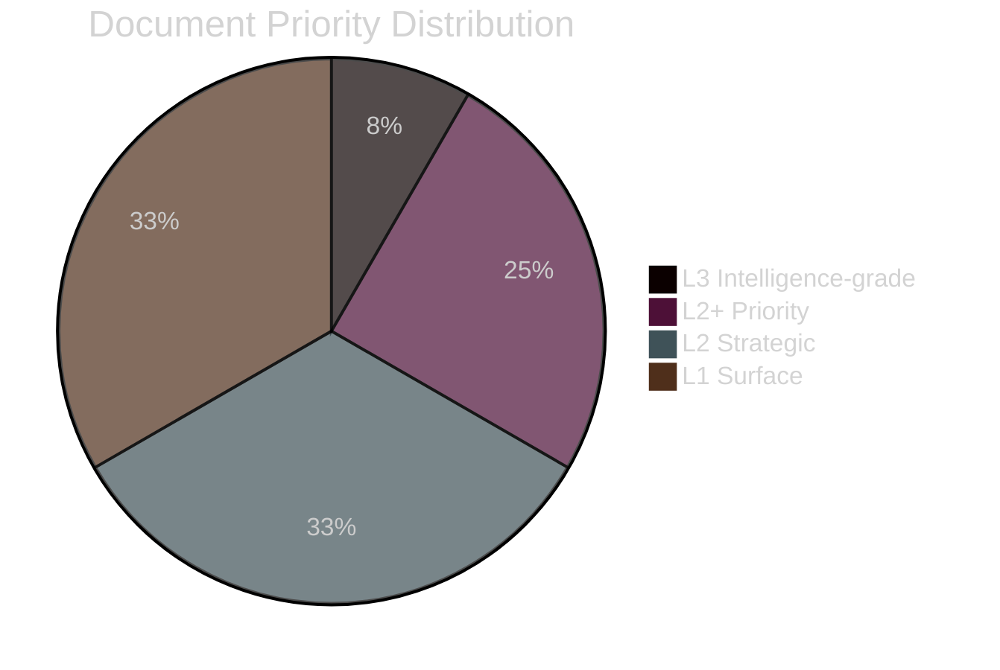

# Classification Results — Sweden Year Ahead 2026-05-04

**Framework**: 7-dimension political classification | **GDPR basis**: Art 9(2)(e)(g)

---

## Per-Document Classification

### HC03155 — Stärkt konstitutionell beredskap

| Dimension | Classification |
|---|---|
| **Policy domain** | Constitutional law / Security |
| **Political salience** | Critical — cross-Riksdag significance |
| **Party alignment** | Government (M+SD+KD+L); S abstention; V+MP opposed |
| **Temporal scope** | Permanent structural change |
| **EU/international nexus** | NATO Art 5 compatibility; ECHR compliance required |
| **Lagrådet status** | Referral pending per RF 8:22 |
| **Retention class** | L3 Intelligence-grade — 5 years |

### HC03205 — Myndigheten för civilt försvar (MSB rename)

| Dimension | Classification |
|---|---|
| **Policy domain** | Defence / Civil emergency / Total defence |
| **Political salience** | High — bipartisan defence consensus |
| **Party alignment** | Broad Riksdag support incl. S |
| **Temporal scope** | Institutional reform — 2026 entry into force |
| **EU/international nexus** | NATO resilience requirements; EU civil protection |
| **Lagrådet status** | Not required (organisational rename) |
| **Retention class** | L2+ Priority — 3 years |

### HC03203 — Uranutvinning legaliseras

| Dimension | Classification |
|---|---|
| **Policy domain** | Energy / Mining / Environment |
| **Political salience** | High — ideologically divisive |
| **Party alignment** | M+SD+KD support; S+V+MP+C opposed |
| **Temporal scope** | Permanent legal change; 10–15-year investment horizon |
| **EU/international nexus** | Euratom; EU Taxonomy (contested) |
| **Lagrådet status** | Not required (regulatory change) |
| **Retention class** | L2 Strategic — 3 years |

### HC03197 — EU mediefrihetsförordning

| Dimension | Classification |
|---|---|
| **Policy domain** | Media law / Press freedom / EU compliance |
| **Political salience** | Medium — press and journalistic community concern |
| **Party alignment** | Government (EU obligation); S supportive; V+MP critical of scope |
| **Temporal scope** | 2026–2028 implementation window |
| **EU/international nexus** | European Media Freedom Act (EMFA) — mandatory |
| **Lagrådet status** | Review pending |
| **Retention class** | L1 Surface — 1 year |

## Priority Tiers Summary

| Tier | Count | Examples |
|---|---|---|
| L3 Intelligence-grade | 1 | Election 2026, HC03155 |
| L2+ Priority | 3 | HC03205, HC03193, IMF macro |
| L2 Strategic | 4 | HC03203, HC03186, HC03208, HC03197 |
| L1 Surface | 4 | HC03168, HC03192, HC03204, HC03183 |

