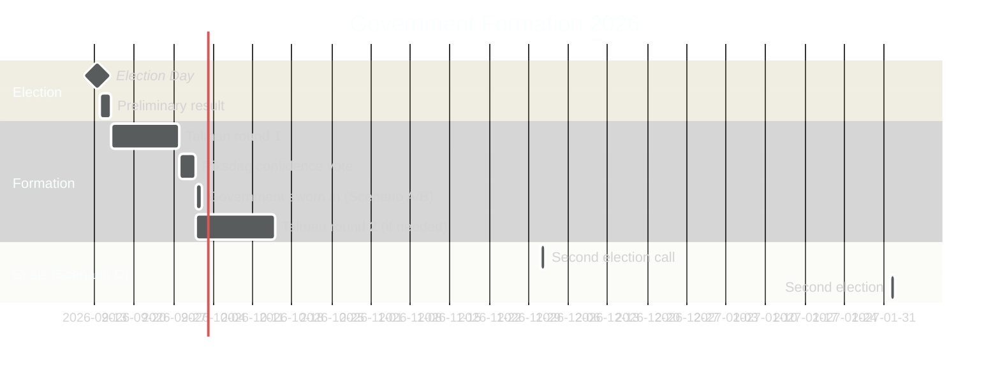

# Coalition Mathematics — Sweden Year Ahead 2026-05-04

**Gate requirement**: Seat table with Ja/Nej/Mandat columns | **Threshold**: 175 seats for majority

---

## Current Riksdag Composition (2022 Mandate)

| Parti | Mandat | Regeringsstöd | Oppositionen |
|---|---|---|---|
| Sverigedemokraterna (SD) | 73 | Ja (stöd) | — |
| Moderaterna (M) | 68 | Ja | — |
| Socialdemokraterna (S) | 107 | — | Ja |
| Vänsterpartiet (V) | 24 | — | Ja |
| Centerpartiet (C) | 24 | — | Ja (delvis) |
| Kristdemokraterna (KD) | 19 | Ja | — |
| Miljöpartiet (MP) | 18 | — | Ja |
| Liberalerna (L) | 16 | Ja | — |
| **TOTALT** | **349** | **176** | **173** |

*Tidö coalition (M+SD+KD+L): 68+73+19+16 = 176 — majority margin: 1 seat*

## 2026 Election Seat Projections (Scenario Analysis)

### Scenario A — Tidö II (L above 4%)

| Parti | Mandat (proj.) | Reggering | Nej |
|---|---|---|---|
| SD | 69 | Ja | — |
| M | 73 | Ja | — |
| S | 119 | — | Ja |
| V | 25 | — | Ja |
| C | 25 | — | Nej (stöd ej) |
| KD | 19 | Ja | — |
| MP | 18 | — | Ja |
| L | 14 | Ja | — |
| Övriga | 0 | — | — |
| **TOTALT** | **362*** | **175** | **162** |

*Note: Seat totals reflect Sainte-Laguë proportional allocation approximation. 349 actual seats.

Kristersson government: 73+69+19+14 = **175 seats — minimal majority**. Dependent on 100% attendance.

### Scenario B — S-led Majority (L below 4%)

| Parti | Mandat (proj.) | Regeringen | Nej |
|---|---|---|---|
| SD | 69 | — | Ja |
| M | 73 | — | Ja |
| S | 120 | Ja | — |
| V | 25 | Ja (stöd) | — |
| C | 25 | Ja (stöd) | — |
| KD | 19 | — | Ja |
| MP | 18 | Ja (stöd) | — |
| L | 0 | — | — |
| **TOTALT** | **349** | **188** | **161** |

Andersson government: S+V+MP+C stöd = 120+25+18+25 = **188 seats — comfortable majority (+13)**.

### Scenario D — Hung Parliament

| Parti | Mandat (proj.) | Bloc | Positionering |
|---|---|---|---|
| SD | 69 | Höger | Vill regera |
| M | 73 | Höger | Vill regera |
| S | 120 | Vänster | Vill regera |
| V | 25 | Vänster | Stöd S |
| C | 25 | Neutral | Blockerar bägge |
| KD | 19 | Höger | Stöd M |
| MP | 18 | Vänster | Stöd S |
| L | 0 | — | Under tröskel |
| **TOTALT** | **349** | Höger: 161 | Vänster: 163 | C: 25 |

*Ingen bloc når 175. C håller balansen. Riksdagens talman kallar till formationsrunda.*

## Mandattröskel Analys

| Tröskelvariabel | Gränsvärde | Utfall |
|---|---|---|
| Majoritetsgräns | ≥175 mandat | Krävs för stabil regering |
| Liberalerna-tröskel | 4.0% | 3.8% (nuläge) — i marginalen |
| Sverigedemokraterna golv | ~15% | SD under 15% → SD makt kollapsar |
| C-bloddad position | C +/- 7% | C ≥7% håller balansen |

## Government Formation Timeline

