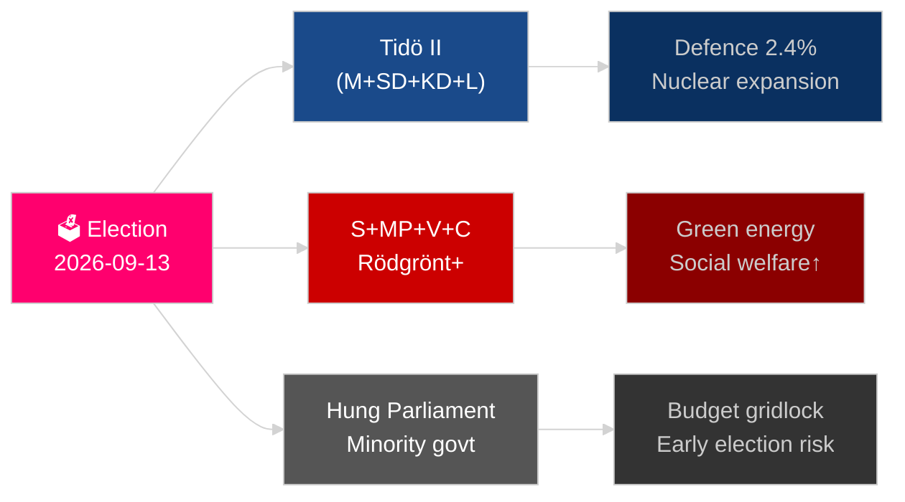

# Sweden's Year Ahead: Election 2026, Defence Pivot, and Economic Recovery

**Author**: James Pether Sörling
**Date**: 2026-05-04
**Classification**: PUBLIC — GDPR Art 9(2)(e)(g)
**Analysis depth**: comprehensive (2.0× Tier-C)
**Confidence**: HIGH [Admiralty B2]

---

## BLUF

Sweden faces its most consequential year since NATO accession: the September 13, 2026 Riksdag election will determine whether the Tidö centre-right coalition continues or a Social Democrat–led bloc returns to power, with the outcome pivoting on gang-crime policy, energy strategy, and defence spending credibility. Economic recovery from the 2024 recession is underway but fragile — IMF WEO Apr-2026 projects 2.1% GDP growth for 2026 [horizon:year], below Nordic peers. Three structural megatrends — total defence reconstruction, nuclear energy revival, and constitutional resilience legislation — will bind any successor government regardless of electoral outcome.

## Decisions This Brief Supports

1. **Electoral scenario planning**: Which coalition configurations are viable post-September 2026, and what legislative agenda change follows each?
2. **Defence investment tracking**: Is Sweden's total-defence buildout (MSB → Myndigheten för civilt försvar) on track to meet the 2030 2%+ GDP target?
3. **Energy transition risk**: Does uranium-mining legislation and wind-power tax reform signal a coherent nuclear-anchored energy strategy or short-term fiscal patch?
4. **Rule-of-law trajectory**: Is the wave of criminal-law legislation (gang crime, police powers, electronic surveillance, company secrets) sustainable across a government transition?
5. **Constitutional stability**: Does HC03155 (stärkt konstitutionell beredskap) create adequate emergency powers without creating democratic backsliding risk?

## 60-Second Intelligence Read

- **Election**: SD remains kingmaker; V + MP hold Vänsterblocket minority veto; C and L face existential threshold risk. Coalition arithmetic locks both blocs close to 175-seat parity. **Verdict: too close to call** [horizon:election].
- **Defence**: HC03205 (MSB renamed to Myndigheten för civilt försvar) + HC03193 (försvarsindustristrategi) signal accelerated civil-military integration. Sweden committed to 2.4% GDP on defence by 2028 (NATO target).
- **Economy**: Recovery accelerating. IMF WEO Apr-2026: SWE growth 2.1% T+1, inflation declining to ~2.5%. Household debt risk remains elevated; property market recovery uneven.
- **Energy**: HC03203 (uranium mining ban lifted) + HC03168 (wind-power property tax raised) = deliberate nuclear-pivoting signalling before election. Politically risky with green voter blocs.
- **Public order**: HC03186 (police firearms), HC03189 (oskuldskontroller kriminaliserat), HC03208 (company secrets) continue the hardest legislative sprint in a decade.

## Top Forward Trigger

**Election outcome T−132 days**: Polls showing SD above 22% or S below 30% will trigger fundamental coalition recalculation and budget re-signalling. Watch the September 2026 SVT/Ipsos final pre-election polls and district-level results in Malmö, Gothenburg and Stockholm suburbs.

## Confidence Label

HIGH confidence on structural trends (defence, law reform); MEDIUM on election outcome and coalition composition [Admiralty B2 / WEP: likely].

