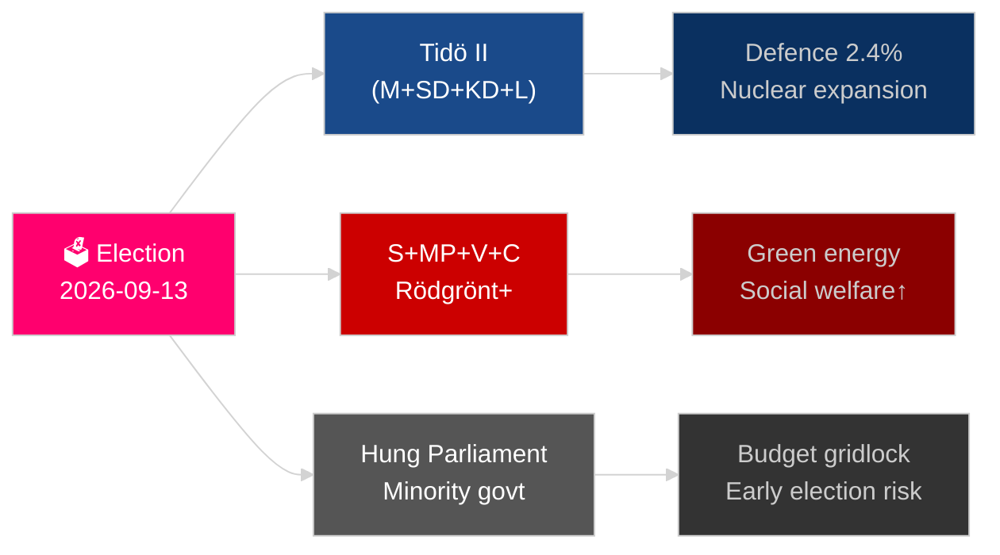

<!-- dir: rtl -->
# السنة المقبلة للسويد: انتخابات 2026، التحول الدفاعي، والانتعاش الاقتصادي

**المؤلف**: James Pether Sörling
**التاريخ**: 2026-05-04
**التصنيف**: عام — اللائحة العامة لحماية البيانات المادة 9(2)(هـ)(ز)
**عمق التحليل**: شامل (2.0× المستوى-C)
**مستوى الثقة**: عالٍ [Admiralty B2]

---

## الخلاصة التنفيذية

تواجه السويد أكثر أعوامها حسماً منذ الانضمام إلى حلف الناتو؛ فانتخابات الريكسداغ في 13 سبتمبر 2026 ستحدد ما إذا كانت تحالف تيدو من يمين الوسط سيستمر في الحكم، أو ما إذا كانت الكتلة التي يقودها الاشتراكيون الديمقراطيون ستعود إلى السلطة، مع توقف النتيجة على سياسة الجريمة المنظمة والاستراتيجية الطاقوية ومصداقية الإنفاق الدفاعي. يسير الانتعاش الاقتصادي من ركود 2024 لكنه هش؛ إذ يتوقع صندوق النقد الدولي WEO أبريل-2026 نمواً اقتصادياً بنسبة 2.1٪ لعام 2026 [أفق:سنة]، وهو دون المتوسط بين نظيراتها الشمالية. ثلاث ميغاتيارات هيكلية — إعادة بناء الدفاع الشامل، وإحياء الطاقة النووية، وتشريع المرونة الدستورية — ستُلزم أي حكومة خلف بصرف النظر عن نتيجة الانتخابات.

## القرارات التي يدعمها هذا الموجز

1. **التخطيط لسيناريوهات الانتخابات**: أي تشكيلات تحالفية ممكنة بعد سبتمبر 2026، وما التغيير في الأجندة التشريعية الذي يعقب كل سيناريو؟
2. **تتبع بناء الدفاع**: هل مسيرة بناء الدفاع الشامل السويدي (MSB → Myndigheten för civilt försvar) على المسار الصحيح لبلوغ هدف 2030 بأكثر من 2٪ من الناتج المحلي الإجمالي؟
3. **مخاطر التحول في قطاع الطاقة**: هل تشير تشريعات تعدين اليورانيوم وإصلاح الضريبة على طاقة الرياح إلى استراتيجية طاقة متماسكة مرتكزة على الطاقة النووية، أم إنها مجرد رقعة مالية قصيرة الأجل؟
4. **مسار سيادة القانون**: هل موجة التشريعات الجنائية (الجريمة المنظمة، صلاحيات الشرطة، المراقبة الإلكترونية، الأسرار التجارية) قابلة للاستمرار عبر تحول حكومي؟
5. **الاستقرار الدستوري**: هل يوفر HC03155 (stärkt konstitutionell beredskap) صلاحيات طوارئ كافية دون إحداث خطر التراجع الديمقراطي؟

## القراءة الاستخباراتية في 60 ثانية

- **الانتخابات**: يبقى SD صانع القرار؛ V + MP يحتفظان بحق النقض الأقلي لـVänsterblocket؛ C و L أمام خطر وجودي عند العتبة. تُقيّد حسابات التحالف كلا الكتلتين بالقرب من التعادل عند 175 مقعداً. **الحكم: فارق ضيق جداً لا يسمح بالتنبؤ** [أفق:انتخابات].
- **الدفاع**: HC03205 (إعادة تسمية MSB إلى Myndigheten för civilt försvar) + HC03193 (försvarsindustristrategi) تشير إلى تسريع التكامل المدني-العسكري. التزمت السويد بتخصيص 2.4٪ من الناتج المحلي الإجمالي للدفاع بحلول 2028 (هدف الناتو).
- **الاقتصاد**: يتسارع الانتعاش. صندوق النقد الدولي WEO أبريل-2026: نمو SWE 2.1٪ T+1، وتراجع التضخم نحو ~2.5٪. تبقى مخاطر مديونية الأسر مرتفعة؛ وانتعاش سوق العقارات غير متكافئ.
- **الطاقة**: HC03203 (رفع حظر تعدين اليورانيوم) + HC03168 (رفع ضريبة عقارات الطاقة الريحية) = إشارة متعمدة نحو الطاقة النووية قبيل الانتخابات. محفوفة بالمخاطر سياسياً لدى شرائح الناخبين الخضر.
- **النظام العام**: HC03186 (أسلحة نارية للشرطة)، HC03189 (oskuldskontroller kriminaliserat)، HC03208 (الأسرار التجارية) تواصل مسيرة التشريع الأكثر إثارة للجدل في عقود.

## المُحرِّك الأمامي الرئيسي

**نتيجة الانتخابات T−132 يوماً**: الاستطلاعات التي تُظهر SD فوق 22٪ أو S دون 30٪ ستُطلق إعادة حساب جوهرية للتحالفات ورسائل الميزانية. رصد الاستطلاعات النهائية لـSVT/Ipsos قبيل انتخابات سبتمبر 2026 والنتائج على مستوى المقاطعات في مالمو وغوتنبرغ وضواحي ستوكهولم.

## تسمية الثقة

ثقة عالية في الاتجاهات الهيكلية (الدفاع، الإصلاح القانوني)؛ متوسطة في نتيجة الانتخابات وتركيبة التحالف [Admiralty B2 / WEP: محتمل].

<!-- source-sha: b5d10858f4d82b9b502512cd3ecbf7e174e813ae -->
