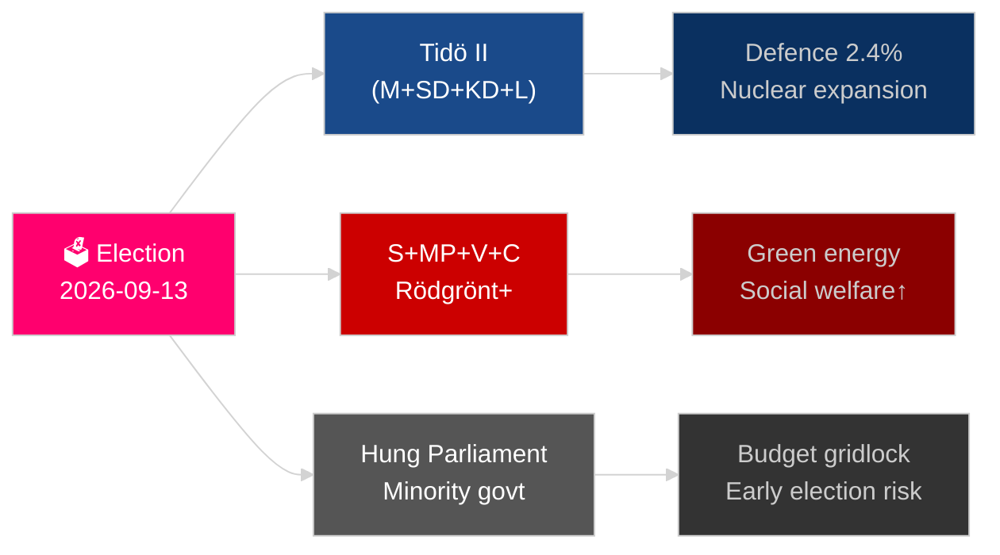

# Danmarks år fremover: Valget 2026, forsvarspivot og økonomisk genopretning

**Forfatter**: James Pether Sörling
**Dato**: 2026-05-04
**Klassifikation**: OFFENTLIG — GDPR Art 9(2)(e)(g)
**Analysdybde**: omfattende (2,0× Niveau-C)
**Konfidens**: HØJ [Admiralty B2]

---

## BLUF

Sverige står over for sit mest skelsættende år siden NATO-tiltrædelsen: Riksdag-valget den 13. september 2026 vil afgøre, om Tidö-centrehøjrekoalitionen fortsætter, eller om et Socialdemokratisk ledet blok vender tilbage til magten, med udfaldet afhængende af politikken om bandekriminalitet, energistrategi og troværdighed i forsvarsudgifterne. Den økonomiske genopretning efter recessionen i 2024 er i gang men skrøbelig — IMF WEO apr-2026 forventer 2,1 % BNP-vækst for 2026 [horisont:år], under nordiske jævnaldrende. Tre strukturelle megatendenser — rekonstruktion af totalforsvaret, atomenergirevival og lovgivning om konstitutionel modstandsdygtighed — vil binde enhver efterfølgende regering uanset valgresultat.

## Beslutninger dette brief understøtter

1. **Valgscenariplanlægning**: Hvilke koalitionskonfigurationer er levedygtige efter september 2026, og hvilken lovgivningsmæssig dagsordensændring følger hvert scenarie?
2. **Sporing af forsvarsopbygning**: Er Sveriges totalforsvarsopbygning (MSB → Myndigheten för civilt försvar) på rette spor til at opfylde 2030-målet på over 2 % af BNP?
3. **Energiomstillingsrisiko**: Signalerer lovgivning om uranminedrift og vindkraftsskatteændring en sammenhængende atomenergiforankret energistrategi eller et kortsigtet finanspolitisk plaster?
4. **Retsstatens kurs**: Er bølgen af strafferetslovgivning (bandekriminalitet, politibeføjelser, elektronisk overvågning, forretningshemmeligheder) holdbar på tværs af et regeringsskifte?
5. **Konstitutionel stabilitet**: Skaber HC03155 (stärkt konstitutionell beredskap) tilstrækkelige nødbeføjelser uden at skabe risiko for demokratisk tilbagegang?

## 60-sekunders efterretningslæsning

- **Valg**: SD forbliver tungen på vægtskålen; V + MP holder Vänsterblokets mindretals-veto; C og L står over for eksistentiel tærskeltrussel. Koalitionsaritmetikken låser begge blokke tæt på 175-mandat-paritet. **Konklusion: for jævnt til at forudsige** [horisont:valg].
- **Forsvar**: HC03205 (MSB omdøbt til Myndigheten för civilt försvar) + HC03193 (försvarsindustristrategi) signalerer accelereret civil-militær integration. Sverige har forpligtet sig til 2,4 % af BNP på forsvar inden 2028 (NATO-mål).
- **Økonomi**: Genopretningen accelererer. IMF WEO apr-2026: SWE vækst 2,1 % T+1, inflationen falder mod ~2,5 %. Husholdningernes gældsrisiko forbliver forhøjet; ejendomsmarkedets genopretning ujævn.
- **Energi**: HC03203 (forbud mod uranminedrift ophævet) + HC03168 (vindkraftsejendomsskat forhøjet) = bevidst atomenergi-signalering inden valget. Politisk risikabelt med grønne vælgersegmenter.
- **Offentlig orden**: HC03186 (politiets skydevåben), HC03189 (oskuldskontroller kriminaliserat), HC03208 (forretningshemmeligheder) fortsætter årtiers hårdeste lovgivningssprint.

## Ledende fremtidig trigger

**Valgresultat T−132 dage**: Målinger der viser SD over 22 % eller S under 30 % vil udløse en fundamental koalitionsgenberegning og budgetsignalering. Hold øje med SVT/Ipsos' endelige valgmålinger i september 2026 og distriktsresultater i Malmö, Göteborg og Stockholms forstæder.

## Konfidensmærkat

HØJ konfidens på strukturelle tendenser (forsvar, retsreform); MEDIUM på valgresultat og koalitionssammensætning [Admiralty B2 / WEP: sandsynligt].

<!-- source-sha: b5d10858f4d82b9b502512cd3ecbf7e174e813ae -->
