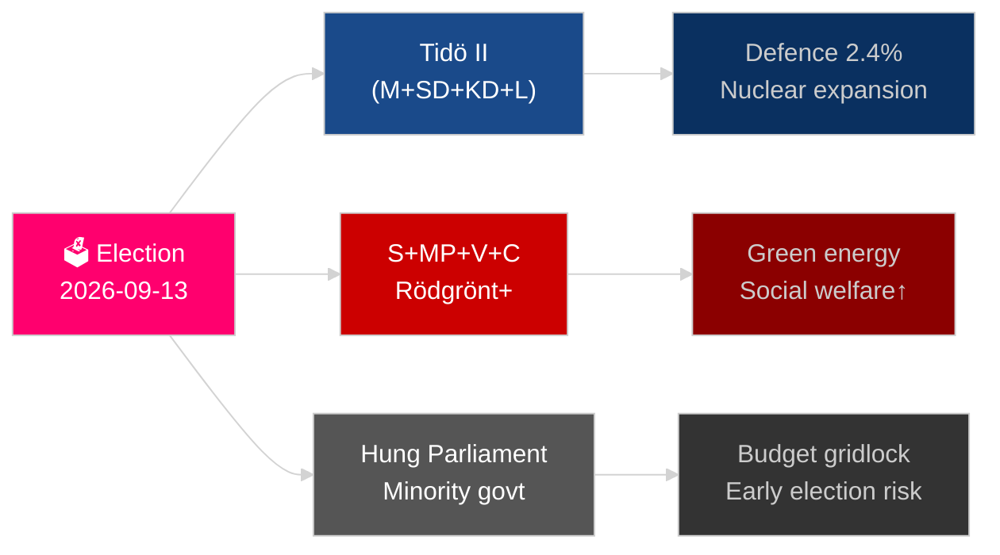

# Schwedens kommendes Jahr: Wahl 2026, Verteidigungswende und wirtschaftliche Erholung

**Autor**: James Pether Sörling
**Datum**: 2026-05-04
**Klassifizierung**: ÖFFENTLICH — DSGVO Art. 9 Abs. 2 lit. e/g
**Analysetiefe**: umfassend (2,0× Stufe-C)
**Konfidenz**: HOCH [Admiralty B2]

---

## BLUF

Schweden steht vor seinem folgenreichsten Jahr seit dem NATO-Beitritt: Die Riksdag-Wahl am 13. September 2026 wird darüber entscheiden, ob die Tidö-Mitte-rechts-Koalition weiterregiert oder ein sozialdemokratisch geführter Block die Macht zurückerobert — das Ergebnis dreht sich um Bandenkriminalpolitik, Energiestrategie und die Glaubwürdigkeit der Verteidigungsausgaben. Die wirtschaftliche Erholung von der Rezession 2024 ist im Gange, aber fragil — IWF WEO Apr-2026 prognostiziert 2,1 % BIP-Wachstum für 2026 [Horizont:Jahr], unterhalb nordischer Vergleichsländer. Drei strukturelle Megatrends — Wiederaufbau der Gesamtverteidigung, Atomenergie-Revival und Verfassungsresilienzgesetzgebung — werden jede Folgeregierung unabhängig vom Wahlergebnis binden.

## Entscheidungen, die dieses Briefing unterstützt

1. **Wahlszenarienplanung**: Welche Koalitionskonfigurationen sind nach September 2026 lebensfähig, und welche legislativen Agendaänderungen folgen jedem Szenario?
2. **Überwachung des Verteidigungsaufbaus**: Ist Schwedens Gesamtverteidigungsaufbau (MSB → Myndigheten för civilt försvar) auf Kurs, um das 2030-Ziel von über 2 % des BIP zu erreichen?
3. **Energiewendeisiko**: Signalisiert die Uranbergbaugesetzgebung und die Windkraftsteueränderung eine kohärente, kernkraftverankerte Energiestrategie oder einen kurzfristigen Fiskalplaster?
4. **Rechtsstaatsentwicklung**: Ist die Welle der Strafrechtsgesetzgebung (Bandenkriminalität, Polizeibefugnisse, elektronische Überwachung, Geschäftsgeheimnisse) über einen Regierungswechsel hinaus tragfähig?
5. **Verfassungsstabilität**: Schafft HC03155 (stärkt konstitutionell beredskap) ausreichende Notstandsbefugnisse, ohne das Risiko eines demokratischen Rückschritts zu erzeugen?

## 60-Sekunden-Nachrichtenüberblick

- **Wahl**: SD bleibt Zünglein an der Waage; V + MP halten das Minderheitsveto des Vänsterblokets; C und L stehen vor existenziellen Hürdenrisiken. Die Koalitionsarithmetik sperrt beide Blöcke nahe der 175-Sitze-Parität. **Fazit: zu knapp für eine Prognose** [Horizont:Wahl].
- **Verteidigung**: HC03205 (MSB umbenannt in Myndigheten för civilt försvar) + HC03193 (försvarsindustristrategi) signalisiert beschleunigte zivil-militärische Integration. Schweden hat sich zu 2,4 % des BIP für Verteidigung bis 2028 verpflichtet (NATO-Ziel).
- **Wirtschaft**: Erholung beschleunigt sich. IWF WEO Apr-2026: SWE-Wachstum 2,1 % T+1, Inflation sinkt auf ~2,5 %. Haushaltsschuldenrisiko bleibt erhöht; Immobilienmarkterholung ungleichmäßig.
- **Energie**: HC03203 (Uranbergbauverbot aufgehoben) + HC03168 (Windkraftgrundsteuer erhöht) = bewusste Atomenergie-Signalgebung vor der Wahl. Politisch riskant bei grünen Wählergruppen.
- **Öffentliche Ordnung**: HC03186 (Polizeischusswaffen), HC03189 (oskuldskontroller kriminaliserat), HC03208 (Geschäftsgeheimnisse) setzt den härtesten Gesetzgebungssprint des Jahrzehnts fort.

## Wichtigster Zukunftsauslöser

**Wahlergebnis T−132 Tage**: Umfragen, die SD über 22 % oder S unter 30 % zeigen, werden eine grundlegende Koalitionsneuberechnung und Budgetsignalgebung auslösen. Beobachten Sie die abschließenden SVT/Ipsos-Vorwahlumfragen im September 2026 sowie Ergebnisse auf Wahlkreisebene in Malmö, Göteborg und den Stockholmer Vororten.

## Konfidenzlabel

HOHE Konfidenz bei strukturellen Trends (Verteidigung, Rechtsreform); MITTLERE Konfidenz bei Wahlergebnis und Koalitionszusammensetzung [Admiralty B2 / WEP: wahrscheinlich].

<!-- source-sha: b5d10858f4d82b9b502512cd3ecbf7e174e813ae -->
