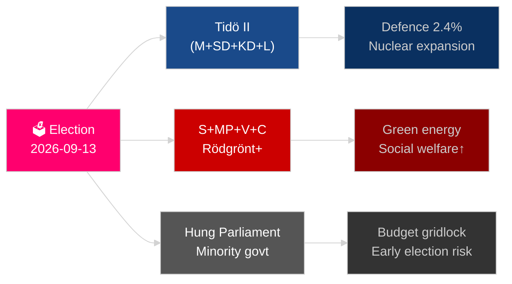

# El año por venir de Suecia: elecciones 2026, pivote de defensa y recuperación económica

**Autor**: James Pether Sörling
**Fecha**: 2026-05-04
**Clasificación**: PÚBLICO — RGPD Art. 9(2)(e)(g)
**Profundidad de análisis**: exhaustiva (2,0× Nivel-C)
**Confianza**: ALTA [Admiralty B2]

---

## BLUF

Suecia afronta su año más decisivo desde el ingreso en la OTAN: las elecciones al Riksdag del 13 de septiembre de 2026 determinarán si la coalición de centro-derecha Tidö continúa o si un bloque liderado por los socialdemócratas regresa al poder, con el resultado girando en torno a la política contra las bandas, la estrategia energética y la credibilidad del gasto en defensa. La recuperación económica de la recesión de 2024 está en marcha pero es frágil — el FMI WEO abr-2026 proyecta un crecimiento del PIB del 2,1 % para 2026 [horizonte:año], por debajo de los pares nórdicos. Tres megatendencias estructurales — la reconstrucción de la defensa total, el renacimiento de la energía nuclear y la legislación de resiliencia constitucional — vincularán a cualquier gobierno sucesor independientemente del resultado electoral.

## Decisiones que apoya este informe

1. **Planificación de escenarios electorales**: ¿Qué configuraciones de coalición son viables después de septiembre de 2026 y qué cambio de agenda legislativa sigue a cada escenario?
2. **Seguimiento de la construcción de defensa**: ¿Está la construcción de la defensa total de Suecia (MSB → Myndigheten för civilt försvar) en camino de cumplir el objetivo de 2030 de más del 2 % del PIB?
3. **Riesgo en la transición energética**: ¿La legislación sobre minería de uranio y la reforma fiscal eólica señalan una estrategia energética coherente anclada en lo nuclear, o un parche fiscal a corto plazo?
4. **Trayectoria del Estado de Derecho**: ¿Es sostenible la ola de legislación penal (crimen organizado, poderes policiales, vigilancia electrónica, secretos empresariales) a través de un cambio de gobierno?
5. **Estabilidad constitucional**: ¿Crea HC03155 (stärkt konstitutionell beredskap) poderes de emergencia adecuados sin generar riesgo de retroceso democrático?

## Resumen de inteligencia en 60 segundos

- **Elecciones**: SD sigue siendo árbitro; V + MP mantienen el veto de minoría del Vänsterblocket; C y L enfrentan riesgo umbral existencial. La aritmética de coalición bloquea ambos bloques cerca de la paridad de 175 escaños. **Veredicto: demasiado ajustado para predecir** [horizonte:elección].
- **Defensa**: HC03205 (MSB rebautizado como Myndigheten för civilt försvar) + HC03193 (försvarsindustristrategi) señala una integración civil-militar acelerada. Suecia se comprometió al 2,4 % del PIB en defensa para 2028 (objetivo OTAN).
- **Economía**: La recuperación se acelera. FMI WEO abr-2026: crecimiento SWE 2,1 % T+1, inflación descendiendo hacia ~2,5 %. El riesgo de deuda de los hogares sigue elevado; la recuperación del mercado inmobiliario es desigual.
- **Energía**: HC03203 (prohibición de minería de uranio levantada) + HC03168 (impuesto inmobiliario sobre la energía eólica aumentado) = señalización deliberada pro-nuclear antes de las elecciones. Políticamente arriesgado con segmentos electorales verdes.
- **Orden público**: HC03186 (armas de fuego policiales), HC03189 (oskuldskontroller kriminaliserat), HC03208 (secretos empresariales) continúa el sprint legislativo más intenso de la década.

## Principal detonante futuro

**Resultado electoral T−132 días**: Las encuestas que muestren SD por encima del 22 % o S por debajo del 30 % desencadenarán un recálculo fundamental de coalición y señalización presupuestaria. Observar las encuestas finales preelectorales de SVT/Ipsos de septiembre de 2026 y los resultados por distrito en Malmö, Gotemburgo y los suburbios de Estocolmo.

## Etiqueta de confianza

ALTA confianza en tendencias estructurales (defensa, reforma legal); MEDIA en resultado electoral y composición de coalición [Admiralty B2 / WEP: probable].

<!-- source-sha: b5d10858f4d82b9b502512cd3ecbf7e174e813ae -->
