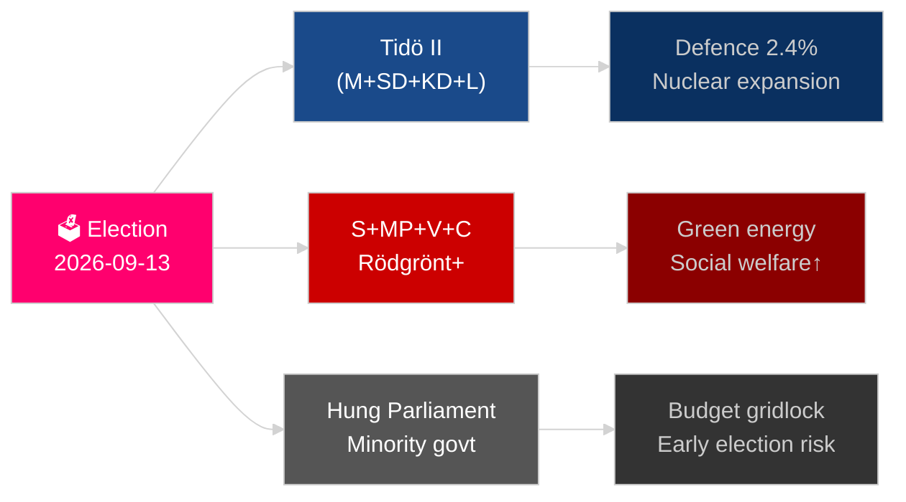

# Ruotsin tuleva vuosi: Vaalit 2026, puolustuspivotti ja talouden elpyminen

**Tekijä**: James Pether Sörling
**Päiväys**: 2026-05-04
**Luokitus**: JULKINEN — GDPR Art 9(2)(e)(g)
**Analyysin syvyys**: kattava (2,0× Taso-C)
**Luotettavuus**: KORKEA [Admiralty B2]

---

## BLUF

Ruotsi kohtaa merkittävimmän vuotensa sitten NATO-liittymisensä: 13. syyskuuta 2026 pidettävät Riksdag-vaalit ratkaisevat, jatkuuko Tidö-koalition keskusta-oikeistohallitus vai palaako sosialidemokraattinen blokki valtaan. Lopputulos riippuu jengirikollisuuspolitiikasta, energiastrategiasta ja puolustusmenoja koskevasta uskottavuudesta. Talouden elpyminen vuoden 2024 taantumasta on käynnissä mutta hauraalla pohjalla — IMF WEO huhti-2026 ennustaa 2,1 %:n BNP-kasvun vuodelle 2026 [horisontti:vuosi], mikä jää alle pohjoismaisten verrokkaiden. Kolme rakenteellista megatrendiä — kokonaismaanpuolustuksen jälleenrakennus, ydinenergiavivahta ja perustuslaillista resilienssiä koskeva lainsäädäntö — sitovat jokaisen seuraavan hallituksen riippumatta vaalituloksesta.

## Päätökset, joita tämä tiedustelutiivistelmä tukee

1. **Vaaliskenaarion suunnittelu**: Mitkä koalitiokokoonpanot ovat toteuttamiskelpoisia syyskuun 2026 jälkeen, ja millainen lainsäädäntömuutos seuraa kutakin skenaariota?
2. **Puolustusrakentamisen seuranta**: Onko Ruotsin kokonaismaanpuolustuksen rakentaminen (MSB → Myndigheten för civilt försvar) oikealla tiellä vuoden 2030 tavoitteen saavuttamiseksi (yli 2 % BNP:stä)?
3. **Energiasiirtymän riski**: Viestittääkö uraanin louhinnan lainsäädäntö ja tuulivoimaveromuutos johdonmukaista ydinvoimaan perustuvaa energiastrategiaa vai lyhytaikaista taloudellista paikkausta?
4. **Oikeusvaltion kehityssuunta**: Onko rikosoikeudellisen lainsäädännön aalto (jengirikollisuus, poliisivaltuudet, sähköinen valvonta, liikesalaisuudet) kestävällä pohjalla hallitusvaihdoksen yli?
5. **Perustuslaillinen vakaus**: Luoko HC03155 (stärkt konstitutionell beredskap) riittävät kriisiä koskevat valtuudet ilman demokratisen taantumisen riskiä?

## 60 sekunnin tiedusteluyhteenveto

- **Vaalit**: SD pysyy vaakakielenä; V + MP pitää Vänsterbloketin vähemmistöveto-oikeuden; C ja L kohtaavat eksistentiaalisen kynnysriskin. Koalitioaritmetiikka lukitsee molemmat blokit lähelle 175 paikan tasapainoa. **Lausunto: liian tasainen ennustettavaksi** [horisontti:vaalit].
- **Puolustus**: HC03205 (MSB nimetty uudelleen Myndigheten för civilt försvarsksi) + HC03193 (försvarsindustristrategi) viestii kiihtyvästä siviili-sotilaallisesta integraatiosta. Ruotsi on sitoutunut 2,4 %:iin BNP:stä puolustukseen vuoteen 2028 mennessä (NATO-tavoite).
- **Talous**: Elpyminen kiihtyy. IMF WEO huhti-2026: SWE kasvu 2,1 % T+1, inflaatio laskee kohti ~2,5 %. Kotitalouksien velkaantumisriski pysyy korkeana; kiinteistömarkkinoiden elpyminen epätasainen.
- **Energia**: HC03203 (uraanin louhinnan kielto poistettu) + HC03168 (tuulivoimakiinteistövero korotettu) = tarkoituksellinen ydinvoimaviestintä ennen vaaleja. Poliittisesti riskialtis vihreiden äänestäjäsegmenttien osalta.
- **Yleinen järjestys**: HC03186 (poliisin ampuma-aseet), HC03189 (oskuldskontroller kriminaliserat), HC03208 (liikesalaisuudet) jatkavat vuosikymmenen kovinta lainsäädäntösprinttiä.

## Tärkein tuleva laukaisija

**Vaalitulos T−132 päivää**: Kyselyt, joissa SD on yli 22 % tai S alle 30 %, laukaisevat perustavanlaatuisen koalitionuudelleenlaskennan ja budjettivistiinnin. Seuraa SVT/Ipsos -tutkimuslaitosten viimeiset ennen vaaleja tehdyt syyskuun 2026 mielipidemittaukset ja piirikohtaiset tulokset Malmössa, Göteborgissa ja Tukholman lähiöissä.

## Luotettavuusmerkintä

KORKEA luotettavuus rakenteellisten trendien osalta (puolustus, oikeudellinen uudistus); KESKITASOINEN vaalituloksen ja koalitiokokoonpanon osalta [Admiralty B2 / WEP: todennäköinen].

<!-- source-sha: b5d10858f4d82b9b502512cd3ecbf7e174e813ae -->
