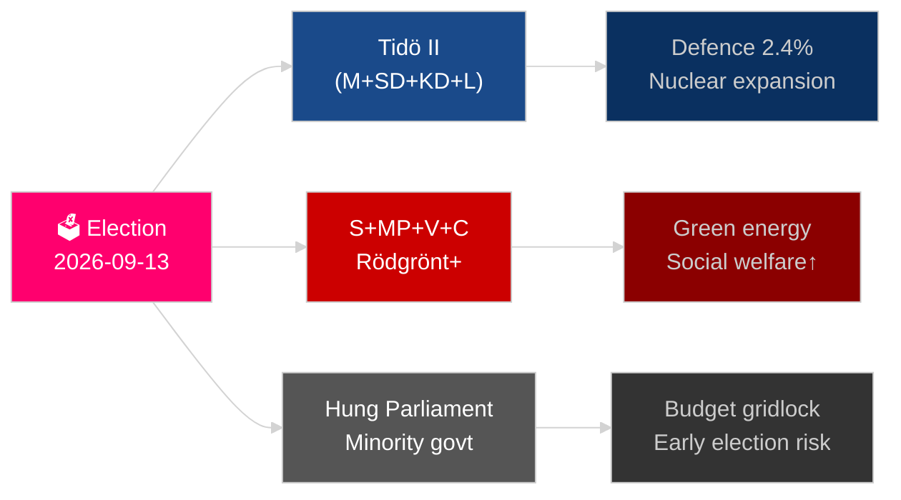

# L'année à venir pour la Suède : élections 2026, pivot défensif et reprise économique

**Auteur** : James Pether Sörling
**Date** : 2026-05-04
**Classification** : PUBLIC — RGPD art. 9 par. 2 lit. e/g
**Profondeur d'analyse** : approfondie (2,0× Niveau-C)
**Confiance** : ÉLEVÉE [Admiralty B2]

---

## BLUF

La Suède affronte son année la plus décisive depuis l'adhésion à l'OTAN : l'élection du Riksdag le 13 septembre 2026 déterminera si la coalition de centre droit Tidö se maintient ou si un bloc conduit par les sociaux-démocrates revient au pouvoir, le résultat pivotant autour de la politique contre les gangs, la stratégie énergétique et la crédibilité des dépenses de défense. La reprise économique après la récession de 2024 est en cours mais fragile — le FMI WEO avr-2026 projette une croissance du PIB de 2,1 % pour 2026 [horizon:année], en deçà des pays nordiques comparables. Trois mégatendances structurelles — reconstruction de la défense totale, renouveau de l'énergie nucléaire et législation sur la résilience constitutionnelle — lieront tout gouvernement successeur quel que soit le résultat électoral.

## Décisions que ce briefing soutient

1. **Planification de scénarios électoraux** : Quelles configurations de coalition sont viables après septembre 2026, et quel changement d'agenda législatif suit chaque scénario ?
2. **Suivi de la construction de la défense** : La construction de la défense totale suédoise (MSB → Myndigheten för civilt försvar) est-elle sur la bonne voie pour atteindre l'objectif 2030 de plus de 2 % du PIB ?
3. **Risque de transition énergétique** : La législation sur l'exploitation minière d'uranium et la réforme fiscale sur l'éolien signalent-elles une stratégie énergétique cohérente ancrée dans le nucléaire, ou un simple pansement fiscal à court terme ?
4. **Trajectoire de l'État de droit** : La vague de législation pénale (criminalité organisée, pouvoirs de police, surveillance électronique, secrets commerciaux) est-elle soutenable au-delà d'un changement de gouvernement ?
5. **Stabilité constitutionnelle** : HC03155 (stärkt konstitutionell beredskap) crée-t-il des pouvoirs d'urgence adéquats sans créer de risque de recul démocratique ?

## Synthèse renseignement en 60 secondes

- **Élections** : SD demeure l'arbitre ; V + MP détiennent le veto minoritaire du Vänsterblocket ; C et L font face à un risque existentiel de seuil. L'arithmétique des coalitions verrouille les deux blocs près de la parité des 175 sièges. **Verdict : trop serré pour prédire** [horizon:élection].
- **Défense** : HC03205 (MSB rebaptisé Myndigheten för civilt försvar) + HC03193 (försvarsindustristrategi) signale une intégration civilo-militaire accélérée. La Suède s'est engagée à 2,4 % du PIB pour la défense d'ici 2028 (objectif OTAN).
- **Économie** : La reprise s'accélère. FMI WEO avr-2026 : croissance SWE 2,1 % T+1, inflation déclinant vers ~2,5 %. Le risque d'endettement des ménages reste élevé ; la reprise du marché immobilier est inégale.
- **Énergie** : HC03203 (interdiction de l'exploitation minière d'uranium levée) + HC03168 (taxe foncière sur l'éolien relevée) = signalisation délibérée pro-nucléaire avant les élections. Politiquement risqué auprès des segments d'électeurs verts.
- **Ordre public** : HC03186 (armes à feu policières), HC03189 (oskuldskontroller kriminaliserat), HC03208 (secrets commerciaux) prolonge le sprint législatif le plus intense depuis une décennie.

## Principal déclencheur futur

**Résultat électoral T−132 jours** : Des sondages montrant SD au-dessus de 22 % ou S en dessous de 30 % déclencheront une refonte fondamentale des calculs de coalition et de la signalisation budgétaire. Surveiller les derniers sondages pré-électoraux SVT/Ipsos de septembre 2026 et les résultats par district à Malmö, Göteborg et la banlieue de Stockholm.

## Étiquette de confiance

HAUTE confiance sur les tendances structurelles (défense, réforme judiciaire) ; MOYENNE sur le résultat électoral et la composition des coalitions [Admiralty B2 / WEP : probable].

<!-- source-sha: b5d10858f4d82b9b502512cd3ecbf7e174e813ae -->
