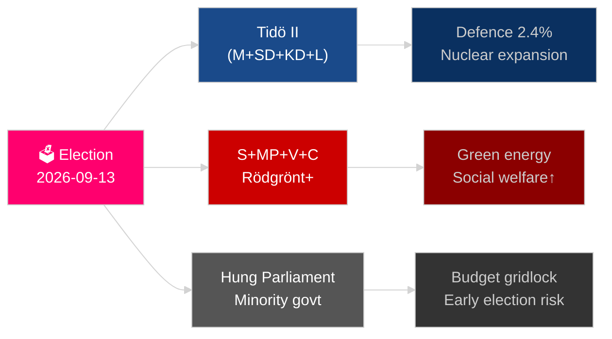

<!-- dir: rtl -->
# השנה הקרובה של שוודיה: בחירות 2026, ציר הביטחון והתאוששות כלכלית

**מחבר**: James Pether Sörling
**תאריך**: 2026-05-04
**סיווג**: ציבורי — GDPR סעיף 9(2)(ה)(ז)
**עומק ניתוח**: מקיף (2.0× רמה-C)
**רמת ביטחון**: גבוהה [Admiralty B2]

---

## תמצית מנהלים

שוודיה ניצבת בפני שנתה המכרעת ביותר מאז הצטרפותה לנאט"ו: בחירות הריקסדאג ב-13 בספטמבר 2026 יכריעו האם קואליציית טידו (מרכז-ימין) ממשיכה בשלטון, או האם גוש בהובלת הסוציאל-דמוקרטים חוזר לשלטון, כאשר התוצאה תלויה במדיניות נגד פשיעת כנופיות, באסטרטגיית האנרגיה ובאמינות ההוצאה הביטחונית. ההתאוששות הכלכלית ממיתון 2024 מתרחשת אך שברירית — קרן המטבע הבינלאומית WEO אפר-2026 צופה צמיחת תמ"ג של 2.1% לשנת 2026 [אופק:שנה], מתחת לנורדיות השוות לה. שלושה מגה-מגמות מבניות — שיקום ההגנה הכוללת, תחיית אנרגיה גרעינית וחקיקת חוסן חוקתי — יחייבו כל ממשלה יורשת ללא קשר לתוצאות הבחירות.

## החלטות שתדריך זה תומך בהן

1. **תכנון תרחישי בחירות**: אילו הרכבי קואליציה ישימים לאחר ספטמבר 2026, ואיזה שינוי בסדר יום החקיקתי יחול בכל תרחיש?
2. **מעקב אחר בניית ההגנה**: האם בניית ההגנה הכוללת של שוודיה (MSB → Myndigheten för civilt försvar) נמצאת במסלול להשגת יעד 2030 של למעלה מ-2% מהתמ"ג?
3. **סיכון מעבר אנרגטי**: האם חקיקת כריית האורניום ורפורמת המס על אנרגיית רוח מאותתים על אסטרטגיית אנרגיה עקבית המעוגנת בגרעין, או על תיקון פיסקלי לטווח קצר?
4. **מסלול שלטון החוק**: האם גל חקיקת המשפט הפלילי (פשיעת כנופיות, סמכויות משטרה, מעקב אלקטרוני, סודות מסחריים) בר-קיימא לאורך מעבר ממשלתי?
5. **יציבות חוקתית**: האם HC03155 (stärkt konstitutionell beredskap) יוצר סמכויות חירום מספיקות מבלי ליצור סיכון לנסיגה דמוקרטית?

## קריאת מודיעין ב-60 שניות

- **בחירות**: SD נשאר כגורם מכריע; V + MP שומרים על וטו המיעוט של Vänsterblocket; C ו-L ניצבים בפני סיכון קיומי בסף הרלוונטי. אריתמטיקת הקואליציה נועלת את שני הגושים סמוך לשוויון של 175 מנדטים. **פסיקה: צמוד מדי מכדי לחזות** [אופק:בחירות].
- **ביטחון**: HC03205 (MSB שונה שמו ל-Myndigheten för civilt försvar) + HC03193 (försvarsindustristrategi) מאות על אינטגרציה אזרחית-צבאית מואצת. שוודיה התחייבה ל-2.4% מהתמ"ג על ביטחון עד 2028 (יעד נאט"ו).
- **כלכלה**: ההתאוששות מואצת. קרן המטבע הבינלאומית WEO אפר-2026: צמיחת SWE 2.1% T+1, אינפלציה יורדת ל-~2.5%. סיכון חוב משקי הבית נותר גבוה; התאוששות שוק הנדל"ן אינה אחידה.
- **אנרגיה**: HC03203 (הגבלת כריית אורניום הוסרה) + HC03168 (מס מקרקעין על אנרגיית רוח הוגדל) = איתות מכוון לטובת גרעין לפני הבחירות. מסוכן פוליטית מול מקטעי מצביעים ירוקים.
- **סדר ציבורי**: HC03186 (כלי נשק של משטרה), HC03189 (oskuldskontroller kriminaliserat), HC03208 (סודות מסחריים) מוסיפה לספרינט החקיקתי הנמרץ ביותר של העשור.

## הטריגר המוביל לעתיד

**תוצאות בחירות T−132 ימים**: סקרים המציגים SD מעל 22% או S מתחת ל-30% יפעילו חישוב קואליציה מחדש ואיתות תקציבי מהותי. לצפות בסקרים הסופיים לפני הבחירות של SVT/Ipsos בספטמבר 2026 ובתוצאות ברמת המחוז במלמו, גטבורג ופרברי שטוקהולם.

## תווית ביטחון

ביטחון גבוה במגמות מבניות (ביטחון, רפורמה משפטית); בינוני בתוצאות בחירות והרכב קואליציה [Admiralty B2 / WEP: סביר].

<!-- source-sha: b5d10858f4d82b9b502512cd3ecbf7e174e813ae -->
