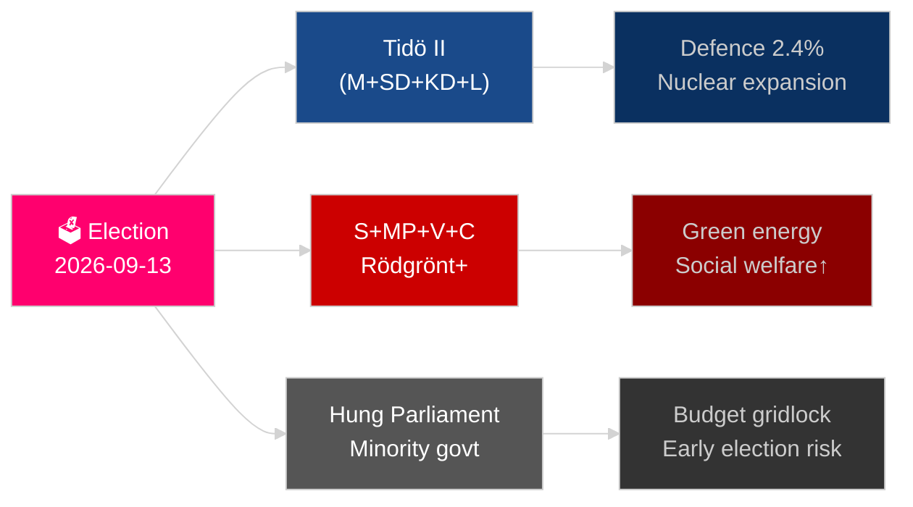

# スウェーデンの1年先：2026年選挙、防衛転換、経済回復

**著者**：James Pether Sörling
**日付**：2026-05-04
**分類**：公開 — GDPR第9条(2)(e)(g)
**分析深度**：包括的（2.0×ティアC）
**信頼度**：HIGH（高）[Admiralty B2]

---

## BLUF

スウェーデンはNATO加盟以来最も重要な年を迎えている。2026年9月13日のリクスダーグ選挙は、ティドー中道右派連立政権が続くか、社会民主党主導の勢力が政権を奪還するかを決定づける。その行方は、ギャング犯罪対策、エネルギー戦略、防衛費の信頼性に懸かっている。2024年の景気後退からの経済回復は進んでいるが不安定であり、IMF WEO 2026年4月版は2026年のGDP成長率を2.1%と予測している[ホライズン:年]——北欧諸国の水準を下回る。総合防衛の再構築、原子力エネルギーの復興、憲法的強靭性に関する法整備という三つの構造的メガトレンドは、選挙結果を問わずいかなる後継政権も縛るものとなる。

## この報告が支援する意思決定

1. **選挙シナリオ計画**：2026年9月以降に実現可能な連立構成はどれか、それぞれのシナリオで立法課題はどう変わるか？
2. **防衛整備の追跡**：スウェーデンの総合防衛整備（MSB → Myndigheten för civilt försvar）はGDP比2%超という2030年目標に向けて軌道に乗っているか？
3. **エネルギー転換リスク**：ウラン採掘に関する立法と風力発電税制改革は、核エネルギーを軸とした一貫したエネルギー戦略を示しているか、それとも短期的な財政上の応急措置か？
4. **法の支配の軌跡**：刑事法制の波（ギャング犯罪、警察権限、電子的監視、営業秘密）は政権移行を経ても持続可能か？
5. **憲法的安定性**：HC03155（stärkt konstitutionell beredskap）は民主的後退のリスクを生じさせることなく、十分な緊急権限を設けているか？

## 60秒インテリジェンス要約

- **選挙**：SDが引き続きキングメーカー；VとMPがVänsterbloketの少数派拒否権を維持；CとLは存亡に関わる得票率リスクに直面。連立の算数は両陣営を175議席の均衡付近に固定している。**評決：予測困難なほど接戦** [ホライズン:選挙]。
- **防衛**：HC03205（MSBをMyndigheten för civilt försvarに改称）＋HC03193（försvarsindustristrategi）が民軍統合の加速を示す。スウェーデンは2028年までにGDP比2.4%の防衛費を公約（NATOの目標）。
- **経済**：回復が加速。IMF WEO 2026年4月：SWE成長率2.1%（T+1）、インフレは~2.5%に向けて低下。家計債務リスクは依然高水準；不動産市場の回復は不均一。
- **エネルギー**：HC03203（ウラン採掘禁止解除）＋HC03168（風力発電固定資産税引き上げ）＝選挙前の意図的な原子力推進シグナル。緑の有権者層には政治的リスク。
- **治安**：HC03186（警察の銃器）、HC03189（oskuldskontroller kriminaliserat）、HC03208（営業秘密）が10年間で最も精力的な立法スプリントを継続。

## 主要な将来トリガー

**選挙結果 T−132日**：SDが22%超またはSが30%未満を示す世論調査が出れば、根本的な連立再計算と予算シグナルが動き出す。2026年9月のSVT/Ipsos最終選挙前世論調査とマルメー、イェーテボリ、ストックホルム郊外の選挙区別結果に注目。

## 信頼度ラベル

構造的トレンド（防衛、法制改革）については信頼度HIGH；選挙結果と連立構成についてはMEDIUM [Admiralty B2 / WEP：probable（公算大）]。

<!-- source-sha: b5d10858f4d82b9b502512cd3ecbf7e174e813ae -->
