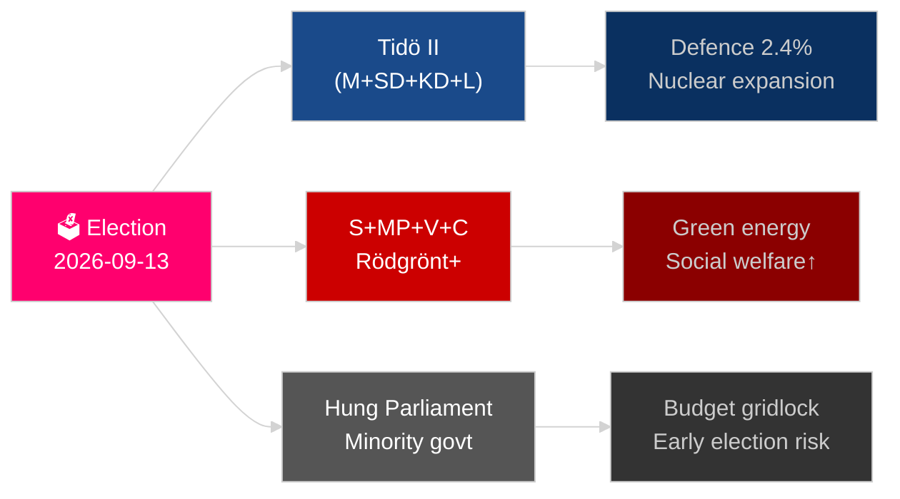

# 스웨덴의 앞으로의 1년: 2026년 선거, 방위 전환, 경제 회복

**저자**: James Pether Sörling
**날짜**: 2026-05-04
**분류**: 공개 — GDPR 제9조 제2항 (e)(g)
**분석 심도**: 포괄적 (2.0× 티어-C)
**신뢰도**: 높음 [Admiralty B2]

---

## 핵심 요약

스웨덴은 NATO 가입 이후 가장 중요한 한 해를 맞이하고 있다. 2026년 9월 13일 실시되는 릭스다그 선거는 티도(Tidö) 중도우파 연립 정권이 지속될 것인지, 사회민주당이 이끄는 블록이 권력을 탈환할 것인지를 결정지을 것이며, 결과는 갱 범죄 정책, 에너지 전략 및 국방비 신뢰성에 달려 있다. 2024년 경기침체에서의 경제 회복은 진행 중이나 취약한 상태이다 — IMF WEO 2026년 4월판은 2026년 GDP 성장률을 2.1%로 예측하고 있으며[지평:년], 이는 북유럽 국가들의 평균을 하회한다. 세 가지 구조적 메가트렌드 — 총합 방위 재건, 원자력 에너지 부흥, 헌법적 회복력 입법 — 이 선거 결과와 무관하게 모든 후임 정부를 구속하게 될 것이다.

## 이 보고서가 지원하는 의사결정

1. **선거 시나리오 계획**: 2026년 9월 이후 실행 가능한 연립 구성은 무엇이며, 각 시나리오에서 어떤 입법 의제 변화가 따르는가?
2. **방위 구축 추적**: 스웨덴의 총합 방위 구축(MSB → Myndigheten för civilt försvar)은 2030년 GDP 대비 2% 초과 목표를 향해 제 궤도에 있는가?
3. **에너지 전환 리스크**: 우라늄 채굴 입법과 풍력 발전 세제 개혁은 일관된 원자력 기반 에너지 전략을 나타내는가, 아니면 단기 재정적 임시방편인가?
4. **법치주의 궤적**: 형사 법제의 물결(갱 범죄, 경찰 권한, 전자 감시, 영업비밀)이 정부 교체에 걸쳐 지속 가능한가?
5. **헌법적 안정성**: HC03155(stärkt konstitutionell beredskap)는 민주적 후퇴 위험 없이 적절한 비상 권한을 창설하는가?

## 60초 인텔리전스 요약

- **선거**: SD가 계속 캐스팅보트; V + MP가 Vänsterbloket의 소수 거부권을 유지; C와 L은 존재론적 문턱 위험에 직면. 연립 산술이 양 블록을 175 의석 균형 근처에 고정하고 있다. **판단: 예측하기엔 너무 박빙** [지평:선거].
- **방위**: HC03205(MSB를 Myndigheten för civilt försvar로 개명) + HC03193(försvarsindustristrategi)는 가속화된 민군 통합을 시사. 스웨덴은 2028년까지 GDP 대비 2.4% 방위비 공약(NATO 목표).
- **경제**: 회복 가속화. IMF WEO 2026년 4월: SWE 성장률 2.1% T+1, 인플레이션은 ~2.5%를 향해 하락. 가계 부채 리스크는 여전히 높음; 부동산 시장 회복은 불균일.
- **에너지**: HC03203(우라늄 채굴 금지 해제) + HC03168(풍력 발전 재산세 인상) = 선거 전 의도적인 원자력 옹호 시그널. 녹색 유권자층에게 정치적 위험 요소.
- **공공질서**: HC03186(경찰 화기), HC03189(oskuldskontroller kriminaliserat), HC03208(영업비밀)이 10년간 가장 강력한 입법 스프린트를 지속.

## 주요 미래 촉발 요인

**선거 결과 T−132일**: SD가 22% 초과 또는 S가 30% 미만을 보이는 여론 조사는 근본적인 연립 재계산 및 예산 신호를 촉발시킬 것이다. 2026년 9월 SVT/Ipsos 최종 사전 선거 여론 조사와 말뫼, 예테보리 및 스톡홀름 교외의 지역별 결과를 주시하라.

## 신뢰도 레이블

구조적 트렌드(방위, 법 개혁)에 대해 높은 신뢰도; 선거 결과 및 연립 구성에 대해 중간 신뢰도 [Admiralty B2 / WEP: 공산 높음].

<!-- source-sha: b5d10858f4d82b9b502512cd3ecbf7e174e813ae -->
