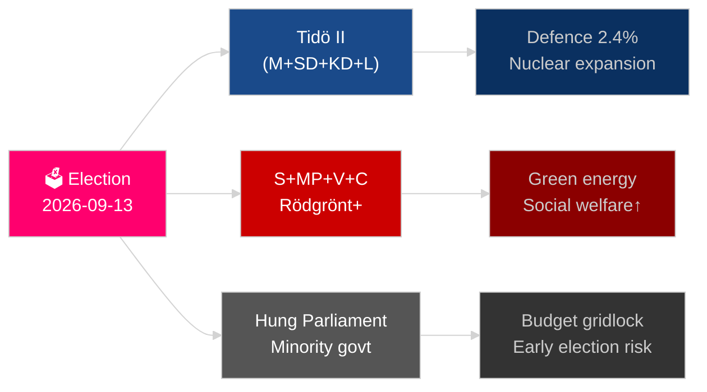

# Zweden's komende jaar: verkiezingen 2026, defensiepivot en economisch herstel

**Auteur**: James Pether Sörling
**Datum**: 2026-05-04
**Classificatie**: OPENBAAR — AVG Art. 9 lid 2 onder e/g
**Analysediepte**: uitgebreid (2,0× Niveau-C)
**Betrouwbaarheid**: HOOG [Admiralty B2]

---

## BLUF

Zweden staat voor zijn meest bepalende jaar sinds de NAVO-toetreding: de Riksdag-verkiezingen op 13 september 2026 zullen bepalen of de Tidö-centrum-rechtscoalitie aanblijft of dat een door sociaaldemocraten geleid blok terugkeert aan de macht, waarbij het resultaat draait om bendecrimi­naliteitsbeleid, energiestrategie en de geloofwaardigheid van defensie-uitgaven. Het economisch herstel na de recessie van 2024 is op gang maar fragiel — IMF WEO apr-2026 projecteert 2,1 % bbp-groei voor 2026 [horizon:jaar], onder Scandinavische vergelijkingslanden. Drie structurele megatrends — reconstructie van de totale defensie, kernenergieherviving en constitutionele veerkrachtswetgeving — zullen elke opvolgende regering binden ongeacht de verkiezingsuitslag.

## Beslissingen die dit briefing ondersteunt

1. **Verkiezingsscenarioplanning**: Welke coalitieconfiguraties zijn levensvatbaar na september 2026, en welke legislatieve agendawijziging volgt elk scenario?
2. **Monitoring van de defensieopbouw**: Ligt Zwedens totale defensieopbouw (MSB → Myndigheten för civilt försvar) op koers om de 2030-doelstelling van meer dan 2 % van het bbp te halen?
3. **Risico van energietransitie**: Signaleert de wetgeving over uraniumwinning en de windenergie­belasting­hervorming een coherente kernenergie-verankerde energiestrategie of een korte­termijn fiscale pleister?
4. **Trajectoire van de rechtsstaat**: Is de golf van strafwet­geving (bendecrimi­naliteit, politiebevoegd­heden, elektronisch toezicht, bedrijfsgeheimen) houdbaar over een regeringswissel heen?
5. **Constitutionele stabiliteit**: Schept HC03155 (stärkt konstitutionell beredskap) toereikende noodbevoegdheden zonder risico op democratische terugval te creëren?

## 60-seconden inlichtingenoverzicht

- **Verkiezingen**: SD blijft spil; V + MP houden het minderheidsveto van het Vänsterblocket; C en L staan voor existentieel drempelrisico. De coalitie­aritme­tiek vergrendelt beide blokken dicht bij de 175-zetel pariteit. **Oordeel: te nipt om te voorspellen** [horizon:verkiezing].
- **Defensie**: HC03205 (MSB hernoemd tot Myndigheten för civilt försvar) + HC03193 (försvarsindustristrategi) signaleert versnelde civiel-militaire integratie. Zweden heeft zich verbonden aan 2,4 % van het bbp voor defensie tot 2028 (NAVO-doel­stelling).
- **Economie**: Het herstel versnelt. IMF WEO apr-2026: SWE-groei 2,1 % T+1, inflatie daalt naar ~2,5 %. Het schuldenrisico van huishoudens blijft verhoogd; het herstel van de woningmarkt is ongelijkmatig.
- **Energie**: HC03203 (verbod op uraniumwinning opgeheven) + HC03168 (wind­energie­onroerend­goedbelasting verhoogd) = bewuste pro-nucleaire signalering voor de verkiezingen. Politiek riskant bij groene kiezers­segmenten.
- **Openbare orde**: HC03186 (politievuurwapens), HC03189 (oskuldskontroller kriminaliserat), HC03208 (bedrijfsgeheimen) zet de intensste wetgevingssprint van het decennium voort.

## Voornaamste toekomstige trigger

**Verkiezingsuitslag T−132 dagen**: Peilingen die SD boven 22 % of S onder 30 % tonen, zullen een fundamentele coalitieherberekening en begrotingssignalering uitlokken. Houd de laatste pre-verkiezings­peilingen van SVT/Ipsos van september 2026 en districtsresultaten in Malmö, Göteborg en de Stockholmse voorsteden in de gaten.

## Betrouwbaarheids­label

HOGE betrouwbaarheid voor structurele trends (defensie, rechtshervoming); MEDIUM voor verkiezingsuitslag en coalitiesamenstelling [Admiralty B2 / WEP: waarschijnlijk].

<!-- source-sha: b5d10858f4d82b9b502512cd3ecbf7e174e813ae -->
