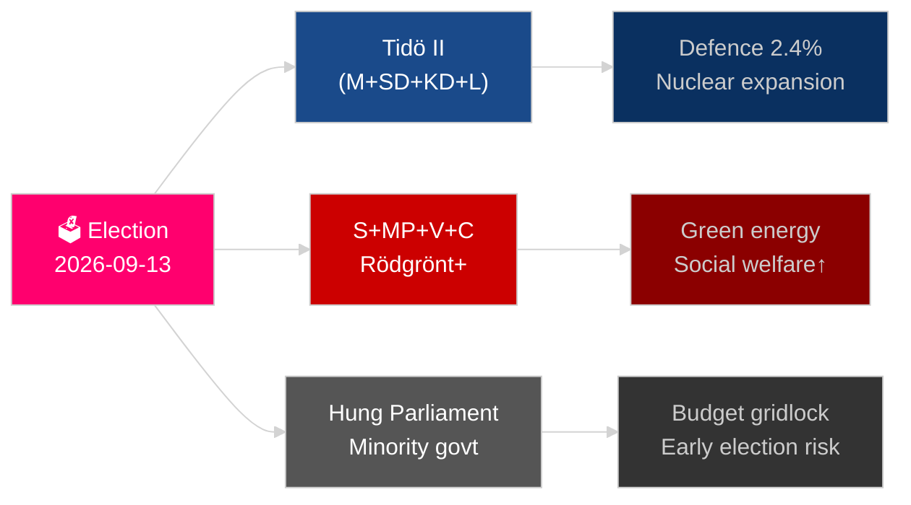

# Sveriges år fremover: Valget 2026, forsvarspivot og økonomisk gjenoppretting

**Forfatter**: James Pether Sörling
**Dato**: 2026-05-04
**Klassifisering**: OFFENTLIG — GDPR Art 9(2)(e)(g)
**Analysedybde**: omfattende (2,0× Nivå-C)
**Konfidens**: HØY [Admiralty B2]

---

## BLUF

Sverige står overfor sitt mest avgjørende år siden NATO-inntreden: Riksdagsvalget 13. september 2026 vil avgjøre om Tidö-sentrum-høyre-koalisjonen fortsetter eller om et Sosialdemokratisk ledet blokk returnerer til makten, med utfallet som dreier seg om gjengkriminalitetspolitikk, energistrategi og troverdigheten i forsvarsutgifter. Den økonomiske gjenopprettingen fra resesjonen i 2024 er underveis men skjør — IMF WEO apr-2026 projiserer 2,1 % BNP-vekst for 2026 [horisont:år], under nordiske jevnaldrende. Tre strukturelle megatrender — rekonstruksjon av totalforsvar, atomenergirevival og konstitusjonell motstandsdyktighetslovgivning — vil binde enhver etterfølgende regjering uavhengig av valgresultat.

## Beslutninger dette brifet støtter

1. **Valgscenarieplanlegging**: Hvilke koalisjonsoppsett er levedyktige etter september 2026, og hvilken lovgivningsagendaendring følger hvert scenario?
2. **Sporing av forsvarsoppbygging**: Er Sveriges totalforsvarsoppbygging (MSB → Myndigheten för civilt försvar) på rett spor for å nå 2030-målet på over 2 % av BNP?
3. **Energiomstillingsrisiko**: Signaliserer lovgivning om urangruvedrift og vindkraftsskatteendring en sammenhengende atomenergiforankret energistrategi eller et kortsiktig finanspolitisk plaster?
4. **Rettsstatens retning**: Er bølgen av strafferettslovgivning (gjengkriminalitet, politimyndigheter, elektronisk overvåking, forretningshemmeligheter) bærekraftig over en regjeringsveksling?
5. **Konstitusjonell stabilitet**: Skaper HC03155 (stärkt konstitutionell beredskap) tilstrekkelige nødfullmakter uten å skape risiko for demokratisk tilbakegang?

## 60-sekunders etterretningslesning

- **Valg**: SD forblir tungen på vektskålen; V + MP holder Vänsterblokets minoritetsveto; C og L møter eksistensiell terskeltrussel. Koalisjonsaritmetikken låser begge blokker nær 175-mandatparitet. **Konklusjon: for jevnt til å forutsi** [horisont:valg].
- **Forsvar**: HC03205 (MSB omdøpt til Myndigheten för civilt försvar) + HC03193 (försvarsindustristrategi) signaliserer akselerert sivil-militær integrasjon. Sverige forpliktet seg til 2,4 % av BNP på forsvar innen 2028 (NATO-mål).
- **Økonomi**: Gjenopprettingen akselererer. IMF WEO apr-2026: SWE vekst 2,1 % T+1, inflasjonen synker mot ~2,5 %. Husholdningenes gjeldsrisiko forblir forhøyet; eiendomsmarkedets gjenoppretting ujevn.
- **Energi**: HC03203 (forbud mot urangruvedrift opphevet) + HC03168 (vindkraftseiendomsskatt økt) = bevisst atomenergi-signalisering før valget. Politisk risikabelt med grønne velgersegmenter.
- **Offentlig orden**: HC03186 (politiets skytevåpen), HC03189 (oskuldskontroller kriminaliserat), HC03208 (forretningshemmeligheter) fortsetter tiårets hardeste lovgivningssprint.

## Ledende fremtidig trigger

**Valgresultat T−132 dager**: Meningsmålinger som viser SD over 22 % eller S under 30 % vil utløse en fundamental koalisjonsomregning og budgetsignalisering. Overvåk SVT/Ipsos' endelige forhåndsvalgsundersøkelser september 2026 og distriktsresultater i Malmö, Göteborg og Stockholmsforsteder.

## Konfidensmerke

HØY konfidens på strukturelle trender (forsvar, rettighetsreform); MEDIUM på valgresultat og koalisjonssammensetning [Admiralty B2 / WEP: sannsynlig].

<!-- source-sha: b5d10858f4d82b9b502512cd3ecbf7e174e813ae -->
