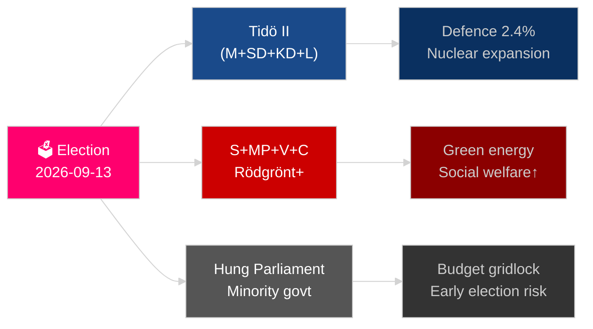

# Sveriges år framåt: Valet 2026, försvarspivot och ekonomisk återhämtning

**Författare**: James Pether Sörling
**Datum**: 2026-05-04
**Klassificering**: OFFENTLIG — GDPR Art 9(2)(e)(g)
**Analysdjup**: omfattande (2,0× Nivå-C)
**Konfidens**: HÖG [Admiralty B2]

---

## BLUF

Sverige möter sitt mest avgörande år sedan NATO-inträdet: Riksdagsvalet den 13 september 2026 kommer att avgöra om Tidö-koalitionens centerHögerregering fortsätter eller om ett Socialdemokratiskt ledat block återtar makten, där utfallet pivoterar kring gängkriminalitetspolitik, energistrategi och trovärdigheten i försvarsutgifterna. Den ekonomiska återhämtningen från 2024 års recession är igång men bräcklig — IMF WEO apr-2026 projicerar 2,1 % BNP-tillväxt för 2026 [horisont:år], under nordiska jämförbara länder. Tre strukturella megatrender — rekonstruktion av totalförsvaret, kärnenergirevival och konstitutionell resilienslag­stiftning — kommer att binda varje efterträdande regering oavsett valutfall.

## Beslut som detta underlag stödjer

1. **Elektoral scenarioplanering**: Vilka koalitionskonfigurationer är möjliga efter september 2026 och vilka lagstiftningsändringar följer av respektive scenario?
2. **Spårning av försvarsuppbyggnad**: Är Sveriges totalförsvarsuppbyggnad (MSB → Myndigheten för civilt försvar) på rätt spår för att nå 2030 års mål om mer än 2 % av BNP?
3. **Energiomställningsrisk**: Signalerar lagstiftningen om uranbrytning och vindkraftsskatteförändringen en sammanhängande kärnkraftsförankrad energistrategi eller ett kortsiktigt finanspolitiskt plåster?
4. **Rättsstatens riktning**: Är den våg av straffrättslagstiftning (gängkriminalitet, polisbefogenheter, elektronisk övervakning, företagshemligheter) hållbar över en regeringsövergång?
5. **Konstitutionell stabilitet**: Skapar HC03155 (stärkt konstitutionell beredskap) tillräckliga krisbe­fogenheter utan att riskera demokratisk tillbakagång?

## 60 sekunders underrättelseavläsning

- **Val**: SD förblir vågmästare; V + MP håller Vänsterblokets minoritetsveto; C och L möter existentiell tröskelrisk. Koalitionsaritmetiken låser bägge block nära 175-mandatjämvikt. **Utlåtande: för jämnt för att förutspå** [horisont:val].
- **Försvar**: HC03205 (MSB ombenämnt till Myndigheten för civilt försvar) + HC03193 (försvarsindustristrategi) signalerar accelererad civil-militär integration. Sverige har åtagit sig 2,4 % av BNP på försvar till 2028 (NATO-mål).
- **Ekonomi**: Återhämtningen accelererar. IMF WEO apr-2026: SWE-tillväxt 2,1 % T+1, inflationen sjunker mot ~2,5 %. Hushållens skuldrisk kvarstår förhöjd; fastighetsmarknadens återhämtning ojämn.
- **Energi**: HC03203 (förbud mot uranbrytning hävt) + HC03168 (vindkraftsfastighetsskatt höjd) = avsiktlig kärnkraftssignalering inför valet. Politiskt riskabelt med gröna väljarsegment.
- **Allmän ordning**: HC03186 (polisens skjutvapen), HC03189 (oskuldskontroller kriminaliserat), HC03208 (företagshemligheter) fortsätter decenniets hårdaste lagstiftningssprint.

## Ledande framtida trigger

**Valutfall T−132 dagar**: Opinionsundersökningar som visar att SD är över 22 % eller S under 30 % kommer att utlösa en fundamental koalitionsomräkning och budgetsignalering. Bevaka SVT/Ipsos slutliga pre-valundersökningar september 2026 och distriktsresultat i Malmö, Göteborg och Stockholmsförorter.

## Konfidensetikett

HÖG konfidens på strukturella trender (försvar, rättsreform); MEDIUM på valutfall och koalitionssammansättning [Admiralty B2 / WEP: troligt].

<!-- source-sha: b5d10858f4d82b9b502512cd3ecbf7e174e813ae -->
