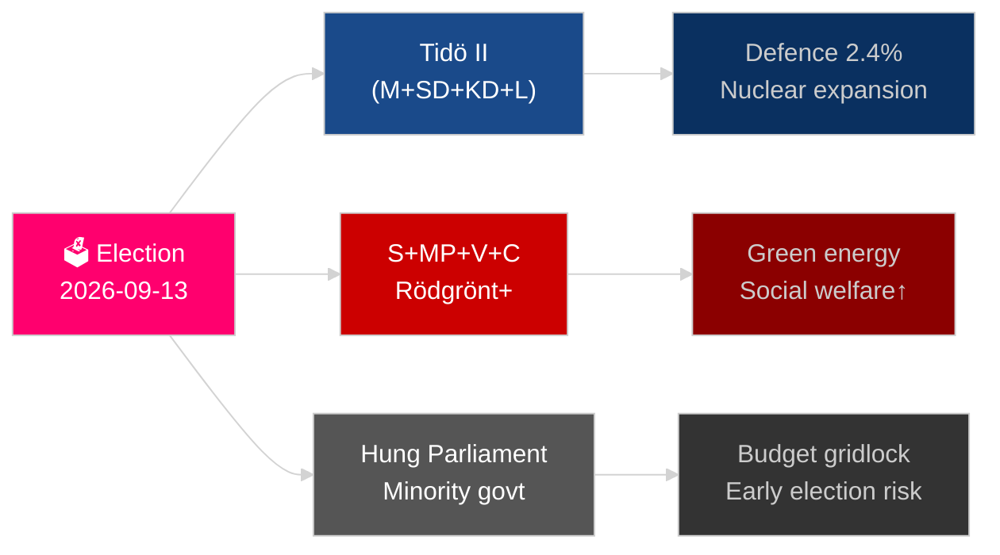

# 瑞典的下一年：2026年选举、国防转向与经济复苏

**作者**：James Pether Sörling
**日期**：2026-05-04
**分类**：公开 — GDPR第9条第2款(e)(g)
**分析深度**：全面（2.0× C级）
**置信度**：高 [Admiralty B2]

---

## 核心摘要

瑞典正面临自加入北约以来最具决定性的一年：2026年9月13日的里克斯达格选举将决定提多（Tidö）中间偏右联合政府是否延续，还是由社会民主党领导的政治集团重返执政，结果将取决于帮派犯罪政策、能源战略以及国防支出公信力。2024年经济衰退后的复苏正在进行中，但仍脆弱——国际货币基金组织WEO 2026年4月版预测2026年GDP增速为2.1%[展望:年]，低于北欧国家平均水平。三大结构性超级趋势——全面防卫重建、核能复兴与宪法韧性立法——将束缚任何继任政府，无论选举结果如何。

## 本简报支持的决策

1. **选举情景规划**：2026年9月后哪些联合政府配置可行？各情景下立法议程将如何调整？
2. **国防建设追踪**：瑞典总体国防建设（MSB → Myndigheten för civilt försvar）是否有望实现2030年国防支出超过GDP 2%的目标？
3. **能源转型风险**：铀矿开采立法与风电税制改革是否预示着以核能为支柱的连贯能源战略，还是短期财政应急措施？
4. **法治走向**：刑事立法浪潮（帮派犯罪、警察权力、电子监控、商业秘密）能否在政府更迭后维持？
5. **宪法稳定性**：HC03155（stärkt konstitutionell beredskap）是否在不引发民主倒退风险的前提下创设了充分的紧急权力？

## 60秒情报摘要

- **选举**：SD仍是关键造王者；V + MP持有Vänsterbloket的少数否决权；C和L面临生死攸关的选票门槛风险。联合算术将两个政治集团锁定在175席均势附近。**结论：势均力敌，难以预测** [展望:选举]。
- **国防**：HC03205（MSB更名为Myndigheten för civilt försvar）+ HC03193（försvarsindustristrategi）标志着军民融合加速。瑞典承诺到2028年将国防支出提升至GDP的2.4%（北约目标）。
- **经济**：复苏加速。国际货币基金组织WEO 2026年4月：SWE经济增速T+1为2.1%，通胀降至约2.5%。家庭债务风险仍然偏高；房地产市场复苏参差不齐。
- **能源**：HC03203（铀矿开采禁令解除）+ HC03168（风电不动产税上调）= 选前有意释放核能支持信号。对绿色选民群体而言存在政治风险。
- **公共秩序**：HC03186（警察枪械）、HC03189（oskuldskontroller kriminaliserat）、HC03208（商业秘密）延续了十年来最密集的立法冲刺。

## 关键前瞻触发因素

**选举结果 T−132天**：若民调显示SD超过22%或S低于30%，将引发联合政府格局根本性重算和预算信号传导。关注2026年9月SVT/Ipsos最终选前民调，以及马尔默、哥德堡和斯德哥尔摩郊区的分区计票结果。

## 置信度标签

结构性趋势（国防、法律改革）置信度高；选举结果与联合政府构成置信度中等 [Admiralty B2 / WEP：可能]。

<!-- source-sha: b5d10858f4d82b9b502512cd3ecbf7e174e813ae -->
