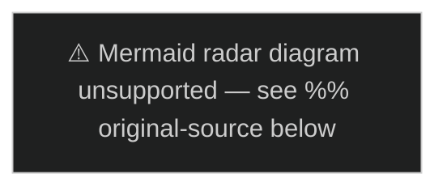

# PESTLE Analysis — Sweden Year Ahead 2026-05-04

**Framework**: PESTLE × 6 dimensions | **Gate**: LH-4 blocking (year-ahead) | **≥4 dimension tables required**

---

## Political Dimension

| Factor | Assessment | Impact | Horizon |
|---|---|---|---|
| Election 2026-09-13 | The defining political event; government change possible | Critical | [horizon:election] |
| Coalition fragility (L at 3.8%) | Tidö majority margin of 1 seat; any L polling drop triggers realignment | High | [horizon:election] |
| HC03155 constitutional beredskap | Emergency powers framework pending Lagrådet — legitimacy risk | High | [horizon:year] |
| SD governance record | First time SD in government; traditional insurgent party faces accountability test | High | [horizon:election] |
| C (Centerpartiet) swing position | Decisive for both coalition formation scenarios | Critical | [horizon:election] |
| Cross-party defence consensus | NATO 2.4% GDP target supported across M+S+KD+C | Medium | [horizon:year] |
| EU Council Presidency | Sweden held EU Presidency 2023; no current EU chairmanship burden | Low | [horizon:year] |

## Economic Dimension

| Factor | Assessment | Impact | Horizon |
|---|---|---|---|
| GDP growth 2.1% T+1 (2026) | Below Nordic peer average (DK 2.4%, NO 2.5%) | Medium | [horizon:year] |
| Riksbank rate normalisation | Rate at ~2.25%; cuts expected to continue to 2.0% by year-end | Medium | [horizon:year] |
| Household debt 170% of income | Elevated debt limits consumer demand recovery post-rate shock | Medium-High | [horizon:year] |
| Public sector fiscal balance | Gross debt <38% GDP — fiscal headroom for stimulus | Medium | [horizon:year] |
| Defence budget ramp-up | 50 BSEK gap to 2.4% GDP target (2028) — fiscal pressure | High | [horizon:year] |
| Energy price trajectory | Lower European gas prices reduce industrial cost pressure | Medium | [horizon:year] |
| Industriavtalet outcome | Collective bargaining: real wage growth vs inflation balance | High | [horizon:quarter] |

## Social Dimension

| Factor | Assessment | Impact | Horizon |
|---|---|---|---|
| Gang violence plateau | 22% reduction 2025 vs 2024; remains highest in Nordic region per capita | High | [horizon:year] |
| Housing affordability | 200,000-unit deficit; young voter concern; HC03192 insufficient | High | [horizon:election] |
| Healthcare waiting times | #1 voter concern (Ipsos 2026Q1); municipal budget pressure | High | [horizon:election] |
| Immigration and integration | Net migration declining; integration outcomes variable; SD leverage | Medium-High | [horizon:election] |
| Demographic ageing | Pension system adequacy; elder care staffing | Medium | [horizon:year] |
| Educational quality | PISA results showing improvement trajectory; teacher shortage | Medium | [horizon:year] |

## Technological Dimension

| Factor | Assessment | Impact | Horizon |
|---|---|---|---|
| AI and automation | Swedish tech sector growing; AI adoption in manufacturing accelerating | Medium | [horizon:year] |
| Nuclear SMR pipeline | HC03203 enables uranium supply; SMR technology (Vattenfall interest) | High | [horizon:year] |
| Cybersecurity | Säpo/FRA cyber threats increasing; NIS2 implementation 2024 | High | [horizon:year] |
| Digital public services | Swedish e-government infrastructure robust; minor security gaps | Low | [horizon:year] |
| Defence technology (HC03193) | Gripen/SAAB R&D; AI-enabled C4ISR investment | High | [horizon:year] |
| 5G infrastructure | Ericsson market position; China supply chain exclusion maintained | Medium | [horizon:year] |

## Legal Dimension

| Factor | Assessment | Impact | Horizon |
|---|---|---|---|
| HC03155 Lagrådet review | Constitutional emergency powers review pending | Critical | [horizon:quarter] |
| HC03203 HFD challenge | Uranium mining legal challenge expected Q2-2026 | High | [horizon:quarter] |
| EMFA (HC03197) compliance | EU Media Freedom Act implementation deadline Q4-2026 | Medium | [horizon:year] |
| NIS2 Directive implementation | Cybersecurity framework in force 2024; compliance verification | Medium | [horizon:year] |
| EU AI Act compliance | Swedish public sector AI governance requirements 2025–2026 | Medium | [horizon:year] |
| Criminal law expansion | 18+ penal law bills — cumulative constitutional rights pressure (ECHR Art 5/6) | Medium-High | [horizon:year] |
| Euratom notification | HC03203 triggers Art 41 Euratom Treaty notification | High | [horizon:quarter] |

## Environmental Dimension

| Factor | Assessment | Impact | Horizon |
|---|---|---|---|
| HC03203 uranium mining — Laponia adjacent | Environmental NGO mobilisation; EU Taxonomy concerns | High | [horizon:year] |
| HC03168 wind-power tax increase | Contradicts green investment signal; chills wind project pipeline | Medium-High | [horizon:year] |
| Carbon neutrality 2045 target | Sweden committed; energy mix needs nuclear + renewables | High | [horizon:year] |
| Biodiversity and Natura 2000 | Mining expansion near protected areas requires Natura 2000 assessment | Medium | [horizon:year] |
| Nordic climate cooperation | Sweden active in Nordic climate council; good international positioning | Low | [horizon:year] |
| Baltic Sea pollution | Ongoing challenge; Sweden's phosphorus reduction commitments | Low | [horizon:year] |

---

## PESTLE Summary Assessment

**Critical dimensions**: Political (election) + Legal (HC03155/HC03203) + Economic (growth below peers)
**Opportunity dimensions**: Technological (nuclear/defence tech) + Social (partial crime reduction)
**Watch dimensions**: Environmental (HC03203/HC03168 tension) + Economic (household debt risk)

