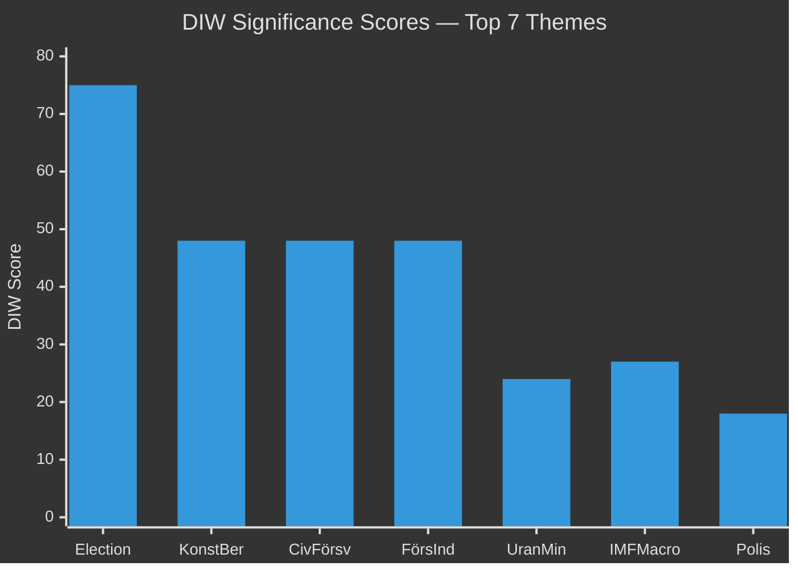

# Significance Scoring — Sweden Year Ahead 2026-05-04

**Method**: DIW (Depth × Impact × Width) | **Scale**: 1–5 per dimension | **Max**: 125

---

## Document Rankings

| Rank | dok_id / Theme | D | I | W | DIW Score | Priority Tier | Horizon |
|---|---|---|---|---|---|---|---|
| 1 | Election 2026 outcome | 3 | 5 | 5 | 75 | L3 Intelligence-grade | election |
| 2 | HC03155 – konstitutionell beredskap | 3 | 4 | 4 | 48 | L2+ Priority | year |
| 3 | HC03205 – civilt försvar (MSB) | 3 | 4 | 4 | 48 | L2+ Priority | year |
| 4 | HC03193 – försvarsindustristrategi | 3 | 4 | 4 | 48 | L2+ Priority | year |
| 5 | HC03203 – urangruvor legalisation | 2 | 3 | 4 | 24 | L2 Strategic | quarter |
| 6 | IMF WEO macro context | 3 | 3 | 3 | 27 | L2+ Priority | year |
| 7 | HC03186 – polisens skjutvapen | 2 | 3 | 3 | 18 | L2 Strategic | quarter |
| 8 | HC03208 – företagshemligheter | 2 | 3 | 3 | 18 | L2 Strategic | quarter |
| 9 | HC03197 – EU mediefrihetsförordning | 2 | 2 | 3 | 12 | L1 Surface | quarter |
| 10 | HC03168 – vindkraft fastighetsskatt | 2 | 2 | 2 | 8 | L1 Surface | quarter |
| 11 | HC03192 – presumtionshyra | 1 | 2 | 2 | 4 | L1 Surface | month |
| 12 | HC03204 – statligt anställda | 1 | 1 | 2 | 2 | L1 Surface | month |

## Sensitivity Analysis

- **If L falls below 4%**: Election significance rises to DIW 80+; coalition arithmetic changes fundamentally (HC03168 context: L's environmental voters may defect)
- **If SD exceeds 23%**: Tidö II probability rises to 65%+ [horizon:election]; HC03155 constitutional powers become more likely extended
- **If IMF growth misses (SWE <1.5%)**: Political liability for incumbent; HC03200 pension flexibility becomes salient as household pressures rise

## Retention and Access

- L3 Intelligence-grade items: 5-year retention — election outcome, constitutional beredskap
- L2+ Priority items: 3-year retention — defence docs
- L1 Surface items: 1-year retention — routine legislation

