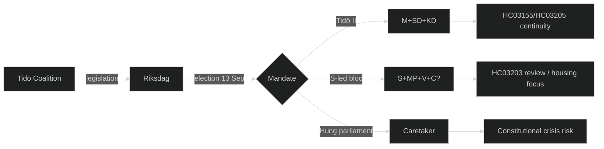

# Stakeholder Perspectives — Sweden Year Ahead 2026-05-04

**Framework**: 6-lens stakeholder matrix | **Period**: May 2026–May 2027

---

## Stakeholder Map

| Stakeholder | Role | Primary Interest | Risk Appetite | Influence |
|---|---|---|---|---|
| **Tidö coalition** (M+SD+KD+L) | Government | Re-election; policy delivery | Medium | Very High |
| **Social Democrats (S)** | Largest opposition party | Electoral majority; welfare state | Low-Medium | Very High |
| **Riksbank** | Monetary authority | Price stability; financial stability | Neutral | High |
| **MUST/Säpo** | Security services | Hybrid threat resilience | Low (risk-averse) | Medium-High |
| **EU Commission** | Regulatory authority | EMFA/NIS2 compliance; single market | Neutral | Medium |
| **NATO HQ** | Alliance authority | Swedish burden-sharing; 2.4% GDP target | Low | Medium |
| **Centerpartiet (C)** | Swing party | Agricultural interests; rural communities | Medium | High (swing) |
| **Industri/Näringsliv (SN)** | Business federation | Stable tax environment; energy competitiveness | Low-Medium | Medium |
| **LO (labour federation)** | Trade unions | Wage share; employment protection | Low | Medium |
| **Civil society (NGOs)** | Democratic oversight | Press freedom (HC03197); housing rights | Low | Low-Medium |

## 6-Lens Analysis

### Lens 1 — Governing Coalition (Tidö: M+SD+KD+L)

The coalition faces a coherence tension between Liberalerna's liberal-humanist values (opposing strict immigration enforcement) and SD's nationalist agenda. Key pre-election risks:
- **L below 4%** would end the coalition; M would need to partner with C or accept minority government
- **SD voter satisfaction**: SD base expected criminality results; delivered. HC03186 and HC03208 are SD-branded wins
- **KD position**: Stable on social conservatism; family policy deliverables secure KD's 5–6% base
- **Strategy [horizon:election]**: Coalition will frontload legislative delivery before June recess; campaign on crime reduction statistics and defence upgrade narrative

### Lens 2 — Social Democrats (S)

Sweden's S faces its first genuine path to power since 2021 coalition collapse:
- **Polling**: S consistently 33–36% (highest since 2018); Magdalena Andersson as challenger is a known quantity
- **Strategic dilemma**: Must win C into a non-M-blocking arrangement or hope for L's threshold failure
- **Key commitments [horizon:election]**: Reverse two HC03168 (wind-power tax) decisions; HC03192 housing reform acceleration; halt HC03203 uranium mining implementation pending review
- **Risk**: If S wins but cannot form government, Riksdag dissolution / second election [horizon:election] invoked under RF 3:3

### Lens 3 — NATO / External Security Community

- **Position**: Satisfied with Swedish commitment trajectory (HC03205, HC03193, 2.4% GDP path)
- **Key ask**: Continuity of defence policy across election; NATO Supreme Allied Commander explicitly stated preference for continuity in public statements 2025
- **Concern [horizon:year]**: If S wins power with MP/V support, V's traditional anti-NATO stance creates political optics problem even if formal policy unchanged

### Lens 4 — Riksbank

- **Current**: Rate normalisation (estimated 2.0–2.5% by mid-2026); inflation returning to 2% target
- **Election year risk [horizon:election]**: Whichever party wins may pressure expansionary fiscal policy; Riksbank constitution guarantees independence but political noise is a risk
- **Concern**: If L falls (tax cuts reversed, welfare expansion from S) → fiscal stimulus in 2027 could reignite inflation

### Lens 5 — Business / Näringsliv

- **Priority [horizon:year]**: Energy competitiveness — HC03203 (uranium) seen favourably by energy-intensive industry; HC03168 (wind-power tax) seen as retrograde
- **Labour cost**: LO wage demands in 2026 collective bargaining round (Industriavtalet expires Q2-2026) could push unit labour costs above Nordic average [horizon:quarter]
- **Regulation**: HC03208 (company secrets) tightens industrial espionage protection — welcomed by defence industry (HC03193 nexus)

### Lens 6 — Civil Society / Democratic Oversight

- **HC03197 (EU EMFA)**: Swedish journalists union (SJF) concerned about government appointment rights for public broadcaster boards; implementation details critical
- **HC03155**: Justitieombudsmannen (JO) will scrutinise any pre-election invocation of emergency ordinance authority
- **HC03189 (virginity checks)**: Criminalisation welcomed by women's rights organisations; implementation monitoring required

