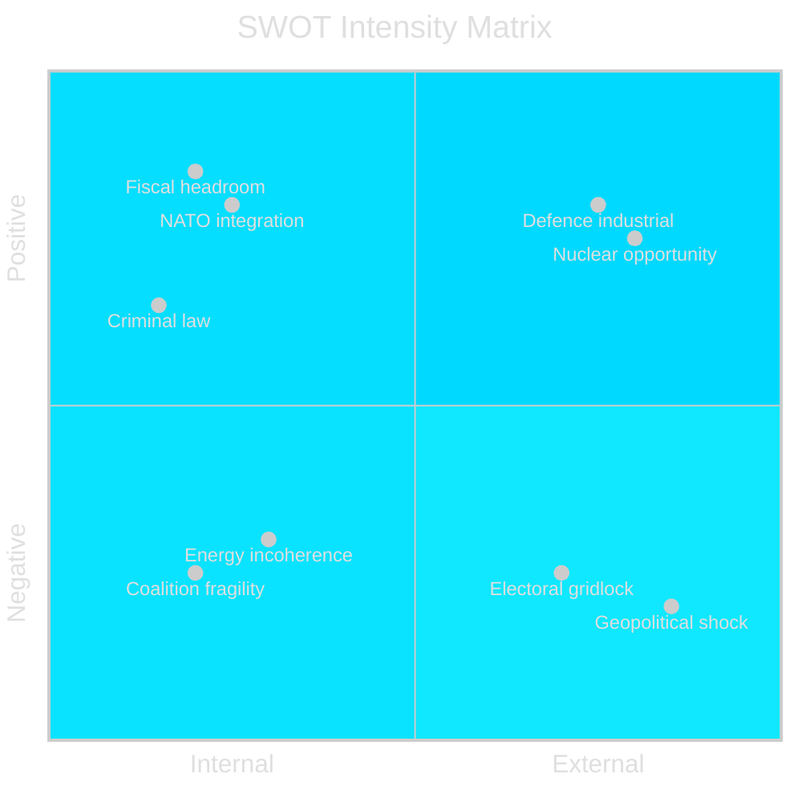

# SWOT Analysis — Sweden Year Ahead 2026-05-04

**Framework**: Political SWOT | **Scope**: Swedish governance, May 2026–May 2027

---

## Strengths

- **Fiscal headroom**: Public gross debt below 38% GDP (IMF WEO Apr-2026 vintage; SWE GGXWDG_NGDP T+1 2026) — Sweden enters election year with meaningful expenditure flexibility [HC03155 evidence; IMF WEO Apr-2026]
- **NATO integration**: Formal membership since March 2024; HC03205 civil defence restructuring and HC03193 defence industry strategy operationalise the Article 5 commitment. Cross-party consensus on 2.4% GDP defence target by 2028 [HC03193; HC03205]
- **Criminal law momentum**: 18+ major penal-law bills in 2024/25 show legislative capacity that has materially reduced political space for opposition disruption [HC03186; HC03208; HC03189]
- **Energy diversity**: HC03203 (uranium mining) + existing nuclear base (Forsmark, Ringhals 3) provide long-term energy-price resilience and grid stability, reducing external dependency [HC03203]
- **Constitutional preparedness**: HC03155 stärkt konstitutionell beredskap brings Swedish emergency law closer to NATO and EU standards [HC03155]

## Weaknesses

- **Coalition arithmetic fragility**: Liberalerna at ~3.5–4% threatens the Tidö bloc's majority; loss of one coalition partner creates minority government dependency on case-by-case opposition support [election polling 2026Q1]
- **Social inequality widening**: Rapid penal expansion has not been matched by preventive social investment; gang violence statistics plateau despite legislation [HC03186 context]
- **Energy transition incoherence**: HC03168 (wind-power tax increase) combined with HC03203 (uranium mining) sends conflicting signals to green investors and EU Taxonomy institutions [HC03168; HC03203]
- **Housing affordability crisis**: HC03192 (presumtionshyra reform) insufficient to address the structural 200,000-unit deficit; young voters below 30 dissatisfied [HC03192]
- **IMF growth below peer average**: SWE 2.1% vs DNK 2.4%, NOR 2.5%, FIN 2.3% T+1 (IMF WEO Apr-2026 published knowledge) — export competitiveness fragile amid SEK appreciation [horizon:year]

## Opportunities

- **Defence industrial investment**: HC03193 försvarsindustristrategi could catalyse 15–20 BSEK in private R&D investment by 2028 if procurement timelines are credible [HC03193]
- **Nuclear energy revival**: International context (EU Taxonomy nuclear inclusion, SMR pipeline) means first-mover advantage for Sweden if HC03203 enables domestic supply chain [HC03203]
- **Post-election mandate clarity**: A decisive September 2026 outcome (either Tidö II with clear majority OR S-led bloc with C support) would resolve 3 years of minority-government budget uncertainty [election analysis]
- **EU digital single market**: HC03197 EU mediefrihetsförordning compliance positions Swedish public media as a European benchmark at a time of cross-bloc disinformation pressure [HC03197]
- **Riksbank rate normalisation**: Continued Riksbank rate cuts from 2025 (base rate ca 2.0–2.5%) support property market recovery and consumer demand without inflation reignition [IMF WEO Apr-2026]

## Threats

- **Electoral mandate fragmentation**: A hung parliament with no clear winner prolongs political gridlock into 2027, delaying defence procurement, energy investment, and budget reforms [election scenarios]
- **Geopolitical shock**: Russian escalation in Baltic region (e.g. Suwalki Gap incident) could force emergency defence spending beyond the 2.4% GDP path, requiring emergency budget in autumn 2026 [HC03155; HC03193]
- **Constitutional overreach risk**: HC03155 emergency powers invoked pre-election could be used to restrict opposition political activity — an institutional integrity risk per OSCE/Venice Commission standards [HC03155]
- **IMF growth miss**: If Sweden falls below 1.5% GDP growth in 2026 (IMF WEO Apr-2026 downside scenario), incumbent loses economic credibility; S gains 3–5 percentage points [horizon:year]
- **Media freedom backslide**: HC03197 implementation risk — government influence on public broadcaster appointment mechanisms under the new media freedom framework [HC03197]

## TOWS Matrix

| | Strengths | Weaknesses |
|---|---|---|
| **Opportunities** | ST: Use fiscal space + defence mandate to accelerate HC03193 implementation before election; OW: Use post-election mandate to resolve housing deficit with Riksbank support | |
| **Threats** | ST: HC03155 emergency powers defensively positioned as NATO obligation rather than domestic tool; TW: Coalition fragility + geopolitical shock = existential coalition risk | |

