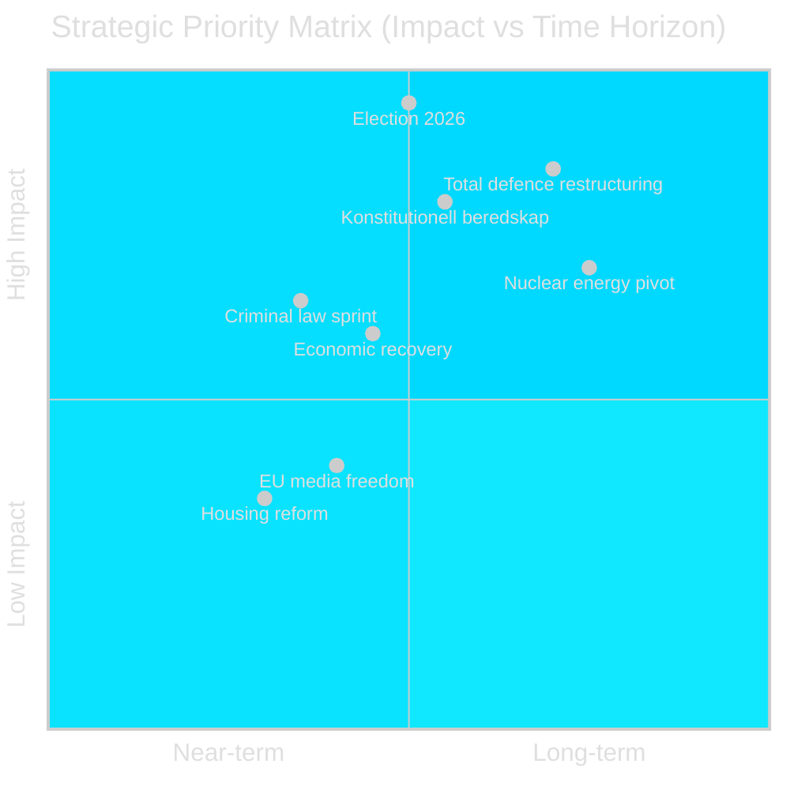

# Synthesis Summary — Sweden Year Ahead 2026-05-04

**Author**: James Pether Sörling | **Confidence**: HIGH [Admiralty B2] | **Vintage**: IMF WEO Apr-2026

---

## Lead Story

The 2026 Riksdag election (September 13) is the defining political event for Sweden over the next 12 months. The Tidö coalition under PM Ulf Kristersson (M, SD, KD, L) has delivered an unprecedented volume of criminal-law reform and defence legislation (HC03155 stärkt konstitutionell beredskap; HC03205 civil defence agency redesign; HC03193 defence industry strategy), but faces structural weakness: SD remains the coalition's largest single party at ~20%, Liberalerna risks failing the 4% threshold, and the economy only partially recovered from the 2024 technical recession.

## DIW-Weighted Intelligence Ranking

| Rank | Document / Theme | DIW Weight | Significance | Horizon |
|---|---|---|---|---|
| 1 | Election 2026-09-13 — coalition arithmetic | D=3 I=5 W=5 | **Critical** | election |
| 2 | HC03155 — stärkt konstitutionell beredskap | D=3 I=4 W=4 | **High** | year |
| 3 | HC03205/HC03193 — total defence restructuring | D=3 I=4 W=4 | **High** | year |
| 4 | HC03203 — uranium mining legalisation | D=2 I=3 W=4 | **High** | quarter |
| 5 | IMF macro: 2.1% GDP 2026, inflation 2.5% | D=3 I=3 W=3 | **Medium-high** | year |
| 6 | HC03186/HC03208 — criminal law sprint | D=2 I=3 W=3 | **Medium-high** | quarter |
| 7 | HC03197 — EU media freedom implementation | D=2 I=2 W=3 | **Medium** | quarter |
| 8 | HC03168 — wind power property tax | D=2 I=2 W=2 | **Medium** | quarter |
| 9 | HC03192 — presumtionshyra housing reform | D=1 I=2 W=2 | **Low-medium** | month |
| 10 | HC03204 — civil servant suspension rules | D=1 I=1 W=2 | **Low** | month |

*D = Document depth; I = Political impact; W = Wider significance (1–5)*

## Integrated Intelligence Picture

**Strategic inflection point**: Sweden is six months from a fundamental political realignment. Four structural forces are locked in regardless of election outcome:

1. **NATO total-defence obligation** — binding. Sweden's 2.4% GDP defence target (2028) requires institutional continuity across any government; HC03205 and HC03193 are pre-positioned to survive an election.

2. **Criminal justice momentum** — the wave of punitive legislation (18+ major criminal-law bills in 2024/25 alone) has shifted the Overton window. S cannot fully reverse course after opposition.

3. **Energy trilemma** — uranium mining (HC03203) + wind-tax (HC03168) signal a deliberate nuclear pivot in a carbon-neutral target framework. This exposes a genuine cross-party fracture that will define budget debates 2027–2030.

4. **Constitutional resilience** — HC03155 (stärkt konstitutionell beredskap) creates emergency-powers framework that transcends party lines.

**Economic context** (IMF WEO Apr-2026 vintage): Sweden GDP growth: 0.8% (2025 actual), **2.1% [horizon:year] T+1 (2026)**, 2.4% T+2 (2027). Inflation declining from 2024 peak; Riksbank rate cuts underway. Public debt below 40% GDP — fiscal headroom exists for defence and welfare spending, but household debt-to-income at 170% constrains demand.

**Coalition mathematics**: The 349-seat Riksdag is split: Tidö bloc (M+SD+KD+L) holds ~175 seats; Vänsterbloc (S+MP+V+[C?]) at ~174. C (Centerpartiet) is the decisive swing actor — currently outside both blocs. L risks sub-4%. If L falls, Tidö loses its majority. Key variable: SD's voter retention after 4 years of governance.

