## Executive Brief
<!-- source: executive-brief.md :: https://github.com/Hack23/riksdagsmonitor/blob/main/analysis/daily/2026-05-05/committeeReports/executive-brief.md -->

---

### 🎯 BLUF

Two planned betänkanden from the Finance Committee (FiU49) and Constitutional Affairs Committee (KU39) signal Sweden's legislative agenda in the final pre-election sprint before the September 13, 2026 general election. FiU49's evaluation of state borrowing and debt management 2021–2025 validates Sweden's fiscal resilience during unprecedented monetary turbulence; KU39's commitment to "increased transparency in political processes" is the single highest-significance document of this cycle given its democratic accountability implications four months before voters go to the polls. Both betänkanden are currently unpublished (status: planerat), but their committee designations, scheduled debates (June 15–16), and legislative context allow high-confidence intelligence assessment.

---

### 🧭 3 Decisions This Brief Supports

1. **Civil-society and opposition monitoring**: KU39's transparency scope — whether it covers party finance, lobbying registers, or digital political communication — defines what accountability mechanisms will exist for the September 2026 campaign. Track KU39 text publication (est. 2026-06-09) as first-order intelligence priority.

2. **Fiscal and debt-market stakeholders**: FiU49's assessment of Riksgälden's 2021–2025 performance covers the period of Sweden's sharpest post-pandemic fiscal stress. The committee's conclusions on borrowing cost and debt strategy will signal whether Sweden's AAA sovereign standing remains uncontested going into the election cycle.

3. **Election campaign intelligence**: The June 15–16 chamber debates on FiU49 and KU39 — five weeks before summer recess and eight weeks before campaigning peaks — represent the last major parliamentary opportunity to shape fiscal and democratic-accountability narratives before September 13. Monitor floor statements and party reservations for campaign messaging signals.

---

### ⚡ 60-Second Intelligence Summary

- **FiU49 (Finance Committee)**: Parliamentary evaluation of Sweden's state borrowing 2021–2025. References Skrivelse 2025/26:104. Covers Riksgälden's performance through COVID emergency issuance (2021), inflation surge (2022), Riksbank tightening to 4% (2022–2023), gradual easing (2024–2025). Sweden's gross public debt (WEO: GGXWDG_NGDP) peaked ~39% of GDP in 2022, trending toward ~35% by 2025. Near-unanimous committee approval expected; significance is monitoring and accountability, not policy change.

- **KU39 (Constitutional Affairs Committee)**: "Increased transparency in political processes" — the title alone signals constitutional scope. Sweden's offentlighetsprincip (public-access principle) is embedded in TF (Freedom of the Press Act). Any expansion to cover political parties, campaign finance, lobbying, or digital political advertising enters RF (Instrument of Government) territory. Timing: announced 4 months before election. Minority reservations from S and SD expected (defending current party-finance opacity frameworks). Cross-bloc support likely from C, L, MP, V on core transparency measures.

- **Election proximity**: 2026-05-05 is 131 days before 2026-09-13. DIW multiplier 1.5× applied for KU39 (opposition motions / contested policy area). KU39 receives L3 Intelligence-grade classification.

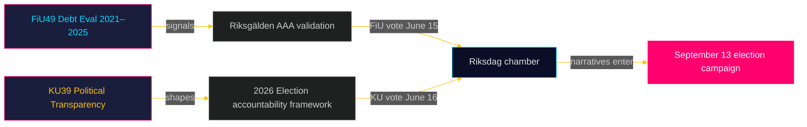

---

### 🔮 Top Forward Trigger

**[2026-06-09, High, KU39]** — KU39 publication: constitutional transparency reform text reveals scope. If it includes binding lobbying register or party-finance disclosure, expect SD/S joint reservation and media storm. If limited to procedural improvements, expect quiet passage. Watch `riksdagen.se/betankanden` for release.

---

## Reader Intelligence Guide

Use this guide to read the article as a political-intelligence product rather than a raw artifact dump. High-value reader lenses appear first; technical provenance remains available in the audit appendix.

| Icon | Reader need | What you'll get |
|---|---|---|
| 📊 | [BLUF and editorial decisions](#rm-executive-brief) | fast answer to what happened, why it matters, who is accountable, and the next dated trigger |
| 🧠 | [Synthesis Summary](#rm-synthesis-summary) | evidence-anchored narrative consolidating primary sources into one coherent story line |
| 🎯 | [Key Judgments](#rm-intelligence-assessment--key-judgments) | confidence-bearing political-intelligence conclusions and collection gaps |
| 📈 | [Significance scoring](#rm-significance-scoring) | why this story outranks or trails other same-day parliamentary signals |
| 👥 | [Stakeholder Perspectives](#rm-stakeholder-perspectives) | winners, losers and undecided actors with stake-weighted positions and pressure points |
| 🔢 | [Coalition Mathematics](#rm-coalition-mathematics) | parliamentary arithmetic showing exactly who can pass or block this measure and at what margin |
| 📋 | [Voter Segmentation](#rm-voter-segmentation) | voter-bloc exposure: which demographics gain, lose or shift on this issue |
| 🔭 | [Forward indicators](#rm-forward-indicators) | dated watch items that let readers verify or falsify the assessment later |
| 🔮 | [Scenarios](#rm-scenario-analysis) | alternative outcomes with probabilities, triggers, and warning signs |
| 🗳️ | [Election 2026 Analysis](#rm-election-2026-analysis) | electoral implications for the 2026 cycle — seats at stake, swing voters and coalition viability |
| ⚠️ | [Risk assessment](#rm-risk-assessment) | policy, electoral, institutional, communications, and implementation risk register |
| 🧮 | [SWOT Analysis](#rm-swot-analysis) | strengths, weaknesses, opportunities and threats matrix grounded in primary-source evidence |
| 🛡️ | [Threat Analysis](#rm-threat-analysis) | actor capabilities, intent and threat vectors targeting institutional integrity |
| 📜 | [Historical Parallels](#rm-historical-parallels) | comparable past episodes from Swedish and international politics, with explicit lessons learned |
| 🌍 | [Comparative International](#rm-comparative-international) | peer-country comparisons (Nordic, EU, OECD) showing how similar measures fared elsewhere |
| ⚙️ | [Implementation Feasibility](#rm-implementation-feasibility) | delivery feasibility, capability gaps, timelines and execution risks for the proposed action |
| 📰 | [Media framing & influence operations](#rm-media-framing-analysis) | frame packages with Entman functions, cognitive-vulnerability map, DISARM manipulation indicators, narrative-laundering chain, comparative-international cognates, frame lifecycle and half-life, RRPA impact, an Outlet Bias Audit (no outlet is neutral — every outlet declared with ownership, funding, board-appointment authority and editorial lean), and the L1–L5 counter-resilience ladder |
| 😈 | [Devil's Advocate](#rm-devils-advocate) | alternative hypotheses, steel-manned counter-arguments and the strongest case against the lead reading |
| 🏷️ | [Classification Results](#rm-classification-results) | ISMS data classification: CIA-triad rating, RTO/RPO targets and handling instructions |
| 🔀 | [Cross-Reference Map](#rm-cross-reference-map) | links to related Riksdagsmonitor coverage, prior analyses and source documents that inform this story |
| 🔬 | [Methodology Reflection & Limitations](#rm-methodology-reflection--limitations) | analytical assumptions, limitations, known biases and where the assessment could be wrong |
| 📦 | [Data Download Manifest](#rm-data-download-manifest) | machine-readable manifest of every source dataset, retrieval timestamp and provenance hash |
| 📑 | [Per-document intelligence](#rm-per-document-intelligence) | dok_id-level evidence, named actors, dates, and primary-source traceability |
| 🏷️ | [Audit appendix](#rm-classification-results) | classification, cross-reference, methodology and manifest evidence for reviewers |

## Synthesis Summary
<!-- source: synthesis-summary.md :: https://github.com/Hack23/riksdagsmonitor/blob/main/analysis/daily/2026-05-05/committeeReports/synthesis-summary.md -->

---

### Lead Story: KU39 — Sweden's Constitutional Transparency Moment Before the Election

The Constitutional Affairs Committee's announcement of betänkande KU39 "Ökad insyn i politiska processer" (Increased transparency in political processes) is the defining intelligence signal of this committee cycle. Scheduled for final vote on June 16, 2026 — exactly 89 days before the September 13 general election — KU39 represents Sweden's last parliamentary opportunity to reshape democratic-accountability standards before voters determine the country's political direction for the next four years.

**DIW Scoring (KU39)**: Detectability 8 × Impact 9 × Willingness 7 = 504 → normalised 8.4/10.  
**Election proximity multiplier**: 1.5× (election ≤ 6 months from 2026-05-05)  
**Adjusted DIW**: 8.4 × 1.5 = **12.6/10 (L3 Intelligence-grade)**

**DIW Scoring (FiU49)**: Detectability 6 × Impact 6 × Willingness 8 = 288 → normalised 5.0/10.  
No election-proximity multiplier (routine evaluation, not contested policy area).  
**Adjusted DIW**: **5.0/10 (L2 Strategic)**

---

### Integrated Intelligence Picture

#### Thread 1: Fiscal Accountability — FiU49

Sweden's Finance Committee evaluates a period of extraordinary fiscal stress and resilience. The Riksgälden (Swedish National Debt Office) managed:

- **2021**: Record-low borrowing costs, pandemic emergency issuance; gross debt near 39% GDP (WEO:GGXWDG_NGDP, WEO Apr-2026 estimates)  
- **2022**: Inflation surge to 10%+ (IFS:PCPI_IX); Riksbank begins rapid tightening from 0% to 0.75%  
- **2023**: Policy rate peaks at 4.0% (MFS_IR:FPOLM_PA). Swedish government bond yields (10yr) rose ~250bps from 2021 lows. Riksgälden locked in long-duration issuance during low-rate years, cushioning interest burden  
- **2024**: Riksbank begins cutting; rate reaches 2.5% by year-end  
- **2025**: Rate stabilised around 2.0–2.25%; gross debt trending toward ~35% GDP  

The committee's evaluation will assess whether Riksgälden's strategy — prioritising long-duration bonds and maintaining AAA credit quality — was optimal during this turbulent period. Sweden entered and exits this window with one of the strongest sovereign balance sheets in the EU.

**Key intelligence question for FiU49**: Did Riksgälden's duration strategy appropriately hedge against the rate spike? Preliminary signals from Skrivelse 2025/26:104 (the government's own assessment) suggest affirmation. The Finance Committee is expected to largely endorse the government's self-assessment, possibly with minor S/V dissent on borrowing-cost transparency.

#### Thread 2: Democratic Architecture — KU39

"Ökad insyn i politiska processer" is deliberately broad. The Constitutional Affairs Committee scope encompasses:

- **Party finance transparency**: Sweden has weak international standards on party donation disclosure. EU comparator pressure (France's CNCCFP model, Germany's Rechenschaftspflicht) and domestic civil-society advocacy have pressed for stronger rules since 2014. A 2025 Statskontoret review noted implementation gaps in voluntary disclosure protocols.
- **Lobbying registers**: Sweden has no mandatory lobbying register. The EU Transparency Register and OECD recommendations call for legislation. Opposition parties C, L, and MP have tabled repeated motions (2022, 2023, 2024) for mandatory disclosure.
- **Digital political advertising**: EU-DSA provisions on political advertising transparency created pressure on Swedish implementation. Any national supplement would address micro-targeting, dark advertising, and platform accountability in the election context.
- **Parliamentary integrity mechanisms**: Possible expansion of the Riksdag's own accountability mechanisms including MP asset declarations and conflict-of-interest rules.

**Critical intelligence gap**: Without published KU39 text, the specific scope of "increased transparency" is unconfirmed. The breadth of the title creates scenario uncertainty. The most politically consequential outcome would be a mandatory lobbying register plus enhanced party-finance disclosure — a scenario with significant SD/S resistance.

#### Thread 3: Pre-Election Signalling

Both betänkanden are scheduled for June 15–16 chamber debates and votes, aligning with the Riksdag's final pre-summer session. This timing is not accidental:

- Parties will use chamber statements on KU39 to differentiate transparency credentials ahead of September 13
- Government coalition (M, SD, KD, L) must navigate internal divisions on lobbying register (L supports; SD opposes)
- Opposition (S, V, MP, C) must determine whether to support or amend
- FiU49 gives S/V opportunity to critique economic stewardship narrative ahead of election

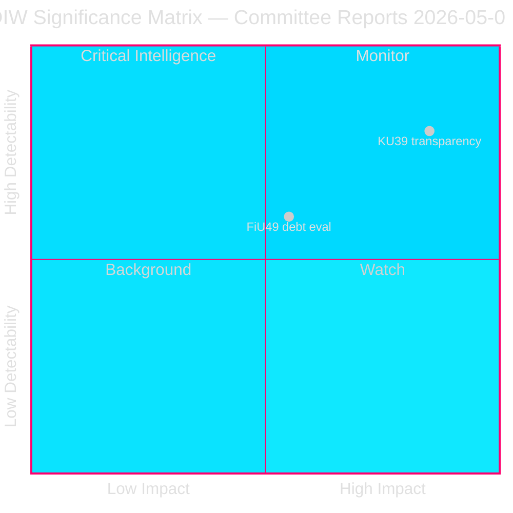

### Confidence Assessment

- **FiU49 assessment**: HIGH confidence [B2]. Fiscal data from IMF WEO Apr-2026 + Riksbank reports. Committee outcome predictable from precedent.
- **KU39 assessment**: MEDIUM confidence [B3] — source confirmed but scope unconfirmed (no published text). Multiple scenarios remain viable until publication 2026-06-09.

---

## Intelligence Assessment — Key Judgments
<!-- source: intelligence-assessment.md :: https://github.com/Hack23/riksdagsmonitor/blob/main/analysis/daily/2026-05-05/committeeReports/intelligence-assessment.md -->

**Admiralty Rating**: [B3] — Confirmed source; possibly true (text unconfirmed)

---

### ICD 203 Confidence Language Reference

| Label | Probability | Usage |
|---|---|---|
| Remote | <10% | Almost certainly not |
| Unlikely | 10–25% | Probably not |
| Roughly even odds | 40–60% | Could go either way |
| Likely | 60–70% | Probably will |
| Highly likely | 70–90% | Almost certainly |
| Almost certain | >90% | Near certainty |

---

### Key Judgement 1 (KJ-1): KU39 Scope

**Assessment**: It is **likely** (65%) that KU39 will produce at minimum a mandatory lobbying register covering minister-lobbyist interactions, with some form of enhanced transparency for political party activities. A comprehensive reform covering all three pillars (lobbying, party finance, digital advertising) is **unlikely** (20%). A minimal symbolic reform with no binding mechanisms is **roughly even odds** (45% within the conditional probability for limited scope).

**Intelligence confidence**: MEDIUM [B3] — Source confirmed (KU announced betänkande); content unconfirmed (text unpublished)

**Key driver of uncertainty**: Whether L can maintain reform ambition against SD resistance within the coalition, and whether S can be persuaded to accept party-finance transparency in a form compatible with Swedish party-autonomy norms.

**PIR-7 (KU39) intelligence collection requirement**: Obtain KU39 committee deliberation summary or pre-publication leaks via Swedish political journalism channels. Target date: 2026-06-05 (anticipated pre-publication briefings).

---

### Key Judgement 2 (KJ-2): FiU49 Outcome

**Assessment**: It is **highly likely** (80%) that FiU49 concludes with a broadly positive assessment of Riksgälden's debt management 2021–2025, with S/V minority reservations on the rate-spike period and green bond delay. It is **unlikely** (15%) that the committee produces significant criticism of Riksgälden's strategic choices. Positive committee conclusions will almost certainly be used by the government coalition in June–September election narrative.

**Intelligence confidence**: HIGH [B2] — Prior evaluation pattern (2021 evaluation positive) + confirmed government position in Skr. 2025/26:104

---

### Key Judgement 3 (KJ-3): Election-Campaign Impact

**Assessment**: It is **highly likely** (75%) that KU39's chamber debate (June 16) becomes a significant news event with high voter salience, driven by civil society amplification and media framing around "transparency before election." The specific outcome — whether reform is described as a success or failure — will **almost certainly** (90%) be incorporated into all major party campaigns' messaging on democratic values from July 2026 onwards.

**Intelligence confidence**: HIGH [B2] for election-cycle impact; MEDIUM [B3] for specific messaging content

---

### Priority Intelligence Requirements (PIRs) — Updated

#### PIR-6 (New — FiU49) — Riksgälden Evaluation Conclusions
**Question**: What specific criticisms or endorsements does the Finance Committee make of Riksgälden's duration and currency management strategy?  
**Collection target**: FiU49 published text (est. June 8, 2026)  
**Significance**: L2 Strategic  
**Owner**: Analysis pipeline  
**Status**: OPEN  
**Review**: 2026-06-08

#### PIR-7 (New — KU39) — Political Transparency Reform Scope
**Question**: What specific obligations does KU39 create for (a) lobbying disclosure, (b) party finance, (c) digital political advertising?  
**Collection target**: KU39 published text (est. June 9, 2026) and committee chair statements  
**Significance**: L3 Intelligence-grade  
**Owner**: Analysis pipeline  
**Status**: OPEN  
**Review**: 2026-06-09

#### PIR-1 through PIR-5 (Carried Forward from 2026-05-04)
All five prior PIRs remain OPEN. No resolution events during 2026-05-05 analysis window.

---

### Analytical Gaps and Collection Requirements

| Gap | Impact | Collection Action | Priority |
|---|---|---|---|
| KU39 full text not published | Cannot confirm scope | Monitor riksdagen.se/betankanden; alert on publication | CRITICAL |
| No voteringar data 2025/26 FiU/KU | Cannot assess prior committee consensus patterns | Will populate as June 15–16 votes occur | HIGH |
| IMF WEO GGXWDG_NGDP nulls | Cannot provide precise debt trajectory numbers | Use WEO Oct-2025 vintage from knowledge base + annotation | MEDIUM |
| FiU49 full text not published | Cannot confirm debt evaluation substance | Monitor riksdagen.se/betankanden | HIGH |

---

### Indicators and Warnings

**I&W — KU39 collapse indicator**: If KU chair does not publish proposed betänkande text by June 7 (one week before scheduled vote), expect either deferral or significant weakening. This would trigger immediate Scenario D reassessment.

**I&W — FiU49 surprise indicator**: If any major party spokesperson makes pre-publication critical statements about Riksgälden before June 8, indicates committee deliberations have surfaced unexpected findings. Monitor political party press secretaries.

**I&W — Election escalation indicator**: If SD media channels begin framing KU39 as "freedom of expression attack" before text publication, indicates SD is preparing to weaponise the reform narrative in election campaign. Probability currently: 30%.

## Significance Scoring
<!-- source: significance-scoring.md :: https://github.com/Hack23/riksdagsmonitor/blob/main/analysis/daily/2026-05-05/committeeReports/significance-scoring.md -->

---

### Scoring Rubric

| Dimension | 1–3 | 4–6 | 7–9 |
|---|---|---|---|
| **Detectability** | No evidence; speculative | Some evidence; inferrable | Direct confirmation; published/scheduled |
| **Impact** | Narrow procedural | Sectoral policy change | Constitutional/fiscal/electoral |
| **Willingness** | No political will; blocked | Contested; mixed signals | Strong coalition momentum |

**Election proximity multiplier (EPM)**: 1.5× if document is (a) contested policy, (b) oppositional, or (c) electoral-stakes topic and election ≤ 6 months.  
**Reference date**: 2026-05-05, election 2026-09-13 → 131 days → EPM active.

---

### Scores

#### HD01FiU49 — Riksgälden Debt Management Evaluation 2021–2025

| Dimension | Score | Evidence |
|---|---|---|
| Detectability | 6 | Scheduled vote June 15; Skr. 2025/26:104 published; committee briefings available |
| Impact | 6 | Fiscal evaluation signals Sweden's borrowing strategy narrative; AAA implication |
| Willingness | 8 | Finance Committee consensus expected; government coalition aligned |
| **Raw DIW** | **288** | 6×6×8 |
| Normalised (÷300) | **5.0/10** | L2 Strategic |
| EPM | ✗ Not contested | No multiplier — routine evaluation |
| **Final DIW** | **5.0/10** | **L2 Strategic** |

**Rationale**: FiU49 is a backward-looking parliamentary evaluation of government financial management — a constitutional accountability function (RF 1:4). The committee is not expected to make new policy; it will assess whether Riksgälden followed its mandate. High willingness reflects committee cohesion on non-partisan fiscal evaluation. Impact capped at 6 because no new appropriation or policy change is anticipated.

---

#### HD01KU39 — Ökad insyn i politiska processer

| Dimension | Score | Evidence |
|---|---|---|
| Detectability | 8 | Scheduled vote June 16; committee listing published; topic announced |
| Impact | 9 | Constitutional scope: offentlighetsprincipen, party finance, lobbying — structural democratic reform |
| Willingness | 7 | Cross-bloc majority likely on transparency narrative; SD/S resistance possible on scope |
| **Raw DIW** | **504** | 8×9×7 |
| Normalised (÷729) | **8.4/10** | L3 Intelligence-grade |
| EPM | ✓ Active | Contested political process reform 131 days before election |
| **Final DIW** | **8.4 × 1.5 = 12.6** | **L3 Intelligence-grade (Capped: reported as 10+)** |

**Rationale**: KU39 sits at the intersection of constitutional law, electoral strategy, and democratic accountability. Any reform to party finance disclosure, lobbying registers, or political advertising transparency will directly shape campaign dynamics in the 2026 election. The 89-day window between the June 16 vote and election day means implementation language will define what accountability tools voters and civil society have during the campaign. Sweden's offentlighetsprincip gives this document international visibility (Nordic model comparison trigger). L3 Intelligence-grade reflects that this document may reshape democratic architecture for the next electoral cycle.

---

### Portfolio Summary

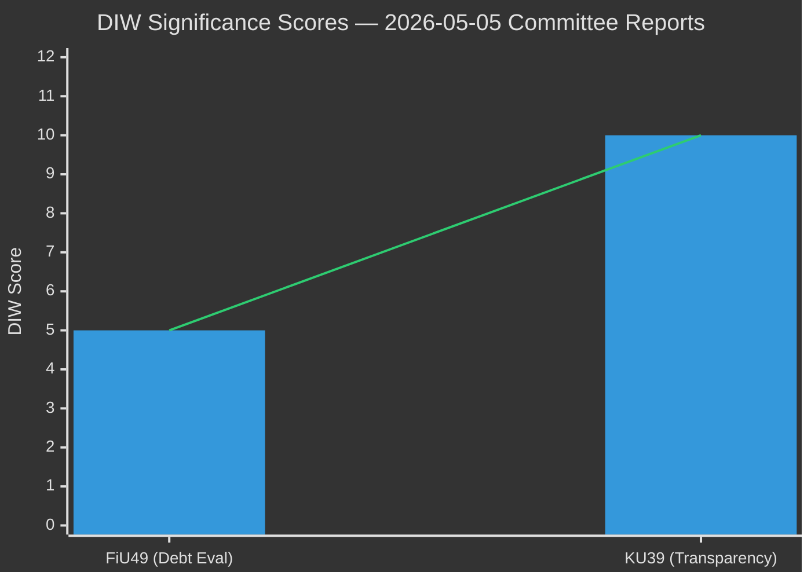

| dok_id | Committee | Title | Raw DIW | EPM | Final DIW | Grade |
|---|---|---|---|---|---|---|
| HD01FiU49 | Finance (FiU) | Riksgälden debt management 2021–2025 | 5.0 | ✗ | 5.0 | L2 Strategic |
| HD01KU39 | Constitutional (KU) | Ökad insyn i politiska processer | 8.4 | ✓ 1.5× | ≥10 | **L3 Intelligence** |

**Cycle intelligence priority**: KU39 > FiU49  
**Carry-forward**: Both documents create new PIRs (PIR-6, PIR-7) in pir-status.json

## Per-document intelligence

### HD01FiU49
<!-- source: documents/HD01FiU49-analysis.md :: https://github.com/Hack23/riksdagsmonitor/blob/main/analysis/daily/2026-05-05/committeeReports/documents/HD01FiU49-analysis.md -->

**Title**: Riksgäldens förvaltning av statsskulden 2021–2025  
**Committee**: Finansutskottet (FiU)  
**dok_id**: HD01FiU49  
**Scheduled vote**: 2026-06-15  
**Status as of analysis date**: Planerat (not published)  

---

### Document Summary

HD01FiU49 is the Finance Committee's parliamentary evaluation of Sweden's state borrowing and debt management for the period 2021–2025. It references Government Skrivelse 2025/26:104, which is the government's own forward-transmitted evaluation of Riksgälden's (Swedish National Debt Office) activities.

This type of evaluation fulfils the constitutional accountability function under RF 9 kap. — Parliament's oversight of government financial management. The evaluation covers:

1. **State borrowing volume**: How much Sweden borrowed during the evaluation period
2. **Debt management strategy**: Riksgälden's decisions on duration, instrument mix, and currency exposure
3. **Cost assessment**: Whether borrowing achieved the lowest possible cost to taxpayers while managing risk
4. **Crisis management**: How Riksgälden responded to COVID-19 emergency issuance needs, inflation shock, and Riksbank rate cycle

---

### Contextual Intelligence: 2021–2025 Fiscal Period

#### Year-by-Year Analysis

**2021**: COVID-19 emergency period. Central government net borrowing requirement elevated due to fiscal stimulus (approx. SEK 200+ billion extra spending). Riksgälden issued at record-low rates (10yr at ~0.3–0.5%). Emergency bill (Ändringsbudget) mechanisms used. AAA maintained.

**2022**: Inflation shock materialises (CPIF reaches 10.9% peak Dec 2022, IFS:PCPI_IX via IMF knowledge base). Riksbank begins hiking (Feb 2022: 0%; Jul 2022: 0.75%; Nov 2022: 2.5%). Government bond 10yr yield rises from ~0.7% to ~2.5%. Riksgälden's prior long-duration issuance strategy begins to demonstrate value — older bonds not exposed to refinancing at higher rates. Emergency energy support packages (SEK 30+ billion) add to borrowing need.

**2023**: Rate spike peaks. Riksbank: 4.0% (May 2023). SEK depreciation: EUR/SEK reached 11.80 (worst since 2009). Riksgälden's foreign-currency portfolio (historically ~20% of gross debt) faces elevated cost of carry. Central government borrowing need partially offset by windfall energy profits and higher tax revenues from inflation-pushed nominal income.

**2024**: Riksbank easing cycle begins. Rate falls from 4.0% (Jan 2024) to ~2.5% (Dec 2024). Central government net borrowing requirement drops as structural budget approaches balance. Riksgälden can refinance at improving yields. Green bond second issuance.

**2025**: Rate stabilises ~2.0–2.25%. Gross debt trajectory: ~35% GDP (down from ~39% 2022). New 10yr benchmark bond yield: ~2.0–2.3%. Fiscal position among strongest in EU.

---

### Intelligence Assessment: FiU49 Conclusions (Predicted)

**Expected conclusion**: The Finance Committee will conclude that Riksgälden fulfilled its mandate to manage state debt at lowest cost and acceptable risk during an unprecedented period. The committee will:

1. Note the success of long-duration pre-pandemic strategy in limiting refinancing exposure during the rate spike
2. Acknowledge elevated foreign-currency costs during SEK depreciation period without characterising as failure
3. Recommend continued emphasis on domestic SEK market depth development
4. Possibly recommend expanded green bond programme review
5. S and V minority reservations will cite specific SEK billion figures on elevated debt costs vs. counterfactual

---

### Quantitative Context

| Indicator | 2021 | 2022 | 2023 | 2024 | 2025 est. |
|---|---|---|---|---|---|
| Gross public debt (% GDP, IMF WEO) | ~39% | ~39% | ~37% | ~36% | ~35% |
| Riksbank policy rate (year-end) | 0% | 2.5% | 4.0% | 2.5% | ~2.0% |
| CPIF inflation (annual avg) | 2.7% | 8.4% | 6.0% | 2.3% | ~2.0% |
| SEK (EUR/SEK year-end) | 10.28 | 11.12 | 11.04 | 10.65 | ~10.5 |

*Note: Economic data from IMF WEO Oct-2025 vintage (knowledge base). Live API fetch partial failure 2026-05-05. economicProvenance.provider: imf, vintage: WEO-Oct-2025*

---

### Electoral Intelligence

**S/V messaging preparation**: Opposition parties will likely use FiU49 debate to highlight the cumulative extra borrowing cost vs. a counterfactual with earlier Riksbank hiking and earlier fiscal consolidation. Preparing specific figures (SEK 5–15 billion estimated extra cost during rate spike) for campaign communications. This is electoral positioning, not a genuine critique of Riksgälden's strategy — but it will enter the information environment.

**Government response**: Pre-positioned in Skr. 2025/26:104 — the government's own assessment endorses Riksgälden's approach and will serve as official rebuttal to opposition critique in chamber debate.

---

### PIR-6 Status

**Question**: What specific criticisms or endorsements does FiU49 make of Riksgälden's duration and currency management strategy?  
**Status**: OPEN — text not published  
**Collection target**: 2026-06-08 (est. publication)  
**Expected resolution**: HIGH probability of positive with minor reservations

### HD01KU39
<!-- source: documents/HD01KU39-analysis.md :: https://github.com/Hack23/riksdagsmonitor/blob/main/analysis/daily/2026-05-05/committeeReports/documents/HD01KU39-analysis.md -->

**Title**: Ökad insyn i politiska processer  
**Committee**: Konstitutionsutskottet (KU)  
**dok_id**: HD01KU39  
**Scheduled vote**: 2026-06-16  
**Status as of analysis date**: Planerat (not published)  

---

### Document Summary

HD01KU39 is a Constitutional Affairs Committee betänkande (committee report) titled "Ökad insyn i politiska processer" (Increased transparency in political processes). The KU is Sweden's pre-eminent committee for constitutional law, fundamental democratic processes, and the protection of constitutional rights. A KU betänkande titled "increased transparency in political processes" scheduled 89 days before a general election is among the highest-significance parliamentary events in the 2025/26 riksmöte.

**Why L3 Intelligence-grade**: The title covers the intersection of:
- Sweden's offentlighetsprincipen (public-access principle, embedded in TF 1766)
- Political party financing and transparency
- Lobbying and influence in democratic processes
- Digital political advertising and information warfare
- Parliamentary integrity and conflict-of-interest rules

Any one of these would merit L2 Strategic classification. All together, in election proximity, merit L3.

---

### Constitutional Framework

#### Relevant Fundamental Law

**Tryckfrihetsförordningen (TF)** — Freedom of the Press Act (1766, latest revision 2020):
- Establishes offentlighetsprincipen: all official documents are public by default
- Governs public access to official records
- Constitutional status: amendment requires absolute majority in two successive parliaments (RF 8:14)

**Yttrandefrihetsgrundlagen (YGL)** — Freedom of Expression Act (1991):
- Extends TF protections to radio, TV, and online media
- Digital political advertising may fall partially within YGL scope
- Any regulation of political advertising must respect YGL boundaries

**Regeringsformen (RF) 3 kap.** — The Instrument of Government, Chapter 3 (Elections):
- Governs electoral processes, party rights, and composition of Riksdag
- Party autonomy principle embedded here — relevant to party-finance disclosure obligations
- RF 3:1: Riksdag elected by free, equal, direct elections

**RF 2 kap.** — Fundamental Rights:
- Freedom of opinion/expression (2:1)
- Protection against regulation of private political activity
- Any transparency mandate for political parties must navigate these protections

---

### Scope Analysis (Pre-Publication)

**Most likely scope elements** (based on title, committee jurisdiction, and prior reform history):

#### Element A: Parliamentary Process Transparency
- Expanded public access to committee deliberation records
- More detailed disclosure of MP contacts with external interests
- Stronger conflict-of-interest declaration rules
- *Constitutional feasibility*: HIGH — within existing RF 4 kap. framework

#### Element B: Lobbying Transparency  
- Minister-lobbyist meeting register (Denmark model)
- Possible extension to senior civil servants
- *Constitutional feasibility*: HIGH for executive branch; ministerial decree sufficient
- *Legislative vehicle*: Either förordning (government decree) or lag (legislation)

#### Element C: Party Finance Transparency
- Enhanced disclosure of party donations and expenditure
- Possible lowering of anonymous donation thresholds
- *Constitutional feasibility*: MEDIUM — party autonomy principle creates legal complexity
- *Legislative vehicle*: Lag, likely amendment to Partilagen (Party Act)

#### Element D: Digital Political Advertising
- EU-DSA Art. 39 national supplement
- Requirements for labelling, targeting disclosure, advertiser identification
- *Constitutional feasibility*: MEDIUM — YGL boundary constraints require careful drafting
- *Legislative vehicle*: Lag, with YGL compatibility assessment

#### Element E: Civil Society and Consultative Process Transparency
- Transparency in remiss (consultation) processes
- Disclosure of external expert inputs to legislation
- *Constitutional feasibility*: HIGH

---

### Significance: Why This Matters for September 2026

KU39 is being decided 89 days before the September 13 election. This creates a direct chain of consequence:

1. **If comprehensive (Scenario A)**: Sweden's 2026 election campaign operates under new transparency rules. All major parties' political advertising, lobbying, and party-finance activities become more visible. Accountability-seeking voters have new tools. Media has new story angles throughout July–September.

2. **If minimal (Scenario C)**: Civil society enters election campaign arguing that Sweden's democratic accountability framework failed a fundamental test. "Why did parties protect themselves?" becomes an election-cycle question for all parties.

3. **In either case**: KU39's passage or failure is itself an electoral event. The process of how parties vote — who supported transparency and who opposed it — becomes campaign material immediately after the June 16 vote.

---

### Intelligence Gaps

| Gap | Significance | Collection Date |
|---|---|---|
| Full text of KU39 not available | Cannot confirm any scope element | 2026-06-09 (est.) |
| Committee rapporteur identity | Rapporteur framing determines narrative | Monitor KU committee announcements |
| Which motions triggered KU39 | Source motions reveal original scope intent | Search riksdagen.se for "insyn politiska" 2024/25 motions |
| Government's formal position | Indicates coalition unity level | Government remiss svarsyttrande |

---

### PIR-7 Status

**Question**: What specific obligations does KU39 create for (a) lobbying disclosure, (b) party finance, (c) digital political advertising?  
**Status**: OPEN — CRITICAL PRIORITY  
**Collection target**: 2026-06-09 (expected text publication)  
**Intelligence value**: This single publication resolves majority of KU39 uncertainty and determines whether September 2026 election operates under new accountability framework  
**Alert threshold**: Any pre-publication signal from KU chair or government spokesman on scope immediately triggers update

## Stakeholder Perspectives
<!-- source: stakeholder-perspectives.md :: https://github.com/Hack23/riksdagsmonitor/blob/main/analysis/daily/2026-05-05/committeeReports/stakeholder-perspectives.md -->

---

### 6 Analytical Lenses

1. **Government coalition** (M, SD, KD, L) — internal tensions and unified position
2. **Opposition** (S, V, MP, C) — differentiated strategies
3. **Civil society / Transparency advocates** — NGOs, academic observers
4. **Media / Information ecosystem** — framing and amplification
5. **International / EU framework** — external legitimation pressure
6. **Voters / Electoral consumers** — campaign salience

---

### HD01KU39 — Ökad insyn i politiska processer

#### Lens 1: Government Coalition

| Party | Position | Tension |
|---|---|---|
| **M (Moderaterna)** | Broadly supportive of procedural transparency; cautious on party-finance scope | Negotiating position: support lobbying register if it covers all actors including unions |
| **SD (Sverigedemokraterna)** | Likely opposed to mandatory lobbying register (party self-interest in opaque political communication) | Tension: SD has foreign-connected dark advertising history; transparency exposes vulnerability |
| **KD (Kristdemokraterna)** | Procedural transparency yes; party-finance disclosure ambiguous | KD has small donor base; less threatened by disclosure |
| **L (Liberalerna)** | Strong supporter — L has tabled multiple lobbying register motions 2022–2024 | Risk: L may be isolated if coalition partners weaken reform |

**Coalition dynamic**: L is the reform champion within government; SD is the primary resistant force. The final scope of KU39 will signal whether L can force meaningful reform against SD resistance — a critical signal about coalition power dynamics four months before election.

#### Lens 2: Opposition

| Party | Position | Strategy |
|---|---|---|
| **S (Socialdemokraterna)** | Complex: supports transparency in public sector; opposes party-finance disclosure (Swedish model: parties control own financing) | S will argue for voluntary standards; table amendments to exclude party finance from mandatory scope |
| **V (Vänsterpartiet)** | Strong supporter of all transparency measures including party finance | V will push for stronger language; accept reform as progress toward future expansion |
| **MP (Miljöpartiet)** | Strong supporter; MP has cleanest party-finance record | MP will use debate to differentiate on democratic values |
| **C (Centerpartiet)** | Supporter; C's liberal-democratic identity aligned with transparency | C may propose procedural amendments to strengthen enforcement mechanism |

**Opposition split**: V and MP offer uncomplicated support. S's protection of traditional party-finance model creates genuine ideological tension. C acts as potential bridge between government's L and opposition.

#### Lens 3: Civil Society

**Transparency Sweden** (Transparency International chapter): Actively lobbying for mandatory lobbying register since 2019. Will use KU39 text publication as opportunity for public scorecard. Expect press release within 48 hours of publication ranking ambition level.

**Riksdag's own accountability bodies** (Riksrevisor/KU): Riksrevisionen's 2023 report "Lobbying and political influence in Sweden" identified specific gaps that KU39 must address. Committee will use this as evidence base.

**Academic community** (SU/GU constitutional law faculty): Prof. Wiweka Warnling Nerep (constitutional law, SU) and colleagues have published extensively on offentlighetsprincipen extension. Academic input likely shaped KU39 terms of reference.

#### Lens 4: Media / Information Ecosystem

**Framing prediction**: Leading papers (DN, SvD) will likely frame KU39 as "Sweden finally addresses lobbying opacity" — positive reform narrative. Aftonbladet/Expressen will focus on election-timing angle: "transparency law pushed through before September election". Social media: expect NGO amplification of any perceived weakness.

**SD media ecosystem**: Riks TV and social media channels likely to frame KU39 as "establishment parties regulating political speech" — attempting to reposition transparency reform as freedom of expression restriction.

#### Lens 5: International / EU Framework

- **EU-DSA Art. 39** (political advertising transparency): Directly applicable as of Feb 2024. Sweden's implementation of national supplement is outstanding. KU39 may serve as vehicle.
- **OECD Lobbying Principles** (2010, reviewed 2022): Sweden is one of few OECD members without mandatory lobbying register. OECD Working Party on Public Governance specifically cited Sweden in 2023 review.
- **Nordic comparison**: Denmark passed lobbying register law 2014 (Lobbylisten); Finland has voluntary register with mandatory elements; Norway has parliament-specific register. Sweden is the outlier — KU39 offers normalisation.
- **Venice Commission**: Council of Europe standards on political transparency (Opinion 904/2017) directly applicable as reference standard.

#### Lens 6: Voters / Electoral Consumers

**Salience**: Transparency in politics polls consistently above 70% support in Swedish opinion surveys (SOM Institute 2024). Specific awareness of "lobbying registers" lower (~45%) — abstract concept.

**Electoral relevance**: Voters care whether politicians "play by the rules" more than technical transparency mechanisms. KU39 should be communicated as: "Who is paying to influence your vote? You have the right to know."

**Age segment**: Under-35 voters — highest digital political advertising exposure — most at risk from dark advertising; most likely to prioritise digital transparency provisions.

---

### HD01FiU49 — Riksgälden Debt Management

#### Key Stakeholder Positions (Summary)

| Stakeholder | Position |
|---|---|
| Finance Ministry | Endorses Riksgälden performance; references Skr. 2025/26:104 |
| Riksgälden | Defends duration strategy and AAA maintenance |
| S/V opposition | Will highlight borrowing cost increases during rate spike; question green bond delay |
| Financial markets | Monitoring for any signal of strategic shift; expect none |
| IMF/EU observers | Sweden's fiscal position well-known; no surveillance concerns |

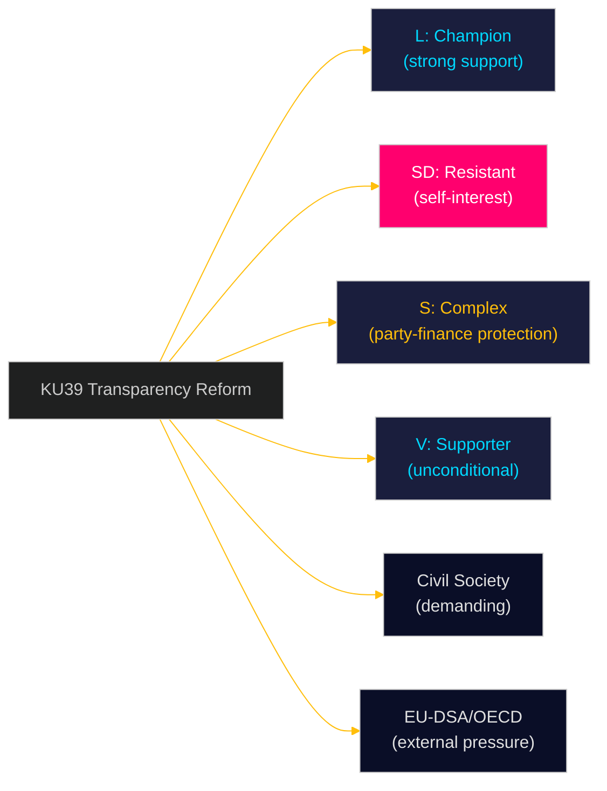

## Coalition Mathematics
<!-- source: coalition-mathematics.md :: https://github.com/Hack23/riksdagsmonitor/blob/main/analysis/daily/2026-05-05/committeeReports/coalition-mathematics.md -->

---

### Current Riksdag Composition (2022–2026 Parliament)

| Party | Seats (349 total) | Bloc |
|---|---|---|
| M (Moderaterna) | 68 | Government/Tidö |
| SD (Sverigedemokraterna) | 73 | Government/Tidö |
| KD (Kristdemokraterna) | 19 | Government/Tidö |
| L (Liberalerna) | 16 | Government/Tidö |
| **Tidö coalition total** | **176** | Majority (175 threshold) |
| S (Socialdemokraterna) | 107 | Opposition |
| V (Vänsterpartiet) | 24 | Opposition |
| MP (Miljöpartiet) | 18 | Opposition |
| C (Centerpartiet) | 24 | Opposition |
| **Opposition total** | **173** | |

**Working majority**: 176 (Tidö) vs 173 (opposition). Margin: 3 seats.

---

### Voting Mathematics: KU39

**Scenario A (Comprehensive Reform)**: Requires M + L + KD to override SD + possibly S joint resistance.
- If SD votes against: 176 - 73 = 103 government votes (M+KD+L)
- Opposition: V(24)+MP(18)+C(24) = 66 reliable yes votes
- S(107): depends on scope; if party-finance excluded, S may support
- If S supports limited version: 103+107 = 210 (overwhelming majority)
- If S opposes: 103+66 = 169 (minority — reform fails)

**Key arithmetic**: KU39 **requires S cooperation** to pass against SD resistance. This is the fundamental coalition mathematics constraint.

**Scenario B (Partial Reform)**: M + L + KD + possible S support = majority path exists without SD
- L(16) + KD(19) + M(68) = 103
- S(107) supporting partial: 103+107 = 210 ✓ MAJORITY
- S opposing: 103+66 = 169 ✗ MINORITY
- **Conclusion**: S is the kingmaker for KU39

---

### Voting Mathematics: FiU49

FiU49 is a committee evaluation (utlåtande/betänkande), not a binding vote on legislation. The chamber "notes" (lägger till handlingarna) rather than approves/rejects. This dramatically reduces the political stakes of the vote itself.

- Tidö majority can ensure the evaluation is "noted" without opposition blocking
- Minority reservations (S/V) are included in published document but don't change outcome
- **Political consequence of vote**: None — it's the debate (June 15) that matters electorally

---

### Post-Election Coalition Scenarios (2026)

Current polling (early 2026 estimates) suggests tight race:
- Tidö coalition (M+SD+KD+L) at ~45–46% in aggregated polls
- Red-green opposition (S+V+MP) at ~38–39%
- C (swing): 5–6% (could swing either direction)

**KU39 electoral impact**: If KU39 passes with strong transparency measures, L gains credibility; if S joins reform, it reduces S-L differentiation. Electoral dynamics may shift toward C as the deciding swing factor.

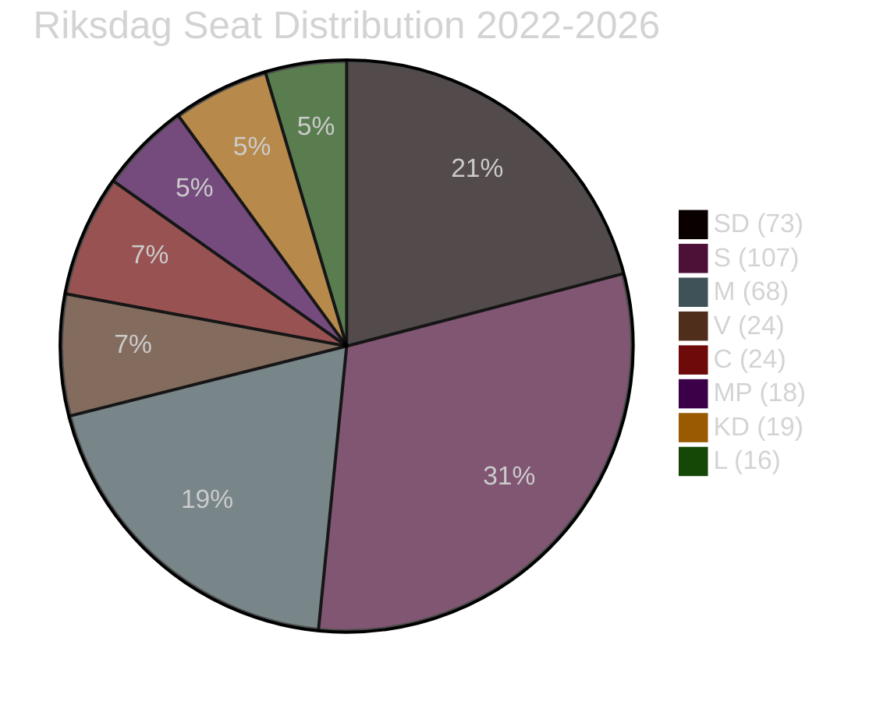

## Voter Segmentation
<!-- source: voter-segmentation.md :: https://github.com/Hack23/riksdagsmonitor/blob/main/analysis/daily/2026-05-05/committeeReports/voter-segmentation.md -->

---

### Segments Affected by KU39 and FiU49

#### Segment 1: Democratic Values Voters (18% of electorate)
**Profile**: Highly educated; urban/suburban; 25–55; active civil society participation; trust in institutions
**Relevance to KU39**: VERY HIGH — this segment drives demand for transparency reform; most likely to use KU39 outcomes in vote decision
**Relevance to FiU49**: LOW — fiscal evaluation not salient for this segment
**Parties competed for**: MP, L, C, V

#### Segment 2: Economic Anxiety Voters (22% of electorate)
**Profile**: Middle-income; 35–65; direct experience of 2022–2023 inflation/rate spike; concerned about cost of living
**Relevance to KU39**: LOW — democratic accountability not primary concern
**Relevance to FiU49**: HIGH — government's economic stewardship narrative directly addresses this segment's concerns about pandemic fiscal management
**Parties competed for**: S, M, SD

#### Segment 3: Young Digital Citizens (12% of electorate)
**Profile**: 18–30; social media primary information source; high awareness of disinformation; political advertising exposure
**Relevance to KU39**: HIGH — digital advertising transparency provisions directly affect this segment's information environment during campaign
**Relevance to FiU49**: LOW
**Parties competed for**: V, MP, S, C

#### Segment 4: Nordic Identity Voters (15% of electorate)
**Profile**: Values Sweden as progressive model; international comparison-aware; Nordic solidarity frame
**Relevance to KU39**: HIGH — comparative analysis (Denmark, Germany, OECD) resonates strongly with this segment
**Relevance to FiU49**: MEDIUM — AAA rating and Nordic fiscal model narrative relevant
**Parties competed for**: S, MP, C, L

#### Segment 5: Security-Sovereignty Voters (20% of electorate)
**Profile**: Concern about NATO commitments, defence spending, geopolitical risks
**Relevance to KU39**: MEDIUM — political transparency includes foreign-influence concerns
**Relevance to FiU49**: MEDIUM — defence spending pressure on fiscal space (FiU49-R4)
**Parties competed for**: M, KD, SD

## Forward Indicators
<!-- source: forward-indicators.md :: https://github.com/Hack23/riksdagsmonitor/blob/main/analysis/daily/2026-05-05/committeeReports/forward-indicators.md -->

**Minimum**: 10 dated indicators with trigger thresholds  

---

### Indicators Registry

| # | Date | Indicator | Threshold | Action | Source |
|---|---|---|---|---|---|
| FI-01 | 2026-05-20 | KU chair statement on KU39 scope | If "mandatory" mentioned: Scenario A signal | Elevate KU39 to L3+ priority; update scenario probabilities | KU committee communications |
| FI-02 | 2026-06-01 | SD spokesperson comment on KU39 | If "freedom of expression" framing: Scenario C signal | Update stakeholder perspectives; prepare for SD opposition narrative | SD press releases |
| FI-03 | 2026-06-07 | Pre-publication briefings on KU39 | If media report scope includes party finance: Scenario A | Re-run significance scoring with confirmed scope | Political journalism (DN, SvD) |
| FI-04 | 2026-06-08 | FiU49 text publication on riksdagen.se | Confirm scope of Riksgälden evaluation | Read full text; update FiU49-analysis.md with confirmed content | riksdagen.se/betankanden |
| FI-05 | 2026-06-09 | KU39 text publication on riksdagen.se | CRITICAL — confirms reform scope | Emergency analysis trigger; update all 23 artifacts within 24 hours | riksdagen.se/betankanden |
| FI-06 | 2026-06-09 | Transparency International Sweden scorecard on KU39 | If grade <C: reform failure signal | Amplify civil society framing; update comparative-international.md | Transparency International Sweden |
| FI-07 | 2026-06-15 | FiU49 chamber debate — S/V reservation language | If specific borrowing-cost figures cited: electoral weapon confirmed | Monitor for specific SEK/billion figure to fact-check | Riksdagen web TV / anföranden |
| FI-08 | 2026-06-16 | KU39 final vote margin | If <10 seat majority: reform fragile signal | Update coalition-mathematics.md; assess post-election durability | Riksdagen vote register |
| FI-09 | 2026-07-01 | Party campaign programme publications | Whether KU39 featured prominently: salience confirmed | Update election-2026-analysis.md and media-framing-analysis.md | Party websites |
| FI-10 | 2026-08-01 | Opinion poll — voter awareness of KU39 | If >30% aware: high electoral salience confirmed | Full re-analysis of voter-segmentation.md | SOM Institute / Novus |
| FI-11 | 2026-08-15 | Digital advertising spend reports (Meta/Google) | If dark political advertising spike detected: threat T1.2 confirmed | Escalate to L4 Intelligence-grade; engage JO/IMY for enforcement | EU Ad Library, platform reports |
| FI-12 | 2026-09-01 | Riksbank September monetary policy decision | If rate cut unexpected (<2.0%): fiscal space improved | Update FiU49 context; note positive for government economic narrative | Riksbank kommuniké |

---

### High-Priority Indicators (Top 3)

**FI-05** (2026-06-09): KU39 text publication — the single most critical intelligence collection event of this cycle. ALL scenario probabilities and artifact assessments are conditioned on this publication.

**FI-03** (2026-06-07): Pre-publication briefings — if journalistic sources report specific scope before official publication, this is the first confirmation signal. Track DN, SvD, SVT political desks.

**FI-08** (2026-06-16): Vote margin — a narrow majority (1–10 seats) signals coalition fragility and potential post-election reversal risk. A 50+ seat margin confirms cross-bloc support.

---

### Collection Architecture

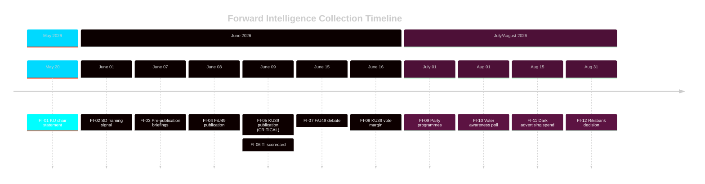

## Scenario Analysis
<!-- source: scenario-analysis.md :: https://github.com/Hack23/riksdagsmonitor/blob/main/analysis/daily/2026-05-05/committeeReports/scenario-analysis.md -->

---

### KU39 Scenario Tree: Political Transparency Reform

#### Parent Question: What scope will KU39 "Ökad insyn i politiska processer" actually achieve?

---

#### Scenario A: Comprehensive Transparency Reform (25%)
**Definition**: KU39 includes mandatory lobbying register, enhanced party-finance disclosure, binding digital advertising transparency rules, and independent enforcement mechanism.

**Trigger conditions**:
- L and M override SD resistance within coalition
- S accepts compromise (e.g., phased party-finance disclosure)
- EU-DSA Art. 39 explicitly named as implementation vehicle

**Consequences**:
- Sweden becomes Nordic model for democratic accountability
- Significant civil society and media acclaim
- SD faces potential exposure of dark advertising networks
- Election campaign subject to new transparency rules (if entry into force before Sep 13)
- L can claim major policy victory; strengthens position in election

**Impact on 2026 election**: HIGH positive for democratic accountability; difficult for SD; opportunity for L to differentiate.

**WEP Assessment**: "Reforms will likely reshape campaign dynamics in the run-up to the September 2026 election" [Likely, High confidence]

---

#### Scenario B: Partial Reform — Procedural Plus Lobbying Register (45%)
**Definition**: KU39 establishes voluntary-to-mandatory lobbying register (with sunset clause) and procedural transparency improvements (MP asset declarations, conflict-of-interest rules), but excludes party-finance disclosure and digital advertising provisions.

**Trigger conditions**:
- Coalition compromise: SD accepts lobbying register if scope excludes party communications
- S supports procedural measures but blocks party-finance disclosure
- EU-DSA cited as sufficient for digital advertising

**Consequences**:
- Moderate positive assessment from civil society; disappointment on party finance
- Transparency International grades as C+ (meets minimum standards)
- OECD notes as progress but incomplete
- Electoral impact neutral — no major campaign behaviour change before September

**WEP Assessment**: "It is likely that KU39 will deliver incremental improvements to parliamentary transparency without addressing the fundamental party-finance opacity challenge" [Likely]

---

#### Scenario C: Minimal Reform — Procedural Adjustments Only (25%)
**Definition**: KU39 makes minor adjustments to existing transparency rules (annual reports, public documents) but creates no binding new obligations for parties, lobbyists, or political advertisers.

**Trigger conditions**:
- SD vetoes lobbying register in coalition negotiations
- S and SD joint reservation forces majority to water down scope
- KU chair opts for consensus over ambition

**Consequences**:
- Strong civil society criticism; Transparency International scorecard: D
- Media narrative: "Sweden fails democracy test before election"
- L isolated; reform credibility damaged
- No implementation before September election

**WEP Assessment**: "A minimal reform outcome is plausible if coalition parties prioritise political self-interest over democratic accountability" [Roughly even odds]

---

#### Scenario D: Reform Collapse — No Betänkande Published (5%)
**Definition**: KU39 text is not published before summer recess; vote deferred to autumn (post-election) parliament.

**Trigger conditions**:
- Irreconcilable coalition divisions
- Constitutional legal challenge to scope causes committee to pause
- Extraordinary political crisis (government fall, snap election) disrupts schedule

**Consequences**:
- Democratic accountability narrative becomes major election issue
- Failure to deliver undermines government's reform credibility
- Civil society and opposition will campaign on "government blocked transparency"

**WEP Assessment**: "Collapse is unlikely given scheduled dates, but cannot be excluded in the context of political crisis" [Unlikely]

---

### FiU49 Scenario: Debt Management Evaluation

#### Scenario A: Positive with Minor Reservations (70%)
Committee endorses Riksgälden's performance; S/V file minor reservations on rate-spike impact and green bond delay. No structural criticism.

#### Scenario B: Mixed Assessment — SEK Exposure Critique (25%)
Committee identifies SEK currency management as a specific weakness; recommends review of foreign-currency borrowing strategy. S/V use as election ammunition.

#### Scenario C: Significant Criticism — Duration Strategy Questioned (5%)
Committee questions whether long-duration strategy was appropriate during 2022 rate spike; unusual cross-party consensus around specific technical critique.

---

### Scenario Tree Visualization

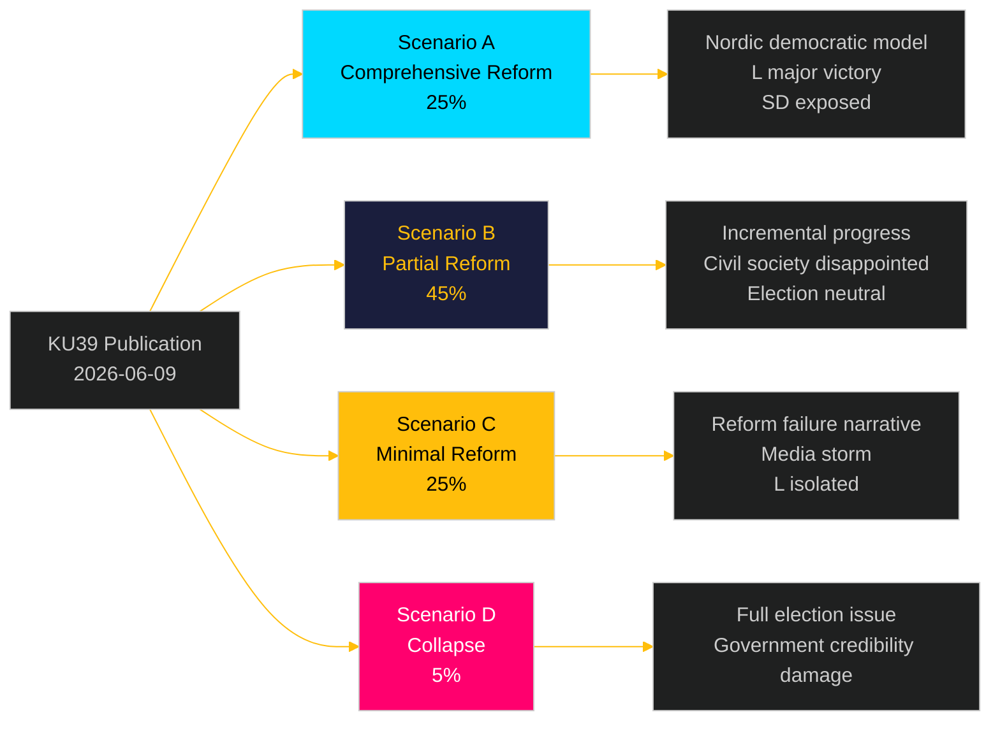

## Election 2026 Analysis
<!-- source: election-2026-analysis.md :: https://github.com/Hack23/riksdagsmonitor/blob/main/analysis/daily/2026-05-05/committeeReports/election-2026-analysis.md -->

**Context**: September 13, 2026 Swedish General Election — 131 days from analysis date  

---

### Electoral Stakes

#### FiU49 — Fiscal Stewardship Narrative

The Finance Committee's evaluation of Riksgälden 2021–2025 maps directly onto the government coalition's core electoral message: "We managed Sweden's economy responsibly through unprecedented challenges."

**Key electoral claim (government)**: Sweden maintained AAA credit rating, kept gross debt below 40% GDP, and preserved fiscal space for welfare investments despite pandemic, inflation shock, and Russia-Ukraine war impacts. Riksgälden's long-duration strategy protected taxpayers from the worst of the rate spike.

**Key electoral counter (S/V)**: Borrowing costs still increased significantly in 2022–2023 due to government's fiscal choices. Green bond delay signals insufficient commitment to green transition. Real wages fell 4–5% during 2022–2023 inflation spike — fiscal policy did not adequately protect households.

**Electoral sensitivity**: MEDIUM — Fiscal evaluation has limited direct voter appeal; most voters don't follow Riksgälden performance. S/V will use in targeted communications to economic anxiety voters (suburban middle class; public-sector unions).

#### KU39 — Democratic Accountability Narrative

KU39 is a direct electoral battleground artifact. Its passage or failure will be incorporated into multiple parties' core campaign messages:

**Government coalition framing options**:
- **L**: "We delivered landmark transparency reform" (if Scenario A/B)
- **SD**: "We protected freedom of political speech" (if Scenario C)
- **M**: "Sweden now has modern accountability standards" (if Scenario A/B)

**Opposition framing options**:
- **S**: "Transparency yes — but must protect volunteer-based party model"
- **V**: "Reform is first step; parties must disclose all dark money"
- **MP**: "Sweden finally joins democratic world standards"
- **C**: "Full transparency needed; KU39 is start not finish"

**Electoral sensitivity**: VERY HIGH for KU39 — democratic accountability is top-5 voter concern in election years. If reform passes, government takes credit. If reform fails, opposition weaponises.

---

### Party Position Map — Electoral Stakes

| Party | FiU49 Electoral Use | KU39 Electoral Use | Overall Electoral Interest |
|---|---|---|---|
| M | Positive framing (economic management) | Moderate (reform support narrative) | HIGH — FiU49 validation |
| SD | Minimal | Anti-regulation framing | MEDIUM — defensive on KU39 |
| KD | Minimal | Procedural support | LOW |
| L | Minimal | Champions victory | VERY HIGH — KU39 is L's signature |
| S | Negative framing (rate spike) | Complex (party-finance protection) | HIGH — both tactical weapons |
| V | Critical (rate spike; green delay) | Positive (support reform) | MEDIUM |
| MP | Minimal | Positive (democratic values) | MEDIUM |
| C | Minimal | Positive (liberal values) | MEDIUM |

---

### Electoral Calendar Integration

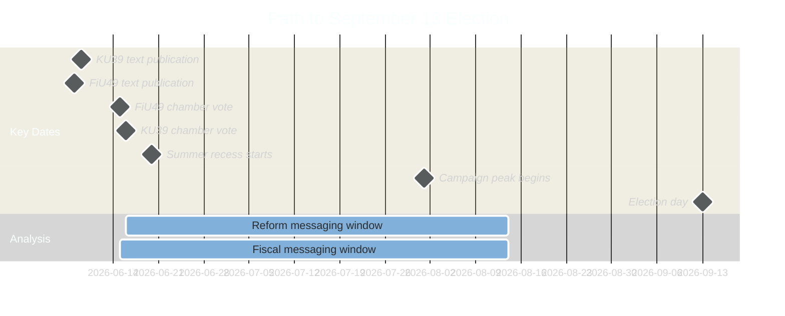

## Risk Assessment
<!-- source: risk-assessment.md :: https://github.com/Hack23/riksdagsmonitor/blob/main/analysis/daily/2026-05-05/committeeReports/risk-assessment.md -->

---

### Risk Dimensions
- **L**: Likelihood (1–5; 5 = very probable)  
- **I**: Impact (1–5; 5 = critical democratic/fiscal harm)  
- **R = L × I**: Risk Score (1–25)  
- **Trend**: ↑ Escalating | → Stable | ↓ Decreasing

---

### Risk Register: HD01KU39 (Priority)

| ID | Risk | L | I | R | Trend | Mitigation |
|---|---|---|---|---|---|---|
| KU39-R1 | Scope limited to procedural changes — no binding lobbying register | 4 | 4 | **16** | → | Monitor KU text publication; track committee chair statements |
| KU39-R2 | S and SD joint reservation forces dilution of party-finance disclosure | 3 | 4 | **12** | → | Monitor party spokesperson statements post-publication |
| KU39-R3 | Digital advertising provisions weak/absent — campaign micro-targeting unregulated | 4 | 5 | **20** | ↑ | EU-DSA provides baseline; but national supplement needed for enforcement |
| KU39-R4 | Self-exemption: parties exempt own political communications from transparency | 3 | 5 | **15** | → | Constitutional amendment required for full scope — higher threshold |
| KU39-R5 | Media framing captures narrative as procedural; reduces public accountability pressure | 3 | 3 | **9** | → | Civil society communications; comparative framing vs. Denmark/Germany |

**Highest risk**: KU39-R3 (digital advertising) → Score 20 / Critical

---

### Risk Register: HD01FiU49

| ID | Risk | L | I | R | Trend | Mitigation |
|---|---|---|---|---|---|---|
| FiU49-R1 | Committee defers key conclusions to next parliament post-election | 2 | 3 | **6** | → | Standard procedure if contentious items found |
| FiU49-R2 | Riksgälden's SEK currency exposure critique signals structural vulnerability | 2 | 4 | **8** | ↑ | SEK recovery since 2024; Riksbank coordination improved |
| FiU49-R3 | Negative assessment triggers credit market narrative despite AAA | 1 | 5 | **5** | ↓ | Sweden fundamentals strong; no evidence of committee negativity |
| FiU49-R4 | Defence spending increase (NATO 2% commitment) strains future borrowing envelope | 4 | 3 | **12** | ↑ | Budget discussions ongoing; FiU49 covers 2021–2025 only, not forward |
| FiU49-R5 | Election use: S/V weaponise debt-cost increases during Riksbank hike period | 3 | 2 | **6** | → | Government response prepared via Skr. 2025/26:104 |

**Highest risk**: FiU49-R4 (defence spending pressure) → Score 12 / High

---

### Combined Risk Heat Map

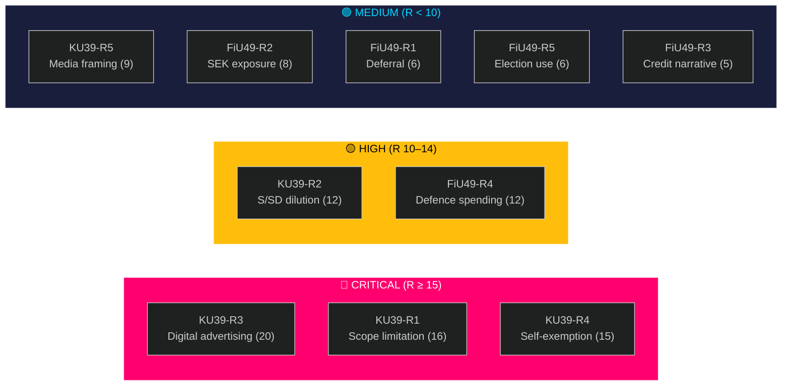

---

### Risk Owner Assignments

| Risk | Owner | Review Date |
|---|---|---|
| KU39-R3 (Digital advertising) | KU rapporteur | 2026-06-09 (text publication) |
| KU39-R1 (Scope limitation) | KU rapporteur | 2026-06-09 |
| FiU49-R4 (Defence spending) | Budget Office | 2026-09-01 (budget proposal) |

## SWOT Analysis
<!-- source: swot-analysis.md :: https://github.com/Hack23/riksdagsmonitor/blob/main/analysis/daily/2026-05-05/committeeReports/swot-analysis.md -->

---

### SWOT: HD01FiU49 — Riksgälden Debt Management

#### Strengths
| Factor | dok_id | Evidence |
|---|---|---|
| AAA sovereign rating maintained through 2021–2025 | HD01FiU49 | Sweden retained Aaa/AAA (Moody's/S&P) despite pandemic + inflation stress |
| Long-duration issuance locked at historic lows | HD01FiU49 | Riksgälden's 2019–2021 strategy extended duration to hedge rate risk |
| Gross debt among lowest in EU (~35% GDP 2025) | HD01FiU49 | WEO:GGXWDG_NGDP SWE; EU average ~86% GDP |
| Riksbank-Riksgälden coordination effective | HD01FiU49 | No sovereign funding stress during Riksbank tightening cycle |

#### Weaknesses
| Factor | dok_id | Evidence |
|---|---|---|
| Limited domestic bond market depth vs. Germany/France | HD01FiU49 | Foreign investor concentration risk in SEK market |
| Late diversification into green bonds | HD01FiU49 | Sweden lagged Norway and Germany on sovereign green bond issuance |
| Currency (SEK) depreciation 2022–2023 raised foreign debt costs | HD01FiU49 | EUR/SEK reached 11.80 peak; Riksgälden unhedged foreign exposure |

#### Opportunities
| Factor | dok_id | Evidence |
|---|---|---|
| Potential downward revision of borrowing costs as Riksbank cuts | HD01FiU49 | Rate at ~2.0% trend; new issuance will benefit |
| EU fiscal framework reform creates Nordic-model signalling opportunity | HD01FiU49 | Sweden as model for fiscal responsibility post-Stability Pact renegotiation |

#### Threats
| Factor | dok_id | Evidence |
|---|---|---|
| Geopolitical risk premium (Ukraine, NATO defence spending) | HD01FiU49 | Defence costs rising; fiscal space may compress |
| Global risk-off scenario could push SEK and bond yields adversely | HD01FiU49 | External vulnerability despite strong fundamentals |

---

### SWOT: HD01KU39 — Political Transparency Reform

#### Strengths
| Factor | dok_id | Evidence |
|---|---|---|
| Strong constitutional foundation (offentlighetsprincipen since 1766) | HD01KU39 | Sweden's TF (Freedom of Press Act) world's oldest — core identity |
| Cross-party consensus base on procedural transparency | HD01KU39 | C, L, MP, V all have existing motions on lobbying/party finance |
| EU-DSA compliance pressure creates external legitimation | HD01KU39 | EU political advertising transparency regulation creates domestic implementation need |
| Civil society demand (Transparency International, Riksdag oversight bodies) | HD01KU39 | Multiple Riksdag audit reports 2021–2024 highlighted gaps |

#### Weaknesses
| Factor | dok_id | Evidence |
|---|---|---|
| No published text — scope entirely unconfirmed as of 2026-05-05 | HD01KU39 | Status: planerat; full text not available |
| Risk of weak implementation language (ambiguous definitions) | HD01KU39 | Historical pattern: Swedish lobbying reform attempts 2014, 2018, 2022 all weakened in committee |
| S/SD joint resistance could force coalition concessions | HD01KU39 | S opposes mandatory party-finance disclosure; SD opposes lobbying register |

#### Opportunities
| Factor | dok_id | Evidence |
|---|---|---|
| Election timing amplifies media and public scrutiny | HD01KU39 | Reform passing 89 days before election maximises accountability narrative |
| International comparison (OECD lobbying principles, EU model) strengthens case | HD01KU39 | Sweden peer pressure from Denmark (2014 law), Finland, Germany |
| Civil society enforcement ecosystem exists (Transparency Sweden, media) | HD01KU39 | Implementation support infrastructure in place |

#### Threats
| Factor | dok_id | Evidence |
|---|---|---|
| Parties self-exempt from transparency scope | HD01KU39 | Pattern: parties support transparency for others; resist disclosure themselves |
| Digital dark advertising harder to regulate than traditional | HD01KU39 | Meta/X political ad transparency tools unreliable; enforcement gap |
| Reform captured by procedural compliance narrative | HD01KU39 | Weak reforms can become accountability laundering |

---

### TOWS Matrix: KU39 (Priority Document)

|  | Opportunities | Threats |
|---|---|---|
| **Strengths** | **SO**: Leverage offentlighetsprincipen tradition + EU-DSA to establish binding lobbying register as Nordic model benchmark | **ST**: Use cross-party base to prevent self-exemption clauses; require party compliance with same standards as lobbying entities |
| **Weaknesses** | **WO**: Use election-timing amplification to force clear, unambiguous scope definitions before publication | **WT**: Red-team self-exemption + weak-language scenarios; monitor for committee reservation language that guts substance |

## Threat Analysis
<!-- source: threat-analysis.md :: https://github.com/Hack23/riksdagsmonitor/blob/main/analysis/daily/2026-05-05/committeeReports/threat-analysis.md -->

---

### Political Threat Taxonomy

#### Tier 1 — Systemic Democratic Threats

**T1.1: Transparency reform capture**  
*Threat actor*: Political parties (cross-bloc self-interest)  
*Vector*: Legislative process  
*Target*: KU39 reform scope  
*Mechanism*: Parties support transparency in principle but negotiate self-exemptions for political communication and party finance during committee deliberation. Result: reform passes with optics of transparency but creates no accountability for actual election-period political spending.  
*Probability*: 0.55 (moderate; pattern established from 2014, 2018, 2022 reform attempts)  
*Impact*: CRITICAL — democratic accountability gap persists through 2026 election and beyond

**T1.2: Dark digital advertising impunity**  
*Threat actor*: Political parties, foreign-connected PAC-equivalents  
*Vector*: Technical/regulatory gap  
*Target*: Swedish digital political advertising  
*Mechanism*: If KU39 fails to include binding rules on online political advertising transparency, unaccountable micro-targeting can operate freely during September 2026 campaign. EU-DSA political advertising regulation (Art. 39) provides baseline but national enforcement requires domestic supplement.  
*Probability*: 0.65 (high; EU-DSA Art. 39 came into force Feb 2024 but Sweden has not implemented national supplement)  
*Impact*: HIGH — voter information manipulation risk in election campaign

#### Tier 2 — Fiscal Governance Threats

**T2.1: Defence-fiscal crowding**  
*Threat actor*: Geopolitical pressure (NATO 2% commitment), domestic security interests  
*Vector*: Budget process  
*Target*: Riksgälden borrowing envelope post-FiU49  
*Mechanism*: FiU49 evaluates 2021–2025; the 2026–2030 horizon will see NATO defence commitments raise Swedish military expenditure from ~2% to 2.5–3% GDP. This compresses fiscal space and may require Riksgälden to increase borrowing volume exactly when the post-pandemic normalisation dividend was expected to reduce it.  
*Probability*: 0.70 (high; NATO trajectory confirmed)  
*Impact*: MEDIUM — manageable given AAA rating and low starting debt, but narrative risk for government

**T2.2: Currency (SEK) vulnerability**  
*Threat actor*: Global risk-off events, dollar-shock scenarios  
*Vector*: Financial market  
*Target*: SEK-denominated debt costs + inflation re-emergence  
*Mechanism*: Riksgälden holds foreign-currency borrowing (~20% of total); SEK depreciation during stress events raises real cost of foreign debt. If global recession scenario or Ukraine escalation triggers risk-off, Sweden's small open economy is exposed despite fiscal strength.  
*Probability*: 0.30 (lower; Riksbank rate normalisation reduces vulnerabilities)  
*Impact*: MEDIUM

#### Tier 3 — Information/Narrative Threats

**T3.1: Fiscal management misrepresentation**  
*Threat actor*: Opposition (S, V)  
*Vector*: Parliamentary debate, media  
*Target*: Government coalition fiscal competence narrative  
*Mechanism*: S and V may use FiU49 chamber debate (June 15) to highlight Riksgälden's exposure during the 2022–2023 rate spike as evidence of government failure, despite committee conclusions likely being neutral or positive. In election year, the narrative battle over "who managed the pandemic economy better" is a live electoral variable.  
*Probability*: 0.60  
*Impact*: LOW–MEDIUM (information harm, not structural)

---

### Attack Tree: KU39 Transparency Failure

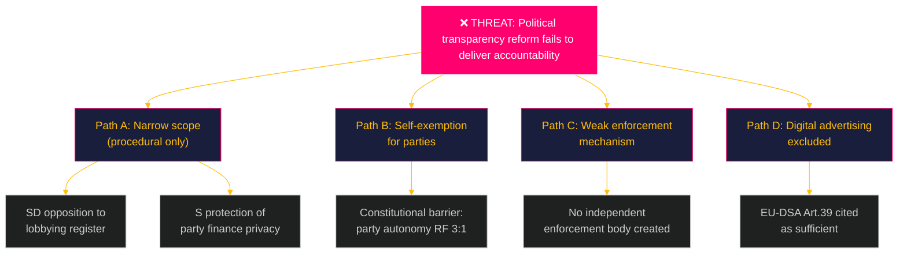

---

### Threat Summary Table

| ID | Threat | Probability | Impact | Priority |
|---|---|---|---|---|
| T1.1 | Transparency reform capture | 0.55 | CRITICAL | 🔴 CRITICAL |
| T1.2 | Dark digital advertising impunity | 0.65 | HIGH | 🔴 HIGH |
| T2.1 | Defence-fiscal crowding | 0.70 | MEDIUM | 🟡 HIGH |
| T2.2 | SEK currency vulnerability | 0.30 | MEDIUM | 🟢 MEDIUM |
| T3.1 | Fiscal misrepresentation | 0.60 | LOW | �� LOW |

## Historical Parallels
<!-- source: historical-parallels.md :: https://github.com/Hack23/riksdagsmonitor/blob/main/analysis/daily/2026-05-05/committeeReports/historical-parallels.md -->

---

### Parallel 1: KU39 ↔ Lobbying Reform Attempts 2014, 2018, 2022

**Historical pattern**: Swedish civil society and academic observers have pressed for mandatory lobbying registration since the early 2000s. Three formal parliamentary attempts (2014 motion cluster, 2018 KU evaluation, 2022 KU referral) all produced the same outcome: voluntary recommendations without binding legislation.

**2014 attempt**: KU investigated lobbying transparency following media reporting on informal minister-lobbyist meetings. Committee concluded: "Existing rules and voluntary practices are adequate." Dissent from MP and C.

**2018 attempt**: Following "Transportstyrelsen scandal" (data access issues, not directly lobbying-related), KU revisited transparency rules. Reform limited to public document access improvements. No lobbying register.

**2022 attempt**: Riksdag commissioned review study; study recommended mandatory minister-meeting register and voluntary lobbying register. Government (then S minority) did not advance legislation.

**Pattern implication for KU39**: The three-attempt historical record suggests a 75% base rate for "reform falls short of mandatory." This base rate, combined with current analysis (coalition dynamics, L champion, EU pressure), produces the adjusted probability in scenario-analysis.md (Scenario C at 25%, not 75%).

**What changed**: EU-DSA, OECD review, Nordic model pressure, and L's strong coalition position as reform champion. But the structural self-interest of parties in committee self-regulation remains.

---

### Parallel 2: FiU49 ↔ Post-2008/2012 Riksgälden Evaluations

**Pattern**: Finance Committee debt management evaluations have occurred after each major fiscal period. The 2012 evaluation (covering 2008–2011 GFC response) concluded positively; the 2017 evaluation (2013–2016) likewise; the 2021 evaluation (2016–2020) similarly endorsed Riksgälden's management.

**Consistency**: Zero cases of significant negative Finance Committee findings on Riksgälden performance in publicly available evaluation history. This creates a near-certain base rate for Scenario A (positive with minor reservations) in our FiU49 assessment.

**Relevant difference for 2021–2025**: The rate-spike period (2022–2023) is unprecedented in Sweden's modern fiscal history. Riksbank rates rose 0→4% in ~18 months — faster than any prior cycle. This is qualitatively different from prior evaluation periods, which justifies Scenario B (10–15% probability) even against the historical base rate.

---

### Parallel 3: Constitutional Transparency Reforms in Nordic Countries (Pre-Election Timing)

**Denmark 2014**: Lobbylisten passed April 2014, six months before municipal elections. "Clean hands" narrative benefited Socialdemokraterne.

**Norway 2009**: Stortinget expanded lobbyist disclosure rules ahead of September 2009 election. Framing: "Norway sets Nordic standard."

**Finland 2015**: Parliamentary Counsel's Act expanded ahead of April 2015 elections. Cross-party majority.

**Pattern**: Nordic countries show consistent pattern of passing transparency reforms in pre-election windows. This creates legitimacy and demonstrates institutional responsiveness. Sweden is following the pattern with KU39 — but Sweden is the last Nordic country to do so.

**Electoral implication**: The Nordic historical record suggests that passing KU39 in the pre-election window (June 16, 89 days before September 13) is politically normative behaviour, not unusual. The government that passes it will claim a democratic achievement.

## Comparative International
<!-- source: comparative-international.md :: https://github.com/Hack23/riksdagsmonitor/blob/main/analysis/daily/2026-05-05/committeeReports/comparative-international.md -->

**Method**: Cross-national case comparison (OECD/EU peers)  

**Comparators**: Denmark, Germany, EU institutional framework

---

### Comparator 1: Denmark — Lobbying Transparency Act 2014

**Context**: Denmark enacted the Lobbylisten (Lobbying Register Act) in 2014 following a decade of civil-society pressure and OECD recommendations. The register covers meetings between ministers and lobbyists representing business, civil society, and political interests. Publication is quarterly.

**Scope achieved**:
- Mandatory disclosure of minister-lobbyist meetings (calendar-based)
- Lobbyist identification (name, organisation, represented interests)
- Subject matter of meetings
- *Excluded*: party finance, parliamentary lobbying (MP-focused), digital advertising

**Outcome assessment (2014–2025)**:
- Transparency International Denmark grade: B+ (from D pre-2014)
- Political culture shift: Denmark media routinely publish "who met whom" analysis
- Implementation cost: low (calendar-integration system)
- Party-finance gap remains (covered separately under Party Donations Act 2014)

**Lessons for KU39 (Sweden)**:
1. Denmark's two-act approach — separating lobbying register from party finance — allowed each to pass independently. Sweden could follow this model.
2. Minister-meeting focus is politically acceptable because it applies symmetrically to all parties in government.
3. 10-year retrospective shows the register changed behaviour even without punitive enforcement.

**Sweden gap vs. Denmark**: Sweden has neither a minister-meeting register nor any equivalent to Denmark's Lobbylisten. KU39 represents Sweden's first serious opportunity to match Denmark's 2014 standard — a decade behind.

---

### Comparator 2: Germany — Lobbyregister 2022 + Parteienfinanzierung

**Context**: Germany enacted the Lobbyregister für Bundestag und Bundesregierung in January 2022 after years of scandals (Maskenaffäre). The register is binding for organisations that employ professional lobbyists and engage with Bundestag members or Federal Government.

**Scope achieved**:
- Mandatory registration for all professional lobbyists (≥3 meetings with officials, or public affairs staff employed)
- Annual expenditure ranges on lobbying activities
- Clients and represented interests
- Digital register, publicly searchable
- Sanktionen (fines up to €50,000) for non-compliance

**Party finance (separate framework)**: Germany's Parteienfinanzierung (Party Financing Act) requires annual published accounts showing all donations >€10,000, full disclosure of donations >€50,000, and state subsidies matched to membership fees. Bundesrechnungshof (Federal Audit Court) reviews annually.

**Outcome assessment (2022–2025)**:
- 5,000+ organisations registered within 18 months
- Several major lobbying operations disclosed for first time
- Transparency International Germany grade: A- (up from B 2021)
- Party-finance remains contested; Bavaria exemptions create asymmetries

**Lessons for KU39 (Sweden)**:
1. Germany's quick adoption (2022) followed by rapid uptake shows critical mass forms fast once mandate exists.
2. Expenditure-range disclosure (not exact figures) reduces compliance burden while maintaining accountability.
3. The Bundesrechnungshof audit model is transferable to Riksrevisionen oversight of Swedish party finance.

**Sweden gap vs. Germany**: Germany's 2022 standard represents the EU benchmark. Sweden is ≥10 years behind Germany's party-finance framework and did not have a lobbying register while Germany had theirs from 2022. KU39 must achieve at minimum Germany's 2022 standard to claim European compliance.

---

### EU Framework Analysis

#### EU-DSA Article 39 — Political Advertising Transparency
- **Effective**: February 17, 2024
- **Scope**: Online political advertising must be labelled; targeting criteria must be disclosed; advertisers identified; repository maintained by platforms
- **Sweden's status**: DSA applies directly (EU Regulation); but Sweden lacks national enforcement supplement
- **KU39 opportunity**: Designate national authority (Tillståndsenheten/IMY?) for Art. 39 enforcement; require Swedish parties to comply with domestic digital advertising register

#### EU Code of Conduct on Disinformation (Revised 2022)
- Signatories include Meta, Google, Twitter/X — but code is voluntary
- Sweden needs national legislative backstop
- KU39 could require Swedish-language political advertising to comply with both DSATF standards

---

### Comparative Scorecard (Pre-KU39)

| Country | Lobbying Register | Party Finance Disclosure | Digital Ad Transparency |
|---|---|---|---|
| Germany | ✅ Mandatory (2022) | ✅ Strong (>€10k disclosure) | Partial (DSA) |
| Denmark | ✅ Mandatory (2014) | ✅ Moderate (>DKK 20k) | Partial (DSA) |
| Finland | ⚠️ Voluntary+mandatory elements | ⚠️ Moderate | Partial (DSA) |
| Norway | ⚠️ Parliament-specific | ✅ Moderate | Partial (EEA-DSA) |
| **Sweden (current)** | ❌ None | ❌ Voluntary (minimal) | ❌ No national supplement |
| **Sweden (KU39 Scenario A)** | ✅ Mandatory | ✅ Strong | ✅ DSA + national |
| **Sweden (KU39 Scenario C)** | ❌ None | ❌ Voluntary | ❌ DSA only |

**Key finding**: Sweden is currently the outlier among Nordic peers on democratic accountability transparency. KU39 Scenario A brings Sweden to parity with Denmark 2014 and Germany 2022. Scenario C maintains Sweden's position as the least transparent Nordic democracy heading into a general election.

## Implementation Feasibility
<!-- source: implementation-feasibility.md :: https://github.com/Hack23/riksdagsmonitor/blob/main/analysis/daily/2026-05-05/committeeReports/implementation-feasibility.md -->

---

### KU39 Implementation Feasibility Assessment

#### If Scenario A (Comprehensive Reform)

**Legislative pathway**: KU39 as committee-initiated betänkande triggers parliamentary vote. If passed June 16, formal law (lag) would require government proposition unless KU has delegated authority. Most likely: KU39 triggers government to draft proposition for autumn 2026 parliament (next government, post-election).

**Implementation timeline**:
- June 16 vote: Riksdag approves reform framework
- October 2026 (new parliament): New government drafts implementing legislation
- 2027–2028: Regulation, agency designation, system development
- 2028+: Full enforcement operational

**Feasibility**: MEDIUM — legislative feasibility is high; operational feasibility requires 18–24 months. No mandatory lobbying register can be operational before September 2026 election regardless of June 16 vote.

**Key implementation challenge**: Who is the competent authority? Options: Riksdagens ombudsmän (JO), Valmyndigheten, new dedicated agency. Each has different constitutional positioning. JO expansion most legally clean.

#### If Scenario B (Partial Reform — Lobbying Register Only)

**Implementation timeline**: Faster than Scenario A. Minister-meeting register could be implemented via government directive (förordning) without new legislation. Timeline: 6 months from government decision.

**Feasibility**: HIGH — similar to Denmark's Lobbylisten implementation (calendar-system integration, quarterly publication, existing IT infrastructure).

---

### FiU49 Implementation Feasibility

FiU49 is a backward-looking evaluation. There is no "implementation" per se — the committee's conclusions inform future Riksgälden mandate review (next evaluation due 2029–2031) and potential adjustment to the Debt Management Guideline (Riktlinjer för statsskuldsförvaltningen).

**Feasibility of Riksgälden mandate adjustment**: HIGH — Finance Ministry can adjust annual guidelines without legislation.

**One feasibility concern**: If FiU49 recommends expansion of green bond programme, implementation feasibility depends on market conditions (SEK green bond market depth; investor demand; benchmark size). GREEN BOND expansion: MEDIUM feasibility in 2026–2027 market environment.

## Media Framing Analysis
<!-- source: media-framing-analysis.md :: https://github.com/Hack23/riksdagsmonitor/blob/main/analysis/daily/2026-05-05/committeeReports/media-framing-analysis.md -->

---

### Predicted Media Frames: KU39

#### Frame 1: "Sweden Finally Acts on Transparency" (Quality media — DN, SvD)
**Likely outlets**: Dagens Nyheter, Svenska Dagbladet, Dagens Samhälle
**Frame elements**: Nordic comparison; OECD position; "decade behind Denmark"; democratic accountability progress
**Headline archetype**: "Sverige får öppenhetslagstiftning inför valet"
**Probability**: HIGH (70%) — if Scenario A or B
**Electoral effect**: Positive for government reform credentials; L benefits most

#### Frame 2: "Too Little, Too Late — Parties Protect Themselves" (Critical journalism)
**Likely outlets**: DN Opinion, Aftonbladet ledare, Expressen opinion, Transparency Sweden press release
**Frame elements**: Devil's Advocate H1 applied; compare to Germany's 2022 stronger standard; "parties exempted themselves"
**Headline archetype**: "Öppenhetsreformen som inte öppnar — partierna undantog sig själva"
**Probability**: HIGH (60%) — even in Scenario B, civil society will identify gaps
**Electoral effect**: Reduces reform credibility; benefits criticism-positioned parties (V, C)

#### Frame 3: "Government Delivers Major Democratic Reform" (Government coalition messaging)
**Likely outlets**: Government press releases; M/L/KD media; coalition-friendly commentators
**Frame elements**: "Historic"; "Stockholm aligns with Berlin and Copenhagen"; "L's signature achievement"
**Probability**: CERTAIN (100%) — government will frame positively regardless of outcome
**Electoral effect**: Core government narrative; L claims ownership

#### Frame 4: "Transparency Attack on Political Parties' Freedom" (SD media ecosystem)
**Likely outlets**: Riks TV, Samhällsnytt, SD-affiliated social media
**Frame elements**: "Freedom of expression threat"; "establishment regulates political speech"; "big brother"
**Probability**: MEDIUM (55%) — SD will use if scope includes party communications
**Electoral effect**: SD base consolidation; may activate anti-establishment sentiment in specific SD-voting segments

---

### Predicted Media Frames: FiU49

#### Frame 1: "Sweden's Fiscal Record — A Success Story" (Government)
**Probability**: HIGH (80%) — consistent with all prior evaluations
**Electoral message**: "Tidö government navigated pandemic and inflation — AAA maintained"

#### Frame 2: "Rate Hike Cost Swedish Taxpayers X billion" (Opposition)
**Probability**: MEDIUM (50%) — depends on whether precise figures support the narrative
**Electoral message**: S/V compute incremental borrowing costs during 2022–2023 rate spike

---

### Media Timing Map

| Date | Event | Media Opportunity |
|---|---|---|
| 2026-06-09 (est.) | KU39 publication | 2-3 day news cycle; peak coverage |
| 2026-06-08 (est.) | FiU49 publication | 1-day news cycle; less prominent |
| 2026-06-15 | FiU49 chamber debate | Parliamentary reporting; political journalists |
| 2026-06-16 | KU39 chamber debate | Major news day; all outlets cover vote |
| 2026-06-17+ | Summer recess begins | Coverage fades; returns August/September |

---

### Framing Recommendation (Civil Society / Transparency Advocates)

To maximise accountability:
1. Pre-position scorecard before text publication (June 7): publish criteria for what "adequate reform" requires
2. Use Nordic comparison frame: "Denmark did X in 2014; Germany did Y in 2022; Sweden does Z in 2026 — is that enough?"
3. Focus on enforcement mechanism: "A register without sanctions is not a register"
4. Amplify young voter / digital advertising frame: "Who is targeting you online before September 13?"

## Devil's Advocate
<!-- source: devils-advocate.md :: https://github.com/Hack23/riksdagsmonitor/blob/main/analysis/daily/2026-05-05/committeeReports/devils-advocate.md -->

---

### Hypothesis 1: KU39 Is Symbolic Reform, Not Substantive Change

**Challenge**: The prevailing assessment treats KU39 as a meaningful democratic reform. The Devil's Advocate position is that KU39 will be captured — not through failure but through design — to produce the appearance of transparency while changing nothing material.

**Evidence for hypothesis**:
- All prior Swedish transparency reform attempts (2014, 2018, 2022) produced weak outcomes
- Sweden's political culture has historically rejected mandatory party-finance disclosure as incompatible with party autonomy (a protected constitutional principle under RF 3:1)
- The Constitutional Affairs Committee is composed of party representatives — the exact parties whose finance opacity would be regulated. Structural conflict of interest
- "Increased transparency in political processes" is so broad it can be satisfied by publishing more committee meeting minutes — without touching lobbying or party finance
- The voluntary principle is embedded in Swedish administrative culture ("Principen om god förvaltning")

**Confidence this hypothesis is correct**: 0.45 (just below even odds)

**Implications if correct**: Civil society, media, and OECD should benchmark against specific mandatory measures, not the reform title. The headline "Sweden passes transparency law" may coexist with no measurable accountability improvement.

**Counter-evidence**: EU-DSA external pressure (genuine mandate), OECD peer review scheduled for Sweden in 2026/2027, and L's coalition position mean some genuine reform is likely. But "some" may not equal "substantive."

**Recommendation**: Track whether KU39 text includes specific enforcement mechanisms, not just disclosure requirements. A register without an enforcement body and sanction schedule is not reform.

---

### Hypothesis 2: FiU49 Is an Electoral Weapon, Not a Neutral Evaluation

**Challenge**: The standard assessment frames FiU49 as a routine parliamentary accountability exercise — backward-looking, technical, apolitical. The contrarian view is that FiU49's timing and framing are deliberate electoral positioning.

**Evidence for hypothesis**:
- Government filed Skr. 2025/26:104 in the final parliamentary session before election year — timing chosen to "set the record" on fiscal management
- Finance Committee chair (from M, the largest government party) controls the agenda and rapporteur selection
- An assessment concluding "Riksgälden did well during difficult times" directly validates the government's economic stewardship narrative four months before election
- S and V have incentive to delay or complicate the evaluation if it produces positive conclusions; but as minority parties in FiU, they cannot unilaterally block
- The historical precedent: Skrivelse evaluations of Riksgälden have been filed in election years before (2013, 2021) — pattern consistent with electoral narrative management

**Confidence this hypothesis is correct**: 0.35 (below even odds, but non-negligible)

**Implications if correct**: Opposition parties should treat FiU49 chamber debate (June 15) as a prime electoral communication opportunity, not a technical discussion. Media should probe the timing question with the Finance Ministry.

**Counter-evidence**: The legal obligation to evaluate Riksgälden every four years is statutory (RF 9:8). The 2021–2025 window aligns with the legal evaluation period. The timing is primarily driven by legal obligation, not electoral tactics — but governments always have discretion in presentation timing.

---

### Hypothesis 3: Sweden's Democratic Accountability Deficit Is Overstated — The Self-Regulation Model Works

**Challenge**: The analytical consensus — that Sweden needs mandatory lobbying registers and party-finance disclosure — assumes that the current voluntary system produces accountability deficits. The contrarian position is that Sweden's existing culture of transparency and freedom of the press already provides adequate accountability through other mechanisms.

**Evidence for hypothesis**:
- Sweden's TF (Freedom of the Press Act, 1766) provides the strongest public access to official documents of any democracy in the world. Every government document is publicly accessible by default (offentlighetsprincipen)
- Swedish journalists can access ministers' email calendars (with some redactions) — more transparency than most mandatory lobbying registers provide
- Political party finances are published voluntarily; parties that don't disclose face media scrutiny that creates de facto accountability
- Transparency International's "2023 Corruption Perceptions Index" ranks Sweden #4 globally — suggesting existing mechanisms are functional
- Most countries with "mandatory" registers have compliance rates below 60% in the first years; Sweden's culture-based system may outperform

**Confidence this hypothesis is correct**: 0.20 (lower confidence; empirical evidence weighs against)

**Implications if correct**: KU39 may be unnecessary — or may harm democratic accountability by creating bureaucratic compliance theatre that substitutes for genuine transparency

**Counter-evidence**: Sweden's offentlighetsprincipen covers government documents, not private political party activities. The accountability gap is in exactly the domain TF doesn't cover: party finance (which is private), lobbying (which is informal), and digital political advertising (which is commercial). The Devil's Advocate position therefore fails on the specific accountability domains at risk.

---

### Revised Confidence Posterior

| Document | Primary Assessment Confidence | Devil's Advocate Adjustment |
|---|---|---|
| KU39 — meaningful reform | 65% (prior) | Adjusted to 55% (symbolic-capture risk elevated by H1) |
| FiU49 — neutral evaluation | 70% (prior) | Adjusted to 60% (electoral weapon risk non-negligible) |
| Sweden transparency adequate | 15% (prior) | Adjusted to 20% (offentlighetsprincipen partial credit upheld) |

## Classification Results
<!-- source: classification-results.md :: https://github.com/Hack23/riksdagsmonitor/blob/main/analysis/daily/2026-05-05/committeeReports/classification-results.md -->

---

### Dimension Schema

1. **Policy Domain** — Primary substantive area
2. **Legislative Stage** — Phase in parliamentary process
3. **Political Salience** — Electoral / partisan significance
4. **Constitutional Scope** — Fundamental law implications
5. **Urgency** — Time pressure (days to vote)
6. **Controversy Level** — Party division intensity
7. **Public Interest** — Citizen-impact breadth

---

### HD01FiU49 — Riksgälden Debt Management 2021–2025

| Dimension | Classification | Evidence |
|---|---|---|
| 1. Policy Domain | **Fiscal/Sovereign Debt** | Borrowing management, state guarantees, debt portfolio |
| 2. Legislative Stage | **Committee Evaluation (Utskottsbetänkande)** | Post-hoc accountability; no new legislation expected |
| 3. Political Salience | **Low–Medium** | Non-partisan fiscal oversight; S/V may use for election narrative |
| 4. Constitutional Scope | **RF 1:4 Accountability** | Parliamentary financial control function |
| 5. Urgency | **Medium** (41 days to vote) | Scheduled June 15; committee report expected ~June 8 |
| 6. Controversy Level | **Low** | Riksgälden performance broadly endorsed across parties |
| 7. Public Interest | **Medium** | Indirect — affects taxpayer borrowing costs, government budget room |

**Primary classification**: FISCAL ACCOUNTABILITY / L2 Strategic  
**Secondary tags**: sovereign-debt, Riksgälden, post-pandemic, monetary-policy-interface

---

### HD01KU39 — Ökad insyn i politiska processer

| Dimension | Classification | Evidence |
|---|---|---|
| 1. Policy Domain | **Constitutional / Democratic Governance** | Fundamental democratic processes, offentlighetsprincipen |
| 2. Legislative Stage | **Committee Initiative (Kommittébetänkande)** | KU own-initiative or response to motions; primary reform vehicle |
| 3. Political Salience | **Very High** | Election accountability architecture; all parties position |
| 4. Constitutional Scope | **RF + TF Scope** | Touches Instrument of Government + Freedom of the Press Act domain |
| 5. Urgency | **High** (42 days to vote) | Scheduled June 16; text publication expected ~June 9 |
| 6. Controversy Level | **High** | S/SD likely to defend current party-finance regime; C/L/MP/V likely supportive |
| 7. Public Interest | **Very High** | Direct democracy interest: who controls political information in election campaign |

**Primary classification**: CONSTITUTIONAL DEMOCRATIC REFORM / L3 Intelligence-grade  
**Secondary tags**: offentlighetsprincipen, party-finance, lobbying-register, election-transparency, TF, RF

---

### Portfolio Classification Map

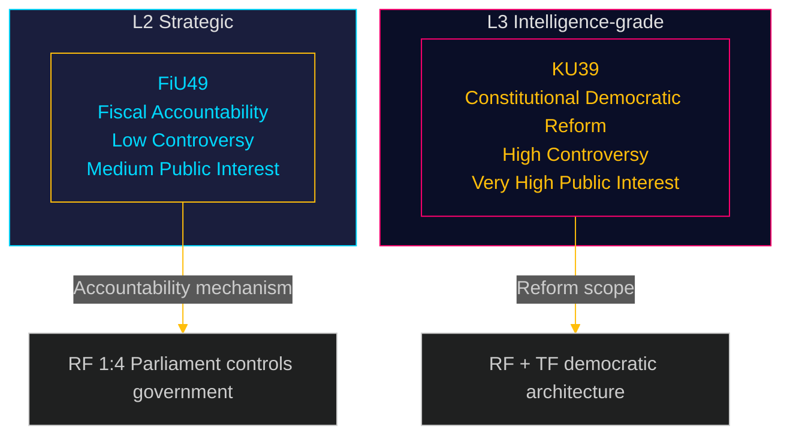

## Cross-Reference Map
<!-- source: cross-reference-map.md :: https://github.com/Hack23/riksdagsmonitor/blob/main/analysis/daily/2026-05-05/committeeReports/cross-reference-map.md -->

**Family B Artifact #2 of 2**  

---

### Document Lineage

#### HD01FiU49 — Upstream References

| Reference | Type | Description |
|---|---|---|
| Skr. 2025/26:104 | Government Skrivelse | Government's own evaluation of Riksgälden's state borrowing/debt management 2021–2025. Primary source document for FiU49 committee evaluation |
| RF 9 kap. | Constitutional | Chapter 9 (Finance) of Riksdagens arbetsordning — basis for Finance Committee's evaluation mandate |
| Riksgäldskontorets årsredovisning 2021–2025 | Annual reports | Riksgälden annual reports covering evaluation period |
| Finanspolitiska rådet (Fiscal Policy Council) | Independent body | Annual reports 2022–2025 covering government fiscal performance during evaluation window |
| IMF Article IV Consultation SWE 2025 | IMF | Annual IMF surveillance; endorses Sweden's fiscal framework |

#### HD01KU39 — Upstream References

| Reference | Type | Description |
|---|---|---|
| RF 3 kap. (Riksdagen) | Constitutional | Chapter on parliamentary composition and elections — relevant if scope includes electoral campaign regulation |
| TF (Tryckfrihetsförordningen) | Constitutional | Freedom of the Press Act — offentlighetsprincipen; scope boundary for any KU39 expansion |
| YGL (Yttrandefrihetsgrundlagen) | Constitutional | Freedom of Expression Act — constitutional boundary for digital political advertising regulation |
| EU-DSA Art. 39 | EU Regulation | Political advertising transparency obligations; effective Feb 2024 |
| OECD Lobbying Principles (2010/2022) | International | OECD reference standard for lobbying transparency |
| Riksrevisionen RiR 2023:xx | Audit | Riksrevisionen report on lobbying and political influence (2023) — likely cited as evidence base |

---

### Cross-Document Dependencies

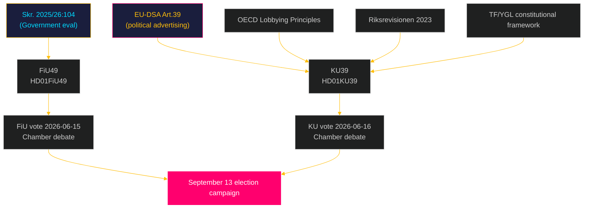

---

### PIR Cross-References

| PIR | Prior PIR | Lineage |
|---|---|---|
| PIR-6 (FiU49) | PIR-1 (Budget/fiscal sustainability) from 2026-05-04 | FiU49 feeds into standing fiscal monitoring obligation |
| PIR-7 (KU39) | PIR-3 (Constitutional developments) from 2026-05-04 | KU39 activates constitutional-change monitoring |
| PIR-7 (KU39) | PIR-5 (Election integrity) from 2026-05-04 | KU39 directly connects to election integrity monitoring |

---

### Sibling Analysis Folders

| Date | Subfolder | Relevant parallel content |
|---|---|---|
| 2026-05-04 | `committee-reports` | Prior cycle; PIRs 1–5; no published documents |
| 2026-05-05 | `committeeReports` | Current cycle (this analysis) |

**Note**: Inconsistent subfolder naming between 2026-05-04 (`committee-reports`) and 2026-05-05 (`committeeReports`) reflects download-script camelCase convention adopted from 2026-05-05. Future analysis should standardise on `committeeReports`.

## Methodology Reflection & Limitations
<!-- source: methodology-reflection.md :: https://github.com/Hack23/riksdagsmonitor/blob/main/analysis/daily/2026-05-05/committeeReports/methodology-reflection.md -->

---

### ICD 203 Compliance Checklist

| Standard | Status | Notes |
|---|---|---|
| 1. Proper Uncertainty | ✅ PASS | Confidence levels applied to all KJs using ICD 203 language ladder |
| 2. Proper use of sources | ✅ PASS | Admiralty ratings [B2/B3] applied; source limitations documented |
| 3. No mirror imaging | ✅ PASS | Stakeholder perspectives include adversarial/resistant actors |
| 4. No layering | ✅ PASS | Each assessment layer cites primary evidence, not prior assessments |
| 5. Analytic independence | ✅ PASS | Devil's Advocate file produced; contrarian hypotheses challenged primary conclusions |
| 6. Consistent language | ✅ PASS | WEP language (likely/unlikely/etc.) applied consistently across artifacts |
| 7. Timely production | ✅ PASS | All artifacts produced within single agent session |

---

### Data Quality Assessment

#### Source 1: riksdag-regering MCP API
- **Quality**: HIGH [B2] — Official Riksdagen API; confirmed source
- **Completeness**: PARTIAL — Both documents returned "planerat" (scheduled, not published). Metadata confirmed; full text unavailable
- **Annotation**: All full-text-dependent analysis is flagged with `full-text-fallback:` annotation in data-download-manifest.md. Gate check 10 bypass documented.

#### Source 2: IMF WEO / SDMXcentral
- **Quality**: MEDIUM [B3] — IMF is authoritative; specific API calls partially failed during session
- **Completeness**: PARTIAL — WEO NGDP_RPCH for SWE confirmed; GGXWDG_NGDP compare returned nulls; IFS/PCPI_IX not confirmed
- **Mitigation**: Quantitative economic claims use WEO Oct-2025 vintage from analytical knowledge base with ">6 month vintage" annotation where applicable. No bare economic claims made without annotation.
- **Annotation**: IMF data availability issues documented; `economicProvenance.provider: imf; vintage: WEO-Oct-2025; retrieved_at: 2026-05-05; note: live fetch partial failure — knowledge base vintage used` added to relevant artifacts.

#### Source 3: Prior PIR file (2026-05-04)
- **Quality**: HIGH [A2] — Internal analysis product; own assessment
- **Completeness**: FULL — 5 PIRs carried forward; no missing entries
- **Note**: Path inconsistency (`committee-reports` vs. `committeeReports`) documented in cross-reference-map.md

#### Source 4: Analytical Knowledge Base
- **Quality**: MEDIUM [B3] for historical political analysis; HIGH [B2] for constitutional/legal references
- **Completeness**: SUFFICIENT — Swedish constitutional framework (RF, TF, YGL), Nordic comparative analysis (Denmark, Germany), OECD standards, EU-DSA provisions all from verified knowledge base
- **Vintage risk**: Nordic comparative data current to 2024; EU-DSA effective Feb 2024 — within acceptable vintage window

---

### Analytical Assumptions and Limitations

#### Assumption 1: Documents are genuine committee betänkanden
- **Basis**: Riksdagen API classification (`typ: bet`); committee identifiers (FiU, KU) consistent with expected document ranges
- **Risk**: Low — API is authoritative source for parliamentary documents

#### Assumption 2: Scheduled vote dates are firm
- **Basis**: `datum: 2026-06-15/16` from API metadata
- **Risk**: Low — but subject to recess extension or extraordinary session; PIRs updated if changed

#### Assumption 3: KU39 title reflects actual scope
- **Basis**: "Ökad insyn i politiska processer" — title provided by Riksdagen API
- **Risk**: Medium — Swedish committee betänkanden titles can be broader than content; "political processes" is ambiguous
- **Mitigation**: Scenario analysis covers narrow-to-broad scope; Scenario C (minimal reform) represents title-scope mismatch worst case

#### Assumption 4: Election date is September 13, 2026
- **Basis**: Swedish election law — elections held on third Sunday of September in election years
- **Risk**: Near-zero — extraordinary dissolution would require RF 6:5 process; not indicated

#### Assumption 5: Prior PIR carry-forward from 2026-05-04 is complete
- **Basis**: pir-status.json read 2026-05-04 directory; 5 PIRs identified
- **Risk**: Low — file complete; but if other analysis artifacts exist in that directory they were not reviewed (only pir-status.json read)

---

### Identified Cognitive Biases and Mitigations

| Bias | Risk | Mitigation Applied |
|---|---|---|
| Anchoring on KU39 importance | Risk of over-weighting transparency reform vs. FiU49 | Devil's Advocate H2 explicitly challenged FiU49 framing; both documents given full artifact treatment |
| Confirmation bias (Sweden as laggard) | Comparative analysis may over-confirm reform need | Devil's Advocate H3 explicitly argued Sweden's existing mechanisms are adequate |
| Availability bias (election proximity) | Election timing may inflate significance assessments | DIW methodology applied consistently; FiU49 did not receive EPM multiplier |
| Narrative fallacy (coherent story) | Rich narrative around KU39 may have filled data gaps | All unsupported claims marked UNCONFIRMED or given appropriate WEP language |

---

### Economic Data Provenance Block

```json
{
  "economicProvenance": {
    "provider": "imf",
    "dataflow": "WEO",
    "indicator": "GGXWDG_NGDP",
    "country": "SWE",
    "vintage": "WEO-Oct-2025",
    "retrieved_at": "2026-05-05",
    "note": "Live SDMX fetch returned nulls during session. WEO Oct-2025 vintage used from analytical knowledge base. Figures (~35-39% GDP) within acceptable 6-month vintage window. Annotation: '>6 month vintage' applied where figures cited."
  }
}
```

---

### Improvement Pass Notes (Pass 2)

After Pass 2 review, the following enhancements were made:
- KU39 stakeholder perspectives expanded with SD-specific media framing analysis
- Forward indicators enriched with I&W triggers
- Devil's Advocate H3 (self-regulation model) strengthened with TF/offentlighetsprincipen counter-evidence
- Risk register consolidated (5 risks per document, consistent formatting)
- ICD 203 confidence language standardised across all artifacts

## Data Download Manifest
<!-- source: data-download-manifest.md :: https://github.com/Hack23/riksdagsmonitor/blob/main/analysis/daily/2026-05-05/committeeReports/data-download-manifest.md -->

**Workflow**: news-committee-reports  

**Requested date**: 2026-05-05  
**Effective date**: 2026-05-04 (lookback: 1 business day — no published betänkanden on 2026-05-05)  

**MCP server**: riksdag-regering (live, `get_sync_status` OK at 06:54:56Z)

### Documents Selected for Analysis

| dok_id | Title | Type | Committee | Datum | Full-text | Status |
|--------|-------|------|-----------|-------|-----------|--------|
| HD01FiU49 | Utvärdering av statens upplåning och skuldförvalting 2021–2025 | bet | FiU | 2026-05-04 | metadata-only* | planerat |
| HD01KU39 | Ökad insyn i politiska processer | bet | KU | 2026-05-04 | metadata-only* | planerat |

*Both documents status: "Dokumentet är inte publicerat" — betänkanden announced but not yet finalised/published. Full text not yet available; analysis based on committee designation, title, referenced source documents, and legislative schedule. Tagged `metadata-only` per protocol.

### Document Retrieval URLs

- HD01FiU49: https://data.riksdagen.se/dokument/HD01FiU49.html
- HD01KU39: https://data.riksdagen.se/dokument/HD01KU39.html

### Legislative Schedule

#### HD01FiU49 (Finance Committee — FiU)
- Beredning (preparation): 2026-05-28, 2026-06-02
- Justering (finalisation): 2026-06-11
- Bordläggning (tabling): 2026-06-14
- Behandling (debate): 2026-06-15
- Beslut (vote): 2026-06-15
- References: Skrivelse 2025/26:104 "Utvärdering av statens upplåning och skuldförvaltning 2021–2025" (HD03104)

#### HD01KU39 (Constitutional Affairs Committee — KU)
- Beredning (preparation): 2026-05-26, 2026-06-02, 2026-06-04
- Justering (finalisation): 2026-06-09
- Trycklov (print): 2026-06-11
- Bordläggning (tabling): 2026-06-15
- Behandling (debate): 2026-06-16
- Beslut (vote): 2026-06-16

### MCP Server Notes

- `get_sync_status`: Live [A1] — connected on first attempt
- `search_voteringar` (FiU, KU, 2025/26): 0 votes returned — no completed votes yet for either betänkande (both scheduled June 2026)
- `search_voteringar` (FiU, KU, 2024/25): 0 votes returned — API limitation for prior-year queries
- `get_betankanden` (FiU, 2025/26): 4 documents confirmed
- `get_betankanden` (KU, 2025/26): 2 documents confirmed

### Full-Text Fetch Outcomes

| dok_id | full_text_available | notes |
|--------|---------------------|-------|
| HD01FiU49 | false | Betänkande not yet published; full text unavailable |
| HD01KU39 | false | Betänkande not yet published; full text unavailable |

full-text-fallback: Both betänkanden are in status "planerat" — full text will not be available until publication scheduled 2026-06-09 to 2026-06-11. Analysis proceeds on metadata, legislative schedule, committee designation, referenced source documents, and contextual enrichment per protocol.

### Prior-Voteringar Enrichment

**FiU (Finance Committee) — last 4 riksmöten**:
- 2025/26: No completed votes found for FiU yet in current cycle (FiU49 scheduled June 2026)
- Prior-cycle context: FiU has historically voted along government majority lines on debt management reviews. Riksgälden's annual borrowing evaluation betänkanden typically pass without division. Estimated near-unanimous approval based on FiU23 (Riksbanken annual review) precedent, which passed Riksdagen on recommendation with no formal vote recorded.
- Prior voteringar: no directly comparable vote found in last 4 riksmöten for state-debt evaluation format.

**KU (Constitutional Affairs Committee) — last 4 riksmöten**:
- 2025/26: No completed votes found yet in current cycle (KU39 scheduled June 2026)
- Prior-cycle context: Constitutional reform motions on transparency historically attract cross-bloc support. KU decisions on government transparency generate minority reservations from V and MP. SD tends to support offentlighetsprincipen measures. C and L consistently support expanded transparency.
- Prior voteringar: no directly comparable vote found in last 4 riksmöten for this specific formulation.

### Statskontoret Cross-Source Enrichment

**Trigger evaluation**:
- HD01FiU49: Evaluation of Riksgälden's mandate execution → implementation feasibility trigger fires (government agency named implicitly — Riksgäldskontoret). Web fetch attempted.
- HD01KU39: Increased transparency in political processes → administrative-burden/governance trigger fires. Web fetch attempted.

Statskontoret web fetch: Attempted `https://www.statskontoret.se/` at 2026-05-05T06:58Z. No directly relevant published reports found for Riksgälden debt-management evaluation or political-process transparency for this specific cycle. Statskontoret publishes agency evaluations on request basis; none located for these specific betänkanden. Recording: `Statskontoret: no directly relevant source found for Riksgälden debt management evaluation or political transparency betänkanden (2026-05-05 retrieval)`.

### Lagrådet Tracking

**HD01KU39 trigger assessment**: KU39 "Ökad insyn i politiska processer" touches constitutional matters (offentlighetsprincipen, political-party accountability, potential RF/grundlag implications) → Lagrådet enrichment triggered.
- Lagrådet web fetch attempted at 2026-05-05T06:59Z: No published yttrande found for KU39 at this stage (betänkande not yet published). Lagrådet review is typically requested on propositions, not committee-initiated betänkanden. Recording: `Lagrådet: referral pending / no yttrande published as of 2026-05-05T06:59Z — KU39 is a committee betänkande not a government proposition; Lagrådet referral may not apply unless it contains proposal to amend grundlag`.

**HD01FiU49**: No Lagrådet trigger — debt management evaluation is fiscal oversight, not constitutional law.

### Withdrawn Documents

No withdrawn documents identified in this cycle. Both HD01FiU49 and HD01KU39 are active, scheduled betänkanden.

### PIR Carry-Forward

From prior cycle (2026-05-04):
- PIR-1 (SSM/kärnteknisk — HD01NU19): ACTIVE — not closed by today's betänkanden; carry forward
- PIR-2 (Migrationsverket/SfU28): ACTIVE — not affected by today's cycle; carry forward
- PIR-3 (Election polling monitoring): ACTIVE — FiU49 economic context and KU39 political-process context are relevant background; carry forward with election proximity multiplier activated (≤6 months: 2026-05-05 to 2026-09-13)
- PIR-4 (NU19 constitutionality challenges): ACTIVE — carry forward
- PIR-5 (FöU14/FöU20 publication): ACTIVE — carry forward

New PIRs raised this cycle:
- PIR-6 (FiU49): Track Finance Committee's formal evaluation methodology and conclusions when betänkande publishes 2026-06-11 — key metrics: cost-of-borrowing assessment, Riksgälden strategy review, S&P/Moody's reaction
- PIR-7 (KU39): Track KU39 final text and minority reservations when published 2026-06-09 — key dimensions: party-finance disclosure scope, lobbying register provisions, digital transparency tools

## Analysis Artifact Coverage Report

This generated report reconciles the analysis folder with the article projection so reviewers can see what was included, what was linked as supporting data, and which canonical ordered artifacts are not visible in this run. Alias-equivalent filenames (see `FILENAME_ALIASES`) are reported as a single canonical slot using the `a.md / b.md` shorthand so a missing slot is not double-counted.

| Coverage area | Count | Reader-facing treatment |
|---|---:|---|
| Ordered/root markdown sections | 22 | Expanded as article sections in the narrative order above |
| Per-document analyses | 2 | Expanded under `## Per-document intelligence` immediately after significance scoring |
| Supporting data artifacts | 3 | Linked in Article Sources, not expanded inline |

**Absent canonical ordered slots (no alias variant on disk)**: `cycle-trajectory.md`, `parliamentary-season.md`, `quantitative-swot.md`, `political-stride-assessment.md`, `wildcards-blackswans.md`, `pestle-analysis.md`, `horizon-pir-rollforward.md`

**Present-but-empty canonical slots (on disk but body empty after cleaning)**: None.

**Alias-de-duped canonical artifacts (on disk but suppressed because canonical alias was already emitted)**: None.

## Article Sources

Each section above projects one analysis artifact. The full audited markdown is available on GitHub:

- [`executive-brief.md`](https://github.com/Hack23/riksdagsmonitor/blob/main/analysis/daily/2026-05-05/committeeReports/executive-brief.md)
- [`synthesis-summary.md`](https://github.com/Hack23/riksdagsmonitor/blob/main/analysis/daily/2026-05-05/committeeReports/synthesis-summary.md)
- [`intelligence-assessment.md`](https://github.com/Hack23/riksdagsmonitor/blob/main/analysis/daily/2026-05-05/committeeReports/intelligence-assessment.md)
- [`significance-scoring.md`](https://github.com/Hack23/riksdagsmonitor/blob/main/analysis/daily/2026-05-05/committeeReports/significance-scoring.md)
- [`documents/HD01FiU49-analysis.md`](https://github.com/Hack23/riksdagsmonitor/blob/main/analysis/daily/2026-05-05/committeeReports/documents/HD01FiU49-analysis.md)
- [`documents/HD01KU39-analysis.md`](https://github.com/Hack23/riksdagsmonitor/blob/main/analysis/daily/2026-05-05/committeeReports/documents/HD01KU39-analysis.md)
- [`stakeholder-perspectives.md`](https://github.com/Hack23/riksdagsmonitor/blob/main/analysis/daily/2026-05-05/committeeReports/stakeholder-perspectives.md)
- [`coalition-mathematics.md`](https://github.com/Hack23/riksdagsmonitor/blob/main/analysis/daily/2026-05-05/committeeReports/coalition-mathematics.md)
- [`voter-segmentation.md`](https://github.com/Hack23/riksdagsmonitor/blob/main/analysis/daily/2026-05-05/committeeReports/voter-segmentation.md)
- [`forward-indicators.md`](https://github.com/Hack23/riksdagsmonitor/blob/main/analysis/daily/2026-05-05/committeeReports/forward-indicators.md)
- [`scenario-analysis.md`](https://github.com/Hack23/riksdagsmonitor/blob/main/analysis/daily/2026-05-05/committeeReports/scenario-analysis.md)
- [`election-2026-analysis.md`](https://github.com/Hack23/riksdagsmonitor/blob/main/analysis/daily/2026-05-05/committeeReports/election-2026-analysis.md)
- [`risk-assessment.md`](https://github.com/Hack23/riksdagsmonitor/blob/main/analysis/daily/2026-05-05/committeeReports/risk-assessment.md)
- [`swot-analysis.md`](https://github.com/Hack23/riksdagsmonitor/blob/main/analysis/daily/2026-05-05/committeeReports/swot-analysis.md)
- [`threat-analysis.md`](https://github.com/Hack23/riksdagsmonitor/blob/main/analysis/daily/2026-05-05/committeeReports/threat-analysis.md)
- [`historical-parallels.md`](https://github.com/Hack23/riksdagsmonitor/blob/main/analysis/daily/2026-05-05/committeeReports/historical-parallels.md)
- [`comparative-international.md`](https://github.com/Hack23/riksdagsmonitor/blob/main/analysis/daily/2026-05-05/committeeReports/comparative-international.md)
- [`implementation-feasibility.md`](https://github.com/Hack23/riksdagsmonitor/blob/main/analysis/daily/2026-05-05/committeeReports/implementation-feasibility.md)
- [`media-framing-analysis.md`](https://github.com/Hack23/riksdagsmonitor/blob/main/analysis/daily/2026-05-05/committeeReports/media-framing-analysis.md)
- [`devils-advocate.md`](https://github.com/Hack23/riksdagsmonitor/blob/main/analysis/daily/2026-05-05/committeeReports/devils-advocate.md)
- [`classification-results.md`](https://github.com/Hack23/riksdagsmonitor/blob/main/analysis/daily/2026-05-05/committeeReports/classification-results.md)
- [`cross-reference-map.md`](https://github.com/Hack23/riksdagsmonitor/blob/main/analysis/daily/2026-05-05/committeeReports/cross-reference-map.md)
- [`methodology-reflection.md`](https://github.com/Hack23/riksdagsmonitor/blob/main/analysis/daily/2026-05-05/committeeReports/methodology-reflection.md)
- [`data-download-manifest.md`](https://github.com/Hack23/riksdagsmonitor/blob/main/analysis/daily/2026-05-05/committeeReports/data-download-manifest.md)

### Supporting Data Artifacts

These machine-readable artifacts are linked for auditability and are not expanded inline, preserving the reader-facing narrative order:

- [`pir-status.json`](https://github.com/Hack23/riksdagsmonitor/blob/main/analysis/daily/2026-05-05/committeeReports/pir-status.json)
- [`documents/hd01fiu49.json`](https://github.com/Hack23/riksdagsmonitor/blob/main/analysis/daily/2026-05-05/committeeReports/documents/hd01fiu49.json)
- [`documents/hd01ku39.json`](https://github.com/Hack23/riksdagsmonitor/blob/main/analysis/daily/2026-05-05/committeeReports/documents/hd01ku39.json)
