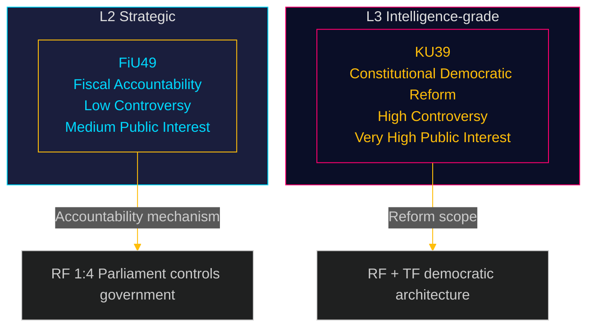

# Classification Results — Committee Reports 2026-05-05
**Method**: 7-Dimension Political Intelligence Classification Framework  
**Author**: James Pether Sörling  
**Date**: 2026-05-05

---

## Dimension Schema

1. **Policy Domain** — Primary substantive area
2. **Legislative Stage** — Phase in parliamentary process
3. **Political Salience** — Electoral / partisan significance
4. **Constitutional Scope** — Fundamental law implications
5. **Urgency** — Time pressure (days to vote)
6. **Controversy Level** — Party division intensity
7. **Public Interest** — Citizen-impact breadth

---

## HD01FiU49 — Riksgälden Debt Management 2021–2025

| Dimension | Classification | Evidence |
|---|---|---|
| 1. Policy Domain | **Fiscal/Sovereign Debt** | Borrowing management, state guarantees, debt portfolio |
| 2. Legislative Stage | **Committee Evaluation (Utskottsbetänkande)** | Post-hoc accountability; no new legislation expected |
| 3. Political Salience | **Low–Medium** | Non-partisan fiscal oversight; S/V may use for election narrative |
| 4. Constitutional Scope | **RF 1:4 Accountability** | Parliamentary financial control function |
| 5. Urgency | **Medium** (41 days to vote) | Scheduled June 15; committee report expected ~June 8 |
| 6. Controversy Level | **Low** | Riksgälden performance broadly endorsed across parties |
| 7. Public Interest | **Medium** | Indirect — affects taxpayer borrowing costs, government budget room |

**Primary classification**: FISCAL ACCOUNTABILITY / L2 Strategic  
**Secondary tags**: sovereign-debt, Riksgälden, post-pandemic, monetary-policy-interface

---

## HD01KU39 — Ökad insyn i politiska processer

| Dimension | Classification | Evidence |
|---|---|---|
| 1. Policy Domain | **Constitutional / Democratic Governance** | Fundamental democratic processes, offentlighetsprincipen |
| 2. Legislative Stage | **Committee Initiative (Kommittébetänkande)** | KU own-initiative or response to motions; primary reform vehicle |
| 3. Political Salience | **Very High** | Election accountability architecture; all parties position |
| 4. Constitutional Scope | **RF + TF Scope** | Touches Instrument of Government + Freedom of the Press Act domain |
| 5. Urgency | **High** (42 days to vote) | Scheduled June 16; text publication expected ~June 9 |
| 6. Controversy Level | **High** | S/SD likely to defend current party-finance regime; C/L/MP/V likely supportive |
| 7. Public Interest | **Very High** | Direct democracy interest: who controls political information in election campaign |

**Primary classification**: CONSTITUTIONAL DEMOCRATIC REFORM / L3 Intelligence-grade  
**Secondary tags**: offentlighetsprincipen, party-finance, lobbying-register, election-transparency, TF, RF

---

## Portfolio Classification Map

