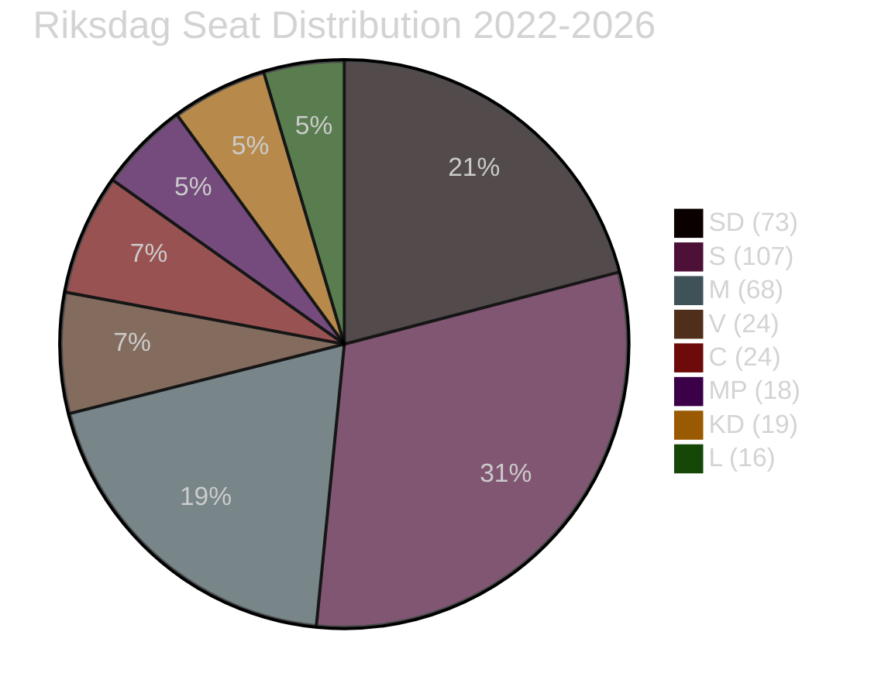

# Coalition Mathematics — Committee Reports 2026-05-05
**Author**: James Pether Sörling  
**Date**: 2026-05-05

---

## Current Riksdag Composition (2022–2026 Parliament)

| Party | Seats (349 total) | Bloc |
|---|---|---|
| M (Moderaterna) | 68 | Government/Tidö |
| SD (Sverigedemokraterna) | 73 | Government/Tidö |
| KD (Kristdemokraterna) | 19 | Government/Tidö |
| L (Liberalerna) | 16 | Government/Tidö |
| **Tidö coalition total** | **176** | Majority (175 threshold) |
| S (Socialdemokraterna) | 107 | Opposition |
| V (Vänsterpartiet) | 24 | Opposition |
| MP (Miljöpartiet) | 18 | Opposition |
| C (Centerpartiet) | 24 | Opposition |
| **Opposition total** | **173** | |

**Working majority**: 176 (Tidö) vs 173 (opposition). Margin: 3 seats.

---

## Voting Mathematics: KU39

**Scenario A (Comprehensive Reform)**: Requires M + L + KD to override SD + possibly S joint resistance.
- If SD votes against: 176 - 73 = 103 government votes (M+KD+L)
- Opposition: V(24)+MP(18)+C(24) = 66 reliable yes votes
- S(107): depends on scope; if party-finance excluded, S may support
- If S supports limited version: 103+107 = 210 (overwhelming majority)
- If S opposes: 103+66 = 169 (minority — reform fails)

**Key arithmetic**: KU39 **requires S cooperation** to pass against SD resistance. This is the fundamental coalition mathematics constraint.

**Scenario B (Partial Reform)**: M + L + KD + possible S support = majority path exists without SD
- L(16) + KD(19) + M(68) = 103
- S(107) supporting partial: 103+107 = 210 ✓ MAJORITY
- S opposing: 103+66 = 169 ✗ MINORITY
- **Conclusion**: S is the kingmaker for KU39

---

## Voting Mathematics: FiU49

FiU49 is a committee evaluation (utlåtande/betänkande), not a binding vote on legislation. The chamber "notes" (lägger till handlingarna) rather than approves/rejects. This dramatically reduces the political stakes of the vote itself.

- Tidö majority can ensure the evaluation is "noted" without opposition blocking
- Minority reservations (S/V) are included in published document but don't change outcome
- **Political consequence of vote**: None — it's the debate (June 15) that matters electorally

---

## Post-Election Coalition Scenarios (2026)

Current polling (early 2026 estimates) suggests tight race:
- Tidö coalition (M+SD+KD+L) at ~45–46% in aggregated polls
- Red-green opposition (S+V+MP) at ~38–39%
- C (swing): 5–6% (could swing either direction)

**KU39 electoral impact**: If KU39 passes with strong transparency measures, L gains credibility; if S joins reform, it reduces S-L differentiation. Electoral dynamics may shift toward C as the deciding swing factor.

