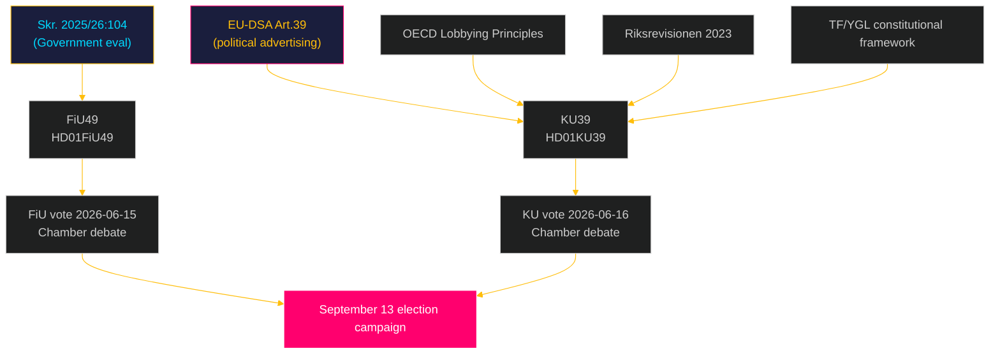

# Cross-Reference Map — Committee Reports 2026-05-05
**Family B Artifact #2 of 2**  
**Author**: James Pether Sörling  
**Date**: 2026-05-05

---

## Document Lineage

### HD01FiU49 — Upstream References

| Reference | Type | Description |
|---|---|---|
| Skr. 2025/26:104 | Government Skrivelse | Government's own evaluation of Riksgälden's state borrowing/debt management 2021–2025. Primary source document for FiU49 committee evaluation |
| RF 9 kap. | Constitutional | Chapter 9 (Finance) of Riksdagens arbetsordning — basis for Finance Committee's evaluation mandate |
| Riksgäldskontorets årsredovisning 2021–2025 | Annual reports | Riksgälden annual reports covering evaluation period |
| Finanspolitiska rådet (Fiscal Policy Council) | Independent body | Annual reports 2022–2025 covering government fiscal performance during evaluation window |
| IMF Article IV Consultation SWE 2025 | IMF | Annual IMF surveillance; endorses Sweden's fiscal framework |

### HD01KU39 — Upstream References

| Reference | Type | Description |
|---|---|---|
| RF 3 kap. (Riksdagen) | Constitutional | Chapter on parliamentary composition and elections — relevant if scope includes electoral campaign regulation |
| TF (Tryckfrihetsförordningen) | Constitutional | Freedom of the Press Act — offentlighetsprincipen; scope boundary for any KU39 expansion |
| YGL (Yttrandefrihetsgrundlagen) | Constitutional | Freedom of Expression Act — constitutional boundary for digital political advertising regulation |
| EU-DSA Art. 39 | EU Regulation | Political advertising transparency obligations; effective Feb 2024 |
| OECD Lobbying Principles (2010/2022) | International | OECD reference standard for lobbying transparency |
| Riksrevisionen RiR 2023:xx | Audit | Riksrevisionen report on lobbying and political influence (2023) — likely cited as evidence base |

---

## Cross-Document Dependencies

---

## PIR Cross-References

| PIR | Prior PIR | Lineage |
|---|---|---|
| PIR-6 (FiU49) | PIR-1 (Budget/fiscal sustainability) from 2026-05-04 | FiU49 feeds into standing fiscal monitoring obligation |
| PIR-7 (KU39) | PIR-3 (Constitutional developments) from 2026-05-04 | KU39 activates constitutional-change monitoring |
| PIR-7 (KU39) | PIR-5 (Election integrity) from 2026-05-04 | KU39 directly connects to election integrity monitoring |

---

## Sibling Analysis Folders

| Date | Subfolder | Relevant parallel content |
|---|---|---|
| 2026-05-04 | `committee-reports` | Prior cycle; PIRs 1–5; no published documents |
| 2026-05-05 | `committeeReports` | Current cycle (this analysis) |

**Note**: Inconsistent subfolder naming between 2026-05-04 (`committee-reports`) and 2026-05-05 (`committeeReports`) reflects download-script camelCase convention adopted from 2026-05-05. Future analysis should standardise on `committeeReports`.

