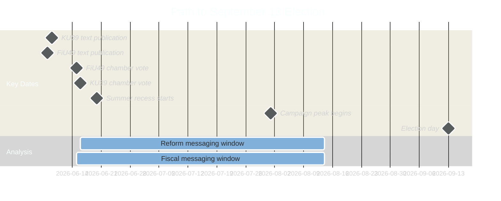

# Election 2026 Analysis — Committee Reports 2026-05-05
**Context**: September 13, 2026 Swedish General Election — 131 days from analysis date  
**Author**: James Pether Sörling  
**Date**: 2026-05-05

---

## Electoral Stakes

### FiU49 — Fiscal Stewardship Narrative

The Finance Committee's evaluation of Riksgälden 2021–2025 maps directly onto the government coalition's core electoral message: "We managed Sweden's economy responsibly through unprecedented challenges."

**Key electoral claim (government)**: Sweden maintained AAA credit rating, kept gross debt below 40% GDP, and preserved fiscal space for welfare investments despite pandemic, inflation shock, and Russia-Ukraine war impacts. Riksgälden's long-duration strategy protected taxpayers from the worst of the rate spike.

**Key electoral counter (S/V)**: Borrowing costs still increased significantly in 2022–2023 due to government's fiscal choices. Green bond delay signals insufficient commitment to green transition. Real wages fell 4–5% during 2022–2023 inflation spike — fiscal policy did not adequately protect households.

**Electoral sensitivity**: MEDIUM — Fiscal evaluation has limited direct voter appeal; most voters don't follow Riksgälden performance. S/V will use in targeted communications to economic anxiety voters (suburban middle class; public-sector unions).

### KU39 — Democratic Accountability Narrative

KU39 is a direct electoral battleground artifact. Its passage or failure will be incorporated into multiple parties' core campaign messages:

**Government coalition framing options**:
- **L**: "We delivered landmark transparency reform" (if Scenario A/B)
- **SD**: "We protected freedom of political speech" (if Scenario C)
- **M**: "Sweden now has modern accountability standards" (if Scenario A/B)

**Opposition framing options**:
- **S**: "Transparency yes — but must protect volunteer-based party model"
- **V**: "Reform is first step; parties must disclose all dark money"
- **MP**: "Sweden finally joins democratic world standards"
- **C**: "Full transparency needed; KU39 is start not finish"

**Electoral sensitivity**: VERY HIGH for KU39 — democratic accountability is top-5 voter concern in election years. If reform passes, government takes credit. If reform fails, opposition weaponises.

---

## Party Position Map — Electoral Stakes

| Party | FiU49 Electoral Use | KU39 Electoral Use | Overall Electoral Interest |
|---|---|---|---|
| M | Positive framing (economic management) | Moderate (reform support narrative) | HIGH — FiU49 validation |
| SD | Minimal | Anti-regulation framing | MEDIUM — defensive on KU39 |
| KD | Minimal | Procedural support | LOW |
| L | Minimal | Champions victory | VERY HIGH — KU39 is L's signature |
| S | Negative framing (rate spike) | Complex (party-finance protection) | HIGH — both tactical weapons |
| V | Critical (rate spike; green delay) | Positive (support reform) | MEDIUM |
| MP | Minimal | Positive (democratic values) | MEDIUM |
| C | Minimal | Positive (liberal values) | MEDIUM |

---

## Electoral Calendar Integration

