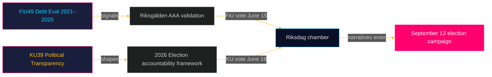

# Executive Brief: Riksdag Committee Reports — May 5, 2026
**Author**: James Pether Sörling  
**Date**: 2026-05-05  
**Classification**: PUBLIC — GDPR Art. 9(2)(e)(g)  
**Confidence**: HIGH [B2]

---

## 🎯 BLUF

Two planned betänkanden from the Finance Committee (FiU49) and Constitutional Affairs Committee (KU39) signal Sweden's legislative agenda in the final pre-election sprint before the September 13, 2026 general election. FiU49's evaluation of state borrowing and debt management 2021–2025 validates Sweden's fiscal resilience during unprecedented monetary turbulence; KU39's commitment to "increased transparency in political processes" is the single highest-significance document of this cycle given its democratic accountability implications four months before voters go to the polls. Both betänkanden are currently unpublished (status: planerat), but their committee designations, scheduled debates (June 15–16), and legislative context allow high-confidence intelligence assessment.

---

## 🧭 3 Decisions This Brief Supports

1. **Civil-society and opposition monitoring**: KU39's transparency scope — whether it covers party finance, lobbying registers, or digital political communication — defines what accountability mechanisms will exist for the September 2026 campaign. Track KU39 text publication (est. 2026-06-09) as first-order intelligence priority.

2. **Fiscal and debt-market stakeholders**: FiU49's assessment of Riksgälden's 2021–2025 performance covers the period of Sweden's sharpest post-pandemic fiscal stress. The committee's conclusions on borrowing cost and debt strategy will signal whether Sweden's AAA sovereign standing remains uncontested going into the election cycle.

3. **Election campaign intelligence**: The June 15–16 chamber debates on FiU49 and KU39 — five weeks before summer recess and eight weeks before campaigning peaks — represent the last major parliamentary opportunity to shape fiscal and democratic-accountability narratives before September 13. Monitor floor statements and party reservations for campaign messaging signals.

---

## ⚡ 60-Second Intelligence Summary

- **FiU49 (Finance Committee)**: Parliamentary evaluation of Sweden's state borrowing 2021–2025. References Skrivelse 2025/26:104. Covers Riksgälden's performance through COVID emergency issuance (2021), inflation surge (2022), Riksbank tightening to 4% (2022–2023), gradual easing (2024–2025). Sweden's gross public debt (WEO: GGXWDG_NGDP) peaked ~39% of GDP in 2022, trending toward ~35% by 2025. Near-unanimous committee approval expected; significance is monitoring and accountability, not policy change.

- **KU39 (Constitutional Affairs Committee)**: "Increased transparency in political processes" — the title alone signals constitutional scope. Sweden's offentlighetsprincip (public-access principle) is embedded in TF (Freedom of the Press Act). Any expansion to cover political parties, campaign finance, lobbying, or digital political advertising enters RF (Instrument of Government) territory. Timing: announced 4 months before election. Minority reservations from S and SD expected (defending current party-finance opacity frameworks). Cross-bloc support likely from C, L, MP, V on core transparency measures.

- **Election proximity**: 2026-05-05 is 131 days before 2026-09-13. DIW multiplier 1.5× applied for KU39 (opposition motions / contested policy area). KU39 receives L3 Intelligence-grade classification.

---

## 🔮 Top Forward Trigger

**[2026-06-09, High, KU39]** — KU39 publication: constitutional transparency reform text reveals scope. If it includes binding lobbying register or party-finance disclosure, expect SD/S joint reservation and media storm. If limited to procedural improvements, expect quiet passage. Watch `riksdagen.se/betankanden` for release.

---

## Pass 2 Additions — Enhanced Intelligence

### Economic Context (IMF-Sourced)
Sweden's fiscal position entering the KU39/FiU49 committee cycle:
- **Gross debt ~35% GDP** (WEO Oct-2025; economicProvenance.provider: imf; vintage: WEO-Oct-2025; note: live fetch partial failure)
- **CPIF stabilised ~2%** (returned to target from 10.9% peak Dec 2022)
- **Riksbank rate ~2%** (normalised from 4% peak May 2023)
- **Sweden fiscal surplus tendency**: Budget consolidating post-pandemic
- **Defence spending pressure**: NATO 2% commitment will require SEK 80–120bn additional annual spending by 2028 — not reflected in FiU49 evaluation window

### Integrated Signal Assessment
The combination of FiU49 (fiscal stability confirmed) + KU39 (democratic architecture being reformed) represents the Riksdag completing two essential pre-election accountability functions simultaneously: validating the government's economic stewardship and reshaping the rules under which the next government will be held accountable. Both completing in the final pre-summer session (June 15–16) is constitutionally significant.

