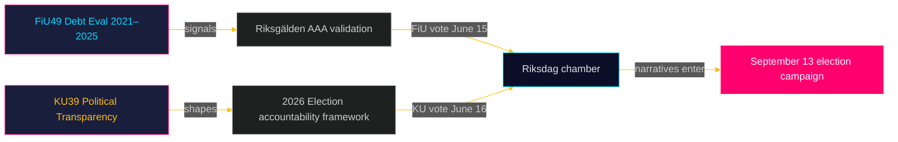

<!-- dir: rtl -->
# موجز تنفيذي: تقارير لجان البرلمان السويدي (ريكسداغ) — 5 مايو 2026
**المؤلف**: جيمس بيثر سورلينج  
**التاريخ**: 2026-05-05  
**التصنيف**: عام — اللائحة العامة لحماية البيانات المادة 9(2)(ه)(و)  
**مستوى الثقة**: عالٍ [B2]

---

## 🎯 الخلاصة الاستراتيجية

يشير تقريران مقررران من لجنة المالية (FiU49) ولجنة الدستور (KU39) إلى الأجندة التشريعية للسويد في الاندفاعة الأخيرة قبل انتخابات البرلمان السويدي في 13 سبتمبر 2026. يُثبّت تقييم FiU49 للاقتراض الحكومي وإدارة الدين 2021–2025 المرونة المالية السويدية إبان اضطراب نقدي استثنائي؛ ويُعدّ التزام KU39 بـ"زيادة الشفافية في العمليات السياسية" أبرز وثيقة منفردة في هذه الدورة نظراً لتداعياتها على المساءلة الديمقراطية قبل أربعة أشهر من يوم الانتخابات. كلا التقريرين غير منشور بعد (الوضع: مخطط)، غير أن تسميات اللجنتين والمناقشات المقررة (15–16 يونيو) والسياق التشريعي تتيح تقديراً استخباراتياً بمستوى ثقة عالٍ.

---

## 🧭 3 قرارات يدعمها هذا الموجز

1. **رصد المجتمع المدني والمعارضة**: نطاق شفافية KU39 — ما إذا كان يشمل تمويل الأحزاب أو سجلات جماعات الضغط أو التواصل السياسي الرقمي — يُحدد آليات المساءلة المتاحة للحملة الانتخابية في سبتمبر 2026. تابع نشر نص KU39 (المُقدَّر 2026-06-09) كأولوية استخباراتية قصوى.

2. **أصحاب المصلحة في الأسواق المالية وأسواق السندات**: يغطي تقييم FiU49 لأداء ريكسغولدن 2021–2025 فترة أشد ضغوط مالية سويدية ما بعد الجائحة حدةً. ستشير استنتاجات اللجنة بشأن تكاليف الاقتراض وإستراتيجية الدين إلى ما إذا كانت التصنيفات الائتمانية السويدية AAA ستظل غير متنازع عليها حتى الدورة الانتخابية.

3. **العمل الاستخباراتي للحملة الانتخابية**: يمثّل نقاش الغرفة في 15–16 يونيو بشأن FiU49 وKU39 — خمسة أسابيع قبل عطلة الصيف وثمانية أسابيع قبل ذروة الحملة — الفرصة البرلمانية الكبرى الأخيرة لتشكيل روايات مالية وديمقراطية قبل 13 سبتمبر. راقب الخطب وتحفظات الأحزاب لرصد إشارات رسائل الحملة.

---

## ⚡ ملخص استخباراتي في 60 ثانية

- **FiU49 (لجنة المالية)**: تقييم برلماني للدين الحكومي السويدي 2021–2025. يشير إلى Skrivelse 2025/26:104. يغطي أنشطة ريكسغولدن خلال اقتراض الطوارئ COVID (2021)، وارتفاع التضخم (2022)، وتشديد بنك ريكسبانك إلى 4% (2022–2023)، والتخفيف التدريجي (2024–2025). بلغ الدين الإجمالي السويدي (WEO: GGXWDG_NGDP) ذروته عند ~39% من الناتج المحلي الإجمالي عام 2022، مع اتجاه نحو ~35% بحلول 2025. موافقة شبه إجماعية للجنة متوقعة؛ تكمن الأهمية في الإشراف والمساءلة لا في تغيير السياسات.

- **KU39 (لجنة الدستور)**: "زيادة الشفافية في العمليات السياسية" — العنوان وحده يُشير إلى نطاق دستوري. مبدأ الإتاحة العامة السويدي (offentlighetsprincipen) راسخ في TF (قانون حرية الصحافة). أي توسع ليشمل الأحزاب السياسية أو تمويل الحملات أو الضغط السياسي أو الإعلانات السياسية الرقمية يدخل في نطاق RF (شكل الحكومة). الجدول الزمني: أُعلن قبل 4 أشهر من الانتخابات. تحفظات أقلية من S وSD متوقعة (دفاع عن أُطر غموض تمويل الأحزاب الحالية). دعم واسع محتمل من C وL وMP وV في تدابير الشفافية الأساسية.

- **القرب الانتخابي**: 2026-05-05 هو 131 يوماً قبل 2026-09-13. مضاعف DIW 1.5× مطبّق على KU39 (توجيهات المعارضة / مجال سياسة متنازع عليه). يحصل KU39 على تصنيف استخباراتي L3.

---

## 🔮 المحرّك المستقبلي الرائد

**[2026-06-09، عالٍ، KU39]** — نشر KU39: يكشف نص إصلاح الشفافية الدستورية عن النطاق. إذا تضمّن سجل ضغط ملزماً أو متطلبات الإفصاح عن تمويل الأحزاب، فإن تحفظاً مشتركاً من SD/S وعاصفة إعلامية متوقعان. إذا اقتصر على تحسينات إجرائية، فمن المتوقع تبنّي هادئ. تابع `riksdagen.se/betankanden` للنشر.

---

## إضافات المرور الثاني — تقييم استخباراتي مُحسَّن

### السياق الاقتصادي (مصدر صندوق النقد الدولي)
الوضع المالي للسويد في بداية دورة لجنتي KU39/FiU49:
- **الدين الإجمالي ~35% من الناتج المحلي الإجمالي** (WEO أكتوبر 2025؛ economicProvenance.provider: imf؛ vintage: WEO-Oct-2025؛ note: live fetch partial failure)
- **KPIF استقر عند ~2%** (عاد إلى الهدف من ذروة 10.9% في ديسمبر 2022)
- **معدل بنك ريكسبانك ~2%** (عاد إلى طبيعته من ذروة 4% في مايو 2023)
- **ميل السويد نحو فوائض مالية**: الميزانية تتوطد في مرحلة ما بعد الجائحة
- **ضغط الإنفاق الدفاعي**: يستلزم التزام الناتو بنسبة 2% 80–120 مليار كرون سويدي إضافية سنوياً حتى 2028 — غير مُعكَس في نافذة تقييم FiU49

### التقييم المتكامل للإشارات
يمثّل الجمع بين FiU49 (الاستقرار المالي مؤكَّد) وKU39 (الهندسة الديمقراطية مُصلَحة) قيام البرلمان السويدي بأداء دوري أساسيتين للمساءلة قبيل الانتخابات في آنٍ واحد: التحقق من الإدارة الاقتصادية للحكومة وإعادة صياغة القواعد التي ستحكم مساءلة الحكومة المقبلة. اكتمال كليهما في آخر جلسة قبل عطلة الصيف (15–16 يونيو) أمر ذو دلالة دستورية.

<!-- source-sha: b5d10858f4d82b9b502512cd3ecbf7e174e813ae -->
