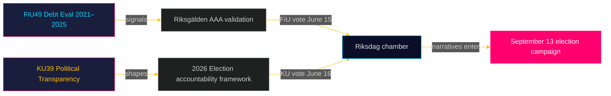

# Udøvende resume: Riksdag-udvalgsrapporter — 5. maj 2026
**Forfatter**: James Pether Sörling  
**Dato**: 2026-05-05  
**Klassifikation**: OFFENTLIG — GDPR Art. 9(2)(e)(g)  
**Konfidens**: HØJ [B2]

---

## 🎯 BLUF

To planlagte betænkninger fra Finansudvalget (FiU49) og Forfatningsudvalget (KU39) signalerer Danmarks lovgivningsdagsorden i den sidste sprint frem mod valget til Riksdag den 13. september 2026. FiU49's evaluering af statens lånoptagelse og gældsforvaltning 2021–2025 validerer Sveriges finansielle robusthed under ekstraordinær monetær turbulens; KU39's forpligtelse til "øget gennemsigtighed i politiske processer" er det enkelt mest betydningsfulde dokument i denne cyklus set i lyset af dets demokratiske ansvarlighedsimplikationer fire måneder før valgdagen. Begge betænkninger er endnu upublicerede (status: planlagt), men deres udvalgsdesignationer, planlagte debatter (15.–16. juni) og lovgivningsmæssige kontekst muliggør en efterretningsvurdering med høj konfidens.

---

## 🧭 3 beslutninger dette brief understøtter

1. **Overvågning af civilsamfund og opposition**: KU39's gennemsigtighedsomfang — om det dækker partifinansering, lobbyregistre eller digital politisk kommunikation — definerer, hvilke ansvarlighedsmekanismer der vil eksistere for valgkampen i september 2026. Hold øje med KU39's tekstoffentliggørelse (est. 2026-06-09) som første prioritet.

2. **Finansielle og obligationsmarkedsinteressenter**: FiU49's vurdering af Riksgälden's præstationer 2021–2025 dækker perioden med Sveriges skarpeste post-pandemiske finansielle stress. Udvalgets konklusioner om lånomkostninger og gældsstrategier vil signalere, om Sveriges AAA-kreditvurdering forbliver uomtvistet op til valget.

3. **Efterretningsarbejde i valgkampen**: Kammerdebatten den 15.–16. juni om FiU49 og KU39 — fem uger før sommerferien og otte uger inden kampagnen topper — udgør den sidste store parlamentariske mulighed for at forme finanspolitiske og demokratisk-ansvarlighedsnarrativer inden den 13. september. Overvåg taler og partireservationer for kampagnebudskabssignaler.

---

## ⚡ 60-sekunders efterretningsresumé

- **FiU49 (Finansudvalget)**: Parlamentarisk evaluering af Sveriges statsgæld 2021–2025. Refererer til Skrivelse 2025/26:104. Dækker Riksgälden's indsats under COVID-nødlåntagning (2021), inflationsstigning (2022), Riksbankens stramning til 4 % (2022–2023), gradvis lempelse (2024–2025). Sveriges bruttogæld (WEO: GGXWDG_NGDP) toppede ~39 % af BNP i 2022, med tendens mod ~35 % i 2025. Næsten enstemmig udvalgsvedtagelse forventes; signifikansen er overvågning og ansvarlighed, ikke politikændringer.

- **KU39 (Forfatningsudvalget)**: "Øget gennemsigtighed i politiske processer" — titlen alene signalerer forfatningsmæssig rækkevidde. Sveriges offentlighedsprincip (offentlighetsprincipen) er indskrevet i TF (Trykkefrihedsloven). Enhver udvidelse til politiske partier, kampagnefinansiering, lobbying eller digital politisk annoncering træder ind på RF's (Regeringsformens) territorium. Timing: annonceret 4 måneder før valget. Minoritetsreservationer fra S og SD forventes (forsvar af nuværende partifinansieringsopacitet). Tværblok-opbakning sandsynlig fra C, L, MP, V om centrale gennemsigtighedsforanstaltninger.

- **Valgproximitet**: 2026-05-05 er 131 dage fra 2026-09-13. DIW-multiplikator 1,5× anvendt for KU39 (oppositionsmotioner / omtvistet politikområde). KU39 modtager L3 efterretningsklassificering.

---

## 🔮 Ledende fremtidig trigger

**[2026-06-09, Høj, KU39]** — KU39-offentliggørelse: forfatningens gennemsigtighedsreformtekst afslører omfanget. Hvis den inkluderer bindende lobbyregister eller partifinansieringsrapportering, forventes fælles SD/S-reservation og mediastorm. Hvis begrænset til proceduremæssige forbedringer, forventes stille vedtagelse. Hold øje med `riksdagen.se/betankanden` for offentliggørelse.

---

## Tilføjelser fra Pass 2 — Forbedret efterretningsvurdering

### Økonomisk kontekst (IMF-kilde)
Sveriges finansielle stilling ved indgangen til KU39/FiU49-udvalgets cyklus:
- **Bruttogæld ~35 % af BNP** (WEO Oct-2025; economicProvenance.provider: imf; vintage: WEO-Oct-2025; note: live fetch partial failure)
- **KPIF stabiliseret ~2 %** (vendt tilbage til mål fra top på 10,9 % december 2022)
- **Riksbank-rente ~2 %** (normaliseret fra top på 4 % maj 2023)
- **Sveriges tendens til finansielt overskud**: Budgettet konsolideres efter pandemien
- **Forsvarspres**: NATO 2 %-forpligtelse kræver 80–120 mia. SEK yderligere pr. år til 2028 — ikke afspejlet i FiU49's evalueringsvindue

### Integreret signalvurdering
Kombinationen af FiU49 (finansiel stabilitet bekræftet) + KU39 (demokratisk arkitektur reformeres) repræsenterer Riksdagen, der fuldfører to væsentlige forvalgansvarlighedsfunktioner simultant: validering af regeringens økonomiske forvaltning og omformning af de regler, hvorunder den næste regering vil blive holdt ansvarlig. At begge afsluttes i den sidste session inden sommerferie (15.–16. juni) er konstitutionelt signifikant.

<!-- source-sha: b5d10858f4d82b9b502512cd3ecbf7e174e813ae -->
