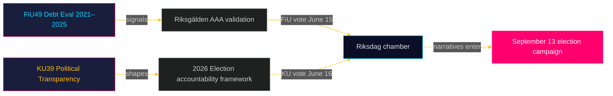

# Exekutivbriefing: Rikstag-Ausschussberichte — 5. Mai 2026
**Autor**: James Pether Sörling  
**Datum**: 2026-05-05  
**Klassifizierung**: ÖFFENTLICH — DSGVO Art. 9(2)(e)(g)  
**Konfidenz**: HOCH [B2]

---

## 🎯 BLUF

Zwei geplante Berichte des Finanzausschusses (FiU49) und des Verfassungsausschusses (KU39) signalisieren Schwedens Gesetzgebungsagenda in der letzten Phase vor den Riksdag-Wahlen am 13. September 2026. FiU49s Bewertung der staatlichen Kreditaufnahme und Schulden­verwaltung 2021–2025 bestätigt Schwedens finanzielle Resilienz unter außerordentlicher geld­politischer Turbulenz; KU39s Zusage zur „erhöhten Transparenz in politischen Prozessen" ist das einzel­bedeutsamste Dokument dieses Zyklus angesichts seiner demokratischen Rechenschafts­pflicht­implikationen vier Monate vor dem Wahltag. Beide Berichte sind noch unveröffentlicht (Status: geplant), aber ihre Ausschussbezeichnungen, geplanten Debatten (15.–16. Juni) und der gesetzgeberische Kontext ermöglichen eine Geheimdiensteinschätzung mit hoher Konfidenz.

---

## 🧭 3 Entscheidungen, die dieses Briefing unterstützt

1. **Zivilgesellschafts- und Oppositionsüberwachung**: KU39s Transparenzumfang — ob er Parteienfinanzierung, Lobbyverzeichnisse oder digitale politische Kommunikation abdeckt — definiert, welche Rechenschaftsmechanismen für den Wahlkampf im September 2026 bestehen werden. Verfolgen Sie die Textveröffentlichung von KU39 (geschätzt 2026-06-09) als primäre Geheimdienstpriorität.

2. **Fiskalpolitische und Anleihenmarktstakeholder**: FiU49s Bewertung der Riksgälden-Leistung 2021–2025 deckt den Zeitraum des schärfsten post-pandemischen Finanzstresses Schwedens ab. Die Schlussfolgerungen des Ausschusses zu Kreditkosten und Schulden­strategie werden signalisieren, ob Schwedens AAA-Kreditrating bis in den Wahlzyklus hinein unbestritten bleibt.

3. **Wahlkampf-Geheimdienstarbeit**: Die Kammerdebatte vom 15.–16. Juni zu FiU49 und KU39 — fünf Wochen vor der Sommerrecess und acht Wochen vor dem Kampagnen­höhepunkt — repräsentiert die letzte große parlamentarische Gelegenheit, fiskalpolitische und demokratische Rechenschaftsnarrative vor dem 13. September zu gestalten. Verfolgen Sie Reden und Parteivorbehalte auf Kampagnenbotschaftssignale hin.

---

## ⚡ 60-Sekunden-Geheimdienstzusammenfassung

- **FiU49 (Finanzausschuss)**: Parlamentarische Bewertung der schwedischen Staatsschulden 2021–2025. Bezieht sich auf Skrivelse 2025/26:104. Deckt Riksgäldens Tätigkeit während der COVID-Notleiheaufnahme (2021), des Inflationsanstiegs (2022), der Riksbank-Straffung auf 4 % (2022–2023) und der schrittweisen Lockerung (2024–2025) ab. Schwedens Bruttoschuld (WEO: GGXWDG_NGDP) erreichte ~39 % des BIP im Jahr 2022, mit einem Trend in Richtung ~35 % bis 2025. Nahezu einstimmige Ausschusszustimmung erwartet; die Bedeutung liegt in Überwachung und Rechenschaftspflicht, nicht in Politikänderungen.

- **KU39 (Verfassungsausschuss)**: „Erhöhte Transparenz in politischen Prozessen" — allein der Titel signalisiert verfassungsrechtliche Reichweite. Schwedens Öffentlichkeitsprinzip (offentlighetsprincipen) ist im TF (Pressefreiheitsgesetz) verankert. Jede Ausweitung auf politische Parteien, Kampagnenfinanzierung, Lobbying oder digitale politische Werbung berührt das Territorium des RF (Regierungsform). Zeitpunkt: vier Monate vor der Wahl angekündigt. Minderheitsvorbehalte von S und SD erwartet (Verteidigung der bestehenden Parteien-Finanzierungsopazitätsrahmen). Breite Unterstützung wahrscheinlich von C, L, MP, V bei Kernthemen der Transparenz.

- **Wahlnähe**: 2026-05-05 liegt 131 Tage vor dem 2026-09-13. DIW-Multiplikator 1,5× auf KU39 angewendet (Oppositionsmotionen / umstrittenes Politikfeld). KU39 erhält L3-Geheimdienstklassifizierung.

---

## 🔮 Führender künftiger Auslöser

**[2026-06-09, Hoch, KU39]** — KU39-Veröffentlichung: Der Text der verfassungsrechtlichen Transparenzreform offenbart den Umfang. Wenn er ein verbindliches Lobbyverzeichnis oder Parteifinanzierungs-Berichtspflichten enthält, ist ein gemeinsamer SD/S-Vorbehalt und ein Mediensturm zu erwarten. Wenn auf Verfahrensverbesserungen beschränkt, ist stille Annahme zu erwarten. Verfolgen Sie `riksdagen.se/betankanden` für die Veröffentlichung.

---

## Pass 2-Ergänzungen — Verbesserte Geheimdienstbewertung

### Wirtschaftlicher Kontext (IMF-Quelle)
Schwedens Finanzlage zu Beginn des KU39/FiU49-Ausschusszyklus:
- **Bruttoschulden ~35 % des BIP** (WEO Okt-2025; economicProvenance.provider: imf; vintage: WEO-Oct-2025; note: live fetch partial failure)
- **KPIF stabilisiert ~2 %** (zurückgekehrt zum Ziel vom Höchststand von 10,9 % im Dezember 2022)
- **Riksbank-Zinssatz ~2 %** (normalisiert vom Höchststand von 4 % im Mai 2023)
- **Schwedens Tendenz zu Haushaltsüberschüssen**: Das Budget konsolidiert sich nach der Pandemie
- **Verteidigungsausgabendruck**: NATO-2%-Verpflichtung erfordert 80–120 Mrd. SEK zusätzlich pro Jahr bis 2028 — nicht im Bewertungsfenster von FiU49 widergespiegelt

### Integrierte Signalbewertung
Die Kombination aus FiU49 (Finanzstabilität bestätigt) + KU39 (demokratische Architektur reformiert) stellt dar, wie der Riksdag gleichzeitig zwei wesentliche Vorwahl-Rechenschaftspflichtfunktionen erfüllt: Validierung des Wirtschaftsmanagements der Regierung und Umgestaltung der Regeln, unter denen die nächste Regierung zur Rechenschaft gezogen wird. Dass beide im letzten Session vor der Sommerrecess (15.–16. Juni) abgeschlossen werden, ist verfassungsrechtlich bedeutsam.

<!-- source-sha: b5d10858f4d82b9b502512cd3ecbf7e174e813ae -->
