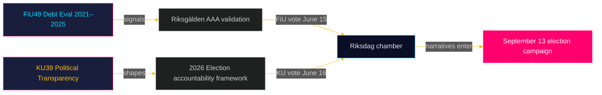

# Resumen ejecutivo: Informes de comisiones del Riksdag — 5 de mayo de 2026
**Autor**: James Pether Sörling  
**Fecha**: 2026-05-05  
**Clasificación**: PÚBLICO — RGPD Art. 9(2)(e)(g)  
**Confianza**: ALTA [B2]

---

## 🎯 BLUF

Dos informes programados de la Comisión de Finanzas (FiU49) y la Comisión Constitucional (KU39) señalan la agenda legislativa de Suecia en el último sprint antes de las elecciones al Riksdag del 13 de septiembre de 2026. La evaluación de FiU49 sobre el endeudamiento público y la gestión de la deuda 2021–2025 valida la resiliencia financiera de Suecia durante una turbulencia monetaria extraordinaria; el compromiso de KU39 con la «mayor transparencia en los procesos políticos» es el documento individualmente más significativo de este ciclo dadas sus implicaciones de responsabilidad democrática cuatro meses antes del día de las elecciones. Ambos informes aún no están publicados (estado: programado), pero sus designaciones de comisión, debates programados (15–16 de junio) y contexto legislativo permiten una evaluación de inteligencia con alta confianza.

---

## 🧭 3 decisiones que respalda este informe

1. **Vigilancia de la sociedad civil y la oposición**: El alcance de la transparencia de KU39 — si cubre financiación de partidos, registros de cabilderos o comunicación política digital — definirá qué mecanismos de rendición de cuentas existirán para la campaña electoral de septiembre de 2026. Siga la publicación del texto de KU39 (est. 2026-06-09) como prioridad principal de inteligencia.

2. **Partes interesadas de los mercados fiscales y de bonos**: La evaluación de FiU49 del desempeño del Riksgälden 2021–2025 cubre el período de mayor estrés financiero post-pandémico de Suecia. Las conclusiones del comité sobre costos de endeudamiento y estrategia de deuda señalarán si la calificación crediticia AAA de Suecia permanece incuestionable hasta el ciclo electoral.

3. **Labor de inteligencia electoral**: El debate en cámara del 15–16 de junio sobre FiU49 y KU39 — cinco semanas antes del receso de verano y ocho semanas antes del pico de la campaña — representa la última gran oportunidad parlamentaria para moldear narrativas fiscales y de responsabilidad democrática antes del 13 de septiembre. Supervise discursos y reservas de partidos para detectar señales de mensajes de campaña.

---

## ⚡ Resumen de inteligencia en 60 segundos

- **FiU49 (Comisión de Finanzas)**: Evaluación parlamentaria de la deuda pública sueca 2021–2025. Hace referencia a Skrivelse 2025/26:104. Cubre las actividades del Riksgälden durante los préstamos de emergencia COVID (2021), el aumento de inflación (2022), el endurecimiento del Riksbank al 4 % (2022–2023) y la relajación gradual (2024–2025). La deuda bruta sueca (WEO: GGXWDG_NGDP) alcanzó ~39 % del PIB en 2022, con tendencia hacia ~35 % para 2025. Se espera aprobación casi unánime del comité; la importancia reside en la supervisión y la rendición de cuentas, no en cambios de política.

- **KU39 (Comisión Constitucional)**: «Mayor transparencia en los procesos políticos» — el título solo señala alcance constitucional. El principio de publicidad de Suecia (offentlighetsprincipen) está consagrado en el TF (Ley de Libertad de Prensa). Cualquier extensión a partidos políticos, financiación de campañas, cabildeo o publicidad política digital adentra en el territorio del RF (Forma de Gobierno). Cronología: anunciado 4 meses antes de las elecciones. Se esperan reservas de minoría de S y SD (defensa de los marcos de opacidad de financiación de partidos actuales). Amplio apoyo probable de C, L, MP, V en medidas básicas de transparencia.

- **Proximidad electoral**: El 2026-05-05 es 131 días antes del 2026-09-13. Multiplicador DIW 1,5× aplicado para KU39 (mociones de oposición / área de política disputada). KU39 recibe clasificación de inteligencia L3.

---

## 🔮 Activador futuro principal

**[2026-06-09, Alta, KU39]** — Publicación KU39: el texto de la reforma de transparencia constitucional revela el alcance. Si incluye un registro obligatorio de cabilderos o requisitos de declaración de financiación de partidos, se esperan una reserva conjunta SD/S y una tormenta mediática. Si se limita a mejoras procedimentales, se espera una adopción silenciosa. Siga `riksdagen.se/betankanden` para la publicación.

---

## Adiciones del Pase 2 — Evaluación de inteligencia mejorada

### Contexto económico (fuente FMI)
Posición financiera de Suecia al inicio del ciclo de comisiones KU39/FiU49:
- **Deuda bruta ~35 % del PIB** (WEO oct. 2025; economicProvenance.provider: imf; vintage: WEO-Oct-2025; note: live fetch partial failure)
- **KPIF estabilizado ~2 %** (regresó al objetivo desde un pico de 10,9 % en diciembre de 2022)
- **Tasa del Riksbank ~2 %** (normalizado desde un pico de 4 % en mayo de 2023)
- **Tendencia de Suecia a los superávits fiscales**: El presupuesto se consolida después de la pandemia
- **Presión del gasto en defensa**: El compromiso del 2 % de la OTAN requiere 80–120 mil millones de SEK adicionales por año hasta 2028 — no reflejado en la ventana de evaluación de FiU49

### Evaluación integrada de señales
La combinación FiU49 (estabilidad financiera confirmada) + KU39 (arquitectura democrática reformada) representa al Riksdag cumpliendo simultáneamente dos funciones esenciales de rendición de cuentas pre-electoral: validación de la gestión económica del gobierno y remodelación de las reglas bajo las cuales el próximo gobierno será responsabilizado. Que ambas se completen en la última sesión antes del receso de verano (15–16 de junio) es constitucionalmente significativo.

<!-- source-sha: b5d10858f4d82b9b502512cd3ecbf7e174e813ae -->
