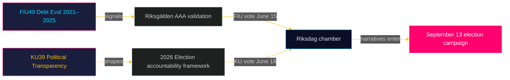

# Johtava tiivistelmä: Riksdagin valiokuntamietinnöt — 5. toukokuuta 2026
**Tekijä**: James Pether Sörling  
**Päiväys**: 2026-05-05  
**Luokitus**: JULKINEN — GDPR Art. 9(2)(e)(g)  
**Luotettavuus**: KORKEA [B2]

---

## 🎯 BLUF

Kaksi suunniteltua mietintöä Valtiovarainvaliokunnalta (FiU49) ja Perustuslakivaliokunnalta (KU39) viestivät Ruotsin lainsäädäntöagendasta viimeisessä vaaleja edeltävässä spurtti­vaiheessa ennen 13. syyskuuta 2026 pidettäviä Riksdag-vaaleja. FiU49:n arvio valtion lainanotosta ja velanhallin­nasta 2021–2025 vahvistaa Ruotsin taloudellisen resilienssin poikkeuksellisen rahapolitiikan turbulenssin aikana; KU39:n lupaus "poliittisten prosessien lisääntyvästä läpinäkyvyydestä" on tämän syklin yksittäisesti merkittävin asiakirja sen demokraattisten vastuullisuusvaikutusten vuoksi neljä kuukautta ennen vaalia. Molemmat mietinnöt ovat vielä julkaisemattomia (tila: suunniteltu), mutta niiden valiokuntamerkinnät, suunnitellut väittelyt (15.–16. kesäkuuta) ja lainsäädäntökonteksti mahdollistavat korkean luotettavuuden tiedusteluarvion.

---

## 🧭 3 päätöstä, joita tämä tiivistelmä tukee

1. **Kansalaisyhteiskunnan ja opposition seuranta**: KU39:n läpinäkyvyyden laajuus — kattaako se puolueiden rahoituksen, lobba­usrekisterit tai digitaalisen poliittisen viestinnän — määrittelee, millaisia vastuumekanismeja on käytettävissä syyskuun 2026 vaali­kampanjaan. Seuraa KU39:n tekstijulkaisua (arvio 2026-06-09) ensisijaisena tiedustelu­prioriteettina.

2. **Fiskaalisten ja joukko­laina­markkinoiden sidosryhmät**: FiU49:n arvio Riksgäldenin suorituksesta 2021–2025 kattaa Ruotsin terävimmän pandemianjälkeisen taloudellisen stressin ajanjakson. Valiokunnan päätelmät lainakustan­nuksista ja velkastrategiasta viestivät, säilyykö Ruotsin AAA-luottoluokitus kyseenalaistamattomana vaalisykliin mentäessä.

3. **Vaalikampanjan tiedustelutyö**: Kamarin väittelyt 15.–16. kesäkuuta FiU49:stä ja KU39:stä — viisi viikkoa ennen kesäloman alkamista ja kahdeksan viikkoa ennen kampanjan huipentumista — edustavat viimeistä suurta parlamentaarista mahdollisuutta muovata finanssipoliittisia ja demokraattis-vastuullisuus­narratiiveja ennen 13. syyskuuta. Seuraa puheenvuoroja ja puoluereservaatioita kampanjaviesti­signaalien varalta.

---

## ⚡ 60 sekunnin tiedusteluyhteenveto

- **FiU49 (Valtiovarainvaliokunta)**: Parlamentaarinen arvio Ruotsin valtion velasta 2021–2025. Viittaa Skrivelse 2025/26:104:een. Kattaa Riksgäldenin toiminnan COVID-hätälainanoton (2021), inflaatiopiikin (2022), Riksbankin kiristämisen 4 prosenttiin (2022–2023) ja asteittaisen helpottamisen (2024–2025) aikana. Ruotsin bruttovelan (WEO: GGXWDG_NGDP) huippu oli ~39 % BKT:stä vuonna 2022, trendinä kohti ~35 % vuoteen 2025. Lähes yksimielinen valiokunnan hyväksyntä odotettavissa; merkitys on seurannassa ja vastuun­velvoittamisessa, ei politiikkamuutoksissa.

- **KU39 (Perustuslakivaliokunta)**: "Poliittisten prosessien lisääntyvä läpinäkyvyys" — pelkkä otsikko viestii perustuslaillisesta ulottuvuudesta. Ruotsin julkisuusperiaate (offentlighetsprincipen) on kirjattu TF:ään (Painovapauslakiin). Mikä tahansa laajennus poliittisiin puolueisiin, kampanjarahoitukseen, lobbaamiseen tai digitaaliseen poliittiseen mainontaan astuu RF:n (Hallitusmuodon) alueelle. Ajankohta: ilmoitettu 4 kuukautta ennen vaalia. Vähemmistöreservaatioita S:ltä ja SD:ltä odotetaan (nykyisten puolueiden rahoitus­läpinäkymättömyyskehysten puolustus). Laajapohjainen tuki todennäköinen C:ltä, L:ltä, MP:ltä, V:ltä keskeisten läpinäkyvyys­toimenpiteiden osalta.

- **Vaaliläheisyys**: 2026-05-05 on 131 päivää ennen 2026-09-13. DIW-kerroin 1,5× sovellettu KU39:lle (oppositiomotiot / kiistelty politiikka-alue). KU39 saa L3 tiedustelu­luokituksen.

---

## 🔮 Tärkein tuleva laukaisija

**[2026-06-09, Korkea, KU39]** — KU39:n julkaisu: perustuslaillisen läpinäkyvyysreformin teksti paljastaa laajuuden. Jos se sisältää sitovan lobbausrekisterin tai puolueen rahoituksen julkistamisen, odotetaan yhteistä SD/S-reservaatiota ja mediastormiä. Jos rajoitettu menettelyllisiin parannuksiin, odotetaan hiljaista läpimenoa. Seuraa `riksdagen.se/betankanden` offentliggörандеа varten.

---

## Pass 2 -lisäykset — Parannettu tiedusteluarvio

### Taloudellinen konteksti (IMF-lähde)
Ruotsin taloudellinen asema KU39/FiU49-valiokuntasyklin alkaessa:
- **Bruttovelka ~35 % BKT:stä** (WEO Oct-2025; economicProvenance.provider: imf; vintage: WEO-Oct-2025; note: live fetch partial failure)
- **KPIF vakiintunut ~2 %** (palannut tavoitteeseen huipusta 10,9 % joulukuussa 2022)
- **Riksbankin korko ~2 %** (normalisoitu huipusta 4 % toukokuussa 2023)
- **Ruotsin taipumus finanssiylijäämään**: Budjetti konsolidoituu pandemianjälkeisestä tilanteesta
- **Puolustusmenopaine**: NATO 2 % -sitoumus edellyttää 80–120 miljardia SEK lisää vuosittain vuoteen 2028 mennessä — ei heijastunut FiU49:n arviointijaksoon

### Integroitu signaalin arvio
FiU49:n (vahvistettu taloudellinen vakaus) + KU39:n (demokraattisen arkkitehtuurin uudistaminen) yhdistelmä edustaa Riksdagin samanaikaista kahden keskeisen vaaleja edeltävän vastuullisuus­tehtävän täyttymistä: hallituksen taloushoidon validointi ja niiden sääntöjen muovaaminen, joiden nojalla seuraavaa hallitusta tullaan arvioimaan. Molempien valmistuminen viimeisessä kesälomaa edeltävässä istunnossa (15.–16. kesäkuuta) on perustuslaillisesti merkittävää.

<!-- source-sha: b5d10858f4d82b9b502512cd3ecbf7e174e813ae -->
