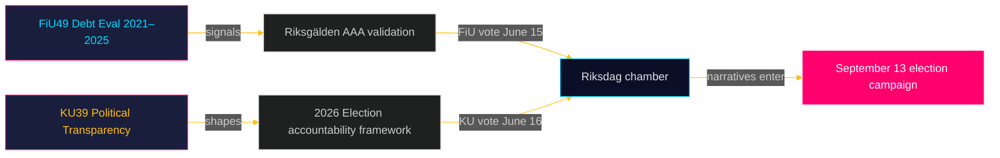

# Note de synthèse exécutive : Rapports des commissions du Riksdag — 5 mai 2026
**Auteur** : James Pether Sörling  
**Date** : 2026-05-05  
**Classification** : PUBLIC — RGPD Art. 9(2)(e)(g)  
**Confiance** : ÉLEVÉE [B2]

---

## 🎯 BLUF

Deux rapports programmés de la commission des finances (FiU49) et de la commission constitutionnelle (KU39) signalent l'agenda législatif de la Suède dans le dernier sprint avant les élections au Riksdag du 13 septembre 2026. L'évaluation par FiU49 de l'emprunt public et de la gestion de la dette 2021–2025 valide la résilience financière de la Suède lors d'une turbulence monétaire exceptionnelle ; l'engagement de KU39 en faveur d'une « transparence accrue dans les processus politiques » est le document isolément le plus significatif de ce cycle, compte tenu de ses implications en matière de responsabilité démocratique quatre mois avant le jour des élections. Les deux rapports ne sont pas encore publiés (statut : programmé), mais leurs désignations de commission, leurs débats prévus (15–16 juin) et leur contexte législatif permettent une évaluation de renseignement à haute confiance.

---

## 🧭 3 décisions que cette note soutient

1. **Surveillance de la société civile et de l'opposition** : La portée de la transparence de KU39 — couvrant le financement des partis, les registres des lobbyistes ou les communications politiques numériques — définira les mécanismes de responsabilité disponibles pour la campagne électorale de septembre 2026. Suivez la publication du texte de KU39 (estimée au 2026-06-09) comme priorité de renseignement primaire.

2. **Parties prenantes des marchés fiscaux et obligataires** : L'évaluation par FiU49 des performances du Riksgälden 2021–2025 couvre la période de stress financier post-pandémique le plus aigu de la Suède. Les conclusions du comité sur les coûts d'emprunt et la stratégie d'endettement indiqueront si la notation AAA de la Suède reste incontestée jusqu'au cycle électoral.

3. **Travail de renseignement électoral** : Le débat en chambre des 15–16 juin sur FiU49 et KU39 — cinq semaines avant la pause estivale et huit semaines avant le pic de la campagne — représente la dernière grande opportunité parlementaire de façonner les récits budgétaires et de responsabilité démocratique avant le 13 septembre. Surveillez les discours et les réserves des partis pour détecter des signaux de messages de campagne.

---

## ⚡ Résumé de renseignement en 60 secondes

- **FiU49 (Commission des finances)** : Évaluation parlementaire de la dette publique suédoise 2021–2025. Fait référence à Skrivelse 2025/26:104. Couvre les activités du Riksgälden lors des emprunts d'urgence COVID (2021), de la flambée de l'inflation (2022), du resserrement de la Riksbank à 4 % (2022–2023) et de l'assouplissement progressif (2024–2025). La dette brute suédoise (WEO : GGXWDG_NGDP) a culminé à ~39 % du PIB en 2022, avec une tendance vers ~35 % d'ici 2025. Approbation quasi unanime du comité attendue ; l'importance réside dans la surveillance et la responsabilité, non dans les changements de politique.

- **KU39 (Commission constitutionnelle)** : « Transparence accrue dans les processus politiques » — le titre seul signale une portée constitutionnelle. Le principe de publicité suédois (offentlighetsprincipen) est ancré dans le TF (loi sur la liberté de la presse). Toute extension aux partis politiques, au financement des campagnes, au lobbying ou à la publicité politique numérique empiète sur le territoire du RF (forme de gouvernement). Calendrier : annoncé 4 mois avant les élections. Des réserves minoritaires de S et SD attendues (défense des cadres d'opacité du financement des partis actuels). Large soutien probable de C, L, MP, V sur les mesures de transparence fondamentales.

- **Proximité électorale** : Le 2026-05-05 est à 131 jours du 2026-09-13. Multiplicateur DIW 1,5× appliqué pour KU39 (motions d'opposition / domaine politique contesté). KU39 reçoit une classification de renseignement L3.

---

## 🔮 Déclencheur futur principal

**[2026-06-09, Élevée, KU39]** — Publication KU39 : le texte de la réforme de la transparence constitutionnelle révèle la portée. S'il inclut un registre obligatoire des lobbyistes ou des obligations de déclaration du financement des partis, une réserve conjointe SD/S et une tempête médiatique sont à prévoir. Si limité à des améliorations procédurales, une adoption discrète est attendue. Suivez `riksdagen.se/betankanden` pour la publication.

---

## Compléments Pass 2 — Évaluation de renseignement améliorée

### Contexte économique (source FMI)
Position financière de la Suède au début du cycle des commissions KU39/FiU49 :
- **Dette brute ~35 % du PIB** (PEM oct. 2025 ; economicProvenance.provider: imf ; vintage : WEO-Oct-2025 ; note : échec partiel de récupération en direct)
- **KPIF stabilisé ~2 %** (revenu à l'objectif depuis un pic de 10,9 % en décembre 2022)
- **Taux de la Riksbank ~2 %** (normalisé depuis un pic de 4 % en mai 2023)
- **Tendance de la Suède aux excédents budgétaires** : Le budget se consolide après la pandémie
- **Pression des dépenses de défense** : L'engagement des 2 % de l'OTAN nécessite 80–120 milliards de SEK supplémentaires par an jusqu'en 2028 — non reflété dans la fenêtre d'évaluation de FiU49

### Évaluation intégrée des signaux
La combinaison FiU49 (stabilité financière confirmée) + KU39 (architecture démocratique réformée) représente le Riksdag accomplissant simultanément deux fonctions essentielles de responsabilité pré-électorale : validation de la gestion économique du gouvernement et remodelage des règles sous lesquelles le prochain gouvernement sera tenu responsable. Que les deux soient finalisées lors de la dernière session avant la pause estivale (15–16 juin) est constitutionnellement significatif.

<!-- source-sha: b5d10858f4d82b9b502512cd3ecbf7e174e813ae -->
